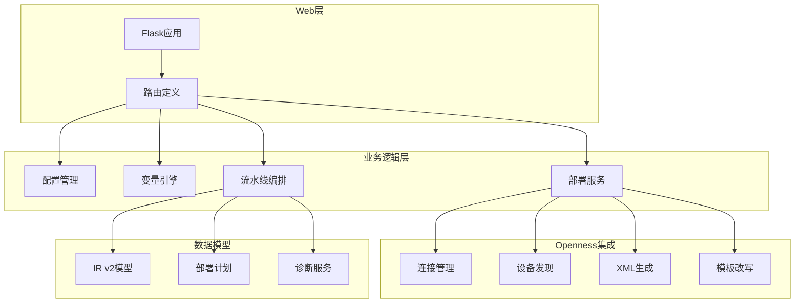
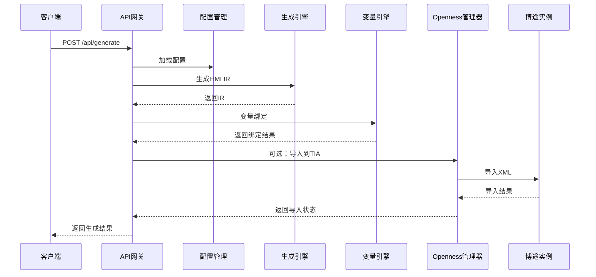
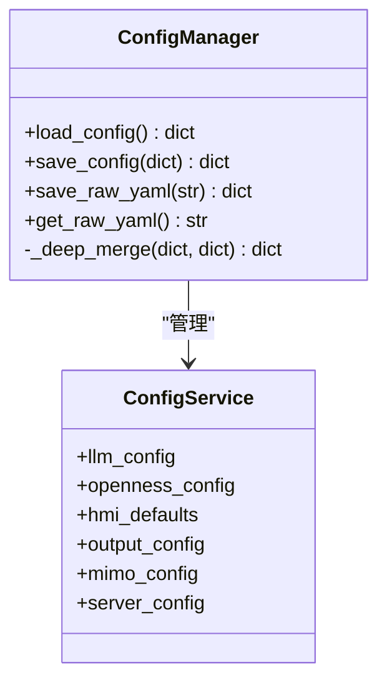
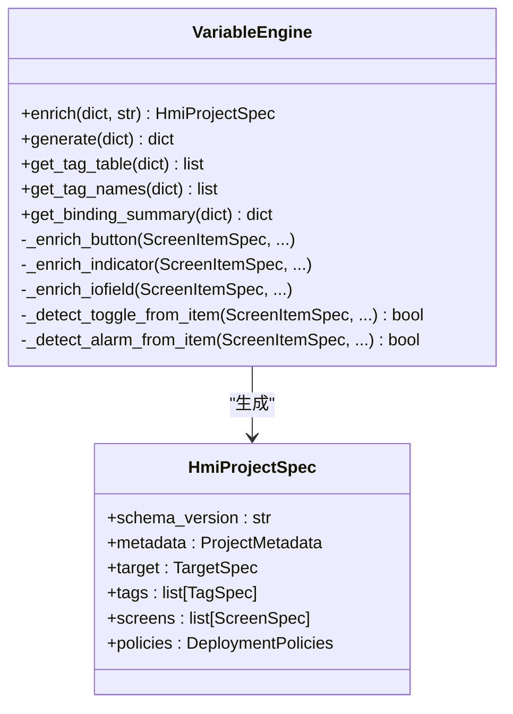
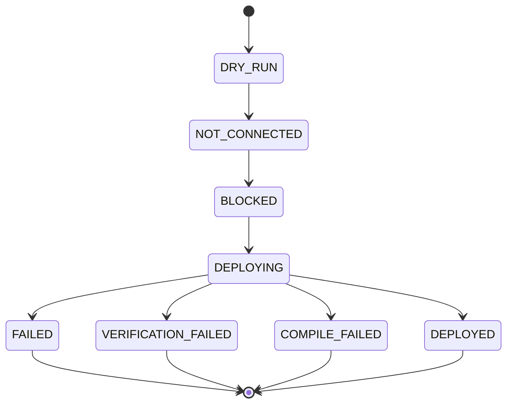
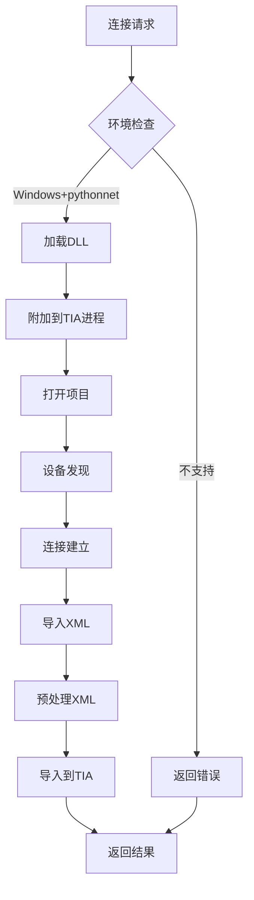
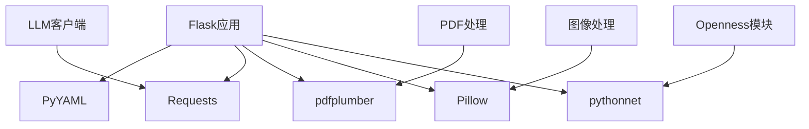
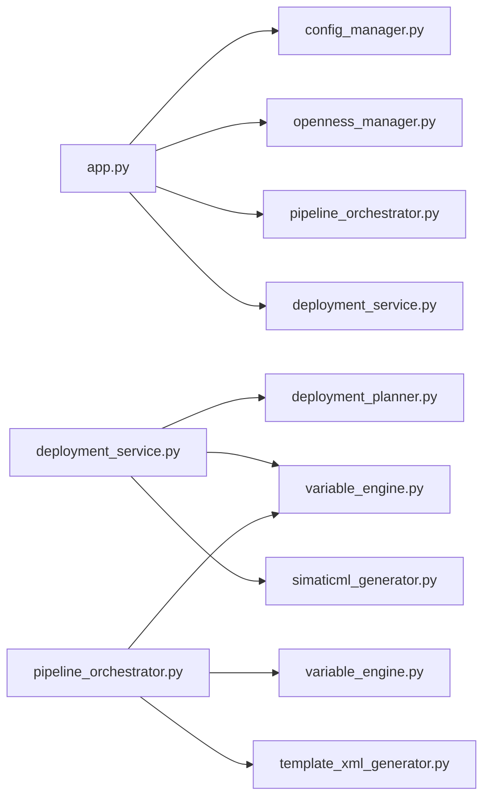

# API参考

<cite>
**本文档引用的文件**
- [app.py](file://app.py)
- [config.yaml](file://config.yaml)
- [config_manager.py](file://backend/config_manager.py)
- [openness_manager.py](file://backend/openness_manager.py)
- [ir_v2.py](file://backend/domain/ir_v2.py)
- [deployment_service.py](file://backend/services/deployment_service.py)
- [deployment_planner.py](file://backend/planners/deployment_planner.py)
- [pipeline_orchestrator.py](file://backend/pipeline_orchestrator.py)
- [variable_engine.py](file://backend/variable_engine.py)
- [simaticml_generator.py](file://backend/simaticml_generator.py)
- [template_xml_generator.py](file://backend/template_xml_generator.py)
- [requirements.txt](file://requirements.txt)
</cite>

## 目录
1. [简介](#简介)
2. [项目结构](#项目结构)
3. [核心组件](#核心组件)
4. [架构概览](#架构概览)
5. [详细组件分析](#详细组件分析)
6. [依赖分析](#依赖分析)
7. [性能考虑](#性能考虑)
8. [故障排除指南](#故障排除指南)
9. [结论](#结论)
10. [附录](#附录)

## 简介
Siemens HMI Assistant 是一个基于 Flask 的 RESTful API 服务，提供 HMI 画面设计自动化、Openness 集成和部署流水线管理。该系统支持多种 HMI 类型（Basic、Comfort、Unified），提供从需求描述到博途项目部署的完整工作流。

## 项目结构
项目采用模块化架构，主要包含以下核心模块：

**图表来源**
- [app.py:1-966](file://app.py#L1-L966)
- [config_manager.py:1-142](file://backend/config_manager.py#L1-L142)

**章节来源**
- [app.py:1-966](file://app.py#L1-L966)
- [config.yaml:1-343](file://config.yaml#L1-L343)

## 核心组件

### 配置管理API
系统提供完整的配置管理功能，支持结构化配置和原始 YAML 编辑模式。

**配置API端点**
- `GET /api/config` - 读取配置（结构化 + 原始 YAML）
- `POST /api/config` - 保存配置（结构化）
- `POST /api/config/raw` - 保存原始 YAML

**配置结构**
系统配置包含多个子模块：
- LLM提供商配置（DeepSeek、OpenAI兼容）
- Openness连接配置（TIA Portal集成）
- HMI默认设置（分辨率、类型、字体）
- 输出配置（导出目录、编码）
- MiMo视觉审查配置

**章节来源**
- [app.py:84-109](file://app.py#L84-L109)
- [config_manager.py:108-142](file://backend/config_manager.py#L108-L142)
- [config.yaml:1-343](file://config.yaml#L1-L343)

### 生成API
提供两种生成模式：基础生成和带视觉审查的多阶段流水线。

**生成API端点**
- `POST /api/generate` - 基础流式生成（SSE）
- `POST /api/generate/with_review` - 带MiMo审查的多阶段流水线

**生成流程**
1. 接收用户需求和可选附件
2. LLM对话生成HMI IR
3. IR校验和变量绑定
4. 可选的MiMo视觉审查
5. 生成SimaticML XML或模板XML

**章节来源**
- [app.py:166-267](file://app.py#L166-L267)
- [pipeline_orchestrator.py:131-354](file://backend/pipeline_orchestrator.py#L131-L354)

### Openness集成API
提供完整的博途Openness集成功能，支持设备连接、画面导入导出和能力查询。

**Openness API端点**
- `GET /api/openness/diagnose` - 诊断Openness环境
- `GET /api/openness/status` - 获取连接状态
- `POST /api/openness/connect` - 连接到博途
- `POST /api/openness/import` - 导入画面到博途
- `POST /api/openness/export-reference` - 导出参考画面
- `POST /api/openness/export-template` - 导出模板XML
- `POST /api/build/template-xml` - 生成模板XML
- `POST /api/openness/sync-tags` - 同步变量到TIA
- `POST /api/openness/disconnect` - 断开连接

**章节来源**
- [app.py:316-511](file://app.py#L316-L511)
- [openness_manager.py:103-800](file://backend/openness_manager.py#L103-L800)

### 部署API（V3.0）
提供新的部署流水线API，支持完整的HMI项目部署。

**部署API端点**
- `POST /api/hmi/plan` - 构建部署计划
- `GET /api/hmi/capabilities` - 查询设备能力
- `GET /api/hmi/runtime-metadata` - 获取运行时元数据
- `POST /api/hmi/validate` - 校验HMI项目
- `POST /api/hmi/deploy` - 执行部署
- `POST /api/hmi/verify` - 部署后验证

**部署流程**
1. 项目校验（交叉引用 + 能力检查）
2. 构建部署计划
3. 执行部署步骤
4. 编译验证
5. 保存产物

**章节来源**
- [app.py:517-800](file://app.py#L517-L800)
- [deployment_service.py:257-668](file://backend/services/deployment_service.py#L257-L668)

## 架构概览

**图表来源**
- [app.py:166-267](file://app.py#L166-L267)
- [pipeline_orchestrator.py:131-354](file://backend/pipeline_orchestrator.py#L131-L354)
- [openness_manager.py:142-186](file://backend/openness_manager.py#L142-L186)

## 详细组件分析

### 配置管理系统
配置系统采用YAML文件存储，提供结构化访问和原始文本编辑两种模式。

**图表来源**
- [config_manager.py:108-142](file://backend/config_manager.py#L108-L142)
- [config.yaml:1-343](file://config.yaml#L1-L343)

**章节来源**
- [config_manager.py:1-142](file://backend/config_manager.py#L1-L142)
- [config.yaml:1-343](file://config.yaml#L1-L343)

### 变量引擎系统
变量引擎负责将IR对象自动映射为工程级HMI变量系统。

**图表来源**
- [variable_engine.py:106-800](file://backend/variable_engine.py#L106-L800)
- [ir_v2.py:321-354](file://backend/domain/ir_v2.py#L321-L354)

**章节来源**
- [variable_engine.py:1-800](file://backend/variable_engine.py#L1-L800)
- [ir_v2.py:1-354](file://backend/domain/ir_v2.py#L1-L354)

### 部署服务系统
部署服务提供完整的V3.0部署流水线，支持状态机驱动的严格流程控制。

**图表来源**
- [deployment_service.py:257-668](file://backend/services/deployment_service.py#L257-L668)

**章节来源**
- [deployment_service.py:1-668](file://backend/services/deployment_service.py#L1-L668)
- [deployment_planner.py:1-300](file://backend/planners/deployment_planner.py#L1-L300)

### Openness管理器
Openness管理器提供博途实例的连接管理和XML导入导出功能。

**图表来源**
- [openness_manager.py:142-186](file://backend/openness_manager.py#L142-L186)
- [openness_manager.py:656-704](file://backend/openness_manager.py#L656-L704)

**章节来源**
- [openness_manager.py:1-800](file://backend/openness_manager.py#L1-L800)

## 依赖分析

### 外部依赖
项目依赖关系如下：

**图表来源**
- [requirements.txt:1-25](file://requirements.txt#L1-L25)

### 内部模块依赖

**图表来源**
- [app.py:1-966](file://app.py#L1-L966)
- [deployment_service.py:1-668](file://backend/services/deployment_service.py#L1-L668)

**章节来源**
- [requirements.txt:1-25](file://requirements.txt#L1-L25)
- [app.py:1-966](file://app.py#L1-L966)

## 性能考虑

### 流式处理优化
- SSE流式响应减少内存占用
- 分块传输避免大响应阻塞
- 异步处理提高并发性能

### 缓存策略
- 配置文件缓存避免频繁磁盘IO
- Openness连接复用减少连接开销
- XML预处理结果缓存

### 资源管理
- 图像处理使用Pillow进行高效缩放
- PDF解析使用pdfplumber进行文本提取
- 内存中处理避免临时文件IO

## 故障排除指南

### 常见错误处理
1. **配置加载失败**：检查config.yaml语法和权限
2. **Openness连接失败**：验证Windows环境和pythonnet安装
3. **XML导入错误**：使用validate_tia_xml进行预检查
4. **LLM生成异常**：检查API密钥和网络连接

### 调试工具
- `/api/openness/diagnose` - 环境诊断
- `/api/hmi/runtime-metadata` - 运行时信息
- 详细的错误响应包含诊断信息

**章节来源**
- [app.py:316-334](file://app.py#L316-L334)
- [openness_manager.py:103-139](file://backend/openness_manager.py#L103-L139)

## 结论
Siemens HMI Assistant提供了一个完整的HMI设计自动化解决方案，具有以下特点：

1. **模块化架构**：清晰的分层设计便于维护和扩展
2. **完整的生命周期**：从需求到部署的全流程支持
3. **强大的集成能力**：深度集成博途Openness
4. **灵活的配置**：支持多种LLM提供商和部署选项
5. **严格的质量控制**：多层校验和验证机制

## 附录

### API版本信息
- 当前版本：V3.3
- 向后兼容性：保持主要API稳定
- 弃用功能：旧版API将继续支持

### 安全考虑
- 配置文件中的敏感信息（API密钥）在前端展示时会被掩码
- Openness连接需要适当的Windows权限
- XML导入前进行严格的安全检查

### 客户端实现建议
1. 使用SSE客户端处理流式响应
2. 实现重连机制处理网络中断
3. 缓存配置和连接状态
4. 实现优雅的错误处理和用户反馈