# Openness API

<cite>
**本文档引用的文件**
- [app.py](file://app.py)
- [openness_manager.py](file://backend/openness_manager.py)
- [device_discovery.py](file://backend/openness/device_discovery.py)
- [session_manager.py](file://backend/openness/session_manager.py)
- [compiler.py](file://backend/openness/compiler.py)
- [classic_executor.py](file://backend/openness/classic_executor.py)
- [unified_executor.py](file://backend/openness/unified_executor.py)
- [object_query_service.py](file://backend/openness/object_query_service.py)
</cite>

## 目录
1. [简介](#简介)
2. [项目结构](#项目结构)
3. [核心组件](#核心组件)
4. [架构概览](#架构概览)
5. [详细组件分析](#详细组件分析)
6. [依赖关系分析](#依赖关系分析)
7. [性能考虑](#性能考虑)
8. [故障排除指南](#故障排除指南)
9. [结论](#结论)

## 简介

Openness API 是 Siemens HMI Assistant 项目的核心组件，提供与西门子 TIA Portal Openness API 的完整集成。该 API 允许用户通过编程方式连接到正在运行的 TIA Portal 实例，管理和操作 HMI 设备，包括诊断环境、连接状态查询、设备连接、XML 导入导出、变量同步等功能。

该项目采用模块化设计，将复杂的 TIA Portal Openness 操作封装在清晰的接口后面，为前端应用提供了简洁的 RESTful API 接口。

## 项目结构

项目采用分层架构设计，主要包含以下核心模块：

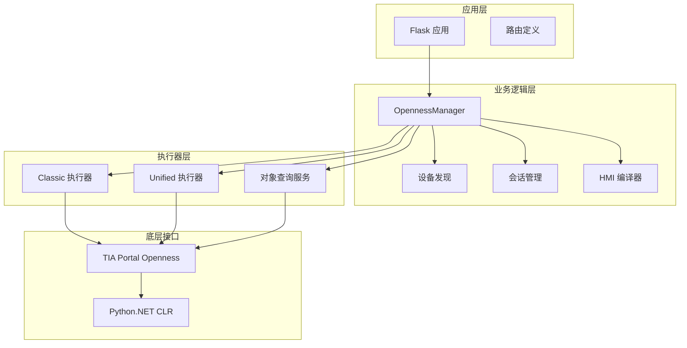

**图表来源**
- [app.py:1-800](file://app.py#L1-800)
- [openness_manager.py:1-2344](file://backend/openness_manager.py#L1-2344)

**章节来源**
- [app.py:1-800](file://app.py#L1-L800)
- [openness_manager.py:1-2344](file://backend/openness_manager.py#L1-L2344)

## 核心组件

### OpennessManager 主控制器

OpennessManager 是整个 Openness API 的核心控制器，采用 Facade 模式设计，为外部提供简化的接口，同时内部委托给各个专门的模块。

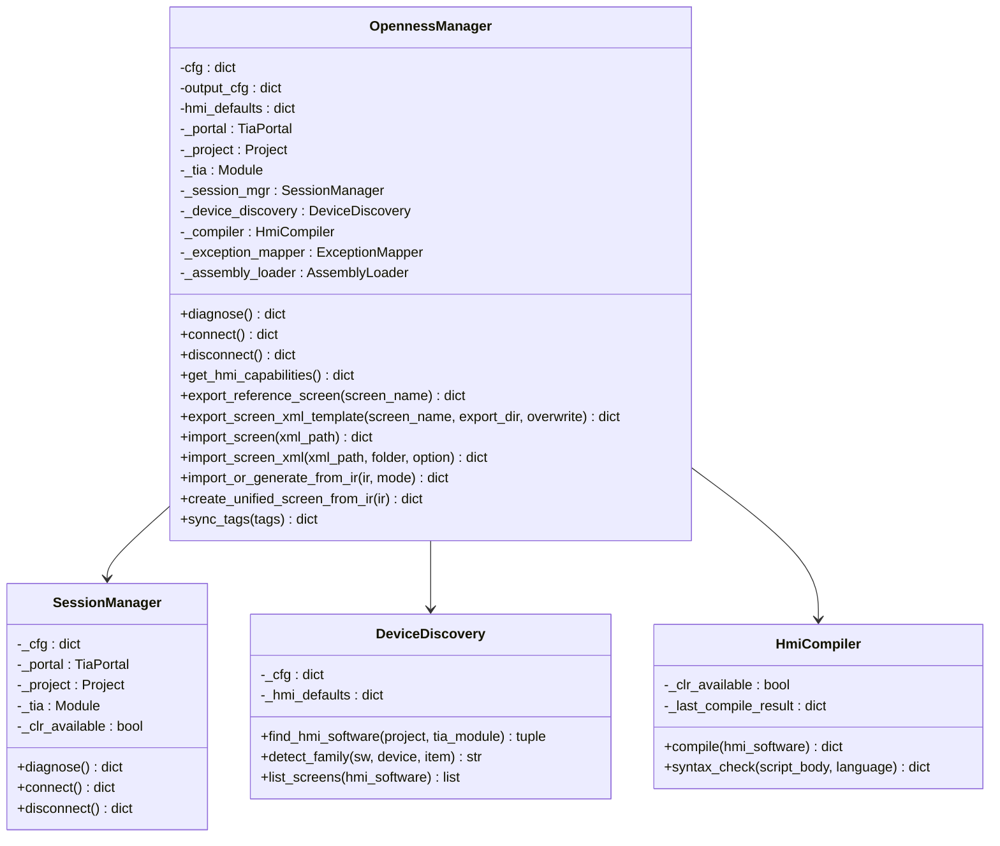

**图表来源**
- [openness_manager.py:31-100](file://backend/openness_manager.py#L31-L100)
- [session_manager.py:14-52](file://backend/openness/session_manager.py#L14-L52)
- [device_discovery.py:15-27](file://backend/openness/device_discovery.py#L15-L27)
- [compiler.py:18-46](file://backend/openness/compiler.py#L18-L46)

### API 路由层

Flask 应用定义了完整的 RESTful API 接口，为前端提供标准化的通信协议。

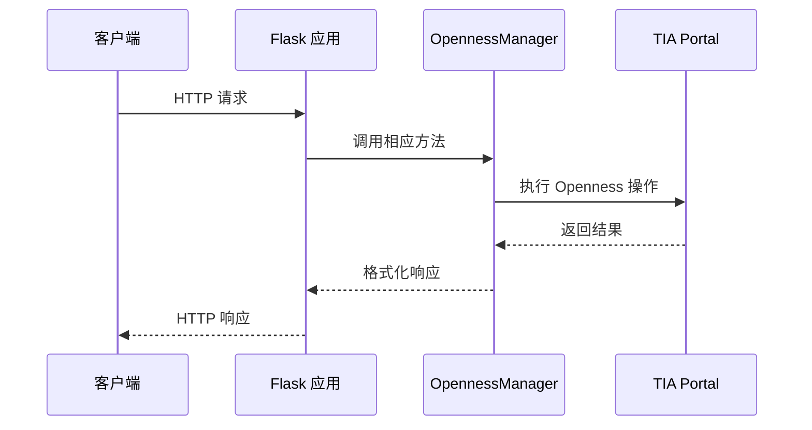

**图表来源**
- [app.py:316-511](file://app.py#L316-L511)

**章节来源**
- [openness_manager.py:31-100](file://backend/openness_manager.py#L31-L100)
- [session_manager.py:14-52](file://backend/openness/session_manager.py#L14-L52)
- [device_discovery.py:15-27](file://backend/openness/device_discovery.py#L15-L27)
- [compiler.py:18-46](file://backend/openness/compiler.py#L18-L46)

## 架构概览

Openness API 采用了分层架构设计，确保了良好的可维护性和扩展性：

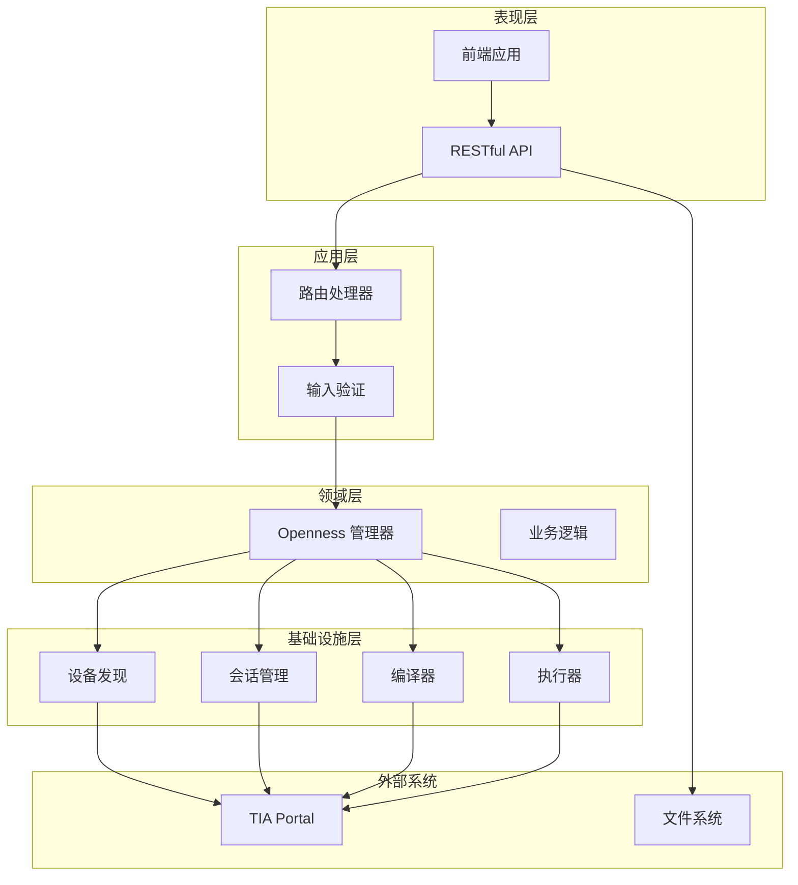

**图表来源**
- [app.py:1-800](file://app.py#L1-L800)
- [openness_manager.py:1-2344](file://backend/openness_manager.py#L1-L2344)

## 详细组件分析

### 诊断功能 (/api/openness/diagnose)

诊断功能是 Openness API 的基础功能，用于检查环境配置和可用性。

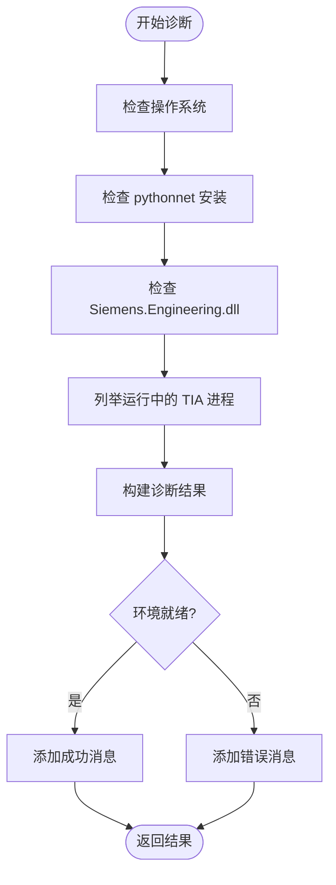

**图表来源**
- [openness_manager.py:103-139](file://backend/openness_manager.py#L103-L139)
- [session_manager.py:53-90](file://backend/openness/session_manager.py#L53-L90)

**章节来源**
- [openness_manager.py:103-139](file://backend/openness_manager.py#L103-L139)
- [session_manager.py:53-90](file://backend/openness/session_manager.py#L53-L90)

### 连接管理 (/api/openness/connect)

连接管理功能负责建立与 TIA Portal 的连接，并处理项目打开逻辑。

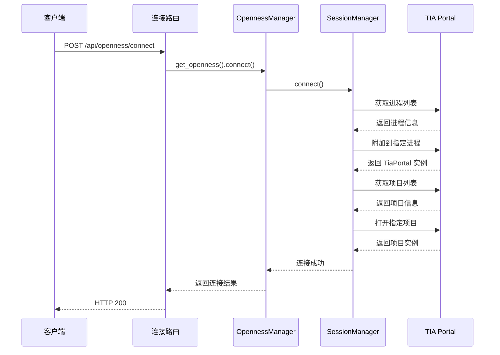

**图表来源**
- [app.py:336-339](file://app.py#L336-L339)
- [session_manager.py:92-141](file://backend/openness/session_manager.py#L92-L141)

**章节来源**
- [app.py:336-339](file://app.py#L336-L339)
- [session_manager.py:92-141](file://backend/openness/session_manager.py#L92-L141)

### 设备发现机制

设备发现机制负责在 TIA 项目中定位 HMI 设备，并识别其类型。

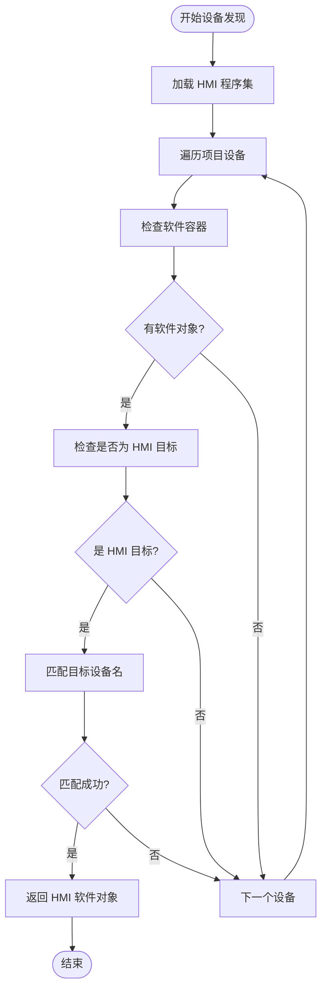

**图表来源**
- [device_discovery.py:28-78](file://backend/openness/device_discovery.py#L28-L78)

**章节来源**
- [device_discovery.py:28-78](file://backend/openness/device_discovery.py#L28-L78)

### XML 导入流程

XML 导入流程包含了完整的预处理、验证和导入步骤。

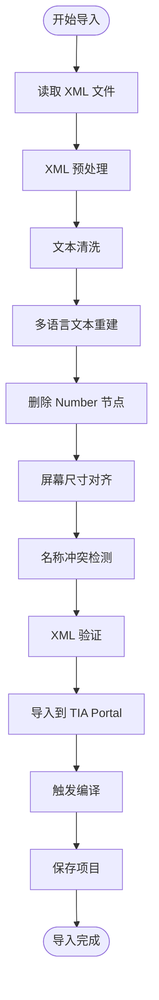

**图表来源**
- [openness_manager.py:194-362](file://backend/openness_manager.py#L194-362)
- [openness_manager.py:871-964](file://backend/openness_manager.py#L871-964)

**章节来源**
- [openness_manager.py:194-362](file://backend/openness_manager.py#L194-L362)
- [openness_manager.py:871-964](file://backend/openness_manager.py#L871-L964)

### 编译器服务

编译器服务负责触发 HMI 项目的编译，并收集编译结果。

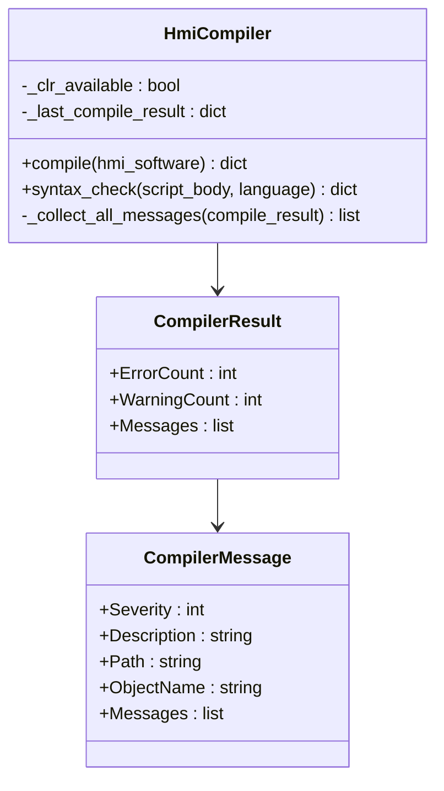

**图表来源**
- [compiler.py:18-108](file://backend/openness/compiler.py#L18-L108)

**章节来源**
- [compiler.py:18-108](file://backend/openness/compiler.py#L18-L108)

### 执行器模式

项目支持两种执行器模式：Classic 和 Unified，分别针对不同的 HMI 类型。

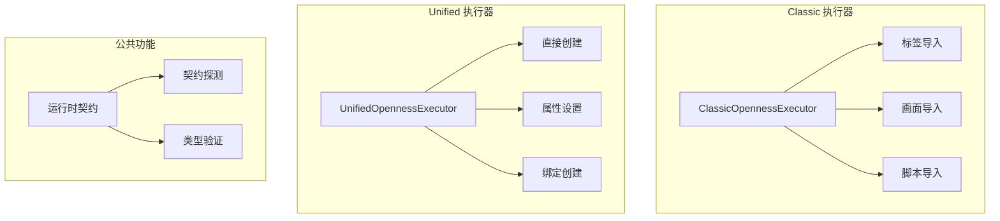

**图表来源**
- [classic_executor.py:285-612](file://backend/openness/classic_executor.py#L285-612)
- [unified_executor.py:56-200](file://backend/openness/unified_executor.py#L56-200)

**章节来源**
- [classic_executor.py:285-612](file://backend/openness/classic_executor.py#L285-L612)
- [unified_executor.py:56-200](file://backend/openness/unified_executor.py#L56-L200)

## 依赖关系分析

Openness API 的依赖关系体现了清晰的分层架构：

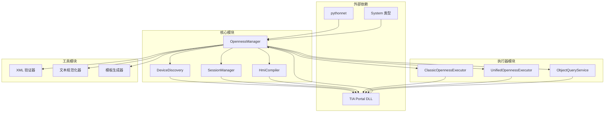

**图表来源**
- [openness_manager.py:1-2344](file://backend/openness_manager.py#L1-L2344)
- [classic_executor.py:1-1774](file://backend/openness/classic_executor.py#L1-L1774)
- [unified_executor.py:1-559](file://backend/openness/unified_executor.py#L1-L559)

**章节来源**
- [openness_manager.py:1-2344](file://backend/openness_manager.py#L1-L2344)
- [classic_executor.py:1-1774](file://backend/openness/classic_executor.py#L1-L1774)
- [unified_executor.py:1-559](file://backend/openness/unified_executor.py#L1-L559)

## 性能考虑

Openness API 在设计时充分考虑了性能优化：

### 连接池管理
- 使用全局 OpennessManager 实例，避免重复创建和销毁
- 每次请求动态获取最新配置，确保配置变更的及时生效

### 内存管理
- 及时清理临时文件和中间结果
- 使用 try-finally 确保资源释放
- 避免长时间持有大型对象引用

### 异步处理
- 导入操作采用异步模式，避免阻塞主线程
- 编译操作独立执行，不阻塞其他请求

### 缓存策略
- 编译结果缓存，避免重复编译
- 设备信息缓存，减少重复查询

## 故障排除指南

### 常见问题及解决方案

#### 环境诊断失败
**症状**: 诊断结果显示环境不就绪
**原因**: 
- 缺少 pythonnet
- Siemens.Engineering.dll 路径错误
- 非 Windows 系统
**解决方案**:
- 安装 pythonnet: `pip install pythonnet`
- 验证 DLL 路径配置
- 确保在 Windows 系统上运行

#### 连接失败
**症状**: 连接 TIA Portal 失败
**原因**:
- 未找到运行中的 TIA 进程
- 项目未加载
- 权限不足
**解决方案**:
- 确保 TIA Portal 已启动并加载项目
- 检查用户权限
- 验证配置文件中的项目路径

#### XML 导入错误
**症状**: XML 导入失败
**原因**:
- XML 格式不正确
- 屏幕尺寸不匹配
- 名称冲突
**解决方案**:
- 使用导出的参考 XML 作为模板
- 检查屏幕尺寸设置
- 修改冲突的名称或编号

#### 编译错误
**症状**: 编译失败
**原因**:
- 变量定义错误
- 画面元素引用错误
- 脚本语法错误
**解决方案**:
- 检查编译器返回的详细信息
- 修正变量定义
- 验证画面元素的引用关系

**章节来源**
- [openness_manager.py:103-139](file://backend/openness_manager.py#L103-L139)
- [session_manager.py:92-141](file://backend/openness/session_manager.py#L92-L141)
- [compiler.py:47-108](file://backend/openness/compiler.py#L47-L108)

## 结论

Openness API 提供了一个完整、健壮且易于使用的接口，用于与 TIA Portal Openness 进行交互。通过模块化的设计和清晰的分层架构，该 API 能够有效处理复杂的 HMI 管理任务，包括设备发现、连接管理、XML 导入导出、变量同步等功能。

该 API 的主要优势包括：

1. **完整性**: 覆盖了 Openness API 的所有核心功能
2. **易用性**: 提供简化的接口，隐藏复杂的底层实现细节
3. **可靠性**: 包含完善的错误处理和故障恢复机制
4. **可扩展性**: 模块化设计便于功能扩展和维护
5. **性能优化**: 采用多种优化策略确保高效运行

通过遵循本文档提供的最佳实践和故障排除指南，开发者可以充分利用 Openness API 的强大功能，构建高效的 HMI 管理应用。