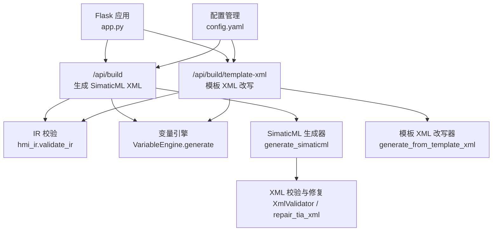
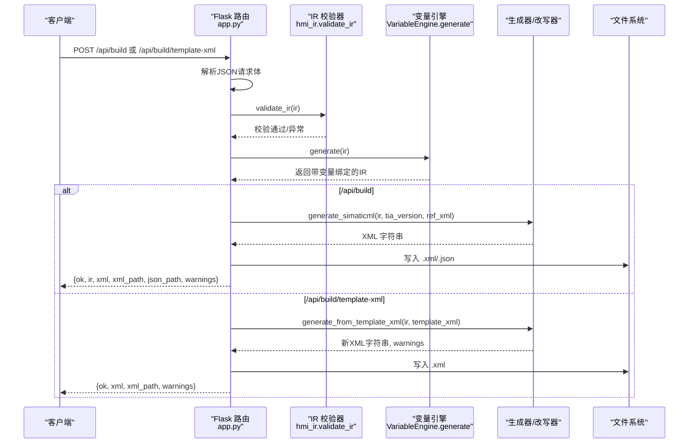
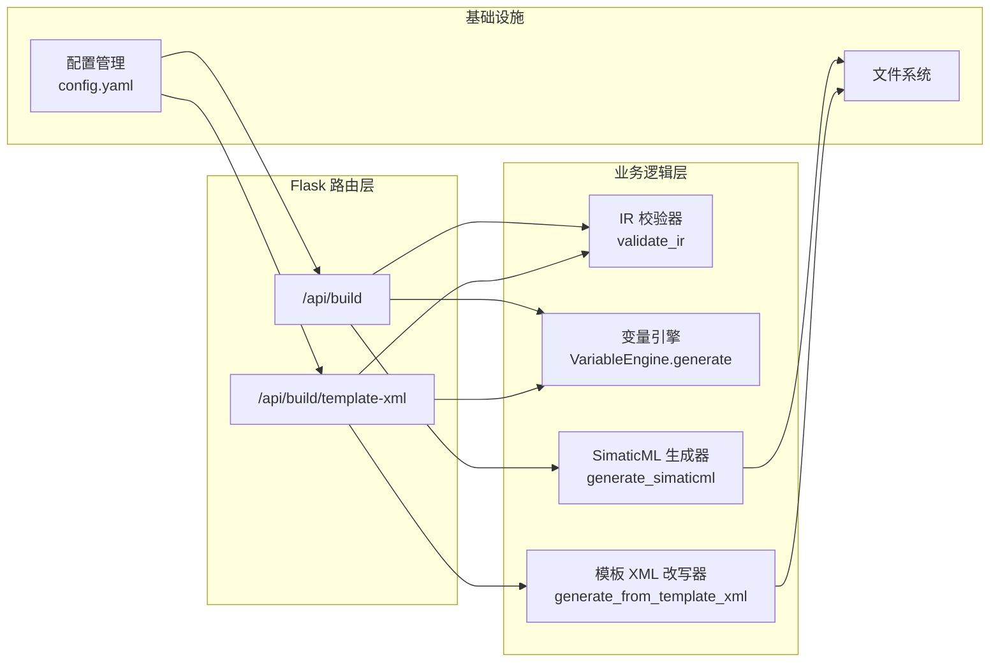

# 构建API

<cite>
**本文档引用的文件**
- [app.py](file://app.py)
- [simaticml_generator.py](file://backend/simaticml_generator.py)
- [template_xml_generator.py](file://backend/template_xml_generator.py)
- [hmi_ir.py](file://backend/hmi_ir.py)
- [variable_engine.py](file://backend/variable_engine.py)
- [config.yaml](file://config.yaml)
- [test_flask_api.py](file://tests/test_flask_api.py)
</cite>

## 目录
1. [简介](#简介)
2. [项目结构](#项目结构)
3. [核心组件](#核心组件)
4. [架构总览](#架构总览)
5. [详细组件分析](#详细组件分析)
6. [依赖关系分析](#依赖关系分析)
7. [性能考虑](#性能考虑)
8. [故障排查指南](#故障排查指南)
9. [结论](#结论)
10. [附录](#附录)

## 简介
本文件面向构建API，聚焦以下两个端点：
- POST /api/build：接收raw_output（IR JSON字符串），进行IR校验、变量引擎集成、生成SimaticML XML并落盘，返回预览数据与路径
- POST /api/build/template-xml：接收ir与可选template_xml_path，进行IR校验、变量引擎集成，使用模板XML改写生成新的XML并落盘，返回结果与路径

文档涵盖请求参数、IR校验流程、变量引擎集成、XML生成过程、文件落盘策略、响应格式、错误处理、警告信息处理、输出编码配置与实际使用示例。

## 项目结构
构建API位于Flask应用中，核心路由与处理逻辑集中在app.py，相关生成器与校验器分别位于backend目录下的对应模块中。

图表来源
- [app.py:272-310](file://app.py#L272-L310)
- [app.py:411-458](file://app.py#L411-L458)
- [hmi_ir.py:261-468](file://backend/hmi_ir.py#L261-L468)
- [variable_engine.py:198-293](file://backend/variable_engine.py#L198-L293)
- [simaticml_generator.py:414-562](file://backend/simaticml_generator.py#L414-L562)
- [template_xml_generator.py:102-218](file://backend/template_xml_generator.py#L102-L218)

章节来源
- [app.py:1-100](file://app.py#L1-L100)

## 核心组件
- Flask路由与控制器：负责HTTP请求解析、参数校验、调用业务逻辑、组装响应
- IR校验器：对IR进行结构、类型、字段完整性与默认值填充校验，并进行轻量布局优化
- 变量引擎：为IR对象自动推断变量名、数据类型、绑定关系，生成VBS脚本（兼容旧IR）
- SimaticML生成器：将校验后的IR转换为带SimaticML命名空间的XML，内置TIA XML强制校验与自动修复
- 模板XML改写器：基于模板XML与IR对象进行安全改写，保留原始结构与命名空间
- 配置管理：读取/保存配置，决定输出目录、编码、参考XML、模板路径等

章节来源
- [app.py:272-310](file://app.py#L272-L310)
- [app.py:411-458](file://app.py#L411-L458)
- [hmi_ir.py:261-468](file://backend/hmi_ir.py#L261-L468)
- [variable_engine.py:198-293](file://backend/variable_engine.py#L198-L293)
- [simaticml_generator.py:414-562](file://backend/simaticml_generator.py#L414-L562)
- [template_xml_generator.py:102-218](file://backend/template_xml_generator.py#L102-L218)
- [config.yaml:61-63](file://config.yaml#L61-L63)

## 架构总览
构建API的调用序列如下：

图表来源
- [app.py:272-310](file://app.py#L272-L310)
- [app.py:411-458](file://app.py#L411-L458)
- [hmi_ir.py:261-468](file://backend/hmi_ir.py#L261-L468)
- [variable_engine.py:198-293](file://backend/variable_engine.py#L198-L293)
- [simaticml_generator.py:414-562](file://backend/simaticml_generator.py#L414-L562)
- [template_xml_generator.py:102-218](file://backend/template_xml_generator.py#L102-L218)

## 详细组件分析

### POST /api/build（校验IR并生成SimaticML XML）
- 请求参数
  - raw_output：字符串，包含IR JSON（经LLM生成的HMI画面描述）
- 处理流程
  - 解析raw_output为IR JSON
  - validate_ir校验IR结构、类型、字段完整性，补充默认值，进行轻量布局优化
  - VariableEngine.generate为IR对象自动绑定变量、生成VBS脚本（兼容旧IR）
  - generate_simaticml生成SimaticML XML，内置TIA XML强制校验与自动修复
  - 落盘：导出目录由配置决定，文件名为“画面名_时间戳.xml/.json”，编码由配置决定
- 响应
  - ok：布尔，成功为true
  - ir：校验与变量绑定后的IR（用于前端预览）
  - xml：生成的SimaticML XML字符串
  - xml_path：XML文件绝对路径
  - json_path：IR JSON文件绝对路径
  - warnings：警告信息列表
- 错误处理
  - IRValidationError、ValueError：返回400，error字段包含错误信息
- 输出编码
  - 由配置output.encoding决定，默认utf-8-sig

章节来源
- [app.py:272-310](file://app.py#L272-L310)
- [hmi_ir.py:261-468](file://backend/hmi_ir.py#L261-L468)
- [variable_engine.py:198-293](file://backend/variable_engine.py#L198-L293)
- [simaticml_generator.py:414-562](file://backend/simaticml_generator.py#L414-L562)
- [config.yaml:61-63](file://config.yaml#L61-L63)

### POST /api/build/template-xml（仅生成模板XML）
- 请求参数
  - ir：校验后的IR对象
  - template_xml_path：可选，模板XML路径；若缺省则从配置classic_template.template_xml_path读取
- 处理流程
  - validate_ir校验IR
  - VariableEngine.generate为IR对象自动绑定变量、生成VBS脚本（兼容旧IR）
  - 读取模板XML，调用generate_from_template_xml进行安全改写
  - 落盘：导出目录由配置classic_template.generated_xml_dir决定，文件名为“画面名_时间戳.xml”，编码为utf-8
- 响应
  - ok：布尔，成功为true
  - xml：改写后的XML字符串
  - xml_path：XML文件绝对路径
  - warnings：警告信息列表
- 错误处理
  - 缺少ir：返回400，error字段
  - 模板路径无效：返回400，error字段
  - IRValidationError、ValueError：返回400，error字段
- 输出编码
  - 固定utf-8

章节来源
- [app.py:411-458](file://app.py#L411-L458)
- [template_xml_generator.py:102-218](file://backend/template_xml_generator.py#L102-L218)
- [config.yaml:31-36](file://config.yaml#L31-L36)

### IR校验流程
- 输入：IR对象（包含meta、objects、tags、text_lists、scripts等）
- 校验与归一化
  - 校验meta字段与分辨率、HMI类型、生成模式
  - 校验并归一化tags、text_lists、scripts
  - 校验objects类型与字段，补充默认值，生成process_tag，检查引用有效性
  - 自动布局优化：标题规范化、行对齐、最小间距、重叠修复、边界裁剪
- 输出：带_warnings、_screen_size、_layout_optimized标记的IR

章节来源
- [hmi_ir.py:261-468](file://backend/hmi_ir.py#L261-L468)

### 变量引擎集成
- 作用：为IR对象自动推断变量名、数据类型、绑定关系，生成VBS脚本（兼容旧IR）
- 关键行为
  - 按对象类型（Button/Indicator/IOField/SymbolicIOField）生成变量名前缀与数据类型
  - 推断按钮模式（momentary/toggle）、指示灯类型（状态/报警）、IOField数据类型
  - 生成事件与动作绑定（语义模型），回填旧IR字段（process_tag、scripts）
- 输出：IR中新增或回填变量与脚本信息，并追加_warnings

章节来源
- [variable_engine.py:198-293](file://backend/variable_engine.py#L198-L293)

### XML生成过程
- SimaticML生成
  - 生成Document、Engineering、Screen、Tags、TextLists、对象容器等结构
  - 按TIA版本与参考XML匹配命名空间与结构
  - 内置TIA XML强制校验与自动修复（DOM重建、MultilingualText标准修复、Number节点清理）
- 模板XML改写
  - 保持原始命名空间、ID、LinkList、CompositionName等
  - 按IR对象匹配模板控件，支持template_ref、id、前缀匹配、类型映射
  - 按模板尺寸缩放IR坐标，避免导入后位置不一致

章节来源
- [simaticml_generator.py:414-562](file://backend/simaticml_generator.py#L414-L562)
- [template_xml_generator.py:102-218](file://backend/template_xml_generator.py#L102-L218)

### 文件落盘策略
- /api/build
  - 导出目录：exports（可配置）
  - 文件名：画面名_时间戳.xml与画面名_时间戳.json
  - 编码：output.encoding（默认utf-8-sig）
- /api/build/template-xml
  - 导出目录：classic_template.generated_xml_dir（默认exports/generated_from_template）
  - 文件名：画面名_时间戳.xml
  - 编码：utf-8

章节来源
- [app.py:289-301](file://app.py#L289-L301)
- [app.py:441-451](file://app.py#L441-L451)
- [config.yaml:61-63](file://config.yaml#L61-L63)
- [config.yaml:34-36](file://config.yaml#L34-L36)

### 响应格式
- 通用字段
  - ok：布尔
  - warnings：字符串数组
- /api/build
  - ir：校验与变量绑定后的IR
  - xml：SimaticML XML字符串
  - xml_path：XML文件绝对路径
  - json_path：IR JSON文件绝对路径
- /api/build/template-xml
  - xml：模板改写后的XML字符串
  - xml_path：XML文件绝对路径

章节来源
- [app.py:303-310](file://app.py#L303-L310)
- [app.py:453-458](file://app.py#L453-L458)

### 错误处理与警告信息
- 错误处理
  - IRValidationError、ValueError：返回400，error字段
  - 缺少必要参数：返回400，error字段
- 警告信息
  - IR校验：坐标越界、变量自动生成、引用未定义、布局优化等
  - 模板改写：未找到模板控件、保留原样、坐标缩放提示等
  - XML生成：MultilingualText DOM重建、HTML标签清理、Number节点删除等

章节来源
- [app.py:281-282](file://app.py#L281-L282)
- [app.py:425-426](file://app.py#L425-L426)
- [hmi_ir.py:343-468](file://backend/hmi_ir.py#L343-L468)
- [template_xml_generator.py:176-218](file://backend/template_xml_generator.py#L176-L218)
- [simaticml_generator.py:550-562](file://backend/simaticml_generator.py#L550-L562)

### 输出编码配置
- /api/build：由配置output.encoding决定（默认utf-8-sig）
- /api/build/template-xml：固定utf-8

章节来源
- [config.yaml:61-63](file://config.yaml#L61-L63)
- [app.py:294](file://app.py#L294)
- [app.py:450](file://app.py#L450)

### 实际使用示例
- /api/build
  - 请求体：{"raw_output": "{...IR JSON 字符串...}"}
  - 成功响应包含ir、xml、xml_path、json_path、warnings
- /api/build/template-xml
  - 请求体：{"ir": {...IR对象...}, "template_xml_path": "可选模板路径"}
  - 成功响应包含xml、xml_path、warnings
- 测试用例参考
  - /api/build：测试有效IR请求，返回ok与关键字段
  - /api/build/template-xml：测试无效模板路径返回400

章节来源
- [test_flask_api.py:117-131](file://tests/test_flask_api.py#L117-L131)
- [test_flask_api.py:106-115](file://tests/test_flask_api.py#L106-L115)

## 依赖关系分析

图表来源
- [app.py:272-310](file://app.py#L272-L310)
- [app.py:411-458](file://app.py#L411-L458)
- [hmi_ir.py:261-468](file://backend/hmi_ir.py#L261-L468)
- [variable_engine.py:198-293](file://backend/variable_engine.py#L198-L293)
- [simaticml_generator.py:414-562](file://backend/simaticml_generator.py#L414-L562)
- [template_xml_generator.py:102-218](file://backend/template_xml_generator.py#L102-L218)
- [config.yaml:61-63](file://config.yaml#L61-L63)

## 性能考虑
- IR校验与变量绑定：O(n)级别，n为对象数量；布局优化涉及行聚类与重叠检测，总体仍为线性或近似线性
- SimaticML生成：字符串拼接与DOM重建，复杂度与对象数量、属性数量相关；TIA XML校验与修复为必要保障
- 模板XML改写：DOM遍历与匹配，复杂度与模板控件数量、IR对象数量相关；按优先级匹配与克隆策略减少不必要的重建
- I/O：落盘为顺序写入，建议在高并发场景下注意磁盘写入压力与路径权限

## 故障排查指南
- /api/build
  - raw_output为空或非JSON：IR校验失败，返回400
  - IRValidationError：检查IR结构、类型、字段完整性
  - 生成XML失败：查看warnings与日志，确认TIA版本与参考XML匹配
- /api/build/template-xml
  - 缺少ir：返回400
  - 模板路径不存在：返回400，检查配置classic_template.template_xml_path
  - 模板XML解析失败：返回原始模板并带warning
- 通用
  - warnings：关注坐标越界、变量自动生成、模板控件未匹配等提示
  - 输出编码：确认output.encoding设置，避免导入后乱码

章节来源
- [app.py:272-310](file://app.py#L272-L310)
- [app.py:411-458](file://app.py#L411-L458)
- [hmi_ir.py:261-468](file://backend/hmi_ir.py#L261-L468)
- [template_xml_generator.py:127-130](file://backend/template_xml_generator.py#L127-L130)

## 结论
构建API提供了两条核心路径：直接生成SimaticML XML与基于模板XML的安全改写。两者均包含严格的IR校验、变量引擎集成与落盘策略，并通过配置灵活控制输出目录与编码。建议在生产环境中：
- 明确模板XML路径与TIA版本，确保生成XML与目标环境兼容
- 关注warnings，及时调整IR布局与变量引用
- 合理配置输出编码，避免导入后乱码

## 附录
- 配置要点
  - output.export_dir：导出目录（/api/build）
  - output.encoding：输出编码（/api/build）
  - openness.classic_template.template_xml_path：模板XML路径（/api/build/template-xml）
  - openness.classic_template.generated_xml_dir：模板改写输出目录（/api/build/template-xml）

章节来源
- [config.yaml:61-63](file://config.yaml#L61-L63)
- [config.yaml:31-36](file://config.yaml#L31-L36)