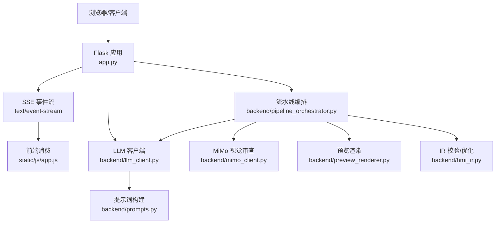
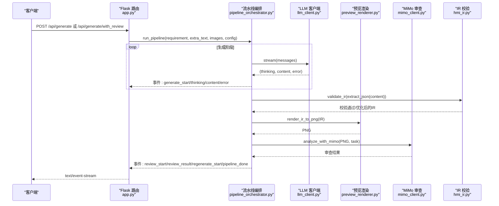
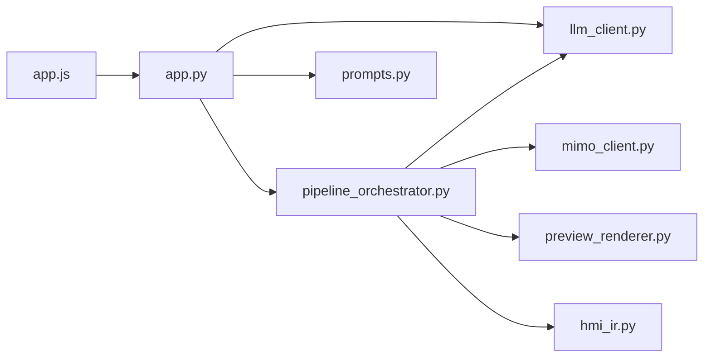

# 生成API

<cite>
**本文档引用的文件**
- [app.py](file://app.py)
- [pipeline_orchestrator.py](file://backend/pipeline_orchestrator.py)
- [llm_client.py](file://backend/llm_client.py)
- [mimo_client.py](file://backend/mimo_client.py)
- [hmi_ir.py](file://backend/hmi_ir.py)
- [preview_renderer.py](file://backend/preview_renderer.py)
- [prompts.py](file://backend/prompts.py)
- [app.js](file://static/js/app.js)
</cite>

## 目录
1. [简介](#简介)
2. [项目结构](#项目结构)
3. [核心组件](#核心组件)
4. [架构总览](#架构总览)
5. [详细组件分析](#详细组件分析)
6. [依赖关系分析](#依赖关系分析)
7. [性能考虑](#性能考虑)
8. [故障排除指南](#故障排除指南)
9. [结论](#结论)

## 简介
本文件为 Siemens HMI Assistant 项目的生成API提供完整技术文档，聚焦以下两个端点：
- POST /api/generate：流式生成HMI画面IR（SSE）
- POST /api/generate/with_review：带视觉审查的多阶段流水线（SSE）

文档涵盖SSE流式传输机制、事件类型契约、请求格式（multipart/form-data与JSON）、响应数据结构、思维深度控制、文件上传处理、错误处理策略与性能优化建议。

## 项目结构
生成API位于后端Flask应用中，核心路由与业务逻辑分布如下：
- 路由与SSE封装：app.py
- 多阶段流水线编排：backend/pipeline_orchestrator.py
- 大模型客户端与流式输出：backend/llm_client.py
- 视觉审查客户端（MiMo）：backend/mimo_client.py
- IR校验与布局优化：backend/hmi_ir.py
- 预览渲染（PNG）：backend/preview_renderer.py
- 提示词与消息构建：backend/prompts.py
- 前端SSE消费与UI交互：static/js/app.js

图表来源
- [app.py:166-266](file://app.py#L166-L266)
- [pipeline_orchestrator.py:131-354](file://backend/pipeline_orchestrator.py#L131-L354)
- [llm_client.py:35-170](file://backend/llm_client.py#L35-L170)
- [mimo_client.py:203-324](file://backend/mimo_client.py#L203-L324)
- [preview_renderer.py:260-300](file://backend/preview_renderer.py#L260-L300)
- [hmi_ir.py:261-468](file://backend/hmi_ir.py#L261-L468)
- [prompts.py:322-343](file://backend/prompts.py#L322-L343)
- [app.js:343-373](file://static/js/app.js#L343-L373)

章节来源
- [app.py:166-266](file://app.py#L166-L266)

## 核心组件
- 路由与SSE封装：负责接收请求、解析输入、构造SSE事件流并返回text/event-stream响应。
- 多阶段流水线：封装“生成→审查→修正→再审查”的循环，产出标准化事件序列。
- LLM客户端：统一OpenAI兼容接口，支持流式输出与思考深度控制。
- 视觉审查客户端：调用MiMo进行画面审查，返回评分、类别、建议等。
- 预览渲染器：将IR渲染为PNG，供MiMo审查。
- IR校验器：结构校验、默认值补全、交叉引用检查、布局优化。
- 提示词构建器：生成系统提示词与few-shot示例，指导模型输出符合Schema的IR。
- 前端SSE消费者：解析SSE事件，实时更新UI与日志。

章节来源
- [app.py:166-266](file://app.py#L166-L266)
- [pipeline_orchestrator.py:131-354](file://backend/pipeline_orchestrator.py#L131-L354)
- [llm_client.py:35-170](file://backend/llm_client.py#L35-L170)
- [mimo_client.py:203-324](file://backend/mimo_client.py#L203-L324)
- [preview_renderer.py:260-300](file://backend/preview_renderer.py#L260-L300)
- [hmi_ir.py:261-468](file://backend/hmi_ir.py#L261-L468)
- [prompts.py:322-343](file://backend/prompts.py#L322-L343)
- [app.js:343-373](file://static/js/app.js#L343-L373)

## 架构总览
生成API采用“路由→编排器→LLM/MiMo/渲染/校验”的分层设计，SSE事件贯穿始终，前端通过ReadableStream消费事件流，实现“思考过程”“内容增量”“审查结果”等可视化反馈。

图表来源
- [app.py:166-266](file://app.py#L166-L266)
- [pipeline_orchestrator.py:131-354](file://backend/pipeline_orchestrator.py#L131-L354)
- [llm_client.py:78-170](file://backend/llm_client.py#L78-L170)
- [preview_renderer.py:260-300](file://backend/preview_renderer.py#L260-L300)
- [mimo_client.py:203-324](file://backend/mimo_client.py#L203-L324)
- [hmi_ir.py:261-468](file://backend/hmi_ir.py#L261-L468)

## 详细组件分析

### 路由与SSE封装（app.py）
- /api/generate
  - 支持multipart/form-data与JSON两种请求体
  - 兼容字段：requirement、thinking_depth、files（multipart）
  - 生成SSE事件：start、thinking、content、parsed_ok、done、error
  - 思维深度：通过配置覆盖，影响LLM推理策略
- /api/generate/with_review
  - 支持multipart/form-data与JSON
  - 自动解析上传文件（PDF/文本/图片），图片转base64并生成预览URL
  - 启用视觉审查流水线，事件序列更丰富，包含pipeline_start、image_analysis_*、review_*、regenerate_*、pipeline_done

章节来源
- [app.py:166-266](file://app.py#L166-L266)

### 多阶段流水线（pipeline_orchestrator.py）
- 输入：requirement、extra_text、uploaded_images、config
- 关键阶段：
  - 可选图片分析：调用MiMo分析上传图片，拼接到extra_text
  - 初始生成：构建messages并流式生成，产出thinking/content/error
  - IR解析与校验：提取JSON、validate_ir、按目标分辨率缩放、清洗文本字段
  - 变量引擎绑定：自动生成process_tag、HMI Tags、VBS脚本
  - 视觉审查：渲染PNG→MiMo审查→汇总结果（pass/score/categories/summary/critical_issues/suggestions）
  - 修正循环：根据审查反馈构建messages，重复生成→解析→校验→审查，直至通过或达到最大迭代
- 事件契约：与SSE事件一一对应，便于前端状态机驱动

章节来源
- [pipeline_orchestrator.py:131-354](file://backend/pipeline_orchestrator.py#L131-L354)

### LLM客户端（llm_client.py）
- 思维深度映射：关闭/低/中/高，分别映射为reasoner模型与reasoning_effort或提示词诱导
- 流式输出：逐块产出(kind, text)，kind ∈ {thinking, content, error}
- 错误处理：API Key缺失、HTTP错误、超时、网络异常均转换为error事件
- JSON抽取：从模型输出中提取第一个JSON对象

章节来源
- [llm_client.py:35-170](file://backend/llm_client.py#L35-L170)

### 视觉审查客户端（mimo_client.py）
- 支持多种图片输入：路径、URL、base64
- 输出schema：brief/detailed/ocr/chart/table/ui/drawing/compare/custom
- 安全解析：对非JSON输出进行兜底包装
- 错误分类：鉴权、输入、网络、API等错误类型，便于前端提示

章节来源
- [mimo_client.py:203-324](file://backend/mimo_client.py#L203-L324)

### 预览渲染器（preview_renderer.py）
- 将IR渲染为PNG，供MiMo审查
- 字体缓存与跨平台字体回退
- 对象绘制：Text、IOField、SymbolicIOField、Button、Indicator

章节来源
- [preview_renderer.py:260-300](file://backend/preview_renderer.py#L260-L300)

### IR校验与布局优化（hmi_ir.py）
- 结构校验：meta、tags、text_lists、objects、scripts
- 默认值补全与类型约束
- 布局优化：自动排版、最小间距、重叠修复、边界裁剪
- 分辨率适配：scale_ir_to_resolution

章节来源
- [hmi_ir.py:261-468](file://backend/hmi_ir.py#L261-L468)

### 提示词构建（prompts.py）
- 系统提示词：约束IR Schema、变量命名、布局规范、VBS脚本规范
- Few-shot示例：提供典型控制场景的IR样例
- 修订消息：根据审查反馈构建修正提示词

章节来源
- [prompts.py:322-343](file://backend/prompts.py#L322-L343)

### 前端SSE消费（static/js/app.js）
- 使用ReadableStream读取SSE
- 事件解析：start、thinking、content、parsed_ok、error、done
- 流水线事件：pipeline_start、image_analysis_*、review_*、regenerate_*、pipeline_done
- UI联动：日志、滚动、步骤条、按钮启用

章节来源
- [app.js:343-373](file://static/js/app.js#L343-L373)
- [app.js:375-478](file://static/js/app.js#L375-L478)

## 依赖关系分析

图表来源
- [app.py:166-266](file://app.py#L166-L266)
- [pipeline_orchestrator.py:131-354](file://backend/pipeline_orchestrator.py#L131-L354)
- [llm_client.py:35-170](file://backend/llm_client.py#L35-L170)
- [mimo_client.py:203-324](file://backend/mimo_client.py#L203-L324)
- [preview_renderer.py:260-300](file://backend/preview_renderer.py#L260-L300)
- [hmi_ir.py:261-468](file://backend/hmi_ir.py#L261-L468)
- [prompts.py:322-343](file://backend/prompts.py#L322-L343)
- [app.js:343-373](file://static/js/app.js#L343-L373)

## 性能考虑
- 流式传输：SSE逐块推送，前端即时显示，降低首屏等待时间
- 图片预处理：MiMo输入图片尺寸限制与缩放，避免token爆炸
- 最大迭代限制：避免无限循环，保障用户体验
- 字体缓存：预览渲染字体缓存，减少重复I/O
- JSON抽取容错：对模型输出进行鲁棒解析，提升稳定性
- 思维深度控制：根据需求选择合适深度，平衡质量与延迟

## 故障排除指南
- 未配置API Key
  - 现象：LLM客户端立即返回error事件
  - 处理：在设置中填写Provider API Key
- 模型接口错误
  - 现象：HTTP状态码非200，返回error事件
  - 处理：检查base_url与网络连通性
- MiMo审查失败
  - 现象：review_progress显示review_skipped，pipeline_done携带note
  - 处理：检查MiMo API Key与网络，必要时降低图片尺寸
- IR解析失败
  - 现象：parsed_ok后出现parse_warn，pipeline_done携带error
  - 处理：调整提示词或需求描述，确保模型输出符合Schema
- 超时与网络异常
  - 现象：error事件包含超时/网络异常信息
  - 处理：检查网络与超时配置，适当延长超时时间

章节来源
- [llm_client.py:82-170](file://backend/llm_client.py#L82-L170)
- [mimo_client.py:280-324](file://backend/mimo_client.py#L280-L324)
- [pipeline_orchestrator.py:197-209](file://backend/pipeline_orchestrator.py#L197-L209)

## 结论
生成API通过SSE事件流实现了从需求到画面IR的可视化生成过程，支持思维深度控制、文件上传、多阶段审查与修正。其分层架构清晰、事件契约明确、错误处理完善，既满足工程化生产的稳定性要求，也为用户提供了直观的交互体验。建议在生产环境中合理配置思维深度与最大迭代次数，并对图片输入进行尺寸控制，以获得更佳的性能与一致性。