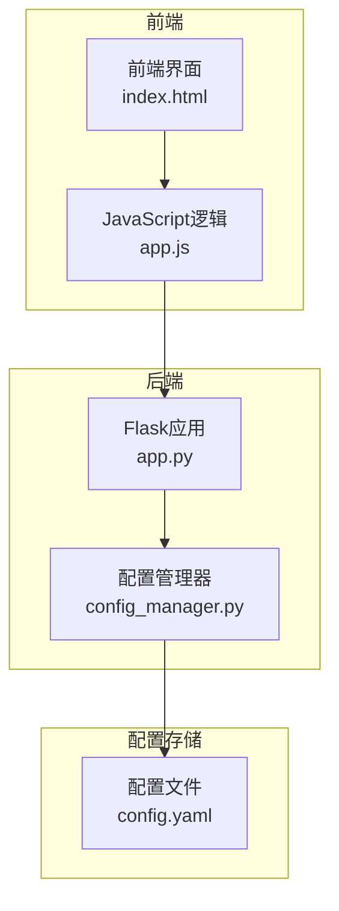
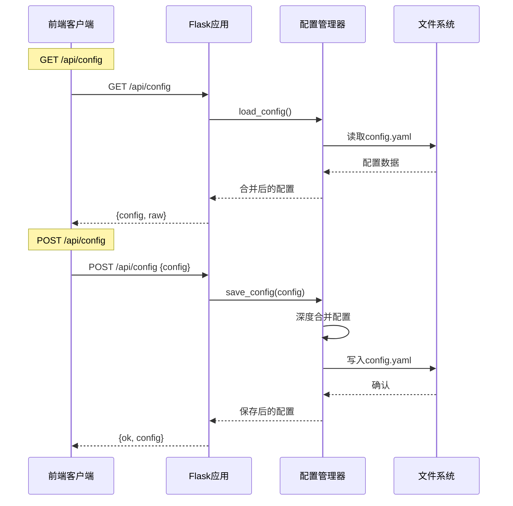
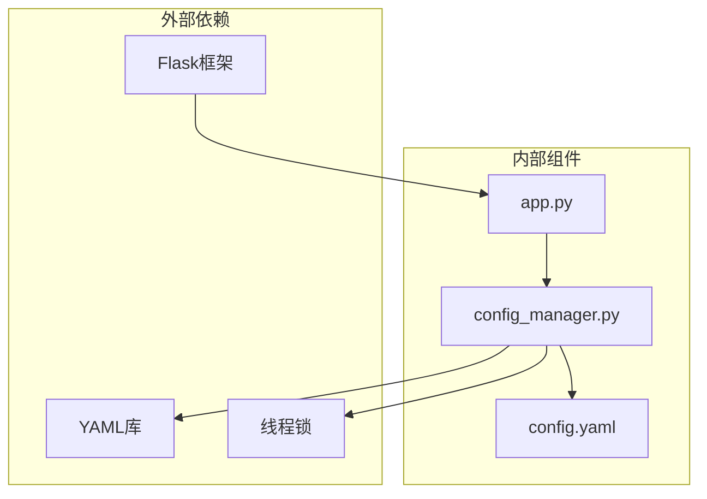

# 配置API

<cite>
**本文档引用的文件**
- [app.py](file://app.py)
- [config_manager.py](file://backend/config_manager.py)
- [config.yaml](file://config.yaml)
- [app.js](file://static/js/app.js)
- [index.html](file://templates/index.html)
- [test_flask_api.py](file://tests/test_flask_api.py)
</cite>

## 目录
1. [简介](#简介)
2. [项目结构](#项目结构)
3. [核心组件](#核心组件)
4. [架构概览](#架构概览)
5. [详细组件分析](#详细组件分析)
6. [依赖分析](#依赖分析)
7. [性能考虑](#性能考虑)
8. [故障排除指南](#故障排除指南)
9. [结论](#结论)

## 简介

配置API是Siemens HMI Assistant系统的核心功能模块，负责管理应用程序的配置文件。该API提供了三种主要端点：GET /api/config用于读取配置、POST /api/config用于保存结构化配置、POST /api/config/raw用于保存原始YAML配置。这些端点支持前端界面的配置管理功能，包括模型提供商设置、Openness集成配置、输出选项等。

## 项目结构

配置API位于Flask应用的路由层，通过app.py文件定义路由，通过backend/config_manager.py处理配置文件的实际读写操作。



**图表来源**
- [app.py:84-109](file://app.py#L84-L109)
- [config_manager.py:108-142](file://backend/config_manager.py#L108-L142)

**章节来源**
- [app.py:1-16](file://app.py#L1-L16)
- [config_manager.py:1-10](file://backend/config_manager.py#L1-L10)

## 核心组件

### 配置API端点

配置API包含以下三个核心端点：

1. **GET /api/config** - 读取配置
   - 返回结构化配置和原始YAML
   - 用于前端初始化和显示

2. **POST /api/config** - 保存结构化配置
   - 接收JSON格式的配置对象
   - 保存到config.yaml文件

3. **POST /api/config/raw** - 保存原始YAML配置
   - 接收完整的YAML文本
   - 进行语法验证后保存

### 配置管理器

配置管理器负责：
- 加载配置文件并提供默认值
- 深度合并配置以确保字段完整性
- 保存配置到YAML文件
- 提供原始YAML文本

**章节来源**
- [app.py:84-109](file://app.py#L84-L109)
- [config_manager.py:108-142](file://backend/config_manager.py#L108-L142)

## 架构概览

配置API采用分层架构设计，将HTTP路由、业务逻辑和数据持久化清晰分离。



**图表来源**
- [app.py:84-109](file://app.py#L84-L109)
- [config_manager.py:108-127](file://backend/config_manager.py#L108-L127)

## 详细组件分析

### GET /api/config 端点

#### 功能描述
该端点用于读取当前配置并返回给前端。响应包含两部分：
- `config`: 结构化的配置对象
- `raw`: 当前配置文件的原始YAML文本

#### 请求参数
- 方法: GET
- URL: `/api/config`
- 头部: 无特殊要求
- 请求体: 无

#### 响应格式
```json
{
  "config": {
    "llm": {
      "active_provider": "string",
      "thinking_depth": "string",
      "stream": boolean,
      "show_thinking": boolean,
      "providers": {
        "deepseek": {
          "base_url": "string",
          "api_key": "string",
          "chat_model": "string",
          "reasoner_model": "string",
          "supports_vision": boolean
        }
      }
    },
    "openness": {
      "tia_version": "string",
      "dll_path": "string",
      "attach_running": boolean,
      "project_path": "string",
      "hmi_device": "string",
      "screen_folder": "string",
      "target_resolution": "string",
      "auto_scale_screen_items": boolean,
      "compile_after_import": boolean,
      "save_after_import": boolean,
      "generation_mode": "string",
      "classic_template": {
        "enabled": boolean,
        "template_screen_name": "string",
        "template_xml_path": "string",
        "template_export_dir": "string",
        "generated_xml_dir": "string",
        "import_option": "string"
      },
      "unified_direct": {
        "enabled": boolean,
        "update_existing_screen": boolean,
        "clear_existing_items": boolean,
        "unsupported_object_policy": "string"
      },
      "default_templates": {
        "basic": {
          "enabled": boolean,
          "template_screen_name": "string",
          "template_xml_path": "string"
        },
        "comfort": {
          "enabled": boolean,
          "template_screen_name": "string",
          "template_xml_path": "string"
        },
        "unified": {
          "enabled": boolean,
          "template_screen_name": "string",
          "template_xml_path": "string"
        }
      }
    },
    "hmi_defaults": {
      "resolution": "string",
      "hmi_type": "string",
      "background_color": "string",
      "font_family": "string"
    },
    "output": {
      "export_dir": "string",
      "encoding": "string",
      "reference_xml": "string"
    },
    "mimo": {
      "enabled": boolean,
      "api_key": "string",
      "base_url": "string",
      "model": "string",
      "max_iterations": integer,
      "review_timeout_seconds": integer,
      "review_pass_threshold": integer,
      "image_analysis_enabled": boolean,
      "image_analysis_max_size": integer
    },
    "server": {
      "host": "string",
      "port": integer,
      "debug": boolean
    }
  },
  "raw": "string"
}
```

#### 错误处理
- 成功: 200 OK
- 失败: 500 Internal Server Error

**章节来源**
- [app.py:84-88](file://app.py#L84-L88)
- [config_manager.py:108-142](file://backend/config_manager.py#L108-L142)

### POST /api/config 端点

#### 功能描述
该端点用于保存结构化的配置对象。前端通过表单收集的配置会被发送到此端点进行保存。

#### 请求参数
- 方法: POST
- URL: `/api/config`
- 头部: `Content-Type: application/json`
- 请求体: `{ "config": { ... } }`

#### 响应格式
```json
{
  "ok": boolean,
  "config": { "llm": {...}, "openness": {...}, ... }
}
```

#### 错误处理
- 成功: 200 OK
- 失败: 400 Bad Request
  - 错误信息包含具体的错误描述

#### 参数验证规则
- 请求体必须为有效的JSON
- 必须包含`config`字段
- 配置对象必须为字典类型

**章节来源**
- [app.py:91-99](file://app.py#L91-L99)
- [config_manager.py:121-127](file://backend/config_manager.py#L121-L127)

### POST /api/config/raw 端点

#### 功能描述
该端点用于保存原始的YAML配置文本。前端提供原始编辑模式，允许用户直接编辑config.yaml文件内容。

#### 请求参数
- 方法: POST
- URL: `/api/config/raw`
- 头部: `Content-Type: application/json`
- 请求体: `{ "raw": "string" }`

#### 响应格式
```json
{
  "ok": boolean,
  "config": { "llm": {...}, "openness": {...}, ... }
}
```

#### 错误处理
- 成功: 200 OK
- 失败: 400 Bad Request
  - 错误信息包含具体的错误描述

#### 参数验证规则
- 请求体必须为有效的JSON
- 必须包含`raw`字段
- YAML文本必须能够被安全解析为字典类型

**章节来源**
- [app.py:101-109](file://app.py#L101-L109)
- [config_manager.py:130-135](file://backend/config_manager.py#L130-L135)

### 配置文件结构说明

配置文件采用YAML格式，包含以下主要部分：

#### LLM配置 (llm)
- `active_provider`: 当前激活的AI提供商名称
- `thinking_depth`: 思考深度级别（关闭/低/中/高）
- `stream`: 是否启用流式响应
- `show_thinking`: 是否显示思考过程
- `providers`: AI提供商配置数组
  - `base_url`: API基础URL
  - `api_key`: API密钥
  - `chat_model`: 聊天模型名称
  - `reasoner_model`: 推理模型名称
  - `supports_vision`: 是否支持视觉理解

#### Openness配置 (openness)
- `tia_version`: TIA Portal版本
- `dll_path`: DLL路径
- `attach_running`: 是否附加到已运行的博途实例
- `project_path`: 项目路径
- `hmi_device`: HMI设备名称
- `screen_folder`: 画面文件夹
- `target_resolution`: 目标分辨率
- `auto_scale_screen_items`: 自动缩放屏幕项目
- `compile_after_import`: 导入后编译
- `save_after_import`: 导入后保存
- `generation_mode`: 生成模式
- `classic_template`: 经典模板配置
- `unified_direct`: 统一直接配置
- `default_templates`: 默认模板配置

#### HMI默认配置 (hmi_defaults)
- `resolution`: 屏幕分辨率
- `hmi_type`: HMI类型（Basic/Comfort/Unified）
- `background_color`: 背景颜色
- `font_family`: 字体家族

#### 输出配置 (output)
- `export_dir`: 导出目录
- `encoding`: 文件编码
- `reference_xml`: 参考XML

#### MIMO配置 (mimo)
- `enabled`: 是否启用
- `api_key`: API密钥
- `base_url`: 基础URL
- `model`: 模型名称
- `max_iterations`: 最大迭代次数
- `review_timeout_seconds`: 审查超时时间
- `review_pass_threshold`: 通过阈值
- `image_analysis_enabled`: 是否启用图像分析
- `image_analysis_max_size`: 图像分析最大尺寸

#### 服务器配置 (server)
- `host`: 主机地址
- `port`: 端口号
- `debug`: 调试模式

**章节来源**
- [config.yaml:1-343](file://config.yaml#L1-L343)

## 依赖分析

配置API的依赖关系相对简单，主要涉及前后端交互和文件系统操作。



**图表来源**
- [app.py:23-40](file://app.py#L23-L40)
- [config_manager.py:3-8](file://backend/config_manager.py#L3-L8)

### 组件耦合度分析

配置API具有良好的内聚性和较低的耦合度：
- 路由层与业务逻辑分离
- 配置管理器独立封装文件操作
- 前后端通过标准JSON接口通信
- 错误处理集中在路由层

**章节来源**
- [app.py:84-109](file://app.py#L84-L109)
- [config_manager.py:108-142](file://backend/config_manager.py#L108-L142)

## 性能考虑

### 线程安全
配置管理器使用线程锁确保并发访问的安全性：
- 所有文件读写操作都在锁保护下执行
- 避免多个请求同时修改配置文件导致的数据竞争

### 缓存策略
- 配置文件在内存中有缓存
- 首次加载时生成默认配置
- 深度合并确保字段完整性

### 错误恢复
- 文件不存在时自动创建默认配置
- YAML解析失败时返回明确的错误信息
- 保存失败时保持原有配置不变

## 故障排除指南

### 常见问题及解决方案

#### 1. 配置保存失败
**症状**: POST /api/config 返回400错误
**可能原因**:
- JSON格式不正确
- 缺少必需字段
- 权限不足无法写入文件

**解决步骤**:
1. 检查请求体是否为有效JSON
2. 确认包含`config`字段
3. 检查config.yaml文件权限
4. 查看服务器日志获取详细错误信息

#### 2. 原始YAML保存失败
**症状**: POST /api/config/raw 返回400错误
**可能原因**:
- YAML语法错误
- 根节点不是字典类型
- 文件写入权限不足

**解决步骤**:
1. 在线验证YAML语法
2. 确保根节点为对象类型
3. 检查文件系统权限
4. 使用GET /api/config/raw获取当前配置进行对比

#### 3. 配置读取异常
**症状**: GET /api/config返回500错误
**可能原因**:
- config.yaml文件损坏
- 文件编码问题
- 内存不足

**解决步骤**:
1. 检查config.yaml文件完整性
2. 验证文件编码格式
3. 重启应用程序
4. 检查磁盘空间

#### 4. 前端配置不同步
**症状**: 前端显示的配置与实际不符
**可能原因**:
- 缓存问题
- 并发更新冲突
- JavaScript逻辑错误

**解决步骤**:
1. 清除浏览器缓存
2. 强制刷新页面
3. 检查JavaScript控制台错误
4. 重新加载配置

### 最佳实践

#### 配置更新最佳实践
1. **备份现有配置**: 在重要更改前备份config.yaml
2. **渐进式更新**: 逐步应用配置更改，便于回滚
3. **验证配置**: 使用GET /api/config确认配置生效
4. **监控日志**: 关注服务器日志中的配置相关错误

#### 安全考虑
1. **API密钥掩码**: 前端展示时对API密钥进行掩码处理
2. **最小权限原则**: 配置文件使用最小必要权限
3. **定期审计**: 定期检查配置文件的访问权限
4. **敏感信息保护**: 避免在配置中存储明文密码

#### 性能优化
1. **批量更新**: 合并多个配置更改一次性保存
2. **异步处理**: 对大型配置文件的处理使用异步方式
3. **缓存策略**: 合理利用内存缓存减少文件I/O

**章节来源**
- [app.py:87-88](file://app.py#L87-L88)
- [config_manager.py:108-142](file://backend/config_manager.py#L108-L142)

## 结论

配置API为Siemens HMI Assistant提供了完整、安全、易用的配置管理功能。通过清晰的分层架构设计，该API实现了以下目标：

1. **功能完整性**: 支持配置读取、结构化保存和原始YAML保存三种模式
2. **安全性**: 通过API密钥掩码和严格的参数验证确保配置安全
3. **可靠性**: 提供完善的错误处理和故障恢复机制
4. **易用性**: 通过RESTful API设计简化了前端集成

该API的设计充分考虑了实际使用场景，为HMI配置管理提供了稳定可靠的技术基础。通过遵循本文档中的最佳实践和故障排除指南，用户可以有效地管理和维护配置文件，确保系统的稳定运行。