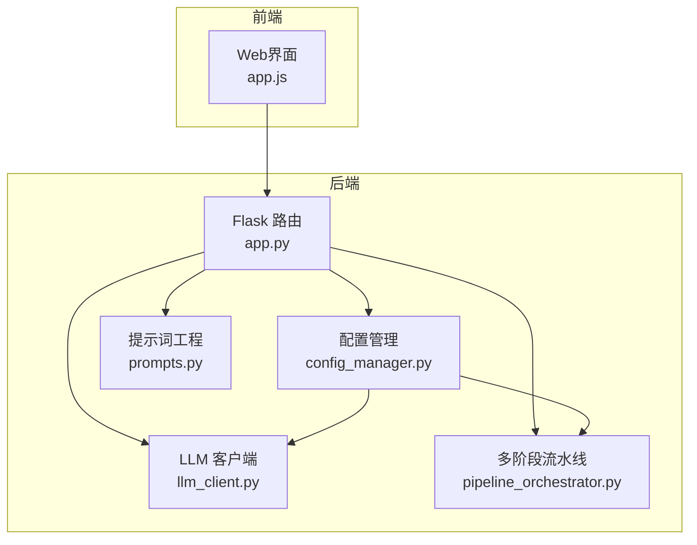
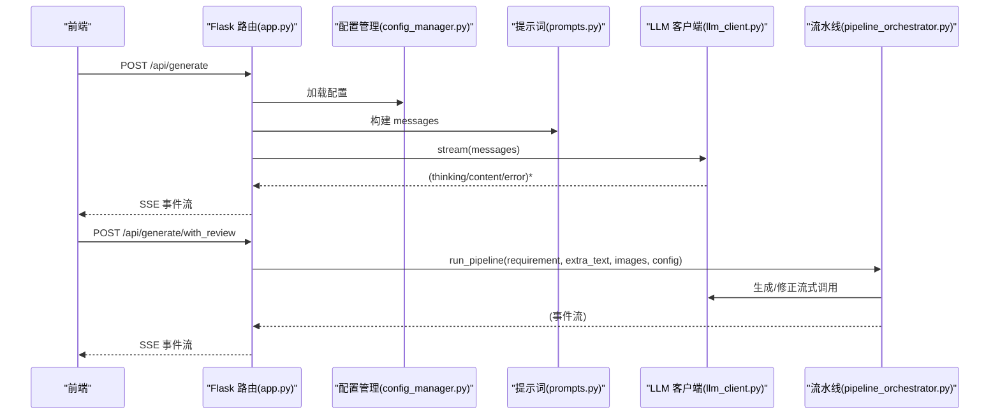
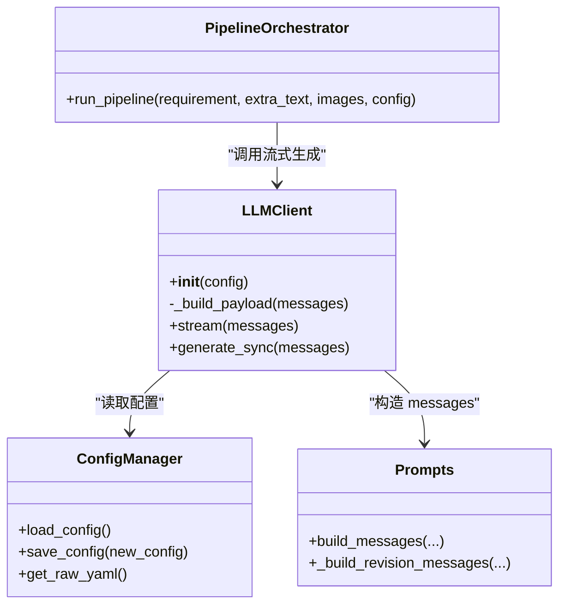
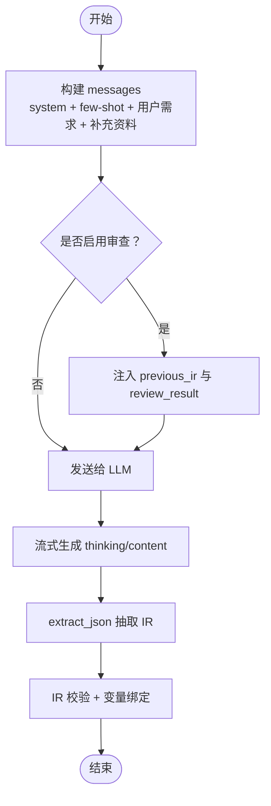
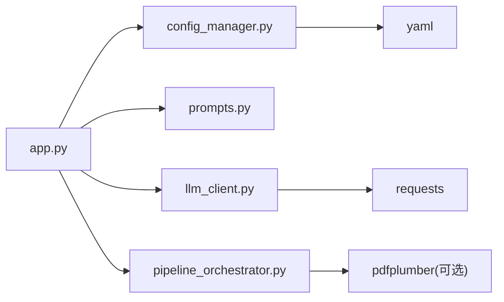

# LLM集成

<cite>
**本文档引用的文件**
- [app.py](file://app.py)
- [llm_client.py](file://backend/llm_client.py)
- [prompts.py](file://backend/prompts.py)
- [config_manager.py](file://backend/config_manager.py)
- [config.yaml](file://config.yaml)
- [pipeline_orchestrator.py](file://backend/pipeline_orchestrator.py)
- [README_Basic_HMI_Support.md](file://Documents/README_Basic_HMI_Support.md)
- [README.md](file://deepseek_mimo_vision_skill/deepseek_mimo_vision_skill/README.md)
</cite>

## 目录
1. [简介](#简介)
2. [项目结构](#项目结构)
3. [核心组件](#核心组件)
4. [架构总览](#架构总览)
5. [详细组件分析](#详细组件分析)
6. [依赖分析](#依赖分析)
7. [性能考虑](#性能考虑)
8. [故障排除指南](#故障排除指南)
9. [结论](#结论)
10. [附录](#附录)

## 简介
本指南面向需要在本项目中集成新的大语言模型提供商的开发者，系统讲解如何扩展 LLMClient、完善提示词工程与对话管理，以及处理不同 LLM 提供商的 API 差异、认证机制与请求格式。文档还提供从零到一的新模型集成流程，包括配置管理、错误处理与性能优化，并覆盖提示词模板开发、上下文管理与响应解析的最佳实践。

## 项目结构
本项目围绕“提示词工程 + LLM 客户端 + 流式对话 + 多阶段流水线”的架构组织，关键目录与文件如下：
- 后端核心
  - LLM 客户端：backend/llm_client.py
  - 提示词工程：backend/prompts.py
  - 配置管理：backend/config_manager.py、config.yaml
  - 多阶段流水线：backend/pipeline_orchestrator.py
- 前端与API
  - Flask 应用入口：app.py
- 文档与技能
  - Basic HMI 支持说明：Documents/README_Basic_HMI_Support.md
  - DeepSeek + MiMo 视觉桥接技能：deepseek_mimo_vision_skill/README.md



**图表来源**
- [app.py:1-966](file://app.py#L1-L966)
- [config_manager.py:1-142](file://backend/config_manager.py#L1-L142)
- [prompts.py:1-400](file://backend/prompts.py#L1-L400)
- [llm_client.py:1-229](file://backend/llm_client.py#L1-L229)
- [pipeline_orchestrator.py:1-354](file://backend/pipeline_orchestrator.py#L1-L354)

**章节来源**
- [app.py:1-966](file://app.py#L1-L966)
- [config_manager.py:1-142](file://backend/config_manager.py#L1-L142)
- [prompts.py:1-400](file://backend/prompts.py#L1-L400)
- [llm_client.py:1-229](file://backend/llm_client.py#L1-L229)
- [pipeline_orchestrator.py:1-354](file://backend/pipeline_orchestrator.py#L1-L354)

## 核心组件
- LLMClient：封装 OpenAI 兼容的 /chat/completions 接口，支持流式输出与“思考深度”策略，自动处理原生推理与诱导式思考两类模式。
- 提示词工程：集中定义系统提示词、布局规范、变量约定、VBS 脚本规范与 JSON Schema 约束，确保输出 IR 的工程一致性。
- 配置管理：提供默认配置、深合并补全、YAML 读写与前端配置页对接。
- 多阶段流水线：将“生成 → 预览渲染 → MiMo 视觉审查 → 修正 → 再审查”串联为 SSE 事件流，支持可选的图片分析与多轮修正。

**章节来源**
- [llm_client.py:35-229](file://backend/llm_client.py#L35-L229)
- [prompts.py:14-248](file://backend/prompts.py#L14-L248)
- [config_manager.py:108-142](file://backend/config_manager.py#L108-L142)
- [pipeline_orchestrator.py:131-354](file://backend/pipeline_orchestrator.py#L131-L354)

## 架构总览
本系统通过 Flask 路由接收前端请求，加载配置，构造提示词消息，调用 LLMClient 进行流式生成，再经由 extract_json 抽取 IR，进入变量绑定与可选的 MiMo 审查修正流程，最终生成 SimaticML XML 并落盘。



**图表来源**
- [app.py:166-266](file://app.py#L166-L266)
- [pipeline_orchestrator.py:131-354](file://backend/pipeline_orchestrator.py#L131-L354)
- [llm_client.py:78-203](file://backend/llm_client.py#L78-L203)
- [prompts.py:322-343](file://backend/prompts.py#L322-L343)

## 详细组件分析

### LLMClient 组件分析
- 设计要点
  - 统一 OpenAI 兼容接口：/chat/completions，支持流式与非流式两种模式。
  - 思考深度策略：通过 DEPTH_MAP 映射“关闭/低/中/高”，优先使用推理模型（reasoner_model），否则注入 system 提示词诱导思考。
  - 响应解析：原生推理模型通过 reasoning_content 字段输出思考；诱导式思考通过 <thinking>...</thinking> 标签切分。
  - 错误处理：API Key 缺失、HTTP 状态码异常、超时、网络异常均有明确错误事件。
- 关键方法
  - stream(messages)：流式生成，产出 (kind, text)，kind ∈ {"thinking","content","error"}。
  - generate_sync(messages)：非流式一次性生成，适合图片分析等场景。
  - extract_json(text)：从完整输出中抽取第一个 JSON 对象，支持围栏与容错匹配。



**图表来源**
- [llm_client.py:35-229](file://backend/llm_client.py#L35-L229)
- [config_manager.py:108-142](file://backend/config_manager.py#L108-L142)
- [prompts.py:322-381](file://backend/prompts.py#L322-L381)
- [pipeline_orchestrator.py:131-354](file://backend/pipeline_orchestrator.py#L131-L354)

**章节来源**
- [llm_client.py:35-229](file://backend/llm_client.py#L35-L229)

### 提示词工程与对话管理
- 系统提示词（SYSTEM_PROMPT）：定义角色、对象类型、工作方式与输出格式约束，确保 IR 的工程一致性。
- JSON Schema 约束（IR_SCHEMA_DOC）：限定 meta/tags/text_lists/objects/scripts 的结构与字段。
- 规范约束：文字与命名、变量绑定、VBS 脚本、布局与排版、输出前自检。
- Few-shot 示例：提供典型需求与标准 IR，提升生成稳定性。
- 修订模式：当启用 MiMo 审查时，通过 review_context 将上一版 IR 与审查反馈注入 messages，引导模型修正。



**图表来源**
- [prompts.py:322-381](file://backend/prompts.py#L322-L381)
- [pipeline_orchestrator.py:297-347](file://backend/pipeline_orchestrator.py#L297-L347)

**章节来源**
- [prompts.py:14-248](file://backend/prompts.py#L14-L248)
- [prompts.py:322-381](file://backend/prompts.py#L322-L381)

### 配置管理与API差异
- 配置结构
  - llm.active_provider：当前激活的提供商名称
  - llm.providers.{name}：包含 base_url、api_key、chat_model、reasoner_model、supports_vision
  - llm.thinking_depth/show_thinking/stream：控制推理深度、是否显示思考、是否流式
  - openness、hmi_defaults、output、mimo、server：与生成与导入流程相关的配置
- API 差异与兼容
  - 统一使用 /chat/completions，支持 reasoning_effort（如 DeepSeek-reasoner）与原生 reasoning_content 字段。
  - 无原生推理时，通过 system 提示词注入诱导式思考，再在客户端解析 <thinking>...</thinking>。
  - 认证：Authorization: Bearer {api_key}，Content-Type: application/json。
  - 超时：默认 300 秒，网络异常与超时均有明确错误事件。

**章节来源**
- [config.yaml:1-343](file://config.yaml#L1-L343)
- [llm_client.py:78-203](file://backend/llm_client.py#L78-L203)

### 多阶段流水线与视觉审查
- 流程
  - 可选图片分析：将上传图片交给 MiMo 进行 OCR/布局/控件识别，生成附加文本。
  - 初始生成：调用 LLMClient 流式生成，抽取 IR，校验并适配目标分辨率。
  - 变量绑定：VariableEngine 自动生成 process_tag、HMI Tags 与 VBS 脚本。
  - 审查：渲染 IR 为 PNG，MiMo 进行视觉审查，返回分数与分类。
  - 修正：若未通过，将审查反馈注入 messages，再次生成并重复审查，最多 max_iterations 次。
- 事件契约：通过 SSE 事件名（如 generate_start、review_result、pipeline_done）与前端解耦。

**章节来源**
- [pipeline_orchestrator.py:131-354](file://backend/pipeline_orchestrator.py#L131-L354)

## 依赖分析
- 组件耦合
  - app.py 依赖 config_manager、prompts、llm_client、pipeline_orchestrator 等模块。
  - llm_client 仅依赖 requests 与内部常量，内聚度高、耦合度低。
  - prompts 与 pipeline_orchestrator 通过 messages 构造与 IR 抽取形成弱耦合。
- 外部依赖
  - requests：HTTP 客户端，用于调用 LLM API。
  - yaml：配置读写。
  - pdfplumber：PDF 文本提取（可选）。



**图表来源**
- [app.py:23-40](file://app.py#L23-L40)
- [llm_client.py:15-16](file://backend/llm_client.py#L15-L16)
- [config_manager.py:6-7](file://backend/config_manager.py#L6-L7)
- [pipeline_orchestrator.py:19-29](file://backend/pipeline_orchestrator.py#L19-L29)

**章节来源**
- [app.py:23-40](file://app.py#L23-L40)
- [llm_client.py:15-16](file://backend/llm_client.py#L15-L16)
- [config_manager.py:6-7](file://backend/config_manager.py#L6-L7)
- [pipeline_orchestrator.py:19-29](file://backend/pipeline_orchestrator.py#L19-L29)

## 性能考虑
- 流式输出：启用 stream=True，降低首字节延迟，前端可即时展示思考与正文增量。
- 超时控制：默认 300 秒，避免长时间占用连接；网络异常与超时分别处理。
- JSON 抽取：extract_json 支持围栏与容错匹配，减少因模型输出格式波动导致的失败。
- 图片分析限流：pipeline_orchestrator 限制最多分析 3 张图片，避免 token 爆炸。
- 分辨率适配：在生成阶段即根据目标分辨率调整 IR，减少后续缩放误差。
- 变量绑定：在 IR 校验后统一生成，避免重复计算。

[本节为通用指导，无需特定文件来源]

## 故障排除指南
- API Key 未配置
  - 现象：立即返回错误事件，提示填写 API Key。
  - 处理：在 config.yaml 的 providers.{name} 中填入 api_key。
- HTTP 状态码异常
  - 现象：返回“模型接口返回 {code}: {detail}”。
  - 处理：检查 base_url、api_key、网络连通性与配额。
- 超时与网络异常
  - 现象：返回“模型请求超时（>300s）”或“网络/请求异常”。
  - 处理：增加超时时间、检查代理、重试策略。
- JSON 解析失败
  - 现象：extract_json 抛出“未找到 JSON 对象”或“大括号不匹配”。
  - 处理：检查 SYSTEM_PROMPT 是否严格要求输出 JSON；必要时在 messages 中强调输出格式。
- 审查失败
  - 现象：MiMo API 错误、网络超时或解析失败。
  - 处理：检查 mimo.api_key、base_url 与网络；适当提高 review_timeout_seconds。

**章节来源**
- [llm_client.py:82-170](file://backend/llm_client.py#L82-L170)
- [llm_client.py:206-229](file://backend/llm_client.py#L206-L229)
- [pipeline_orchestrator.py:250-258](file://backend/pipeline_orchestrator.py#L250-L258)

## 结论
本项目通过标准化的 LLMClient、严谨的提示词工程与多阶段流水线，实现了从自然语言需求到工程化 HMI IR 的自动化生成与质量保障。新模型集成的关键在于遵循 OpenAI 兼容接口、正确处理推理深度与思考输出、完善配置与错误处理，并在必要时接入 MiMo 视觉审查以提升生成质量。

[本节为总结，无需特定文件来源]

## 附录

### 新模型集成完整流程
- 步骤
  1) 在 config.yaml 的 llm.providers 中添加新提供商条目，填写 base_url、api_key、chat_model、reasoner_model、supports_vision。
  2) 在 app.py 的 /api/config 接口处确认前端可读写该提供商配置。
  3) 在 llm_client.py 中确认 /chat/completions 请求头与 Authorization: Bearer {api_key}。
  4) 若提供商支持 reasoning_effort 与 reasoning_content，可直接使用原生推理；否则注入 system 提示词并解析 <thinking>...</thinking>。
  5) 在 prompts.py 中评估是否需要调整 SYSTEM_PROMPT 或 IR_SCHEMA，确保输出符合工程规范。
  6) 在 pipeline_orchestrator.py 中评估是否需要启用图片分析与多轮修正。
  7) 在 app.py 的 /api/generate 与 /api/generate/with_review 中验证流式事件与错误事件。
  8) 编写单元测试覆盖关键路径（配置读写、消息构造、流式生成、JSON 抽取、审查流程）。
- 验收指标
  - 首字节延迟、吞吐量、错误率、IR 校验通过率、MiMo 审查通过率。

**章节来源**
- [config.yaml:1-343](file://config.yaml#L1-L343)
- [app.py:84-109](file://app.py#L84-L109)
- [llm_client.py:78-203](file://backend/llm_client.py#L78-L203)
- [prompts.py:14-248](file://backend/prompts.py#L14-L248)
- [pipeline_orchestrator.py:131-354](file://backend/pipeline_orchestrator.py#L131-L354)

### 提示词模板开发与上下文管理
- 模板要素
  - 角色与职责：明确模型为“资深 HMI 画面工程师”，限定对象类型与工作方式。
  - 输出格式：严格约束 IR 的 JSON Schema，避免遗漏字段与交叉引用错误。
  - 规范约束：文字与命名、变量绑定、VBS 脚本、布局与排版、输出前自检。
  - Few-shot 示例：提供典型需求与标准 IR，提升生成稳定性。
- 上下文管理
  - extra_text：来自 PDF/图片/文本的补充资料，拼接到用户需求之后。
  - review_context：当启用审查时，将 previous_ir 与 review_result 注入 messages，引导修正。
- 响应解析
  - extract_json：支持 ```json 围栏与容错匹配，确保即使模型输出略有偏差也能抽取出有效 JSON。

**章节来源**
- [prompts.py:14-248](file://backend/prompts.py#L14-L248)
- [prompts.py:322-381](file://backend/prompts.py#L322-L381)
- [llm_client.py:206-229](file://backend/llm_client.py#L206-L229)

### API 差异与认证机制对照
- OpenAI 兼容接口
  - 端点：/chat/completions
  - 认证：Authorization: Bearer {api_key}
  - 请求体：model、messages、stream、temperature、max_tokens、reasoning_effort（可选）
  - 响应：choices[0].delta.content 或 reasoning_content
- 不同提供商差异
  - DeepSeek：支持 reasoning_effort 与 reasoning_content，适合高推理需求。
  - 其他兼容网关：优先使用 reasoner_model，若无原生推理则注入 system 提示词。
- 认证与请求格式
  - 统一 Content-Type: application/json。
  - 超时与重试：默认 300 秒，网络异常与超时分别处理。

**章节来源**
- [llm_client.py:78-203](file://backend/llm_client.py#L78-L203)

### Basic HMI 与模板集成注意事项
- Basic/KTP Basic 触摸屏需使用“经典模板 XML”路线，不走 Unified 直接绘制。
- 需要预先导出模板 XML 并在 config.yaml 中配置 template_xml_path。
- 提示词会建议尽量不生成 VBS 脚本，按钮事件由模板预置或 PLC 变量实现。

**章节来源**
- [README_Basic_HMI_Support.md:1-34](file://Documents/README_Basic_HMI_Support.md#L1-L34)

### DeepSeek + MiMo 视觉桥接参考
- 架构：DeepSeek 负责文本推理与综合，MiMo 负责图像理解与结构化输出。
- 工具：mimo_visual_analyze，支持多种 output_schema（detailed/ocr/ui/chart/table/drawing/compare）。
- 使用：在 SYSTEM_PROMPT 中强调“依赖图片时必须先调用 mimo_visual_analyze”。

**章节来源**
- [README.md:1-156](file://deepseek_mimo_vision_skill/deepseek_mimo_vision_skill/README.md#L1-L156)