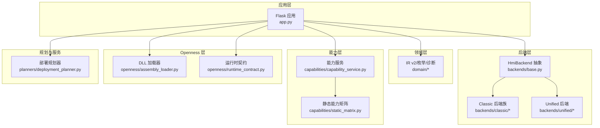
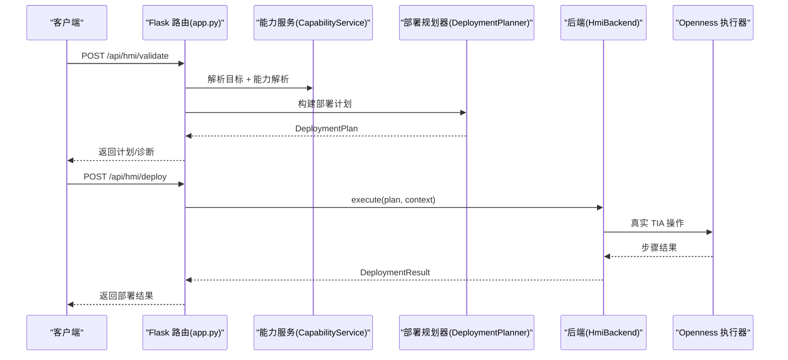
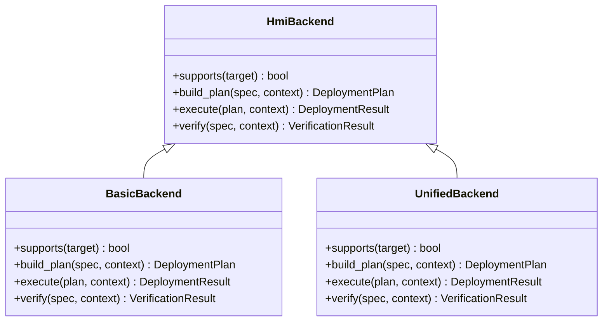
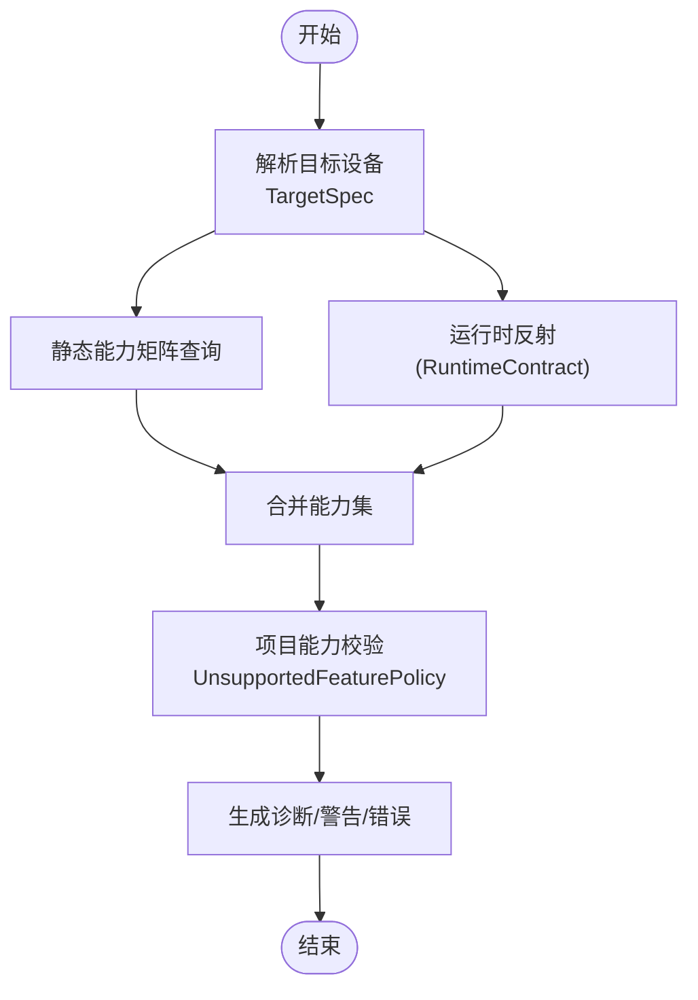
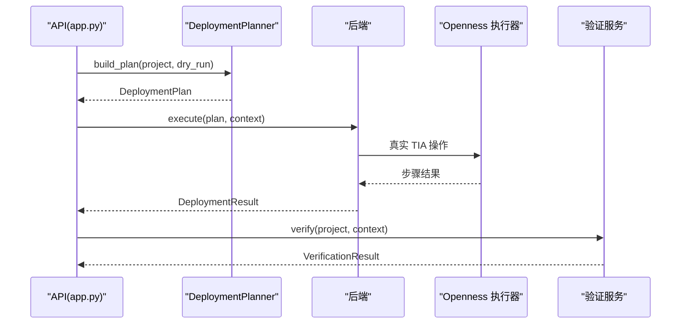
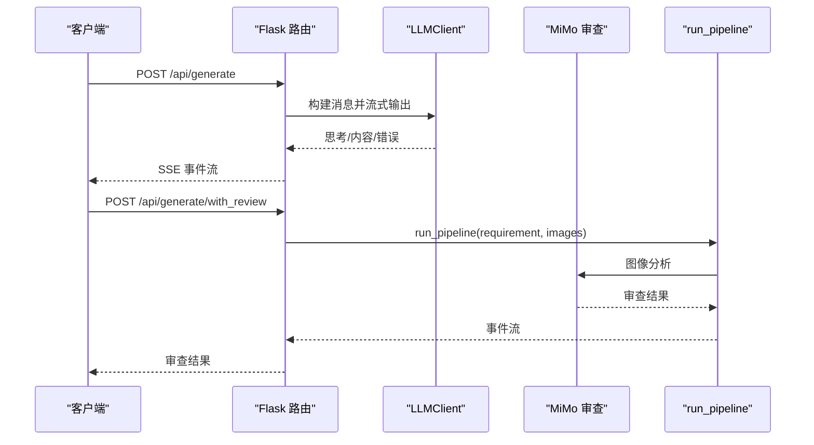
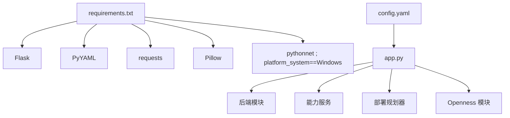

# 扩展开发

<cite>
**本文档引用的文件**
- [app.py](file://app.py)
- [config.yaml](file://config.yaml)
- [requirements.txt](file://requirements.txt)
- [backend/backends/base.py](file://backend/backends/base.py)
- [backend/backends/classic/__init__.py](file://backend/backends/classic/__init__.py)
- [backend/backends/unified/__init__.py](file://backend/backends/unified/__init__.py)
- [backend/backends/classic/basic_backend.py](file://backend/backends/classic/basic_backend.py)
- [backend/backends/unified/unified_backend.py](file://backend/backends/unified/unified_backend.py)
- [backend/capabilities/capability_service.py](file://backend/capabilities/capability_service.py)
- [backend/capabilities/static_matrix.py](file://backend/capabilities/static_matrix.py)
- [backend/planners/deployment_planner.py](file://backend/planners/deployment_planner.py)
- [backend/domain/enums.py](file://backend/domain/enums.py)
- [backend/openness/assembly_loader.py](file://backend/openness/assembly_loader.py)
- [backend/openness/runtime_contract.py](file://backend/openness/runtime_contract.py)
- [tests/test_backends.py](file://tests/test_backends.py)
- [Documents/README_Basic_HMI_Support.md](file://Documents/README_Basic_HMI_Support.md)
</cite>

## 目录
1. [简介](#简介)
2. [项目结构](#项目结构)
3. [核心组件](#核心组件)
4. [架构总览](#架构总览)
5. [详细组件分析](#详细组件分析)
6. [依赖分析](#依赖分析)
7. [性能考虑](#性能考虑)
8. [故障排查指南](#故障排查指南)
9. [结论](#结论)
10. [附录](#附录)

## 简介
本指南面向希望扩展 Siemens HMI Assistant 的开发者，系统讲解如何：
- 开发新的后端（Classic/Unified/BASIC）以适配不同 HMI 类型
- 扩展能力矩阵（静态能力表）与运行时能力发现
- 集成新的 LLM 提供商与视觉审查能力
- 支持新的 HMI 类型与生成策略定制
- 设计插件化扩展点与最佳实践

文档基于现有代码库进行深入分析，提供架构图、序列图与流程图，并给出可落地的扩展示例与开发规范。

## 项目结构
系统采用“领域驱动 + 插件化后端 + 能力服务 + 部署规划器”的分层设计：
- 应用层：Flask 路由与 API，负责接收请求、组装上下文、调度后端与服务
- 领域层：IR v2、枚举、诊断、部署计划/结果等核心模型
- 后端层：Classic（Basic/Comfort）、Unified 两类后端，统一抽象于 HmiBackend
- 能力层：静态能力矩阵 + 运行时反射（Openness）能力合并
- Openness 层：DLL 加载、运行时契约、执行器、诊断工具
- 规划与服务：部署规划器、部署服务、验证服务
- 配置与测试：config.yaml、requirements.txt、单元测试

**图表来源**
- [app.py:1-966](file://app.py#L1-L966)
- [backend/backends/base.py:1-32](file://backend/backends/base.py#L1-L32)
- [backend/backends/classic/__init__.py:1-35](file://backend/backends/classic/__init__.py#L1-L35)
- [backend/backends/unified/__init__.py:1-22](file://backend/backends/unified/__init__.py#L1-L22)
- [backend/capabilities/capability_service.py:1-223](file://backend/capabilities/capability_service.py#L1-L223)
- [backend/capabilities/static_matrix.py:1-66](file://backend/capabilities/static_matrix.py#L1-L66)
- [backend/planners/deployment_planner.py:1-300](file://backend/planners/deployment_planner.py#L1-L300)
- [backend/openness/assembly_loader.py:1-142](file://backend/openness/assembly_loader.py#L1-L142)
- [backend/openness/runtime_contract.py:1-203](file://backend/openness/runtime_contract.py#L1-L203)

**章节来源**
- [app.py:1-966](file://app.py#L1-L966)
- [config.yaml:1-343](file://config.yaml#L1-L343)
- [requirements.txt:1-25](file://requirements.txt#L1-L25)

## 核心组件
- HmiBackend 抽象：定义 supports/build_plan/execute/verify 四大接口，统一后端行为
- Classic 后端（Basic/Comfort）：基于 XML 与 FunctionList，支持变量表导入、画面模板改写、引用泄漏检查
- Unified 后端：基于 HmiUnified 对象模型，需要 RuntimeContract 缓存与 DLL 反射
- 能力服务：组合静态矩阵与运行时反射，输出能力集并校验项目可行性
- 部署规划器：按阶段自动生成部署步骤，聚合诊断
- Openness：DLL 加载、运行时契约扫描、执行器、诊断工具
- 应用层 API：统一暴露生成、构建、能力查询、部署、验证等接口

**章节来源**
- [backend/backends/base.py:10-32](file://backend/backends/base.py#L10-L32)
- [backend/backends/classic/basic_backend.py:31-643](file://backend/backends/classic/basic_backend.py#L31-L643)
- [backend/backends/unified/unified_backend.py:23-306](file://backend/backends/unified/unified_backend.py#L23-L306)
- [backend/capabilities/capability_service.py:64-223](file://backend/capabilities/capability_service.py#L64-L223)
- [backend/planners/deployment_planner.py:34-300](file://backend/planners/deployment_planner.py#L34-L300)
- [backend/openness/assembly_loader.py:47-142](file://backend/openness/assembly_loader.py#L47-L142)
- [backend/openness/runtime_contract.py:112-203](file://backend/openness/runtime_contract.py#L112-L203)
- [app.py:517-630](file://app.py#L517-L630)

## 架构总览
系统通过 Flask 路由将请求分派至能力服务、部署规划器与后端执行器；后端在 Dry Run 与真实部署之间切换，结合 Openness 执行器与验证服务完成全生命周期管理。

**图表来源**
- [app.py:636-761](file://app.py#L636-L761)
- [backend/capabilities/capability_service.py:64-100](file://backend/capabilities/capability_service.py#L64-L100)
- [backend/planners/deployment_planner.py:50-300](file://backend/planners/deployment_planner.py#L50-L300)
- [backend/backends/classic/basic_backend.py:76-450](file://backend/backends/classic/basic_backend.py#L76-L450)
- [backend/backends/unified/unified_backend.py:96-261](file://backend/backends/unified/unified_backend.py#L96-L261)

## 详细组件分析

### 后端扩展点与插件架构
- 抽象接口：所有后端需实现 supports/build_plan/execute/verify
- Classic 后端族：包含标签、画面、动态、VBS、模板改写、校验等子模块
- Unified 后端：通过 Builder 组件化生成标签、画面、绑定、事件、JS，依赖 RuntimeContract

**图表来源**
- [backend/backends/base.py:10-32](file://backend/backends/base.py#L10-L32)
- [backend/backends/classic/basic_backend.py:31-643](file://backend/backends/classic/basic_backend.py#L31-L643)
- [backend/backends/unified/unified_backend.py:23-306](file://backend/backends/unified/unified_backend.py#L23-L306)

**章节来源**
- [backend/backends/base.py:10-32](file://backend/backends/base.py#L10-L32)
- [backend/backends/classic/__init__.py:1-35](file://backend/backends/classic/__init__.py#L1-L35)
- [backend/backends/unified/__init__.py:1-22](file://backend/backends/unified/__init__.py#L1-L22)

### 能力矩阵与能力检测机制
- 静态矩阵：定义各能力在 Basic/Comfort/Unified 下的支持状态
- 运行时反射：通过 RuntimeContract 从 DLL 中扫描类型/方法/属性/事件
- 能力服务：合并静态矩阵与运行时信息，输出能力集并校验项目

**图表来源**
- [backend/capabilities/capability_service.py:64-223](file://backend/capabilities/capability_service.py#L64-L223)
- [backend/capabilities/static_matrix.py:14-66](file://backend/capabilities/static_matrix.py#L14-L66)
- [backend/openness/runtime_contract.py:112-203](file://backend/openness/runtime_contract.py#L112-L203)

**章节来源**
- [backend/capabilities/capability_service.py:64-223](file://backend/capabilities/capability_service.py#L64-L223)
- [backend/capabilities/static_matrix.py:14-66](file://backend/capabilities/static_matrix.py#L14-L66)
- [backend/openness/runtime_contract.py:112-203](file://backend/openness/runtime_contract.py#L112-L203)

### 部署流程与执行器
- 规划阶段：按依赖顺序生成 DeploymentPlan，包含连接、标签表、标签、脚本、资源、画面、控件、绑定、事件、编译、验证、保存
- 执行阶段：Classic/Unified 后端根据 Dry Run 与连接状态选择执行路径
- 验证阶段：查询 TIA 对象快照，反向导出 XML，进行语义与引用验证

**图表来源**
- [backend/planners/deployment_planner.py:50-300](file://backend/planners/deployment_planner.py#L50-L300)
- [backend/backends/classic/basic_backend.py:76-450](file://backend/backends/classic/basic_backend.py#L76-L450)
- [backend/backends/unified/unified_backend.py:96-261](file://backend/backends/unified/unified_backend.py#L96-L261)

**章节来源**
- [backend/planners/deployment_planner.py:50-300](file://backend/planners/deployment_planner.py#L50-L300)
- [app.py:636-761](file://app.py#L636-L761)

### LLM 与视觉审查集成
- LLM 客户端：支持多种提供商（DeepSeek/OpenAI 兼容），可配置流式输出与思考深度
- 视觉审查：MiMo 视觉技能模块，支持图片分析与多阶段流水线
- API：/api/generate 与 /api/generate/with_review 提供流式生成与审查

**图表来源**
- [app.py:166-267](file://app.py#L166-L267)
- [app.py:254-266](file://app.py#L254-L266)

**章节来源**
- [app.py:166-267](file://app.py#L166-L267)
- [config.yaml:1-343](file://config.yaml#L1-L343)

### 扩展示例与开发规范

#### 新增后端（以 Basic 为例）
- 实现 HmiBackend 抽象：supports/build_plan/execute/verify
- 在 Classic 后端族中复用通用组件（标签、画面、动态、模板改写）
- 在 Unified 后端中使用 Builder 组件化生成
- 注册后端：在工厂或路由中按 TargetSpec.family 分派

参考文件路径：
- [backend/backends/base.py:10-32](file://backend/backends/base.py#L10-L32)
- [backend/backends/classic/basic_backend.py:31-643](file://backend/backends/classic/basic_backend.py#L31-L643)
- [backend/backends/unified/unified_backend.py:23-306](file://backend/backends/unified/unified_backend.py#L23-L306)

**章节来源**
- [backend/backends/base.py:10-32](file://backend/backends/base.py#L10-L32)
- [backend/backends/classic/basic_backend.py:31-643](file://backend/backends/classic/basic_backend.py#L31-L643)
- [backend/backends/unified/unified_backend.py:23-306](file://backend/backends/unified/unified_backend.py#L23-L306)

#### 扩展能力矩阵
- 在静态矩阵中添加能力项，按 family 映射支持状态
- 如需运行时覆盖，可在 CapabilityService.resolve 中注入 runtime_metadata

参考文件路径：
- [backend/capabilities/static_matrix.py:14-66](file://backend/capabilities/static_matrix.py#L14-L66)
- [backend/capabilities/capability_service.py:64-100](file://backend/capabilities/capability_service.py#L64-L100)

**章节来源**
- [backend/capabilities/static_matrix.py:14-66](file://backend/capabilities/static_matrix.py#L14-L66)
- [backend/capabilities/capability_service.py:64-100](file://backend/capabilities/capability_service.py#L64-L100)

#### 集成新 LLM 提供商
- 在配置中新增提供商节点，设置 base_url/api_key/chat_model/reasoner_model
- 在 LLMClient 中扩展提供商分支，确保流式输出与 JSON 提取一致
- 可选启用视觉能力（如 supports_vision）

参考文件路径：
- [config.yaml:1-343](file://config.yaml#L1-L343)
- [app.py:186-216](file://app.py#L186-L216)

**章节来源**
- [config.yaml:1-343](file://config.yaml#L1-L343)
- [app.py:186-216](file://app.py#L186-L216)

#### 支持新 HMI 类型（以 Basic 为例）
- 在枚举中添加新家族（如 BASIC/COMFORT/UNIFIED/AUTO）
- 在后端中实现 supports/target.family 分支
- 在能力矩阵中补充对应能力状态
- 在 Openness 侧确保 DLL 路径与运行时契约可用

参考文件路径：
- [backend/domain/enums.py:11-16](file://backend/domain/enums.py#L11-L16)
- [backend/backends/classic/basic_backend.py:51-52](file://backend/backends/classic/basic_backend.py#L51-L52)
- [backend/capabilities/static_matrix.py:24-42](file://backend/capabilities/static_matrix.py#L24-L42)
- [Documents/README_Basic_HMI_Support.md:1-34](file://Documents/README_Basic_HMI_Support.md#L1-L34)

**章节来源**
- [backend/domain/enums.py:11-16](file://backend/domain/enums.py#L11-L16)
- [backend/backends/classic/basic_backend.py:51-52](file://backend/backends/classic/basic_backend.py#L51-L52)
- [backend/capabilities/static_matrix.py:24-42](file://backend/capabilities/static_matrix.py#L24-L42)
- [Documents/README_Basic_HMI_Support.md:1-34](file://Documents/README_Basic_HMI_Support.md#L1-L34)

#### 能力检测机制扩展
- 通过 RuntimeContract 从 DLL 反射类型/方法/属性/事件
- 在 CapabilityService.resolve 中合并静态矩阵与运行时信息
- 在 DeploymentPlanner 中按 UnsupportedFeaturePolicy 决策

参考文件路径：
- [backend/openness/runtime_contract.py:112-203](file://backend/openness/runtime_contract.py#L112-L203)
- [backend/capabilities/capability_service.py:64-100](file://backend/capabilities/capability_service.py#L64-L100)
- [backend/planners/deployment_planner.py:84-105](file://backend/planners/deployment_planner.py#L84-L105)

**章节来源**
- [backend/openness/runtime_contract.py:112-203](file://backend/openness/runtime_contract.py#L112-L203)
- [backend/capabilities/capability_service.py:64-100](file://backend/capabilities/capability_service.py#L64-L100)
- [backend/planners/deployment_planner.py:84-105](file://backend/planners/deployment_planner.py#L84-L105)

#### 生成策略定制
- 通过 config.yaml 的 hmi_defaults 与 openness.default_templates 控制默认分辨率、HMI 类型与模板路径
- Basic/Comfort/Unified 三类模板策略可通过 generation_mode 与 classic_template/unified_direct 控制
- 生成前通过 VariableEngine 绑定 process_tag 并生成 HMI Tags/VBS/JS

参考文件路径：
- [config.yaml:56-58](file://config.yaml#L56-L58)
- [config.yaml:31-55](file://config.yaml#L31-L55)
- [app.py:276-310](file://app.py#L276-L310)

**章节来源**
- [config.yaml:56-58](file://config.yaml#L56-L58)
- [config.yaml:31-55](file://config.yaml#L31-L55)
- [app.py:276-310](file://app.py#L276-L310)

## 依赖分析
- Flask 与配置：Flask 提供路由，PyYAML 读取 config.yaml
- LLM 与视觉：requests 流式调用，Pillow 图像处理
- Openness 仅 Windows：pythonnet 用于加载 Siemens.Engineering.dll
- 后端依赖：后端不直接依赖 Flask/pythonnet/Siemens DLL，便于测试与隔离

**图表来源**
- [requirements.txt:1-25](file://requirements.txt#L1-L25)
- [config.yaml:1-343](file://config.yaml#L1-L343)
- [app.py:1-966](file://app.py#L1-L966)

**章节来源**
- [requirements.txt:1-25](file://requirements.txt#L1-L25)
- [config.yaml:1-343](file://config.yaml#L1-L343)
- [app.py:1-966](file://app.py#L1-L966)

## 性能考虑
- 部署规划器按阶段生成步骤，避免一次性构建复杂图谱
- 能力服务缓存静态矩阵查询结果，减少重复计算
- Openness DLL 反射结果持久化为 RuntimeContract 缓存，避免重复扫描
- 流式生成与 SSE 输出降低前端等待时间

[本节为通用指导，无需特定文件引用]

## 故障排查指南
- 未连接 TIA：检查 /api/openness/diagnose 与 /api/openness/status，确认 pythonnet 可用与 DLL 路径正确
- 运行时契约缺失：通过 RuntimeProber.probe 扫描 DLL 并生成缓存
- 能力不匹配：查看 /api/hmi/capabilities 返回的能力矩阵与运行时信息
- 部署失败：检查 DeploymentResult.details 中 failed_step 与诊断信息
- Basic VBS 被拒：Basic 面板不支持 VBS，应改用 FunctionList 或 PLC 逻辑

**章节来源**
- [app.py:316-334](file://app.py#L316-L334)
- [backend/openness/runtime_contract.py:112-203](file://backend/openness/runtime_contract.py#L112-L203)
- [app.py:569-630](file://app.py#L569-L630)
- [tests/test_backends.py:86-90](file://tests/test_backends.py#L86-L90)

## 结论
本指南提供了 Siemens HMI Assistant 的扩展蓝图：以 HmiBackend 抽象为核心，结合能力服务与部署规划器，配合 Openness 执行器与验证服务，形成可测试、可扩展、可维护的后端生态。开发者可据此快速实现新后端、扩展能力矩阵、集成新 LLM 提供商与视觉审查能力，并通过配置与策略定制满足不同 HMI 类型与业务场景。

[本节为总结，无需特定文件引用]

## 附录
- 测试参考：通过 tests/test_backends.py 验证后端 supports/build_plan/execute/verify 行为
- Basic HMI 支持：参考 Documents/README_Basic_HMI_Support.md 的配置与使用说明

**章节来源**
- [tests/test_backends.py:1-126](file://tests/test_backends.py#L1-L126)
- [Documents/README_Basic_HMI_Support.md:1-34](file://Documents/README_Basic_HMI_Support.md#L1-L34)