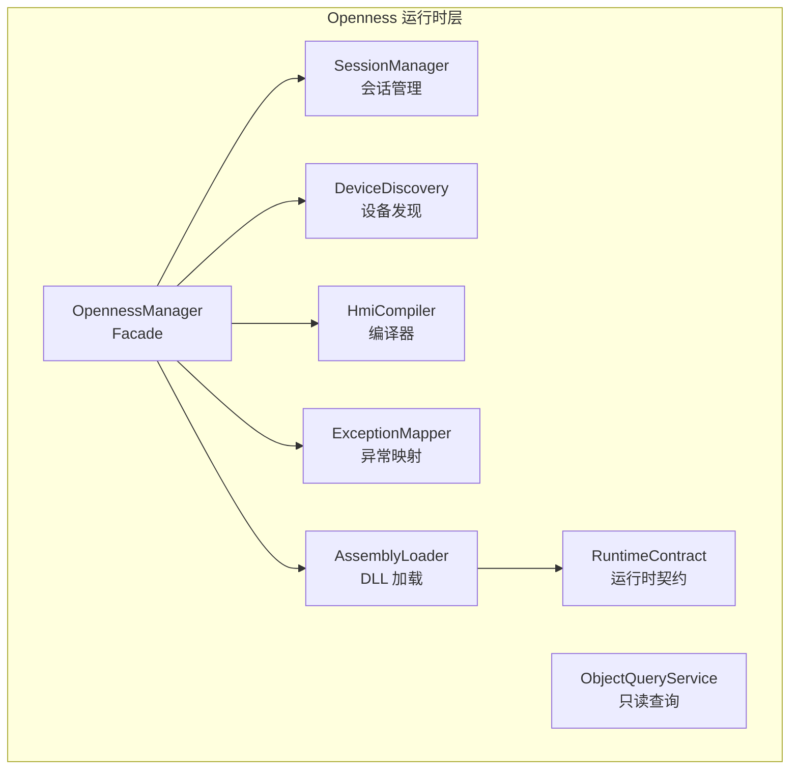
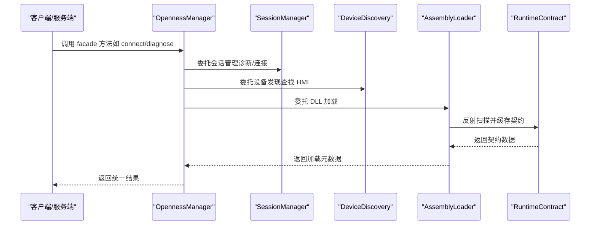
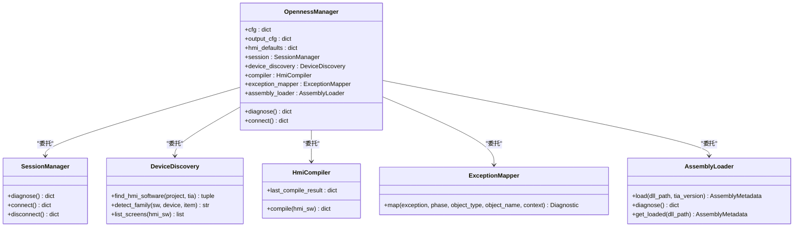
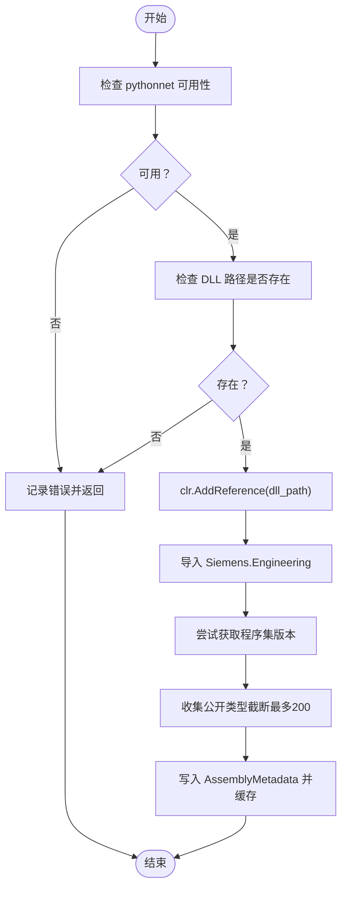
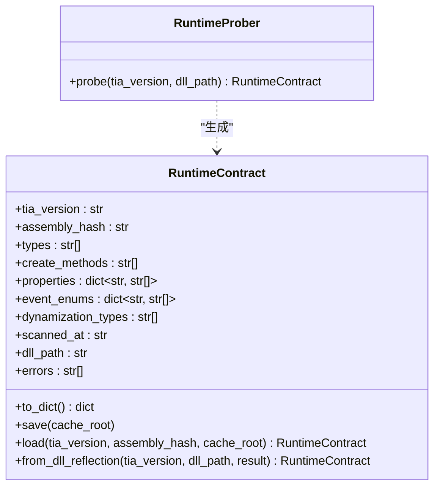
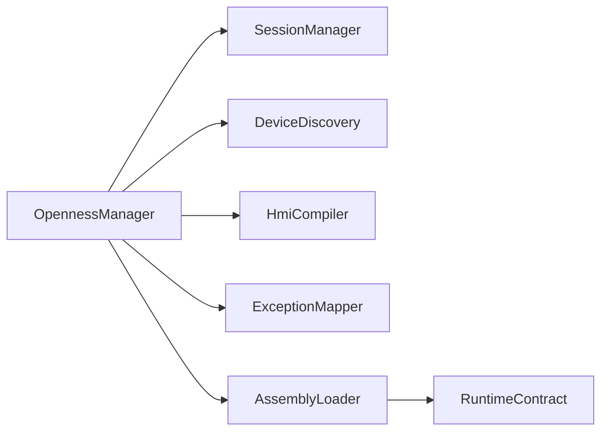

# 插件开发

<cite>
**本文档引用的文件**
- [backend/openness_manager.py](file://backend/openness_manager.py)
- [backend/openness/assembly_loader.py](file://backend/openness/assembly_loader.py)
- [backend/openness/runtime_contract.py](file://backend/openness/runtime_contract.py)
- [backend/openness/session_manager.py](file://backend/openness/session_manager.py)
- [backend/openness/device_discovery.py](file://backend/openness/device_discovery.py)
- [backend/openness/compiler.py](file://backend/openness/compiler.py)
- [backend/openness/exception_mapper.py](file://backend/openness/exception_mapper.py)
- [backend/openness/object_query_service.py](file://backend/openness/object_query_service.py)
- [config.yaml](file://config.yaml)
- [reference_catalog/V20/Basic/KTP700/manifest.yaml](file://reference_catalog/V20/Basic/KTP700/manifest.yaml)
- [app.py](file://app.py)
</cite>

## 目录
1. [简介](#简介)
2. [项目结构](#项目结构)
3. [核心组件](#核心组件)
4. [架构总览](#架构总览)
5. [详细组件分析](#详细组件分析)
6. [依赖分析](#依赖分析)
7. [性能考虑](#性能考虑)
8. [故障排查指南](#故障排查指南)
9. [结论](#结论)
10. [附录](#附录)

## 简介
本指南面向希望为 Siemens HMI Assistant 开发“插件”能力的工程师，聚焦于 Openness 运行时层的插件化架构与扩展点。文档涵盖：
- 插件架构设计与职责边界
- 接口规范与加载机制
- Openness Manager 的插件加载流程
- AssemblyLoader 的动态加载机制
- RuntimeContract 的契约定义与缓存
- 最佳实践、安全与性能优化
- 具体开发示例与调试技巧

## 项目结构
Openness 运行时层位于 backend/openness，采用“模块化拆分 + Facade 封装”的方式，将 .NET 依赖隔离在运行时层，其余业务层不直接耦合 Openness。

图示来源
- [backend/openness_manager.py:31-101](file://backend/openness_manager.py#L31-L101)
- [backend/openness/session_manager.py:14-52](file://backend/openness/session_manager.py#L14-L52)
- [backend/openness/device_discovery.py:15-28](file://backend/openness/device_discovery.py#L15-L28)
- [backend/openness/assembly_loader.py:47-59](file://backend/openness/assembly_loader.py#L47-L59)
- [backend/openness/runtime_contract.py:21-53](file://backend/openness/runtime_contract.py#L21-L53)
- [backend/openness/compiler.py:18-42](file://backend/openness/compiler.py#L18-L42)
- [backend/openness/exception_mapper.py:20-27](file://backend/openness/exception_mapper.py#L20-L27)
- [backend/openness/object_query_service.py:34-48](file://backend/openness/object_query_service.py#L34-L48)

章节来源
- [backend/openness/__init__.py:1-32](file://backend/openness/__init__.py#L1-L32)

## 核心组件
- OpennessManager（Facade）：对外统一入口，内部委托给 SessionManager、DeviceDiscovery、HmiCompiler、ExceptionMapper、AssemblyLoader。
- AssemblyLoader：加载 Siemens.Engineering DLL，记录版本与公开类型，防混用不同版本。
- RuntimeContract：对 DLL 进行反射扫描，输出类型、Create 方法、属性、事件枚举、动态化类型等，生成缓存文件。
- SessionManager：诊断、连接、附加、断开、打开项目。
- DeviceDiscovery：查找 HMI 设备并识别家族（Basic/Comfort/Unified）。
- HmiCompiler：触发 ICompilable.Compile，递归收集编译消息。
- ExceptionMapper：将 .NET 异常映射为结构化诊断。
- ObjectQueryService：只读查询 HMI 对象（标签、画面、事件、绑定、脚本），并持久化快照与导出 XML。

章节来源
- [backend/openness_manager.py:31-101](file://backend/openness_manager.py#L31-L101)
- [backend/openness/assembly_loader.py:47-142](file://backend/openness/assembly_loader.py#L47-L142)
- [backend/openness/runtime_contract.py:21-203](file://backend/openness/runtime_contract.py#L21-L203)
- [backend/openness/session_manager.py:14-154](file://backend/openness/session_manager.py#L14-L154)
- [backend/openness/device_discovery.py:15-173](file://backend/openness/device_discovery.py#L15-L173)
- [backend/openness/compiler.py:18-225](file://backend/openness/compiler.py#L18-L225)
- [backend/openness/exception_mapper.py:20-112](file://backend/openness/exception_mapper.py#L20-L112)
- [backend/openness/object_query_service.py:34-586](file://backend/openness/object_query_service.py#L34-L586)

## 架构总览
Openness 运行时层通过 Facade 将多子模块解耦，实现“按需懒加载 + 统一诊断 + 严格约束”的插件化架构。下图展示关键交互：

图示来源
- [backend/openness_manager.py:61-101](file://backend/openness_manager.py#L61-L101)
- [backend/openness/session_manager.py:92-141](file://backend/openness/session_manager.py#L92-L141)
- [backend/openness/device_discovery.py:28-78](file://backend/openness/device_discovery.py#L28-L78)
- [backend/openness/assembly_loader.py:78-137](file://backend/openness/assembly_loader.py#L78-L137)
- [backend/openness/runtime_contract.py:126-203](file://backend/openness/runtime_contract.py#L126-L203)

## 详细组件分析

### OpennessManager（Facade）分析
- 职责：对外提供统一入口，内部按需延迟初始化各子模块，保留旧 API 兼容。
- 关键点：
  - 委托属性：session、device_discovery、compiler、exception_mapper、assembly_loader。
  - 诊断：diagnose 返回 OS、pythonnet、DLL 路径、进程等诊断信息。
  - 连接：connect 附加到运行中的 TIA Portal 实例，支持指定项目路径。
  - XML 预处理：文本清洗、多语言文本重建、删除 <Number>、屏幕尺寸对齐、名称冲突检测、最终校验。
  - 导入封装：统一使用 Screens.Import(FileInfo, ImportOptions)，禁止反射/ASCII 临时路径等 hack。

图示来源
- [backend/openness_manager.py:31-101](file://backend/openness_manager.py#L31-L101)
- [backend/openness/session_manager.py:14-52](file://backend/openness/session_manager.py#L14-L52)
- [backend/openness/device_discovery.py:15-28](file://backend/openness/device_discovery.py#L15-L28)
- [backend/openness/compiler.py:18-46](file://backend/openness/compiler.py#L18-L46)
- [backend/openness/exception_mapper.py:20-48](file://backend/openness/exception_mapper.py#L20-L48)
- [backend/openness/assembly_loader.py:47-83](file://backend/openness/assembly_loader.py#L47-L83)

章节来源
- [backend/openness_manager.py:103-186](file://backend/openness_manager.py#L103-L186)
- [backend/openness_manager.py:194-362](file://backend/openness_manager.py#L194-L362)
- [backend/openness_manager.py:656-704](file://backend/openness_manager.py#L656-L704)

### AssemblyLoader 动态加载机制
- 功能：加载 Siemens.Engineering DLL，记录版本、文件路径、公开类型，防止混用不同版本。
- 关键点：
  - 诊断：检查 OS、pythonnet 可用性、已加载程序集列表。
  - 加载：添加 DLL 所在目录至 sys.path，clr.AddReference，记录 AssemblyMetadata。
  - 元数据：包含 tia_version、assembly_name、assembly_version、public_types、warnings、errors。
  - 安全：若 pythonnet 不可用或 DLL 不存在，记录错误并返回。

图示来源
- [backend/openness/assembly_loader.py:69-137](file://backend/openness/assembly_loader.py#L69-L137)

章节来源
- [backend/openness/assembly_loader.py:69-142](file://backend/openness/assembly_loader.py#L69-L142)

### RuntimeContract 契约定义与缓存
- 功能：对 DLL 进行反射扫描，输出类型、Create 方法、属性、事件枚举、动态化类型，生成缓存文件 runtime_cache/<tia-version>/<assembly-hash>.json。
- 关键点：
  - RuntimeContract：包含 tia_version、assembly_hash、types、create_methods、properties、event_enums、dynamization_types、scanned_at、dll_path、errors。
  - RuntimeProber：探测 DLL 并返回 RuntimeContract；无 DLL 时返回空契约。
  - 缓存：save/load，基于 DLL 路径计算短哈希，按 TIA 版本分目录存储。

图示来源
- [backend/openness/runtime_contract.py:21-110](file://backend/openness/runtime_contract.py#L21-L110)
- [backend/openness/runtime_contract.py:112-203](file://backend/openness/runtime_contract.py#L112-L203)

章节来源
- [backend/openness/runtime_contract.py:54-89](file://backend/openness/runtime_contract.py#L54-L89)
- [backend/openness/runtime_contract.py:66-89](file://backend/openness/runtime_contract.py#L66-L89)

### SessionManager 会话管理
- 功能：诊断环境、连接/附加 TIA Portal、打开项目、断开连接。
- 关键点：
  - 诊断：检查 OS、pythonnet、DLL 路径、进程是否存在。
  - 连接：支持 attach_running=true（附加现有实例）或 WithUserInterface（新建窗口）。
  - 断开：Dispose 会话，不关闭 TIA 本体。

章节来源
- [backend/openness/session_manager.py:53-90](file://backend/openness/session_manager.py#L53-L90)
- [backend/openness/session_manager.py:92-141](file://backend/openness/session_manager.py#L92-L141)
- [backend/openness/session_manager.py:143-154](file://backend/openness/session_manager.py#L143-L154)

### DeviceDiscovery 设备发现
- 功能：遍历项目设备，找到 HMI 软件对象，识别家族（Basic/Comfort/Unified），列出已有画面。
- 关键点：
  - 尝试加载 HmiUnified/Hmi 程序集。
  - 通过 SoftwareContainer 定位软件对象，匹配名称/类型标识符/订单号。
  - 家族识别：优先配置，其次从类型名/模块名/属性值推断。

章节来源
- [backend/openness/device_discovery.py:28-78](file://backend/openness/device_discovery.py#L28-L78)
- [backend/openness/device_discovery.py:80-139](file://backend/openness/device_discovery.py#L80-L139)
- [backend/openness/device_discovery.py:141-173](file://backend/openness/device_discovery.py#L141-L173)

### HmiCompiler 编译器
- 功能：触发 ICompilable.Compile，递归收集编译消息（Info/Warning/Error）。
- 关键点：
  - dry mode：hmi_software=None 时返回 ok=True。
  - 递归遍历：Messages[]、ErrorMessages/WarningMessages/InfoMessages 等兼容结构。
  - 结果：包含 ok、errors、warnings、infos、messages。

章节来源
- [backend/openness/compiler.py:47-108](file://backend/openness/compiler.py#L47-L108)
- [backend/openness/compiler.py:125-225](file://backend/openness/compiler.py#L125-L225)

### ExceptionMapper 异常映射
- 功能：捕获 .NET 异常，映射到结构化 Diagnostic，保留堆栈但不直接返回前端。
- 关键点：
  - 基于异常消息模式映射到标准错误码。
  - 提供修复建议（remediation）。

章节来源
- [backend/openness/exception_mapper.py:41-87](file://backend/openness/exception_mapper.py#L41-L87)
- [backend/openness/exception_mapper.py:89-112](file://backend/openness/exception_mapper.py#L89-L112)

### ObjectQueryService 只读查询
- 功能：从真实 TIA 项目读取对象（只读），不触发编译或修改。
- 关键点：
  - Classic vs Unified 走不同 API 路径。
  - 支持持久化快照、编译消息、导入日志，以及反向导出 Screens XML。
  - 严禁内部调用 Compile()，compile messages 必须由外部传入。

章节来源
- [backend/openness/object_query_service.py:57-97](file://backend/openness/object_query_service.py#L57-L97)
- [backend/openness/object_query_service.py:103-132](file://backend/openness/object_query_service.py#L103-L132)
- [backend/openness/object_query_service.py:450-505](file://backend/openness/object_query_service.py#L450-L505)
- [backend/openness/object_query_service.py:524-574](file://backend/openness/object_query_service.py#L524-L574)

## 依赖分析
- 模块内聚与耦合：
  - OpennessManager 作为 Facade，低耦合地委托各子模块，保持高内聚。
  - 运行时层仅在 backend/openness，domain/capabilities/planners 等上层不直接依赖。
- 外部依赖：
  - pythonnet（clr）、Siemens.Engineering.dll（TIA PublicAPI）。
  - System.IO、System.Reflection 等 .NET 类型。
- 循环依赖：
  - 未发现循环依赖；OpennessManager 通过延迟导入避免启动时耦合。

图示来源
- [backend/openness_manager.py:61-101](file://backend/openness_manager.py#L61-L101)
- [backend/openness/assembly_loader.py:47-59](file://backend/openness/assembly_loader.py#L47-L59)
- [backend/openness/runtime_contract.py:21-35](file://backend/openness/runtime_contract.py#L21-L35)

章节来源
- [backend/openness/__init__.py:18-31](file://backend/openness/__init__.py#L18-L31)

## 性能考虑
- 懒加载与按需初始化：OpennessManager 的委托属性采用延迟初始化，避免不必要的 .NET 初始化。
- 反射与缓存：RuntimeContract 将反射结果缓存到 runtime_cache，避免重复扫描 DLL。
- 诊断先行：SessionManager/AssemblyLoader 的 diagnose 优先返回环境信息，减少无效连接尝试。
- 只读查询：ObjectQueryService 不触发编译，降低对 TIA 的压力。
- XML 预处理流水线：在导入前完成清洗、重建、尺寸对齐与冲突检测，减少后续失败重试。

## 故障排查指南
- 环境诊断
  - OS 非 Windows 或缺少 pythonnet：Openness 仅支持 Windows + pythonnet。
  - DLL 路径不存在：检查 config.yaml 中 openness.dll_path。
  - 未发现运行中的 TIA 实例：确保已打开 TIA Portal 并加载项目。
- 异常映射
  - 使用 ExceptionMapper 将 .NET 异常映射为结构化诊断，查看错误码与修复建议。
- 编译结果
  - 通过 HmiCompiler.compile 获取编译消息，注意 ErrorCount > 0 即视为失败。
- 只读验证
  - 使用 ObjectQueryService.export_screens_xml 反向导出 XML，比对部署前后差异。

章节来源
- [backend/openness/session_manager.py:53-90](file://backend/openness/session_manager.py#L53-L90)
- [backend/openness/assembly_loader.py:69-76](file://backend/openness/assembly_loader.py#L69-L76)
- [backend/openness/exception_mapper.py:41-87](file://backend/openness/exception_mapper.py#L41-L87)
- [backend/openness/compiler.py:47-108](file://backend/openness/compiler.py#L47-L108)
- [backend/openness/object_query_service.py:450-505](file://backend/openness/object_query_service.py#L450-L505)

## 结论
通过 Openness 运行时层的模块化设计与 Facade 封装，Siemens HMI Assistant 将 .NET 依赖隔离在底层，上层业务无需关心具体 TIA 版本与 API 差异。AssemblyLoader 与 RuntimeContract 提供稳定的动态加载与契约缓存，配合严格的导入/编译流程，确保插件扩展的安全与可靠。遵循本文最佳实践与调试技巧，可高效开发与维护插件模块。

## 附录

### 插件开发最佳实践
- 严格遵循“只读查询 + 不触发编译”的原则，避免副作用。
- 使用 Facade（OpennessManager）访问子模块，避免直接导入 .NET 类型。
- 在 AssemblyLoader 之后立即执行 RuntimeContract 探测与缓存，确保后续逻辑基于稳定契约。
- 导入前务必执行 XML 预处理流水线，减少 TIA 报错概率。
- 使用 ObjectQueryService 持久化快照与导出 XML，便于回归验证。

### 安全考虑
- 严禁在运行时反射调用未知 API，仅使用官方公开接口。
- 禁止使用 ASCII 临时路径或临时文件名 hack，统一使用 FileInfo。
- 严禁在只读查询中调用 Compile() 或任何修改操作。

### 性能优化建议
- 尽量复用已加载的 Session，避免频繁连接/断开。
- 合理使用 RuntimeContract 缓存，减少 DLL 反射开销。
- 批量导入时合并步骤，减少 TIA 交互次数。

### 配置参考
- config.yaml 中的 openness 段落包含 DLL 路径、目标 HMI 设备、屏幕分辨率、编译策略等关键参数。
- reference_catalog 中的 manifest.yaml 提供设备族与片段清单，便于模板化生成与一致性验证。

章节来源
- [config.yaml:19-30](file://config.yaml#L19-L30)
- [reference_catalog/V20/Basic/KTP700/manifest.yaml:1-35](file://reference_catalog/V20/Basic/KTP700/manifest.yaml#L1-L35)

### 调试技巧
- 使用 app.py 中的全局 Openness 连接，确保多次请求间保持附加态。
- 在测试中通过 OpennessManager 的委托属性快速验证各模块行为。
- 导入失败时，结合 OpennessManager 的诊断信息与 Attempt 记录定位问题。

章节来源
- [app.py:62-70](file://app.py#L62-L70)
- [backend/openness_manager.py:103-139](file://backend/openness_manager.py#L103-L139)
- [backend/openness_manager.py:675-704](file://backend/openness_manager.py#L675-L704)