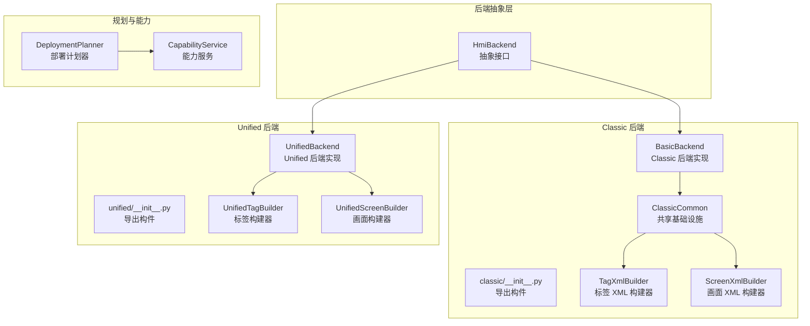
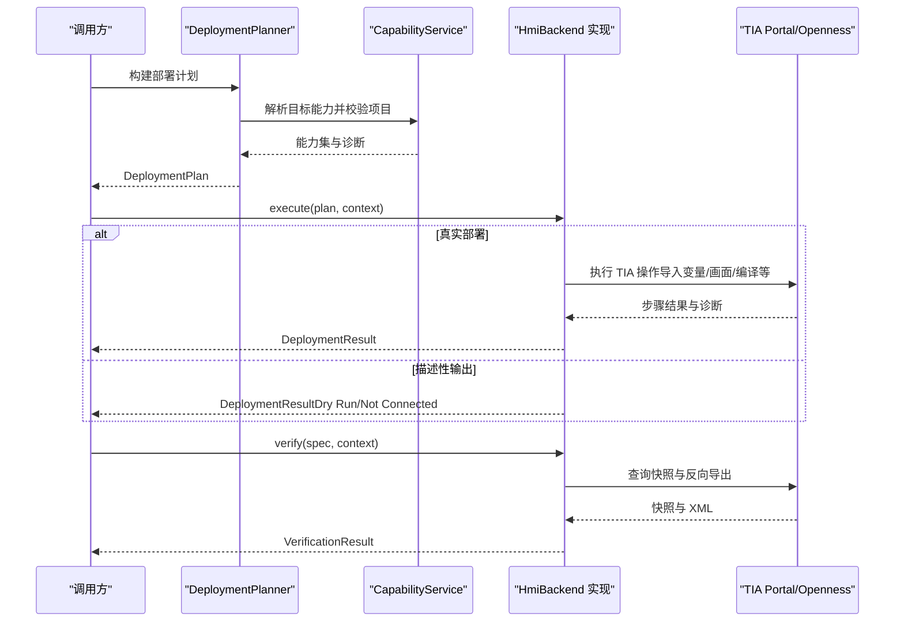
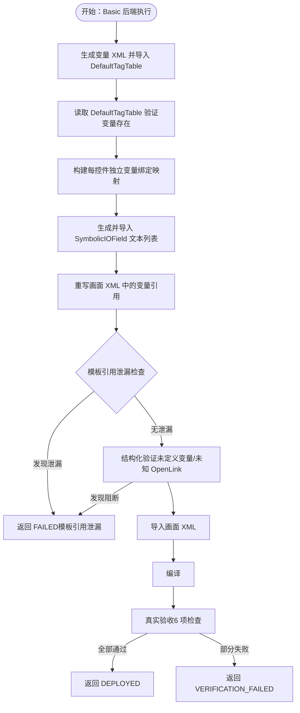
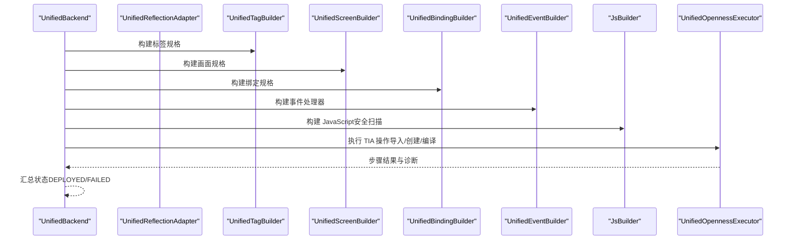
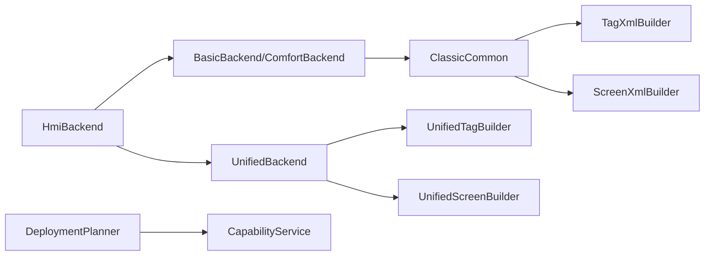

# 新后端实现

<cite>
**本文档引用的文件**
- [backend/backends/base.py](file://backend/backends/base.py)
- [backend/backends/classic/__init__.py](file://backend/backends/classic/__init__.py)
- [backend/backends/unified/__init__.py](file://backend/backends/unified/__init__.py)
- [backend/backends/classic/basic_backend.py](file://backend/backends/classic/basic_backend.py)
- [backend/backends/unified/unified_backend.py](file://backend/backends/unified/unified_backend.py)
- [backend/backends/classic/common.py](file://backend/backends/classic/common.py)
- [backend/backends/classic/tag_xml_builder.py](file://backend/backends/classic/tag_xml_builder.py)
- [backend/backends/classic/screen_xml_builder.py](file://backend/backends/classic/screen_xml_builder.py)
- [backend/backends/unified/tag_builder.py](file://backend/backends/unified/tag_builder.py)
- [backend/backends/unified/screen_builder.py](file://backend/backends/unified/screen_builder.py)
- [backend/planners/deployment_planner.py](file://backend/planners/deployment_planner.py)
- [backend/capabilities/capability_service.py](file://backend/capabilities/capability_service.py)
- [backend/domain/enums.py](file://backend/domain/enums.py)
- [tests/test_backends.py](file://tests/test_backends.py)
- [tests/test_unified_backend.py](file://tests/test_unified_backend.py)
- [config.yaml](file://config.yaml)
</cite>

## 目录
1. [简介](#简介)
2. [项目结构](#项目结构)
3. [核心组件](#核心组件)
4. [架构概览](#架构概览)
5. [详细组件分析](#详细组件分析)
6. [依赖分析](#依赖分析)
7. [性能考虑](#性能考虑)
8. [故障排除指南](#故障排除指南)
9. [结论](#结论)
10. [附录](#附录)

## 简介
本指南面向需要为 Siemens HMI Assistant 项目新增 HMI 类型后端的开发者。文档系统性阐述如何继承 BaseBackend、实现 XML 构建器以及定制生成策略，并对比 Classic 后端与 Unified 后端的设计模式差异，提供完整的开发流程、接口规范与测试方法。读者将学会如何实现屏幕构建器、标签构建器与事件构建器等关键组件。

## 项目结构
该项目采用分层与按功能域划分的组织方式：
- backend/backends：后端抽象与具体实现（Classic 与 Unified）
- backend/backends/classic：Classic HMI（Basic/Comfort）相关构建器与工具
- backend/backends/unified：Unified HMI 直接对象模型构建器
- backend/planners：部署计划器
- backend/capabilities：能力服务与静态矩阵
- backend/domain：领域模型与枚举
- tests：单元测试套件
- config.yaml：系统配置

**图表来源**
- [backend/backends/base.py:10-32](file://backend/backends/base.py#L10-L32)
- [backend/backends/classic/__init__.py:1-35](file://backend/backends/classic/__init__.py#L1-L35)
- [backend/backends/unified/__init__.py:1-22](file://backend/backends/unified/__init__.py#L1-L22)
- [backend/backends/classic/basic_backend.py:31-643](file://backend/backends/classic/basic_backend.py#L31-L643)
- [backend/backends/unified/unified_backend.py:23-306](file://backend/backends/unified/unified_backend.py#L23-L306)
- [backend/backends/classic/common.py:20-108](file://backend/backends/classic/common.py#L20-L108)
- [backend/backends/classic/tag_xml_builder.py:15-286](file://backend/backends/classic/tag_xml_builder.py#L15-L286)
- [backend/backends/classic/screen_xml_builder.py:19-255](file://backend/backends/classic/screen_xml_builder.py#L19-L255)
- [backend/backends/unified/tag_builder.py:8-50](file://backend/backends/unified/tag_builder.py#L8-L50)
- [backend/backends/unified/screen_builder.py:8-48](file://backend/backends/unified/screen_builder.py#L8-L48)
- [backend/planners/deployment_planner.py:34-300](file://backend/planners/deployment_planner.py#L34-L300)
- [backend/capabilities/capability_service.py:64-223](file://backend/capabilities/capability_service.py#L64-L223)

**章节来源**
- [backend/backends/base.py:10-32](file://backend/backends/base.py#L10-L32)
- [backend/backends/classic/__init__.py:1-35](file://backend/backends/classic/__init__.py#L1-L35)
- [backend/backends/unified/__init__.py:1-22](file://backend/backends/unified/__init__.py#L1-L22)

## 核心组件
本节聚焦后端抽象接口与两个主要后端实现的关键职责与交互。

- HmiBackend 抽象接口
  - supports(target: TargetSpec) -> bool：判定目标设备族是否受支持
  - build_plan(spec: HmiProjectSpec, context: dict | None) -> DeploymentPlan：构建部署计划（含能力校验与诊断）
  - execute(plan: DeploymentPlan, context: dict | None) -> DeploymentResult：执行部署（真实 TIA 操作或描述性输出）
  - verify(spec: HmiProjectSpec, context: dict | None) -> VerificationResult：只读验证与语义验证

- Classic 后端（Basic/Comfort）
  - BasicBackend：实现 Classic XML 生成、变量导入 DefaultTagTable、引用重写、模板泄漏检查、真实验收等完整链路
  - ClassicCommon：封装共享构建器（标签、画面、函数列表、动态绑定、ID 注册、链接解析、校验器、引用重写器）

- Unified 后端
  - UnifiedBackend：通过 HmiUnified API 直接创建对象，支持标签、画面、属性、绑定、事件与 JS 构建器
  - 各构建器：UnifiedTagBuilder、UnifiedScreenBuilder、UnifiedPropertyBuilder、UnifiedBindingBuilder、UnifiedEventBuilder、JsBuilder

**章节来源**
- [backend/backends/base.py:10-32](file://backend/backends/base.py#L10-L32)
- [backend/backends/classic/basic_backend.py:31-643](file://backend/backends/classic/basic_backend.py#L31-L643)
- [backend/backends/classic/common.py:20-108](file://backend/backends/classic/common.py#L20-L108)
- [backend/backends/unified/unified_backend.py:23-306](file://backend/backends/unified/unified_backend.py#L23-L306)

## 架构概览
下图展示后端实现的整体架构与数据流：

**图表来源**
- [backend/planners/deployment_planner.py:50-300](file://backend/planners/deployment_planner.py#L50-L300)
- [backend/capabilities/capability_service.py:76-223](file://backend/capabilities/capability_service.py#L76-L223)
- [backend/backends/classic/basic_backend.py:76-450](file://backend/backends/classic/basic_backend.py#L76-L450)
- [backend/backends/unified/unified_backend.py:96-306](file://backend/backends/unified/unified_backend.py#L96-L306)

## 详细组件分析

### BaseBackend 接口与继承规范
- 继承要求
  - 必须实现 supports、build_plan、execute、verify 四个方法
  - supports 应依据 TargetSpec.family 与设备族常量进行判断
  - build_plan 内应结合 DeploymentPlanner 与 CapabilityService 进行能力解析与诊断收集
  - execute 应处理 dry_run、未连接、TIA 定位失败等边界情况
  - verify 应支持只读查询与语义验证

- 关键接口路径
  - [HmiBackend 抽象接口:10-32](file://backend/backends/base.py#L10-L32)
  - [HmiFamily 枚举:11-17](file://backend/domain/enums.py#L11-L17)

**章节来源**
- [backend/backends/base.py:10-32](file://backend/backends/base.py#L10-L32)
- [backend/domain/enums.py:11-17](file://backend/domain/enums.py#L11-L17)

### Classic 后端设计模式与实现要点
- 设计模式
  - 组合模式：ClassicCommon 组合多个构建器（标签、画面、函数列表、动态绑定、校验器、引用重写器）
  - 流水线模式：V3.2 完整链路包含变量生成与导入、文本列表生成、引用重写、模板泄漏检查、画面导入、编译与真实验收
  - 条件分支：根据设备族决定是否允许 VBS（Comfort 允许，Basic 禁止）

- 关键实现点
  - 变量导入 DefaultTagTable 并二次验证
  - 每控件独立变量映射，避免模板变量复用
  - SymbolicIOField 文本列表自动生成与降级处理
  - 画面引用重写与泄漏检查
  - 真实验收（6 项检查）确保部署质量

**图表来源**
- [backend/backends/classic/basic_backend.py:76-450](file://backend/backends/classic/basic_backend.py#L76-L450)
- [backend/backends/classic/common.py:77-96](file://backend/backends/classic/common.py#L77-L96)

**章节来源**
- [backend/backends/classic/basic_backend.py:31-643](file://backend/backends/classic/basic_backend.py#L31-L643)
- [backend/backends/classic/common.py:20-108](file://backend/backends/classic/common.py#L20-L108)

### Unified 后端设计模式与实现要点
- 设计模式
  - 延迟注入：UnifiedBackend 属性懒加载各构建器实例
  - 直接对象模型：通过 HmiUnified API 直接创建标签、画面、事件与脚本
  - 安全扫描：JsBuilder 对 JavaScript 事件处理器进行安全扫描

- 关键实现点
  - RuntimeContract 检查与缺失探测
  - 将 HmiProjectSpec 转换为 Unified 规格字典
  - 统一的 TIA 调用执行与结果汇总
  - 反向导出与语义验证

**图表来源**
- [backend/backends/unified/unified_backend.py:39-81](file://backend/backends/unified/unified_backend.py#L39-L81)
- [backend/backends/unified/tag_builder.py:14-35](file://backend/backends/unified/tag_builder.py#L14-L35)
- [backend/backends/unified/screen_builder.py:14-47](file://backend/backends/unified/screen_builder.py#L14-L47)
- [backend/backends/unified/unified_backend.py:228-260](file://backend/backends/unified/unified_backend.py#L228-L260)

**章节来源**
- [backend/backends/unified/unified_backend.py:23-306](file://backend/backends/unified/unified_backend.py#L23-L306)
- [backend/backends/unified/tag_builder.py:8-50](file://backend/backends/unified/tag_builder.py#L8-L50)
- [backend/backends/unified/screen_builder.py:8-48](file://backend/backends/unified/screen_builder.py#L8-L48)

### XML 构建器实现细节

#### Classic 标签构建器（TagXmlBuilder）
- 功能
  - 生成单变量导出 XML（符合 TIA Portal Basic 导出格式）
  - 生成批量变量导出 XML（导入 DefaultTagTable）
  - 生成 SymbolicIOField 文本列表 XML
  - 支持内部/外部变量属性映射

- 数据结构与复杂度
  - 时间复杂度：O(n)，n 为标签数量
  - 空间复杂度：O(n)，用于拼接 XML 字符串

- 关键路径
  - [build_single_tag_export_xml:32-101](file://backend/backends/classic/tag_xml_builder.py#L32-L101)
  - [build_tags_batch_export_xml:103-153](file://backend/backends/classic/tag_xml_builder.py#L103-L153)
  - [build_text_list_xml:159-216](file://backend/backends/classic/tag_xml_builder.py#L159-L216)

**章节来源**
- [backend/backends/classic/tag_xml_builder.py:15-286](file://backend/backends/classic/tag_xml_builder.py#L15-L286)

#### Classic 画面构建器（ScreenXmlBuilder）
- 功能
  - 生成画面头部/尾部与控件片段
  - 生成事件（FunctionList）与动态绑定（RangeAppearanceAnimation）
  - 多语言文本与静态属性处理

- 关键路径
  - [build_screen_item:53-113](file://backend/backends/classic/screen_xml_builder.py#L53-L113)
  - [_build_event_xml:115-151](file://backend/backends/classic/screen_xml_builder.py#L115-L151)
  - [_build_dynamic_binding_xml:153-193](file://backend/backends/classic/screen_xml_builder.py#L153-L193)

**章节来源**
- [backend/backends/classic/screen_xml_builder.py:19-255](file://backend/backends/classic/screen_xml_builder.py#L19-L255)

#### Unified 标签构建器（UnifiedTagBuilder）
- 功能
  - 将 TagSpec 转换为 Unified 创建参数字典
  - 生成 WinCC ML YAML 格式变量表（批量导入）

- 关键路径
  - [build_tag_spec:14-32](file://backend/backends/unified/tag_builder.py#L14-L32)
  - [build_wincc_ml:37-49](file://backend/backends/unified/tag_builder.py#L37-L49)

**章节来源**
- [backend/backends/unified/tag_builder.py:8-50](file://backend/backends/unified/tag_builder.py#L8-L50)

#### Unified 画面构建器（UnifiedScreenBuilder）
- 功能
  - 创建画面规格与控件规格
  - 应用静态属性（多语言文本、几何属性等）

- 关键路径
  - [create_screen_spec:14-22](file://backend/backends/unified/screen_builder.py#L14-L22)
  - [create_item_spec:24-40](file://backend/backends/unified/screen_builder.py#L24-L40)

**章节来源**
- [backend/backends/unified/screen_builder.py:8-48](file://backend/backends/unified/screen_builder.py#L8-L48)

### 生成策略定制
- Classic 生成策略
  - 变量导入 DefaultTagTable 并二次验证
  - 每控件独立变量映射，禁止模板变量复用
  - SymbolicIOField 文本列表自动生成，必要时降级为普通 IOField
  - 画面引用重写与泄漏检查
  - 真实验收（6 项检查）

- Unified 生成策略
  - 直接对象模型创建，无需中间 XML
  - RuntimeContract 检查与缺失探测
  - 事件处理器支持 FunctionList 与 JavaScript（安全扫描）
  - 统一 TIA 调用执行与结果汇总

**章节来源**
- [backend/backends/classic/basic_backend.py:76-450](file://backend/backends/classic/basic_backend.py#L76-L450)
- [backend/backends/unified/unified_backend.py:96-306](file://backend/backends/unified/unified_backend.py#L96-L306)

### 新后端开发完整流程
- 步骤
  1. 定义目标设备族与能力矩阵（参考 CapabilityService）
  2. 继承 HmiBackend，实现 supports/build_plan/execute/verify
  3. 设计构建器（标签/画面/事件/绑定等），遵循现有模式
  4. 集成 DeploymentPlanner 与 CapabilityService
  5. 实现安全与校验（如 VBS/JavaScript 安全扫描）
  6. 编写单元测试（参考测试套件）
  7. 配置系统参数（config.yaml）

- 关键接口与路径
  - [HmiBackend 抽象接口:10-32](file://backend/backends/base.py#L10-L32)
  - [DeploymentPlanner:50-300](file://backend/planners/deployment_planner.py#L50-L300)
  - [CapabilityService:76-223](file://backend/capabilities/capability_service.py#L76-L223)
  - [测试套件:15-126](file://tests/test_backends.py#L15-126)

**章节来源**
- [backend/backends/base.py:10-32](file://backend/backends/base.py#L10-L32)
- [backend/planners/deployment_planner.py:50-300](file://backend/planners/deployment_planner.py#L50-L300)
- [backend/capabilities/capability_service.py:76-223](file://backend/capabilities/capability_service.py#L76-L223)
- [tests/test_backends.py:15-126](file://tests/test_backends.py#L15-L126)

## 依赖分析
- 组件耦合
  - HmiBackend 是所有后端实现的统一入口，低耦合高内聚
  - Classic 后端通过 ClassicCommon 组合多个构建器，增强可维护性
  - Unified 后端采用延迟注入，降低初始化成本

- 外部依赖
  - TIA Portal/Openness（通过执行器访问）
  - 配置系统（config.yaml）

**图表来源**
- [backend/backends/base.py:10-32](file://backend/backends/base.py#L10-L32)
- [backend/backends/classic/common.py:20-108](file://backend/backends/classic/common.py#L20-L108)
- [backend/backends/unified/unified_backend.py:23-306](file://backend/backends/unified/unified_backend.py#L23-L306)
- [backend/planners/deployment_planner.py:34-300](file://backend/planners/deployment_planner.py#L34-L300)
- [backend/capabilities/capability_service.py:64-223](file://backend/capabilities/capability_service.py#L64-L223)

**章节来源**
- [backend/backends/classic/common.py:20-108](file://backend/backends/classic/common.py#L20-L108)
- [backend/backends/unified/unified_backend.py:23-306](file://backend/backends/unified/unified_backend.py#L23-L306)

## 性能考虑
- 构建器优化
  - 标签与画面构建器采用字符串拼接，时间复杂度 O(n)，建议批量处理减少 I/O
  - Classic 后端在导入变量后进行二次验证，避免后续步骤失败回滚

- 执行效率
  - Unified 后端通过统一 TIA 调用减少往返次数
  - 通过 RuntimeContract 缓存避免重复探测

- 内存管理
  - 构建器实例化按需延迟注入，降低内存占用

## 故障排除指南
- 常见问题
  - 未连接 TIA Portal：返回 NOT_CONNECTED 或描述性输出
  - Basic 面板不支持 VBS/特定动作：在 build_plan 阶段添加诊断
  - Unified RuntimeContract 缺失：执行前进行探测与提示
  - 模板引用泄漏：Classic 后端在引用重写后进行泄漏检查

- 关键诊断路径
  - [Basic 后端执行流程与诊断:76-450](file://backend/backends/classic/basic_backend.py#L76-450)
  - [Unified 后端执行流程与诊断:96-306](file://backend/backends/unified/unified_backend.py#L96-306)
  - [能力服务与不支持特性策略:127-223](file://backend/capabilities/capability_service.py#L127-223)

**章节来源**
- [backend/backends/classic/basic_backend.py:76-450](file://backend/backends/classic/basic_backend.py#L76-L450)
- [backend/backends/unified/unified_backend.py:96-306](file://backend/backends/unified/unified_backend.py#L96-L306)
- [backend/capabilities/capability_service.py:127-223](file://backend/capabilities/capability_service.py#L127-L223)

## 结论
通过继承 HmiBackend 并实现相应的构建器与执行流程，开发者可以快速扩展新的 HMI 类型后端。Classic 后端强调 XML 生成与引用重写，Unified 后端强调直接对象模型与安全扫描。结合 DeploymentPlanner 与 CapabilityService，可实现稳健的部署计划与能力校验；配合完善的测试与配置，确保新后端在生产环境中的可靠性与可维护性。

## 附录
- 接口规范与路径
  - [HmiBackend 抽象接口:10-32](file://backend/backends/base.py#L10-L32)
  - [HmiFamily/枚举:11-157](file://backend/domain/enums.py#L11-L157)
- 测试方法与示例
  - [后端测试套件:15-126](file://tests/test_backends.py#L15-126)
  - [Unified 后端测试套件:173-205](file://tests/test_unified_backend.py#L173-205)
- 系统配置
  - [config.yaml:19-60](file://config.yaml#L19-L60)