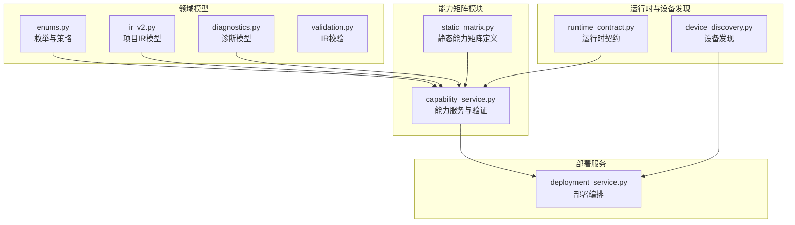
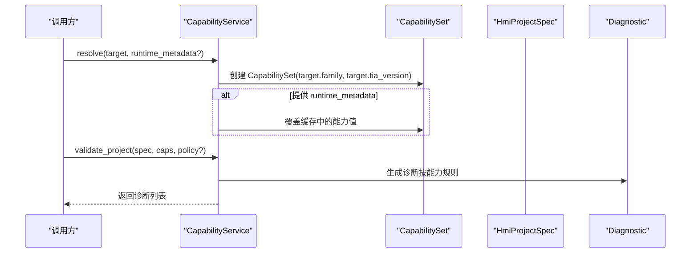
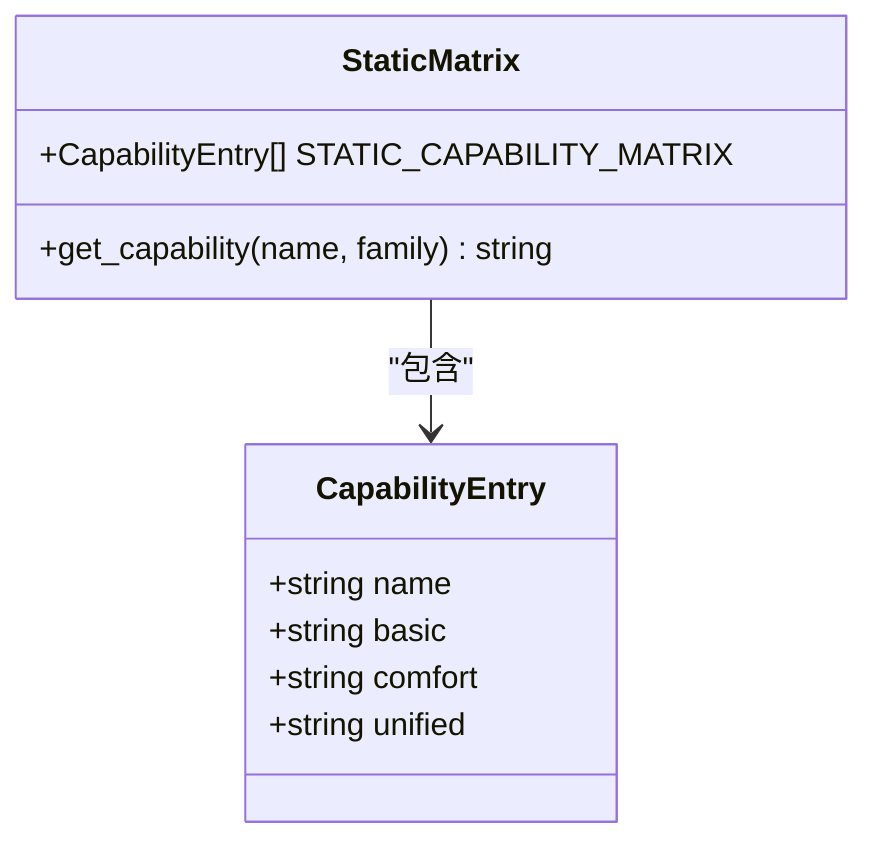
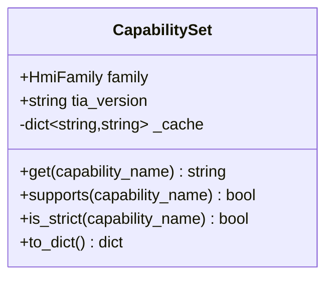
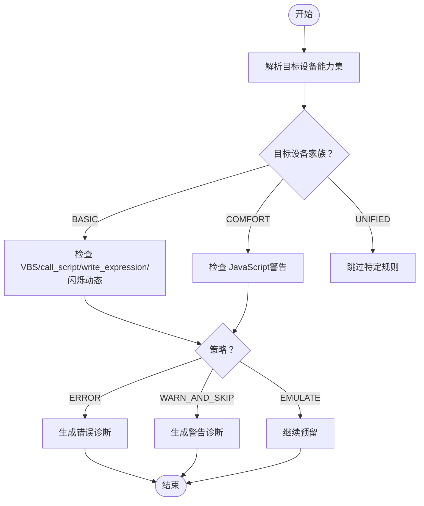
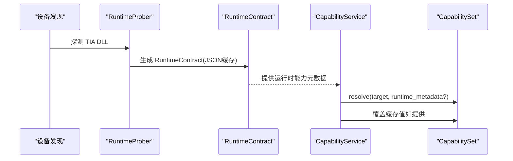
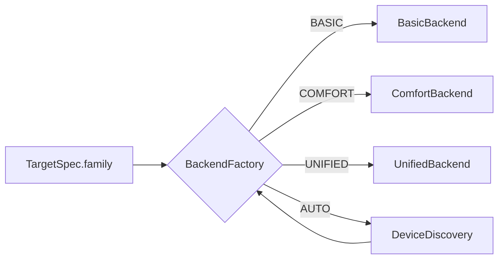
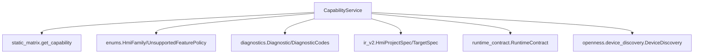

# 能力矩阵扩展

<cite>
**本文档引用的文件**
- [capability_service.py](file://backend/capabilities/capability_service.py)
- [static_matrix.py](file://backend/capabilities/static_matrix.py)
- [enums.py](file://backend/domain/enums.py)
- [ir_v2.py](file://backend/domain/ir_v2.py)
- [diagnostics.py](file://backend/domain/diagnostics.py)
- [validation.py](file://backend/domain/validation.py)
- [runtime_contract.py](file://backend/openness/runtime_contract.py)
- [device_discovery.py](file://backend/openness/device_discovery.py)
- [deployment_service.py](file://backend/services/deployment_service.py)
- [test_capabilities.py](file://tests/test_capabilities.py)
</cite>

## 目录
1. [简介](#简介)
2. [项目结构](#项目结构)
3. [核心组件](#核心组件)
4. [架构总览](#架构总览)
5. [详细组件分析](#详细组件分析)
6. [依赖关系分析](#依赖关系分析)
7. [性能考虑](#性能考虑)
8. [故障排除指南](#故障排除指南)
9. [结论](#结论)
10. [附录](#附录)

## 简介
本指南面向需要扩展设备能力检测机制的开发者，围绕“静态能力矩阵 + 运行时反射”的双层能力体系，系统讲解如何：
- 修改静态矩阵以新增或调整设备能力
- 实现运行时能力检测与覆盖
- 完善能力验证逻辑，确保项目在目标设备上的可行性
- 明确 CapabilityService 的工作原理、CapabilitySet 的数据结构与查询机制
- 提供新设备类型的能力定义方法、能力值含义与验证策略
- 规划能力矩阵的维护与更新流程

## 项目结构
能力矩阵相关的核心代码位于 backend/capabilities 目录，配合 domain、openness、services 等模块共同完成从目标设备识别到项目部署的全链路能力检测与验证。

图表来源
- [capability_service.py:1-223](file://backend/capabilities/capability_service.py#L1-L223)
- [static_matrix.py:1-66](file://backend/capabilities/static_matrix.py#L1-L66)
- [enums.py:1-157](file://backend/domain/enums.py#L1-L157)
- [ir_v2.py:1-354](file://backend/domain/ir_v2.py#L1-L354)
- [diagnostics.py:1-127](file://backend/domain/diagnostics.py#L1-L127)
- [validation.py:1-206](file://backend/domain/validation.py#L1-L206)
- [runtime_contract.py:1-203](file://backend/openness/runtime_contract.py#L1-L203)
- [device_discovery.py:1-173](file://backend/openness/device_discovery.py#L1-L173)
- [deployment_service.py:1-200](file://backend/services/deployment_service.py#L1-L200)

章节来源
- [capability_service.py:1-223](file://backend/capabilities/capability_service.py#L1-L223)
- [static_matrix.py:1-66](file://backend/capabilities/static_matrix.py#L1-L66)
- [enums.py:1-157](file://backend/domain/enums.py#L1-L157)
- [ir_v2.py:1-354](file://backend/domain/ir_v2.py#L1-L354)
- [diagnostics.py:1-127](file://backend/domain/diagnostics.py#L1-L127)
- [validation.py:1-206](file://backend/domain/validation.py#L1-L206)
- [runtime_contract.py:1-203](file://backend/openness/runtime_contract.py#L1-L203)
- [device_discovery.py:1-173](file://backend/openness/device_discovery.py#L1-L173)
- [deployment_service.py:1-200](file://backend/services/deployment_service.py#L1-L200)

## 核心组件
- 静态能力矩阵：以 CapabilityEntry 列表形式定义各设备家族（Basic/Comfort/Unified）对各项能力的支持程度。
- CapabilitySet：封装目标设备能力查询、缓存与导出。
- CapabilityService：解析目标设备能力集，并基于能力集对项目进行能力验证。
- 运行时契约：通过 RuntimeContract 从 DLL 反射获取实际运行时能力，作为静态矩阵的补充与覆盖。
- 设备发现：DeviceDiscovery 识别目标设备家族，为部署后端选择提供依据。
- 诊断与策略：Diagnostic 与 UnsupportedFeaturePolicy 等枚举定义统一的诊断与策略控制。

章节来源
- [capability_service.py:28-62](file://backend/capabilities/capability_service.py#L28-L62)
- [capability_service.py:64-223](file://backend/capabilities/capability_service.py#L64-L223)
- [static_matrix.py:14-66](file://backend/capabilities/static_matrix.py#L14-L66)
- [runtime_contract.py:21-53](file://backend/openness/runtime_contract.py#L21-L53)
- [device_discovery.py:15-173](file://backend/openness/device_discovery.py#L15-L173)
- [diagnostics.py:17-35](file://backend/domain/diagnostics.py#L17-L35)
- [enums.py:11-128](file://backend/domain/enums.py#L11-L128)

## 架构总览
能力检测与验证的整体流程如下：
- 输入：目标设备规格 TargetSpec 与项目 IR HmiProjectSpec
- 解析：CapabilityService.resolve 基于 TargetSpec 生成 CapabilitySet
- 运行时覆盖：若提供 runtime_metadata，则覆盖静态矩阵中的能力值
- 验证：CapabilityService.validate_project 检查项目特性与目标设备能力的匹配度
- 结果：返回诊断列表，结合 UnsupportedFeaturePolicy 决策错误/警告/跳过

图表来源
- [capability_service.py:76-99](file://backend/capabilities/capability_service.py#L76-L99)
- [capability_service.py:101-223](file://backend/capabilities/capability_service.py#L101-L223)

## 详细组件分析

### 静态能力矩阵与查询
- CapabilityEntry：定义单个能力项在 Basic/Comfort/Unified 三个家族中的支持值。
- STATIC_CAPABILITY_MATRIX：集中管理所有能力项及其家族支持矩阵。
- get_capability：按能力名称与家族查询对应支持值，返回 "yes"/"no"/"limited"/"device"/"unknown"。

图表来源
- [static_matrix.py:14-66](file://backend/capabilities/static_matrix.py#L14-L66)

章节来源
- [static_matrix.py:14-66](file://backend/capabilities/static_matrix.py#L14-L66)
- [test_capabilities.py:43-68](file://tests/test_capabilities.py#L43-L68)

### CapabilitySet 数据结构与查询机制
- 字段：family、tia_version、_cache（键为能力名，值为支持值）
- 查询方法：
  - get：从静态矩阵获取并缓存
  - supports：支持判断（yes/limited/device 视为支持）
  - is_strict：严格支持（仅 yes）
  - to_dict：导出为字典，包含 family、tia_version 与全部能力值

图表来源
- [capability_service.py:28-62](file://backend/capabilities/capability_service.py#L28-L62)

章节来源
- [capability_service.py:28-62](file://backend/capabilities/capability_service.py#L28-L62)
- [test_capabilities.py:70-91](file://tests/test_capabilities.py#L70-L91)

### CapabilityService 工作原理与验证策略
- resolve：根据 TargetSpec 创建 CapabilitySet；当前版本支持传入 runtime_metadata 覆盖缓存值（预留扩展点）
- validate_project：基于目标设备家族与能力集，对项目进行能力验证，生成诊断
  - Basic 面板禁用 VBS、call_script、write_expression；闪烁动态需设备支持
  - Comfort 面板禁用 JavaScript（警告）
  - 支持 UnsupportedFeaturePolicy 策略：ERROR/WARN_AND_SKIP/EMULATE

图表来源
- [capability_service.py:76-99](file://backend/capabilities/capability_service.py#L76-L99)
- [capability_service.py:101-223](file://backend/capabilities/capability_service.py#L101-L223)
- [enums.py:123-128](file://backend/domain/enums.py#L123-L128)

章节来源
- [capability_service.py:64-223](file://backend/capabilities/capability_service.py#L64-L223)
- [enums.py:11-128](file://backend/domain/enums.py#L11-L128)
- [test_capabilities.py:92-235](file://tests/test_capabilities.py#L92-L235)

### 运行时能力检测与覆盖
- RuntimeContract：从 DLL 反射获取类型、属性、事件枚举、动态化类型等信息，保存为 JSON 缓存
- RuntimeProber：探测 DLL 并生成 RuntimeContract；当 pythonnet 不可用或 DLL 不存在时返回错误信息
- CapabilityService.resolve：预留 runtime_metadata 参数，当前版本可直接覆盖缓存值

图表来源
- [runtime_contract.py:112-203](file://backend/openness/runtime_contract.py#L112-L203)
- [capability_service.py:76-99](file://backend/capabilities/capability_service.py#L76-L99)

章节来源
- [runtime_contract.py:21-203](file://backend/openness/runtime_contract.py#L21-L203)
- [capability_service.py:76-99](file://backend/capabilities/capability_service.py#L76-L99)

### 设备类型识别与部署后端选择
- DeviceDiscovery：识别 Basic/Comfort/Unified/Classic/Unknown 家族
- BackendFactory：根据 TargetSpec.family 选择对应后端；AUTO 时通过 DeviceDiscovery 确定家族
- DeploymentService：在部署流水线中协调能力检测与后端选择

图表来源
- [device_discovery.py:80-140](file://backend/openness/device_discovery.py#L80-L140)
- [deployment_service.py:114-200](file://backend/services/deployment_service.py#L114-L200)

章节来源
- [device_discovery.py:15-173](file://backend/openness/device_discovery.py#L15-L173)
- [deployment_service.py:114-200](file://backend/services/deployment_service.py#L114-L200)

## 依赖关系分析
- CapabilityService 依赖：
  - 静态矩阵：get_capability、STATIC_CAPABILITY_MATRIX
  - 领域模型：HmiFamily、UnsupportedFeaturePolicy、Diagnostic、DiagnosticCodes
  - 项目IR：HmiProjectSpec、TargetSpec
- CapabilitySet 依赖：
  - 静态矩阵：get_capability
  - 领域模型：HmiFamily
- 运行时契约与设备发现：
  - CapabilityService 可接收 runtime_metadata，用于覆盖静态矩阵
  - DeviceDiscovery 为部署后端选择提供家族信息

图表来源
- [capability_service.py:13-26](file://backend/capabilities/capability_service.py#L13-L26)
- [capability_service.py:64-223](file://backend/capabilities/capability_service.py#L64-L223)
- [static_matrix.py:46-66](file://backend/capabilities/static_matrix.py#L46-L66)
- [enums.py:11-128](file://backend/domain/enums.py#L11-L128)
- [diagnostics.py:17-35](file://backend/domain/diagnostics.py#L17-L35)
- [ir_v2.py:321-354](file://backend/domain/ir_v2.py#L321-L354)
- [runtime_contract.py:21-53](file://backend/openness/runtime_contract.py#L21-L53)
- [device_discovery.py:15-173](file://backend/openness/device_discovery.py#L15-L173)

章节来源
- [capability_service.py:13-26](file://backend/capabilities/capability_service.py#L13-L26)
- [static_matrix.py:46-66](file://backend/capabilities/static_matrix.py#L46-L66)
- [enums.py:11-128](file://backend/domain/enums.py#L11-L128)
- [diagnostics.py:17-35](file://backend/domain/diagnostics.py#L17-L35)
- [ir_v2.py:321-354](file://backend/domain/ir_v2.py#L321-L354)
- [runtime_contract.py:21-53](file://backend/openness/runtime_contract.py#L21-L53)
- [device_discovery.py:15-173](file://backend/openness/device_discovery.py#L15-L173)

## 性能考虑
- CapabilitySet 使用字典缓存能力值，避免重复查询静态矩阵，提升查询性能
- 静态矩阵查询采用线性扫描，当前规模较小，复杂度 O(N)；如能力项大幅增长，可考虑预构建字典索引
- 运行时反射成本较高，建议通过缓存文件复用结果，减少重复探测

## 故障排除指南
- 诊断模型：统一的 Diagnostic 结构包含 code、severity、phase、message、remediation 等字段，便于定位问题与给出修复建议
- 常见问题：
  - Basic 面板出现 VBS/脚本动作：根据 UnsupportedFeaturePolicy 生成错误或警告
  - Comfort 面板出现 JavaScript：生成警告
  - 闪烁动态在 Basic 上可能不支持：提示在目标设备上验证
- 策略选择：
  - ERROR：遇到不支持功能直接报错
  - WARN_AND_SKIP：仅发出警告并跳过
  - EMULATE：预留模拟策略（当前未实现）

章节来源
- [diagnostics.py:17-35](file://backend/domain/diagnostics.py#L17-L35)
- [capability_service.py:101-223](file://backend/capabilities/capability_service.py#L101-L223)
- [enums.py:123-128](file://backend/domain/enums.py#L123-L128)

## 结论
能力矩阵扩展的关键在于：
- 静态矩阵：以 CapabilityEntry 为核心，明确各项能力在不同设备家族中的支持值
- 运行时覆盖：通过 RuntimeContract 与 CapabilityService.resolve 的 runtime_metadata 参数实现动态覆盖
- 验证策略：结合 UnsupportedFeaturePolicy 与 Diagnostic 体系，确保项目在目标设备上的可行性与安全性

## 附录

### 新设备类型的能力定义方法
- 在 static_matrix.py 中新增 CapabilityEntry，定义该设备家族对各项能力的支持值
- 如需运行时差异化，准备 RuntimeContract 并在 resolve 时传入 runtime_metadata
- 在 DeploymentService 或调用方中，结合 DeviceDiscovery 自动识别设备家族并选择后端

章节来源
- [static_matrix.py:14-66](file://backend/capabilities/static_matrix.py#L14-L66)
- [runtime_contract.py:66-89](file://backend/openness/runtime_contract.py#L66-L89)
- [capability_service.py:76-99](file://backend/capabilities/capability_service.py#L76-L99)
- [device_discovery.py:80-140](file://backend/openness/device_discovery.py#L80-L140)

### 能力值的含义与验证策略
- "yes"：完全支持
- "no"：完全不支持
- "limited"：受限制支持（如模板验证后）
- "device"：设备相关（需在目标设备上验证）
- "unknown"：未找到该能力或家族无效
- 验证策略：
  - ERROR：遇到不支持功能直接报错
  - WARN_AND_SKIP：仅发出警告并跳过
  - EMULATE：预留模拟策略（当前未实现）

章节来源
- [static_matrix.py:46-66](file://backend/capabilities/static_matrix.py#L46-L66)
- [capability_service.py:101-223](file://backend/capabilities/capability_service.py#L101-L223)
- [enums.py:123-128](file://backend/domain/enums.py#L123-L128)

### 能力矩阵的维护与更新流程
- 新增能力项：在 STATIC_CAPABILITY_MATRIX 中添加 CapabilityEntry
- 更新支持值：根据设备实测与文档修订对应家族的值
- 运行时验证：通过 RuntimeContract 生成缓存，必要时人工核验
- 回归测试：运行测试用例，确保 resolve/validate_project 逻辑正确
- 发布前检查：确认 Diagnostic 输出符合预期，策略行为一致

章节来源
- [static_matrix.py:24-66](file://backend/capabilities/static_matrix.py#L24-L66)
- [runtime_contract.py:54-89](file://backend/openness/runtime_contract.py#L54-L89)
- [test_capabilities.py:43-235](file://tests/test_capabilities.py#L43-L235)