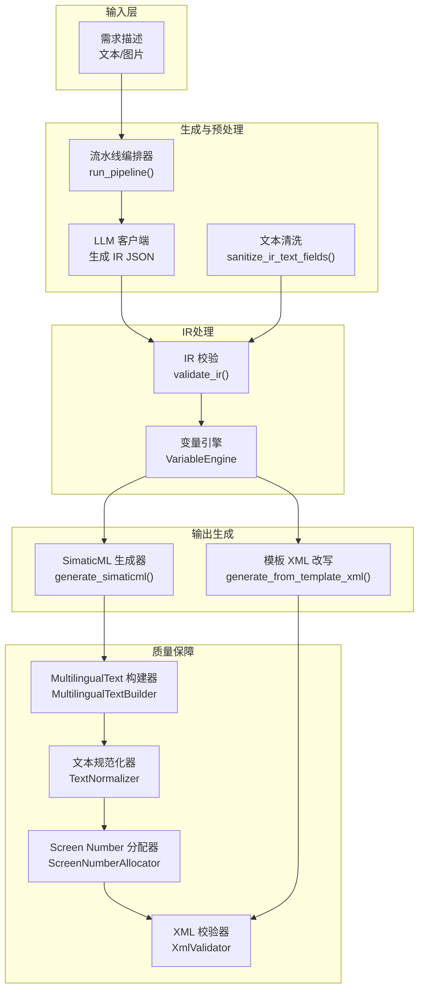
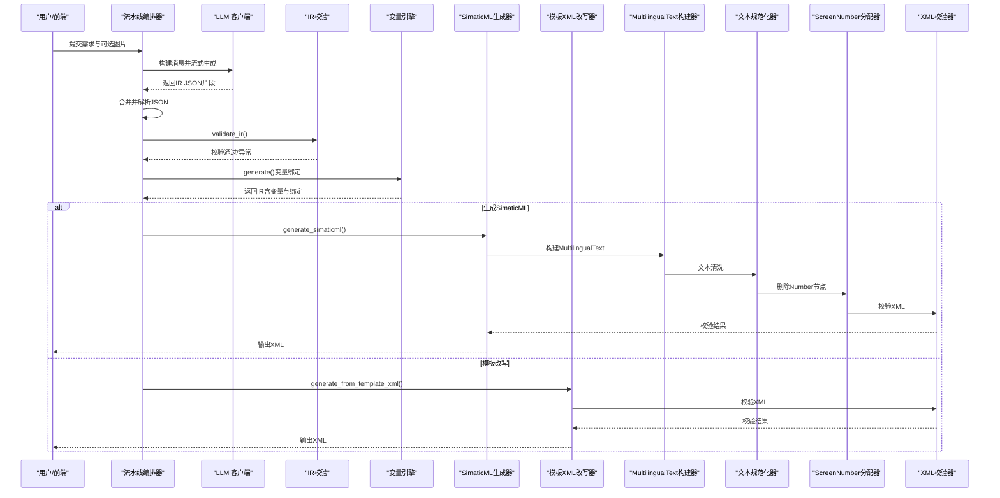
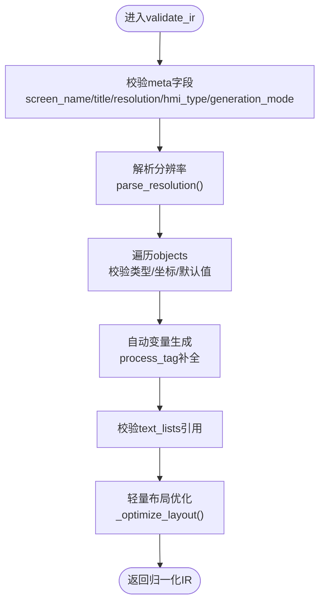
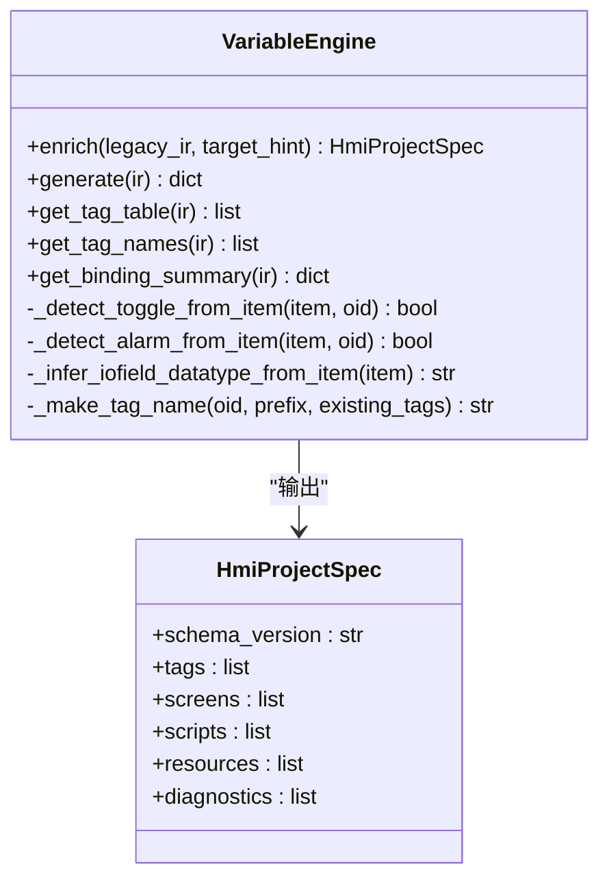
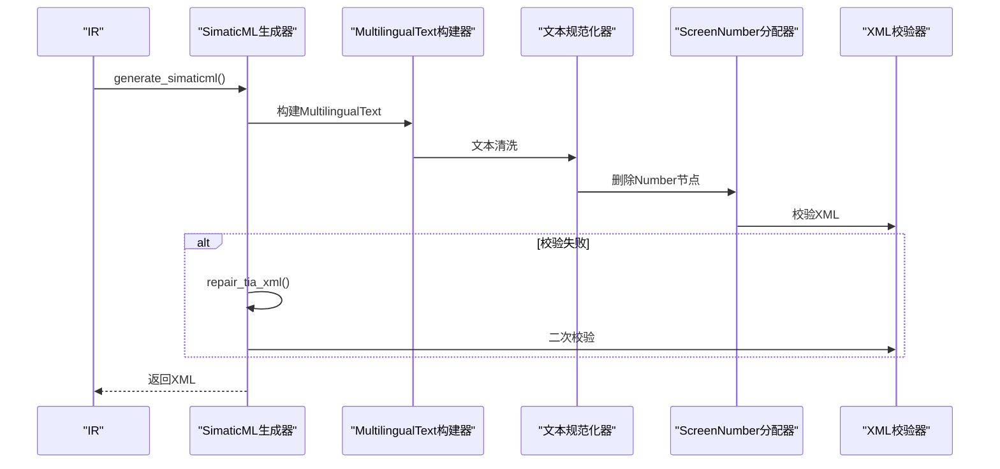
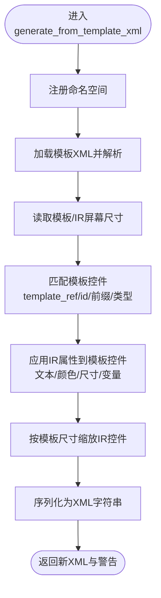
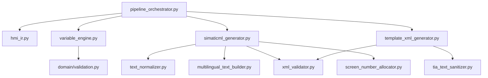

# HMI生成问题

<cite>
**本文档引用的文件**
- [hmi_ir.py](file://backend/hmi_ir.py)
- [variable_engine.py](file://backend/variable_engine.py)
- [simaticml_generator.py](file://backend/simaticml_generator.py)
- [template_xml_generator.py](file://backend/template_xml_generator.py)
- [xml_validator.py](file://backend/xml_validator.py)
- [pipeline_orchestrator.py](file://backend/pipeline_orchestrator.py)
- [validation.py](file://backend/domain/validation.py)
- [diagnostics.py](file://backend/domain/diagnostics.py)
- [multilingual_text_builder.py](file://backend/multilingual_text_builder.py)
- [text_normalizer.py](file://backend/text_normalizer.py)
- [tia_text_sanitizer.py](file://backend/tia_text_sanitizer.py)
- [screen_number_allocator.py](file://backend/screen_number_allocator.py)
- [test_hmi_ir.py](file://tests/test_hmi_ir.py)
- [test_variable_engine_v2.py](file://tests/test_variable_engine_v2.py)
</cite>

## 目录
1. [简介](#简介)
2. [项目结构](#项目结构)
3. [核心组件](#核心组件)
4. [架构总览](#架构总览)
5. [详细组件分析](#详细组件分析)
6. [依赖分析](#依赖分析)
7. [性能考虑](#性能考虑)
8. [故障排除指南](#故障排除指南)
9. [结论](#结论)

## 简介
本指南面向HMI生成流程中的故障排除，覆盖IR校验失败、变量绑定错误、XML生成异常、模板改写问题等常见场景。文档从需求描述到最终XML输出的完整流程出发，提供阶段化的诊断路径、错误信息解读与解决方案，帮助开发者快速定位并修复问题。

## 项目结构
该项目采用分层流水线架构，将文本生成、IR校验、变量绑定、XML生成与模板改写等环节清晰分离，确保每个阶段的职责明确、错误可定位、修复可追溯。

**图表来源**
- [pipeline_orchestrator.py:131-354](file://backend/pipeline_orchestrator.py#L131-L354)
- [hmi_ir.py:261-468](file://backend/hmi_ir.py#L261-L468)
- [variable_engine.py:106-193](file://backend/variable_engine.py#L106-L193)
- [simaticml_generator.py:414-562](file://backend/simaticml_generator.py#L414-L562)
- [template_xml_generator.py:102-218](file://backend/template_xml_generator.py#L102-L218)
- [multilingual_text_builder.py:18-159](file://backend/multilingual_text_builder.py#L18-L159)
- [text_normalizer.py:71-274](file://backend/text_normalizer.py#L71-L274)
- [screen_number_allocator.py:27-125](file://backend/screen_number_allocator.py#L27-L125)
- [xml_validator.py:67-78](file://backend/xml_validator.py#L67-L78)

**章节来源**
- [pipeline_orchestrator.py:131-354](file://backend/pipeline_orchestrator.py#L131-L354)

## 核心组件
- IR校验与归一化：负责校验IR结构合法性、补全默认值、自动布局优化与变量补全。
- 变量引擎：将IR对象映射为工程级变量系统，生成Tag表与绑定关系。
- SimaticML生成器：将IR转换为符合TIA规范的SimaticML XML。
- 模板XML改写器：基于模板XML安全改写，保留结构与命名空间。
- 文本清洗与MultilingualText构建：确保文本兼容TIA Portal要求。
- XML校验器：导入前结构化检查，自动修复与二次校验。

**章节来源**
- [hmi_ir.py:261-468](file://backend/hmi_ir.py#L261-L468)
- [variable_engine.py:106-193](file://backend/variable_engine.py#L106-L193)
- [simaticml_generator.py:414-562](file://backend/simaticml_generator.py#L414-L562)
- [template_xml_generator.py:102-218](file://backend/template_xml_generator.py#L102-L218)
- [xml_validator.py:67-78](file://backend/xml_validator.py#L67-L78)

## 架构总览
生成流程的关键阶段与数据流如下：

**图表来源**
- [pipeline_orchestrator.py:131-354](file://backend/pipeline_orchestrator.py#L131-L354)
- [hmi_ir.py:261-468](file://backend/hmi_ir.py#L261-L468)
- [variable_engine.py:198-293](file://backend/variable_engine.py#L198-L293)
- [simaticml_generator.py:414-562](file://backend/simaticml_generator.py#L414-L562)
- [template_xml_generator.py:102-218](file://backend/template_xml_generator.py#L102-L218)
- [multilingual_text_builder.py:114-159](file://backend/multilingual_text_builder.py#L114-L159)
- [text_normalizer.py:164-204](file://backend/text_normalizer.py#L164-L204)
- [screen_number_allocator.py:111-125](file://backend/screen_number_allocator.py#L111-L125)
- [xml_validator.py:70-78](file://backend/xml_validator.py#L70-L78)

## 详细组件分析

### IR校验与归一化（hmi_ir.py）
- 职责：校验IR结构、补全默认值、自动布局优化、变量补全与警告收集。
- 关键点：
  - 对象类型校验与坐标范围检查。
  - 自动变量生成与process_tag补全。
  - 分辨率解析与屏幕尺寸标准化。
  - 轻量布局优化（对齐、间距、重叠与越界修正）。
- 常见错误：
  - 缺少必填字段（如objects为空）。
  - 非法对象类型或非法分辨率。
  - 坐标超出画面范围。
  - 缺少text_list引用或变量未声明。

**图表来源**
- [hmi_ir.py:261-468](file://backend/hmi_ir.py#L261-L468)

**章节来源**
- [hmi_ir.py:40-526](file://backend/hmi_ir.py#L40-L526)

### 变量引擎（variable_engine.py）
- 职责：将IR对象映射为语义化HmiProjectSpec，推断TagSpec、EventSpec、ActionSpec与BindingSpec。
- 关键点：
  - 按对象类型推断变量命名与数据类型。
  - 自动检测按钮模式（momentary/toggle）、指示灯类型（状态/报警）。
  - 生成颜色与闪烁绑定、IOField数据类型推断。
  - 保持向后兼容的generate()接口。
- 常见错误：
  - 未声明的变量引用（tag_binding缺失）。
  - 事件动作引用的脚本/画面不存在。
  - 变量名重复或命名冲突。

**图表来源**
- [variable_engine.py:106-193](file://backend/variable_engine.py#L106-L193)
- [variable_engine.py:24-44](file://backend/variable_engine.py#L24-L44)

**章节来源**
- [variable_engine.py:106-800](file://backend/variable_engine.py#L106-L800)

### SimaticML生成器（simaticml_generator.py）
- 职责：将IR转换为SimaticML XML，处理MultilingualText、颜色、事件与脚本。
- 关键点：
  - 命名空间与TIA版本适配。
  - MultilingualText DOM重建与标准结构保证。
  - XML导入前强制校验与自动修复。
  - Basic面板事件脚本限制。
- 常见错误：
  - MultilingualText结构不合规（ID子元素、Language缺失、富文本结构错误）。
  - 非法HTML标签或控制字符。
  - 缺少根Document/Screen元素。
  - Number节点冲突或存在。

**图表来源**
- [simaticml_generator.py:414-562](file://backend/simaticml_generator.py#L414-L562)
- [multilingual_text_builder.py:114-159](file://backend/multilingual_text_builder.py#L114-L159)
- [text_normalizer.py:164-204](file://backend/text_normalizer.py#L164-L204)
- [screen_number_allocator.py:111-125](file://backend/screen_number_allocator.py#L111-L125)
- [xml_validator.py:70-78](file://backend/xml_validator.py#L70-L78)

**章节来源**
- [simaticml_generator.py:1-702](file://backend/simaticml_generator.py#L1-L702)

### 模板XML改写器（template_xml_generator.py）
- 职责：基于模板XML安全改写，保留结构与命名空间，仅替换安全字段。
- 关键点：
  - 模板控件匹配策略（template_ref/id/前缀/类型）。
  - 文本、颜色、尺寸、变量连接的安全应用。
  - 模板尺寸与IR尺寸的协调与缩放。
- 常见错误：
  - 模板控件未找到或名称冲突。
  - 文本写入错误（优先命中HelpText而非显示文本）。
  - 模板与目标设备分辨率不匹配导致位置偏差。

**图表来源**
- [template_xml_generator.py:102-218](file://backend/template_xml_generator.py#L102-L218)

**章节来源**
- [template_xml_generator.py:1-800](file://backend/template_xml_generator.py#L1-L800)

### 文本清洗与MultilingualText构建（text_normalizer.py, multilingual_text_builder.py）
- 职责：清洗文本、保证MultilingualText结构合规，避免非法HTML与控制字符。
- 关键点：
  - 仅清洗文本内容，不修改XML结构。
  - 保留TIA富文本合法结构（<body>
...
</body>）。
  - DOM级重建MultilingualText，确保Language属性与标准结构。

**章节来源**
- [text_normalizer.py:71-274](file://backend/text_normalizer.py#L71-L274)
- [multilingual_text_builder.py:18-382](file://backend/multilingual_text_builder.py#L18-L382)

### XML校验器（xml_validator.py）
- 职责：导入前结构化检查，识别HTML标签、MultilingualText结构、控制字符、Number节点与根元素。
- 关键点：
  - 多种MultilingualText结构兼容校验。
  - 非法控制字符与HTML标签检测。
  - Number节点冲突检测与建议。

**章节来源**
- [xml_validator.py:67-330](file://backend/xml_validator.py#L67-L330)

## 依赖分析
- 组件耦合：
  - pipeline_orchestrator.py串联各模块，是流程控制中心。
  - variable_engine依赖domain模型（HmiProjectSpec、enums等）进行语义推断。
  - simaticml_generator依赖text_normalizer、multilingual_text_builder、xml_validator进行质量保障。
  - template_xml_generator依赖tia_text_sanitizer（兼容层）与xml_validator。
- 外部依赖：
  - TIA Portal命名空间与版本差异（通过reference_xml适配）。
  - 命名空间检测与注册（ElementTree）。

**图表来源**
- [pipeline_orchestrator.py:131-354](file://backend/pipeline_orchestrator.py#L131-L354)
- [hmi_ir.py:261-468](file://backend/hmi_ir.py#L261-L468)
- [variable_engine.py:106-193](file://backend/variable_engine.py#L106-L193)
- [simaticml_generator.py:414-562](file://backend/simaticml_generator.py#L414-L562)
- [template_xml_generator.py:102-218](file://backend/template_xml_generator.py#L102-L218)
- [xml_validator.py:67-78](file://backend/xml_validator.py#L67-L78)

**章节来源**
- [pipeline_orchestrator.py:131-354](file://backend/pipeline_orchestrator.py#L131-L354)

## 性能考虑
- IR校验与布局优化：对大量对象时，排序与聚类算法的时间复杂度较高，建议在IR规模较大时提前清理冗余对象。
- XML生成与DOM重建：MultilingualText DOM重建与XML校验为O(n)级，但ElementTree解析与序列化成本随XML体量增长。
- 模板改写：匹配与克隆策略需避免重复遍历，建议缓存item_map与type_map。
- 文本清洗：正则匹配与多次替换可能成为瓶颈，建议批量处理与缓存清洗结果。

## 故障排除指南

### 1. IR校验失败（validate_ir）
- 症状
  - 抛出IRValidationError，提示缺少必填字段、非法对象类型、分辨率非法或objects为空。
- 诊断步骤
  - 检查meta字段：screen_name、title、resolution、hmi_type、generation_mode。
  - 检查objects：类型是否在允许集合内，坐标是否越界。
  - 检查tags与text_lists引用是否完整。
- 解决方案
  - 补充缺失字段或修正类型。
  - 调整分辨率格式为"WIDTHxHEIGHT"或使用支持的预设分辨率。
  - 为SymbolicIOField提供text_list引用，或为IOField提供合法display_format与decimal_digits。

**章节来源**
- [hmi_ir.py:261-468](file://backend/hmi_ir.py#L261-L468)
- [test_hmi_ir.py:82-115](file://tests/test_hmi_ir.py#L82-L115)

### 2. 变量绑定错误（VariableEngine）
- 症状
  - 控件tag_binding引用未声明变量；事件动作引用的脚本/画面不存在；变量名重复。
- 诊断步骤
  - 使用get_binding_summary()查看绑定统计。
  - 检查IR中tags与scripts的名称唯一性。
  - 验证HmiProjectSpec的交叉引用（validate_ir_v2）。
- 解决方案
  - 为未声明变量创建TagSpec或修正引用名称。
  - 为事件动作提供存在的脚本/画面名称。
  - 重命名重复变量，确保全局唯一。

**章节来源**
- [variable_engine.py:106-193](file://backend/variable_engine.py#L106-L193)
- [validation.py:21-189](file://backend/domain/validation.py#L21-L189)
- [diagnostics.py:79-127](file://backend/domain/diagnostics.py#L79-L127)
- [test_variable_engine_v2.py:65-247](file://tests/test_variable_engine_v2.py#L65-L247)

### 3. XML生成异常（SimaticML）
- 症状
  - MultilingualText结构错误（ID子元素、Language缺失、富文本结构不正确）。
  - XML包含非法HTML标签或控制字符。
  - 缺少根Document/Screen元素或存在Number节点冲突。
- 诊断步骤
  - 使用validate_tia_xml()获取详细错误列表。
  - 检查文本是否通过TextNormalizer.normalize()清洗。
  - 确认MultilingualTextBuilder.rebuild_element()已执行。
- 解决方案
  - 修复MultilingualText结构，确保Language属性与标准结构。
  - 使用repair_tia_xml()自动修复并二次校验。
  - 删除Number节点或使用ScreenNumberAllocator分配唯一编号。

**章节来源**
- [simaticml_generator.py:569-702](file://backend/simaticml_generator.py#L569-L702)
- [xml_validator.py:67-330](file://backend/xml_validator.py#L67-L330)
- [text_normalizer.py:164-204](file://backend/text_normalizer.py#L164-L204)
- [multilingual_text_builder.py:114-159](file://backend/multilingual_text_builder.py#L114-L159)
- [screen_number_allocator.py:111-125](file://backend/screen_number_allocator.py#L111-L125)

### 4. 模板改写问题（Template XML Generator）
- 症状
  - 模板控件未找到或名称冲突；文本写入错误；模板与目标设备分辨率不匹配。
- 诊断步骤
  - 检查template_ref/id/前缀/类型匹配策略。
  - 确认模板XML的命名空间与结构。
  - 校验IR与模板尺寸一致性并进行坐标缩放。
- 解决方案
  - 为目标控件提供template_ref或确保名称前缀匹配。
  - 使用sanitize_tia_text()清洗文本，避免误写HelpText。
  - 保留模板屏幕尺寸或按模板尺寸缩放IR控件。

**章节来源**
- [template_xml_generator.py:102-218](file://backend/template_xml_generator.py#L102-L218)
- [tia_text_sanitizer.py:44-57](file://backend/tia_text_sanitizer.py#L44-L57)

### 5. 文本与MultilingualText问题
- 症状
  - 文本包含HTML标签或非法控制字符；MultilingualText结构不符合TIA要求。
- 诊断步骤
  - 使用TextNormalizer.normalize_ir()批量清洗IR文本字段。
  - 使用MultilingualTextBuilder.validate_element()验证结构。
- 解决方案
  - 在写入XML前统一调用normalize()与normalize_ir()。
  - 使用MultilingualTextBuilder.rebuild_element()重建节点。

**章节来源**
- [text_normalizer.py:71-274](file://backend/text_normalizer.py#L71-L274)
- [multilingual_text_builder.py:164-210](file://backend/multilingual_text_builder.py#L164-L210)

### 6. 导入前校验与修复
- 症状
  - XML解析失败、缺少根元素、Number节点冲突。
- 诊断步骤
  - 使用XmlValidator.validate()获取错误与警告统计。
  - 使用lint_and_repair_xml()进行自动修复。
- 解决方案
  - 修复结构问题后再次校验，必要时手动调整。

**章节来源**
- [xml_validator.py:67-330](file://backend/xml_validator.py#L67-L330)
- [tia_text_sanitizer.py:121-144](file://backend/tia_text_sanitizer.py#L121-L144)

## 结论
本指南提供了从IR生成到最终XML输出的全流程故障排除路径。通过分层架构与严格的校验与修复机制，大多数问题可在早期阶段被识别与修复。建议在开发与集成过程中：
- 在IR生成后立即执行validate_ir()与sanitize_ir_text_fields()。
- 使用VariableEngine进行变量绑定并检查交叉引用。
- 生成XML前执行MultilingualText构建与XML校验，必要时使用repair_tia_xml()。
- 模板改写时遵循匹配策略与尺寸协调原则。