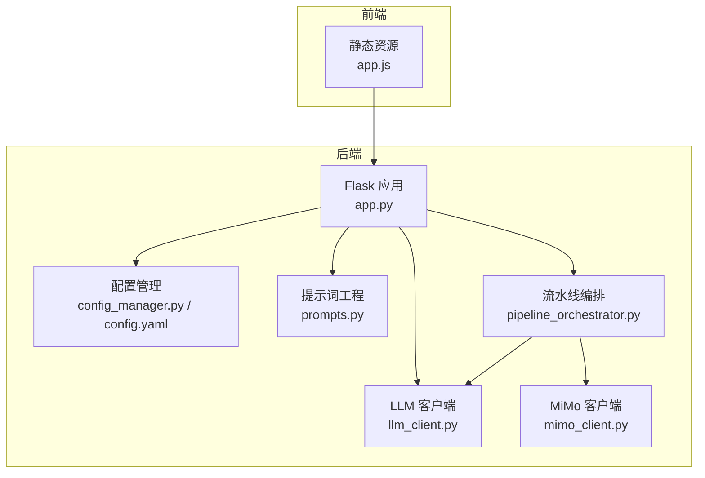
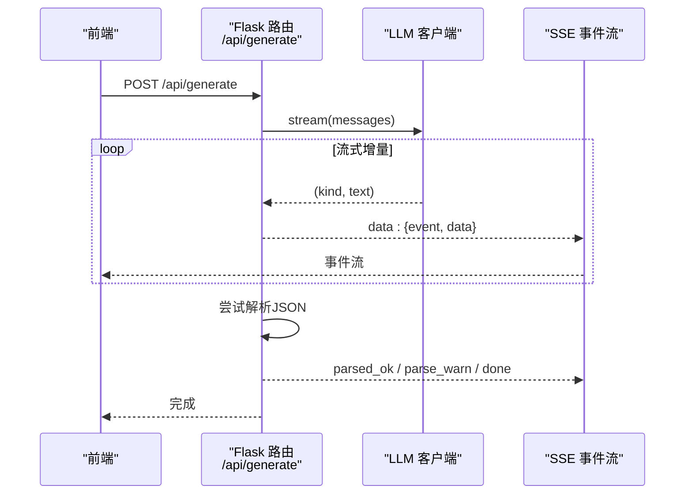
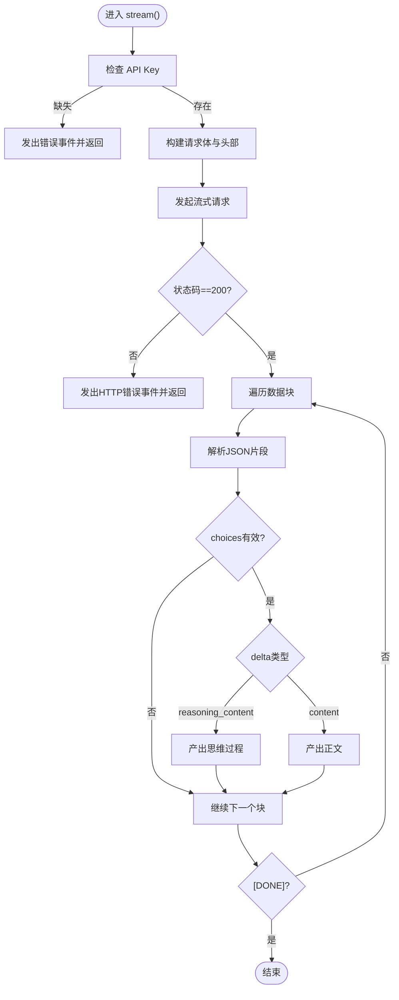
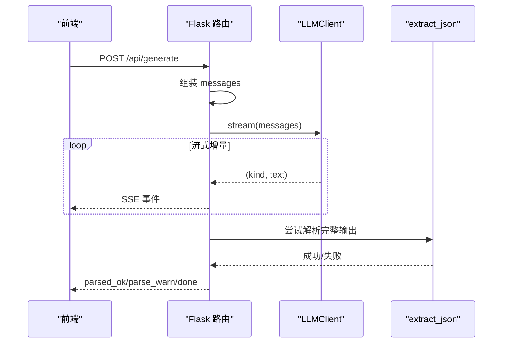
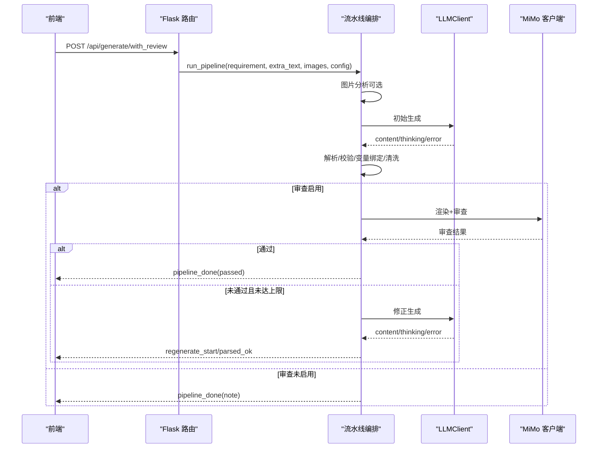
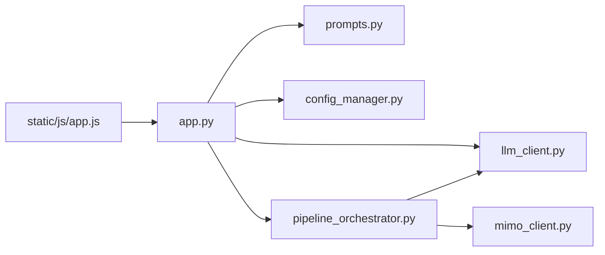

# LLM集成问题

<cite>
**本文档引用的文件**
- [llm_client.py](file://backend/llm_client.py)
- [app.py](file://app.py)
- [config.yaml](file://config.yaml)
- [config_manager.py](file://backend/config_manager.py)
- [prompts.py](file://backend/prompts.py)
- [pipeline_orchestrator.py](file://backend/pipeline_orchestrator.py)
- [mimo_client.py](file://backend/mimo_client.py)
- [app.js](file://static/js/app.js)
</cite>

## 目录
1. [简介](#简介)
2. [项目结构](#项目结构)
3. [核心组件](#核心组件)
4. [架构总览](#架构总览)
5. [详细组件分析](#详细组件分析)
6. [依赖分析](#依赖分析)
7. [性能考虑](#性能考虑)
8. [故障排除指南](#故障排除指南)
9. [结论](#结论)
10. [附录](#附录)

## 简介
本指南聚焦于本项目中“大语言模型（LLM）集成”的常见问题与排障流程，涵盖连接失败、API密钥错误、模型响应异常、流式生成中断、JSON解析错误、不同LLM提供商配置差异、网络与超时处理、错误重试机制、思维过程显示与流式输出调试、以及配置验证与日志分析等主题。文档以代码为依据，提供可操作的诊断步骤与优化建议，帮助快速定位并解决问题。

## 项目结构
本项目围绕Flask后端与前端JS交互，LLM集成主要位于后端的LLM客户端与生成路由中，配置管理与提示词工程贯穿其中，视觉审查（MiMo）作为可选增强链路参与多阶段流水线。

图表来源
- [app.py:166-266](file://app.py#L166-L266)
- [llm_client.py:35-229](file://backend/llm_client.py#L35-L229)
- [pipeline_orchestrator.py:131-354](file://backend/pipeline_orchestrator.py#L131-L354)
- [config_manager.py:108-142](file://backend/config_manager.py#L108-L142)
- [config.yaml:1-343](file://config.yaml#L1-L343)
- [prompts.py:322-343](file://backend/prompts.py#L322-L343)
- [mimo_client.py:280-323](file://backend/mimo_client.py#L280-L323)

章节来源
- [app.py:166-266](file://app.py#L166-L266)
- [config.yaml:1-343](file://config.yaml#L1-L343)

## 核心组件
- LLM客户端：封装OpenAI兼容的/chat/completions接口，支持流式与非流式生成，内置思考深度映射、原生推理与诱导式思考解析、JSON抽取工具。
- 生成路由：提供SSE流式生成接口，将LLM输出拆分为“思维过程”和“正文”，并在流结束后尝试解析JSON。
- 配置管理：提供结构化配置读写与默认配置合并，前端可直接编辑并保存。
- 提示词工程：定义系统提示、约束与Schema，确保输出IR的稳定性与一致性。
- 多阶段流水线：可选接入MiMo视觉审查，进行生成-审查-修正-再审查的闭环，支持最大迭代次数与通过阈值。
- 前端交互：负责设置面板、配置保存、SSE读取与UI反馈。

章节来源
- [llm_client.py:35-229](file://backend/llm_client.py#L35-L229)
- [app.py:166-266](file://app.py#L166-L266)
- [config_manager.py:108-142](file://backend/config_manager.py#L108-L142)
- [prompts.py:322-343](file://backend/prompts.py#L322-L343)
- [pipeline_orchestrator.py:131-354](file://backend/pipeline_orchestrator.py#L131-L354)

## 架构总览
LLM集成的端到端流程包括：前端提交需求与可选文件→后端组装messages→LLM流式生成→SSE事件推送→前端实时渲染→流结束尝试解析JSON→进入可选的MiMo审查与修正循环。

图表来源
- [app.py:166-219](file://app.py#L166-L219)
- [llm_client.py:78-170](file://backend/llm_client.py#L78-L170)

章节来源
- [app.py:166-219](file://app.py#L166-L219)
- [llm_client.py:78-170](file://backend/llm_client.py#L78-L170)

## 详细组件分析

### LLM客户端（流式与非流式）
- 流式生成：基于HTTP长连接与SSE风格的数据块，逐块解析delta，区分“思维过程”和“正文”。支持原生推理模型（如DeepSeek Reasoner）与非原生推理的“诱导式思考”解析。
- 非流式生成：适用于图片分析等一次性请求，关闭推理effort字段，移除诱导system消息，限制max_tokens。
- JSON抽取：从完整输出中抽取首个JSON对象，支持去除围栏标记，容错处理大括号不匹配。
- 错误处理：捕获超时、网络异常、HTTP状态码异常，统一以错误事件返回。

图表来源
- [llm_client.py:78-170](file://backend/llm_client.py#L78-L170)

章节来源
- [llm_client.py:35-229](file://backend/llm_client.py#L35-L229)

### 生成路由（SSE）
- 接收需求与可选文件，组装messages，启动LLM流式生成。
- 将“思维过程”和“正文”分别以SSE事件推送，流结束后尝试解析JSON并提示前端。
- 错误事件统一上报，前端可据此提示用户。

图表来源
- [app.py:166-219](file://app.py#L166-L219)
- [llm_client.py:78-170](file://backend/llm_client.py#L78-L170)

章节来源
- [app.py:166-219](file://app.py#L166-L219)

### 多阶段流水线（含MiMo审查）
- 可选图片分析：对上传图片进行MiMo分析，提取参数、控件、指示器与设计建议。
- 初始生成：调用LLM生成IR，解析并校验IR，清洗文本字段，变量引擎绑定与生成VBS。
- 审查-修正循环：渲染IR为图片，MiMo审查，根据分数与关键问题进行修正，最多迭代N次。
- 事件驱动：全程以SSE事件推进，便于前端可视化进度。

图表来源
- [pipeline_orchestrator.py:131-354](file://backend/pipeline_orchestrator.py#L131-L354)
- [mimo_client.py:280-323](file://backend/mimo_client.py#L280-L323)

章节来源
- [pipeline_orchestrator.py:131-354](file://backend/pipeline_orchestrator.py#L131-L354)

### 配置管理与提示词工程
- 配置管理：提供默认配置、锁保护的读写、与默认配置深合并，保证新增字段不缺失。
- 提示词工程：定义系统提示、Schema、布局与命名规范、VBS脚本规范、输出前自检，确保IR质量与一致性。

章节来源
- [config_manager.py:108-142](file://backend/config_manager.py#L108-L142)
- [config.yaml:1-343](file://config.yaml#L1-L343)
- [prompts.py:322-343](file://backend/prompts.py#L322-L343)

## 依赖分析
- LLM客户端依赖requests库进行HTTP请求，依赖JSON解析与SSE数据块处理。
- 生成路由依赖LLM客户端与提示词工程，依赖SSE事件流返回。
- 流水线编排依赖LLM客户端、提示词工程、MiMo客户端、IR校验与变量引擎。
- 前端依赖SSE读取与事件处理，负责设置面板与配置保存。

图表来源
- [app.py:26-40](file://app.py#L26-L40)
- [llm_client.py:15-16](file://backend/llm_client.py#L15-L16)
- [pipeline_orchestrator.py:23-30](file://backend/pipeline_orchestrator.py#L23-L30)
- [mimo_client.py:280-323](file://backend/mimo_client.py#L280-L323)
- [app.js:343-373](file://static/js/app.js#L343-L373)

章节来源
- [app.py:26-40](file://app.py#L26-L40)
- [llm_client.py:15-16](file://backend/llm_client.py#L15-L16)
- [pipeline_orchestrator.py:23-30](file://backend/pipeline_orchestrator.py#L23-L30)
- [mimo_client.py:280-323](file://backend/mimo_client.py#L280-L323)
- [app.js:343-373](file://static/js/app.js#L343-L373)

## 性能考虑
- 流式生成：使用流式HTTP响应与增量解析，降低内存峰值与首包延迟。
- 超时与重试：LLM客户端对超时与网络异常进行捕获；MiMo客户端对特定HTTP状态码标记可重试。
- JSON解析：在流结束后一次性抽取JSON，避免频繁解析；提示词工程中严格约束输出格式，减少解析失败概率。
- 迭代控制：流水线最大迭代次数与通过阈值可配置，避免无限循环与资源浪费。
- 前端缓冲：SSE读取采用缓冲与增量拼接，避免丢失片段。

章节来源
- [llm_client.py:98-170](file://backend/llm_client.py#L98-L170)
- [mimo_client.py:280-323](file://backend/mimo_client.py#L280-L323)
- [pipeline_orchestrator.py:149-152](file://backend/pipeline_orchestrator.py#L149-L152)

## 故障排除指南

### 一、连接失败与API密钥错误
- 症状
  - SSE返回“未配置 API Key”或HTTP错误事件。
  - 前端设置面板显示“未配置”。
- 诊断步骤
  - 检查配置文件中对应提供商的API Key是否填写。
  - 在前端设置面板中核对当前活动提供商与Base URL、模型名。
  - 使用“连接测试”功能验证后端到LLM网关连通性。
- 解决方案
  - 在设置面板中填入正确的API Key与Base URL。
  - 保存配置后重启后端或刷新前端页面。
  - 如使用代理/网关，确认URL与鉴权头符合提供商要求。

章节来源
- [llm_client.py:82-85](file://backend/llm_client.py#L82-L85)
- [app.js:121-133](file://static/js/app.js#L121-L133)
- [config.yaml:7-18](file://config.yaml#L7-L18)
- [config_manager.py:121-127](file://backend/config_manager.py#L121-L127)

### 二、模型响应异常与HTTP状态码错误
- 症状
  - SSE返回“模型接口返回XXX”等HTTP错误事件。
  - 响应体包含错误摘要。
- 诊断步骤
  - 查看SSE事件中的错误详情，确认状态码与摘要。
  - 检查提供商限额、配额、速率限制与账户状态。
  - 确认请求体字段（模型名、温度、max_tokens）是否被提供商接受。
- 解决方案
  - 调整请求参数（如降低max_tokens、调整温度）。
  - 更换可用的提供商或网关。
  - 等待配额恢复或升级账户。

章节来源
- [llm_client.py:101-104](file://backend/llm_client.py#L101-L104)

### 三、流式生成中断与SSE读取异常
- 症状
  - 前端长时间无响应或报“流读取异常”。
  - SSE事件中止，未收到“done”事件。
- 诊断步骤
  - 检查后端日志与SSE事件流是否持续。
  - 确认网络稳定性与代理设置。
  - 前端SSE读取逻辑是否正确处理“data:”行与缓冲。
- 解决方案
  - 增大后端超时时间（当前为300秒）。
  - 优化网络路径，避免中间层阻断SSE。
  - 前端增加超时与重试提示，必要时引导用户刷新页面。

章节来源
- [llm_client.py:98-100](file://backend/llm_client.py#L98-L100)
- [app.js:343-373](file://static/js/app.js#L343-L373)

### 四、JSON解析错误与IR校验失败
- 症状
  - SSE返回“parse_warn”或“pipeline_done”携带解析错误。
  - IR校验失败，提示变量缺失、交叉引用错误或布局问题。
- 诊断步骤
  - 查看后端日志中的解析异常信息与堆栈。
  - 检查提示词工程是否严格约束输出格式。
  - 校验IR中tags、text_lists、scripts的交叉引用完整性。
- 解决方案
  - 优化提示词，强调输出格式与Schema。
  - 在流水线中启用MiMo审查，利用其反馈修正布局与元素。
  - 逐步缩小需求范围，定位导致输出不规范的触发条件。

章节来源
- [app.py:206-213](file://app.py#L206-L213)
- [pipeline_orchestrator.py:203-217](file://backend/pipeline_orchestrator.py#L203-L217)
- [prompts.py:14-119](file://backend/prompts.py#L14-L119)

### 五、不同LLM提供商的配置差异
- DeepSeek
  - 支持原生推理模型（reasoner_model），可设置推理effort。
  - 建议使用reasoner模型以获得更好的思维过程输出。
- OpenAI兼容
  - 支持视觉模型（supports_vision），适合需要图片分析的场景。
  - 注意与DeepSeek不同的base_url与模型名。
- 配置要点
  - 在设置面板中切换活动提供商，填写对应base_url与模型名。
  - 保持API Key与模型名一致，避免因拼写错误导致401/404。

章节来源
- [config.yaml:6-18](file://config.yaml#L6-L18)
- [llm_client.py:44-75](file://backend/llm_client.py#L44-L75)

### 六、网络连接问题与超时处理
- 症状
  - “模型请求超时（>300s）”。
  - 网络异常：连接超时、DNS解析失败、代理阻断。
- 诊断步骤
  - 检查本地网络与防火墙策略。
  - 使用curl或浏览器开发者工具测试直连提供商。
  - 查看后端日志中的Timeout与RequestException。
- 解决方案
  - 调整超时参数（当前固定300秒）。
  - 配置企业代理或更换网络环境。
  - 为关键API增加指数退避重试（当前未实现，可在上游封装中扩展）。

章节来源
- [llm_client.py:166-169](file://backend/llm_client.py#L166-L169)

### 七、错误重试机制
- 当前实现
  - LLM客户端：捕获超时与网络异常，返回错误事件。
  - MiMo客户端：对408/429/500/502/503/504等状态码标记可重试。
- 建议
  - 在上游封装中增加指数退避与最大重试次数。
  - 对幂等请求（如生成IR）支持自动重试与去重。

章节来源
- [llm_client.py:166-169](file://backend/llm_client.py#L166-L169)
- [mimo_client.py:280-323](file://backend/mimo_client.py#L280-L323)

### 八、思维过程显示与流式输出调试
- 症状
  - 思维过程缺失或显示不完整。
  - 非原生推理模型时，正文与思维混合。
- 诊断步骤
  - 检查当前思考深度配置与提供商是否支持reasoner_model。
  - 确认前端SSE事件中是否收到“thinking”事件。
  - 对非原生推理模型，确认系统提示中诱导式思考的budget设置。
- 解决方案
  - 选择支持原生推理的模型（如DeepSeek Reasoner）。
  - 调整思考深度，平衡推理成本与输出质量。
  - 前端确保正确解析与渲染“thinking”事件。

章节来源
- [llm_client.py:123-165](file://backend/llm_client.py#L123-L165)
- [app.py:196-205](file://app.py#L196-L205)

### 九、配置验证与日志分析
- 配置验证
  - 使用“原始编辑”模式保存YAML，后端会进行可解析性校验。
  - 加载配置时与默认配置深合并，确保新增字段不缺失。
- 日志分析
  - 关注SSE事件中的错误详情与解析异常。
  - 在前端“连接测试”中查看最终结果与错误信息。
  - 对MiMo审查失败，查看审查结果摘要与关键问题列表。

章节来源
- [config_manager.py:130-142](file://backend/config_manager.py#L130-L142)
- [app.js:803-811](file://static/js/app.js#L803-L811)

## 结论
本项目的LLM集成以“流式生成+SSE事件”为核心，配合严格的提示词工程与可选的MiMo审查形成稳健的生成-审查-修正闭环。针对常见问题，建议从配置校验、网络连通性、超时与重试、JSON解析约束与前端事件处理五个维度入手，结合日志与事件流进行定位与修复。对于性能优化，可进一步引入指数退避重试、请求去重与前端缓冲策略，提升用户体验与系统鲁棒性。

## 附录
- 相关文件路径与职责
  - [llm_client.py](file://backend/llm_client.py)：LLM客户端与JSON抽取工具
  - [app.py](file://app.py)：生成路由与SSE事件流
  - [config.yaml](file://config.yaml)：默认配置与提供商参数
  - [config_manager.py](file://backend/config_manager.py)：配置读写与深合并
  - [prompts.py](file://backend/prompts.py)：提示词工程与Schema
  - [pipeline_orchestrator.py](file://backend/pipeline_orchestrator.py)：多阶段流水线
  - [mimo_client.py](file://backend/mimo_client.py)：MiMo审查客户端
  - [app.js](file://static/js/app.js)：前端SSE读取与设置面板