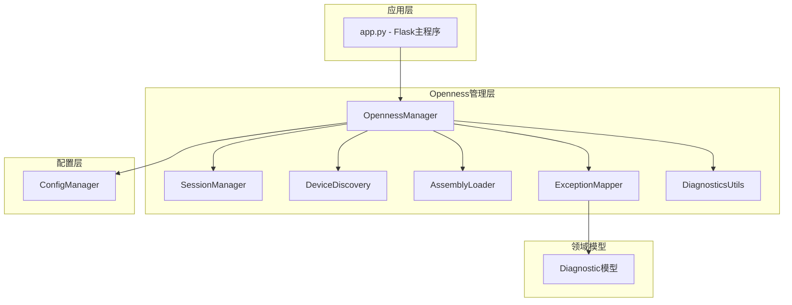
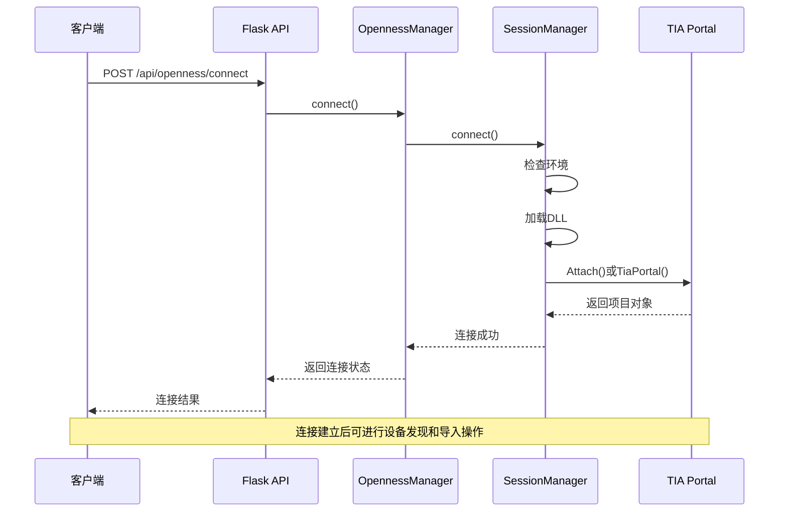
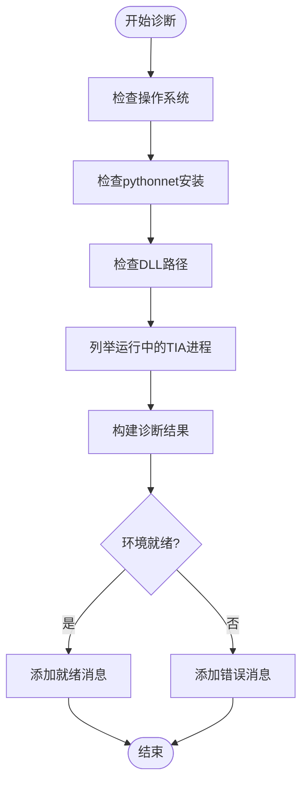
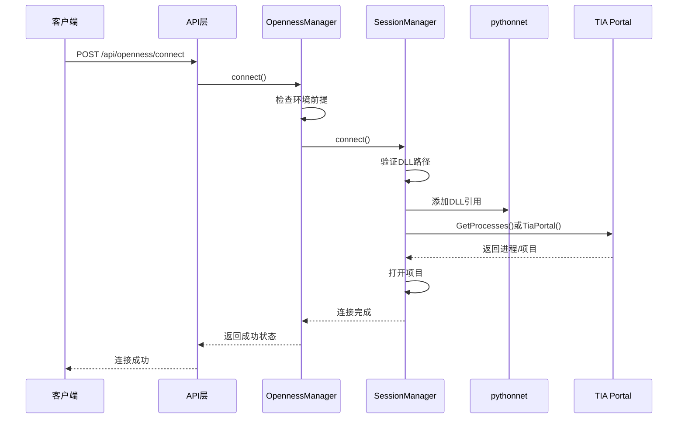
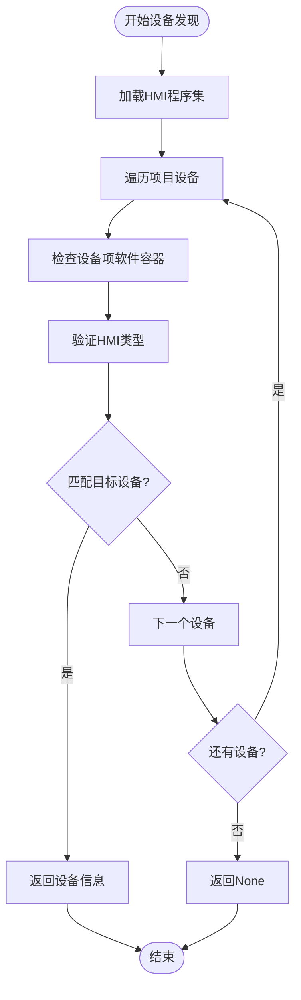
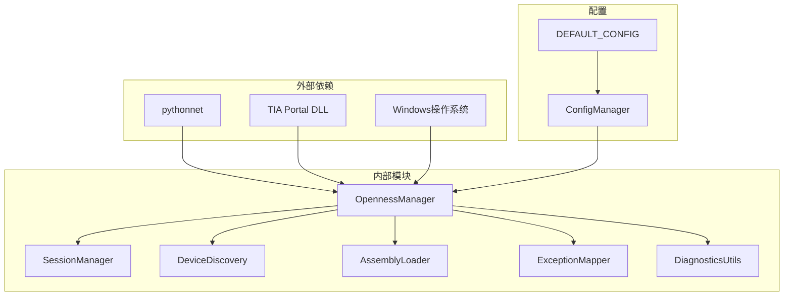
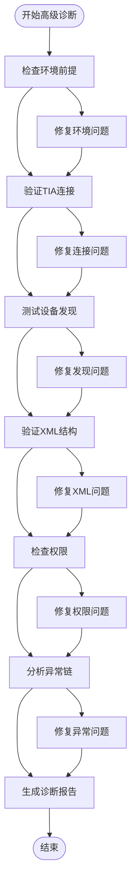

# Openness连接问题

<cite>
**本文档引用的文件**
- [app.py](file://app.py)
- [openness_manager.py](file://backend/openness_manager.py)
- [session_manager.py](file://backend/openness/session_manager.py)
- [device_discovery.py](file://backend/openness/device_discovery.py)
- [assembly_loader.py](file://backend/openness/assembly_loader.py)
- [exception_mapper.py](file://backend/openness/exception_mapper.py)
- [diagnostics_utils.py](file://backend/openness/diagnostics_utils.py)
- [diagnostics.py](file://backend/domain/diagnostics.py)
- [config_manager.py](file://backend/config_manager.py)
- [test_openness_manager.py](file://tests/test_openness_manager.py)
- [test_openness_modules.py](file://tests/test_openness_modules.py)
</cite>

## 目录
1. [简介](#简介)
2. [项目结构](#项目结构)
3. [核心组件](#核心组件)
4. [架构概览](#架构概览)
5. [详细组件分析](#详细组件分析)
6. [依赖分析](#依赖分析)
7. [性能考虑](#性能考虑)
8. [故障排除指南](#故障排除指南)
9. [结论](#结论)

## 简介

本文档提供了Siemens HMI Assistant项目中Openness连接问题的完整故障排除指南。Openness是Siemens TIA Portal的编程接口，允许外部应用程序与TIA Portal进行交互，实现HMI画面的自动化生成和导入。

本指南涵盖了以下常见Openness相关故障：
- TIA Portal连接失败
- 设备发现异常
- DLL加载错误
- 权限问题
- 导入和导出功能故障
- 错误代码含义和日志分析

## 项目结构

该项目采用模块化架构设计，Openness相关功能集中在`backend/openness`目录下：

**图表来源**
- [app.py:316-333](file://app.py#L316-L333)
- [openness_manager.py:31-101](file://backend/openness_manager.py#L31-L101)

**章节来源**
- [app.py:1-800](file://app.py#L1-L800)
- [config_manager.py:1-142](file://backend/config_manager.py#L1-L142)

## 核心组件

### OpennessManager - 主要管理器
OpennessManager是整个Openness系统的外观模式(Facade)，提供统一的接口来管理TIA Portal连接、设备发现、编译和异常处理。

### SessionManager - 会话管理
负责与TIA Portal的连接、项目打开和断开连接操作。

### DeviceDiscovery - 设备发现
用于查找HMI设备并识别其类型（Basic/Comfort/Unified）。

### AssemblyLoader - DLL加载器
管理Siemens.Engineering.dll的加载和版本元数据记录。

### ExceptionMapper - 异常映射
将.NET异常转换为结构化的诊断信息。

**章节来源**
- [openness_manager.py:31-101](file://backend/openness_manager.py#L31-L101)
- [session_manager.py:14-52](file://backend/openness/session_manager.py#L14-L52)
- [device_discovery.py:15-27](file://backend/openness/device_discovery.py#L15-L27)
- [assembly_loader.py:47-60](file://backend/openness/assembly_loader.py#L47-L60)
- [exception_mapper.py:20-27](file://backend/openness/exception_mapper.py#L20-L27)

## 架构概览

**图表来源**
- [app.py:336-338](file://app.py#L336-L338)
- [openness_manager.py:142-185](file://backend/openness_manager.py#L142-L185)
- [session_manager.py:92-141](file://backend/openness/session_manager.py#L92-L141)

## 详细组件分析

### 诊断接口分析

#### /api/openness/diagnose 接口
此接口提供完整的环境检查，包括操作系统、pythonnet安装状态、DLL路径验证等。

**图表来源**
- [openness_manager.py:103-139](file://backend/openness_manager.py#L103-L139)
- [session_manager.py:53-90](file://backend/openness/session_manager.py#L53-L90)

#### /api/openness/status 接口
此接口提供连接状态和诊断信息的组合结果。

**章节来源**
- [app.py:316-333](file://app.py#L316-L333)
- [openness_manager.py:103-139](file://backend/openness_manager.py#L103-L139)
- [session_manager.py:53-90](file://backend/openness/session_manager.py#L53-L90)

### 连接建立流程

**图表来源**
- [openness_manager.py:142-185](file://backend/openness_manager.py#L142-L185)
- [session_manager.py:92-141](file://backend/openness/session_manager.py#L92-L141)

**章节来源**
- [openness_manager.py:142-185](file://backend/openness_manager.py#L142-L185)
- [session_manager.py:92-141](file://backend/openness/session_manager.py#L92-L141)

### 设备发现机制

设备发现组件负责在TIA Portal项目中查找HMI设备并识别其类型：

**图表来源**
- [device_discovery.py:28-78](file://backend/openness/device_discovery.py#L28-L78)

**章节来源**
- [device_discovery.py:28-78](file://backend/openness/device_discovery.py#L28-L78)

## 依赖分析

**图表来源**
- [openness_manager.py:17-28](file://backend/openness_manager.py#L17-L28)
- [config_manager.py:35-67](file://backend/config_manager.py#L35-L67)

**章节来源**
- [openness_manager.py:17-28](file://backend/openness_manager.py#L17-L28)
- [config_manager.py:35-67](file://backend/config_manager.py#L35-L67)

## 性能考虑

1. **延迟初始化**: OpennessManager使用延迟初始化模式，只有在需要时才创建子组件实例
2. **资源管理**: SessionManager确保正确释放TIA Portal连接资源
3. **内存优化**: AssemblyLoader限制公共类型列表数量，避免内存膨胀
4. **错误处理**: 异常映射器提供结构化错误信息，避免不必要的堆栈跟踪传递

## 故障排除指南

### 基础连接故障排除

#### 步骤1: 环境诊断
1. 访问 `/api/openness/diagnose` 获取环境检查结果
2. 检查返回的`ready`字段是否为`true`
3. 查看`messages`数组中的具体错误信息

#### 步骤2: 连接尝试
1. 调用 `/api/openness/connect` 进行连接
2. 检查返回的`connected`字段
3. 如失败，查看`error`字段中的详细错误信息

#### 步骤3: 状态确认
1. 访问 `/api/openness/status` 确认连接状态
2. 检查`connected`和`ready`字段
3. 查看`diagnose`中的详细诊断信息

**章节来源**
- [app.py:316-333](file://app.py#L316-L333)
- [openness_manager.py:103-185](file://backend/openness_manager.py#L103-L185)

### 设备发现异常排查

#### 症状: 无法找到HMI设备
1. 检查TIA Portal中是否已打开项目
2. 验证`hmi_device`配置项是否正确
3. 确认设备名称与项目中的实际名称一致

#### 症状: 设备类型识别错误
1. 检查`hmi_defaults.hmi_type`配置
2. 验证设备的`TypeIdentifier`或`OrderNumber`
3. 确认TIA Portal版本与DLL版本兼容

**章节来源**
- [device_discovery.py:28-78](file://backend/openness/device_discovery.py#L28-L78)
- [config_manager.py:68-73](file://backend/config_manager.py#L68-L73)

### DLL加载错误处理

#### 常见错误及解决方案

| 错误类型 | 错误代码 | 解决方案 |
|---------|---------|---------|
| DLL路径不存在 | `DLL不存在` | 检查`dll_path`配置，确认文件存在 |
| pythonnet未安装 | `未检测到pythonnet` | 运行`pip install pythonnet` |
| 权限不足 | `访问被拒绝` | 以管理员身份运行应用程序 |
| 版本不兼容 | `程序集版本不匹配` | 更新到与TIA Portal版本匹配的DLL |

#### DLL加载流程诊断
1. 使用 `/api/openness/diagnose` 检查DLL路径
2. 验证pythonnet安装状态
3. 确认Windows操作系统支持

**章节来源**
- [assembly_loader.py:78-137](file://backend/openness/assembly_loader.py#L78-L137)
- [session_manager.py:101-103](file://backend/openness/session_manager.py#L101-L103)

### 权限问题排查

#### 必需权限
1. **操作系统权限**: 需要在Windows环境下运行
2. **用户组权限**: 当前用户必须属于"Siemens TIA Openness"用户组
3. **文件系统权限**: 对DLL文件具有读取权限

#### 权限检查步骤
1. 验证当前用户是否在正确的用户组中
2. 检查DLL文件的访问权限
3. 确认防火墙设置允许pythonnet通信

**章节来源**
- [openness_manager.py:8-12](file://backend/openness_manager.py#L8-L12)
- [session_manager.py:62-64](file://backend/openness/session_manager.py#L62-L64)

### 导入和导出功能故障

#### 导入XML到TIA Portal
1. 确保XML格式与当前TIA版本兼容
2. 检查screen number和name是否与现有画面冲突
3. 验证项目中已加载的项目状态

#### 导出参考画面
1. 确认已连接到有效的TIA Portal实例
2. 检查目标画面是否存在
3. 验证输出目录的写入权限

**章节来源**
- [openness_manager.py:656-704](file://backend/openness_manager.py#L656-L704)
- [openness_manager.py:798-800](file://backend/openness_manager.py#L798-L800)

### 错误代码含义和解决方案

#### 标准诊断错误码

| 错误码 | 含义 | 建议解决方案 |
|-------|------|-------------|
| `TIA_NOT_CONNECTED` | 未连接到TIA Portal | 先调用连接接口 |
| `CLASSIC_DUPLICATE_ID` | 对象已存在 | 使用重命名策略 |
| `DEP_MISSING_CONTROLLER_TAG` | 缺少控制器标签 | 在PLC中创建对应标签 |
| `UNIFIED_TYPE_NOT_FOUND` | Unified类型不支持 | 检查TIA版本兼容性 |
| `IMPORT_TIA_EXCEPTION` | 导入TIA异常 | 检查XML格式和命名空间 |
| `COMPILE_ERROR` | 编译错误 | 检查变量引用和脚本语法 |
| `SCRIPT_SYNTAX_FAILED` | 脚本语法失败 | 检查脚本语法和变量名 |

#### 异常映射机制
异常映射器会根据.NET异常消息中的关键词自动映射到相应的诊断代码，并提供针对性的解决方案建议。

**章节来源**
- [diagnostics.py:41-127](file://backend/domain/diagnostics.py#L41-L127)
- [exception_mapper.py:28-87](file://backend/openness/exception_mapper.py#L28-L87)

### 日志分析技巧

#### 诊断工具函数
1. **异常链收集**: `collect_exception_chain()`递归收集Python和.NET异常链
2. **对象描述**: `describe_dotnet_object()`提供.NET对象的类型和程序集信息
3. **XML结构检查**: `inspect_xml_document()`分析XML文件的结构和编码

#### 日志分析流程
1. 使用诊断工具函数收集完整的异常信息
2. 分析异常链中的根因
3. 检查相关对象的状态和类型
4. 验证XML文件的结构完整性

**章节来源**
- [diagnostics_utils.py:35-63](file://backend/openness/diagnostics_utils.py#L35-L63)
- [diagnostics_utils.py:66-92](file://backend/openness/diagnostics_utils.py#L66-L92)
- [diagnostics_utils.py:142-187](file://backend/openness/diagnostics_utils.py#L142-L187)

### 高级诊断流程

**图表来源**
- [openness_manager.py:103-139](file://backend/openness_manager.py#L103-L139)
- [diagnostics_utils.py:35-63](file://backend/openness/diagnostics_utils.py#L35-L63)

## 结论

本故障排除指南提供了从基础连接到高级诊断的完整流程，涵盖了Openness连接问题的各种场景。通过系统性的诊断步骤、详细的错误代码解释和实用的解决方案，用户可以有效地识别和解决Openness相关的问题。

关键要点：
1. 始终先进行环境诊断，确保满足所有前提条件
2. 使用标准化的诊断接口获取详细的错误信息
3. 根据错误代码类型采取相应的解决方案
4. 利用诊断工具函数进行深入的问题分析
5. 建立完善的日志记录和分析机制

通过遵循这些指导原则，大多数Openness连接问题都可以得到快速有效的解决。