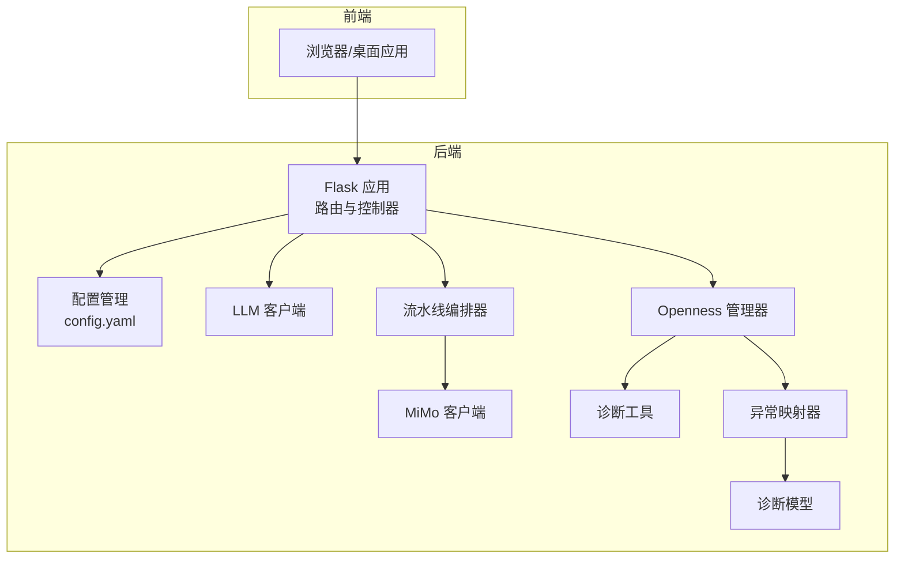
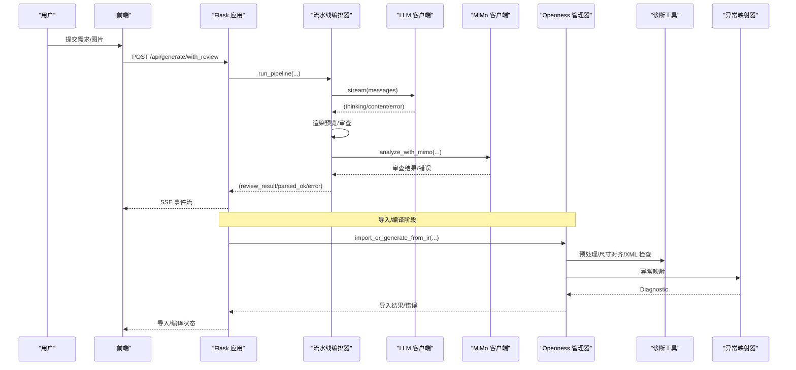
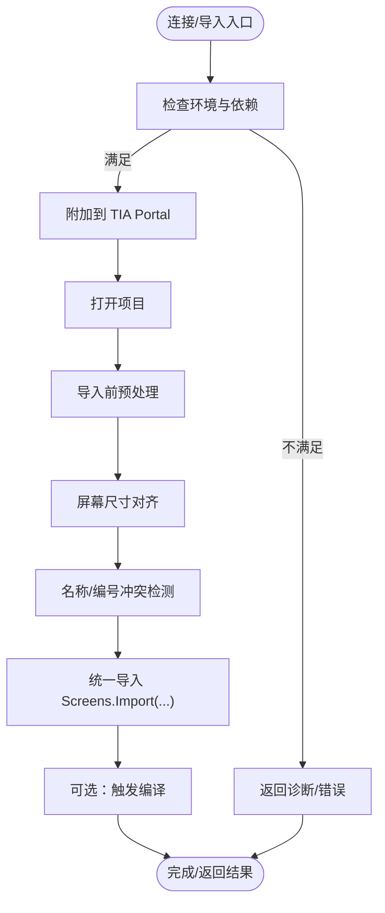
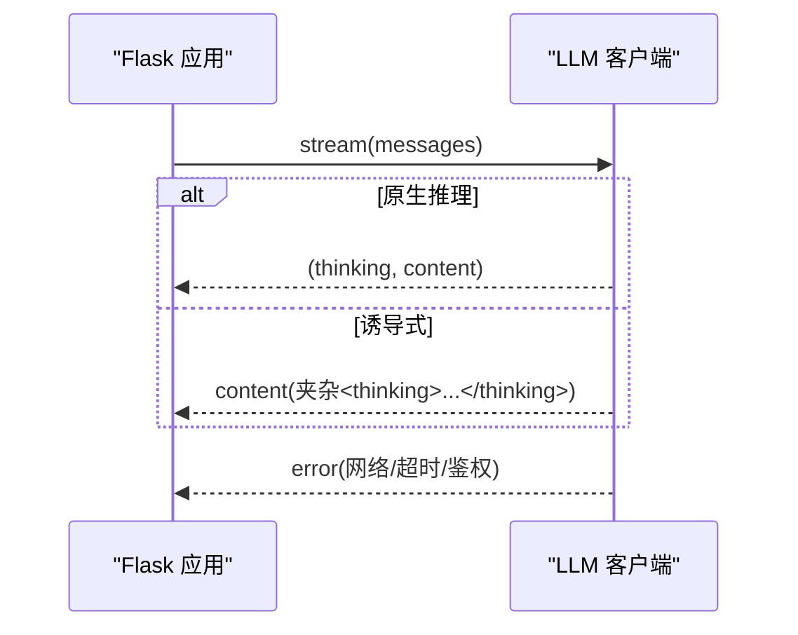
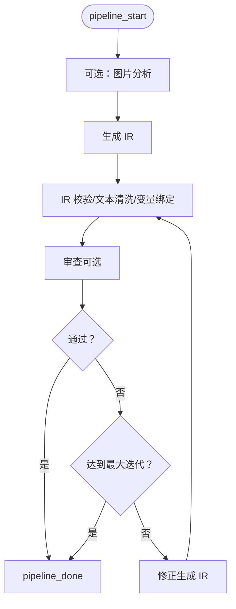
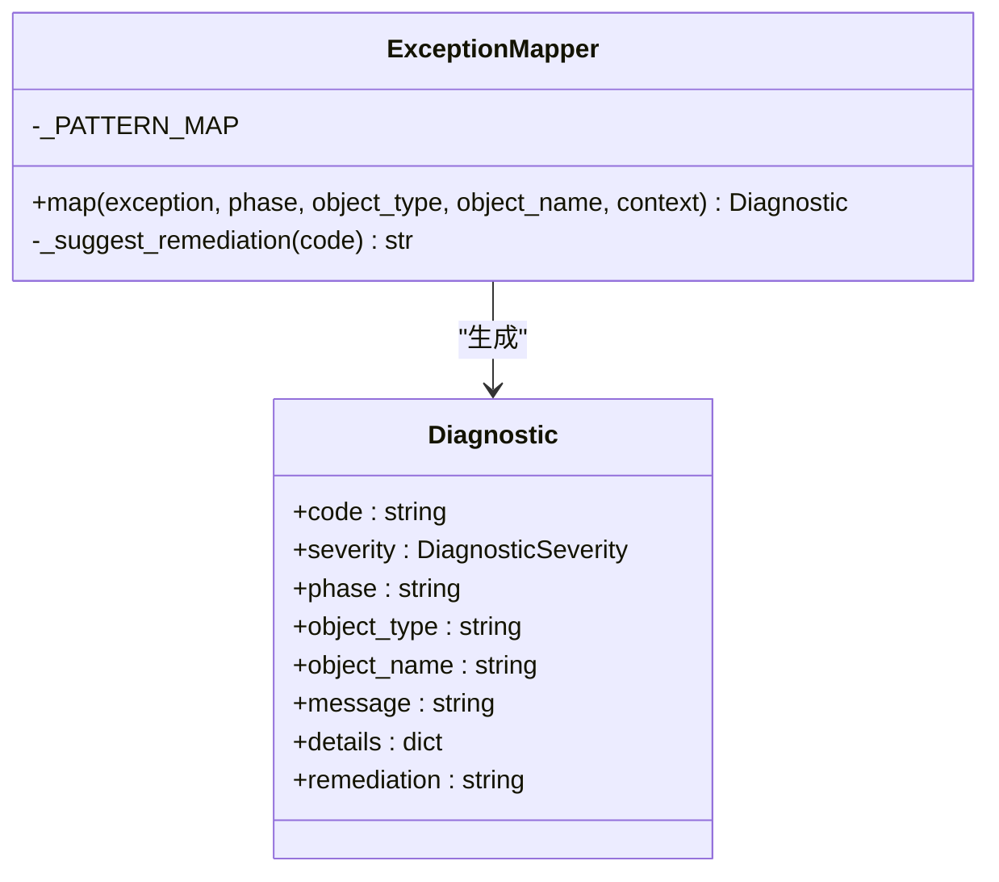
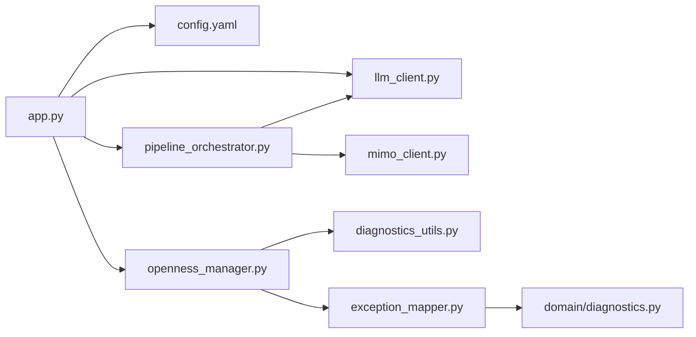

# 故障排除

<cite>
**本文档引用的文件**
- [app.py](file://app.py)
- [config.yaml](file://config.yaml)
- [requirements.txt](file://requirements.txt)
- [backend/openness_manager.py](file://backend/openness_manager.py)
- [backend/llm_client.py](file://backend/llm_client.py)
- [backend/pipeline_orchestrator.py](file://backend/pipeline_orchestrator.py)
- [backend/mimo_client.py](file://backend/mimo_client.py)
- [backend/openness/diagnostics_utils.py](file://backend/openness/diagnostics_utils.py)
- [backend/openness/exception_mapper.py](file://backend/openness/exception_mapper.py)
- [backend/domain/diagnostics.py](file://backend/domain/diagnostics.py)
- [tests/test_openness_manager.py](file://tests/test_openness_manager.py)
- [Documents/README_Basic_HMI_Support.md](file://Documents/README_Basic_HMI_Support.md)
</cite>

## 目录
1. [简介](#简介)
2. [项目结构](#项目结构)
3. [核心组件](#核心组件)
4. [架构总览](#架构总览)
5. [详细组件分析](#详细组件分析)
6. [依赖分析](#依赖分析)
7. [性能考虑](#性能考虑)
8. [故障排除指南](#故障排除指南)
9. [结论](#结论)
10. [附录](#附录)

## 简介
本指南面向使用 Siemens HMI Assistant 的工程师与技术支持人员，提供系统化的故障排除方法。涵盖 Openness 连接问题、LLM 集成问题、HMI 生成问题、文件处理问题、系统诊断工具与日志分析技巧、性能问题识别与优化，以及配置错误、环境问题、权限问题的解决方案。文档以“可操作”为主，帮助用户自助定位并解决问题。

## 项目结构
系统采用前后端分离架构：前端通过 Flask 提供 REST API，后端包含 LLM 客户端、Openness 管理器、多阶段流水线编排器、MiMo 视觉审查客户端、诊断工具与异常映射器等模块。配置集中于 YAML 文件，便于快速定位与修复。

图表来源
- [app.py:1-966](file://app.py#L1-L966)
- [config.yaml:1-343](file://config.yaml#L1-L343)
- [backend/llm_client.py:1-229](file://backend/llm_client.py#L1-L229)
- [backend/pipeline_orchestrator.py:1-354](file://backend/pipeline_orchestrator.py#L1-L354)
- [backend/mimo_client.py:1-324](file://backend/mimo_client.py#L1-L324)
- [backend/openness_manager.py:1-2344](file://backend/openness_manager.py#L1-L2344)
- [backend/openness/diagnostics_utils.py:1-236](file://backend/openness/diagnostics_utils.py#L1-L236)
- [backend/openness/exception_mapper.py:1-87](file://backend/openness/exception_mapper.py#L1-L87)
- [backend/domain/diagnostics.py:1-127](file://backend/domain/diagnostics.py#L1-L127)

章节来源
- [app.py:1-966](file://app.py#L1-L966)
- [config.yaml:1-343](file://config.yaml#L1-L343)

## 核心组件
- Flask 应用：提供配置读取/保存、生成（SSE）、构建（SimaticML）、Openness 诊断/连接/导入/能力查询、部署计划与能力查询等 API。
- LLM 客户端：封装 OpenAI 兼容接口，支持流式输出与“思考深度”策略。
- 流水线编排器：将“生成 → 预览渲染 → MiMo 审查 → 修正 → 再审查”串联为 SSE 事件流。
- Openness 管理器：封装 TIA Portal 连接、设备发现、XML 导入预处理、屏幕尺寸对齐、导入与编译等。
- 诊断工具与异常映射器：收集异常链、描述 .NET 对象、枚举 Tag、XML 结构检查；将异常映射为结构化诊断。
- 诊断模型：标准化错误码与严重级别，便于统一呈现与自动化处理。

章节来源
- [app.py:84-800](file://app.py#L84-L800)
- [backend/llm_client.py:35-229](file://backend/llm_client.py#L35-L229)
- [backend/pipeline_orchestrator.py:131-354](file://backend/pipeline_orchestrator.py#L131-L354)
- [backend/openness_manager.py:31-2344](file://backend/openness_manager.py#L31-L2344)
- [backend/openness/diagnostics_utils.py:35-236](file://backend/openness/diagnostics_utils.py#L35-L236)
- [backend/openness/exception_mapper.py:20-87](file://backend/openness/exception_mapper.py#L20-L87)
- [backend/domain/diagnostics.py:17-127](file://backend/domain/diagnostics.py#L17-L127)

## 架构总览
以下序列图展示“生成 + 视觉审查”的典型调用链，包括错误与异常的传播路径。

图表来源
- [app.py:225-267](file://app.py#L225-L267)
- [backend/pipeline_orchestrator.py:131-354](file://backend/pipeline_orchestrator.py#L131-L354)
- [backend/llm_client.py:78-170](file://backend/llm_client.py#L78-L170)
- [backend/mimo_client.py:203-324](file://backend/mimo_client.py#L203-L324)
- [backend/openness_manager.py:656-704](file://backend/openness_manager.py#L656-L704)
- [backend/openness/diagnostics_utils.py:35-236](file://backend/openness/diagnostics_utils.py#L35-L236)
- [backend/openness/exception_mapper.py:41-87](file://backend/openness/exception_mapper.py#L41-L87)

## 详细组件分析

### Openness 管理器（连接与导入）
- 连接：加载 Siemens.Engineering.dll，附加到运行中的 TIA Portal，打开项目。
- 导入前预处理：文本清洗、MultilingualText 重建、删除 Number 节点、屏幕尺寸对齐、名称冲突检测、XML 校验。
- 统一导入：严格使用 Screens.Import(FileInfo, ImportOptions)，失败时记录 attempts。
- 诊断：检查 OS/依赖/DLL/进程，返回 ready 与 messages。

图表来源
- [backend/openness_manager.py:103-139](file://backend/openness_manager.py#L103-L139)
- [backend/openness_manager.py:142-186](file://backend/openness_manager.py#L142-L186)
- [backend/openness_manager.py:194-362](file://backend/openness_manager.py#L194-L362)
- [backend/openness_manager.py:656-704](file://backend/openness_manager.py#L656-L704)

章节来源
- [backend/openness_manager.py:103-704](file://backend/openness_manager.py#L103-L704)

### LLM 客户端（流式生成与思考深度）
- 支持原生推理模型与“诱导式思考”两种模式。
- 流式输出：(kind ∈ {thinking,content,error}, text)。
- JSON 抽取：容错解析，去除围栏与不匹配大括号。

图表来源
- [backend/llm_client.py:78-170](file://backend/llm_client.py#L78-L170)
- [backend/llm_client.py:206-229](file://backend/llm_client.py#L206-L229)

章节来源
- [backend/llm_client.py:35-229](file://backend/llm_client.py#L35-L229)

### 流水线编排器（生成-审查-修正）
- 多阶段：图片分析（可选）→ 生成 → IR 校验 → 文本清洗 → 变量绑定 → 审查（可选）→ 修正 → 再审查。
- SSE 事件：pipeline_start → review_result → pipeline_done。
- 最大迭代次数与通过阈值受配置控制。

图表来源
- [backend/pipeline_orchestrator.py:131-354](file://backend/pipeline_orchestrator.py#L131-L354)

章节来源
- [backend/pipeline_orchestrator.py:131-354](file://backend/pipeline_orchestrator.py#L131-L354)

### 诊断工具与异常映射
- 诊断工具：收集异常链、描述 .NET 对象、枚举 Tag、XML 结构检查。
- 异常映射器：将 .NET/系统异常映射为结构化诊断，包含错误码、严重级别、修复建议。

图表来源
- [backend/openness/exception_mapper.py:20-87](file://backend/openness/exception_mapper.py#L20-L87)
- [backend/domain/diagnostics.py:17-127](file://backend/domain/diagnostics.py#L17-L127)

章节来源
- [backend/openness/diagnostics_utils.py:35-236](file://backend/openness/diagnostics_utils.py#L35-L236)
- [backend/openness/exception_mapper.py:20-87](file://backend/openness/exception_mapper.py#L20-L87)
- [backend/domain/diagnostics.py:17-127](file://backend/domain/diagnostics.py#L17-L127)

## 依赖分析
- 运行时依赖：Flask、PyYAML、requests、pdfplumber、Pillow、pythonnet（Windows）。
- 关键耦合：Openness 管理器依赖 pythonnet 与 TIA DLL；流水线依赖 LLM/MiMo；异常映射依赖诊断模型。

图表来源
- [requirements.txt:1-25](file://requirements.txt#L1-L25)
- [app.py:23-40](file://app.py#L23-L40)

章节来源
- [requirements.txt:1-25](file://requirements.txt#L1-L25)
- [app.py:23-40](file://app.py#L23-L40)

## 性能考虑
- LLM 生成：合理设置思考深度与温度，避免过度 token 消耗；必要时启用“诱导式思考”以减少模型内部推理成本。
- 图像分析：限制最大边长与并发图片数，避免 MiMo API 超时；对大图进行等比缩放。
- Openness 导入：批量导入前先进行 XML 预处理与尺寸对齐，减少 TIA 内部异常与重试。
- 日志与诊断：使用诊断工具输出最小必要信息，避免冗余堆栈泄露敏感上下文。

[本节为通用指导，无需特定文件来源]

## 故障排除指南

### 一、Openness 连接问题
- 症状
  - “诊断”显示“非 Windows”、“未检测到 pythonnet”、“DLL 路径不存在”。
  - “连接”返回“未发现正在运行的博途实例”、“未打开项目”。
  - 导入失败，提示“Screens.Import 调用失败”。
- 诊断步骤
  - 访问“/api/openness/diagnose”，确认 ready 与 messages。
  - 确认操作系统为 Windows，安装 pythonnet；检查 config.yaml 中 openness.dll_path 是否存在。
  - 确认 TIA Portal 已启动且已打开项目；检查 attach_running 与 project_path 设置。
  - 导入前检查 XML：使用“/api/openness/diagnose”返回的 attempts 与 warnings。
- 解决方案
  - 在 Windows 上安装 pythonnet；修正 DLL 路径；确保 TIA 已运行并打开项目。
  - 若屏幕尺寸不匹配，启用 auto_scale_screen_items 并在 config.yaml 中设置 target_resolution。
  - 若名称/编号冲突，修改 IR 中 screen_name 或让系统自动重命名。
  - 导入失败时，查看 attempts 列表，核对 XML 结构与 TIA 版本兼容性。

章节来源
- [app.py:316-333](file://app.py#L316-L333)
- [app.py:336-376](file://app.py#L336-L376)
- [backend/openness_manager.py:103-139](file://backend/openness_manager.py#L103-L139)
- [backend/openness_manager.py:142-186](file://backend/openness_manager.py#L142-L186)
- [backend/openness_manager.py:656-704](file://backend/openness_manager.py#L656-L704)

### 二、LLM 集成问题
- 症状
  - 生成过程中出现“未配置 API Key”、“模型接口返回 XXX”、“请求超时”。
  - 思考深度设置无效或输出中未包含<thinking>…</thinking>。
- 诊断步骤
  - 检查 config.yaml 中 llm.providers.* 的 base_url 与 api_key。
  - 在“生成”接口中观察 SSE 事件：error/thinking/content。
  - 使用“/api/generate/with_review”查看审查阶段是否触发。
- 解决方案
  - 填写正确的 API Key；更换 base_url 或切换 provider。
  - 调整 thinking_depth 与 show_thinking；必要时关闭原生推理以启用“诱导式思考”。

章节来源
- [app.py:166-220](file://app.py#L166-L220)
- [app.py:225-267](file://app.py#L225-L267)
- [backend/llm_client.py:82-104](file://backend/llm_client.py#L82-L104)
- [backend/llm_client.py:166-169](file://backend/llm_client.py#L166-L169)

### 三、HMI 生成问题
- 症状
  - IR 校验失败、变量绑定异常、文本字段包含 HTML 富文本。
  - 预览渲染失败、审查结果为空或报错。
- 诊断步骤
  - 在“生成 + 视觉审查”流水线中观察 review_progress 与 review_result。
  - 检查 IR 文本字段是否包含 HTML；确认变量引擎已生成 HMI Tags/VBS。
  - 若启用审查，确认 mimo.enabled 与 api_key。
- 解决方案
  - 使用 tia_text_sanitizer 清洗 IR 文本字段；确保 meta.resolution 与 target_resolution 一致。
  - 打开 mimo 并填写有效 API Key；调整 max_iterations 与 review_pass_threshold。

章节来源
- [backend/pipeline_orchestrator.py:219-227](file://backend/pipeline_orchestrator.py#L219-L227)
- [backend/pipeline_orchestrator.py:247-270](file://backend/pipeline_orchestrator.py#L247-L270)
- [config.yaml:329-338](file://config.yaml#L329-L338)

### 四、文件处理问题
- 症状
  - PDF 解析失败、图片转 base64 失败、上传文件未被识别。
- 诊断步骤
  - 检查 parse_uploaded_files 的返回：extra_text、images_preview、images_analysis。
  - 确认 pdfplumber 安装；检查图片 MIME 类型与大小。
- 解决方案
  - 安装 pdfplumber；确保图片为 PNG/JPEG/BMP/GIF/WebP；必要时缩小图片尺寸。

章节来源
- [app.py:114-161](file://app.py#L114-L161)
- [requirements.txt:14-18](file://requirements.txt#L14-L18)

### 五、系统诊断工具与日志分析
- 诊断工具
  - describe_dotnet_object：获取 .NET 对象类型与程序集信息。
  - enumerate_tag_names/find_tag：安全枚举与查找 Tag。
  - inspect_xml_document：提取根标签、命名空间、BOM、编码、对象类型等。
- 日志与异常
  - 使用 collect_exception_chain 收集 Python/.NET 异常链。
  - 异常映射器将异常映射为结构化诊断，包含错误码与修复建议。
- 使用建议
  - 在导入失败时，打印 attempts 与 warnings；对比系统生成 XML 与真实 TIA 导出 XML 的结构差异。
  - 保留最小必要日志，避免泄露敏感上下文。

章节来源
- [backend/openness/diagnostics_utils.py:35-236](file://backend/openness/diagnostics_utils.py#L35-L236)
- [backend/openness/exception_mapper.py:41-87](file://backend/openness/exception_mapper.py#L41-L87)

### 六、性能问题识别与解决
- 生成慢
  - 降低思考深度；减少图片分析数量；缩短审查轮次。
- 审查不稳定
  - 调整 review_timeout_seconds 与 max_iterations；确保 MiMo API 可用。
- 导入卡顿
  - 预处理 XML，确保尺寸与名称无冲突；避免大图直传。

章节来源
- [config.yaml:335-338](file://config.yaml#L335-L338)
- [backend/mimo_client.py:243-244](file://backend/mimo_client.py#L243-L244)

### 七、配置错误与环境问题
- 配置错误
  - llm.providers.api_key 为空；openness.dll_path 不存在；mimo.api_key 为空。
  - hmi_defaults.resolution 与 target_resolution 不一致。
- 环境问题
  - 非 Windows 系统无法加载 pythonnet；TIA 未运行或未打开项目。
- 解决方案
  - 修正 config.yaml；确保路径与 API Key 正确；在 Windows 上安装 pythonnet。

章节来源
- [config.yaml:1-343](file://config.yaml#L1-L343)
- [requirements.txt:20-25](file://requirements.txt#L20-L25)

### 八、权限问题
- 症状
  - “访问被拒绝”、“无法导入”、“无法编译”。
- 诊断与解决
  - 确认当前 Windows 用户属于“Siemens TIA Openness”用户组；检查 TIA Portal 权限。
  - 使用异常映射器查看错误码，结合修复建议进行处理。

章节来源
- [backend/openness_manager.py:106-114](file://backend/openness_manager.py#L106-L114)
- [backend/openness/exception_mapper.py:28-39](file://backend/openness/exception_mapper.py#L28-L39)

### 九、Basic/KTP Basic HMI 支持
- 症状
  - Basic 设备未配置模板 XML 时盲目回退或生成不兼容 XML。
- 诊断与解决
  - 按 Basic 支持说明导出模板 XML 并在 config.yaml 中配置；确保 meta.hmi_type 与分辨率正确。

章节来源
- [Documents/README_Basic_HMI_Support.md:1-34](file://Documents/README_Basic_HMI_Support.md#L1-L34)

## 结论
本指南提供了从 Openness 连接、LLM 集成、HMI 生成到文件处理、系统诊断与性能优化的完整故障排除路径。建议在日常使用中：
- 定期检查“/api/openness/diagnose”与“/api/openness/status”。
- 合理配置 llm 与 mimo，控制生成与审查成本。
- 在导入前进行 XML 预处理与尺寸对齐。
- 使用诊断工具与异常映射器定位根因，按错误码与修复建议逐一解决。

[本节为总结，无需特定文件来源]

## 附录

### 常见错误码与含义（节选）
- IMPORT_TIA_EXCEPTION：TIA 操作异常（导入/编译/脚本等）。
- COMPILE_ERROR/COMPILE_WARNING：编译失败或警告。
- DEP_MISSING_CONTROLLER_TAG：控制器变量缺失。
- CAP_UNSUPPORTED_FEATURE：能力不支持（如 Basic 设备不支持某些特性）。
- IR_VALIDATION_ERROR：IR 校验失败。
- DEFAULT_TAG_TABLE_NOT_FOUND：默认 Tag 表缺失。
- CLASSIC_TEMPLATE_TAG_REFERENCE_LEAK：经典模板引用泄漏。

章节来源
- [backend/domain/diagnostics.py:41-127](file://backend/domain/diagnostics.py#L41-L127)

### 测试用例参考（用于自检）
- 未连接时的错误返回：export_reference_screen、export_screen_xml_template、import_screen_xml、create_unified_screen_from_ir。
- _export_screen_to_file 不应传字符串给 Screen.Export()。
- get_hmi_capabilities 在未连接时返回 disconnected 与 warnings。

章节来源
- [tests/test_openness_manager.py:44-90](file://tests/test_openness_manager.py#L44-L90)
- [tests/test_openness_manager.py:95-152](file://tests/test_openness_manager.py#L95-L152)
- [tests/test_openness_manager.py:158-187](file://tests/test_openness_manager.py#L158-L187)