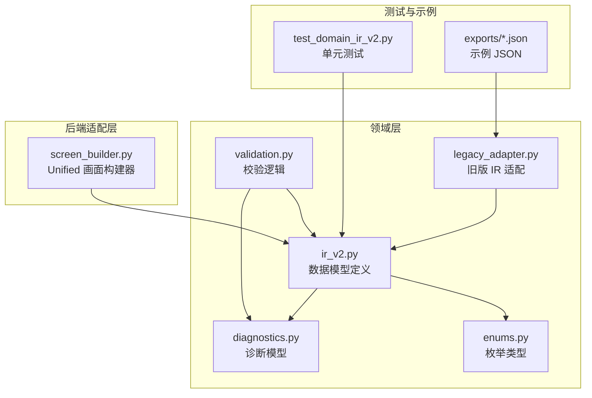
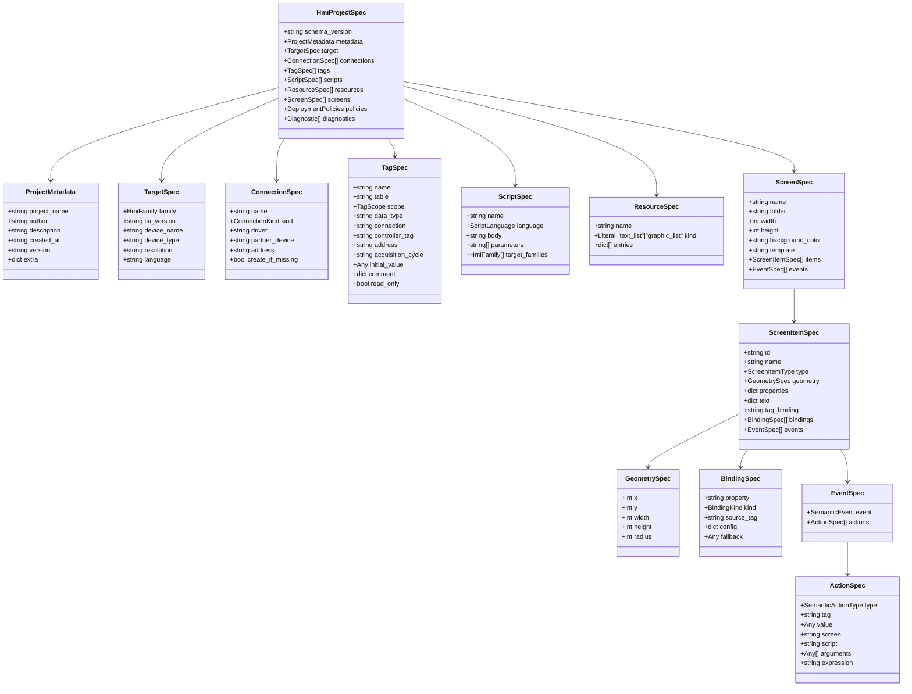
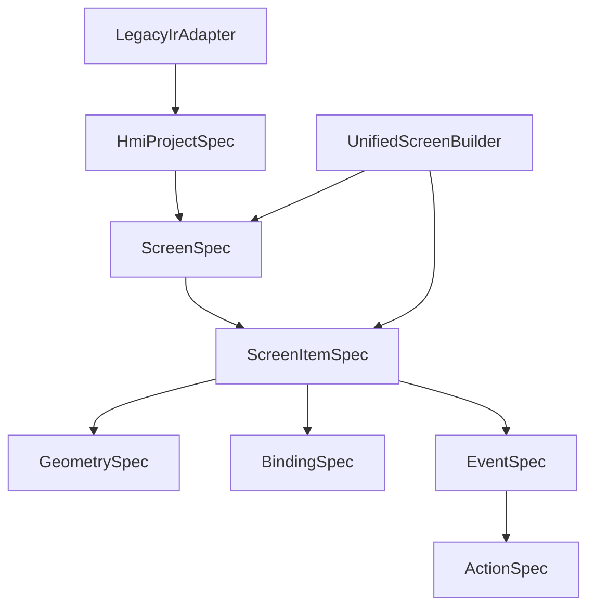
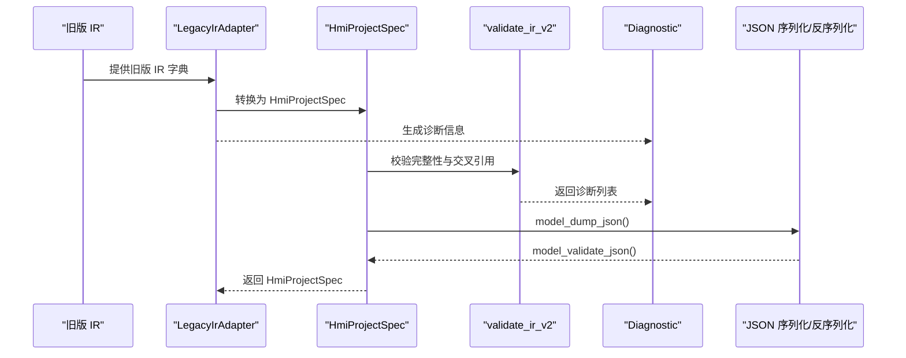
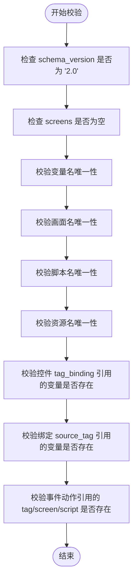
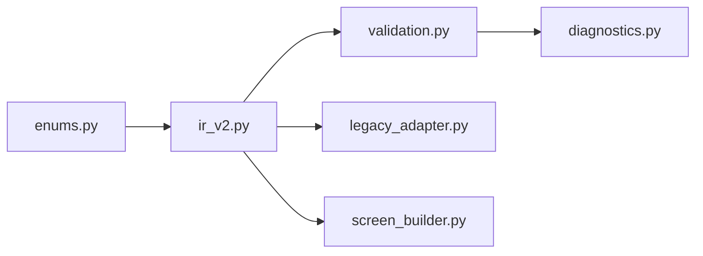

# IR V2 数据模型

<cite>
**本文档引用的文件**
- [ir_v2.py](file://backend/domain/ir_v2.py)
- [enums.py](file://backend/domain/enums.py)
- [validation.py](file://backend/domain/validation.py)
- [diagnostics.py](file://backend/domain/diagnostics.py)
- [legacy_adapter.py](file://backend/domain/legacy_adapter.py)
- [screen_builder.py](file://backend/backends/unified/screen_builder.py)
- [test_domain_ir_v2.py](file://tests/test_domain_ir_v2.py)
- [Login_Screen_20260618_114837.json](file://exports/Login_Screen_20260618_114837.json)
- [Motor_Control_20260618_010317.json](file://exports/Motor_Control_20260618_010317.json)
</cite>

## 目录
1. [简介](#简介)
2. [项目结构](#项目结构)
3. [核心组件](#核心组件)
4. [架构总览](#架构总览)
5. [详细组件分析](#详细组件分析)
6. [依赖关系分析](#依赖关系分析)
7. [性能考量](#性能考量)
8. [故障排查指南](#故障排查指南)
9. [结论](#结论)
10. [附录](#附录)

## 简介
本文件系统性阐述 Siemens HMI Assistant 项目中 HMI IR V2 数据模型的设计与实现，重点围绕顶层模型 HmiProjectSpec 及其子模型：ProjectMetadata（项目元数据）、TargetSpec（目标设备）、ConnectionSpec（连接规格）、TagSpec（变量规格）、GeometrySpec（几何信息）、BindingSpec（动态绑定）、EventSpec 和 ActionSpec（事件与动作）、ScriptSpec（脚本规格）、ResourceSpec（资源规格）、ScreenItemSpec（画面对象）和 ScreenSpec（画面规格）。文档涵盖字段定义、数据类型、约束条件、验证规则、模型间关系与继承结构，并提供 JSON 示例与序列化/反序列化流程说明，帮助开发者与使用者正确构建与使用 IR V2 对象。

## 项目结构
IR V2 数据模型位于后端领域层（Domain Layer），采用 Pydantic v2 定义，不依赖 Flask、pythonnet 或 Siemens DLL，保证跨平台与可移植性。核心文件组织如下：
- backend/domain/ir_v2.py：定义所有 IR V2 数据模型类
- backend/domain/enums.py：定义所有枚举类型
- backend/domain/validation.py：提供 IR V2 校验逻辑
- backend/domain/diagnostics.py：定义诊断与错误码
- backend/domain/legacy_adapter.py：将旧版 IR 转换为 IR V2
- backend/backends/unified/screen_builder.py：将 IR V2 映射到 Unified 后端
- tests/test_domain_ir_v2.py：覆盖 IR V2 模型的单元测试
- exports/*.json：导出的示例 IR V2 JSON 数据

图表来源
- [ir_v2.py:1-354](file://backend/domain/ir_v2.py#L1-L354)
- [enums.py:1-157](file://backend/domain/enums.py#L1-L157)
- [validation.py:1-206](file://backend/domain/validation.py#L1-L206)
- [diagnostics.py:1-127](file://backend/domain/diagnostics.py#L1-L127)
- [legacy_adapter.py:1-505](file://backend/domain/legacy_adapter.py#L1-L505)
- [screen_builder.py:1-48](file://backend/backends/unified/screen_builder.py#L1-L48)
- [test_domain_ir_v2.py:1-312](file://tests/test_domain_ir_v2.py#L1-L312)
- [Login_Screen_20260618_114837.json:1-134](file://exports/Login_Screen_20260618_114837.json#L1-L134)
- [Motor_Control_20260618_010317.json:1-205](file://exports/Motor_Control_20260618_010317.json#L1-L205)

章节来源
- [ir_v2.py:1-354](file://backend/domain/ir_v2.py#L1-L354)
- [enums.py:1-157](file://backend/domain/enums.py#L1-L157)
- [validation.py:1-206](file://backend/domain/validation.py#L1-L206)
- [diagnostics.py:1-127](file://backend/domain/diagnostics.py#L1-L127)
- [legacy_adapter.py:1-505](file://backend/domain/legacy_adapter.py#L1-L505)
- [screen_builder.py:1-48](file://backend/backends/unified/screen_builder.py#L1-L48)
- [test_domain_ir_v2.py:1-312](file://tests/test_domain_ir_v2.py#L1-L312)
- [Login_Screen_20260618_114837.json:1-134](file://exports/Login_Screen_20260618_114837.json#L1-L134)
- [Motor_Control_20260618_010317.json:1-205](file://exports/Motor_Control_20260618_010317.json#L1-L205)

## 核心组件
本节概述顶层模型 HmiProjectSpec 及其子模型的职责与关键字段。

- HmiProjectSpec（顶层模型）
  - schema_version：固定为 "2.0"
  - metadata：ProjectMetadata（项目元数据）
  - target：TargetSpec（目标设备）
  - connections：ConnectionSpec 列表（连接列表）
  - tags：TagSpec 列表（变量列表）
  - scripts：ScriptSpec 列表（脚本列表）
  - resources：ResourceSpec 列表（资源列表）
  - screens：ScreenSpec 列表（画面列表）
  - policies：DeploymentPolicies（部署策略）
  - diagnostics：Diagnostic 列表（诊断信息）

- ProjectMetadata（项目元数据）
  - project_name、author、description、created_at、version、extra

- TargetSpec（目标设备）
  - family（HmiFamily）、tia_version、device_name、device_type、resolution、language

- ConnectionSpec（连接规格）
  - name（唯一）、kind（ConnectionKind）、driver、partner_device、address、create_if_missing

- TagSpec（变量规格）
  - name、table、scope（TagScope）、data_type、connection、controller_tag、address、acquisition_cycle、initial_value、comment、read_only
  - 约束：外部变量（EXTERNAL）至少需提供 connection 或 address（模型宽松，plan/validate 阶段校验）

- GeometrySpec（几何信息）
  - x、y（≥0）、width、height（≥1）、radius（圆形控件）

- BindingSpec（动态绑定）
  - property、kind（BindingKind）、source_tag、config、fallback

- EventSpec 与 ActionSpec（事件与动作）
  - EventSpec：event（SemanticEvent）、actions（ActionSpec 列表）
  - ActionSpec：type（SemanticActionType）、tag、value、screen、script、arguments、expression

- ScriptSpec（脚本规格）
  - name、language（ScriptLanguage）、body、parameters、target_families

- ResourceSpec（资源规格）
  - name、kind（"text_list"|"graphic_list"）、entries

- ScreenItemSpec（画面对象）
  - id、name、type（ScreenItemType）、geometry（GeometrySpec）、properties、text、tag_binding、bindings、events

- ScreenSpec（画面规格）
  - name、folder、width、height、background_color、template、items、events

章节来源
- [ir_v2.py:321-354](file://backend/domain/ir_v2.py#L321-L354)
- [ir_v2.py:64-73](file://backend/domain/ir_v2.py#L64-L73)
- [ir_v2.py:80-101](file://backend/domain/ir_v2.py#L80-L101)
- [ir_v2.py:108-123](file://backend/domain/ir_v2.py#L108-L123)
- [ir_v2.py:130-159](file://backend/domain/ir_v2.py#L130-L159)
- [ir_v2.py:166-174](file://backend/domain/ir_v2.py#L166-L174)
- [ir_v2.py:181-193](file://backend/domain/ir_v2.py#L181-L193)
- [ir_v2.py:212-220](file://backend/domain/ir_v2.py#L212-L220)
- [ir_v2.py:200-210](file://backend/domain/ir_v2.py#L200-L210)
- [ir_v2.py:226-240](file://backend/domain/ir_v2.py#L226-L240)
- [ir_v2.py:247-257](file://backend/domain/ir_v2.py#L247-L257)
- [ir_v2.py:264-288](file://backend/domain/ir_v2.py#L264-L288)
- [ir_v2.py:295-314](file://backend/domain/ir_v2.py#L295-L314)

## 架构总览
IR V2 模型采用分层设计：
- 领域层（Domain）：定义数据模型与枚举，提供校验与诊断
- 适配层（Adapter）：将旧版 IR 转换为 IR V2
- 后端适配层（Backends）：将 IR V2 映射到具体后端（如 Unified）

图表来源
- [ir_v2.py:64-354](file://backend/domain/ir_v2.py#L64-L354)

## 详细组件分析

### HmiProjectSpec 顶层模型
- 角色：承载整个 HMI 工程的完整语义 IR
- 关键点：
  - schema_version 固定为 "2.0"
  - 包含元数据、目标设备、连接、变量、脚本、资源、画面、部署策略与诊断信息
  - 作为序列化/反序列化的根对象

章节来源
- [ir_v2.py:321-354](file://backend/domain/ir_v2.py#L321-L354)

### ProjectMetadata（项目元数据）
- 字段与类型：字符串型字段为主，extra 为任意键值对字典
- 约束：无强制约束，但建议遵循 ISO 8601 时间格式
- 用途：记录项目基本信息，便于导入导出与版本管理

章节来源
- [ir_v2.py:64-73](file://backend/domain/ir_v2.py#L64-L73)

### TargetSpec（目标设备）
- 字段与类型：枚举字段（family）、字符串字段（tia_version、device_name、device_type、resolution、language）
- 默认值：language 默认 "zh-CN"，family 默认 "auto"
- 用途：描述目标 HMI 设备族、分辨率、语言等

章节来源
- [ir_v2.py:80-101](file://backend/domain/ir_v2.py#L80-L101)
- [enums.py:11-16](file://backend/domain/enums.py#L11-L16)

### ConnectionSpec（连接规格）
- 字段与类型：name（必填，唯一）、kind（ConnectionKind）、driver、partner_device、address、create_if_missing
- 约束：name 在 HMI 内唯一
- 用途：描述与 PLC 等外部设备的连接关系

章节来源
- [ir_v2.py:108-123](file://backend/domain/ir_v2.py#L108-L123)
- [enums.py:25-31](file://backend/domain/enums.py#L25-L31)

### TagSpec（变量规格）
- 字段与类型：name（必填）、table、scope（TagScope）、data_type、connection、controller_tag、address、acquisition_cycle、initial_value、comment、read_only
- 约束：
  - 外部变量（EXTERNAL）至少需提供 connection 或 address（模型宽松，plan/validate 阶段校验）
- 用途：描述 HMI 变量的属性与来源

章节来源
- [ir_v2.py:130-159](file://backend/domain/ir_v2.py#L130-L159)
- [enums.py:19-22](file://backend/domain/enums.py#L19-L22)

### GeometrySpec（几何信息）
- 字段与类型：x、y（≥0）、width、height（≥1）、radius（圆形控件）
- 约束：坐标与尺寸均为非负整数，width/height 至少为 1
- 用途：描述画面控件的位置与大小

章节来源
- [ir_v2.py:166-174](file://backend/domain/ir_v2.py#L166-L174)

### BindingSpec（动态绑定）
- 字段与类型：property、kind（BindingKind）、source_tag、config、fallback
- 用途：将控件属性与变量进行动态绑定，支持离散映射、范围映射、线性映射、闪烁等
- config：不同 kind 下的配置结构（如 states、阈值等）

章节来源
- [ir_v2.py:181-193](file://backend/domain/ir_v2.py#L181-L193)
- [enums.py:48-57](file://backend/domain/enums.py#L48-L57)

### EventSpec 与 ActionSpec（事件与动作）
- EventSpec：event（SemanticEvent）、actions（ActionSpec 列表）
- ActionSpec：type（SemanticActionType）、tag、value、screen、script、arguments、expression
- 用途：描述控件事件触发的动作集合，如置位、复位、切换、激活画面、调用脚本等

章节来源
- [ir_v2.py:212-220](file://backend/domain/ir_v2.py#L212-L220)
- [ir_v2.py:200-210](file://backend/domain/ir_v2.py#L200-L210)
- [enums.py:60-86](file://backend/domain/enums.py#L60-L86)

### ScriptSpec（脚本规格）
- 字段与类型：name（必填）、language（ScriptLanguage）、body、parameters、target_families
- 用途：描述可复用的脚本，支持语义脚本、VBS、JavaScript

章节来源
- [ir_v2.py:226-240](file://backend/domain/ir_v2.py#L226-L240)
- [enums.py:88-92](file://backend/domain/enums.py#L88-L92)

### ResourceSpec（资源规格）
- 字段与类型：name（必填）、kind（"text_list"|"graphic_list"）、entries
- 用途：描述文本列表、图形列表等资源

章节来源
- [ir_v2.py:247-257](file://backend/domain/ir_v2.py#L247-L257)

### ScreenItemSpec（画面对象）
- 字段与类型：id（必填）、name、type（ScreenItemType）、geometry（GeometrySpec）、properties、text、tag_binding、bindings、events
- 用途：描述画面中的单个控件，包含几何、属性、文本、绑定与事件

章节来源
- [ir_v2.py:264-288](file://backend/domain/ir_v2.py#L264-L288)
- [enums.py:33-46](file://backend/domain/enums.py#L33-L46)

### ScreenSpec（画面规格）
- 字段与类型：name（必填）、folder、width、height、background_color、template、items（ScreenItemSpec 列表）、events
- 用途：描述一个画面的整体布局与行为

章节来源
- [ir_v2.py:295-314](file://backend/domain/ir_v2.py#L295-L314)

### DeploymentPolicies（部署策略）
- 字段与类型：conflict_policy（ConflictPolicy）、unsupported_feature（UnsupportedFeaturePolicy）、missing_dependency（MissingDependencyPolicy）、compile_after_deploy、save_after_deploy
- 用途：控制部署阶段的行为策略

章节来源
- [ir_v2.py:37-56](file://backend/domain/ir_v2.py#L37-L56)
- [enums.py:116-134](file://backend/domain/enums.py#L116-L134)

## 架构总览
IR V2 模型与后端适配的关系如下：

图表来源
- [ir_v2.py:295-354](file://backend/domain/ir_v2.py#L295-L354)
- [legacy_adapter.py:99-162](file://backend/domain/legacy_adapter.py#L99-L162)
- [screen_builder.py:14-47](file://backend/backends/unified/screen_builder.py#L14-L47)

## 详细组件分析

### 组件关系与继承结构
- HmiProjectSpec 组合多个子模型，形成树状结构
- ScreenSpec 包含 ScreenItemSpec 列表
- ScreenItemSpec 组合 GeometrySpec、BindingSpec、EventSpec、ActionSpec
- 所有枚举类型来自 enums.py，确保类型安全与一致性

章节来源
- [ir_v2.py:295-354](file://backend/domain/ir_v2.py#L295-L354)
- [enums.py:1-157](file://backend/domain/enums.py#L1-L157)

### API/服务组件调用流程（序列图）
以下序列图展示从旧版 IR 到 HmiProjectSpec 的转换流程，以及 JSON 序列化/反序列化过程。

图表来源
- [legacy_adapter.py:99-162](file://backend/domain/legacy_adapter.py#L99-L162)
- [validation.py:21-189](file://backend/domain/validation.py#L21-L189)
- [test_domain_ir_v2.py:51-117](file://tests/test_domain_ir_v2.py#L51-L117)

### 复杂逻辑组件（算法流程图）
变量唯一性与引用校验流程如下：

图表来源
- [validation.py:21-189](file://backend/domain/validation.py#L21-L189)

## 依赖关系分析
- 模型依赖：HmiProjectSpec 依赖所有子模型；ScreenSpec 依赖 ScreenItemSpec；ScreenItemSpec 依赖 GeometrySpec、BindingSpec、EventSpec、ActionSpec
- 枚举依赖：各模型字段使用 enums.py 中的枚举类型
- 校验依赖：validation.py 依赖 HmiProjectSpec 与 Diagnostic
- 适配依赖：legacy_adapter.py 依赖 enums 与 ir_v2 模型
- 后端适配：screen_builder.py 依赖 ir_v2 模型

图表来源
- [ir_v2.py:16-29](file://backend/domain/ir_v2.py#L16-L29)
- [enums.py:1-157](file://backend/domain/enums.py#L1-L157)
- [validation.py:11-13](file://backend/domain/validation.py#L11-L13)
- [diagnostics.py:17-34](file://backend/domain/diagnostics.py#L17-L34)
- [legacy_adapter.py:18-43](file://backend/domain/legacy_adapter.py#L18-L43)
- [screen_builder.py:4-5](file://backend/backends/unified/screen_builder.py#L4-L5)

章节来源
- [ir_v2.py:16-29](file://backend/domain/ir_v2.py#L16-L29)
- [enums.py:1-157](file://backend/domain/enums.py#L1-L157)
- [validation.py:11-13](file://backend/domain/validation.py#L11-L13)
- [diagnostics.py:17-34](file://backend/domain/diagnostics.py#L17-L34)
- [legacy_adapter.py:18-43](file://backend/domain/legacy_adapter.py#L18-L43)
- [screen_builder.py:4-5](file://backend/backends/unified/screen_builder.py#L4-L5)

## 性能考量
- 模型验证复杂度：唯一性与交叉引用校验为 O(n)，其中 n 为对象数量
- JSON 序列化/反序列化：Pydantic v2 的 model_dump_json/model_validate_json 为高性能实现
- 适配器转换：LegacyIrAdapter 采用一次性遍历，时间复杂度 O(m)，m 为旧 IR 对象数量
- 建议：在大规模项目中，优先使用批量校验与分步部署策略，避免一次性加载过多对象

## 故障排查指南
- 常见错误与诊断码：
  - IR_VALIDATION_ERROR：schema_version 不匹配或通用校验失败
  - VERIFY_TAG_MISSING/VERIFY_SCREEN_MISSING/VERIFY_SCRIPT_MISSING：引用的对象不存在
  - CAP_UNSUPPORTED_EVENT/CAP_UNSUPPORTED_BINDING：目标设备不支持的功能
- 排查步骤：
  - 使用 validate_or_raise 获取错误列表
  - 检查对象唯一性（变量、画面、脚本、资源）
  - 校验引用完整性（tag_binding、bindings、actions）
  - 查看 DiagnosticCodes 与 remediation 建议

章节来源
- [validation.py:192-206](file://backend/domain/validation.py#L192-L206)
- [diagnostics.py:41-127](file://backend/domain/diagnostics.py#L41-L127)

## 结论
IR V2 数据模型通过清晰的分层设计与严格的类型约束，提供了可移植、可校验、可扩展的 HMI 工程语义表示。配合校验与诊断机制，能够有效保障项目质量；通过适配器与后端构建器，实现了从旧版 IR 到新模型的平滑迁移与跨后端部署。建议在实际使用中遵循字段约束与验证规则，合理使用部署策略，并结合 JSON 序列化/反序列化流程进行数据交换与持久化。

## 附录

### 实际 JSON 示例
- 登录界面示例：包含屏幕元信息、变量、对象、脚本与屏幕尺寸
- 电机控制示例：包含变量、文本列表、对象、脚本与屏幕尺寸

章节来源
- [Login_Screen_20260618_114837.json:1-134](file://exports/Login_Screen_20260618_114837.json#L1-L134)
- [Motor_Control_20260618_010317.json:1-205](file://exports/Motor_Control_20260618_010317.json#L1-L205)

### 序列化与反序列化流程
- 序列化：使用 model_dump_json() 将 HmiProjectSpec 转换为 JSON 字符串
- 反序列化：使用 model_validate_json() 将 JSON 字符串还原为 HmiProjectSpec 实例
- 单元测试验证：测试覆盖最小项目创建、完整项目往返（序列化→反序列化）与 schema_version 校验

章节来源
- [test_domain_ir_v2.py:51-122](file://tests/test_domain_ir_v2.py#L51-L122)