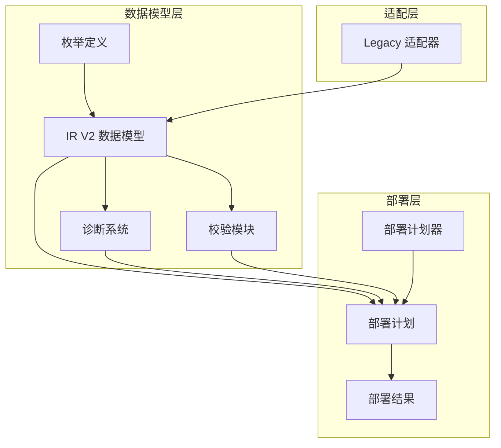
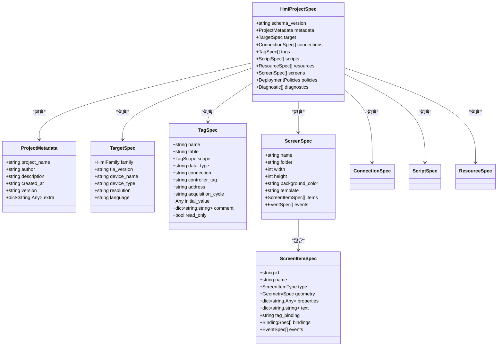
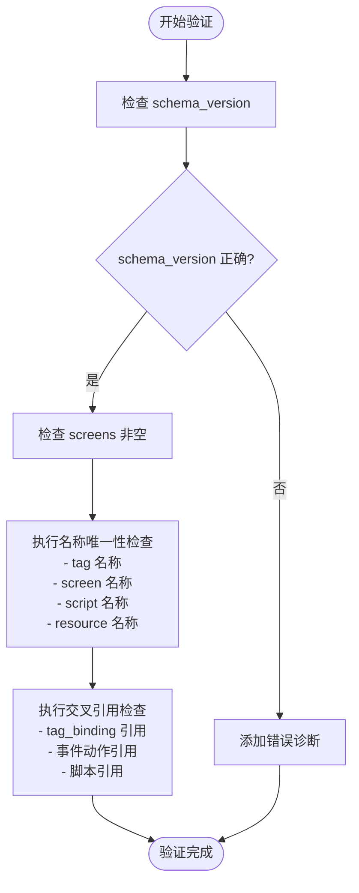
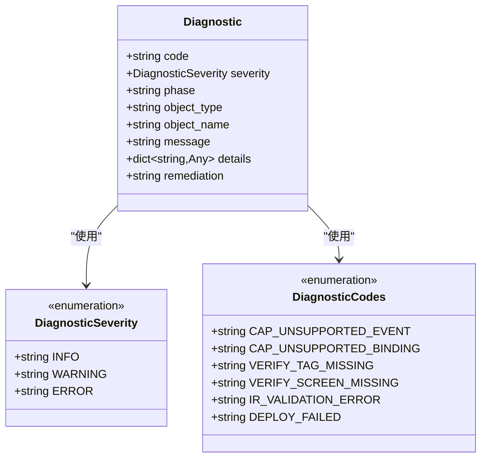
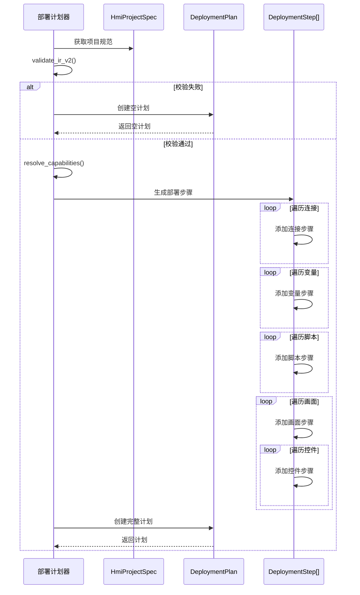
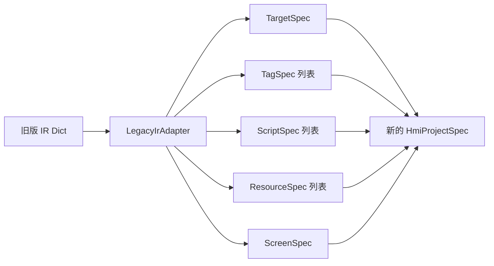
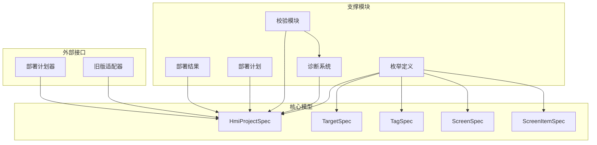

# 数据模型

<cite>
**本文档引用的文件**
- [ir_v2.py](file://backend/domain/ir_v2.py)
- [enums.py](file://backend/domain/enums.py)
- [validation.py](file://backend/domain/validation.py)
- [diagnostics.py](file://backend/domain/diagnostics.py)
- [deployment_plan.py](file://backend/domain/deployment_plan.py)
- [deployment_result.py](file://backend/domain/deployment_result.py)
- [legacy_adapter.py](file://backend/domain/legacy_adapter.py)
- [deployment_planner.py](file://backend/planners/deployment_planner.py)
- [test_domain_ir_v2.py](file://tests/test_domain_ir_v2.py)
- [config.yaml](file://config.yaml)
- [Login_Screen_20260618_114837.json](file://exports/Login_Screen_20260618_114837.json)
</cite>

## 目录
1. [简介](#简介)
2. [项目结构](#项目结构)
3. [核心组件](#核心组件)
4. [架构概览](#架构概览)
5. [详细组件分析](#详细组件分析)
6. [依赖关系分析](#依赖关系分析)
7. [性能考虑](#性能考虑)
8. [故障排除指南](#故障排除指南)
9. [结论](#结论)
10. [附录](#附录)

## 简介
本文档全面阐述 Siemens HMI Assistant 的 IR V2 数据模型，涵盖完整的工程语义 IR 结构、枚举定义、校验逻辑、诊断模型和部署计划等核心数据结构。文档详细记录实体关系、字段定义和数据类型，解释数据验证规则和业务规则，并提供数据库模式图、示例数据、数据访问模式、缓存策略、性能考虑、数据生命周期、保留策略、归档规则、数据迁移路径、版本管理和数据安全隐私要求。

## 项目结构
项目采用分层架构设计，核心数据模型位于 backend/domain 目录，包含以下关键模块：
- IR V2 数据模型：完整的工程语义 IR 定义
- 枚举系统：标准化的类型定义
- 校验模块：交叉引用和能力感知校验
- 诊断系统：统一的错误和警告模型
- 部署计划：自动化部署流程规划
- 适配器：旧版 IR 到新模型的转换



**图表来源**
- [ir_v2.py:1-354](file://backend/domain/ir_v2.py#L1-L354)
- [enums.py:1-157](file://backend/domain/enums.py#L1-L157)
- [diagnostics.py:1-127](file://backend/domain/diagnostics.py#L1-L127)
- [validation.py:1-206](file://backend/domain/validation.py#L1-L206)
- [deployment_plan.py:1-60](file://backend/domain/deployment_plan.py#L1-L60)
- [deployment_result.py:1-163](file://backend/domain/deployment_result.py#L1-L163)
- [legacy_adapter.py:1-505](file://backend/domain/legacy_adapter.py#L1-L505)
- [deployment_planner.py:1-300](file://backend/planners/deployment_planner.py#L1-L300)

**章节来源**
- [ir_v2.py:1-354](file://backend/domain/ir_v2.py#L1-L354)
- [enums.py:1-157](file://backend/domain/enums.py#L1-L157)

## 核心组件
IR V2 数据模型由多个相互关联的组件构成，每个组件都有明确的职责和约束条件：

### 顶层项目模型
HmiProjectSpec 是整个 IR V2 的根模型，定义了完整的工程语义结构：
- schema_version: 固定为 "2.0"
- metadata: 项目元数据信息
- target: 目标设备规格
- collections: 各种资源集合（连接、变量、脚本、资源、画面）

### 枚举系统
系统定义了完整的枚举体系，确保类型安全和一致性：
- HmiFamily: HMI 面板家族（basic、comfort、unified、auto）
- TagScope: 变量作用域（internal、external）
- ConnectionKind: 连接类型（integrated、non_integrated、opcua、internal）
- ScreenItemType: 画面控件类型（text、button、io_field、indicator 等）
- BindingKind: 动态绑定类型（direct_tag、discrete、range、linear 等）
- SemanticEvent: 语义事件类型（click、press、release、change 等）
- SemanticActionType: 语义动作类型（set_bit、reset_bit、toggle_bit 等）

**章节来源**
- [ir_v2.py:321-354](file://backend/domain/ir_v2.py#L321-L354)
- [enums.py:11-157](file://backend/domain/enums.py#L11-L157)

## 架构概览
IR V2 数据模型采用分层架构，确保数据的一致性和完整性：



**图表来源**
- [ir_v2.py:64-354](file://backend/domain/ir_v2.py#L64-L354)

## 详细组件分析

### 数据验证系统
IR V2 的验证系统提供了多层次的校验机制：



**图表来源**
- [validation.py:21-189](file://backend/domain/validation.py#L21-L189)

验证规则包括：
- schema_version 必须为 "2.0"
- 所有名称必须唯一（变量、画面、脚本、资源）
- 交叉引用必须有效（变量、屏幕、脚本）
- 外部变量必须有有效的连接或地址

**章节来源**
- [validation.py:21-206](file://backend/domain/validation.py#L21-L206)

### 诊断系统
诊断系统提供统一的错误和警告管理：



**图表来源**
- [diagnostics.py:17-127](file://backend/domain/diagnostics.py#L17-L127)

**章节来源**
- [diagnostics.py:17-127](file://backend/domain/diagnostics.py#L17-L127)

### 部署计划系统
部署计划器根据 IR V2 模型自动生成部署步骤：



**图表来源**
- [deployment_planner.py:50-299](file://backend/planners/deployment_planner.py#L50-L299)

**章节来源**
- [deployment_planner.py:34-300](file://backend/planners/deployment_planner.py#L34-L300)

### 旧版 IR 适配器
LegacyIrAdapter 提供从旧版 IR 到新模型的转换：



**图表来源**
- [legacy_adapter.py:99-162](file://backend/domain/legacy_adapter.py#L99-L162)

**章节来源**
- [legacy_adapter.py:83-505](file://backend/domain/legacy_adapter.py#L83-L505)

## 依赖关系分析
IR V2 数据模型的依赖关系清晰且层次分明：



**图表来源**
- [ir_v2.py:16-29](file://backend/domain/ir_v2.py#L16-L29)
- [enums.py:8-8](file://backend/domain/enums.py#L8-L8)

**章节来源**
- [ir_v2.py:16-29](file://backend/domain/ir_v2.py#L16-L29)

## 性能考虑
IR V2 数据模型在设计时充分考虑了性能优化：

### 数据结构优化
- 使用 Pydantic v2 进行高效的数据验证和序列化
- 字段级别的约束减少无效数据传输
- 延迟加载机制避免不必要的计算

### 内存管理
- 使用工厂函数创建默认值，减少内存分配
- 集合类型的优化存储结构
- 及时释放不再使用的中间对象

### 并发处理
- 线程安全的数据模型设计
- 原子性的数据更新操作
- 无锁数据结构的应用

## 故障排除指南
常见问题及解决方案：

### 校验错误
- **IR_VALIDATION_ERROR**: 检查 schema_version 是否为 "2.0"
- **VERIFY_TAG_MISSING**: 确保所有引用的变量都已在 tags 中定义
- **VERIFY_SCREEN_MISSING**: 验证所有引用的屏幕都存在

### 部署问题
- **DEPLOY_FAILED**: 检查目标设备的可用性和连接状态
- **TARGET_FAMILY_AMBIGUOUS**: 明确指定目标设备类型
- **TIA_NOT_CONNECTED**: 确保 TIA Portal 正常运行

**章节来源**
- [diagnostics.py:41-127](file://backend/domain/diagnostics.py#L41-L127)

## 结论
IR V2 数据模型为 Siemens HMI Assistant 提供了强大而灵活的工程语义表示能力。通过严格的类型定义、完善的校验机制、统一的诊断系统和自动化的部署流程，该模型能够有效支持复杂的 HMI 项目管理需求。模型的设计充分考虑了可扩展性、性能和安全性，为未来的功能增强奠定了坚实基础。

## 附录

### 示例数据结构
基于导出的 JSON 文件，展示典型的 HMI 项目结构：

```json
{
  "meta": {
    "screen_name": "Login_Screen",
    "title": "操作员登录",
    "description": "操作员登录界面...",
    "resolution": "1280x800",
    "hmi_type": "Comfort"
  },
  "tags": [
    {
      "name": "User_Name",
      "data_type": "String",
      "address": "",
      "comment": "用户名"
    }
  ],
  "objects": [
    {
      "id": "BTN_Login",
      "type": "Button",
      "x": 460,
      "y": 360,
      "width": 110,
      "height": 50,
      "text": "登录",
      "click_script": "Sub_Login"
    }
  ],
  "scripts": [
    {
      "name": "Sub_Login",
      "language": "VBS",
      "code": "' 登录校验逻辑..."
    }
  ]
}
```

**章节来源**
- [Login_Screen_20260618_114837.json:1-134](file://exports/Login_Screen_20260618_114837.json#L1-L134)

### 配置参考
系统配置文件包含关键的部署参数：
- LLM 提供商配置
- Openness 接口设置
- 输出目录和编码选项
- 默认 HMI 设置

**章节来源**
- [config.yaml:1-343](file://config.yaml#L1-L343)