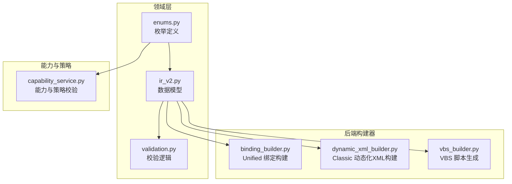
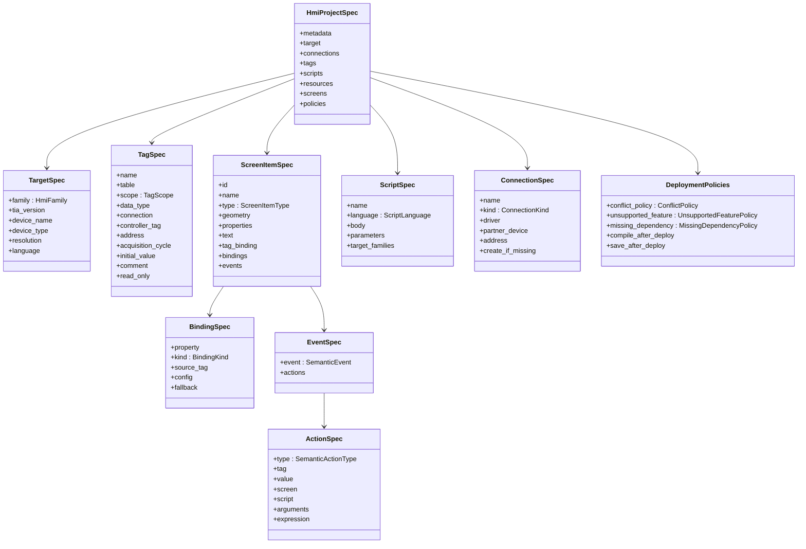
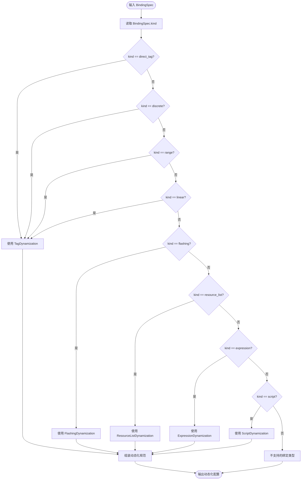
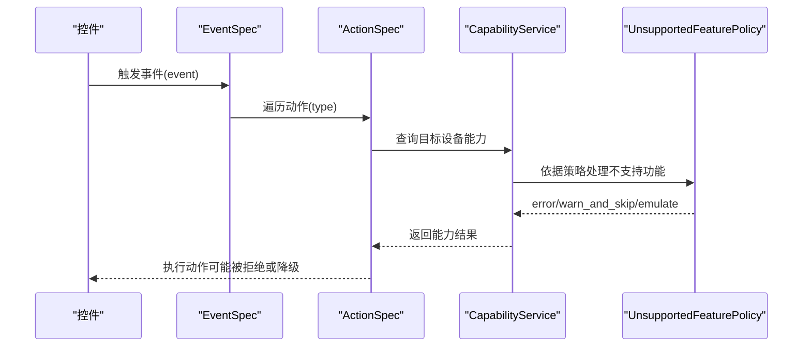
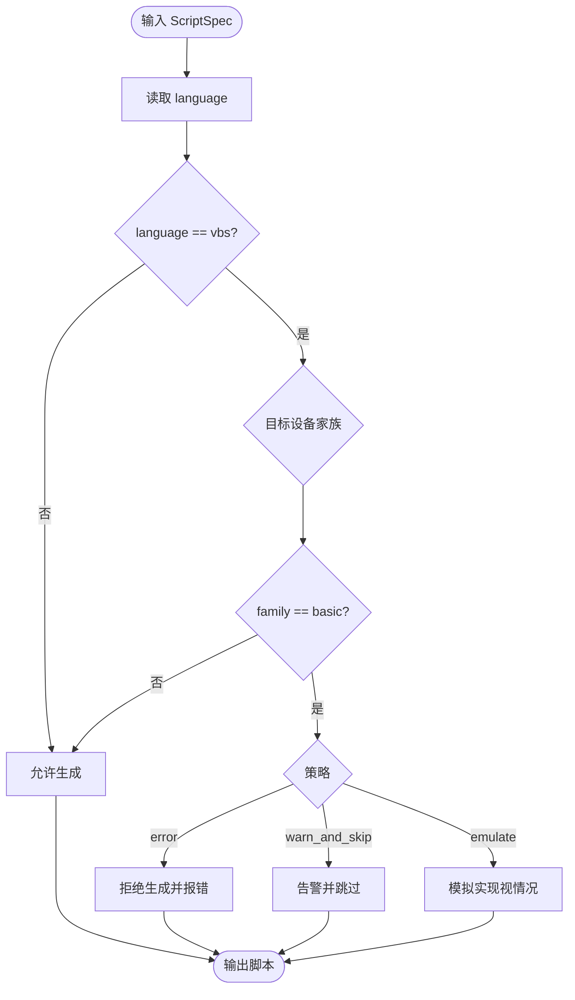
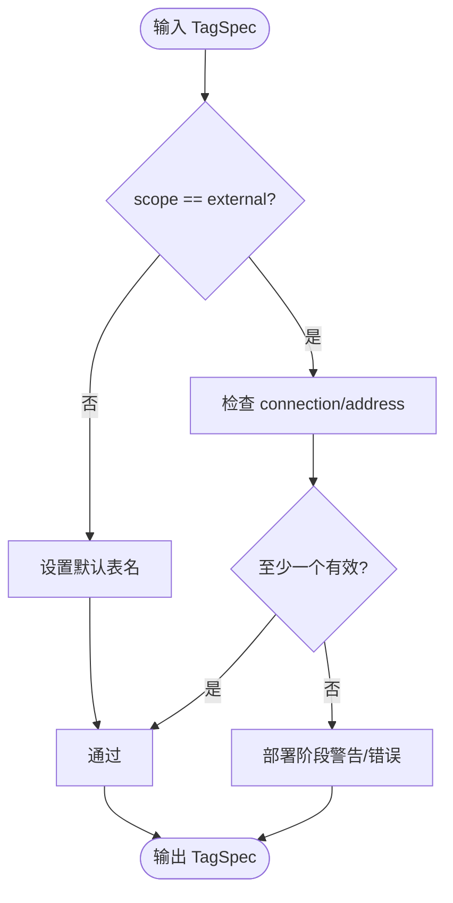
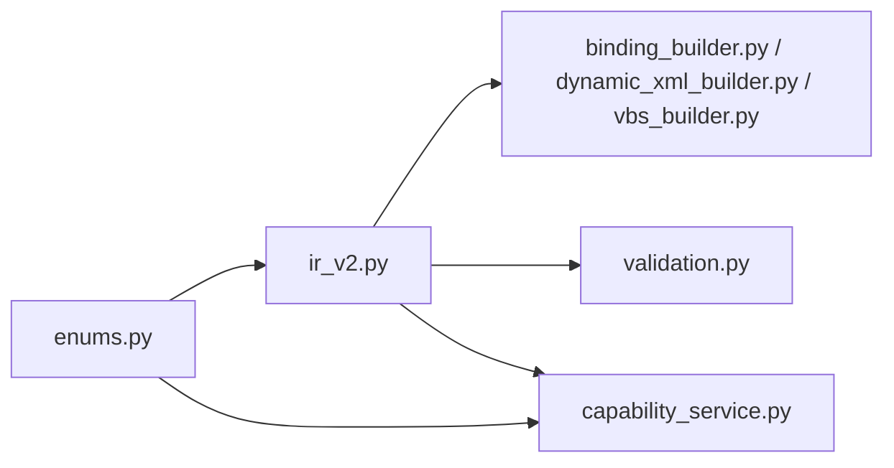

# 枚举定义

<cite>
**本文档引用的文件**
- [enums.py](file://backend/domain/enums.py)
- [ir_v2.py](file://backend/domain/ir_v2.py)
- [validation.py](file://backend/domain/validation.py)
- [binding_builder.py](file://backend/backends/unified/binding_builder.py)
- [dynamic_xml_builder.py](file://backend/backends/classic/dynamic_xml_builder.py)
- [vbs_builder.py](file://backend/backends/classic/vbs_builder.py)
- [capability_service.py](file://backend/capabilities/capability_service.py)
- [test_domain_ir_v2.py](file://tests/test_domain_ir_v2.py)
</cite>

## 目录
1. [简介](#简介)
2. [项目结构](#项目结构)
3. [核心组件](#核心组件)
4. [架构总览](#架构总览)
5. [详细组件分析](#详细组件分析)
6. [依赖关系分析](#依赖关系分析)
7. [性能考量](#性能考量)
8. [故障排查指南](#故障排查指南)
9. [结论](#结论)

## 简介
本文件系统性梳理 HMI IR V2 的全部枚举类型，覆盖 HMI 家族、画面控件类型、变量作用域、绑定类型、连接类型、脚本语言、语义事件、语义动作类型、冲突策略、缺失依赖策略、不支持功能策略等。文档从“定义—用途—约束—转换—验证”的维度展开，帮助读者理解各枚举在数据模型中的应用方式、使用场景、验证逻辑以及转换映射规则。

## 项目结构
- 枚举集中定义于领域层，供数据模型与后端构建器共同使用。
- 数据模型在 IR V2 中直接引用枚举作为字段类型，确保跨模块一致性。
- 后端构建器根据枚举值进行动态化生成或 XML 输出。
- 校验模块基于枚举进行交叉引用与能力校验。

图表来源
- [enums.py:11-157](file://backend/domain/enums.py#L11-L157)
- [ir_v2.py:16-28](file://backend/domain/ir_v2.py#L16-L28)
- [binding_builder.py:14-24](file://backend/backends/unified/binding_builder.py#L14-L24)
- [dynamic_xml_builder.py:50-71](file://backend/backends/classic/dynamic_xml_builder.py#L50-L71)
- [vbs_builder.py:19-27](file://backend/backends/classic/vbs_builder.py#L19-L27)
- [capability_service.py:127-145](file://backend/capabilities/capability_service.py#L127-L145)

章节来源
- [enums.py:11-157](file://backend/domain/enums.py#L11-L157)
- [ir_v2.py:16-28](file://backend/domain/ir_v2.py#L16-L28)

## 核心组件
本节逐一枚举并解释关键枚举及其在系统中的角色与约束。

- HmiFamily（HMI 家族）
  - 定义：basic、comfort、unified、auto
  - 用途：指定目标 HMI 家族，影响能力判定与生成策略
  - 使用场景：TargetSpec.family 字段；脚本适用性限制（Basic 禁止 VBS）
  - 示例：参考测试中对 TargetSpec 的构造与断言
  - 章节来源
    - [ir_v2.py:80-101](file://backend/domain/ir_v2.py#L80-L101)
    - [test_domain_ir_v2.py:124-142](file://tests/test_domain_ir_v2.py#L124-L142)

- ScreenItemType（画面控件类型）
  - 定义：text、button、io_field、symbolic_io_field、indicator、rectangle、ellipse、switch、slider、graphic_view、screen_window
  - 用途：ScreenItemSpec.type 字段，标识控件类型
  - 使用场景：控件建模、事件绑定、动态化生成
  - 示例：测试中对 BUTTON、INDICATOR、TEXT 的断言
  - 章节来源
    - [ir_v2.py:264-288](file://backend/domain/ir_v2.py#L264-L288)
    - [test_domain_ir_v2.py:170-217](file://tests/test_domain_ir_v2.py#L170-L217)

- TagScope（变量作用域）
  - 定义：internal、external
  - 用途：TagSpec.scope 字段，区分内部/外部变量
  - 使用场景：外部变量需满足连接或地址约束；内部变量默认表名
  - 示例：测试中对 INTERNAL/EXTERNAL 的断言与外部变量引用
  - 章节来源
    - [ir_v2.py:130-159](file://backend/domain/ir_v2.py#L130-L159)
    - [test_domain_ir_v2.py:144-161](file://tests/test_domain_ir_v2.py#L144-L161)

- BindingKind（绑定类型）
  - 定义：direct_tag、discrete、range、linear、flashing、resource_list、expression、script
  - 用途：BindingSpec.kind 字段，决定动态化类型与生成策略
  - 使用场景：控件属性动态化（颜色、可见性、闪烁等）
  - 示例：测试中对 DISCRETE、FLASHING、DIRECT_TAG 的断言
  - 章节来源
    - [ir_v2.py:181-193](file://backend/domain/ir_v2.py#L181-L193)
    - [test_domain_ir_v2.py:238-266](file://tests/test_domain_ir_v2.py#L238-L266)

- ConnectionKind（连接类型）
  - 定义：integrated、non_integrated、opcua、internal
  - 用途：ConnectionSpec.kind 字段，标识连接来源与协议
  - 使用场景：Classic 后端导入连接；Unified 后端能力匹配
  - 章节来源
    - [ir_v2.py:108-123](file://backend/domain/ir_v2.py#L108-L123)

- ScriptLanguage（脚本语言）
  - 定义：semantic、vbs、javascript
  - 用途：ScriptSpec.language 字段，限定脚本生成与安全策略
  - 使用场景：Basic 面板禁用 VBS；VBS 安全扫描
  - 示例：测试中对 SEMANTIC 的断言；能力服务中对 VBS 的策略处理
  - 章节来源
    - [ir_v2.py:226-240](file://backend/domain/ir_v2.py#L226-L240)
    - [test_domain_ir_v2.py:268-278](file://tests/test_domain_ir_v2.py#L268-L278)
    - [capability_service.py:127-145](file://backend/capabilities/capability_service.py#L127-L145)
    - [vbs_builder.py:19-27](file://backend/backends/classic/vbs_builder.py#L19-L27)

- SemanticEvent（语义事件）
  - 定义：click、press、release、change、loaded、unloaded、activate、deactivate
  - 用途：EventSpec.event 字段，统一事件语义
  - 使用场景：控件事件建模与动作绑定
  - 示例：测试中对事件动作的断言
  - 章节来源
    - [ir_v2.py:212-219](file://backend/domain/ir_v2.py#L212-L219)
    - [test_domain_ir_v2.py:219-236](file://tests/test_domain_ir_v2.py#L219-L236)

- SemanticActionType（语义动作类型）
  - 定义：set_bit、reset_bit、toggle_bit、set_value、increment、decrement、activate_screen、open_popup、close_popup、acknowledge_alarm、call_script、write_expression
  - 用途：ActionSpec.type 字段，统一动作语义
  - 使用场景：事件触发后执行的动作；Basic 面板对 write_expression 的策略处理
  - 示例：测试中对 ACTIVATE_SCREEN、CALL_SCRIPT 的断言
  - 章节来源
    - [ir_v2.py:200-210](file://backend/domain/ir_v2.py#L200-L210)
    - [test_domain_ir_v2.py:219-236](file://tests/test_domain_ir_v2.py#L219-L236)
    - [capability_service.py:169-184](file://backend/capabilities/capability_service.py#L169-L184)

- ConflictPolicy（冲突策略）
  - 定义：override、rename、error
  - 用途：DeploymentPolicies.conflict_policy，处理命名冲突
  - 使用场景：部署阶段对象重名处理
  - 示例：测试中对默认策略的断言
  - 章节来源
    - [enums.py:116-121](file://backend/domain/enums.py#L116-L121)
    - [ir_v2.py:37-57](file://backend/domain/ir_v2.py#L37-L57)
    - [test_domain_ir_v2.py:296-312](file://tests/test_domain_ir_v2.py#L296-L312)

- MissingDependencyPolicy（缺失依赖策略）
  - 定义：error、warn_and_skip
  - 用途：DeploymentPolicies.missing_dependency，处理缺失依赖
  - 使用场景：部署阶段对外部依赖缺失的处理
  - 章节来源
    - [enums.py:130-134](file://backend/domain/enums.py#L130-L134)
    - [ir_v2.py:37-57](file://backend/domain/ir_v2.py#L37-L57)

- UnsupportedFeaturePolicy（不支持功能策略）
  - 定义：error、warn_and_skip、emulate
  - 用途：DeploymentPolicies.unsupported_feature，处理目标设备不支持的功能
  - 使用场景：Basic 面板不支持 VBS/某些动作时的策略选择
  - 示例：能力服务中对 Basic 面板的策略处理
  - 章节来源
    - [enums.py:123-128](file://backend/domain/enums.py#L123-L128)
    - [ir_v2.py:37-57](file://backend/domain/ir_v2.py#L37-L57)
    - [capability_service.py:127-145](file://backend/capabilities/capability_service.py#L127-L145)

## 架构总览
下图展示枚举在数据模型与后端构建器之间的交互关系，以及策略与能力服务的参与。

图表来源
- [ir_v2.py:80-354](file://backend/domain/ir_v2.py#L80-L354)

## 详细组件分析

### 绑定类型到动态化类型的映射
- 目标：将 BindingKind 映射到具体动态化类型，以便生成 Unified/Classic 的动态化配置或 XML。
- 关键映射规则
  - direct_tag/discrete/range/linear → TagDynamization
  - flashing → FlashingDynamization
  - resource_list → ResourceListDynamization
  - expression → ExpressionDynamization
  - script → ScriptDynamization
- 生成流程
  - Unified：通过 UnifiedBindingBuilder.create 将 BindingSpec 转换为动态化规范字典
  - Classic：通过 dynamic_xml_builder 根据 BindingKind 生成对应的 XML 片段

图表来源
- [binding_builder.py:14-42](file://backend/backends/unified/binding_builder.py#L14-L42)
- [dynamic_xml_builder.py:50-71](file://backend/backends/classic/dynamic_xml_builder.py#L50-L71)

章节来源
- [binding_builder.py:14-42](file://backend/backends/unified/binding_builder.py#L14-L42)
- [dynamic_xml_builder.py:50-71](file://backend/backends/classic/dynamic_xml_builder.py#L50-L71)

### 事件与动作的语义映射
- 事件（SemanticEvent）与动作（SemanticActionType）构成统一的语义事件-动作体系，避免直接依赖具体平台脚本语言。
- 事件类型涵盖点击、按下、释放、值变化、画面加载/卸载、激活/停用等。
- 动作类型涵盖位操作、数值操作、画面切换、弹窗管理、报警确认、脚本调用、表达式写入等。
- 能力服务会根据目标设备家族（HmiFamily）对不支持的动作（如 write_expression）进行策略处理。

图表来源
- [ir_v2.py:200-219](file://backend/domain/ir_v2.py#L200-L219)
- [capability_service.py:169-184](file://backend/capabilities/capability_service.py#L169-L184)

章节来源
- [ir_v2.py:200-219](file://backend/domain/ir_v2.py#L200-L219)
- [capability_service.py:169-184](file://backend/capabilities/capability_service.py#L169-L184)

### 脚本语言与安全策略
- ScriptLanguage 支持 semantic、vbs、javascript。
- Basic 面板禁止 VBS，能力服务会根据策略（ERROR/WARN_AND_SKIP/EMULATE）给出诊断。
- VBS 生成器提供白名单 API 与禁止模式检测，确保安全性。

图表来源
- [ir_v2.py:226-240](file://backend/domain/ir_v2.py#L226-L240)
- [capability_service.py:127-145](file://backend/capabilities/capability_service.py#L127-L145)
- [vbs_builder.py:19-27](file://backend/backends/classic/vbs_builder.py#L19-L27)

章节来源
- [ir_v2.py:226-240](file://backend/domain/ir_v2.py#L226-L240)
- [capability_service.py:127-145](file://backend/capabilities/capability_service.py#L127-L145)
- [vbs_builder.py:19-27](file://backend/backends/classic/vbs_builder.py#L19-L27)

### 变量作用域与外部变量约束
- TagScope 决定变量归属：internal 默认表名，external 需要连接或地址。
- 校验模块对重复名称、未声明引用等进行诊断；外部变量在模型层面允许宽松接受，但部署阶段会严格校验。

图表来源
- [ir_v2.py:130-159](file://backend/domain/ir_v2.py#L130-L159)
- [validation.py:117-148](file://backend/domain/validation.py#L117-L148)

章节来源
- [ir_v2.py:130-159](file://backend/domain/ir_v2.py#L130-L159)
- [validation.py:117-148](file://backend/domain/validation.py#L117-L148)

## 依赖关系分析
- 枚举在数据模型中以强类型字段出现，确保跨模块一致性。
- 后端构建器依赖枚举进行动态化生成与 XML 输出。
- 能力服务与策略共同决定不支持功能的处理方式。
- 校验模块基于枚举执行交叉引用与唯一性检查。

图表来源
- [enums.py:11-157](file://backend/domain/enums.py#L11-L157)
- [ir_v2.py:16-28](file://backend/domain/ir_v2.py#L16-L28)
- [binding_builder.py:14-24](file://backend/backends/unified/binding_builder.py#L14-L24)
- [dynamic_xml_builder.py:50-71](file://backend/backends/classic/dynamic_xml_builder.py#L50-L71)
- [vbs_builder.py:19-27](file://backend/backends/classic/vbs_builder.py#L19-L27)
- [validation.py:21-189](file://backend/domain/validation.py#L21-L189)
- [capability_service.py:127-145](file://backend/capabilities/capability_service.py#L127-L145)

章节来源
- [enums.py:11-157](file://backend/domain/enums.py#L11-L157)
- [ir_v2.py:16-28](file://backend/domain/ir_v2.py#L16-L28)
- [validation.py:21-189](file://backend/domain/validation.py#L21-L189)

## 性能考量
- 枚举比较为常量时间 O(1)，对整体性能影响可忽略。
- 绑定类型映射采用字典查找，O(1) 时间复杂度。
- 校验阶段对集合（set）进行去重与查找，平均 O(1)，最坏 O(n)（极端情况下）。
- 建议在大规模项目中：
  - 预先去重名称，减少校验开销
  - 合理设置策略（如冲突策略），避免大量重命名
  - 仅在必要时启用编译与保存，降低部署阶段成本

## 故障排查指南
- 常见问题与定位
  - 名称冲突：检查 DeploymentPolicies.conflict_policy 设置，确认是否需要重命名或覆盖
  - 外部变量缺失：确认 TagSpec.scope 与 connection/address 是否满足约束
  - 事件/动作引用缺失：使用校验模块诊断 VERIFY_TAG_MISSING/VERIFY_SCREEN_MISSING/VERIFY_SCRIPT_MISSING
  - 不支持功能：根据 UnsupportedFeaturePolicy 与目标设备家族（HmiFamily）调整策略
  - VBS 脚本被拒：Basic 面板禁止 VBS，改用语义动作或 FunctionList
- 排查步骤建议
  - 使用 validate_ir_v2 获取诊断列表
  - 根据诊断码定位具体对象与阶段
  - 结合测试用例验证预期行为

章节来源
- [validation.py:21-189](file://backend/domain/validation.py#L21-L189)
- [capability_service.py:127-145](file://backend/capabilities/capability_service.py#L127-L145)
- [test_domain_ir_v2.py:144-161](file://tests/test_domain_ir_v2.py#L144-L161)

## 结论
本文档系统梳理了 HMI IR V2 的全部枚举类型，明确了其在数据模型中的职责、使用场景、验证逻辑与转换映射规则。通过强类型枚举与严格的校验策略，系统实现了跨平台、可移植、可验证的 HMI 工程描述与生成。建议在实际项目中：
- 明确各枚举的取值范围与约束
- 合理配置部署策略，平衡安全性与灵活性
- 借助校验模块与测试用例保障质量
- 在构建器层面对照映射规则，确保生成正确性