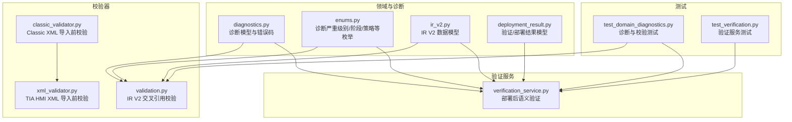
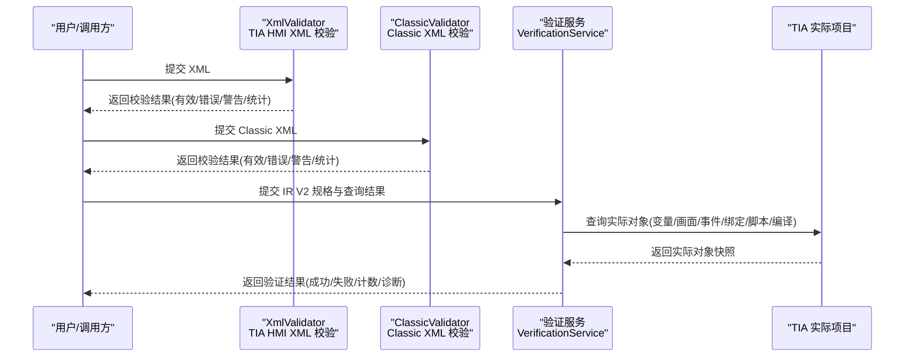
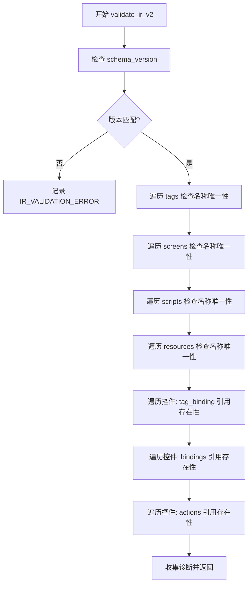
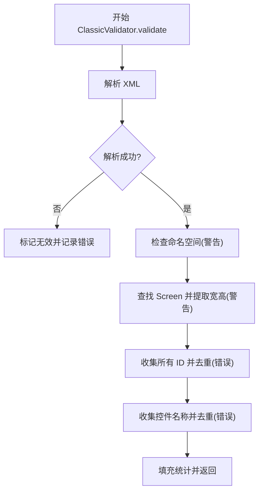
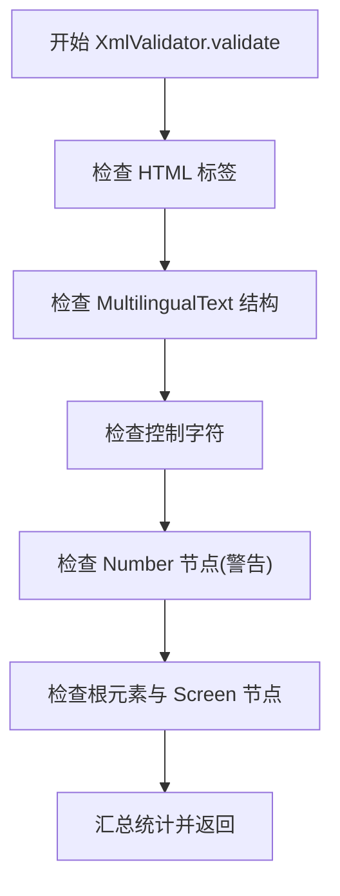
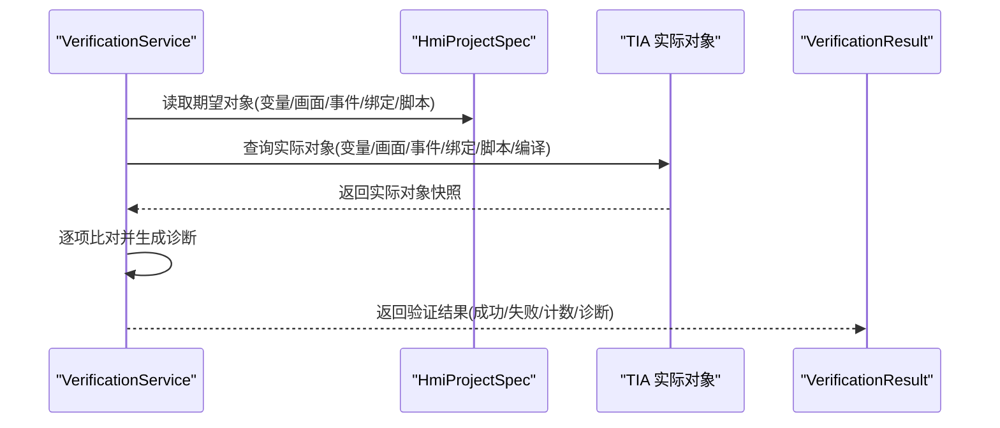
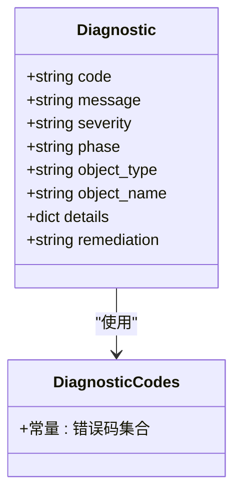
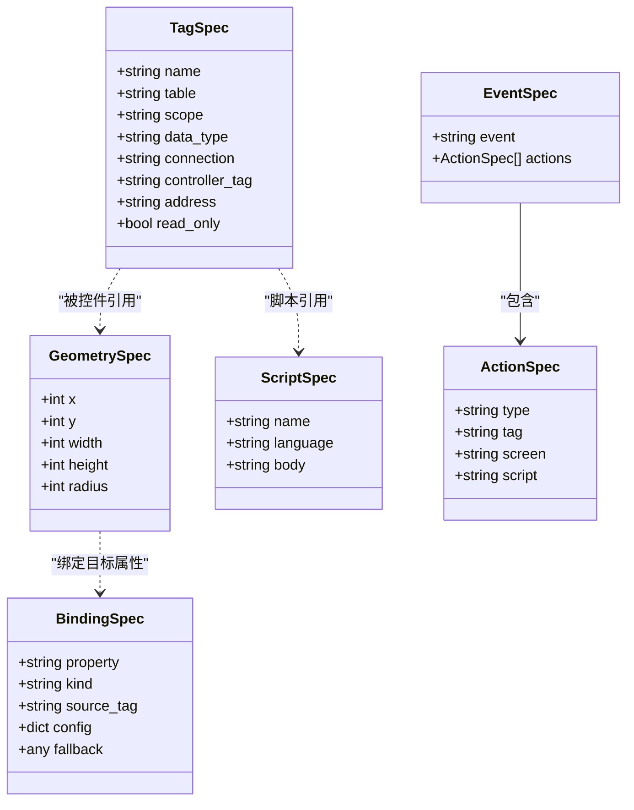
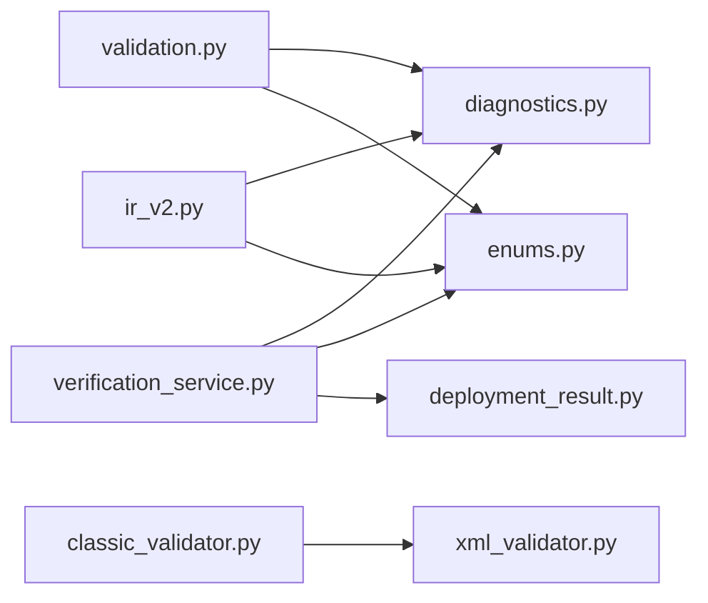

# 校验逻辑

<cite>
**本文档引用的文件**
- [backend/domain/validation.py](file://backend/domain/validation.py)
- [backend/backends/classic/classic_validator.py](file://backend/backends/classic/classic_validator.py)
- [backend/xml_validator.py](file://backend/xml_validator.py)
- [backend/services/verification_service.py](file://backend/services/verification_service.py)
- [backend/domain/diagnostics.py](file://backend/domain/diagnostics.py)
- [backend/domain/enums.py](file://backend/domain/enums.py)
- [backend/domain/ir_v2.py](file://backend/domain/ir_v2.py)
- [backend/domain/deployment_result.py](file://backend/domain/deployment_result.py)
- [tests/test_domain_diagnostics.py](file://tests/test_domain_diagnostics.py)
- [tests/test_verification.py](file://tests/test_verification.py)
</cite>

## 目录
1. [引言](#引言)
2. [项目结构](#项目结构)
3. [核心组件](#核心组件)
4. [架构总览](#架构总览)
5. [详细组件分析](#详细组件分析)
6. [依赖分析](#依赖分析)
7. [性能考量](#性能考量)
8. [故障排查指南](#故障排查指南)
9. [结论](#结论)
10. [附录](#附录)

## 引言
本文件系统性梳理本项目的校验逻辑，覆盖以下方面：
- 字段级验证：单对象属性约束与默认值校验
- 模型级验证：跨字段一致性与业务规则校验
- 交叉引用验证：对象间引用完整性与存在性校验
- XML 导入前校验：结构合法性、富文本规范、控制字符与编号冲突
- 统一诊断模型与错误码体系：标准化错误描述、严重级别与修复建议
- 部署后语义验证：与真实 TIA 项目对象比对，确保部署一致性
- 性能与优化策略：扫描复杂度、缓存与短路策略
- 常见问题诊断与解决方案：定位与修复步骤

## 项目结构
围绕校验逻辑的关键模块分布如下：
- 领域模型与诊断：定义数据模型、诊断实体与枚举
- 校验器：
  - IR V2 交叉引用与完整性校验
  - Classic XML 导入前校验
  - TIA HMI XML 导入前校验
- 验证服务：部署后的语义级比对与一致性验证
- 测试：覆盖字段/模型/交叉引用/验证流程的单元测试

**图表来源**
- [backend/domain/validation.py:21-189](file://backend/domain/validation.py#L21-L189)
- [backend/backends/classic/classic_validator.py:42-122](file://backend/backends/classic/classic_validator.py#L42-L122)
- [backend/xml_validator.py:70-78](file://backend/xml_validator.py#L70-L78)
- [backend/services/verification_service.py:24-139](file://backend/services/verification_service.py#L24-L139)
- [backend/domain/diagnostics.py:17-35](file://backend/domain/diagnostics.py#L17-L35)
- [backend/domain/enums.py:95-114](file://backend/domain/enums.py#L95-L114)
- [backend/domain/ir_v2.py:130-158](file://backend/domain/ir_v2.py#L130-L158)
- [backend/domain/deployment_result.py:38-59](file://backend/domain/deployment_result.py#L38-L59)
- [tests/test_domain_diagnostics.py:94-334](file://tests/test_domain_diagnostics.py#L94-L334)
- [tests/test_verification.py:12-121](file://tests/test_verification.py#L12-L121)

**章节来源**
- [backend/domain/validation.py:21-206](file://backend/domain/validation.py#L21-L206)
- [backend/backends/classic/classic_validator.py:42-122](file://backend/backends/classic/classic_validator.py#L42-L122)
- [backend/xml_validator.py:70-330](file://backend/xml_validator.py#L70-L330)
- [backend/services/verification_service.py:18-468](file://backend/services/verification_service.py#L18-L468)
- [backend/domain/diagnostics.py:17-127](file://backend/domain/diagnostics.py#L17-L127)
- [backend/domain/enums.py:95-157](file://backend/domain/enums.py#L95-L157)
- [backend/domain/ir_v2.py:130-158](file://backend/domain/ir_v2.py#L130-L158)
- [backend/domain/deployment_result.py:38-163](file://backend/domain/deployment_result.py#L38-L163)
- [tests/test_domain_diagnostics.py:94-334](file://tests/test_domain_diagnostics.py#L94-L334)
- [tests/test_verification.py:12-121](file://tests/test_verification.py#L12-L121)

## 核心组件
- IR V2 交叉引用与完整性校验：对 schema 版本、对象唯一性、引用存在性进行检查，并输出结构化诊断
- Classic XML 导入前校验：XML 可解析性、命名空间、Screen 元素、ID/控件名唯一性等
- TIA HMI XML 导入前校验：MultilingualText 结构、HTML 标签限制、控制字符、Number 节点、根元素等
- 部署后语义验证：与真实 TIA 对象比对，验证变量、画面、事件、绑定、脚本与编译结果
- 诊断模型与错误码：统一的错误描述、严重级别、阶段、对象类型/名称、修复建议
- 数据模型与策略：Tag/ScreenItem/Binding/Event/Action/Script 等模型及冲突/缺失依赖/不支持特性策略

**章节来源**
- [backend/domain/validation.py:21-206](file://backend/domain/validation.py#L21-L206)
- [backend/backends/classic/classic_validator.py:42-122](file://backend/backends/classic/classic_validator.py#L42-L122)
- [backend/xml_validator.py:70-330](file://backend/xml_validator.py#L70-L330)
- [backend/services/verification_service.py:24-139](file://backend/services/verification_service.py#L24-L139)
- [backend/domain/diagnostics.py:17-127](file://backend/domain/diagnostics.py#L17-L127)
- [backend/domain/enums.py:95-157](file://backend/domain/enums.py#L95-L157)
- [backend/domain/ir_v2.py:130-158](file://backend/domain/ir_v2.py#L130-L158)
- [backend/domain/deployment_result.py:38-163](file://backend/domain/deployment_result.py#L38-L163)

## 架构总览
校验与验证贯穿导入前后与部署后三个阶段：
- 导入前（XML 层）：确保 XML 结构与内容符合 TIA 规范，避免导入阶段报错
- IR V2 层：确保项目 IR 的完整性与交叉引用一致
- 部署后（语义层）：与真实 TIA 项目对象比对，确认部署结果

**图表来源**
- [backend/xml_validator.py:70-78](file://backend/xml_validator.py#L70-L78)
- [backend/backends/classic/classic_validator.py:42-122](file://backend/backends/classic/classic_validator.py#L42-L122)
- [backend/services/verification_service.py:24-139](file://backend/services/verification_service.py#L24-L139)

## 详细组件分析

### IR V2 交叉引用与完整性校验
- 校验范围
  - schema_version 固定为“2.0”
  - screens 非空（警告）
  - tag/screen/script/resource 名称唯一性（错误）
  - 控件 tag_binding/bindings/actions 引用的目标变量/画面/脚本存在性（警告）
- 错误码与严重级别
  - VERIFY_TAG_MISSING / VERIFY_SCREEN_MISSING / VERIFY_SCRIPT_MISSING 等
  - 严重级别：ERROR/WARNING
- 异常模式
  - validate_or_raise：当存在 ERROR 时抛出 IrV2ValidationError，否则将诊断写回对象

**图表来源**
- [backend/domain/validation.py:21-189](file://backend/domain/validation.py#L21-L189)

**章节来源**
- [backend/domain/validation.py:21-206](file://backend/domain/validation.py#L21-L206)
- [backend/domain/diagnostics.py:41-96](file://backend/domain/diagnostics.py#L41-L96)
- [backend/domain/enums.py:95-114](file://backend/domain/enums.py#L95-L114)

### Classic XML 导入前校验
- 校验要点
  - XML 可解析性
  - 命名空间匹配（警告）
  - 至少一个 Screen 元素
  - ID 唯一性（错误）
  - 控件名称唯一性（错误）
  - 统计：screen_count/id_count/item_count
- 输出结构
  - valid、errors、warnings、stats

**图表来源**
- [backend/backends/classic/classic_validator.py:42-122](file://backend/backends/classic/classic_validator.py#L42-L122)

**章节来源**
- [backend/backends/classic/classic_validator.py:42-122](file://backend/backends/classic/classic_validator.py#L42-L122)

### TIA HMI XML 导入前校验
- 校验要点
  - HTML 标签限制（除特定富文本标签外禁止）
  - MultilingualText 结构校验（V16/ObjectList 或通用结构；禁止 <ID> 子元素；Text.Language 属性与内容校验）
  - 控制字符过滤（非法控制字符 U+0000-U+001F）
  - Number 节点（建议删除，让 TIA 自动分配）
  - 根元素 Document 与 Screen 节点存在性
- 输出结构
  - valid、errors、warnings、stats（含 html_tags/tia_rich_tags/multilingual_text_nodes 等）

**图表来源**
- [backend/xml_validator.py:70-78](file://backend/xml_validator.py#L70-L78)
- [backend/xml_validator.py:98-260](file://backend/xml_validator.py#L98-L260)

**章节来源**
- [backend/xml_validator.py:70-330](file://backend/xml_validator.py#L70-L330)

### 部署后语义验证（VerificationService）
- 输入
  - HmiProjectSpec（期望规格）
  - object_query_result（来自 TIA 的实际对象快照）
  - 连接状态 connected
  - 反向导出 XML 列表与模板变量集合（可选）
  - 绑定映射（可选）
- 校验维度
  - 变量：名称、类型、作用域/连接一致性
  - 画面：存在性与控件存在性
  - 事件：事件类型与动作类型匹配
  - 绑定：属性、类型、源变量匹配
  - 脚本：语言与名称匹配
  - 编译：错误数必须为 0 才能判定部署成功
  - V3.2 增强：按钮事件变量一致性、动态化变量一致性、模板引用残留检查
- 输出
  - VerificationResult（success、各类 ObjectCountSummary、CompileResult）

**图表来源**
- [backend/services/verification_service.py:24-139](file://backend/services/verification_service.py#L24-L139)
- [backend/domain/deployment_result.py:38-59](file://backend/domain/deployment_result.py#L38-L59)

**章节来源**
- [backend/services/verification_service.py:24-468](file://backend/services/verification_service.py#L24-L468)
- [backend/domain/deployment_result.py:38-163](file://backend/domain/deployment_result.py#L38-L163)

### 诊断模型与错误码体系
- 诊断模型
  - code、severity、phase、object_type/object_name、message、details、remediation
- 错误码类别
  - 能力相关、依赖相关、Classic/XML/Unified/脚本、导入/编译、验证相关、通用、部署状态机、编译、模板引用泄漏、Tag 导入与引用、文本列表、运行时契约等
- 严重级别
  - INFO/WARNING/ERROR

**图表来源**
- [backend/domain/diagnostics.py:17-127](file://backend/domain/diagnostics.py#L17-L127)

**章节来源**
- [backend/domain/diagnostics.py:17-127](file://backend/domain/diagnostics.py#L17-L127)
- [backend/domain/enums.py:95-157](file://backend/domain/enums.py#L95-L157)

### 数据模型与策略（字段级/模型级验证）
- 字段级验证
  - TagSpec：scope=EXTERNAL 时的连接/地址约束（模型 validator 松散接受，实际在规划阶段严格校验）
  - GeometrySpec：坐标与尺寸的最小值约束
  - BindingSpec：属性、类型、源变量、配置与回退值
  - ActionSpec/EventSpec/ScriptSpec：枚举与组合约束
- 模型级验证
  - IR V2 交叉引用校验（validate_ir_v2）：名称唯一性、引用存在性
  - 验证服务：与实际对象比对（语义一致性）

**图表来源**
- [backend/domain/ir_v2.py:130-200](file://backend/domain/ir_v2.py#L130-L200)
- [backend/domain/ir_v2.py:200-250](file://backend/domain/ir_v2.py#L200-L250)
- [backend/domain/ir_v2.py:250-354](file://backend/domain/ir_v2.py#L250-L354)

**章节来源**
- [backend/domain/ir_v2.py:130-354](file://backend/domain/ir_v2.py#L130-L354)
- [backend/domain/enums.py:19-94](file://backend/domain/enums.py#L19-L94)

## 依赖分析
- 组件耦合
  - 验证服务依赖 IR V2 模型、诊断模型与枚举
  - IR V2 校验依赖诊断模型与枚举
  - XML 校验器相互独立，仅依赖基础工具函数
- 外部依赖
  - ElementTree 用于 XML 解析
  - 正则表达式用于结构与内容匹配
- 循环依赖
  - 未发现循环依赖

**图表来源**
- [backend/domain/validation.py:11-13](file://backend/domain/validation.py#L11-L13)
- [backend/services/verification_service.py:12-15](file://backend/services/verification_service.py#L12-L15)
- [backend/domain/ir_v2.py:14-29](file://backend/domain/ir_v2.py#L14-L29)
- [backend/backends/classic/classic_validator.py:7-8](file://backend/backends/classic/classic_validator.py#L7-L8)
- [backend/xml_validator.py:21-23](file://backend/xml_validator.py#L21-L23)

**章节来源**
- [backend/domain/validation.py:11-13](file://backend/domain/validation.py#L11-L13)
- [backend/services/verification_service.py:12-15](file://backend/services/verification_service.py#L12-L15)
- [backend/domain/ir_v2.py:14-29](file://backend/domain/ir_v2.py#L14-L29)
- [backend/backends/classic/classic_validator.py:7-8](file://backend/backends/classic/classic_validator.py#L7-L8)
- [backend/xml_validator.py:21-23](file://backend/xml_validator.py#L21-L23)

## 性能考量
- 时间复杂度
  - IR V2 校验：O(N) 遍历对象集合，哈希集合去重与查找近似 O(1)，整体 O(N)
  - Classic XML 校验：遍历所有元素与属性，近似 O(N)
  - TIA XML 校验：多处正则扫描与树遍历，整体近似 O(N)
  - 验证服务：嵌套遍历 screens/items/bindings/events/scripts，整体 O(N^2) 最坏情况
- 优化策略
  - 使用集合（set）进行唯一性检查与存在性判断
  - 早期短路：一旦出现 ERROR 即停止进一步深入（IR V2 校验返回诊断列表，调用方可据此决定是否继续）
  - 分阶段校验：先做结构与引用校验，再做语义比对
  - 缓存中间结果：如 tag_names/screen_names/script_names/resource_names
  - 限制输出数量：XML 校验对 HTML 标签匹配限制前若干条错误输出
- I/O 与解析
  - XML 解析为瓶颈，尽量复用解析结果或避免重复解析
  - 对大文件分块处理（如适用）或提前进行预检查

[本节为通用性能讨论，无需具体文件分析]

## 故障排查指南
- IR V2 校验失败
  - 现象：出现 VERIFY_TAG_MISSING/VERIFY_SCREEN_MISSING/VERIFY_SCRIPT_MISSING 或 IR_VALIDATION_ERROR
  - 排查：检查对应对象是否存在于项目中；确认名称唯一性；核对 schema_version
  - 参考测试用例：重复名称、缺失引用、空 screens 等场景
- Classic XML 校验失败
  - 现象：XML 解析失败、缺少 Screen、重复 ID/控件名
  - 排查：修正 XML 结构；确保 ID 与控件名唯一；检查命名空间
- TIA XML 校验失败
  - 现象：MultilingualText 结构错误、HTML 标签、非法控制字符、Number 节点
  - 排查：遵循 V16 ObjectList 结构或通用结构；移除非法 HTML；清理控制字符；删除 Number 节点
- 部署后验证失败
  - 现象：变量/画面/事件/绑定/脚本不匹配，编译错误数大于 0
  - 排查：确认 TIA 已连接；检查绑定映射与模板引用残留；核对按钮事件与动态化变量一致性

**章节来源**
- [tests/test_domain_diagnostics.py:94-334](file://tests/test_domain_diagnostics.py#L94-L334)
- [tests/test_verification.py:12-121](file://tests/test_verification.py#L12-L121)
- [backend/domain/validation.py:21-206](file://backend/domain/validation.py#L21-L206)
- [backend/backends/classic/classic_validator.py:42-122](file://backend/backends/classic/classic_validator.py#L42-L122)
- [backend/xml_validator.py:70-330](file://backend/xml_validator.py#L70-L330)
- [backend/services/verification_service.py:24-139](file://backend/services/verification_service.py#L24-L139)

## 结论
本项目通过多层校验与验证确保数据完整性与一致性：
- 导入前 XML 校验保障结构与内容合规
- IR V2 交叉引用校验保证项目内对象关系正确
- 部署后语义验证确保与真实 TIA 项目一致
配合统一的诊断模型与错误码体系，便于快速定位问题并给出修复建议。

[本节为总结性内容，无需具体文件分析]

## 附录
- 自定义验证器实现建议
  - 基于现有结构：继承/组合 ValidationResult/Diagnostic，保持统一输出格式
  - 优先字段级与模型级验证，再做交叉引用与语义验证
  - 使用集合与早期短路减少不必要的计算
- 最佳实践
  - 明确严重级别：ERROR 阻断流程，WARNING 提示但不阻断
  - 提供 remediation 与 phase 信息，便于前端展示与追踪
  - 对大对象集合采用增量处理与缓存策略

[本节为通用指导，无需具体文件分析]