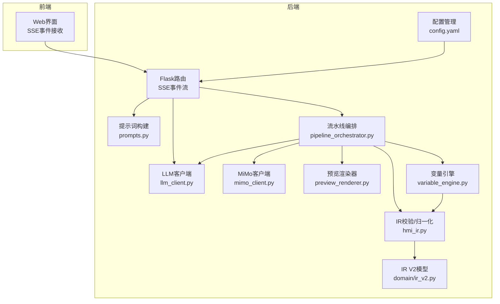
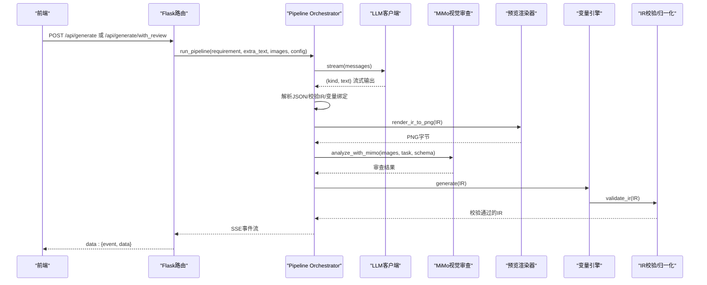
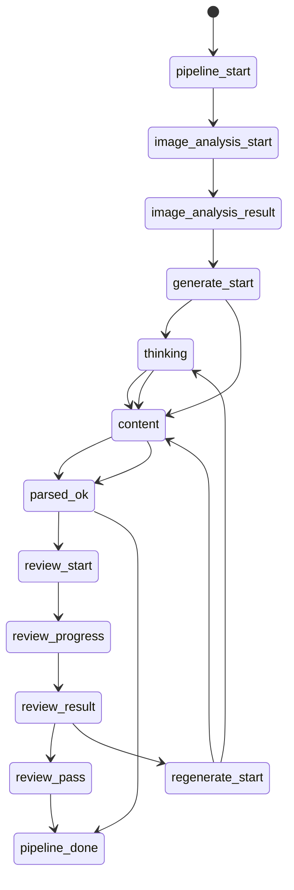
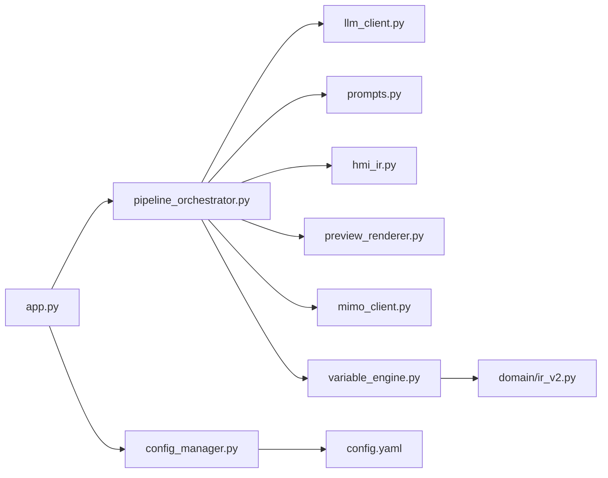

# AI生成系统

<cite>
**本文档引用的文件**
- [llm_client.py](file://backend/llm_client.py)
- [pipeline_orchestrator.py](file://backend/pipeline_orchestrator.py)
- [prompts.py](file://backend/prompts.py)
- [app.py](file://app.py)
- [config.yaml](file://config.yaml)
- [mimo_client.py](file://backend/mimo_client.py)
- [review_prompts.py](file://backend/review_prompts.py)
- [preview_renderer.py](file://backend/preview_renderer.py)
- [variable_engine.py](file://backend/variable_engine.py)
- [hmi_ir.py](file://backend/hmi_ir.py)
- [ir_v2.py](file://backend/domain/ir_v2.py)
- [config_manager.py](file://backend/config_manager.py)
</cite>

## 目录
1. [简介](#简介)
2. [项目结构](#项目结构)
3. [核心组件](#核心组件)
4. [架构总览](#架构总览)
5. [详细组件分析](#详细组件分析)
6. [依赖关系分析](#依赖关系分析)
7. [性能考虑](#性能考虑)
8. [故障排除指南](#故障排除指南)
9. [结论](#结论)
10. [附录](#附录)

## 简介
本项目是一个面向西门子 HMI（人机界面）的AI生成系统，能够将中文自然语言需求转化为工程可用的HMI画面中间表示（IR），并通过多阶段流水线完成生成、预览渲染、MiMo视觉审查、修正与再审查，最终生成可导入博途（TIA Portal）的SimaticML XML。系统的核心能力包括：
- LLM客户端：支持多提供商（DeepSeek、OpenAI兼容等），具备流式输出与思考深度控制。
- Pipeline Orchestrator：多阶段流水线编排，包含生成、审查、修正与再审查。
- Prompts模块：内置系统提示词与模板，确保输出严格遵循IR Schema与设计规范。
- MiMo视觉审查：基于图像理解的HMI画面质量评估与改进建议。
- 变量引擎：自动变量生成与绑定，生成工程级Tag表与VBS脚本。
- IR校验与归一化：保障输出IR的结构完整性与一致性。

## 项目结构
系统采用后端Python模块化设计，前端通过Flask路由与SSE进行交互。核心目录与文件关系如下：
- backend：核心业务逻辑模块
  - llm_client.py：LLM客户端与流式输出、思考深度控制
  - pipeline_orchestrator.py：多阶段流水线编排
  - prompts.py：提示词构建与模板系统
  - mimo_client.py：MiMo视觉API客户端
  - review_prompts.py：审查与修正提示词
  - preview_renderer.py：IR预览渲染器（PNG）
  - variable_engine.py：变量引擎（自动生成与绑定）
  - hmi_ir.py：IR校验、归一化与轻量布局优化
  - domain/ir_v2.py：V2语义IR数据模型
- app.py：Flask主程序，路由与SSE事件流
- config.yaml：系统配置（LLM提供商、MiMo、Openness等）
- config_manager.py：配置读写与默认值合并



图表来源
- [app.py:166-267](file://app.py#L166-L267)
- [pipeline_orchestrator.py:131-354](file://backend/pipeline_orchestrator.py#L131-L354)
- [llm_client.py:35-229](file://backend/llm_client.py#L35-L229)
- [prompts.py:322-343](file://backend/prompts.py#L322-L343)
- [mimo_client.py:203-324](file://backend/mimo_client.py#L203-L324)
- [preview_renderer.py:260-300](file://backend/preview_renderer.py#L260-L300)
- [variable_engine.py:106-294](file://backend/variable_engine.py#L106-L294)
- [hmi_ir.py:261-468](file://backend/hmi_ir.py#L261-L468)
- [ir_v2.py:1-200](file://backend/domain/ir_v2.py#L1-L200)
- [config.yaml:1-343](file://config.yaml#L1-L343)

章节来源
- [app.py:1-966](file://app.py#L1-L966)
- [config.yaml:1-343](file://config.yaml#L1-L343)

## 核心组件
本节概述系统三大核心组件及其职责与交互：
- LLM客户端（LLMClient）
  - 支持多提供商（DeepSeek、OpenAI兼容等），通过统一的/chat/completions接口进行调用。
  - 流式输出：逐块产出(kind, text)，kind ∈ {"thinking","content","error"}。
  - 思考深度控制：支持“关闭/低/中/高”，通过reasoning_effort或提示词诱导实现。
  - 非流式生成：用于图片分析等一次性请求。
- Pipeline Orchestrator（run_pipeline）
  - 多阶段流水线：生成 → 预览渲染 → MiMo视觉审查 → 修正 → 再审查。
  - 通过SSE事件向前端推送实时状态：pipeline_start、image_analysis_*、generate_start、thinking/content/error、parsed_ok、review_*、regenerate_start、pipeline_done等。
  - 审查循环：最多max_iterations次，通过pass/fail与阈值控制。
- Prompts模块（build_messages）
  - 构建系统提示词与few-shot示例，确保输出严格遵循IR Schema与设计规范。
  - 支持修正模式：将上一版IR与MiMo审查反馈整合到消息中，指导再生成。

章节来源
- [llm_client.py:35-229](file://backend/llm_client.py#L35-L229)
- [pipeline_orchestrator.py:131-354](file://backend/pipeline_orchestrator.py#L131-L354)
- [prompts.py:322-381](file://backend/prompts.py#L322-L381)

## 架构总览
系统采用“提示词驱动 + 多阶段流水线 + 视觉审查”的架构，LLM负责生成IR，IR经过校验与变量绑定后进入审查与修正循环，最终生成可导入博途的XML。



图表来源
- [app.py:166-267](file://app.py#L166-L267)
- [pipeline_orchestrator.py:131-354](file://backend/pipeline_orchestrator.py#L131-L354)
- [llm_client.py:78-170](file://backend/llm_client.py#L78-L170)
- [mimo_client.py:203-324](file://backend/mimo_client.py#L203-L324)
- [preview_renderer.py:260-300](file://backend/preview_renderer.py#L260-L300)
- [variable_engine.py:198-294](file://backend/variable_engine.py#L198-L294)
- [hmi_ir.py:261-468](file://backend/hmi_ir.py#L261-L468)

## 详细组件分析

### LLM客户端：流式输出与思考深度控制
- 流式输出机制
  - 使用requests.post(url, stream=True)接收SSE风格的数据块，逐行解析JSON。
  - 产出三类事件：thinking（原生推理模型的reasoning_content）、content（正文增量）、error（错误信息）。
- 思考深度控制
  - 关闭：使用普通chat模型，不产出思考。
  - 低/中/高：优先使用reasoner模型（如deepseek-reasoner），透传reasoning_effort；若提供商无原生推理，则通过提示词诱导，将<thinking>...</thinking>解析为思考过程。
- 非流式生成
  - 用于图片分析等一次性请求，去掉reasoning_effort与诱导思考的system消息，返回完整响应文本。

```mermaid
flowchart TD
Start(["开始"]) --> BuildPayload["构建请求负载<br/>选择模型/注入思考提示"]
BuildPayload --> Post["POST /chat/completions<br/>stream=True"]
Post --> StreamLoop{"遍历数据块"}
StreamLoop --> |reasoning_content| YieldThinking["产出 thinking 事件"]
StreamLoop --> |content| ContentCheck{"原生推理模型？"}
ContentCheck --> |是| YieldContent["产出 content 事件"]
ContentCheck --> |否| ParseThinking["缓冲并解析<thinking>...</thinking>"]
ParseThinking --> YieldThinking2["产出 thinking 事件"]
YieldThinking2 --> YieldContent
StreamLoop --> |[DONE]| Done(["结束"])
StreamLoop --> |错误| Error(["产出 error 事件"])
```

图表来源
- [llm_client.py:78-170](file://backend/llm_client.py#L78-L170)
- [llm_client.py:45-75](file://backend/llm_client.py#L45-L75)

章节来源
- [llm_client.py:35-229](file://backend/llm_client.py#L35-L229)

### Pipeline Orchestrator：多阶段流水线编排
- 阶段职责
  - 生成阶段：构建messages，调用LLM流式生成，解析JSON，校验IR，清洗文本字段，变量绑定。
  - 预览渲染：将IR渲染为PNG，供MiMo进行视觉审查。
  - MiMo视觉审查：基于审查结果决定是否通过，计算分数与类别问题。
  - 修正与再审查：根据审查反馈修正IR，重复渲染与审查，直至通过或达到最大迭代次数。
- 事件流
  - 通过yield (event_name, data)向SSE推送事件，前端可实时跟踪进度。
  - 审查循环包含review_start、review_result、review_pass、regenerate_start等事件。



图表来源
- [pipeline_orchestrator.py:131-354](file://backend/pipeline_orchestrator.py#L131-L354)

章节来源
- [pipeline_orchestrator.py:131-354](file://backend/pipeline_orchestrator.py#L131-L354)

### Prompts模块：提示词构建与模板系统
- 系统提示词（SYSTEM_PROMPT）
  - 明确角色（资深HMI画面工程师）、工作方式（先梳理状态/操作/显示量，再决定对象类型与布局）、输出格式（严格IR Schema）。
  - 强化规范：文字与命名、变量绑定、VBS脚本、布局与排版、输出前自检。
- few-shot示例
  - 提供典型需求与期望IR，帮助模型理解输出结构。
- 修正模式
  - 将上一版IR与MiMo审查反馈整合到messages，指导再生成。

章节来源
- [prompts.py:14-248](file://backend/prompts.py#L14-L248)
- [prompts.py:322-381](file://backend/prompts.py#L322-L381)

### MiMo视觉审查：图像理解与质量评估
- 能力概述
  - 支持多种输出模式（brief/detailed/ocr/chart/table/ui/drawing/compare/custom）。
  - 提供系统提示词与任务模板，确保输出结构化JSON。
- 安全解析与兜底
  - 对非JSON输出进行兜底处理，保留原始文本并返回结构化结果。
- 超时与错误处理
  - 统一捕获网络/连接/API错误，区分可重试与不可重试错误。

章节来源
- [mimo_client.py:203-324](file://backend/mimo_client.py#L203-L324)
- [review_prompts.py:29-135](file://backend/review_prompts.py#L29-L135)

### 预览渲染器：IR到PNG的绘制
- 绘制对象
  - Text、IOField、SymbolicIOField、Button、Indicator五种对象的绘制函数。
- 字体与颜色
  - 优先系统字体，回退至默认字体；根据背景色自动选择前景色。
- 输出
  - 将IR渲染为PNG字节，供MiMo审查使用。

章节来源
- [preview_renderer.py:260-300](file://backend/preview_renderer.py#L260-L300)

### 变量引擎：自动变量生成与绑定
- 职责
  - 自动变量命名（BTN_/MEM_/STS_/LMP_/IO_/SIO_前缀规则）。
  - Button行为模式检测（momentary/toggle）。
  - Indicator动态颜色与闪烁变量绑定。
  - IOField数据类型自动推断。
  - 生成完整的HMI Tags列表与VBS脚本（旧兼容层）。
- V3.0改造
  - 核心逻辑输出语义模型（HmiProjectSpec），VBS生成仅保留backward-compat层。

章节来源
- [variable_engine.py:106-294](file://backend/variable_engine.py#L106-L294)
- [variable_engine.py:130-192](file://backend/variable_engine.py#L130-L192)

### IR校验与归一化：结构完整性与轻量布局优化
- 校验内容
  - meta、tags、text_lists、scripts、objects的结构与字段校验。
  - 对象类型、坐标范围、引用完整性检查。
- 归一化
  - 默认值补全、字段标准化、自动变量补全。
- 轻量布局优化
  - 标题规范化、行对齐、最小间距修复、区块间距拉开、重叠与越界修正。

章节来源
- [hmi_ir.py:261-468](file://backend/hmi_ir.py#L261-L468)
- [hmi_ir.py:148-258](file://backend/hmi_ir.py#L148-L258)

### IR V2数据模型：语义化IR
- 模型组成
  - 项目元数据、目标设备、连接模型、变量模型、几何模型、动态绑定模型、事件与动作模型等。
- 用途
  - 作为V3.0语义IR的核心数据结构，支撑变量引擎与部署流水线。

章节来源
- [ir_v2.py:1-200](file://backend/domain/ir_v2.py#L1-L200)

### 配置管理：多提供商与审查参数
- 配置项
  - LLM提供商（active_provider、providers、thinking_depth、show_thinking）。
  - MiMo审查（enabled、api_key、base_url、model、max_iterations、review_pass_threshold、image_analysis_*）。
  - Openness（TIA版本、DLL路径、目标设备、生成模式等）。
- 默认值与深合并
  - 首次运行自动生成默认配置；保存时与默认配置深合并，保证新增字段不缺失。

章节来源
- [config.yaml:1-343](file://config.yaml#L1-L343)
- [config_manager.py:108-142](file://backend/config_manager.py#L108-L142)

## 依赖关系分析
- 组件耦合
  - pipeline_orchestrator依赖llm_client、prompts、hmi_ir、preview_renderer、mimo_client、variable_engine、review_prompts。
  - app.py依赖pipeline_orchestrator与llm_client/prompts，通过SSE向前端推送事件。
  - variable_engine依赖domain.ir_v2与领域枚举，生成语义IR。
- 外部依赖
  - requests（HTTP客户端）、Pillow（图像渲染）、Pydantic（V2模型定义）。
- 循环依赖
  - 未发现循环依赖；模块间通过函数调用与事件流解耦。



图表来源
- [app.py:38-39](file://app.py#L38-L39)
- [pipeline_orchestrator.py:23-31](file://backend/pipeline_orchestrator.py#L23-L31)
- [llm_client.py:35-43](file://backend/llm_client.py#L35-L43)
- [prompts.py:322-343](file://backend/prompts.py#L322-L343)
- [hmi_ir.py:261-468](file://backend/hmi_ir.py#L261-L468)
- [preview_renderer.py:260-300](file://backend/preview_renderer.py#L260-L300)
- [mimo_client.py:203-324](file://backend/mimo_client.py#L203-L324)
- [variable_engine.py:106-121](file://backend/variable_engine.py#L106-L121)
- [ir_v2.py:1-200](file://backend/domain/ir_v2.py#L1-L200)
- [config_manager.py:108-142](file://backend/config_manager.py#L108-L142)
- [config.yaml:1-343](file://config.yaml#L1-L343)

章节来源
- [app.py:1-966](file://app.py#L1-L966)
- [pipeline_orchestrator.py:1-354](file://backend/pipeline_orchestrator.py#L1-L354)

## 性能考虑
- 流式输出
  - 使用流式SSE减少前端等待时间，提升用户体验。
- 图像处理
  - 预览渲染使用Pillow，支持字体缓存与缩放，避免重复I/O。
- 审查循环
  - 通过max_iterations限制循环次数，避免无限重试。
- Token与超时
  - LLM与MiMo均设置超时，防止长时间阻塞。
- 建议
  - 合理设置思考深度，避免过高导致响应时间过长。
  - 上传图片前进行压缩，降低MiMo分析成本。

[本节提供一般性指导，无需特定文件分析]

## 故障排除指南
- LLM请求错误
  - 检查API Key是否配置，提供商base_url是否正确。
  - 查看错误事件（error）中的详细信息，定位网络/权限问题。
- IR解析失败
  - 检查输出是否包含完整JSON，必要时启用few-shot示例。
  - 使用validate_ir进行结构校验，查看_warnings与错误信息。
- 审查未通过
  - 查看审查结果中的categories与critical_issues，按建议修正布局与颜色。
  - 调整max_iterations与review_pass_threshold以平衡质量与效率。
- 变量绑定问题
  - 确认对象process_tag引用的变量存在于tags中，数据类型与地址正确。
  - 使用VariableEngine的回填与生成功能，自动补全缺失变量。

章节来源
- [llm_client.py:78-170](file://backend/llm_client.py#L78-L170)
- [hmi_ir.py:261-468](file://backend/hmi_ir.py#L261-L468)
- [review_prompts.py:154-196](file://backend/review_prompts.py#L154-L196)
- [variable_engine.py:198-294](file://backend/variable_engine.py#L198-L294)

## 结论
本系统通过提示词驱动与多阶段流水线，实现了从自然语言到工程级HMI画面的自动化生成与质量保障。LLM客户端提供灵活的思考深度控制与流式输出，Pipeline Orchestrator串联生成、审查与修正，Prompts模块确保输出结构化与规范性，MiMo视觉审查进一步提升工程交付质量。配合变量引擎与IR校验，系统能够在保证质量的前提下高效生成可导入博途的XML。

[本节为总结性内容，无需特定文件分析]

## 附录

### 配置示例与最佳实践
- 配置文件位置与结构
  - 配置文件位于项目根目录，包含LLM提供商、MiMo审查、Openness、输出等配置。
- 设置不同大语言模型提供商
  - 在config.yaml中配置active_provider与providers，分别指定base_url、api_key、chat_model、reasoner_model。
  - 示例路径：[config.yaml:1-343](file://config.yaml#L1-L343)
- 设置思考深度
  - 在config.yaml中设置llm.thinking_depth为“关闭/低/中/高”，或在请求时临时覆盖。
  - 示例路径：[app.py:184-185](file://app.py#L184-L185)
- 处理流式响应
  - 前端通过SSE事件流接收thinking/content/error事件，实时展示生成进度。
  - 示例路径：[app.py:197-216](file://app.py#L197-L216)

章节来源
- [config.yaml:1-343](file://config.yaml#L1-L343)
- [app.py:166-216](file://app.py#L166-L216)