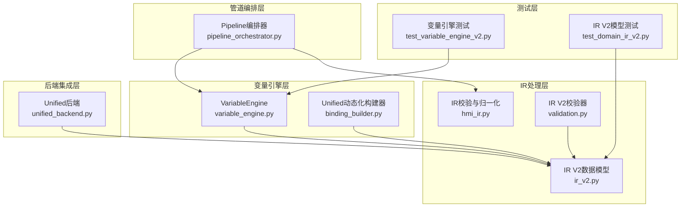
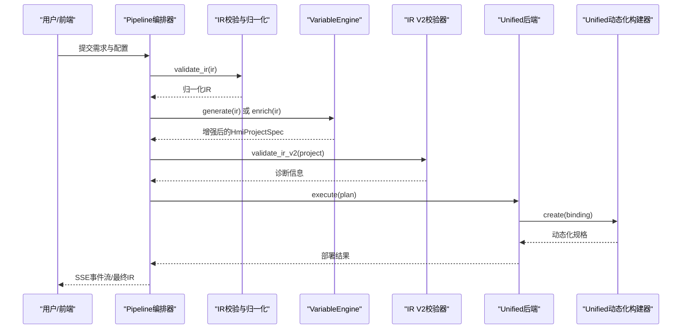
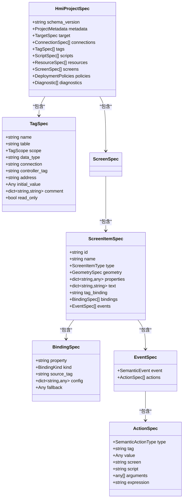
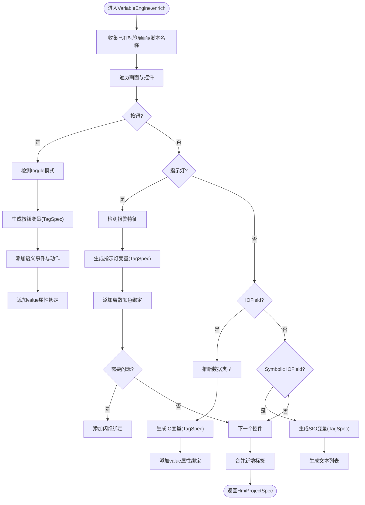
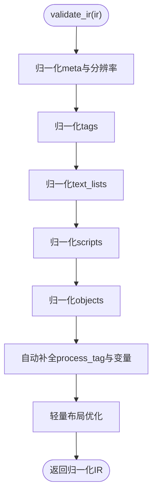
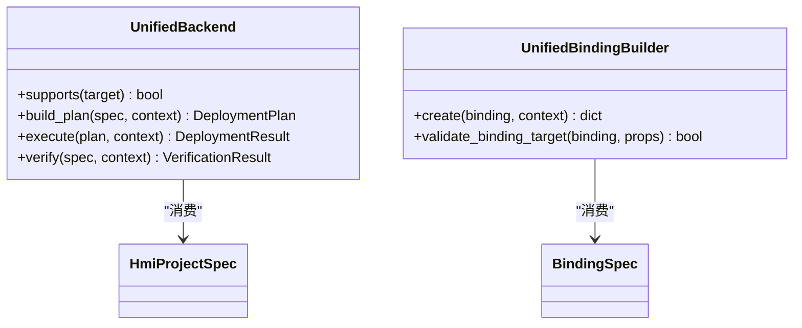
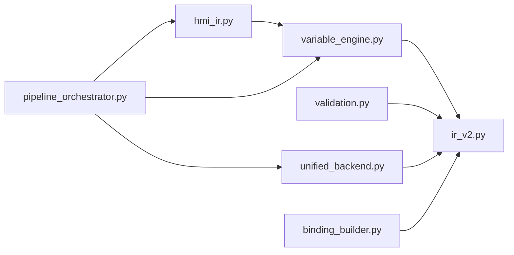

# HMI IR处理

<cite>
**本文档引用的文件**
- [ir_v2.py](file://backend/domain/ir_v2.py)
- [variable_engine.py](file://backend/variable_engine.py)
- [hmi_ir.py](file://backend/hmi_ir.py)
- [validation.py](file://backend/domain/validation.py)
- [binding_builder.py](file://backend/backends/unified/binding_builder.py)
- [unified_backend.py](file://backend/backends/unified/unified_backend.py)
- [pipeline_orchestrator.py](file://backend/pipeline_orchestrator.py)
- [enums.py](file://backend/domain/enums.py)
- [diagnostics.py](file://backend/domain/diagnostics.py)
- [test_variable_engine_v2.py](file://tests/test_variable_engine_v2.py)
- [test_domain_ir_v2.py](file://tests/test_domain_ir_v2.py)
</cite>

## 目录
1. [简介](#简介)
2. [项目结构](#项目结构)
3. [核心组件](#核心组件)
4. [架构总览](#架构总览)
5. [详细组件分析](#详细组件分析)
6. [依赖关系分析](#依赖关系分析)
7. [性能考量](#性能考量)
8. [故障排查指南](#故障排查指南)
9. [结论](#结论)
10. [附录](#附录)

## 简介
本文件面向HMI IR（中间表示）处理系统，聚焦于IR V2版本的数据结构与处理流程，系统性阐述Variable Engine的变量生成与绑定机制（含变量类型推断、命名规则、作用域管理），详述IR校验器的验证逻辑与错误处理机制，并给出IR转换过程中的边界情况处理策略。同时，文档解释IR处理与其他模块的协作关系，提供调试技巧与最佳实践，帮助开发者高效构建与维护HMI工程。

## 项目结构
本系统围绕“IR V2数据模型 + 变量引擎 + 统一后端”展开，核心文件分布如下：
- 数据模型与校验：backend/domain/ir_v2.py、backend/domain/validation.py、backend/domain/enums.py、backend/domain/diagnostics.py
- IR校验与归一化：backend/hmi_ir.py
- 变量引擎：backend/variable_engine.py
- 统一后端与动态化：backend/backends/unified/unified_backend.py、backend/backends/unified/binding_builder.py
- 管道编排：backend/pipeline_orchestrator.py
- 测试：tests/test_variable_engine_v2.py、tests/test_domain_ir_v2.py

图表来源
- [hmi_ir.py:1-526](file://backend/hmi_ir.py#L1-L526)
- [ir_v2.py:1-354](file://backend/domain/ir_v2.py#L1-L354)
- [validation.py:1-206](file://backend/domain/validation.py#L1-L206)
- [variable_engine.py:1-847](file://backend/variable_engine.py#L1-L847)
- [binding_builder.py:1-47](file://backend/backends/unified/binding_builder.py#L1-L47)
- [unified_backend.py:1-306](file://backend/backends/unified/unified_backend.py#L1-L306)
- [pipeline_orchestrator.py:1-354](file://backend/pipeline_orchestrator.py#L1-L354)
- [test_variable_engine_v2.py:1-353](file://tests/test_variable_engine_v2.py#L1-L353)
- [test_domain_ir_v2.py:1-312](file://tests/test_domain_ir_v2.py#L1-L312)

章节来源
- [hmi_ir.py:1-526](file://backend/hmi_ir.py#L1-L526)
- [ir_v2.py:1-354](file://backend/domain/ir_v2.py#L1-L354)
- [validation.py:1-206](file://backend/domain/validation.py#L1-L206)
- [variable_engine.py:1-847](file://backend/variable_engine.py#L1-L847)
- [binding_builder.py:1-47](file://backend/backends/unified/binding_builder.py#L1-L47)
- [unified_backend.py:1-306](file://backend/backends/unified/unified_backend.py#L1-L306)
- [pipeline_orchestrator.py:1-354](file://backend/pipeline_orchestrator.py#L1-L354)
- [test_variable_engine_v2.py:1-353](file://tests/test_variable_engine_v2.py#L1-L353)
- [test_domain_ir_v2.py:1-312](file://tests/test_domain_ir_v2.py#L1-L312)

## 核心组件
- IR V2数据模型：以Pydantic v2定义的强类型模型，涵盖项目元数据、目标设备、连接、变量、脚本、资源、画面与控件等，统一schema版本为"2.0"。
- Variable Engine：自动变量生成与绑定，支持按钮行为模式检测、指示灯颜色与闪烁绑定、IOField数据类型推断、Symbolic IOField文本列表生成，输出语义化的HmiProjectSpec。
- IR校验器（V2）：对HmiProjectSpec进行交叉引用与完整性校验，输出结构化诊断信息。
- IR校验与归一化：对旧IR进行结构检查、默认值补全、交叉引用校验与轻量布局优化。
- 统一后端与动态化：将IR V2绑定映射为Unified动态化规格，支持多种绑定类型到具体动态化类型的转换。
- 管道编排：串联生成、预览渲染、视觉审查、修正与再审查，形成SSE事件流。

章节来源
- [ir_v2.py:321-354](file://backend/domain/ir_v2.py#L321-L354)
- [variable_engine.py:106-121](file://backend/variable_engine.py#L106-L121)
- [validation.py:21-189](file://backend/domain/validation.py#L21-L189)
- [hmi_ir.py:261-468](file://backend/hmi_ir.py#L261-L468)
- [binding_builder.py:11-47](file://backend/backends/unified/binding_builder.py#L11-L47)
- [pipeline_orchestrator.py:131-354](file://backend/pipeline_orchestrator.py#L131-L354)

## 架构总览
IR处理系统采用分层架构：IR校验与归一化层负责输入清洗与基础校验；Variable Engine层负责语义化增强与变量生成；IR V2校验层负责跨对象引用一致性；统一后端层负责将语义绑定映射到实际动态化规格；管道编排层贯穿整个流程并提供可视化审查与迭代修正。

图表来源
- [pipeline_orchestrator.py:131-354](file://backend/pipeline_orchestrator.py#L131-L354)
- [hmi_ir.py:261-468](file://backend/hmi_ir.py#L261-L468)
- [variable_engine.py:130-192](file://backend/variable_engine.py#L130-L192)
- [validation.py:21-189](file://backend/domain/validation.py#L21-L189)
- [unified_backend.py:96-260](file://backend/backends/unified/unified_backend.py#L96-L260)
- [binding_builder.py:29-42](file://backend/backends/unified/binding_builder.py#L29-L42)

## 详细组件分析

### IR V2数据模型与校验
- 数据模型要点
  - 顶层模型HmiProjectSpec包含metadata、target、connections、tags、scripts、resources、screens、policies与diagnostics。
  - TagSpec支持内部/外部作用域、连接与控制器标签、初始值、多语言注释等。
  - ScreenItemSpec支持静态属性、多语言文本、主变量绑定与动态绑定列表、事件列表。
  - 事件与动作模型分离，支持语义化动作类型（如SET_BIT、TOGGLE_BIT、ACTIVATE_SCREEN等）。
  - 统一schema版本"2.0"，确保跨版本兼容与一致性。
- 校验器要点
  - 检查schema版本、画面非空、变量/画面/脚本/资源名称唯一性。
  - 校验控件tag_binding与bindings引用目标变量存在性。
  - 校验事件动作引用的变量、画面、脚本存在性。
  - 输出结构化诊断信息，包含错误码、严重等级、阶段、对象类型与修复建议。

图表来源
- [ir_v2.py:130-354](file://backend/domain/ir_v2.py#L130-L354)

章节来源
- [ir_v2.py:321-354](file://backend/domain/ir_v2.py#L321-L354)
- [validation.py:21-189](file://backend/domain/validation.py#L21-L189)

### Variable Engine：变量生成与绑定机制
- 职责与入口
  - 新V3.0 API：enrich()将旧IR转换为HmiProjectSpec并补齐推断。
  - 旧兼容入口：generate()内部调用enrich()后再回填旧字段与生成VBS脚本。
- 自动推断与绑定
  - 按钮：检测toggle/momentary行为模式，自动生成语义事件与动作，生成Bool变量并绑定到value属性。
  - 指示灯：根据闪烁与颜色特征推断报警/状态，生成离散颜色绑定与闪烁绑定。
  - IOField：根据显示格式与小数位推断数据类型（Int/Real/Word/String），生成变量并绑定到value属性。
  - Symbolic IOField：生成Int变量与独立文本列表，支持默认条目与自定义条目。
- 命名规则与作用域
  - 前缀规则：BTN_/MEM_/STS_/LMP_/IO_/SIO_等，避免与已有变量冲突。
  - 作用域：根据plc_prefix决定INTERNAL/EXTERNAL，影响地址生成与连接引用。
- 事件与动作
  - momentary：PRESS/RELEASE分别生成SET_BIT/RESET_BIT动作。
  - toggle：CLICK生成TOGGLE_BIT动作。
  - 语义动作类型覆盖常见操作，避免直接写死VBS/Javascript。

图表来源
- [variable_engine.py:130-192](file://backend/variable_engine.py#L130-L192)
- [variable_engine.py:299-547](file://backend/variable_engine.py#L299-L547)

章节来源
- [variable_engine.py:106-121](file://backend/variable_engine.py#L106-L121)
- [variable_engine.py:130-192](file://backend/variable_engine.py#L130-L192)
- [variable_engine.py:299-547](file://backend/variable_engine.py#L299-L547)

### IR校验与归一化（V1）
- 校验范围
  - 基础结构：meta、resolution、hmi_type、generation_mode、objects非空。
  - 对象类型合法性与唯一ID生成，坐标范围警告。
  - 变量、脚本、文本列表的默认值与合法性校验。
  - 自动补全process_tag与变量声明，引用脚本存在性检查。
- 轻量布局优化
  - 标题规范化、行聚类、最小间距修复、垂直间距拉开、重叠修复与边界裁剪。
  - 输出布局优化标记与警告信息。

图表来源
- [hmi_ir.py:261-468](file://backend/hmi_ir.py#L261-L468)
- [hmi_ir.py:148-258](file://backend/hmi_ir.py#L148-L258)

章节来源
- [hmi_ir.py:261-468](file://backend/hmi_ir.py#L261-L468)
- [hmi_ir.py:148-258](file://backend/hmi_ir.py#L148-L258)

### IR V2校验器（V2）
- 校验维度
  - schema_version固定为"2.0"。
  - 画面非空（警告级别）。
  - 名称唯一性：变量、画面、脚本、资源。
  - 引用一致性：控件tag_binding、bindings、事件动作引用。
- 诊断输出
  - 结构化诊断对象，包含错误码、严重等级、阶段、对象类型与修复建议。

章节来源
- [validation.py:21-189](file://backend/domain/validation.py#L21-L189)
- [diagnostics.py:17-35](file://backend/domain/diagnostics.py#L17-L35)

### 统一后端与动态化
- 统一后端
  - 支持Unified设备族，执行前加载RuntimeContract，无TIA连接时返回描述性状态。
  - 将HmiProjectSpec转换为Unified规格字典，执行真实TIA操作并汇总诊断。
- 动态化构建
  - BindingKind到Unified Dynamization类型的映射，支持TagDynamization、FlashingDynamization、ResourceListDynamization、ExpressionDynamization、ScriptDynamization等。
  - 校验绑定目标属性支持对应动态化类型。

图表来源
- [unified_backend.py:23-306](file://backend/backends/unified/unified_backend.py#L23-L306)
- [binding_builder.py:11-47](file://backend/backends/unified/binding_builder.py#L11-L47)

章节来源
- [unified_backend.py:23-306](file://backend/backends/unified/unified_backend.py#L23-L306)
- [binding_builder.py:11-47](file://backend/backends/unified/binding_builder.py#L11-L47)

### 管道编排与交互
- 流水线阶段
  - 生成、IR校验与适配、文本清洗、变量绑定、可选视觉审查与迭代修正、最终输出。
- 事件流
  - 通过SSE事件向前端反馈思考、内容、错误、审查进度与结果。
- 配置适配
  - 根据目标分辨率调整IR坐标系，保证预览与导入一致性。

章节来源
- [pipeline_orchestrator.py:131-354](file://backend/pipeline_orchestrator.py#L131-L354)

## 依赖关系分析
- 模块耦合
  - VariableEngine依赖IR V2模型与枚举，输出HmiProjectSpec。
  - IR V2校验器依赖HmiProjectSpec与诊断模型。
  - 统一后端依赖HmiProjectSpec与动态化构建器。
  - 管道编排器串联IR校验、变量引擎与后端执行。
- 外部依赖
  - Pydantic v2用于数据模型与校验。
  - 无Flask、pythonnet或Siemens DLL依赖，便于独立测试与部署。

图表来源
- [hmi_ir.py:1-526](file://backend/hmi_ir.py#L1-L526)
- [variable_engine.py:1-847](file://backend/variable_engine.py#L1-L847)
- [ir_v2.py:1-354](file://backend/domain/ir_v2.py#L1-L354)
- [validation.py:1-206](file://backend/domain/validation.py#L1-L206)
- [unified_backend.py:1-306](file://backend/backends/unified/unified_backend.py#L1-L306)
- [binding_builder.py:1-47](file://backend/backends/unified/binding_builder.py#L1-L47)
- [pipeline_orchestrator.py:1-354](file://backend/pipeline_orchestrator.py#L1-L354)

章节来源
- [hmi_ir.py:1-526](file://backend/hmi_ir.py#L1-L526)
- [variable_engine.py:1-847](file://backend/variable_engine.py#L1-L847)
- [ir_v2.py:1-354](file://backend/domain/ir_v2.py#L1-L354)
- [validation.py:1-206](file://backend/domain/validation.py#L1-L206)
- [unified_backend.py:1-306](file://backend/backends/unified/unified_backend.py#L1-L306)
- [binding_builder.py:1-47](file://backend/backends/unified/binding_builder.py#L1-L47)
- [pipeline_orchestrator.py:1-354](file://backend/pipeline_orchestrator.py#L1-L354)

## 性能考量
- IR校验与归一化
  - 轻量布局优化采用多轮扫描与排序，复杂度与控件数量线性相关，适合中小规模IR。
  - 建议在大规模IR场景中限制自动排版范围或分批处理。
- Variable Engine
  - 遍历屏幕与控件，结合集合查找与字典合并，整体复杂度与控件数量线性相关。
  - 建议在批量生成时复用Existing集合，减少重复计算。
- 统一后端
  - 将HmiProjectSpec转换为Unified规格字典时，注意避免重复转换与冗余拷贝。
  - RuntimeContract检查与TIA调用为瓶颈，建议缓存与异步执行。

[本节为通用指导，无需特定文件来源]

## 故障排查指南
- IR V2校验失败
  - 检查schema_version是否为"2.0"，确认变量/画面/脚本/资源名称唯一性。
  - 核对控件tag_binding与bindings引用是否存在，事件动作引用的变量/画面/脚本是否存在。
  - 参考诊断码与修复建议定位问题。
- IR校验（V1）失败
  - 关注IRValidationError异常与警告信息，检查meta、resolution、hmi_type、generation_mode与objects。
  - 自动补全process_tag与变量时，确认引用脚本存在性。
- 变量引擎问题
  - 检查toggle模式检测关键词与OID前缀，确认变量命名冲突与作用域设置。
  - 确认数据类型推断逻辑与文本列表生成。
- 统一后端问题
  - 无TIA连接时返回描述性状态，需先建立连接。
  - RuntimeContract缺失或不匹配导致BLOCKED，需重新探测或更新DLL路径。
- 管道编排问题
  - 关注SSE事件流中的错误与进度，必要时降低最大迭代次数或禁用视觉审查。

章节来源
- [validation.py:192-206](file://backend/domain/validation.py#L192-L206)
- [hmi_ir.py:40-42](file://backend/hmi_ir.py#L40-L42)
- [variable_engine.py:730-766](file://backend/variable_engine.py#L730-L766)
- [unified_backend.py:114-128](file://backend/backends/unified/unified_backend.py#L114-L128)
- [pipeline_orchestrator.py:155-354](file://backend/pipeline_orchestrator.py#L155-L354)

## 结论
本系统通过IR V2数据模型与严格的校验机制，实现了从自然语言需求到可部署HMI工程的自动化流程。Variable Engine在语义层面完成变量生成与绑定，统一后端将语义映射到实际动态化规格，配合管道编排与可视化审查，显著提升开发效率与质量。建议在实际项目中遵循命名规则、作用域管理与校验策略，充分利用诊断信息与测试用例，确保IR转换过程的稳定性与可维护性。

[本节为总结性内容，无需特定文件来源]

## 附录

### 代码示例路径（不含具体代码内容）
- 创建与修改HMI IR（V1）
  - [IR校验与归一化入口:261-468](file://backend/hmi_ir.py#L261-L468)
  - [分辨率缩放:471-526](file://backend/hmi_ir.py#L471-L526)
- 变量绑定与生成
  - [VariableEngine.enrich入口:130-192](file://backend/variable_engine.py#L130-L192)
  - [按钮绑定与事件生成:299-378](file://backend/variable_engine.py#L299-L378)
  - [指示灯颜色与闪烁绑定:379-446](file://backend/variable_engine.py#L379-L446)
  - [IOField数据类型推断:447-487](file://backend/variable_engine.py#L447-L487)
  - [Symbolic IOField文本列表:488-547](file://backend/variable_engine.py#L488-L547)
- IR V2校验与诊断
  - [IR V2校验器:21-189](file://backend/domain/validation.py#L21-L189)
  - [结构化诊断模型:17-35](file://backend/domain/diagnostics.py#L17-L35)
- 统一后端与动态化
  - [Unified后端执行:96-260](file://backend/backends/unified/unified_backend.py#L96-L260)
  - [动态化构建器:29-42](file://backend/backends/unified/binding_builder.py#L29-L42)
- 管道编排
  - [流水线编排:131-354](file://backend/pipeline_orchestrator.py#L131-L354)

### 边界情况与最佳实践
- 边界情况
  - 空objects：IR V1校验会抛出异常；IR V2校验给出警告。
  - 坐标越界：V1校验记录警告但保留原值。
  - 名称冲突：Variable Engine自动重命名，避免覆盖。
  - 引用缺失：V2校验输出诊断，建议在tags/scripts/screens中声明或修正引用。
- 最佳实践
  - 使用HmiProjectSpec作为统一语义载体，避免直接操作旧IR。
  - 明确变量作用域与连接，确保外部变量引用有效。
  - 合理使用枚举与默认值，减少手工配置错误。
  - 在大规模IR场景中，分阶段执行布局优化与变量生成，避免一次性处理过多对象。

章节来源
- [hmi_ir.py:340-342](file://backend/hmi_ir.py#L340-L342)
- [hmi_ir.py:358-360](file://backend/hmi_ir.py#L358-L360)
- [variable_engine.py:713-719](file://backend/variable_engine.py#L713-L719)
- [validation.py:53-60](file://backend/domain/validation.py#L53-L60)
- [unified_backend.py:114-128](file://backend/backends/unified/unified_backend.py#L114-L128)