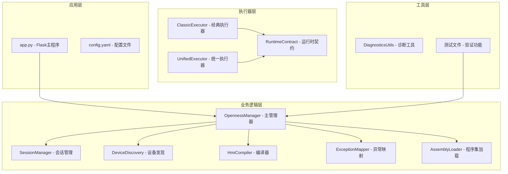
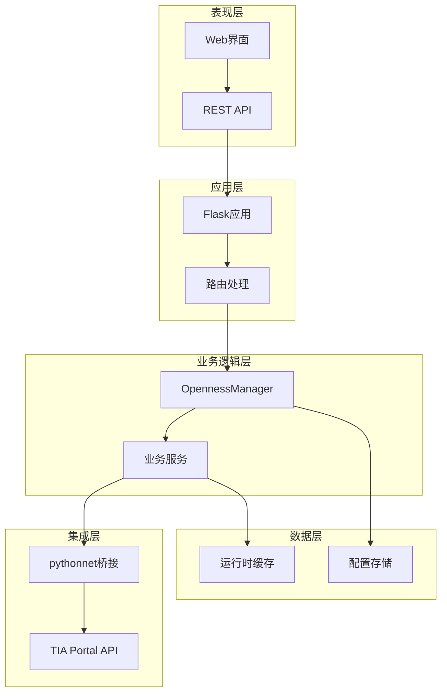
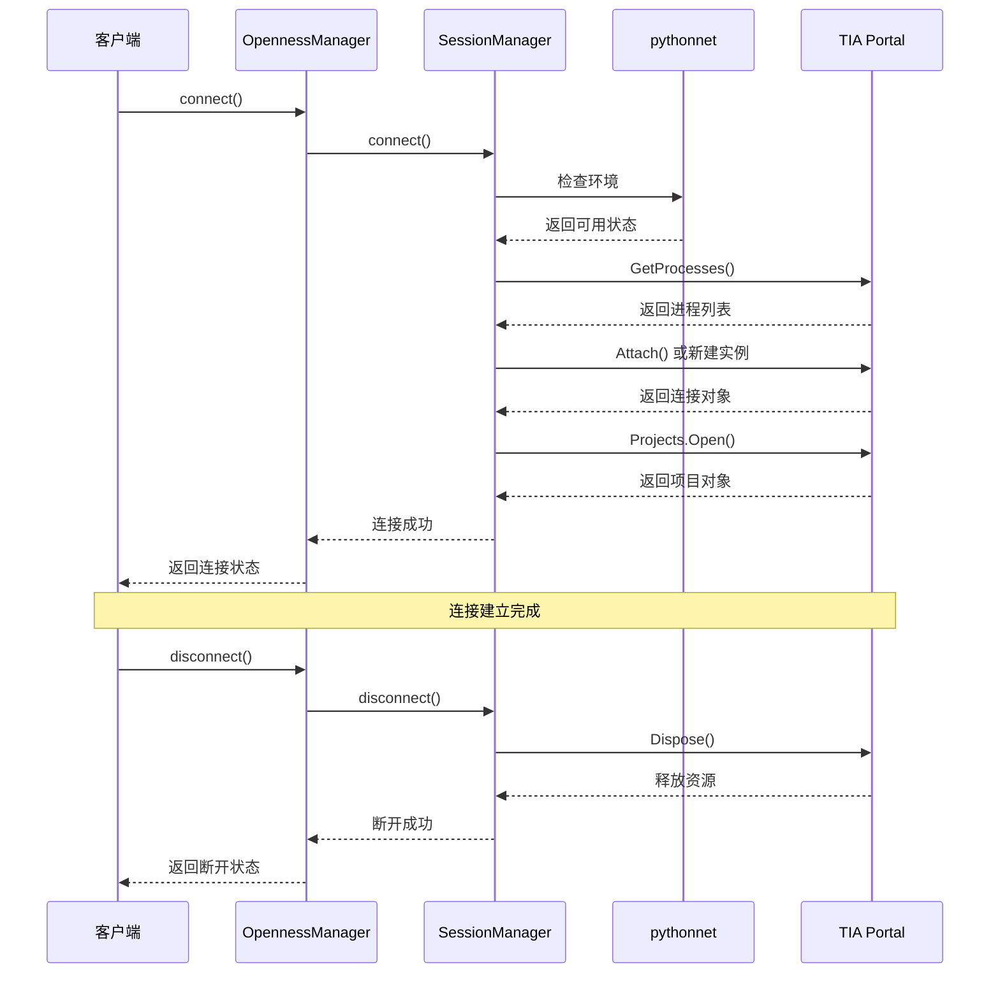
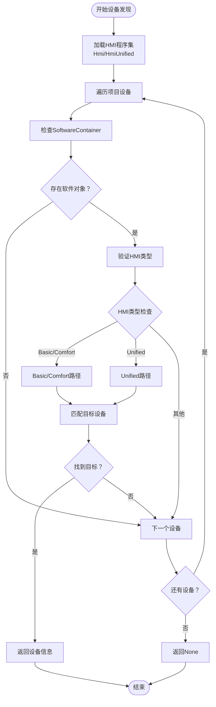
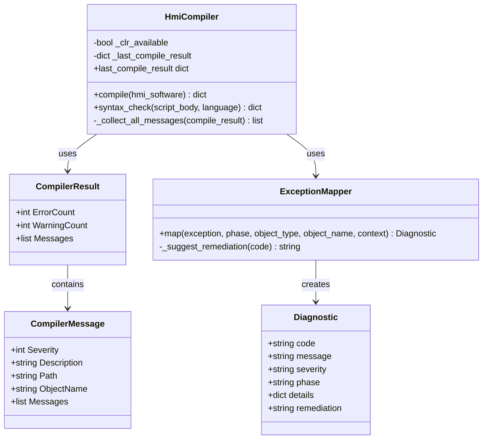
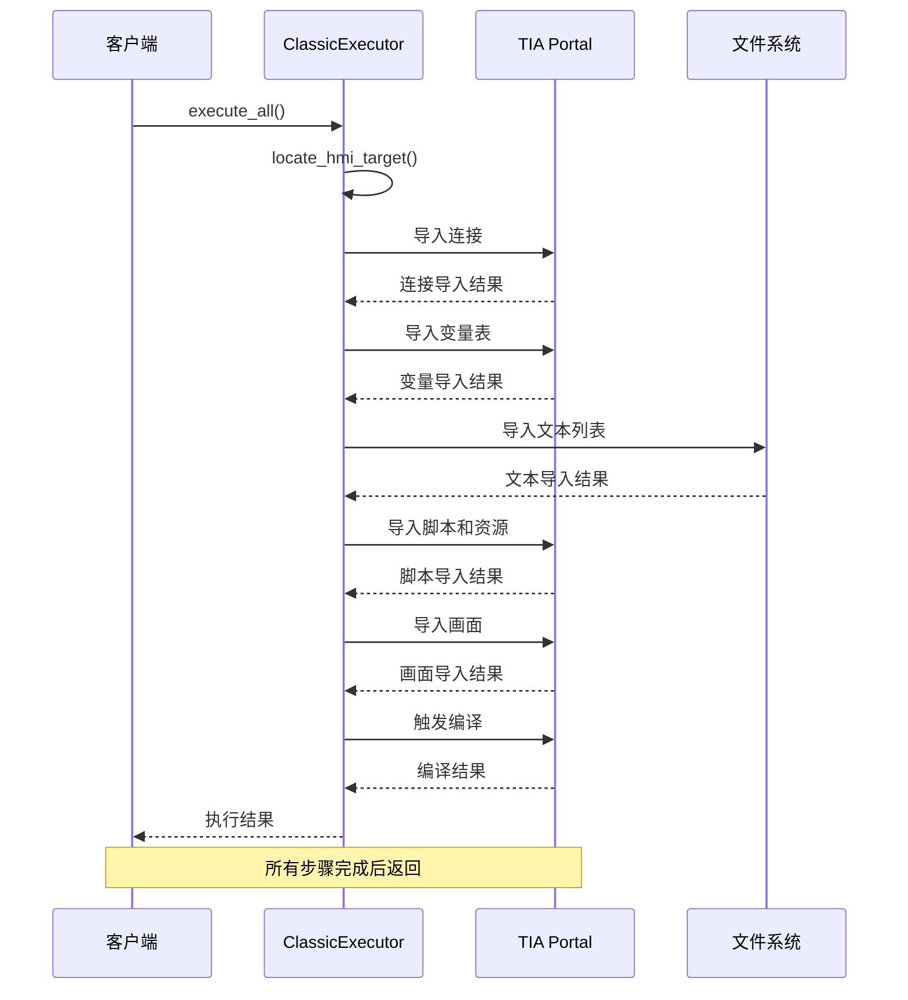
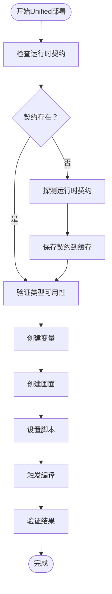
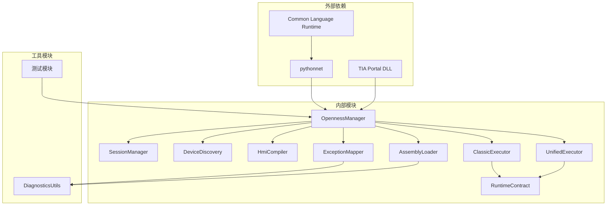

# Openness集成

<cite>
**本文档引用的文件**
- [openness_manager.py](file://backend/openness_manager.py)
- [session_manager.py](file://backend/openness/session_manager.py)
- [device_discovery.py](file://backend/openness/device_discovery.py)
- [compiler.py](file://backend/openness/compiler.py)
- [classic_executor.py](file://backend/openness/classic_executor.py)
- [unified_executor.py](file://backend/openness/unified_executor.py)
- [exception_mapper.py](file://backend/openness/exception_mapper.py)
- [assembly_loader.py](file://backend/openness/assembly_loader.py)
- [runtime_contract.py](file://backend/openness/runtime_contract.py)
- [diagnostics_utils.py](file://backend/openness/diagnostics_utils.py)
- [config.yaml](file://config.yaml)
- [app.py](file://app.py)
- [test_openness_manager.py](file://tests/test_openness_manager.py)
- [test_openness_modules.py](file://tests/test_openness_modules.py)
</cite>

## 目录
1. [简介](#简介)
2. [项目结构](#项目结构)
3. [核心组件](#核心组件)
4. [架构概览](#架构概览)
5. [详细组件分析](#详细组件分析)
6. [依赖关系分析](#依赖关系分析)
7. [性能考虑](#性能考虑)
8. [故障排除指南](#故障排除指南)
9. [结论](#结论)

## 简介

Openness集成系统是一个基于Python的TIA Portal Openness API集成框架，专门用于自动化HMI（人机界面）开发和部署。该系统通过pythonnet桥接技术，实现了与Siemens TIA Portal的深度集成，提供了完整的HMI开发工作流，包括设备发现、连接管理、XML导入、编译验证等功能。

系统采用模块化设计，将复杂的Openness API操作封装在专门的组件中，为用户提供简洁的接口和强大的功能。该集成系统特别适用于需要批量生成和部署HMI画面的企业级应用场景。

## 项目结构

Openness集成系统采用清晰的分层架构，主要包含以下核心目录和文件：

**图表来源**
- [app.py:1-800](file://app.py#L1-L800)
- [openness_manager.py:1-800](file://backend/openness_manager.py#L1-L800)

**章节来源**
- [app.py:1-800](file://app.py#L1-L800)
- [config.yaml:1-343](file://config.yaml#L1-L343)

## 核心组件

### OpennessManager - 主管理器

OpennessManager是整个系统的核心协调者，它采用了门面模式（Façade Pattern）设计，为外部提供简化的接口，同时内部委托给各个专业模块处理具体任务。

主要职责包括：
- **环境诊断**：检查Windows环境、pythonnet安装状态、DLL路径有效性
- **连接管理**：管理TIA Portal的连接生命周期
- **功能委派**：将具体操作委托给SessionManager、DeviceDiscovery、HmiCompiler等模块
- **XML预处理**：对导入的XML进行标准化处理

### SessionManager - 会话管理

SessionManager专门负责TIA Portal的连接生命周期管理，包括连接建立、项目打开和断开连接等操作。

关键特性：
- **诊断功能**：检查操作系统、pythonnet可用性和DLL路径
- **连接策略**：支持附加到现有进程或启动新实例
- **项目管理**：自动打开项目或根据配置加载特定项目
- **安全断开**：确保正确释放资源

### DeviceDiscovery - 设备发现

DeviceDiscovery模块负责在TIA项目中查找和识别HMI设备，支持多种HMI类型（Basic、Comfort、Unified）。

核心功能：
- **设备枚举**：遍历项目中的所有设备和设备项
- **类型识别**：区分Basic、Comfort和Unified HMI设备
- **能力检测**：识别设备支持的功能和限制
- **屏幕管理**：列出现有HMI画面供导入参考

### HmiCompiler - 编译器

HmiCompiler负责触发和监控HMI项目的编译过程，提供详细的编译结果反馈。

主要特性：
- **编译触发**：调用ICompilable接口执行编译
- **结果收集**：递归遍历编译结果，提取所有消息
- **错误分类**：将编译结果分类为Info、Warning、Error
- **状态监控**：提供编译进度和最终状态

**章节来源**
- [openness_manager.py:31-100](file://backend/openness_manager.py#L31-L100)
- [session_manager.py:14-50](file://backend/openness/session_manager.py#L14-L50)
- [device_discovery.py:15-80](file://backend/openness/device_discovery.py#L15-L80)
- [compiler.py:18-50](file://backend/openness/compiler.py#L18-L50)

## 架构概览

系统采用分层架构设计，确保各层职责明确，便于维护和扩展：

**图表来源**
- [app.py:316-377](file://app.py#L316-L377)
- [openness_manager.py:44-100](file://backend/openness_manager.py#L44-L100)

## 详细组件分析

### 会话生命周期管理

会话管理是Openness集成系统的核心功能之一，负责管理与TIA Portal的连接状态。

**图表来源**
- [session_manager.py:92-141](file://backend/openness/session_manager.py#L92-L141)
- [openness_manager.py:142-185](file://backend/openness_manager.py#L142-L185)

#### 连接建立流程

连接建立过程包含多个安全检查和验证步骤：

1. **环境检查**：验证Windows平台、pythonnet安装和DLL路径
2. **进程发现**：扫描运行中的TIA Portal实例
3. **项目访问**：获取项目对象并验证权限
4. **状态同步**：确保所有组件状态一致

#### 连接维护策略

系统采用智能连接维护策略：
- **自动重连**：在网络中断后自动尝试恢复连接
- **超时处理**：设置合理的超时时间避免长时间阻塞
- **资源清理**：确保断开连接时释放所有资源

#### 连接断开流程

断开连接时执行严格的资源清理：
- **主动释放**：调用Dispose方法释放.NET对象
- **状态重置**：清除所有连接相关的状态信息
- **异常处理**：忽略清理过程中的非致命错误

**章节来源**
- [session_manager.py:92-154](file://backend/openness/session_manager.py#L92-L154)
- [openness_manager.py:142-185](file://backend/openness_manager.py#L142-L185)

### 设备发现机制

设备发现功能是系统的重要组成部分，负责在复杂的TIA项目中准确定位HMI设备。

**图表来源**
- [device_discovery.py:28-78](file://backend/openness/device_discovery.py#L28-L78)
- [openness_manager.py:707-753](file://backend/openness_manager.py#L707-L753)

#### 设备枚举策略

系统采用递归遍历策略枚举设备：
- **深度优先**：确保不遗漏任何层级的设备项
- **类型过滤**：只处理包含SoftwareContainer的设备项
- **异常容错**：跳过处理失败的设备项继续处理其他设备

#### HMI类型识别

系统支持三种HMI类型的自动识别：
- **Basic/Comfort**：传统面板，使用Hmi命名空间
- **Unified**：WinCC Unified，使用HmiUnified命名空间
- **混合环境**：同时支持多种类型的HMI设备

#### 能力检测机制

设备发现不仅定位设备，还进行能力检测：
- **功能支持**：检测设备支持的Openness功能
- **版本兼容**：验证与当前TIA版本的兼容性
- **限制识别**：识别设备的特殊限制和约束

**章节来源**
- [device_discovery.py:28-173](file://backend/openness/device_discovery.py#L28-L173)
- [openness_manager.py:707-796](file://backend/openness_manager.py#L707-L796)

### 编译验证和错误报告

编译器模块提供了完整的编译验证和错误报告机制，确保HMI项目的质量和稳定性。

**图表来源**
- [compiler.py:18-108](file://backend/openness/compiler.py#L18-L108)
- [exception_mapper.py:20-87](file://backend/openness/exception_mapper.py#L20-L87)

#### 编译流程

编译过程遵循严格的验证和报告机制：

1. **编译触发**：调用ICompilable接口执行编译
2. **结果收集**：递归遍历所有编译消息
3. **分类处理**：将消息按严重程度分类
4. **状态评估**：根据错误数量确定编译结果

#### 错误报告机制

系统提供多层次的错误报告：
- **结构化消息**：包含严重程度、描述、路径和对象名
- **递归遍历**：处理嵌套的消息结构
- **兼容性处理**：支持不同版本的编译结果格式

#### 异常映射系统

异常映射器将.NET异常转换为结构化的诊断信息：
- **模式匹配**：基于异常消息内容识别错误类型
- **错误码映射**：将异常映射到标准的诊断代码
- **修复建议**：提供针对性的问题解决方案

**章节来源**
- [compiler.py:47-108](file://backend/openness/compiler.py#L47-L108)
- [exception_mapper.py:41-87](file://backend/openness/exception_mapper.py#L41-L87)

### 经典执行器（ClassicExecutor）

经典执行器处理传统HMI（Basic/Comfort）的复杂操作，包括变量导入、画面导入、脚本处理等。

**图表来源**
- [classic_executor.py:537-612](file://backend/openness/classic_executor.py#L537-L612)

#### 变量导入策略

经典执行器采用智能的变量导入策略：
- **类型检测**：自动识别TagTable和Individual Tags
- **目标选择**：根据XML类型选择正确的导入目标
- **冲突处理**：处理导入过程中的命名冲突

#### 画面导入流程

画面导入遵循官方的Composition导入模式：
- **临时文件**：将XML写入临时文件确保兼容性
- **标准导入**：使用官方的Import(FileInfo, ImportOptions)方法
- **清理机制**：导入完成后清理临时文件

**章节来源**
- [classic_executor.py:537-612](file://backend/openness/classic_executor.py#L537-L612)

### 统一执行器（UnifiedExecutor）

统一执行器专门处理WinCC Unified HMI的高级功能，包括直接集合操作、运行时契约检查等。

**图表来源**
- [unified_executor.py:149-200](file://backend/openness/unified_executor.py#L149-L200)

#### 运行时契约管理

统一执行器的核心特性是运行时契约管理：
- **契约探测**：自动探测当前TIA版本支持的类型和方法
- **缓存机制**：将探测结果缓存到JSON文件
- **版本兼容**：支持不同TIA版本的契约差异

#### 类型安全性保证

系统通过契约检查确保类型安全：
- **方法验证**：检查目标类型是否支持所需方法
- **属性检查**：验证必需属性是否存在
- **事件验证**：确认事件处理器可以正常创建

**章节来源**
- [unified_executor.py:149-200](file://backend/openness/unified_executor.py#L149-L200)

## 依赖关系分析

系统采用松耦合的设计原则，通过接口和抽象基类实现模块间的解耦。

**图表来源**
- [openness_manager.py:44-100](file://backend/openness_manager.py#L44-L100)
- [assembly_loader.py:47-82](file://backend/openness/assembly_loader.py#L47-L82)

### 模块间通信

各模块通过清晰的接口进行通信：
- **委托模式**：OpennessManager委托给各个专业模块
- **工厂模式**：执行器通过工厂方法创建
- **观察者模式**：状态变化通过回调通知

### 错误传播机制

系统建立了完善的错误传播机制：
- **异常包装**：将底层异常包装为结构化诊断
- **状态同步**：确保错误状态在整个系统中传播
- **回滚机制**：在发生错误时执行适当的回滚操作

**章节来源**
- [openness_manager.py:44-100](file://backend/openness_manager.py#L44-L100)
- [assembly_loader.py:47-142](file://backend/openness/assembly_loader.py#L47-L142)

## 性能考虑

系统在设计时充分考虑了性能优化，特别是在处理大型HMI项目时的性能表现。

### 连接池管理

系统采用智能的连接管理策略：
- **延迟初始化**：只有在需要时才创建连接
- **连接复用**：在多次请求间复用已建立的连接
- **资源回收**：及时释放不再使用的连接资源

### 缓存策略

多层缓存机制提升系统响应速度：
- **运行时契约缓存**：避免重复的DLL反射操作
- **诊断结果缓存**：减少重复的环境检查
- **配置缓存**：避免频繁的配置文件读取

### 异步处理

对于耗时操作采用异步处理：
- **编译监控**：异步监控编译进度
- **文件操作**：异步处理XML文件导入
- **网络通信**：异步处理与TIA的通信

## 故障排除指南

### 常见连接问题

| 问题类型 | 症状 | 解决方案 |
|---------|------|----------|
| 环境不支持 | 报告不支持Openness | 确保运行在Windows平台 |
| pythonnet缺失 | 连接失败且显示缺少依赖 | 安装pythonnet包 |
| DLL路径错误 | 连接时提示DLL不存在 | 检查config.yaml中的dll_path配置 |
| 无运行实例 | 无法找到TIA Portal进程 | 确保TIA Portal已启动 |

### 设备发现失败

设备发现失败的常见原因：
- **程序集加载失败**：检查HMI程序集是否正确安装
- **权限不足**：确保用户账户在Siemens TIA Openness用户组
- **设备过滤**：检查hmi_device配置是否正确

### 编译错误处理

编译错误的分类和处理：
- **语法错误**：检查脚本语法和变量引用
- **类型不匹配**：验证变量类型和数据类型
- **资源缺失**：确保所有依赖的资源都已导入

### 配置最佳实践

推荐的配置设置：
- **DLL路径**：使用绝对路径避免相对路径问题
- **目标分辨率**：在config.yaml中设置target_resolution
- **自动缩放**：启用auto_scale_screen_items避免画面越界

**章节来源**
- [openness_manager.py:103-139](file://backend/openness_manager.py#L103-L139)
- [device_discovery.py:78-173](file://backend/openness/device_discovery.py#L78-L173)
- [compiler.py:98-108](file://backend/openness/compiler.py#L98-L108)

## 结论

Openness集成系统通过模块化设计和专业的功能划分，为TIA Portal的HMI开发提供了完整的解决方案。系统的主要优势包括：

**技术优势**
- **模块化架构**：清晰的职责分离便于维护和扩展
- **类型安全**：通过运行时契约确保API调用的安全性
- **错误处理**：完善的异常处理和诊断机制

**功能特性**
- **全面支持**：支持Basic、Comfort、Unified三种HMI类型
- **自动化程度高**：从设备发现到编译验证的全流程自动化
- **兼容性强**：支持多个TIA Portal版本

**使用价值**
- **提高效率**：大幅减少HMI开发和部署的人工操作
- **降低风险**：通过严格的验证机制减少部署错误
- **易于集成**：提供清晰的API接口便于与其他系统集成

该系统特别适合需要批量生成和部署HMI画面的企业级应用场景，能够显著提高开发效率和质量。随着工业4.0的发展，这种自动化集成方案将成为HMI开发的标准实践。