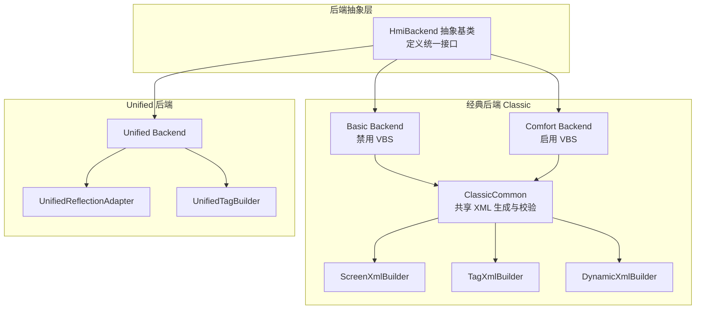
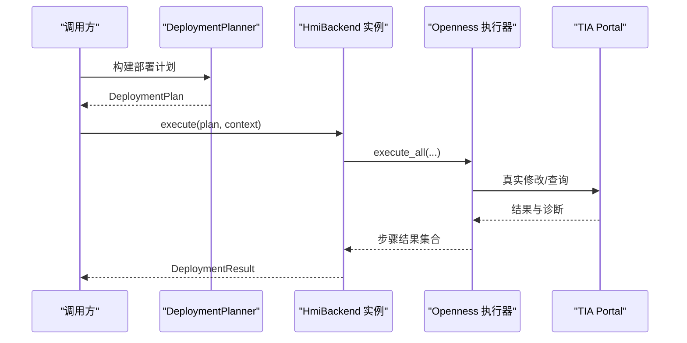
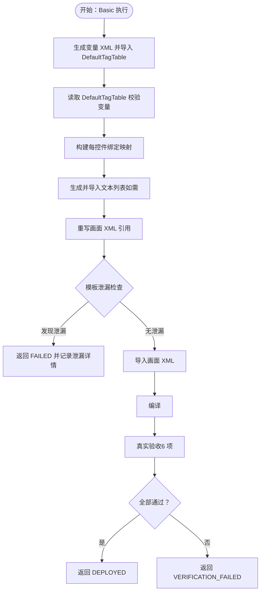
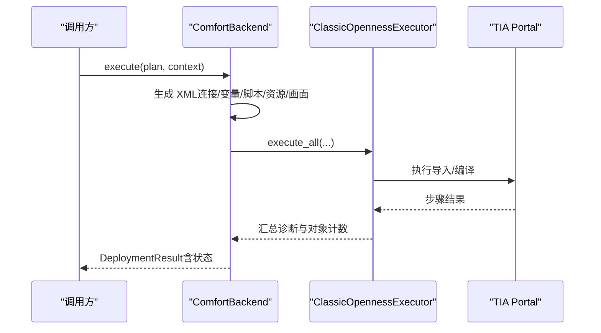
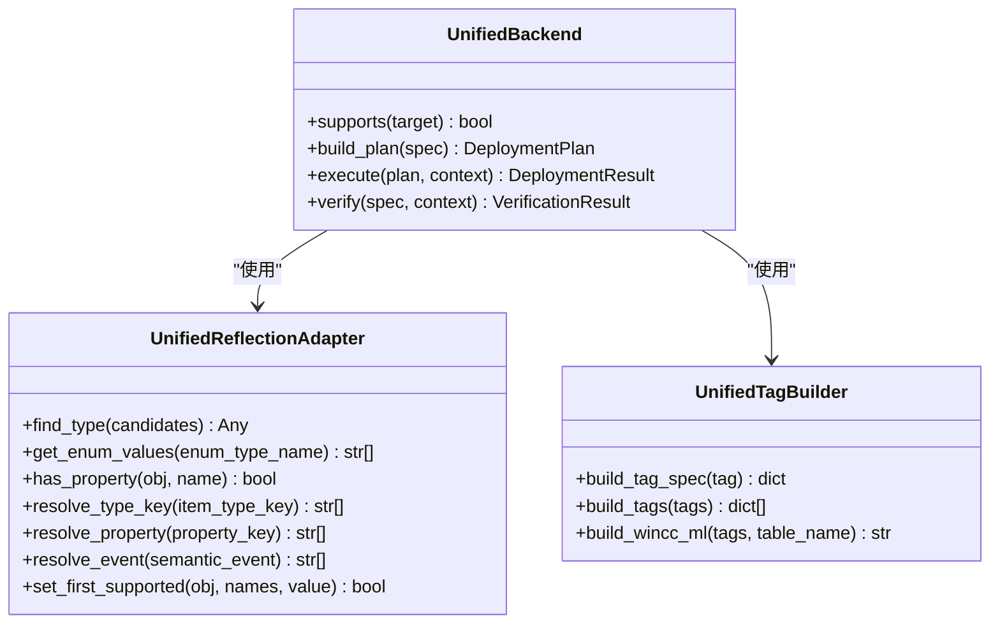
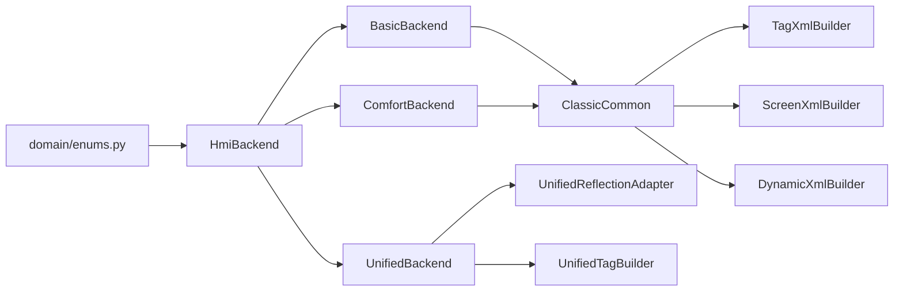

# 三后端系统

<cite>
**本文档引用的文件**
- [backend/backends/base.py](file://backend/backends/base.py)
- [backend/backends/classic/basic_backend.py](file://backend/backends/classic/basic_backend.py)
- [backend/backends/classic/comfort_backend.py](file://backend/backends/classic/comfort_backend.py)
- [backend/backends/unified/unified_backend.py](file://backend/backends/unified/unified_backend.py)
- [backend/backends/unified/reflection_adapter.py](file://backend/backends/unified/reflection_adapter.py)
- [backend/backends/classic/common.py](file://backend/backends/classic/common.py)
- [backend/backends/classic/screen_xml_builder.py](file://backend/backends/classic/screen_xml_builder.py)
- [backend/backends/classic/tag_xml_builder.py](file://backend/backends/classic/tag_xml_builder.py)
- [backend/backends/classic/dynamic_xml_builder.py](file://backend/backends/classic/dynamic_xml_builder.py)
- [backend/backends/unified/tag_builder.py](file://backend/backends/unified/tag_builder.py)
- [backend/domain/enums.py](file://backend/domain/enums.py)
- [config.yaml](file://config.yaml)
- [reference_catalog/V20/Basic/manifest.yaml](file://reference_catalog/V20/Basic/manifest.yaml)
- [reference_catalog/V20/Comfort/manifest.yaml](file://reference_catalog/V20/Comfort/manifest.yaml)
- [tests/test_backends.py](file://tests/test_backends.py)
- [tests/test_unified_backend.py](file://tests/test_unified_backend.py)
</cite>

## 目录
1. [简介](#简介)
2. [项目结构](#项目结构)
3. [核心组件](#核心组件)
4. [架构总览](#架构总览)
5. [详细组件分析](#详细组件分析)
6. [依赖分析](#依赖分析)
7. [性能考虑](#性能考虑)
8. [故障排查指南](#故障排查指南)
9. [结论](#结论)
10. [附录](#附录)

## 简介
本文件面向“三后端系统”的使用者与维护者，系统性阐述以下内容：
- Base Backend 的抽象基类设计与共享能力
- Classic Backend 的两种实现：Basic Backend 与 Comfort Backend 的差异、适用场景与最佳实践
- Unified Backend 的反射适配器与动态属性处理机制
- 三种后端的 XML 生成策略与兼容性处理
- 实际示例：如何选择合适后端、如何处理不同 HMI 类型的特殊需求、如何扩展新后端
- 性能对比与迁移指南

## 项目结构
三后端系统围绕统一接口 HmiBackend 展开，分别在 classic 与 unified 子模块下提供具体实现，并通过 domain 层的 IR 规范与枚举进行跨后端一致性约束。

图示来源
- [backend/backends/base.py:10-32](file://backend/backends/base.py#L10-L32)
- [backend/backends/classic/basic_backend.py:31-643](file://backend/backends/classic/basic_backend.py#L31-L643)
- [backend/backends/classic/comfort_backend.py:26-297](file://backend/backends/classic/comfort_backend.py#L26-L297)
- [backend/backends/unified/unified_backend.py:23-306](file://backend/backends/unified/unified_backend.py#L23-L306)
- [backend/backends/classic/common.py:20-108](file://backend/backends/classic/common.py#L20-L108)
- [backend/backends/classic/screen_xml_builder.py:19-255](file://backend/backends/classic/screen_xml_builder.py#L19-L255)
- [backend/backends/classic/tag_xml_builder.py:15-286](file://backend/backends/classic/tag_xml_builder.py#L15-L286)
- [backend/backends/classic/dynamic_xml_builder.py:12-131](file://backend/backends/classic/dynamic_xml_builder.py#L12-L131)
- [backend/backends/unified/reflection_adapter.py:10-97](file://backend/backends/unified/reflection_adapter.py#L10-L97)
- [backend/backends/unified/tag_builder.py:8-50](file://backend/backends/unified/tag_builder.py#L8-L50)

章节来源
- [backend/backends/base.py:10-32](file://backend/backends/base.py#L10-L32)
- [backend/backends/classic/common.py:20-108](file://backend/backends/classic/common.py#L20-L108)
- [backend/backends/unified/unified_backend.py:23-306](file://backend/backends/unified/unified_backend.py#L23-L306)

## 核心组件
- 抽象基类 HmiBackend：定义 supports/build_plan/execute/verify 四大接口，确保各后端行为一致。
- ClassicCommon：封装 Classic 系列（Basic/Comfort）共享的 XML 生成器、引用重写器、校验器等。
- UnifiedReflectionAdapter：运行时类型反射与版本适配，解决 Unified 不同版本的类型/属性/事件差异。
- 枚举体系：HmiFamily、ScreenItemType、BindingKind、SemanticEvent 等，贯穿 IR 与后端实现。

章节来源
- [backend/backends/base.py:10-32](file://backend/backends/base.py#L10-L32)
- [backend/backends/classic/common.py:20-108](file://backend/backends/classic/common.py#L20-L108)
- [backend/backends/unified/reflection_adapter.py:10-97](file://backend/backends/unified/reflection_adapter.py#L10-L97)
- [backend/domain/enums.py:11-157](file://backend/domain/enums.py#L11-L157)

## 架构总览
三后端系统采用“统一抽象 + 分层实现”的架构：
- 上层：HmiBackend 抽象接口，屏蔽具体实现细节
- 中层：ClassicCommon 提供 XML 生成与引用重写等共享能力
- 下层：各后端根据目标设备族（basic/comfort/unified）选择不同的生成策略与执行路径

图示来源
- [backend/backends/classic/basic_backend.py:76-449](file://backend/backends/classic/basic_backend.py#L76-L449)
- [backend/backends/classic/comfort_backend.py:55-185](file://backend/backends/classic/comfort_backend.py#L55-L185)
- [backend/backends/unified/unified_backend.py:96-260](file://backend/backends/unified/unified_backend.py#L96-L260)

## 详细组件分析

### Base Backend 抽象基类
- 设计要点
  - 统一接口：supports/target 验证；build_plan/execute/verify 的职责分离
  - 与领域模型解耦：通过 HmiProjectSpec/TargetSpec/DeploymentPlan 等进行契约约束
- 价值
  - 保证不同后端的一致行为与可观测性（诊断、状态机）

章节来源
- [backend/backends/base.py:10-32](file://backend/backends/base.py#L10-L32)
- [backend/domain/enums.py:136-150](file://backend/domain/enums.py#L136-L150)

### Classic Backend：Basic Backend
- 特性与限制
  - 禁止 VBS 脚本；必须通过 FunctionList 事件绑定
  - 强制每控件独立变量映射，避免模板变量共用
  - 严格的模板引用泄漏检查与真实验收（6 项）
- 关键流程
  - 变量生成与导入 DefaultTagTable
  - 读取 DefaultTagTable 校验变量存在性
  - 构建每控件绑定映射
  - 生成并导入文本列表（SymbolicIOField）
  - 重写画面 XML 引用，模板泄漏检查
  - 执行 TIA 部署、编译、真实验收
- 适用场景
  - 资源受限、安全要求高的 Basic 面板
  - 需要严格变量隔离与可审计性的项目

图示来源
- [backend/backends/classic/basic_backend.py:76-449](file://backend/backends/classic/basic_backend.py#L76-L449)

章节来源
- [backend/backends/classic/basic_backend.py:31-643](file://backend/backends/classic/basic_backend.py#L31-L643)

### Classic Backend：Comfort Backend
- 特性与优势
  - 支持 VBS 脚本；事件绑定更灵活
  - 保持 Classic XML 生态，兼容 FunctionList 与动态属性
- 关键流程
  - 生成连接、变量、脚本、资源、画面 XML
  - 通过 UnifiedOpennessExecutor 执行 TIA 修改
  - 编译结果决定最终状态
- 适用场景
  - 需要复杂交互逻辑与脚本能力的 Comfort/Auto 面板
  - 对 Classic 生态有历史依赖的项目

图示来源
- [backend/backends/classic/comfort_backend.py:55-185](file://backend/backends/classic/comfort_backend.py#L55-L185)

章节来源
- [backend/backends/classic/comfort_backend.py:26-297](file://backend/backends/classic/comfort_backend.py#L26-L297)

### Unified Backend
- 核心机制
  - 反射适配器：针对不同 TIA 版本的类型/属性/事件进行候选映射与缓存
  - 动态属性：通过多种 Dynamization 类型（Direct/Discrete/Range/Linear/Flashing/Expression）实现
  - 直接对象模型：通过 UnifiedOpennessExecutor 直接操作 Unified 对象
- 关键流程
  - 构建标签/画面/脚本规格字典
  - 执行 TIA 修改与编译
  - 验证与快照保存
- 适用场景
  - 需要现代 UI 与脚本能力的 Unified 面板
  - 对可扩展性与运行时适配有更高要求的项目

图示来源
- [backend/backends/unified/unified_backend.py:23-306](file://backend/backends/unified/unified_backend.py#L23-L306)
- [backend/backends/unified/reflection_adapter.py:10-97](file://backend/backends/unified/reflection_adapter.py#L10-L97)
- [backend/backends/unified/tag_builder.py:8-50](file://backend/backends/unified/tag_builder.py#L8-L50)

章节来源
- [backend/backends/unified/unified_backend.py:23-306](file://backend/backends/unified/unified_backend.py#L23-L306)
- [backend/backends/unified/reflection_adapter.py:10-97](file://backend/backends/unified/reflection_adapter.py#L10-L97)
- [backend/backends/unified/tag_builder.py:8-50](file://backend/backends/unified/tag_builder.py#L8-L50)

### XML 生成策略与兼容性处理
- Classic（Basic/Comfort）
  - 画面 XML：基于黄金模板片段拼装，支持事件与动态绑定
  - 变量 XML：遵循真实 Basic 导出格式，支持 DefaultTagTable 导入
  - 文本列表：SymbolicIOField 专用，支持多语言条目
  - 引用重写：将模板变量映射为实际变量，防止泄漏
- Unified
  - 通过反射适配器映射类型/属性/事件，兼容不同 TIA 版本
  - 动态属性：支持离散/范围/线性/闪烁/表达式等多种映射
  - 直接规格化：将 IR 转换为 Unified 规格字典，减少中间 XML

章节来源
- [backend/backends/classic/screen_xml_builder.py:19-255](file://backend/backends/classic/screen_xml_builder.py#L19-L255)
- [backend/backends/classic/tag_xml_builder.py:15-286](file://backend/backends/classic/tag_xml_builder.py#L15-L286)
- [backend/backends/classic/dynamic_xml_builder.py:12-131](file://backend/backends/classic/dynamic_xml_builder.py#L12-L131)
- [backend/backends/unified/reflection_adapter.py:10-97](file://backend/backends/unified/reflection_adapter.py#L10-L97)

## 依赖分析
- 后端与领域模型
  - HmiBackend 依赖 HmiProjectSpec/TargetSpec/DeploymentPlan/DeploymentResult/VerificationResult
  - 枚举体系贯穿后端实现，确保跨后端一致性
- ClassicCommon 与生成器
  - TagXmlBuilder/ScreenXmlBuilder/DynamicXmlBuilder/XmlIdRegistry/LinkResolver/ClassicValidator
  - 为 Basic/Comfort 提供统一 XML 生成与校验能力
- UnifiedBackend 与适配器
  - UnifiedReflectionAdapter 与 UnifiedTagBuilder 协作，完成类型/属性/事件映射与规格转换

图示来源
- [backend/domain/enums.py:11-157](file://backend/domain/enums.py#L11-L157)
- [backend/backends/base.py:10-32](file://backend/backends/base.py#L10-L32)
- [backend/backends/classic/common.py:20-108](file://backend/backends/classic/common.py#L20-L108)
- [backend/backends/unified/unified_backend.py:23-306](file://backend/backends/unified/unified_backend.py#L23-L306)

章节来源
- [backend/domain/enums.py:11-157](file://backend/domain/enums.py#L11-L157)
- [backend/backends/classic/common.py:20-108](file://backend/backends/classic/common.py#L20-L108)

## 性能考虑
- Classic 路径
  - 变量导入与 DefaultTagTable 校验：建议批量导入并复用结果，减少往返
  - 引用重写与泄漏检查：在生成阶段即进行结构化校验，避免后续失败回滚
- Unified 路径
  - 反射适配器缓存：类型/枚举缓存可显著降低运行时反射成本
  - 规格化直通：减少中间 XML 序列化/解析开销
- 通用建议
  - 在 dry-run 阶段尽早暴露不支持特性与依赖问题
  - 将编译与验证步骤前置，避免长时间阻塞真实 TIA 会话

## 故障排查指南
- 常见诊断码与状态
  - Basic 模板变量泄漏：检查绑定映射与引用重写日志
  - 变量缺失：核对 DefaultTagTable 导入与校验结果
  - VBS 安全扫描失败：确认脚本内容符合安全策略
  - Unified 类型/属性不存在：检查反射适配器候选映射与 TIA 版本
- 排查步骤
  - 通过 DeploymentResult/VerificationResult 的 diagnostics 字段定位阶段与对象
  - 使用快照导出与反向导出 XML 进行比对
  - 在配置中开启详细日志与产物日志，便于回溯

章节来源
- [backend/backends/classic/basic_backend.py:192-212](file://backend/backends/classic/basic_backend.py#L192-L212)
- [backend/backends/classic/comfort_backend.py:291-297](file://backend/backends/classic/comfort_backend.py#L291-L297)
- [backend/backends/unified/unified_backend.py:150-161](file://backend/backends/unified/unified_backend.py#L150-L161)

## 结论
三后端系统通过统一抽象与分层实现，兼顾了 Classic 生态的稳定性与 Unified 的现代化能力。选择后端的关键在于：
- Basic：强调安全与可审计，禁用 VBS，严格变量隔离
- Comfort：需要 VBS 与 FunctionList 的灵活性
- Unified：追求现代 UI 与脚本能力，配合反射适配器实现跨版本兼容

## 附录

### 如何选择合适的后端
- 目标设备族
  - HmiFamily.BASIC → Basic Backend
  - HmiFamily.COMFORT/HmiFamily.AUTO → Comfort Backend
  - HmiFamily.UNIFIED → Unified Backend
- 参考测试用例
  - [tests/test_backends.py:38-126](file://tests/test_backends.py#L38-L126)
  - [tests/test_unified_backend.py:173-205](file://tests/test_unified_backend.py#L173-L205)

章节来源
- [backend/domain/enums.py:11-17](file://backend/domain/enums.py#L11-L17)
- [tests/test_backends.py:38-126](file://tests/test_backends.py#L38-L126)
- [tests/test_unified_backend.py:173-205](file://tests/test_unified_backend.py#L173-L205)

### 处理不同 HMI 类型的特殊需求
- Basic
  - 禁止 VBS：在 build_plan 阶段拒绝 VBS 脚本
  - SymbolicIOField 文本列表：自动生成或导入
  - 参考：[backend/backends/classic/basic_backend.py:60-70](file://backend/backends/classic/basic_backend.py#L60-L70)，[backend/backends/classic/common.py:58-64](file://backend/backends/classic/common.py#L58-L64)
- Comfort
  - VBS 安全扫描：在 build_vbs_script 中执行
  - 参考：[backend/backends/classic/comfort_backend.py:291-297](file://backend/backends/classic/comfort_backend.py#L291-L297)
- Unified
  - 反射适配器：类型/属性/事件候选映射
  - 参考：[backend/backends/unified/reflection_adapter.py:17-55](file://backend/backends/unified/reflection_adapter.py#L17-L55)

章节来源
- [backend/backends/classic/basic_backend.py:60-70](file://backend/backends/classic/basic_backend.py#L60-L70)
- [backend/backends/classic/comfort_backend.py:291-297](file://backend/backends/classic/comfort_backend.py#L291-L297)
- [backend/backends/unified/reflection_adapter.py:17-55](file://backend/backends/unified/reflection_adapter.py#L17-L55)

### 扩展新的后端实现
- 实现步骤
  - 继承 HmiBackend，实现 supports/build_plan/execute/verify
  - 在 domain/enums.py 中定义目标设备族枚举值
  - 在 tests 中补充单元测试与集成测试
- 参考文件
  - [backend/backends/base.py:10-32](file://backend/backends/base.py#L10-L32)
  - [backend/domain/enums.py:11-17](file://backend/domain/enums.py#L11-L17)
  - [tests/test_backends.py:38-126](file://tests/test_backends.py#L38-L126)
  - [tests/test_unified_backend.py:173-205](file://tests/test_unified_backend.py#L173-L205)

章节来源
- [backend/backends/base.py:10-32](file://backend/backends/base.py#L10-L32)
- [backend/domain/enums.py:11-17](file://backend/domain/enums.py#L11-L17)
- [tests/test_backends.py:38-126](file://tests/test_backends.py#L38-L126)
- [tests/test_unified_backend.py:173-205](file://tests/test_unified_backend.py#L173-L205)

### 配置与参考目录
- 全局配置
  - [config.yaml:19-56](file://config.yaml#L19-L56)：Openness/TIA 默认设置、模板开关
- 参考目录
  - [reference_catalog/V20/Basic/manifest.yaml:21-35](file://reference_catalog/V20/Basic/manifest.yaml#L21-L35)
  - [reference_catalog/V20/Comfort/manifest.yaml:21-37](file://reference_catalog/V20/Comfort/manifest.yaml#L21-L37)

章节来源
- [config.yaml:19-56](file://config.yaml#L19-L56)
- [reference_catalog/V20/Basic/manifest.yaml:21-35](file://reference_catalog/V20/Basic/manifest.yaml#L21-L35)
- [reference_catalog/V20/Comfort/manifest.yaml:21-37](file://reference_catalog/V20/Comfort/manifest.yaml#L21-L37)