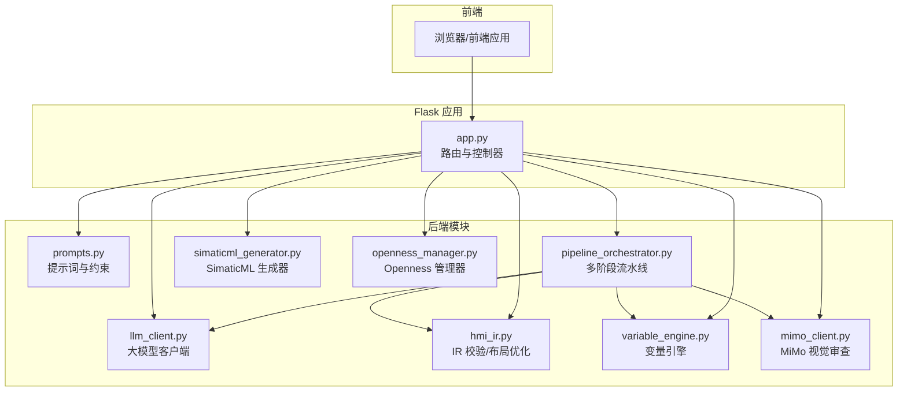
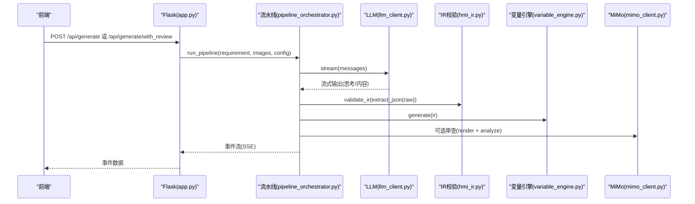
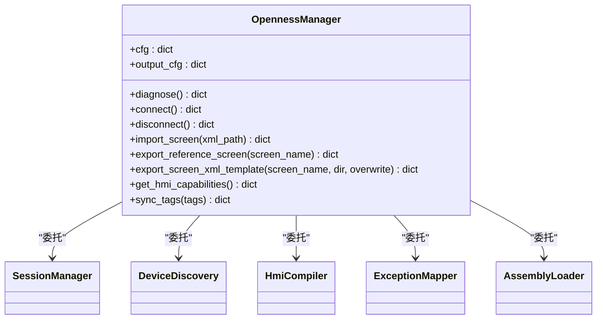
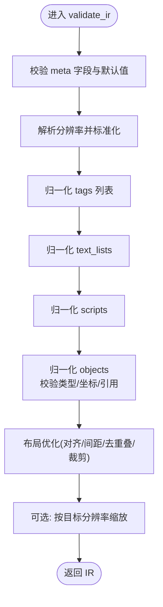
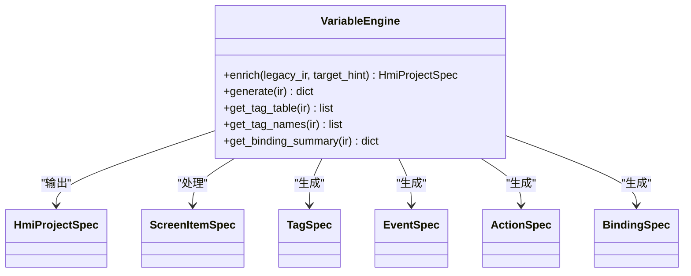
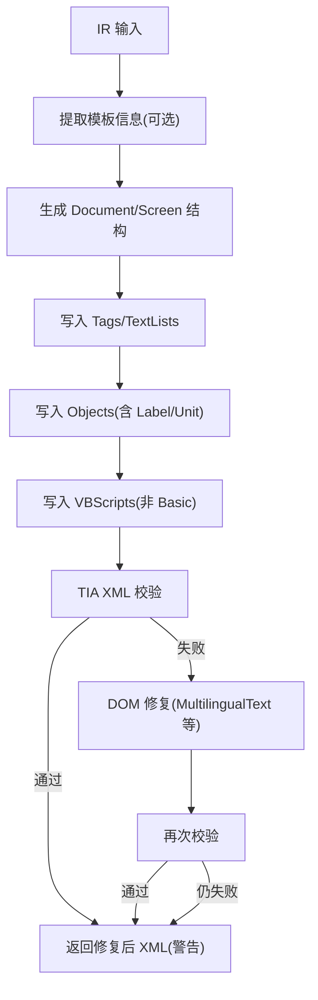
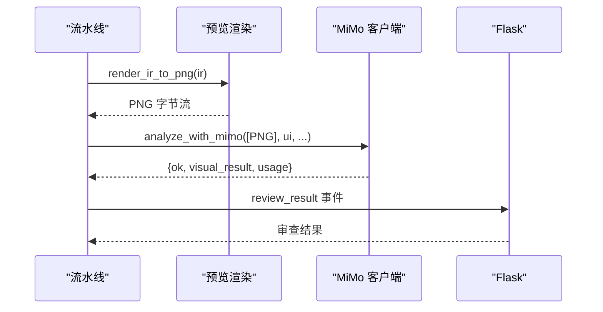
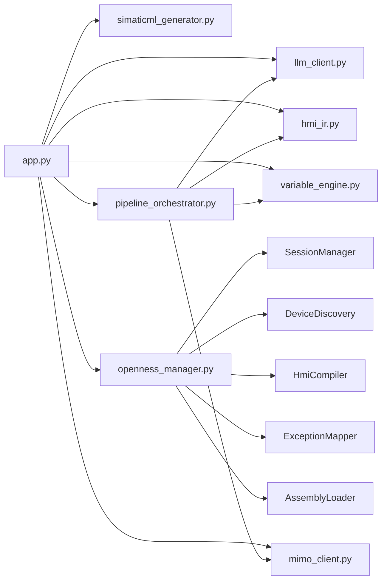

# 核心功能模块

<cite>
**本文档引用的文件**
- [app.py](file://app.py)
- [hmi_ir.py](file://backend/hmi_ir.py)
- [openness_manager.py](file://backend/openness_manager.py)
- [llm_client.py](file://backend/llm_client.py)
- [pipeline_orchestrator.py](file://backend/pipeline_orchestrator.py)
- [mimo_client.py](file://backend/mimo_client.py)
- [variable_engine.py](file://backend/variable_engine.py)
- [simaticml_generator.py](file://backend/simaticml_generator.py)
- [prompts.py](file://backend/prompts.py)
- [config.yaml](file://config.yaml)
</cite>

## 目录
1. [引言](#引言)
2. [项目结构](#项目结构)
3. [核心组件](#核心组件)
4. [架构总览](#架构总览)
5. [详细组件分析](#详细组件分析)
6. [依赖分析](#依赖分析)
7. [性能考虑](#性能考虑)
8. [故障排除指南](#故障排除指南)
9. [结论](#结论)
10. [附录](#附录)

## 引言
本文件为 Siemens HMI Assistant 的核心功能模块综合文档，围绕 AI 生成系统、Openness 集成、HMI IR 处理、三后端系统（变量引擎、SimaticML 生成器、提示词与流水线）、视觉审查系统进行深入解析。文档既面向初学者提供循序渐进的说明，也为有经验的开发者提供代码级细节、调用关系、接口定义、配置项与常见问题解决方案。

## 项目结构
项目采用“Flask 应用 + 后端模块”分层设计：
- 前端通过 HTTP API 与后端交互，后端在 backend 目录下实现具体业务逻辑。
- 关键模块包括：LLM 客户端、提示词构建、IR 校验与布局优化、变量引擎、SimaticML 生成器、Openness 管理器、MiMo 视觉审查客户端、流水线编排器等。
- 配置集中于 config.yaml，涵盖 LLM、Openness、输出、mimo 等。

图表来源
- [app.py:1-966](file://app.py#L1-L966)
- [llm_client.py:1-229](file://backend/llm_client.py#L1-L229)
- [pipeline_orchestrator.py:1-354](file://backend/pipeline_orchestrator.py#L1-L354)
- [hmi_ir.py:1-526](file://backend/hmi_ir.py#L1-L526)
- [variable_engine.py:1-847](file://backend/variable_engine.py#L1-L847)
- [simaticml_generator.py:1-702](file://backend/simaticml_generator.py#L1-L702)
- [openness_manager.py:1-2344](file://backend/openness_manager.py#L1-L2344)
- [mimo_client.py:1-324](file://backend/mimo_client.py#L1-L324)
- [prompts.py:1-400](file://backend/prompts.py#L1-L400)

章节来源
- [app.py:1-966](file://app.py#L1-L966)
- [config.yaml:1-343](file://config.yaml#L1-L343)

## 核心组件
- AI 生成系统：基于 LLM 客户端与提示词，将中文需求转换为结构化 IR（JSON），并支持“思考深度”与流式输出。
- Openness 集成：封装 TIA Portal Openness 连接、诊断、设备发现、XML 导入/导出、编译等能力。
- HMI IR 处理：对 IR 进行结构校验、默认值填充、交叉引用检查、分辨率适配与轻量布局优化。
- 变量引擎：自动推断变量命名与数据类型、事件/动作语义、绑定规则，兼容旧 IR 与新语义模型。
- SimaticML 生成器：将 IR 转换为符合 TIA 规范的 SimaticML XML，包含 MultilingualText 标准化与 DOM 修复。
- 视觉审查系统：通过 MiMo API 对 IR 预览图进行 UI 审查，支持多轮修正与阈值控制。
- 三后端系统：变量引擎、SimaticML 生成器、提示词与流水线共同构成 IR 生成与落地的闭环。

章节来源
- [llm_client.py:1-229](file://backend/llm_client.py#L1-L229)
- [prompts.py:1-400](file://backend/prompts.py#L1-L400)
- [pipeline_orchestrator.py:1-354](file://backend/pipeline_orchestrator.py#L1-L354)
- [hmi_ir.py:1-526](file://backend/hmi_ir.py#L1-L526)
- [variable_engine.py:1-847](file://backend/variable_engine.py#L1-L847)
- [simaticml_generator.py:1-702](file://backend/simaticml_generator.py#L1-L702)
- [mimo_client.py:1-324](file://backend/mimo_client.py#L1-L324)
- [openness_manager.py:1-2344](file://backend/openness_manager.py#L1-L2344)

## 架构总览
系统通过 Flask 路由接收前端请求，调用相应后端模块完成 AI 生成、IR 校验、变量绑定、SimaticML 生成、Openness 导入与编译等流程。视觉审查可选地介入生成与修正阶段，形成“生成 → 预览 → 审查 → 修正 → 再审查”的闭环。

图表来源
- [app.py:166-267](file://app.py#L166-L267)
- [pipeline_orchestrator.py:131-354](file://backend/pipeline_orchestrator.py#L131-L354)
- [llm_client.py:78-170](file://backend/llm_client.py#L78-L170)
- [hmi_ir.py:261-468](file://backend/hmi_ir.py#L261-L468)
- [variable_engine.py:198-293](file://backend/variable_engine.py#L198-L293)
- [mimo_client.py:203-324](file://backend/mimo_client.py#L203-L324)

## 详细组件分析

### AI 生成系统
- 功能要点
  - 流式输出：支持“思考过程”与“正文”两类增量输出，便于前端实时展示。
  - 思考深度：提供“关闭/低/中/高”四档，分别映射原生推理或提示词诱导。
  - JSON 抽取：从模型输出中提取首个 JSON 对象，容错处理大括号不匹配。
  - 提示词约束：通过 prompts.py 定义 IR Schema、文字/命名/布局/变量/脚本规范，确保输出工程化。
- 关键接口
  - LLMClient.stream(messages)：生成器，yield ("thinking","content","error")。
  - LLMClient.generate_sync(messages)：一次性生成，适合图片分析等场景。
  - prompts.build_messages(...)：构建系统提示词与 few-shot 示例。
- 使用模式
  - 简单生成：/api/generate → LLMClient.stream → extract_json → validate_ir → generate_simaticml。
  - 带审查生成：/api/generate/with_review → pipeline_orchestrator.run_pipeline → 多轮审查与修正。

章节来源
- [llm_client.py:1-229](file://backend/llm_client.py#L1-L229)
- [prompts.py:1-400](file://backend/prompts.py#L1-L400)
- [app.py:166-267](file://app.py#L166-L267)

### Openness 集成
- 功能要点
  - 诊断：检查操作系统、pythonnet、DLL 路径、运行进程等。
  - 连接：附加到运行中的 TIA Portal，打开项目或加载指定项目路径。
  - XML 预处理：文本清洗、MultilingualText DOM 重建、删除 <Number>、屏幕尺寸对齐、冲突检测。
  - 导入/导出：统一调用 Screens.Import，支持参考画面导出与模板 XML 导出。
  - 编译：触发 HMI 编译，支持导入后自动编译。
- 关键接口
  - OpennessManager.diagnose()/connect()/disconnect()
  - OpennessManager.import_screen()/export_reference_screen()/export_screen_xml_template()
  - OpennessManager.get_hmi_capabilities()/sync_tags()
- 使用模式
  - 先诊断，再连接，然后导入 XML 或导出参考画面，最后可选编译。

图表来源
- [openness_manager.py:31-101](file://backend/openness_manager.py#L31-L101)

章节来源
- [openness_manager.py:1-2344](file://backend/openness_manager.py#L1-L2344)
- [app.py:316-511](file://app.py#L316-L511)

### HMI IR 处理
- 功能要点
  - 结构校验：meta、tags、text_lists、objects、scripts 的字段完整性与类型检查。
  - 默认值填充：分辨率、HMI 类型、生成模式、对象尺寸与字体等。
  - 交叉引用检查：对象引用的变量/文本列表/脚本必须存在。
  - 布局优化：按屏幕尺寸与对象类型计算最小间距、对齐、去重叠、边界裁剪。
  - 分辨率适配：scale_ir_to_resolution 将 IR 坐标与尺寸按目标分辨率缩放。
- 关键接口
  - validate_ir(ir)：返回归一化 IR。
  - scale_ir_to_resolution(ir, target)：按目标分辨率缩放。
- 使用模式
  - 生成后立即校验，必要时进行布局优化与分辨率适配。

图表来源
- [hmi_ir.py:261-526](file://backend/hmi_ir.py#L261-L526)

章节来源
- [hmi_ir.py:1-526](file://backend/hmi_ir.py#L1-L526)

### 变量引擎
- 功能要点
  - 新 V3.0：enrich(legacy_ir) → HmiProjectSpec，自动推断 TagSpec、EventSpec、ActionSpec、BindingSpec。
  - 兼容旧 IR：generate(ir) 回填 process_tag、scripts、标签表等。
  - 命名规则：按钮(BTN_/MEM_)、指示灯(STS_/LMP_)、IO 域(IO_/SIO_)、文本(TXT_)。
  - 事件/动作：根据 tag_mode 推断点击/按下/释放等语义动作。
  - 数据类型推断：根据显示格式与数值特性推断 Int/Real/String 等。
- 关键接口
  - VariableEngine.enrich(legacy_ir, target_hint) → HmiProjectSpec
  - VariableEngine.generate(ir) → 修改后的 IR
  - 静态方法：get_tag_table/get_tag_names/get_binding_summary
- 使用模式
  - 在 IR 校验后调用，生成变量与绑定摘要，再进入 SimaticML 生成。

图表来源
- [variable_engine.py:106-800](file://backend/variable_engine.py#L106-L800)

章节来源
- [variable_engine.py:1-847](file://backend/variable_engine.py#L1-L847)

### SimaticML 生成器
- 功能要点
  - 将 IR 转换为带 SimaticML 命名空间的 XML，支持 Basic/Comfort/Unified。
  - MultilingualText 标准化：使用 DOM 重建，严格遵守 TIA Portal 要求。
  - DOM 修复：文本清洗、删除 <Number>、修复 MultilingualText 结构。
  - TIA XML 校验：导入前强制校验，失败时自动修复并再次校验。
- 关键接口
  - generate_simaticml(ir, tia_version, reference_xml) → str
  - validate_tia_xml(xml) → dict
  - repair_tia_xml(xml) → (repaired_xml, log)
- 使用模式
  - IR 校验与变量绑定完成后生成 XML，写入 exports 目录并返回预览数据。

图表来源
- [simaticml_generator.py:414-702](file://backend/simaticml_generator.py#L414-L702)

章节来源
- [simaticml_generator.py:1-702](file://backend/simaticml_generator.py#L1-L702)

### 视觉审查系统
- 功能要点
  - MiMo API：支持多种 output_schema（brief/detailed/ocr/chart/table/ui/drawing/compare/custom）。
  - 图像预处理：MIME 类型校验、base64/data URL 标准化、尺寸限制与等比缩放。
  - 审查结果：分数、类别、关键问题、建议、摘要等，支持阈值判定与多轮修正。
- 关键接口
  - analyze_with_mimo(images, task, output_schema, config, language) → dict
- 使用模式
  - 在生成后渲染 PNG，调用 MiMo 进行 UI 审查，根据结果修正 IR 并再次审查。

图表来源
- [pipeline_orchestrator.py:98-129](file://backend/pipeline_orchestrator.py#L98-L129)
- [mimo_client.py:203-324](file://backend/mimo_client.py#L203-L324)

章节来源
- [mimo_client.py:1-324](file://backend/mimo_client.py#L1-L324)
- [pipeline_orchestrator.py:1-354](file://backend/pipeline_orchestrator.py#L1-L354)

### 三后端系统（变量引擎、SimaticML 生成器、提示词与流水线）
- 变量引擎：在 IR 校验后自动推断变量与绑定，兼容新旧 IR。
- SimaticML 生成器：将 IR 转换为 TIA 兼容 XML，严格遵循 MultilingualText 标准。
- 提示词与流水线：通过 prompts.py 定义工程化约束，pipeline_orchestrator.py 组织生成、审查、修正流程。

章节来源
- [variable_engine.py:1-847](file://backend/variable_engine.py#L1-L847)
- [simaticml_generator.py:1-702](file://backend/simaticml_generator.py#L1-L702)
- [prompts.py:1-400](file://backend/prompts.py#L1-L400)
- [pipeline_orchestrator.py:1-354](file://backend/pipeline_orchestrator.py#L1-L354)

## 依赖分析
- 组件耦合
  - app.py 作为入口，依赖 config_manager、llm_client、hmi_ir、simaticml_generator、openness_manager、pipeline_orchestrator、variable_engine 等。
  - pipeline_orchestrator 依赖 llm_client、hmi_ir、variable_engine、mimo_client、preview_renderer 等。
  - openness_manager 内部委托 SessionManager、DeviceDiscovery、HmiCompiler、ExceptionMapper、AssemblyLoader。
- 外部依赖
  - pythonnet（Windows + TIA Openness）
  - requests（LLM/MiMo API）
  - xml.etree.ElementTree（XML DOM 操作）
  - pillow（图像缩放，可选）

图表来源
- [app.py:26-40](file://app.py#L26-L40)
- [openness_manager.py:52-101](file://backend/openness_manager.py#L52-L101)
- [pipeline_orchestrator.py:23-31](file://backend/pipeline_orchestrator.py#L23-L31)

章节来源
- [app.py:1-966](file://app.py#L1-L966)
- [openness_manager.py:1-2344](file://backend/openness_manager.py#L1-L2344)

## 性能考虑
- 流式生成：LLMClient.stream 支持边生成边消费，降低前端等待时间。
- 图像审查：MiMo 图像分析默认最多 3 张图片，避免 token 爆炸；支持最大尺寸限制与等比缩放。
- XML 生成：DOM 重建与修复避免字符串修补，提高稳定性与性能。
- Openness 导入：预处理阶段统一清洗与对齐，减少导入失败与 TIA 崩溃风险。

## 故障排除指南
- LLM 未配置 API Key
  - 现象：生成阶段返回 error。
  - 处理：在配置中填写 llm.providers.<provider>.api_key。
- MiMo 未配置或鉴权失败
  - 现象：审查阶段返回 error_type="auth" 或 "api"。
  - 处理：在 config.yaml 中填写 mimo.api_key 与 base_url，检查网络与超时设置。
- Openness 环境不满足
  - 现象：diagnose 返回 ready=false，提示缺少 pythonnet/DLL/权限。
  - 处理：安装 pythonnet，确认 Siemens.Engineering.dll 路径正确，加入 Siemens TIA Openness 用户组。
- XML 导入失败
  - 现象：导入报错或 TIA 崩溃。
  - 处理：使用 repair_tia_xml 或导入前的预处理流程，确保 MultilingualText 标准化、删除 <Number>、屏幕尺寸对齐。
- 生成后 IR 不合规
  - 现象：validate_ir 抛出 IRValidationError。
  - 处理：检查 objects/tags/text_lists/scripts 的交叉引用与字段完整性；必要时启用视觉审查进行多轮修正。

章节来源
- [llm_client.py:82-104](file://backend/llm_client.py#L82-L104)
- [mimo_client.py:224-324](file://backend/mimo_client.py#L224-L324)
- [openness_manager.py:103-139](file://backend/openness_manager.py#L103-L139)
- [simaticml_generator.py:569-636](file://backend/simaticml_generator.py#L569-L636)
- [hmi_ir.py:40-47](file://backend/hmi_ir.py#L40-L47)

## 结论
Siemens HMI Assistant 通过模块化设计将 AI 生成、IR 校验、变量绑定、SimaticML 生成、Openness 集成与视觉审查有机整合，形成从需求到工程可交付 XML 的完整流水线。系统在工程化约束、跨版本兼容与导入稳定性方面做了充分设计，既适合快速原型开发，也能满足工业级项目的质量要求。

## 附录
- 配置项概览（摘自 config.yaml）
  - llm.active_provider、thinking_depth、providers.*、stream、show_thinking
  - openness.dll_path、attach_running、project_path、hmi_device、target_resolution、auto_scale_screen_items、compile_after_import、generation_mode、classic_template.*、unified_direct.*
  - hmi_defaults.resolution、hmi_type、背景色、字体
  - output.export_dir、encoding、reference_xml
  - mimo.enabled、api_key、base_url、model、max_iterations、review_timeout_seconds、review_pass_threshold、image_analysis_enabled、image_analysis_max_size
  - server.host、port、debug

章节来源
- [config.yaml:1-343](file://config.yaml#L1-L343)