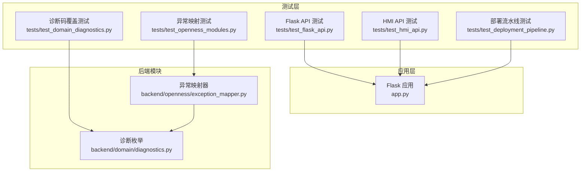
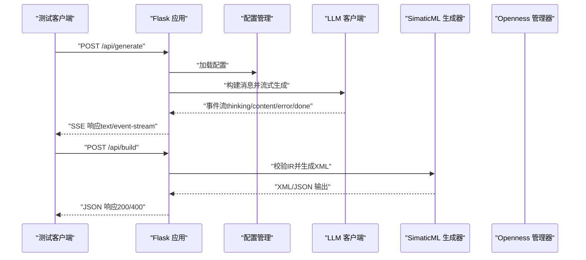
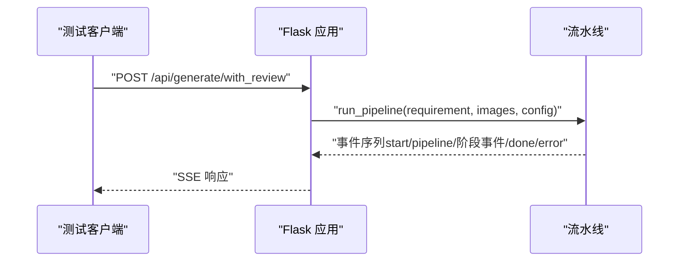
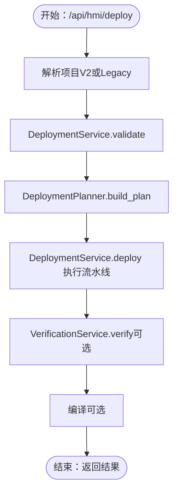
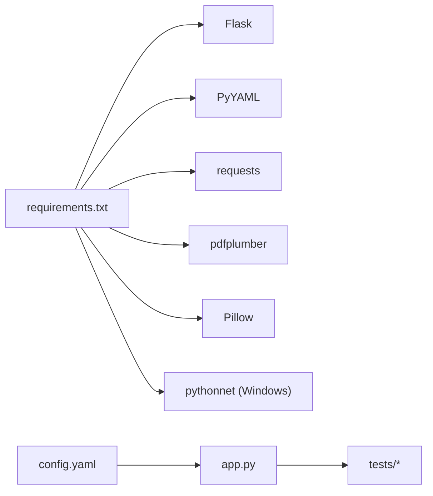

# API测试

<cite>
**本文档引用的文件**
- [app.py](file://app.py)
- [requirements.txt](file://requirements.txt)
- [config.yaml](file://config.yaml)
- [test_flask_api.py](file://tests/test_flask_api.py)
- [test_hmi_api.py](file://tests/test_hmi_api.py)
- [test_deployment_pipeline.py](file://tests/test_deployment_pipeline.py)
- [test_openness_modules.py](file://tests/test_openness_modules.py)
- [test_domain_diagnostics.py](file://tests/test_domain_diagnostics.py)
- [exception_mapper.py](file://backend/openness/exception_mapper.py)
- [diagnostics.py](file://backend/domain/diagnostics.py)
</cite>

## 目录
1. [简介](#简介)
2. [项目结构](#项目结构)
3. [核心组件](#核心组件)
4. [架构总览](#架构总览)
5. [详细组件分析](#详细组件分析)
6. [依赖分析](#依赖分析)
7. [性能考虑](#性能考虑)
8. [故障排除指南](#故障排除指南)
9. [结论](#结论)
10. [附录](#附录)

## 简介
本指南面向使用Flask框架的Siemens HMI Assistant项目，系统讲解如何对RESTful API进行测试，涵盖以下方面：
- API测试配置与环境准备
- 配置API与HMI生成API的测试策略
- HTTP请求构造、响应验证与状态码检查
- 测试数据准备、错误处理测试与性能测试
- 使用pytest进行API自动化测试
- 安全性与可靠性验证
- 具体测试用例示例与调试技巧

## 项目结构
该项目采用Flask主程序与后端业务逻辑分离的结构，API端点集中在主程序中，测试用例位于tests目录。关键文件如下：
- 应用入口与API定义：app.py
- 依赖声明：requirements.txt
- 默认配置：config.yaml
- API测试套件：tests/test_flask_api.py、tests/test_hmi_api.py、tests/test_deployment_pipeline.py
- 异常映射与诊断：backend/openness/exception_mapper.py、backend/domain/diagnostics.py

图表来源
- [app.py:1-966](file://app.py#L1-L966)
- [test_flask_api.py:1-147](file://tests/test_flask_api.py#L1-L147)
- [test_hmi_api.py:1-159](file://tests/test_hmi_api.py#L1-L159)
- [test_deployment_pipeline.py:1-406](file://tests/test_deployment_pipeline.py#L1-L406)
- [exception_mapper.py:1-39](file://backend/openness/exception_mapper.py#L1-L39)
- [diagnostics.py:79-103](file://backend/domain/diagnostics.py#L79-L103)

章节来源
- [app.py:1-966](file://app.py#L1-L966)
- [requirements.txt:1-25](file://requirements.txt#L1-L25)
- [config.yaml:1-343](file://config.yaml#L1-L343)

## 核心组件
- Flask应用与路由：提供配置管理、HMI生成、Openness集成、HMI部署计划与能力查询等REST端点。
- 测试客户端：基于pytest与Flask test client，模拟HTTP请求并断言响应。
- 异常映射与诊断：将底层异常转换为结构化诊断码，便于测试断言与用户反馈。

章节来源
- [app.py:84-630](file://app.py#L84-L630)
- [test_flask_api.py:13-147](file://tests/test_flask_api.py#L13-L147)
- [test_hmi_api.py:13-159](file://tests/test_hmi_api.py#L13-L159)
- [exception_mapper.py:20-39](file://backend/openness/exception_mapper.py#L20-L39)
- [diagnostics.py:79-103](file://backend/domain/diagnostics.py#L79-L103)

## 架构总览
API测试围绕以下层次展开：
- 表现层：Flask路由与视图函数
- 业务层：配置管理、LLM生成、SimaticML生成、Openness集成、部署计划与验证
- 测试层：pytest测试用例，覆盖端点行为、错误处理与边界条件

图表来源
- [app.py:166-310](file://app.py#L166-L310)
- [test_flask_api.py:117-132](file://tests/test_flask_api.py#L117-L132)

## 详细组件分析

### 配置API测试
- 端点：GET /api/config、POST /api/config、POST /api/config/raw
- 测试要点：
  - GET返回结构化配置与原始YAML
  - POST保存结构化配置，异常时返回400
  - POST保存原始YAML，异常时返回400
- 断言：状态码、响应键存在性、错误信息

章节来源
- [app.py:84-109](file://app.py#L84-L109)
- [test_flask_api.py:21-40](file://tests/test_flask_api.py#L21-L40)

### HMI生成API测试
- 端点：POST /api/generate、POST /api/generate/with_review、POST /api/build
- 测试要点：
  - /api/generate：支持multipart/form-data与JSON；空需求返回400；SSE事件流验证
  - /api/generate/with_review：带MiMo审查的多阶段流水线；SSE事件流验证
  - /api/build：校验IR并生成XML/JSON；无效IR返回400
- 断言：状态码、事件类型、内容片段、路径与警告

图表来源
- [app.py:225-266](file://app.py#L225-L266)
- [test_flask_api.py:133-147](file://tests/test_flask_api.py#L133-L147)

章节来源
- [app.py:166-310](file://app.py#L166-L310)
- [test_flask_api.py:96-147](file://tests/test_flask_api.py#L96-L147)

### Openness集成API测试
- 端点：GET /api/openness/diagnose、GET /api/openness/status、GET /api/tia/status、POST /api/openness/connect、POST /api/openness/export-reference、GET /api/openness/capabilities、POST /api/openness/export-template、POST /api/build/template-xml、POST /api/openness/import、POST /api/openness/sync-tags、POST /api/openness/disconnect
- 测试要点：
  - 诊断与状态：返回JSON，兼容旧端点
  - 模板导出：空screen_name处理；无效路径返回400
  - IR导入：新模式接受IR+mode；旧模式生成XML后再导入
  - 同步标签：空数组返回400
- 断言：状态码集合（200/400/500）、JSON键存在性

章节来源
- [app.py:316-511](file://app.py#L316-L511)
- [test_flask_api.py:41-94](file://tests/test_flask_api.py#L41-L94)

### HMI部署与能力API测试
- 端点：POST /api/hmi/plan、GET /api/hmi/capabilities、GET /api/hmi/runtime-metadata、POST /api/hmi/validate、POST /api/hmi/deploy、POST /api/hmi/verify
- 测试要点：
  - /api/hmi/plan：缺少project返回400；最小项目可生成计划；无效JSON返回400
  - /api/hmi/capabilities：默认与参数查询；返回能力矩阵与运行时信息
  - /api/hmi/runtime-metadata：未连接时也返回JSON
  - /api/hmi/validate：校验HmiProjectSpec；重复标签拒绝
  - /api/hmi/deploy：按family路由到不同后端；dry_run与连接状态边界
  - /api/hmi/verify：部署后验证
- 断言：ok字段、计划步骤数量、family路由、诊断码

图表来源
- [app.py:517-761](file://app.py#L517-L761)
- [test_hmi_api.py:20-159](file://tests/test_hmi_api.py#L20-L159)
- [test_deployment_pipeline.py:171-200](file://tests/test_deployment_pipeline.py#L171-L200)

章节来源
- [app.py:517-761](file://app.py#L517-L761)
- [test_hmi_api.py:20-159](file://tests/test_hmi_api.py#L20-L159)
- [test_deployment_pipeline.py:171-200](file://tests/test_deployment_pipeline.py#L171-L200)

### 异常映射与诊断测试
- 异常映射器：将.NET异常映射为标准诊断码，包含修复建议
- 诊断枚举：覆盖验证、部署、编译、脚本等各类错误码
- 测试要点：异常映射覆盖度、诊断码可访问性、错误码与阶段关联

章节来源
- [exception_mapper.py:20-39](file://backend/openness/exception_mapper.py#L20-L39)
- [diagnostics.py:79-103](file://backend/domain/diagnostics.py#L79-L103)
- [test_openness_modules.py:72-100](file://tests/test_openness_modules.py#L72-L100)
- [test_domain_diagnostics.py:67-104](file://tests/test_domain_diagnostics.py#L67-L104)

## 依赖分析
- Flask应用依赖：Flask、PyYAML、requests、pdfplumber、Pillow、pythonnet（Windows）
- 测试依赖：pytest、Flask test client
- 配置：config.yaml提供LLM、Openness、输出等默认设置

图表来源
- [requirements.txt:1-25](file://requirements.txt#L1-L25)
- [config.yaml:1-343](file://config.yaml#L1-L343)

章节来源
- [requirements.txt:1-25](file://requirements.txt#L1-L25)
- [config.yaml:1-343](file://config.yaml#L1-L343)

## 性能考虑
- SSE流式响应：使用text/event-stream，注意客户端读取缓冲与超时处理
- 大模型调用：启用流式输出，减少单次响应延迟
- 文件上传：multipart/form-data支持PDF与图片解析，注意内存与I/O限制
- Openness操作：连接与导入可能耗时较长，建议异步化与进度反馈

## 故障排除指南
- 状态码断言：优先断言状态码集合而非单一值，以适配不同环境（未连接、无权限等）
- JSON响应：始终断言必需键存在，避免字段缺失导致的后续断言失败
- 异常映射：关注诊断码与阶段信息，便于定位问题环节
- 配置问题：检查config.yaml中的LLM与Openness配置，确保可用性

章节来源
- [test_flask_api.py:60-94](file://tests/test_flask_api.py#L60-L94)
- [test_hmi_api.py:133-159](file://tests/test_hmi_api.py#L133-L159)
- [exception_mapper.py:28-39](file://backend/openness/exception_mapper.py#L28-L39)

## 结论
本指南提供了针对Siemens HMI Assistant的API测试方法论与实践路径，覆盖配置、生成、Openness集成与HMI部署等核心功能。通过pytest与Flask test client，结合异常映射与诊断机制，可以系统地验证API的正确性、健壮性与可维护性。

## 附录

### API测试最佳实践清单
- 请求构造
  - 使用multipart/form-data测试文件上传场景
  - 使用application/json测试纯文本场景
  - 设置Content-Type与Accept头
- 响应验证
  - 断言状态码集合（200/400/500）
  - 断言JSON键存在性与类型
  - 对SSE事件流进行事件类型与内容片段断言
- 错误处理测试
  - 缺少必要字段返回400
  - 无效输入返回400
  - 未连接或无权限返回相应状态码
- 性能测试
  - 使用SSE流式响应时监控缓冲与超时
  - 对大文件上传与长耗时操作进行超时与重试策略
- 安全性与可靠性
  - 配置文件与密钥管理
  - 诊断码与错误信息脱敏
  - 异常映射与日志记录

### 具体测试用例示例（路径引用）
- 配置API
  - [GET /api/config:24-30](file://tests/test_flask_api.py#L24-L30)
  - [POST /api/config:91-94](file://tests/test_flask_api.py#L91-L94)
  - [POST /api/config/raw:101-109](file://tests/test_flask_api.py#L101-L109)
- HMI生成API
  - [/api/generate:117-132](file://tests/test_flask_api.py#L117-L132)
  - [/api/generate/with_review:133-147](file://tests/test_flask_api.py#L133-L147)
  - [/api/build:117-132](file://tests/test_flask_api.py#L117-L132)
- Openness集成API
  - [/api/openness/capabilities:44-52](file://tests/test_flask_api.py#L44-L52)
  - [/api/openness/export-template:60-71](file://tests/test_flask_api.py#L60-L71)
  - [/api/openness/import:133-147](file://tests/test_flask_api.py#L133-L147)
- HMI部署与能力API
  - [/api/hmi/plan:23-32](file://tests/test_hmi_api.py#L23-L32)
  - [/api/hmi/capabilities:133-148](file://tests/test_hmi_api.py#L133-L148)
  - [/api/hmi/validate:324-331](file://tests/test_deployment_pipeline.py#L324-L331)
  - [/api/hmi/deploy:379-393](file://tests/test_deployment_pipeline.py#L379-L393)

### 调试技巧
- 使用pytest的-v与--tb=long查看详细回溯
- 在本地启动Flask应用，使用curl或Postman验证端点
- 关注SSE事件流的事件类型与数据结构
- 对Openness相关端点，先运行诊断端点确认连接状态