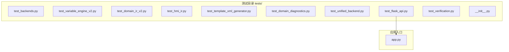
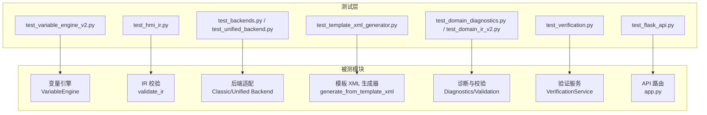
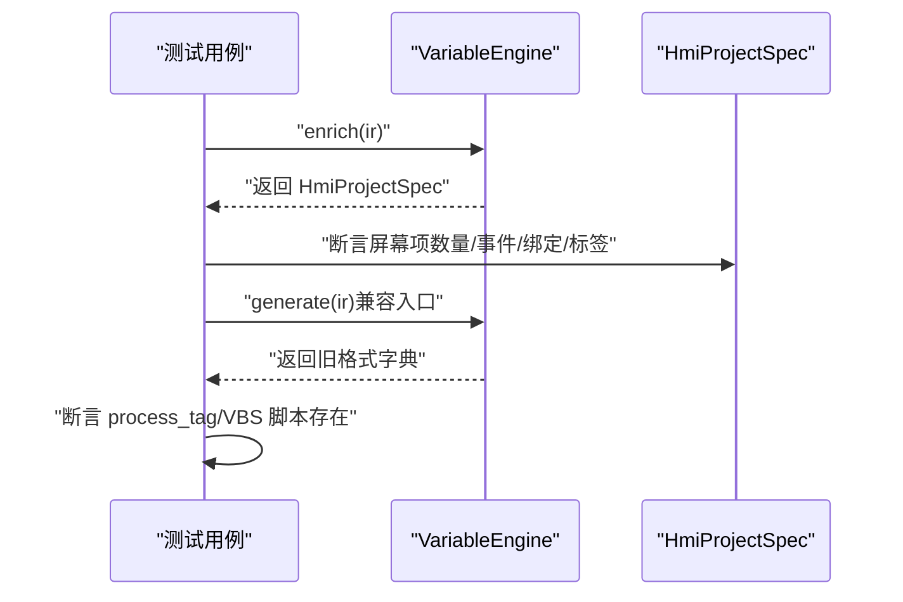
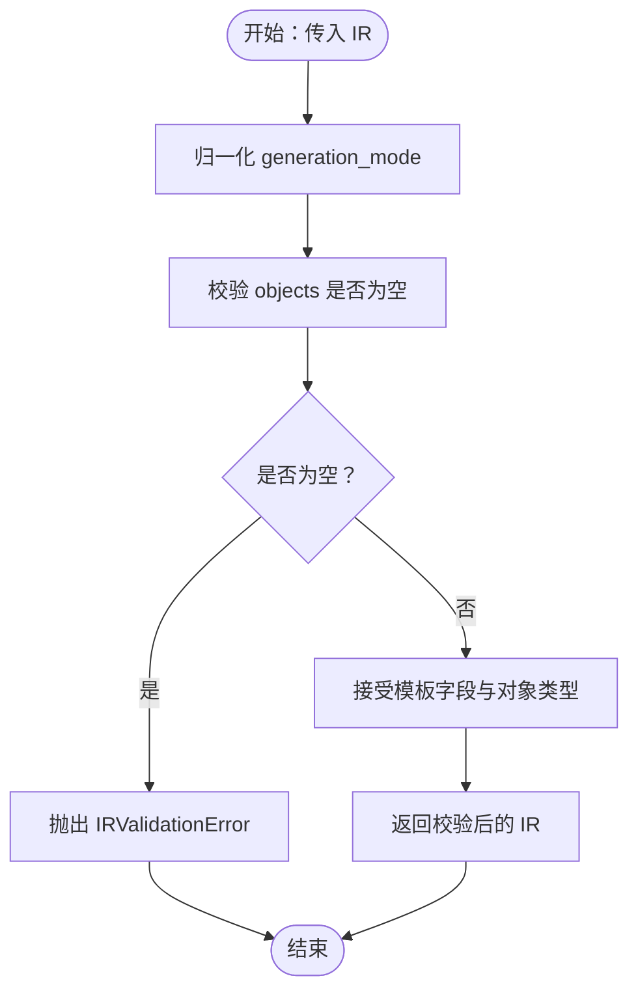
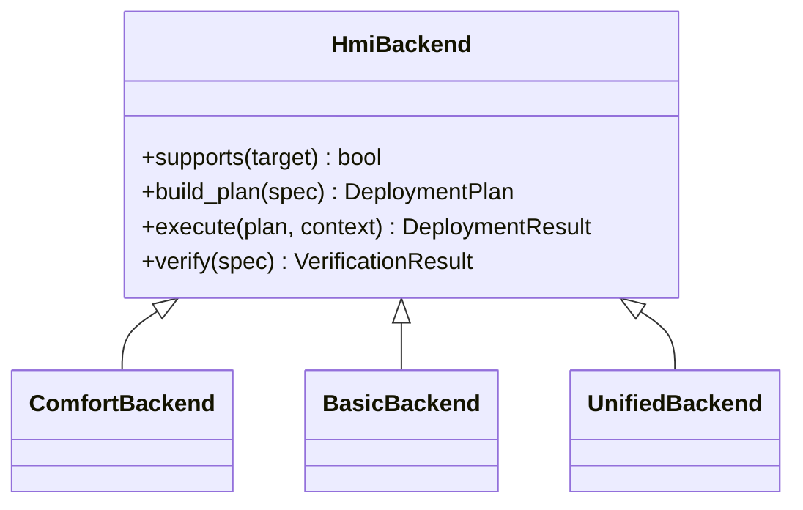
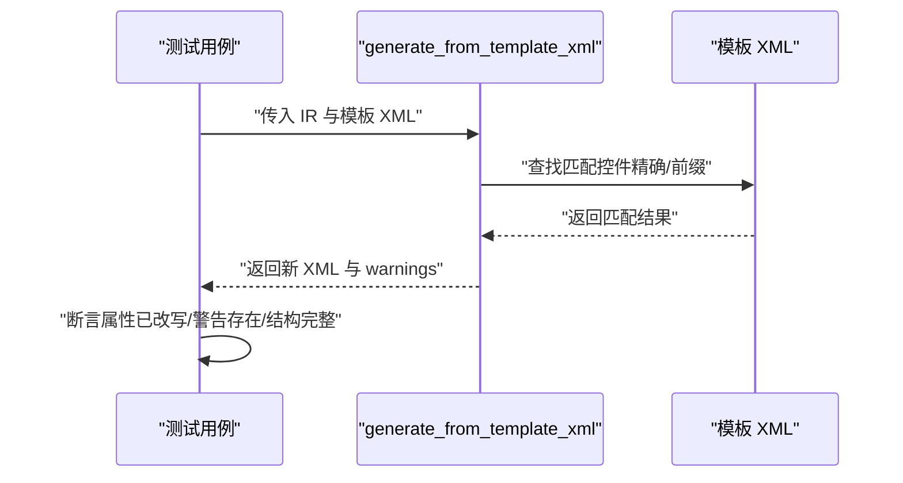
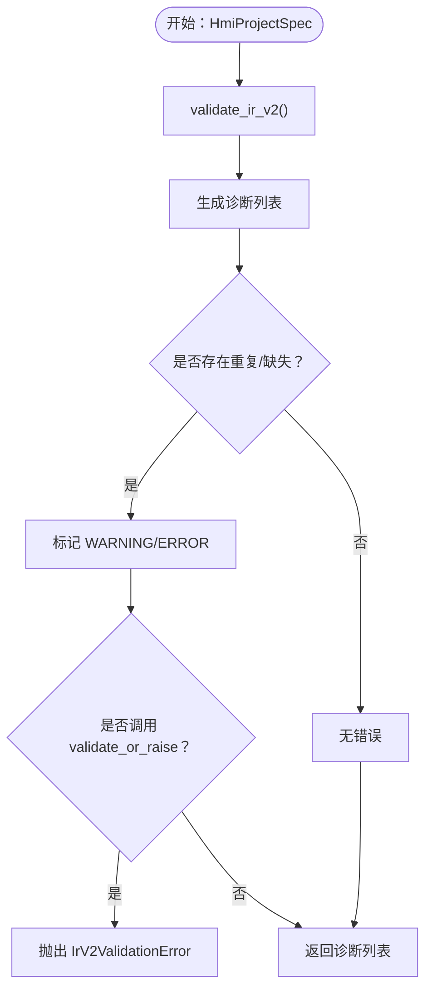
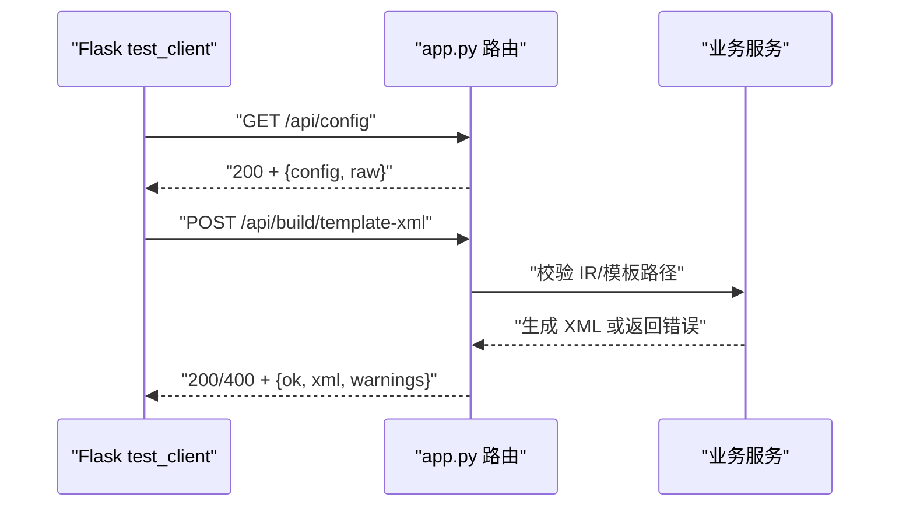
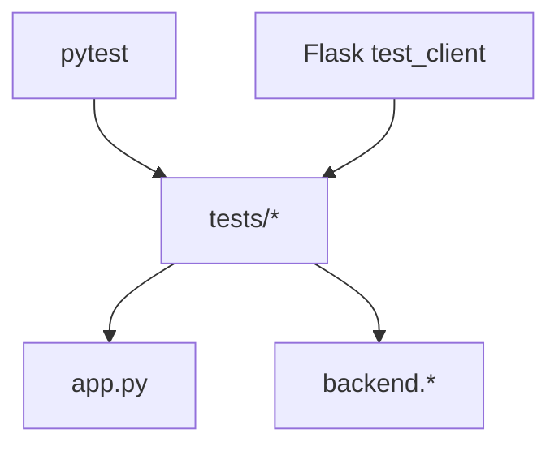

# 单元测试

<cite>
**本文档引用的文件**
- [tests/__init__.py](file://tests/__init__.py)
- [requirements.txt](file://requirements.txt)
- [app.py](file://app.py)
- [tests/test_backends.py](file://tests/test_backends.py)
- [tests/test_variable_engine_v2.py](file://tests/test_variable_engine_v2.py)
- [tests/test_domain_ir_v2.py](file://tests/test_domain_ir_v2.py)
- [tests/test_hmi_ir.py](file://tests/test_hmi_ir.py)
- [tests/test_template_xml_generator.py](file://tests/test_template_xml_generator.py)
- [tests/test_domain_diagnostics.py](file://tests/test_domain_diagnostics.py)
- [tests/test_unified_backend.py](file://tests/test_unified_backend.py)
- [tests/test_flask_api.py](file://tests/test_flask_api.py)
- [tests/test_verification.py](file://tests/test_verification.py)
- [.claude/settings.local.json](file://.claude/settings.local.json)
</cite>

## 目录
1. [简介](#简介)
2. [项目结构](#项目结构)
3. [核心组件](#核心组件)
4. [架构总览](#架构总览)
5. [详细组件分析](#详细组件分析)
6. [依赖分析](#依赖分析)
7. [性能考虑](#性能考虑)
8. [故障排查指南](#故障排查指南)
9. [结论](#结论)
10. [附录](#附录)

## 简介
本指南面向开发者，系统讲解如何在本项目中编写与运行单元测试，涵盖测试框架使用、测试设计原则、Mock 对象策略、各模块测试策略（后端、变量引擎、IR 模型、诊断、模板生成器等）、测试数据准备、断言方法、测试覆盖率分析以及最佳实践与常见模式。文档基于仓库内现有测试文件进行归纳总结，帮助你快速上手并编写高质量的单元测试。

## 项目结构
测试相关代码集中在 tests/ 目录，采用“按功能模块划分”的组织方式，每个模块对应一个独立的测试文件，便于维护与扩展。同时，根目录提供了 Flask API 的端到端测试示例，展示了如何使用 Flask test client 进行集成测试。

图表来源
- [tests/test_flask_api.py:1-147](file://tests/test_flask_api.py#L1-L147)
- [app.py:1-966](file://app.py#L1-L966)

章节来源
- [tests/__init__.py:1-2](file://tests/__init__.py#L1-L2)
- [requirements.txt:1-25](file://requirements.txt#L1-L25)

## 核心组件
- 测试框架与运行环境
  - 使用 pytest 作为测试框架，配合 Flask test client 进行 API 测试。
  - 通过 .claude/settings.local.json 中的 Bash 命令示例可见，常用命令包括运行单个测试文件、全量测试、带详细回溯信息的测试等。
- 测试数据与夹具
  - 大多数测试通过构造最小可用的 IR/Spec 数据结构进行断言，避免外部依赖。
  - 部分测试使用了共享的构造函数（fixtures）来复用测试数据，例如按钮 IR、电机控制 IR 等。
- 断言与错误处理
  - 使用 pytest 的断言机制，结合自定义异常类型（如 IRValidationError、IrV2ValidationError）进行错误路径验证。
  - 对于 API 测试，断言 HTTP 状态码与响应 JSON 结构，确保接口稳定性。

章节来源
- [tests/test_flask_api.py:1-147](file://tests/test_flask_api.py#L1-L147)
- [.claude/settings.local.json:22-34](file://.claude/settings.local.json#L22-L34)

## 架构总览
下图展示了测试与被测模块之间的交互关系，重点体现“模块内测试”和“API 集成测试”的分工：

图表来源
- [tests/test_variable_engine_v2.py:1-353](file://tests/test_variable_engine_v2.py#L1-L353)
- [tests/test_hmi_ir.py:1-115](file://tests/test_hmi_ir.py#L1-L115)
- [tests/test_backends.py:1-126](file://tests/test_backends.py#L1-L126)
- [tests/test_unified_backend.py:1-205](file://tests/test_unified_backend.py#L1-L205)
- [tests/test_template_xml_generator.py:1-183](file://tests/test_template_xml_generator.py#L1-L183)
- [tests/test_domain_diagnostics.py:1-334](file://tests/test_domain_diagnostics.py#L1-L334)
- [tests/test_verification.py:1-121](file://tests/test_verification.py#L1-L121)
- [tests/test_flask_api.py:1-147](file://tests/test_flask_api.py#L1-L147)
- [app.py:1-966](file://app.py#L1-L966)

## 详细组件分析

### 变量引擎测试（VariableEngine）
- 测试目标
  - 验证 enrich() 生成 HmiProjectSpec 的正确性与语义化行为（按钮模式识别、指示器绑定、IOField 变量生成等）。
  - 验证 generate() 旧兼容入口的行为与向后兼容性。
  - 验证静态工具方法（标签表、绑定摘要等）。
- 关键测试点
  - 按钮的 momentary/toggle 行为映射为语义动作。
  - Indicator 的离散颜色与闪烁绑定。
  - IOField 的变量推断与数据类型选择。
  - 保留用户自定义 process_tag，不覆盖已有绑定。
  - generate() 生成 VBS 脚本与兼容性。
- Mock 与夹具
  - 使用共享构造函数生成最小 IR 数据，避免重复。
  - 通过断言 HmiProjectSpec 的字段与枚举值，确保语义正确。
- 断言方法
  - 断言对象数量、事件/动作类型、绑定种类与配置、标签数据类型等。
- 最佳实践
  - 优先使用 Pydantic 模型断言，确保结构与类型一致。
  - 对边界条件（空对象、toggle 文本关键词）进行覆盖。

图表来源
- [tests/test_variable_engine_v2.py:65-302](file://tests/test_variable_engine_v2.py#L65-L302)

章节来源
- [tests/test_variable_engine_v2.py:1-353](file://tests/test_variable_engine_v2.py#L1-L353)

### IR 校验模块测试（validate_ir）
- 测试目标
  - 验证 IR 校验逻辑对 generation_mode、模板字段、对象类型的支持与默认值处理。
  - 验证错误输入的异常抛出与错误信息。
- 关键测试点
  - generation_mode 的接受与默认 fallback。
  - 模板相关字段的保留与传递。
  - 所有对象类型的校验通过。
  - 空 objects 的异常处理。
- 断言方法
  - 使用 pytest.raises 验证异常类型与消息。
  - 对返回 IR 的 meta/objects 字段进行断言。

图表来源
- [tests/test_hmi_ir.py:12-115](file://tests/test_hmi_ir.py#L12-L115)

章节来源
- [tests/test_hmi_ir.py:1-115](file://tests/test_hmi_ir.py#L1-L115)

### 后端测试（Classic/Unified Backend）
- 测试目标
  - 验证后端支持性判断、部署计划构建、执行与验证流程。
  - 验证安全策略（如 VBS 脚本安全扫描）。
- 关键测试点
  - supports() 与不支持场景的断言。
  - build_plan()/execute()/verify() 的返回类型与状态。
  - VBS/JavaScript 安全扫描拒绝危险代码。
- Mock 与夹具
  - 使用 HmiProjectSpec 与 TargetSpec 构造最小项目。
  - 使用 DeploymentPlan/DeploymentResult/VerificationResult 进行断言。
- 断言方法
  - 断言状态码、返回对象类型、警告集合等。

图表来源
- [tests/test_backends.py:38-126](file://tests/test_backends.py#L38-L126)
- [tests/test_unified_backend.py:173-205](file://tests/test_unified_backend.py#L173-L205)

章节来源
- [tests/test_backends.py:1-126](file://tests/test_backends.py#L1-L126)
- [tests/test_unified_backend.py:1-205](file://tests/test_unified_backend.py#L1-L205)

### 模板 XML 生成器测试
- 测试目标
  - 验证模板改写逻辑：画面名、文本、坐标、变量连接等属性的替换。
  - 验证未匹配控件的警告、命名空间保留、结构完整性、重复引用等。
- 关键测试点
  - 通过 template_ref 匹配模板控件并改写属性。
  - 未匹配控件返回 warning。
  - XML 结构与命名空间保持原样。
- Mock 与夹具
  - 使用最小模板 XML 与 make_ir 构造 IR。
- 断言方法
  - 断言改写后的 XML 片段与警告集合。

图表来源
- [tests/test_template_xml_generator.py:91-183](file://tests/test_template_xml_generator.py#L91-L183)

章节来源
- [tests/test_template_xml_generator.py:1-183](file://tests/test_template_xml_generator.py#L1-L183)

### 诊断与校验模型测试
- 测试目标
  - 验证诊断模型的序列化、错误码覆盖与校验规则。
  - 验证 validate_ir_v2 对重复名、缺失引用、事件/绑定/脚本引用等的处理。
- 关键测试点
  - Diagnostic 模型字段与默认严重级别。
  - validate_ir_v2 对重复标签名、重复画面名、缺失标签/脚本/画面的警告与错误。
  - validate_or_raise 在错误时抛出异常。
- 断言方法
  - 断言诊断列表长度、严重级别、错误码与消息内容。

图表来源
- [tests/test_domain_diagnostics.py:94-334](file://tests/test_domain_diagnostics.py#L94-L334)

章节来源
- [tests/test_domain_diagnostics.py:1-334](file://tests/test_domain_diagnostics.py#L1-L334)
- [tests/test_domain_ir_v2.py:1-312](file://tests/test_domain_ir_v2.py#L1-L312)

### 验证服务与目录服务测试
- 测试目标
  - 验证 VerificationService 的标签/画面/事件/绑定/脚本/编译验证逻辑。
  - 验证 CatalogService 的清单加载、查找与校验。
- 关键测试点
  - verify_* 方法对缺失项的断言。
  - verify_full 对完整场景的综合验证。
  - CatalogService 加载与查找行为。
- 断言方法
  - 断言 failed 列表、found 计数、success 标志等。

章节来源
- [tests/test_verification.py:1-121](file://tests/test_verification.py#L1-L121)

### Flask API 测试
- 测试目标
  - 使用 Flask test client 验证路由返回的 JSON 结构与状态码。
  - 验证错误场景（如无效模板路径、未连接 TIA）的健壮性。
- 关键测试点
  - 配置、能力、诊断、模板导出、参考导出、构建、导入等端点。
  - 兼容旧端点（/api/openness/status 与 /api/tia/status）。
- 断言方法
  - 断言状态码与 JSON 字段存在性。

图表来源
- [tests/test_flask_api.py:1-147](file://tests/test_flask_api.py#L1-L147)
- [app.py:1-966](file://app.py#L1-L966)

章节来源
- [tests/test_flask_api.py:1-147](file://tests/test_flask_api.py#L1-L147)

## 依赖分析
- 测试框架与工具链
  - pytest：用于运行测试、断言与参数化。
  - Flask test client：用于 API 集成测试。
  - Bash 命令：在 .claude/settings.local.json 中提供测试运行示例。
- 模块耦合与内聚
  - 各模块测试相对独立，主要通过公共的数据模型（如 HmiProjectSpec、TargetSpec、Diagnostic 等）进行交互。
  - API 测试与业务模块解耦，通过 app.py 路由间接调用业务逻辑。

图表来源
- [.claude/settings.local.json:22-34](file://.claude/settings.local.json#L22-L34)
- [requirements.txt:1-25](file://requirements.txt#L1-L25)

章节来源
- [.claude/settings.local.json:22-34](file://.claude/settings.local.json#L22-L34)
- [requirements.txt:1-25](file://requirements.txt#L1-L25)

## 性能考虑
- 测试运行效率
  - 使用 pytest 的并行运行与分组策略，减少测试时间。
  - 避免在测试中进行网络或磁盘 I/O，必要时使用内存数据或临时文件。
- 覆盖率与回归
  - 通过最小 IR/Spec 构造减少测试数据体积，提升执行速度。
  - 对关键分支（如安全扫描、错误路径）进行重点覆盖。

## 故障排查指南
- 常见问题
  - 生成 IR 后未通过校验：检查 generation_mode、模板字段与对象类型是否符合规范。
  - 模板改写失败：确认 template_ref 是否与模板控件名称匹配，或使用前缀匹配。
  - 后端执行报错：检查支持性判断与部署计划构建是否正确。
  - API 返回 500：确认端点参数与配置是否有效，查看日志与警告。
- 定位手段
  - 使用 pytest --tb=long 查看详细回溯。
  - 在 API 测试中打印响应 JSON，核对字段与状态码。
  - 对诊断与校验模块，逐条断言诊断列表内容。

章节来源
- [.claude/settings.local.json:22-34](file://.claude/settings.local.json#L22-L34)
- [tests/test_flask_api.py:1-147](file://tests/test_flask_api.py#L1-L147)
- [tests/test_template_xml_generator.py:169-175](file://tests/test_template_xml_generator.py#L169-L175)

## 结论
本项目测试体系覆盖了核心业务模块与 API 端点，采用“模块内测试 + API 集成测试”的组合策略，既保证了单元级的稳定性，也确保了端到端的可用性。遵循本文档的测试设计原则与最佳实践，可以持续提升测试质量与开发效率。

## 附录
- 测试运行建议
  - 使用 pytest tests/ -v 运行全部测试。
  - 使用 pytest tests/<module>.py -v 针对特定模块快速迭代。
  - 使用 pytest --tb=long 获取详细回溯信息。
- 测试数据准备清单
  - IR/Spec 数据：最小可用结构，包含 meta、objects/tags/screens 等关键字段。
  - 模板 XML：包含典型控件（Text/Button/IOField/Indicator）与命名空间。
  - API 请求体：包含合法与非法参数，覆盖边界与错误场景。
- 断言方法清单
  - 类型断言：isinstance(obj, ExpectedType)
  - 结构断言：assert "field" in dict
  - 异常断言：pytest.raises(ExceptionType, match="...")