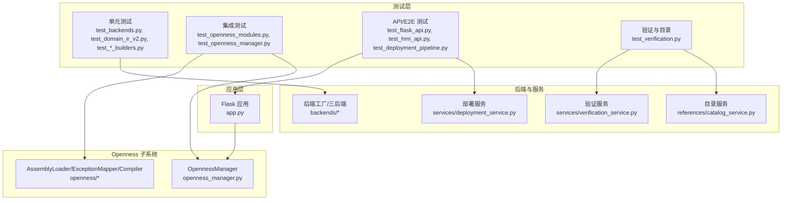
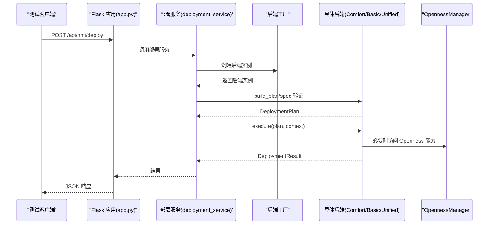
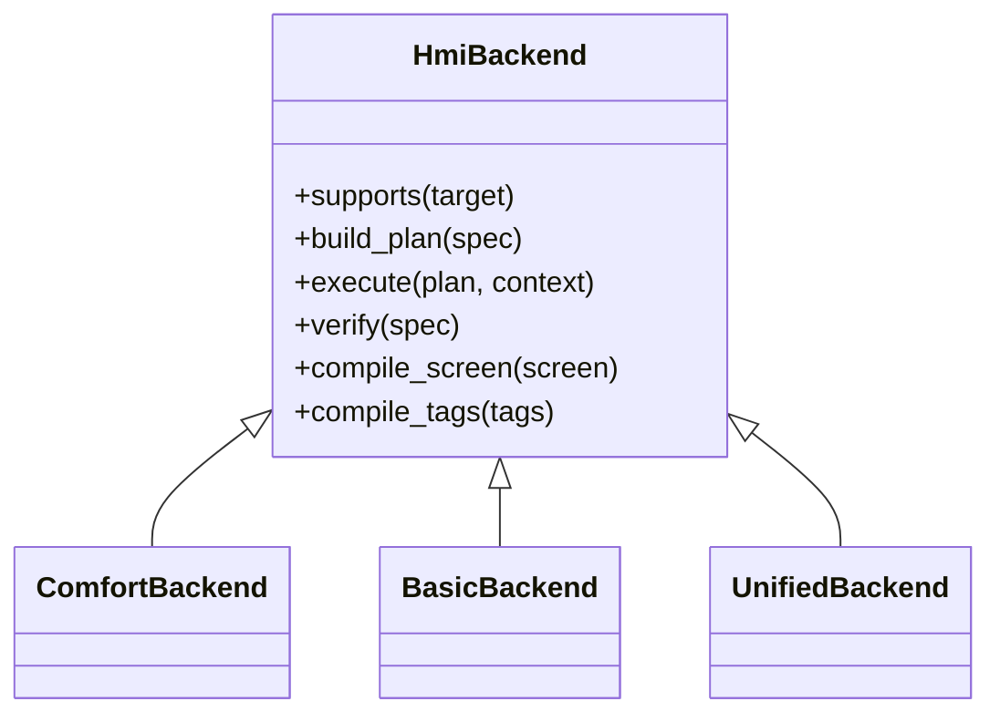
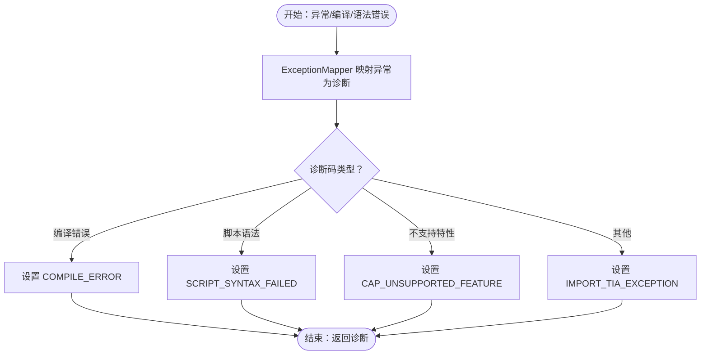
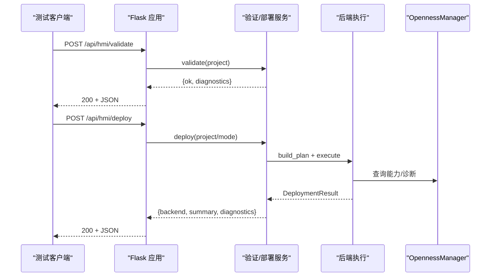
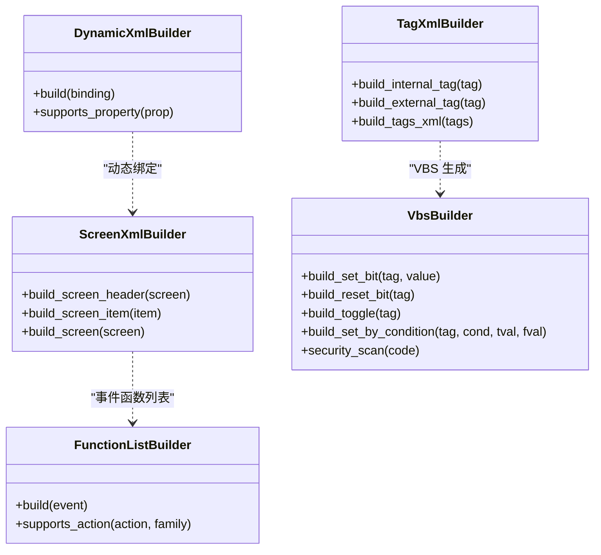
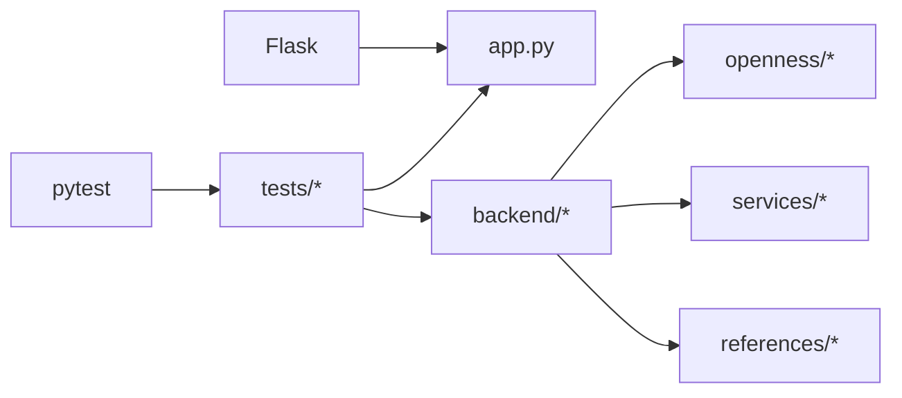

# 测试指南

<cite>
**本文引用的文件**
- [tests/__init__.py](file://tests/__init__.py)
- [tests/test_backends.py](file://tests/test_backends.py)
- [tests/test_flask_api.py](file://tests/test_flask_api.py)
- [tests/test_hmi_api.py](file://tests/test_hmi_api.py)
- [tests/test_openness_modules.py](file://tests/test_openness_modules.py)
- [tests/test_deployment_pipeline.py](file://tests/test_deployment_pipeline.py)
- [tests/test_verification.py](file://tests/test_verification.py)
- [tests/test_domain_ir_v2.py](file://tests/test_domain_ir_v2.py)
- [tests/test_openness_manager.py](file://tests/test_openness_manager.py)
- [tests/test_classic_builders.py](file://tests/test_classic_builders.py)
- [tests/test_unified_backend.py](file://tests/test_unified_backend.py)
- [app.py](file://app.py)
- [requirements.txt](file://requirements.txt)
- [config.yaml](file://config.yaml)
- [backend/backends/classic/tag_xml_builder.py](file://backend/backends/classic/tag_xml_builder.py)
- [backend/backends/classic/screen_xml_builder.py](file://backend/backends/classic/screen_xml_builder.py)
- [backend/backends/classic/function_list_builder.py](file://backend/backends/classic/function_list_builder.py)
- [backend/backends/classic/dynamic_xml_builder.py](file://backend/backends/classic/dynamic_xml_builder.py)
- [backend/backends/classic/vbs_builder.py](file://backend/backends/classic/vbs_builder.py)
- [backend/backends/unified/reflection_adapter.py](file://backend/backends/unified/reflection_adapter.py)
- [backend/backends/unified/tag_builder.py](file://backend/backends/unified/tag_builder.py)
- [backend/backends/unified/screen_builder.py](file://backend/backends/unified/screen_builder.py)
- [backend/backends/unified/property_builder.py](file://backend/backends/unified/property_builder.py)
- [backend/backends/unified/binding_builder.py](file://backend/backends/unified/binding_builder.py)
- [backend/backends/unified/event_builder.py](file://backend/backends/unified/event_builder.py)
- [backend/backends/unified/js_builder.py](file://backend/backends/unified/js_builder.py)
- [backend/backends/unified/unified_backend.py](file://backend/backends/unified/unified_backend.py)
- [backend/domain/ir_v2.py](file://backend/domain/ir_v2.py)
- [backend/services/verification_service.py](file://backend/services/verification_service.py)
- [backend/references/catalog_service.py](file://backend/references/catalog_service.py)
- [backend/openness/assembly_loader.py](file://backend/openness/assembly_loader.py)
- [backend/openness/exception_mapper.py](file://backend/openness/exception_mapper.py)
- [backend/openness/compiler.py](file://backend/openness/compiler.py)
- [backend/openness/runtime_contract.py](file://backend/openness/runtime_contract.py)
- [backend/openness_manager.py](file://backend/openness_manager.py)
- [backend/services/deployment_service.py](file://backend/services/deployment_service.py)
- [backend/backends/base.py](file://backend/backends/base.py)
- [backend/backends/classic/comfort_backend.py](file://backend/backends/classic/comfort_backend.py)
- [backend/backends/classic/basic_backend.py](file://backend/backends/classic/basic_backend.py)
- [backend/backends/unified/unified_backend.py](file://backend/backends/unified/unified_backend.py)
</cite>

## 目录
1. [简介](#简介)
2. [项目结构](#项目结构)
3. [核心组件](#核心组件)
4. [架构总览](#架构总览)
5. [详细组件分析](#详细组件分析)
6. [依赖分析](#依赖分析)
7. [性能考虑](#性能考虑)
8. [故障排查指南](#故障排查指南)
9. [结论](#结论)
10. [附录](#附录)

## 简介
本测试指南面向 Siemens HMI Assistant 项目的测试体系，覆盖单元测试、集成测试与端到端测试，重点包括：
- 测试框架与执行方式（pytest）
- 后端三类后端（Classic/Basic、Classic/Comfort、Unified）的单元测试
- Openness 模块与 OpennessManager 的集成测试
- API 层（Flask）的端到端测试
- 部署流水线与验证服务的 E2E 测试
- 数据模型（IR v2）与构建器（Builders）的测试
- 测试环境搭建、测试数据准备、测试结果分析与最佳实践

## 项目结构
测试相关文件主要位于 tests/ 目录，按功能域划分：
- 后端与领域模型：test_backends.py、test_domain_ir_v2.py、test_classic_builders.py、test_unified_backend.py
- Openness 模块与管理器：test_openness_modules.py、test_openness_manager.py
- API 与部署流水线：test_flask_api.py、test_hmi_api.py、test_deployment_pipeline.py
- 验证与目录服务：test_verification.py
- 其他工具与服务：test_capabilities.py、test_planners.py、test_hmi_ir.py、test_template_xml_generator.py

图表来源
- [tests/test_backends.py:1-126](file://tests/test_backends.py#L1-L126)
- [tests/test_openness_modules.py:1-175](file://tests/test_openness_modules.py#L1-L175)
- [tests/test_flask_api.py:1-147](file://tests/test_flask_api.py#L1-L147)
- [tests/test_hmi_api.py:1-159](file://tests/test_hmi_api.py#L1-L159)
- [tests/test_deployment_pipeline.py:1-406](file://tests/test_deployment_pipeline.py#L1-L406)
- [tests/test_verification.py:1-121](file://tests/test_verification.py#L1-L121)
- [app.py:1-200](file://app.py#L1-L200)
- [backend/services/deployment_service.py](file://backend/services/deployment_service.py)
- [backend/services/verification_service.py](file://backend/services/verification_service.py)
- [backend/references/catalog_service.py](file://backend/references/catalog_service.py)
- [backend/openness/assembly_loader.py](file://backend/openness/assembly_loader.py)
- [backend/openness/exception_mapper.py](file://backend/openness/exception_mapper.py)
- [backend/openness/compiler.py](file://backend/openness/compiler.py)
- [backend/openness_manager.py](file://backend/openness_manager.py)

章节来源
- [tests/__init__.py:1-2](file://tests/__init__.py#L1-L2)
- [requirements.txt:1-25](file://requirements.txt#L1-L25)
- [config.yaml:1-343](file://config.yaml#L1-L343)

## 核心组件
- 测试框架：pytest（通过命令行执行，支持并行与分组）
- 测试客户端：Flask test client（app.test_client）
- 测试夹具（fixtures）：集中定义在各测试文件内，如 Flask 客户端、HMI 项目规格构造函数
- 测试数据：通过 Pydantic 模型（IR v2）构造最小/完整项目，或从现有导出 XML/JSON 中抽取
- 测试策略：按模块分层，先单元后集成，再 API/E2E；覆盖边界条件与错误路径

章节来源
- [tests/test_flask_api.py:13-18](file://tests/test_flask_api.py#L13-L18)
- [tests/test_hmi_api.py:13-17](file://tests/test_hmi_api.py#L13-L17)
- [tests/test_deployment_pipeline.py:35-68](file://tests/test_deployment_pipeline.py#L35-L68)

## 架构总览
测试架构围绕“模型-构建器-后端-服务-API”链路展开，确保：
- 数据模型（IR v2）的序列化/反序列化与字段校验
- Classic/Unified 构建器的输出正确性与安全扫描
- 后端路由与执行状态（Dry Run/Not Connected/Failed/Deployed）
- Openness 模块与 Manager 的诊断与错误映射
- API 端点的输入校验、返回格式与错误处理

图表来源
- [tests/test_deployment_pipeline.py:316-393](file://tests/test_deployment_pipeline.py#L316-L393)
- [app.py:1-200](file://app.py#L1-L200)
- [backend/services/deployment_service.py](file://backend/services/deployment_service.py)
- [backend/backends/base.py](file://backend/backends/base.py)
- [backend/backends/classic/comfort_backend.py](file://backend/backends/classic/comfort_backend.py)
- [backend/backends/classic/basic_backend.py](file://backend/backends/classic/basic_backend.py)
- [backend/backends/unified/unified_backend.py](file://backend/backends/unified/unified_backend.py)
- [backend/openness_manager.py](file://backend/openness_manager.py)

## 详细组件分析

### 后端测试（Classic/Basic、Classic/Comfort、Unified）
- 目标：验证后端支持能力、计划构建、执行状态、验证结果与 XML/JS 生成安全性
- 关键断言：
  - supports/target 路由正确
  - build_plan 返回 DeploymentPlan，execute 返回 DeploymentResult
  - Dry Run/Not Connected/Failure/Deployed 状态边界
  - VBS/JS 安全扫描拒绝危险脚本
- 测试数据：通过 HmiProjectSpec 构造最小/完整项目，包含标签、画面、事件、绑定、脚本等

图表来源
- [tests/test_backends.py:38-126](file://tests/test_backends.py#L38-L126)
- [backend/backends/base.py](file://backend/backends/base.py)
- [backend/backends/classic/comfort_backend.py](file://backend/backends/classic/comfort_backend.py)
- [backend/backends/classic/basic_backend.py](file://backend/backends/classic/basic_backend.py)
- [backend/backends/unified/unified_backend.py](file://backend/backends/unified/unified_backend.py)

章节来源
- [tests/test_backends.py:15-126](file://tests/test_backends.py#L15-L126)

### Openness 模块与 OpennessManager 集成测试
- 目标：验证 AssemblyLoader、ExceptionMapper、HmiCompiler、RuntimeContract 的行为；OpennessManager 的诊断与错误映射
- 关键断言：
  - AssemblyLoader 诊断信息与元数据字典化
  - ExceptionMapper 将异常映射为诊断码与严重级别
  - HmiCompiler 在无 HMI 时返回干跑结果
  - OpennessManager 的委托属性可访问且安全
- 测试数据：构造异常、编译错误、语法错误等场景

图表来源
- [tests/test_openness_modules.py:53-113](file://tests/test_openness_modules.py#L53-L113)
- [backend/openness/exception_mapper.py](file://backend/openness/exception_mapper.py)
- [backend/openness/compiler.py](file://backend/openness/compiler.py)

章节来源
- [tests/test_openness_modules.py:15-175](file://tests/test_openness_modules.py#L15-L175)
- [tests/test_openness_manager.py:23-216](file://tests/test_openness_manager.py#L23-L216)

### API/E2E 测试（Flask 端点与部署流水线）
- 目标：验证 /api/config、/api/openness/*、/api/build、/api/hmi/* 等端点的输入校验、返回格式与错误处理
- 关键断言：
  - 缺少必要字段返回 400
  - 无效模板路径返回 400
  - 未连接 TIA 时返回 200/400/500 且不崩溃
  - 新旧 API 兼容端点均返回 JSON
  - 部署流水线区分 Dry Run/Not Connected/Failed/Deployed
- 测试数据：构造最小/完整 IR、Legacy IR、项目对象

图表来源
- [tests/test_flask_api.py:21-147](file://tests/test_flask_api.py#L21-L147)
- [tests/test_hmi_api.py:20-159](file://tests/test_hmi_api.py#L20-L159)
- [tests/test_deployment_pipeline.py:323-393](file://tests/test_deployment_pipeline.py#L323-L393)
- [app.py:1-200](file://app.py#L1-L200)

章节来源
- [tests/test_flask_api.py:21-147](file://tests/test_flask_api.py#L21-L147)
- [tests/test_hmi_api.py:20-159](file://tests/test_hmi_api.py#L20-L159)
- [tests/test_deployment_pipeline.py:95-167](file://tests/test_deployment_pipeline.py#L95-L167)

### 数据模型与构建器测试（IR v2 与 Builders）
- 目标：验证 HmiProjectSpec 及子模型的序列化/反序列化、字段约束与默认值；构建器输出正确性与安全扫描
- 关键断言：
  - IR v2 模型 round-trip 正确
  - Tag/Screen/Binding/Event/Script 等子模型字段映射正确
  - Classic/Unified 构建器输出包含预期标识与属性
  - VBS/JS 安全扫描拒绝危险操作

图表来源
- [tests/test_classic_builders.py:16-212](file://tests/test_classic_builders.py#L16-L212)
- [backend/backends/classic/tag_xml_builder.py](file://backend/backends/classic/tag_xml_builder.py)
- [backend/backends/classic/screen_xml_builder.py](file://backend/backends/classic/screen_xml_builder.py)
- [backend/backends/classic/function_list_builder.py](file://backend/backends/classic/function_list_builder.py)
- [backend/backends/classic/dynamic_xml_builder.py](file://backend/backends/classic/dynamic_xml_builder.py)
- [backend/backends/classic/vbs_builder.py](file://backend/backends/classic/vbs_builder.py)

章节来源
- [tests/test_domain_ir_v2.py:41-312](file://tests/test_domain_ir_v2.py#L41-L312)
- [tests/test_classic_builders.py:16-212](file://tests/test_classic_builders.py#L16-L212)
- [tests/test_unified_backend.py:21-205](file://tests/test_unified_backend.py#L21-L205)

### 验证与目录服务测试
- 目标：验证标签/画面/事件/绑定/脚本/编译的验证逻辑；目录服务加载与校验
- 关键断言：
  - 缺失对象/类型不匹配/事件缺失等场景返回失败
  - 目录清单加载与查找正确
  - 验证服务在连接状态下的全量验证

章节来源
- [tests/test_verification.py:12-121](file://tests/test_verification.py#L12-L121)

## 依赖分析
- 测试依赖关系：测试文件彼此独立，通过 app.py 与后端模块间接耦合
- 外部依赖：pytest、Flask、pythonnet（Windows 环境）、requests、pdfplumber、Pillow
- 配置依赖：config.yaml 控制 Openness、LLM、输出路径等

图表来源
- [requirements.txt:1-25](file://requirements.txt#L1-L25)
- [app.py:1-200](file://app.py#L1-L200)
- [config.yaml:1-343](file://config.yaml#L1-L343)

章节来源
- [requirements.txt:1-25](file://requirements.txt#L1-L25)
- [config.yaml:19-58](file://config.yaml#L19-L58)

## 性能考虑
- 测试执行：优先使用 pytest 的并行与分组能力，减少重复初始化
- Mock 与惰性加载：OpennessManager 的委托属性在访问时惰性初始化，避免不必要的 DLL 加载
- 干跑（Dry Run）：在无连接/无 HMI 时返回 Dry Run，降低测试成本
- 输出路径：合理配置 exports 目录，避免频繁磁盘 IO

## 故障排查指南
- 未连接 TIA 时端点返回 200/400/500：检查 /api/openness/diagnose 与 OpennessManager 的诊断结果
- VBS/JS 安全扫描失败：确认脚本是否包含 Shell/CreateObject/eval/document 等高危操作
- Catalog 不完整导致部署阻断：检查 reference_catalog/V20 下的 manifest 是否存在且有效
- 部署状态异常（NOT_CONNECTED/FAILED/DRY_RUN）：核对 RuntimeContext 与 Openness 能力查询

章节来源
- [tests/test_flask_api.py:53-94](file://tests/test_flask_api.py#L53-L94)
- [tests/test_openness_modules.py:118-130](file://tests/test_openness_modules.py#L118-L130)
- [tests/test_deployment_pipeline.py:95-167](file://tests/test_deployment_pipeline.py#L95-L167)
- [tests/test_openness_manager.py:23-90](file://tests/test_openness_manager.py#L23-L90)

## 结论
本测试指南提供了从单元到端到端的完整测试策略与实践，覆盖后端三类后端、Openness 模块、API 端点与部署流水线。通过合理的测试数据准备、边界条件与错误路径覆盖，以及安全扫描与诊断机制，能够有效保障系统的稳定性与可维护性。

## 附录

### 测试环境搭建
- 安装依赖：pip install -r requirements.txt
- 运行测试：pytest tests/ -v
- 并行与统计：pytest --collect-only -q | wc -l；pytest -q
- 配置文件：config.yaml（Openness、LLM、输出路径）

章节来源
- [requirements.txt:1-25](file://requirements.txt#L1-L25)
- [config.yaml:19-58](file://config.yaml#L19-L58)

### 测试执行方法
- 单元测试：pytest tests/test_backends.py tests/test_domain_ir_v2.py tests/test_*_builders.py -v
- 集成测试：pytest tests/test_openness_modules.py tests/test_openness_manager.py -v
- API/E2E：pytest tests/test_flask_api.py tests/test_hmi_api.py tests/test_deployment_pipeline.py -v
- 全量测试：pytest tests/ -q

章节来源
- [tests/test_flask_api.py:1-147](file://tests/test_flask_api.py#L1-L147)
- [tests/test_hmi_api.py:1-159](file://tests/test_hmi_api.py#L1-L159)
- [tests/test_deployment_pipeline.py:1-406](file://tests/test_deployment_pipeline.py#L1-L406)

### 测试数据准备
- 使用 HmiProjectSpec 构造最小/完整项目，包含标签、画面、事件、绑定、脚本
- 使用 Legacy IR（含 meta 与 objects）进行兼容性测试
- 使用 exports/templates 下的模板 XML 进行 Classic 模板导出/导入测试

章节来源
- [tests/test_domain_ir_v2.py:41-117](file://tests/test_domain_ir_v2.py#L41-L117)
- [tests/test_flask_api.py:106-129](file://tests/test_flask_api.py#L106-L129)
- [tests/test_hmi_api.py:33-67](file://tests/test_hmi_api.py#L33-L67)

### 测试最佳实践
- 优先断言边界与错误路径（Dry Run/Not Connected/Failed）
- 使用 fixtures 统一构造客户端与项目规格
- 对 VBS/JS 进行安全扫描，拒绝高危操作
- 保持测试数据最小化，便于快速定位问题
- 对 Openness 诊断与错误映射进行回归测试

章节来源
- [tests/test_backends.py:86-90](file://tests/test_backends.py#L86-L90)
- [tests/test_classic_builders.py:165-180](file://tests/test_classic_builders.py#L165-L180)
- [tests/test_unified_backend.py:156-171](file://tests/test_unified_backend.py#L156-L171)