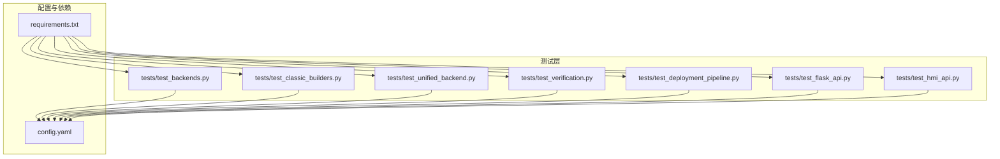
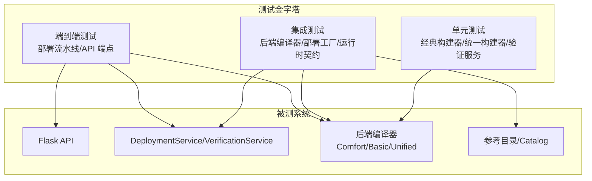
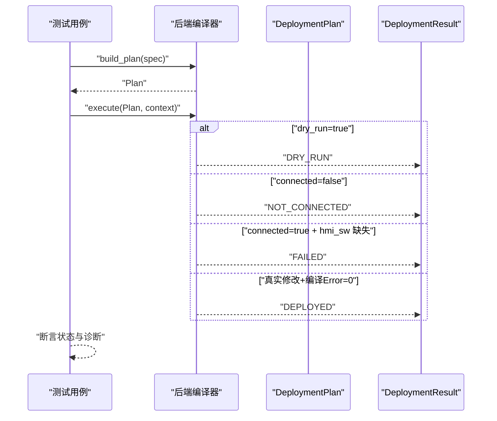
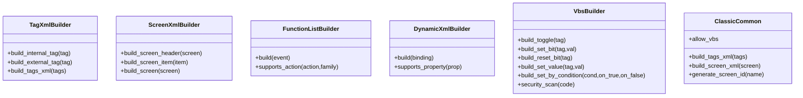
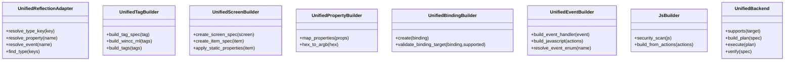
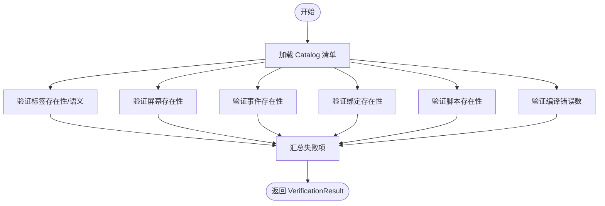
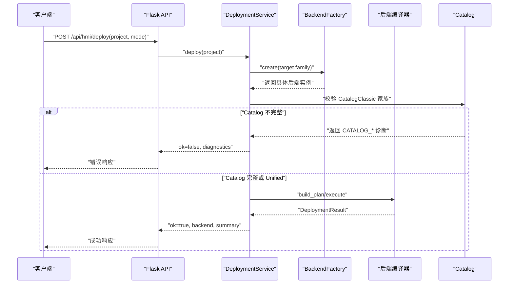
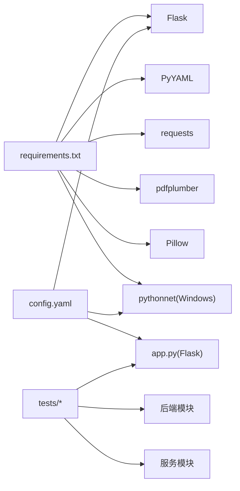

# 测试策略

<cite>
**本文引用的文件**
- [tests/test_backends.py](file://tests/test_backends.py)
- [tests/test_classic_builders.py](file://tests/test_classic_builders.py)
- [tests/test_unified_backend.py](file://tests/test_unified_backend.py)
- [tests/test_verification.py](file://tests/test_verification.py)
- [tests/test_deployment_pipeline.py](file://tests/test_deployment_pipeline.py)
- [tests/test_flask_api.py](file://tests/test_flask_api.py)
- [tests/test_hmi_api.py](file://tests/test_hmi_api.py)
- [config.yaml](file://config.yaml)
- [requirements.txt](file://requirements.txt)
</cite>

## 目录
1. [引言](#引言)
2. [项目结构](#项目结构)
3. [核心组件](#核心组件)
4. [架构总览](#架构总览)
5. [详细组件分析](#详细组件分析)
6. [依赖分析](#依赖分析)
7. [性能考虑](#性能考虑)
8. [故障排查指南](#故障排查指南)
9. [结论](#结论)
10. [附录](#附录)

## 引言
本测试策略旨在为 Siemens HMI Assistant 项目提供系统化、可落地的质量保障方案。文档基于现有测试代码与配置，总结当前测试实践，明确测试金字塔应用、测试优先级与覆盖率要求，并给出测试环境配置、测试数据管理、Golden 测试、测试结果分析、测试自动化与持续集成、测试报告与反馈机制等实施建议。同时，结合项目特性（Openness 仅 Windows、跨平台运行差异、多后端编译器、API 端点等），提出平衡测试成本与质量的策略。

## 项目结构
项目采用“后端模块 + 测试模块 + 配置 + 文档”的组织方式，测试覆盖后端编译器、API 端点、验证服务、部署流水线等关键路径。测试文件按功能域划分，便于定位与扩展。

**图表来源**
- [tests/test_backends.py:1-126](file://tests/test_backends.py#L1-L126)
- [tests/test_classic_builders.py:1-212](file://tests/test_classic_builders.py#L1-L212)
- [tests/test_unified_backend.py:1-205](file://tests/test_unified_backend.py#L1-L205)
- [tests/test_verification.py:1-121](file://tests/test_verification.py#L1-L121)
- [tests/test_deployment_pipeline.py:1-406](file://tests/test_deployment_pipeline.py#L1-L406)
- [tests/test_flask_api.py:1-147](file://tests/test_flask_api.py#L1-L147)
- [tests/test_hmi_api.py:1-159](file://tests/test_hmi_api.py#L1-L159)
- [config.yaml:1-343](file://config.yaml#L1-L343)
- [requirements.txt:1-25](file://requirements.txt#L1-L25)

**章节来源**
- [tests/test_backends.py:1-126](file://tests/test_backends.py#L1-L126)
- [tests/test_classic_builders.py:1-212](file://tests/test_classic_builders.py#L1-L212)
- [tests/test_unified_backend.py:1-205](file://tests/test_unified_backend.py#L1-L205)
- [tests/test_verification.py:1-121](file://tests/test_verification.py#L1-L121)
- [tests/test_deployment_pipeline.py:1-406](file://tests/test_deployment_pipeline.py#L1-L406)
- [tests/test_flask_api.py:1-147](file://tests/test_flask_api.py#L1-L147)
- [tests/test_hmi_api.py:1-159](file://tests/test_hmi_api.py#L1-L159)
- [config.yaml:1-343](file://config.yaml#L1-L343)
- [requirements.txt:1-25](file://requirements.txt#L1-L25)

## 核心组件
- 后端编译器测试：Comfort/Basic/Unified 三类后端支持性、计划构建、执行状态（Dry Run/Not Connected/Failed/Deployed）、脚本安全扫描等。
- 经典构建器测试：标签、屏幕、函数列表、动态属性、VBS 构建与安全扫描。
- 统一后端测试：反射适配、标签/屏幕/属性/绑定/事件/JS 构建器、JS 安全扫描。
- 验证服务测试：标签/屏幕/事件/绑定/脚本/编译等验证，以及对象查询对比。
- 部署流水线测试：BackendFactory 路由、Dry Run/Not Connected/Failure 边界、Catalog 阻断、RuntimeContract、新 API 端点。
- API 端点测试：Flask 测试客户端对 /api/config、/api/openness/*、/api/build/*、/api/hmi/* 等端点进行请求校验与响应结构断言。

**章节来源**
- [tests/test_backends.py:38-126](file://tests/test_backends.py#L38-L126)
- [tests/test_classic_builders.py:16-212](file://tests/test_classic_builders.py#L16-L212)
- [tests/test_unified_backend.py:21-205](file://tests/test_unified_backend.py#L21-L205)
- [tests/test_verification.py:12-121](file://tests/test_verification.py#L12-L121)
- [tests/test_deployment_pipeline.py:72-406](file://tests/test_deployment_pipeline.py#L72-L406)
- [tests/test_flask_api.py:21-147](file://tests/test_flask_api.py#L21-L147)
- [tests/test_hmi_api.py:20-159](file://tests/test_hmi_api.py#L20-L159)

## 架构总览
测试体系围绕“单元/集成/端到端”三层金字塔展开，配合 API 端点与部署流水线的 E2E 验证，确保从组件到系统的质量闭环。

**图表来源**
- [tests/test_classic_builders.py:1-212](file://tests/test_classic_builders.py#L1-L212)
- [tests/test_unified_backend.py:1-205](file://tests/test_unified_backend.py#L1-L205)
- [tests/test_verification.py:1-121](file://tests/test_verification.py#L1-L121)
- [tests/test_deployment_pipeline.py:1-406](file://tests/test_deployment_pipeline.py#L1-L406)
- [tests/test_flask_api.py:1-147](file://tests/test_flask_api.py#L1-L147)
- [tests/test_hmi_api.py:1-159](file://tests/test_hmi_api.py#L1-L159)

## 详细组件分析

### 后端编译器测试（Comfort/Basic/Unified）
- 支持性与计划构建：验证各后端对目标家族的支持、构建部署计划、Dry Run 执行状态。
- 执行边界：区分 Dry Run（无需连接）、Not Connected（无连接）、Failed（连接但无 HMI 软件）、Deployed（编译无错）。
- 安全扫描：VBS/JS 构建器的安全扫描，拒绝高危调用。
- 验证服务：对标签/屏幕/事件/绑定/脚本/编译进行语义与存在性验证。

**图表来源**
- [tests/test_backends.py:38-126](file://tests/test_backends.py#L38-L126)
- [tests/test_deployment_pipeline.py:95-167](file://tests/test_deployment_pipeline.py#L95-L167)

**章节来源**
- [tests/test_backends.py:38-126](file://tests/test_backends.py#L38-L126)
- [tests/test_deployment_pipeline.py:95-167](file://tests/test_deployment_pipeline.py#L95-L167)

### 经典构建器测试（Classic）
- 标签构建：内部/外部标签、控制器映射、地址映射、批量构建。
- 屏幕构建：屏幕头、控件项、文本国际化。
- 函数列表构建：事件到动作映射（SetBit/ResetBit/Toggle/ActivateScreen）。
- 动态属性构建：DirectTag/Discrete/Flashing/Range 等绑定类型。
- VBS 构建与安全扫描：Toggle/SetBit/条件赋值等，拒绝 Shell/Filesystem 等高危调用。
- 通用工具：ClassicCommon 的 VBS 开关、屏幕 ID 生成等。

**图表来源**
- [tests/test_classic_builders.py:16-212](file://tests/test_classic_builders.py#L16-L212)

**章节来源**
- [tests/test_classic_builders.py:16-212](file://tests/test_classic_builders.py#L16-L212)

### 统一后端测试（Unified）
- 反射适配：类型键解析、属性枚举映射、事件枚举解析。
- 构建器族：标签/屏幕/属性/绑定/事件/JS 构建器，以及 JS 安全扫描。
- 统一后端：支持性、计划构建、执行、验证。

**图表来源**
- [tests/test_unified_backend.py:21-205](file://tests/test_unified_backend.py#L21-L205)

**章节来源**
- [tests/test_unified_backend.py:21-205](file://tests/test_unified_backend.py#L21-L205)

### 验证服务测试
- 标签/屏幕/事件/绑定/脚本/编译验证：存在性与语义一致性检查。
- 对象查询对比：以字典形式传入对象查询，与规格进行比对。
- Catalog 加载与校验：清单加载、查找、全量校验。

**图表来源**
- [tests/test_verification.py:12-121](file://tests/test_verification.py#L12-L121)

**章节来源**
- [tests/test_verification.py:12-121](file://tests/test_verification.py#L12-L121)

### 部署流水线与 API 端点测试
- BackendFactory 路由：根据目标家族选择 Basic/Comfort/Unified 后端。
- 执行边界：Dry Run/Not Connected/Failed/Deployed 的状态机规则。
- Catalog 阻断：Classic 家族在 Catalog 不完整时阻断部署。
- 新 API 端点：/api/hmi/validate/deploy/verify/compile，以及 /api/openness/*、/api/build/*、/api/config 等。

**图表来源**
- [tests/test_deployment_pipeline.py:72-245](file://tests/test_deployment_pipeline.py#L72-L245)
- [tests/test_flask_api.py:21-147](file://tests/test_flask_api.py#L21-L147)
- [tests/test_hmi_api.py:20-159](file://tests/test_hmi_api.py#L20-L159)

**章节来源**
- [tests/test_deployment_pipeline.py:72-245](file://tests/test_deployment_pipeline.py#L72-L245)
- [tests/test_flask_api.py:21-147](file://tests/test_flask_api.py#L21-L147)
- [tests/test_hmi_api.py:20-159](file://tests/test_hmi_api.py#L20-L159)

## 依赖分析
- 运行时依赖：Flask、PyYAML、requests、pdfplumber、Pillow、pythonnet（Windows）。
- 配置驱动：config.yaml 提供 LLM/Openness/MiMo/Server 等参数，影响测试行为（如 Openness 仅 Windows 生效）。
- 测试耦合：测试文件主要依赖后端模块与服务模块，API 测试依赖 Flask app；部署流水线测试还涉及 RuntimeContract 与 Catalog。

**图表来源**
- [requirements.txt:1-25](file://requirements.txt#L1-L25)
- [config.yaml:1-343](file://config.yaml#L1-L343)

**章节来源**
- [requirements.txt:1-25](file://requirements.txt#L1-L25)
- [config.yaml:1-343](file://config.yaml#L1-L343)

## 性能考虑
- 单元测试优先：经典/统一构建器测试粒度细、执行快，适合高频回归。
- 集成测试边界：部署流水线与 API 测试需关注外部依赖（Openness DLL、TIA 连接），建议在 CI 中隔离或降级。
- Golden 测试：当前仓库未发现 tests/golden 目录，建议后续引入参考 XML/Golden 文件，减少渲染差异导致的误报。
- 覆盖率：建议结合单元/集成测试统计行/分支覆盖率，重点补齐后端执行边界与 API 响应结构断言。

[本节为通用指导，不直接分析具体文件]

## 故障排查指南
- Openness 仅 Windows：pythonnet 不存在时进入诊断模式，避免在非 Windows 环境崩溃。测试中可通过 RuntimeProber 的错误集合判断。
- Not Connected/Failed：当 Dry Run=false 且未连接或无 HMI 软件时，执行结果为 NOT_CONNECTED/FAILED，诊断码包含相应标识。
- Catalog 不完整：Classic 家族在 Catalog 未验证或缺失时阻断部署，返回 CATALOG_* 诊断。
- API 响应：Flask 测试客户端断言响应状态码与 JSON 结构，确保端点健壮性。

**章节来源**
- [tests/test_deployment_pipeline.py:250-271](file://tests/test_deployment_pipeline.py#L250-L271)
- [tests/test_deployment_pipeline.py:130-167](file://tests/test_deployment_pipeline.py#L130-L167)
- [tests/test_deployment_pipeline.py:223-245](file://tests/test_deployment_pipeline.py#L223-L245)
- [tests/test_flask_api.py:44-94](file://tests/test_flask_api.py#L44-L94)

## 结论
当前项目已形成以单元/集成/E2E 为核心的测试体系，覆盖后端编译器、构建器、验证服务、部署流水线与 API 端点。建议后续补充 Golden 测试、提升覆盖率、完善跨平台测试策略，并在 CI 中合理隔离 Windows 特定依赖，以平衡测试成本与质量保证。

[本节为总结性内容，不直接分析具体文件]

## 附录

### 测试金字塔与优先级
- 单元层（高优先级）：经典/统一构建器、验证服务、后端支持性与安全扫描。
- 集成层（中优先级）：BackendFactory 路由、Catalog 校验、RuntimeContract。
- 端到端层（低优先级）：部署流水线、新 API 端点。

**章节来源**
- [tests/test_classic_builders.py:1-212](file://tests/test_classic_builders.py#L1-L212)
- [tests/test_unified_backend.py:1-205](file://tests/test_unified_backend.py#L1-L205)
- [tests/test_verification.py:1-121](file://tests/test_verification.py#L1-L121)
- [tests/test_deployment_pipeline.py:1-406](file://tests/test_deployment_pipeline.py#L1-L406)
- [tests/test_flask_api.py:1-147](file://tests/test_flask_api.py#L1-L147)
- [tests/test_hmi_api.py:1-159](file://tests/test_hmi_api.py#L1-L159)

### 测试环境配置与数据管理
- 环境变量与配置：通过 config.yaml 控制 LLM、Openness、MiMo、输出目录等；在 CI 中可注入环境变量覆盖敏感字段。
- 测试数据：IR 规格与对象查询字典在测试中构造，建议维护一组稳定样例作为回归基线。
- Golden 测试：建议在 exports/reference_catalog 下准备参考 XML，测试时比对渲染一致性。

**章节来源**
- [config.yaml:1-343](file://config.yaml#L1-L343)
- [tests/test_deployment_pipeline.py:37-67](file://tests/test_deployment_pipeline.py#L37-L67)

### Golden 测试与结果分析
- 当前仓库未发现 tests/golden 目录；建议引入参考 XML 与渲染结果比对，降低 UI 差异导致的波动。
- 分析维度：XML 结构一致性、事件/绑定/脚本完整性、编译错误数、执行状态码与诊断信息。

**章节来源**
- [tests/test_deployment_pipeline.py:37-67](file://tests/test_deployment_pipeline.py#L37-L67)

### 测试自动化与持续集成
- 建议在 CI 中拆分任务：Windows（Openness 相关）与非 Windows（前端/LLM/验证服务）。
- 覆盖率：结合 pytest-cov 或类似工具统计覆盖率，设定阈值门禁。
- 报告：统一输出 JSON/HTML 报告，记录通过/失败用例与诊断信息。

**章节来源**
- [requirements.txt:20-25](file://requirements.txt#L20-L25)
- [config.yaml:339-343](file://config.yaml#L339-L343)

### 测试反馈机制
- 用例命名与断言：以“功能+场景+期望”命名，断言包含状态码、JSON 结构、诊断码等。
- 回归基线：Golden/XML 基线随版本管理，变更时触发评审。
- 失败收敛：针对 Not Connected/Failed/Catalog 阻断等常见失败场景，建立快速定位指引。

**章节来源**
- [tests/test_flask_api.py:21-147](file://tests/test_flask_api.py#L21-L147)
- [tests/test_hmi_api.py:20-159](file://tests/test_hmi_api.py#L20-L159)
- [tests/test_deployment_pipeline.py:223-245](file://tests/test_deployment_pipeline.py#L223-L245)