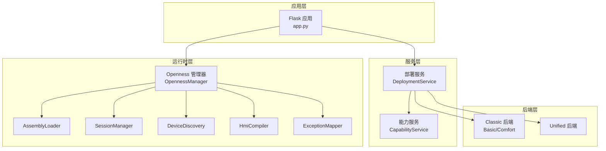
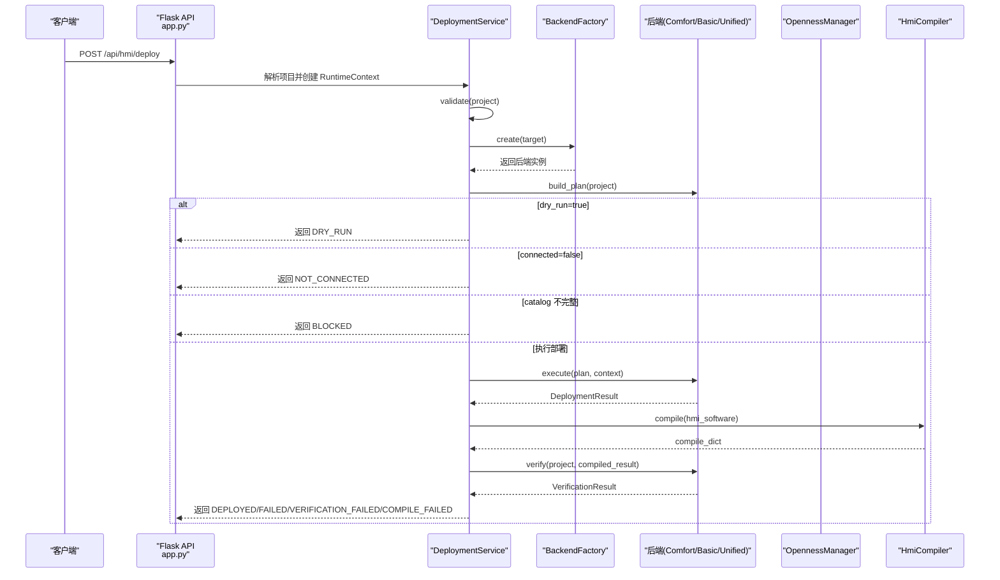
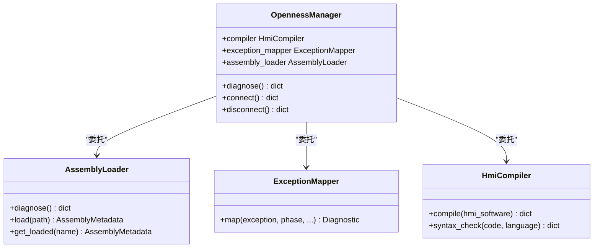
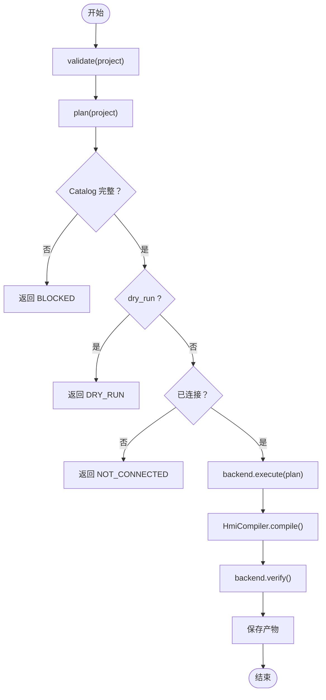
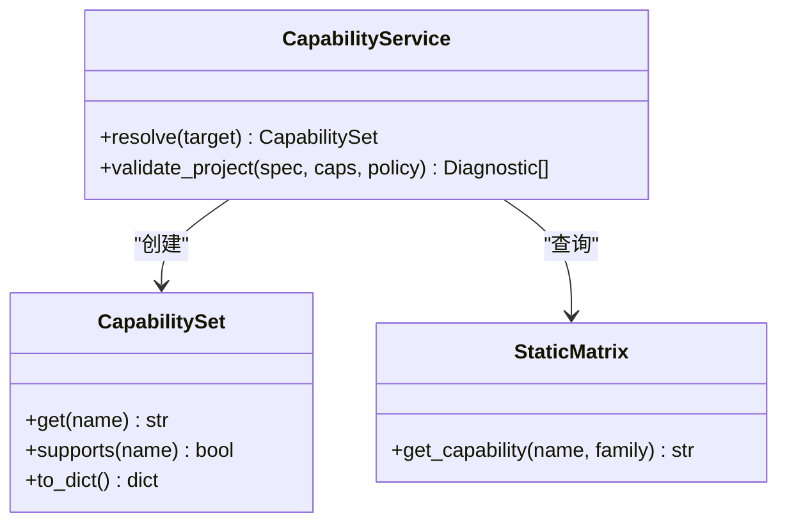
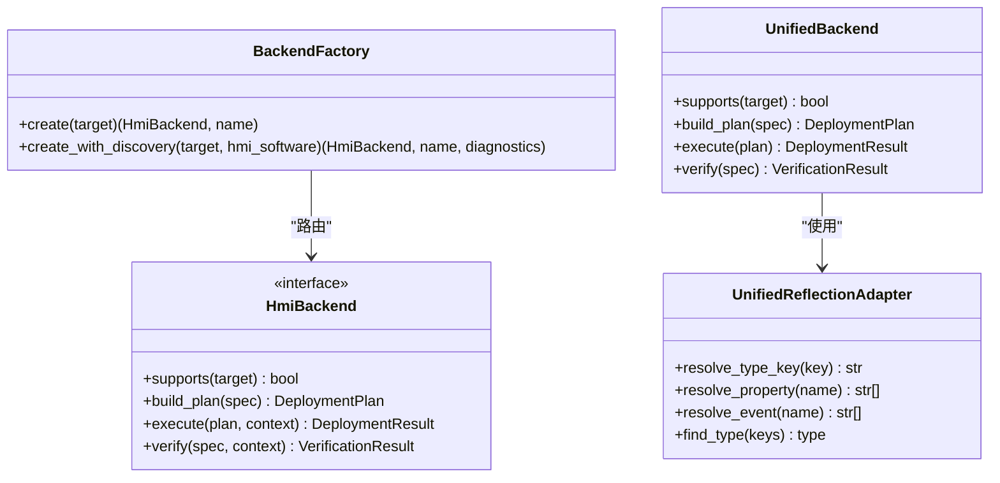
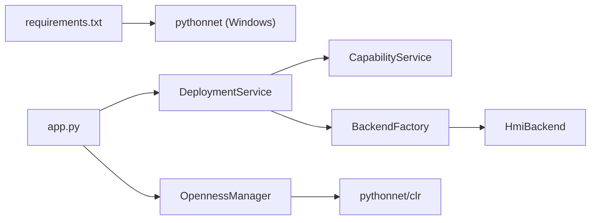

# 集成测试

<cite>
**本文档引用的文件**
- [app.py](file://app.py)
- [config.yaml](file://config.yaml)
- [requirements.txt](file://requirements.txt)
- [tests/test_openness_modules.py](file://tests/test_openness_modules.py)
- [tests/test_deployment_pipeline.py](file://tests/test_deployment_pipeline.py)
- [tests/test_capabilities.py](file://tests/test_capabilities.py)
- [tests/test_backends.py](file://tests/test_backends.py)
- [tests/test_unified_backend.py](file://tests/test_unified_backend.py)
- [backend/openness/__init__.py](file://backend/openness/__init__.py)
- [backend/capabilities/__init__.py](file://backend/capabilities/__init__.py)
- [backend/services/deployment_service.py](file://backend/services/deployment_service.py)
- [backend/openness_manager.py](file://backend/openness_manager.py)
- [backend/capabilities/capability_service.py](file://backend/capabilities/capability_service.py)
</cite>

## 目录
1. [简介](#简介)
2. [项目结构](#项目结构)
3. [核心组件](#核心组件)
4. [架构总览](#架构总览)
5. [详细组件分析](#详细组件分析)
6. [依赖关系分析](#依赖关系分析)
7. [性能考虑](#性能考虑)
8. [故障排除指南](#故障排除指南)
9. [结论](#结论)
10. [附录](#附录)

## 简介
本指南面向 Siemes HMI Assistant 项目的集成测试，聚焦以下主题：
- Openness 集成测试：验证 TIA Portal Openness 运行时层与后端编译/验证流程的协同。
- 部署管道测试：覆盖 V3 统一部署流水线 validate → plan → deploy → verify → compile 的端到端路径。
- 能力矩阵测试：验证目标设备能力解析与项目校验的正确性。
- 测试环境搭建：包括 Windows + pythonnet 的必要条件、配置文件准备与测试数据准备。
- 测试流程设计：Dry Run、Not Connected、Catalog 阻断、Unified RuntimeContract、语义验证等场景。
- 最佳实践：测试隔离、依赖管理、测试顺序安排与常见问题排查。

## 项目结构
该项目采用分层架构，核心模块包括：
- Flask 应用层：提供 REST API，承载部署流水线与 Openness 诊断/连接/导入等接口。
- 业务服务层：部署服务（DeploymentService）、能力服务（CapabilityService）等。
- 运行时层：Openness 管理器（OpennessManager）及其子模块（AssemblyLoader、SessionManager、DeviceDiscovery、Compiler、ExceptionMapper）。
- 后端适配层：Classic（Basic/Comfort）与 Unified 后端，负责将 IR 转换为具体 HMI 工程对象。
- 测试层：针对上述模块的单元与端到端测试。

图表来源
- [app.py:1-966](file://app.py#L1-L966)
- [backend/services/deployment_service.py:1-668](file://backend/services/deployment_service.py#L1-L668)
- [backend/openness_manager.py:1-800](file://backend/openness_manager.py#L1-L800)
- [backend/openness/__init__.py:1-32](file://backend/openness/__init__.py#L1-L32)
- [backend/capabilities/__init__.py:1-23](file://backend/capabilities/__init__.py#L1-L23)

章节来源
- [app.py:1-966](file://app.py#L1-L966)
- [config.yaml:1-343](file://config.yaml#L1-L343)

## 核心组件
- Openness 管理器（OpennessManager）：封装 TIA Portal 连接、设备发现、编译触发与异常映射，提供诊断模式以避免非 Windows 环境崩溃。
- 部署服务（DeploymentService）：统一部署流水线编排，包含 validate、plan、deploy、verify、compile 等步骤，并区分 DRY_RUN、NOT_CONNECTED、BLOCKED、DEPLOYING、DEPLOYED、FAILED、VERIFICATION_FAILED、COMPILE_FAILED 状态。
- 能力服务（CapabilityService）：解析目标设备能力集并校验项目可行性，支持策略（ERROR/WARN_AND_SKIP）。
- 后端适配（Classic/Unified）：根据目标设备族（Basic/Comfort/Unified/AUTO）路由到相应后端，执行计划构建、执行、验证与编译。

章节来源
- [backend/openness_manager.py:1-800](file://backend/openness_manager.py#L1-L800)
- [backend/services/deployment_service.py:1-668](file://backend/services/deployment_service.py#L1-L668)
- [backend/capabilities/capability_service.py:1-223](file://backend/capabilities/capability_service.py#L1-L223)

## 架构总览
下图展示了从 API 请求到部署执行的关键调用链路与状态机转换：

图表来源
- [app.py:672-761](file://app.py#L672-L761)
- [backend/services/deployment_service.py:257-501](file://backend/services/deployment_service.py#L257-L501)

章节来源
- [app.py:672-761](file://app.py#L672-L761)
- [backend/services/deployment_service.py:257-501](file://backend/services/deployment_service.py#L257-L501)

## 详细组件分析

### Openness 集成测试
目标：验证 Openness 运行时层在不同环境下的行为，包括诊断模式、DLL 加载、异常映射与编译器干跑模式。

- 诊断模式：在非 Windows 或无 pythonnet 环境下，OpennessManager 进入诊断模式，不抛出异常，便于前端与大模型调试。
- AssemblyLoader：测试 DLL 加载失败、元数据默认值与序列化。
- ExceptionMapper：将 .NET 异常映射为统一诊断码，覆盖重复对象、编译错误、语法错误、不支持特性等场景。
- HmiCompiler：dry-run 模式下返回成功但包含消息，不依赖实际 HMI。

图表来源
- [backend/openness_manager.py:31-101](file://backend/openness_manager.py#L31-L101)
- [backend/openness/__init__.py:18-31](file://backend/openness/__init__.py#L18-L31)

章节来源
- [tests/test_openness_modules.py:1-175](file://tests/test_openness_modules.py#L1-L175)
- [backend/openness_manager.py:103-186](file://backend/openness_manager.py#L103-L186)

最佳实践
- 在非 Windows 环境中，确保 OpennessManager 的诊断模式可用，避免测试中断。
- 使用 dry-run 模式验证编译器语法检查与异常映射，无需真实 TIA 连接。
- 对 AssemblyLoader 的加载失败与元数据序列化进行边界测试。

### 部署管道测试
目标：验证 V3 统一部署流水线在不同状态下的行为，包括 Dry Run、Not Connected、Catalog 阻断、AUTO 家族解析、Unified RuntimeContract 与语义验证。

- BackendFactory：根据目标族路由到 Basic/Comfort/Unified/AUTO，并在 AUTO 无法确定时返回错误诊断。
- 执行边界：dry_run=true 时返回 DRY_RUN；未连接返回 NOT_CONNECTED；无 HMI 软件返回 FAILED；三类后端 verify 在未连接时均失败。
- 部署服务：validate → plan → deploy → compile → verify → 产物持久化。
- Catalog 阻断：Classic 家族在 catalog 不完整时阻断部署；Unified 家族跳过 catalog 检查。
- RuntimeContract：无 pythonnet 时返回带错误的合同；支持序列化与空合同判断。
- VerificationService：语义验证包含标签类型匹配、事件完整性与绑定有效性检查。

图表来源
- [tests/test_deployment_pipeline.py:95-167](file://tests/test_deployment_pipeline.py#L95-L167)
- [tests/test_deployment_pipeline.py:221-245](file://tests/test_deployment_pipeline.py#L221-L245)
- [tests/test_deployment_pipeline.py:247-272](file://tests/test_deployment_pipeline.py#L247-L272)
- [tests/test_deployment_pipeline.py:273-313](file://tests/test_deployment_pipeline.py#L273-L313)
- [backend/services/deployment_service.py:327-501](file://backend/services/deployment_service.py#L327-L501)

章节来源
- [tests/test_deployment_pipeline.py:72-91](file://tests/test_deployment_pipeline.py#L72-L91)
- [tests/test_deployment_pipeline.py:95-167](file://tests/test_deployment_pipeline.py#L95-L167)
- [tests/test_deployment_pipeline.py:221-245](file://tests/test_deployment_pipeline.py#L221-L245)
- [tests/test_deployment_pipeline.py:247-272](file://tests/test_deployment_pipeline.py#L247-L272)
- [tests/test_deployment_pipeline.py:273-313](file://tests/test_deployment_pipeline.py#L273-L313)
- [backend/services/deployment_service.py:114-250](file://backend/services/deployment_service.py#L114-L250)

最佳实践
- 先进行 validate 与 plan，再执行 deploy，确保 Catalog 与能力矩阵检查通过。
- 在未连接 TIA 时使用 dry_run 预演部署计划，避免真实操作风险。
- 对 AUTO 家族目标，在有 HMI Software 对象时显式通过 DeviceDiscovery 确定后端。

### 能力矩阵测试
目标：验证静态能力矩阵与 CapabilityService 的解析与校验逻辑，包括 Basic/Comfort/Unified 的差异与策略控制。

- 静态矩阵：Basic 禁止 VBS、call_script、write_expression；Comfort 禁止 JavaScript；Unified 支持 JavaScript 与强类型创建。
- CapabilitySet：缓存能力查询结果，支持 to_dict 导出。
- CapabilityService：根据目标族与策略生成诊断，覆盖脚本语言、动作类型、绑定类型与闪烁动态等检查。

图表来源
- [backend/capabilities/capability_service.py:64-223](file://backend/capabilities/capability_service.py#L64-L223)
- [backend/capabilities/__init__.py:10-22](file://backend/capabilities/__init__.py#L10-L22)

章节来源
- [tests/test_capabilities.py:43-68](file://tests/test_capabilities.py#L43-L68)
- [tests/test_capabilities.py:92-121](file://tests/test_capabilities.py#L92-L121)
- [tests/test_capabilities.py:123-191](file://tests/test_capabilities.py#L123-L191)
- [tests/test_capabilities.py:193-235](file://tests/test_capabilities.py#L193-L235)
- [backend/capabilities/capability_service.py:64-223](file://backend/capabilities/capability_service.py#L64-L223)

最佳实践
- 在 Basic 目标上避免使用 VBS 与 call_script/write_expression。
- 在 Comfort 目标上避免使用 JavaScript，或使用警告策略而非阻断。
- 使用策略（WARN_AND_SKIP）在 Basic 上放宽限制，同时记录警告。

### 后端适配测试（Classic/Unified）
目标：验证后端支持性、计划构建、执行（Dry Run）、验证与编译能力，以及 Unified 的反射适配与构建器。

- Classic 后端：Basic/Comfort 支持性检查、Dry Run 行为、verify 统计、VBS 安全扫描。
- Unified 后端：反射适配器（类型键、属性、事件解析）、标签/屏幕/属性/绑定/事件/JS 构建器、安全扫描与执行/验证。

图表来源
- [tests/test_backends.py:38-91](file://tests/test_backends.py#L38-L91)
- [tests/test_unified_backend.py:21-41](file://tests/test_unified_backend.py#L21-L41)
- [tests/test_unified_backend.py:173-205](file://tests/test_unified_backend.py#L173-L205)
- [backend/services/deployment_service.py:114-250](file://backend/services/deployment_service.py#L114-L250)

章节来源
- [tests/test_backends.py:15-36](file://tests/test_backends.py#L15-L36)
- [tests/test_backends.py:38-91](file://tests/test_backends.py#L38-L91)
- [tests/test_backends.py:92-126](file://tests/test_backends.py#L92-L126)
- [tests/test_unified_backend.py:21-41](file://tests/test_unified_backend.py#L21-L41)
- [tests/test_unified_backend.py:42-67](file://tests/test_unified_backend.py#L42-L67)
- [tests/test_unified_backend.py:68-93](file://tests/test_unified_backend.py#L68-L93)
- [tests/test_unified_backend.py:94-107](file://tests/test_unified_backend.py#L94-L107)
- [tests/test_unified_backend.py:108-125](file://tests/test_unified_backend.py#L108-L125)
- [tests/test_unified_backend.py:126-154](file://tests/test_unified_backend.py#L126-L154)
- [tests/test_unified_backend.py:155-172](file://tests/test_unified_backend.py#L155-L172)
- [tests/test_unified_backend.py:173-205](file://tests/test_unified_backend.py#L173-L205)

最佳实践
- 在 Basic 目标上避免 VBS 脚本与 call_script/write_expression 动作。
- 在 Unified 目标上启用 JavaScript 与强类型创建，注意安全扫描与绑定有效性。
- 使用反射适配器确保类型键、属性与事件映射准确。

## 依赖关系分析
- Openness 仅在 Windows 且安装 pythonnet 时可用；非 Windows 环境进入诊断模式。
- 部署服务依赖能力服务与后端工厂；后端工厂依赖 DeviceDiscovery 与 OpennessManager（AUTO 家族）。
- API 层将请求转发至部署服务与 Openness 管理器，后者负责连接与导入。

图表来源
- [requirements.txt:20-24](file://requirements.txt#L20-L24)
- [app.py:672-761](file://app.py#L672-L761)
- [backend/services/deployment_service.py:114-250](file://backend/services/deployment_service.py#L114-L250)
- [backend/openness_manager.py:22-28](file://backend/openness_manager.py#L22-L28)

章节来源
- [requirements.txt:20-24](file://requirements.txt#L20-L24)
- [backend/openness_manager.py:22-28](file://backend/openness_manager.py#L22-L28)

## 性能考虑
- 部署流水线仅在唯一编译点执行编译，避免重复编译带来的性能损耗。
- 通过 dry-run 预演部署计划，减少真实 TIA 操作次数。
- Catalog 校验与能力矩阵查询使用缓存与静态数据，降低运行时开销。
- 非 Windows 环境下，OpennessManager 的诊断模式避免加载 CLR，提升响应速度。

## 故障排除指南
- 环境检查失败：检查 config.yaml 中 openness.dll_path、attach_running、hmi_device 等配置；确保 Windows + pythonnet 安装。
- 未连接 TIA：API 返回 NOT_CONNECTED；确认 TIA Portal 已启动并加载项目。
- Catalog 不完整：Classic 家族在 catalog 未验证或 fragment 缺失时阻断；Unified 家族跳过 catalog 检查。
- 编译失败：compile 返回错误计数大于 0；检查 HMI 软件类型与 IR 一致性。
- 语义验证失败：verify 返回失败；检查标签类型、事件与绑定配置。

章节来源
- [backend/openness_manager.py:103-139](file://backend/openness_manager.py#L103-L139)
- [backend/services/deployment_service.py:551-645](file://backend/services/deployment_service.py#L551-L645)
- [tests/test_deployment_pipeline.py:130-167](file://tests/test_deployment_pipeline.py#L130-L167)
- [tests/test_deployment_pipeline.py:221-245](file://tests/test_deployment_pipeline.py#L221-L245)

## 结论
本指南提供了针对 Siemes HMI Assistant 的集成测试方法论与实践要点，涵盖 Openness 集成、部署管道、能力矩阵与后端适配的测试设计与最佳实践。通过 Dry Run、Catalog 阻断、RuntimeContract 与语义验证等场景，能够有效保障模块间交互与数据传递的正确性与稳定性。

## 附录

### 测试环境搭建
- 必需条件：Windows + TIA Portal + Openness PublicAPI + pythonnet。
- 非 Windows 环境：自动进入诊断模式，适合前端与大模型调试。
- 配置文件：config.yaml 中 openness.dll_path、attach_running、hmi_device、target_resolution 等参数需正确设置。

章节来源
- [config.yaml:19-56](file://config.yaml#L19-L56)
- [requirements.txt:20-24](file://requirements.txt#L20-L24)
- [backend/openness_manager.py:8-16](file://backend/openness_manager.py#L8-L16)

### 测试数据准备
- 项目规范：使用 HmiProjectSpec 与 TargetSpec 描述目标设备族、TIA 版本与屏幕/标签/事件/绑定等。
- 能力矩阵：依据 BASIC/COMFORT/UNIFIED 的静态矩阵进行能力查询与策略校验。
- 部署计划：通过 DeploymentPlanner 构建步骤清单，结合 BackendFactory 路由到具体后端。

章节来源
- [tests/test_deployment_pipeline.py:37-67](file://tests/test_deployment_pipeline.py#L37-L67)
- [tests/test_capabilities.py:18-41](file://tests/test_capabilities.py#L18-L41)
- [backend/services/deployment_service.py:301-326](file://backend/services/deployment_service.py#L301-L326)

### 测试流程设计
- Openness：诊断模式、DLL 加载、异常映射、编译器干跑。
- 部署：validate → plan → deploy（DRY_RUN/NOT_CONNECTED/BLOCKED/DEPLOYING/DEPLOYED/FAILED/VERIFICATION_FAILED/COMPILE_FAILED）→ verify → compile → 产物持久化。
- 能力矩阵：静态矩阵查询、CapabilitySet 缓存、策略控制（ERROR/WARN_AND_SKIP）。
- 后端：Classic/Unified 支持性、计划构建、执行（Dry Run）、验证与编译。

章节来源
- [tests/test_openness_modules.py:15-175](file://tests/test_openness_modules.py#L15-L175)
- [tests/test_deployment_pipeline.py:169-406](file://tests/test_deployment_pipeline.py#L169-L406)
- [tests/test_capabilities.py:43-235](file://tests/test_capabilities.py#L43-L235)
- [tests/test_backends.py:15-126](file://tests/test_backends.py#L15-L126)
- [tests/test_unified_backend.py:21-205](file://tests/test_unified_backend.py#L21-L205)