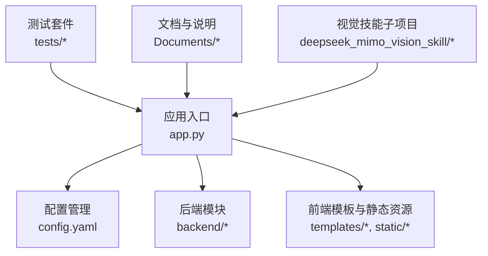
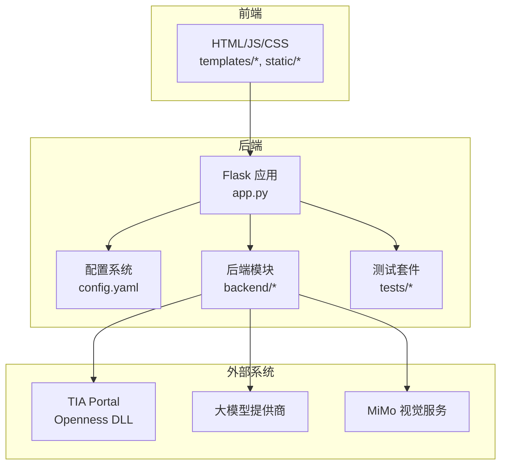
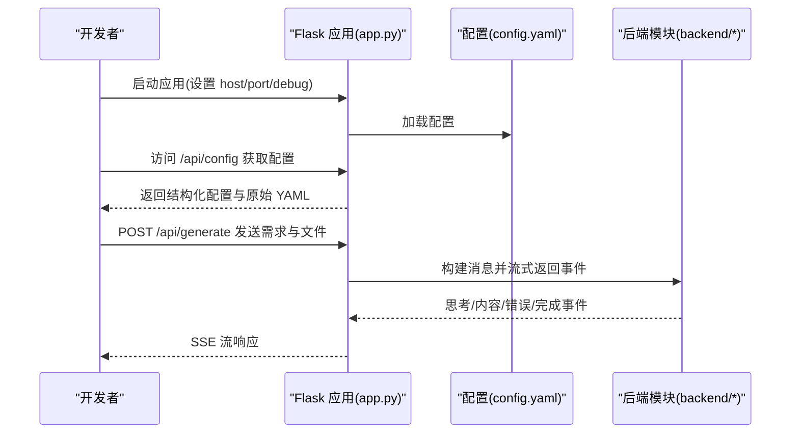
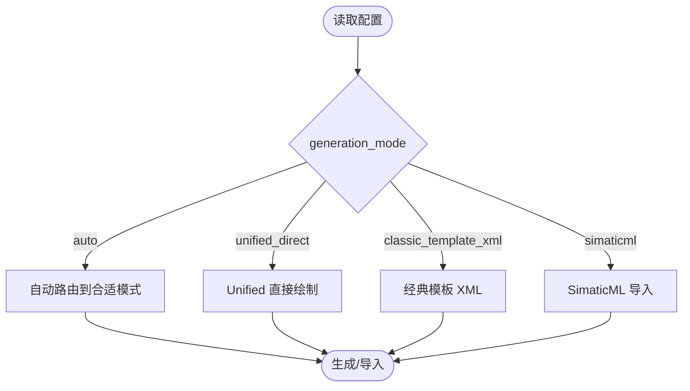
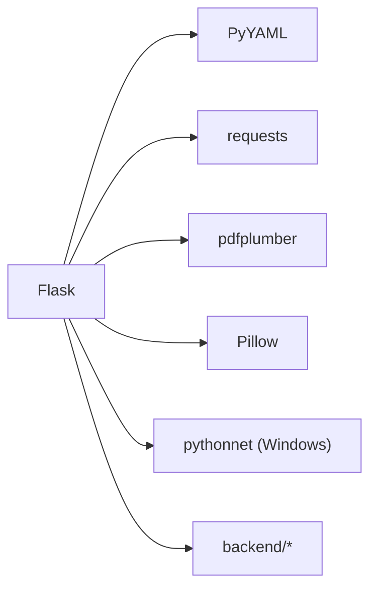

# 开发环境搭建

<cite>
**本文档引用的文件**
- [app.py](file://app.py)
- [requirements.txt](file://requirements.txt)
- [config.yaml](file://config.yaml)
- [test_flask_api.py](file://tests/test_flask_api.py)
- [README_Basic_HMI_Support.md](file://Documents/README_Basic_HMI_Support.md)
- [README.md](file://deepseek_mimo_vision_skill/README.md)
- [SKILL.md](file://deepseek_mimo_vision_skill/SKILL.md)
</cite>

## 目录
1. [简介](#简介)
2. [项目结构](#项目结构)
3. [核心组件](#核心组件)
4. [架构总览](#架构总览)
5. [详细组件分析](#详细组件分析)
6. [依赖分析](#依赖分析)
7. [性能考虑](#性能考虑)
8. [故障排查指南](#故障排查指南)
9. [结论](#结论)
10. [附录](#附录)

## 简介
本指南面向 Siemens HMI Assistant 项目的本地开发环境搭建，涵盖系统要求、IDE 推荐与插件、虚拟环境与依赖安装、Flask 应用调试配置、Git 工作流、代码格式化与预提交钩子、单元测试与覆盖率、以及持续集成配置示例。文档同时结合项目现有配置与测试文件，提供可操作的步骤与最佳实践。

## 项目结构
项目采用前后端分离的 Flask 应用结构，核心入口为应用主文件，配置集中于 YAML 文件，测试位于 tests 目录，前端资源位于 static 与 templates，业务逻辑分布在 backend 子模块。

**图表来源**
- [app.py:1-50](file://app.py#L1-L50)
- [config.yaml:1-50](file://config.yaml#L1-L50)

**章节来源**
- [app.py:1-50](file://app.py#L1-L50)
- [config.yaml:1-50](file://config.yaml#L1-L50)

## 核心组件
- Flask 应用入口与路由：提供配置读取/保存、流式生成、SimaticML 生成与落盘、Openness 连接与导入、V3.0 部署计划与能力查询等 API。
- 配置系统：集中于 config.yaml，包含 LLM 提供商、Openness 连接参数、HMI 默认参数、输出目录与编码、MiMo 视觉审查配置、服务器监听地址与端口等。
- 依赖声明：requirements.txt 明确了 Flask、PyYAML、requests、pdfplumber、Pillow 以及 Windows 下的 pythonnet 依赖条件。
- 测试框架：tests 目录包含针对 Flask API 的单元测试，便于本地验证与 CI 集成。

**章节来源**
- [app.py:84-110](file://app.py#L84-L110)
- [config.yaml:1-343](file://config.yaml#L1-L343)
- [requirements.txt:1-25](file://requirements.txt#L1-L25)
- [test_flask_api.py:1-147](file://tests/test_flask_api.py#L1-L147)

## 架构总览
应用采用单体 Flask 服务，前端通过模板与静态资源提供交互界面，后端通过配置驱动不同生成模式（Unified 直接绘制、经典模板 XML、SimaticML 导入），并通过 Openness 与 TIA Portal 交互。

**图表来源**
- [app.py:17-48](file://app.py#L17-L48)
- [config.yaml:19-342](file://config.yaml#L19-L342)

## 详细组件分析

### Flask 应用与调试配置
- 应用初始化与静态资源缓存策略：禁用静态文件缓存以避免前端缓存导致的接口 404 问题。
- 路由与端点：包含配置读取/保存、流式生成（SSE）、SimaticML 生成与落盘、Openness 诊断/连接/导入、V3.0 部署计划与能力查询等。
- 调试参数：config.yaml 中 server.host、server.port、server.debug 控制本地开发调试行为。

**图表来源**
- [app.py:42-48](file://app.py#L42-L48)
- [app.py:84-110](file://app.py#L84-L110)
- [app.py:166-220](file://app.py#L166-L220)
- [config.yaml:339-343](file://config.yaml#L339-L343)

**章节来源**
- [app.py:42-48](file://app.py#L42-L48)
- [app.py:84-110](file://app.py#L84-L110)
- [app.py:166-220](file://app.py#L166-L220)
- [config.yaml:339-343](file://config.yaml#L339-L343)

### 配置系统与生成模式
- 配置项分布：llm（提供商、模型、流式与思考深度）、openness（TIA 版本、DLL 路径、设备名、生成模式、模板路径等）、hmi_defaults（分辨率、类型、字体等）、output（导出目录、编码、参考 XML）、mimo（视觉审查开关与参数）、server（host/port/debug）。
- 生成模式：auto/unified_direct/classic_template_xml/simaticml，影响 IR 到 XML 的生成路径与导入策略。

**图表来源**
- [config.yaml:19-55](file://config.yaml#L19-L55)
- [config.yaml:61-63](file://config.yaml#L61-L63)
- [app.py:272-310](file://app.py#L272-L310)

**章节来源**
- [config.yaml:19-55](file://config.yaml#L19-L55)
- [config.yaml:61-63](file://config.yaml#L61-L63)
- [app.py:272-310](file://app.py#L272-L310)

### 依赖与系统要求
- Python 版本：requirements.txt 明确建议 Python 3.10 ~ 3.12。
- 核心依赖：Flask、PyYAML、requests、pdfplumber、Pillow；Windows 下的 pythonnet 用于加载 Siemens.Engineering.dll。
- 非 Windows 环境：pythonnet 条件依赖，程序进入诊断模式，不影响前端与大模型流程调试。

**章节来源**
- [requirements.txt:3](file://requirements.txt#L3)
- [requirements.txt:6](file://requirements.txt#L6)
- [requirements.txt:9](file://requirements.txt#L9)
- [requirements.txt:12](file://requirements.txt#L12)
- [requirements.txt:15](file://requirements.txt#L15)
- [requirements.txt:18](file://requirements.txt#L18)
- [requirements.txt:24](file://requirements.txt#L24)

### 测试与覆盖率
- 测试框架：pytest，使用 Flask test client 访问 /api/config、/api/openness/*、/api/build/* 等端点。
- 测试覆盖：配置读取、Openness 能力与诊断、模板 XML 生成、旧版 /api/build、IR + mode 导入等。
- 覆盖率：建议在 CI 中启用覆盖率收集（如 pytest-cov），并在 PR 中设置覆盖率阈值。

**章节来源**
- [test_flask_api.py:1-147](file://tests/test_flask_api.py#L1-L147)

### IDE 配置与插件（推荐）
- VS Code
  - Python 扩展：提供解释器选择、调试器、linting、格式化等。
  - Flask 支持：可选安装 Flask 相关扩展以增强模板与路由提示。
  - GitLens：增强 Git 工作流体验。
- PyCharm
  - 专业版：内置 Flask 支持、Django 支持、数据库工具、科学模式等。
  - 社区版：基础 Python/Flask 支持足够满足开发与调试。

[本节为通用建议，不直接分析具体文件]

### 虚拟环境与依赖安装
- 创建虚拟环境：使用 Python 3.10 ~ 3.12，创建 venv 或 conda 环境。
- 安装依赖：pip install -r requirements.txt。
- Windows 环境：确保具备编译 Pillow 所需的构建工具链（如 Microsoft C++ Build Tools）。

**章节来源**
- [requirements.txt:3](file://requirements.txt#L3)
- [requirements.txt:24](file://requirements.txt#L24)

### 调试配置（Flask、热重载、断点）
- 启动参数：通过 config.yaml 的 server.host、server.port、server.debug 控制开发服务器行为。
- 热重载：在开发环境中启用 Flask 的调试模式与自动重载（由 debug 控制）。
- 断点调试：在 IDE 中设置断点，使用 Flask 的开发服务器进行单步调试；对于 Openness 相关逻辑，可在非 Windows 环境下通过诊断模式绕过 DLL 依赖进行逻辑验证。

**章节来源**
- [config.yaml:339-343](file://config.yaml#L339-L343)
- [app.py:42-48](file://app.py#L42-L48)

### Git 工作流与分支策略
- 分支命名：feature/*、fix/*、docs/*、release/*。
- 提交规范：建议采用 Conventional Commits（如 feat、fix、docs、refactor、test、chore）。
- 合并与保护：主分支使用保护规则，禁止直接推送，强制 Pull Request + 代码审查 + CI 通过。

[本节为通用建议，不直接分析具体文件]

### 代码格式化与预提交钩子
- Black：统一代码风格，建议在 pre-commit 中配置。
- isort：标准化导入排序。
- 预提交钩子：在 .pre-commit-config.yaml 中注册 black、isort、flake8 等检查，确保提交前一致性。

[本节为通用建议，不直接分析具体文件]

### 持续集成配置示例
- 测试与覆盖率：pytest + pytest-cov，PR 中显示覆盖率变化。
- 依赖扫描：pip-audit 或 pip-tools 结合 requirements.txt。
- 构建与发布：GitHub Actions 示例（拉取代码、创建虚拟环境、安装依赖、运行测试、生成覆盖率报告、触发发布）。

[本节为通用建议，不直接分析具体文件]

## 依赖分析
应用依赖主要分为 Web 框架、配置读写、大模型调用、PDF 文本解析、图像处理与 Windows 下的 Openness 互操作。

**图表来源**
- [requirements.txt:6](file://requirements.txt#L6)
- [requirements.txt:9](file://requirements.txt#L9)
- [requirements.txt:12](file://requirements.txt#L12)
- [requirements.txt:15](file://requirements.txt#L15)
- [requirements.txt:24](file://requirements.txt#L24)

**章节来源**
- [requirements.txt:6-24](file://requirements.txt#L6-L24)

## 性能考虑
- 静态资源缓存：开发期禁用缓存，生产环境建议合理设置缓存头。
- 流式生成：SSE 流式返回减少前端等待时间，注意网络中断与重连策略。
- 图像与 PDF 处理：对大文件进行尺寸限制与超时控制，避免阻塞请求。
- Openness 交互：在非 Windows 环境下通过诊断模式避免阻塞，提升开发效率。

[本节为通用指导，不直接分析具体文件]

## 故障排查指南
- Openness 诊断：通过 /api/openness/diagnose 与 /api/openness/status 获取连接状态与诊断信息。
- 配置校验：/api/config 返回结构化配置与原始 YAML，前端展示时对敏感字段做掩码处理。
- 模板 XML 生成：当模板路径无效时返回 400，检查模板路径与屏幕名称。
- IR 校验：/api/build 与 /api/build/template-xml 对 IR 进行校验，非法 IR 返回错误信息。

**章节来源**
- [app.py:316-333](file://app.py#L316-L333)
- [app.py:84-110](file://app.py#L84-L110)
- [app.py:411-458](file://app.py#L411-L458)
- [app.py:272-310](file://app.py#L272-L310)

## 结论
通过遵循本指南，开发者可以在本地快速搭建 Siemens HMI Assistant 的开发环境，掌握 Flask 应用的调试与配置、依赖安装与平台差异处理、测试与覆盖率、以及 Git 工作流与代码质量保障。结合 config.yaml 的配置项与 requirements.txt 的依赖约束，可稳定地进行前端交互、大模型集成与 Openness 交互的开发与调试。

## 附录

### 基础 HMI 支持说明（Basic/KTP Basic）
- 将 Basic 触摸屏作为“经典 HMI”处理，支持常用分辨率与模板 XML 路由。
- 配置 openness.hmi_device、target_resolution、generation_mode 与 classic_template 路径。
- 未配置模板 XML 时不回退 SimaticML，避免生成与设备不兼容的 XML。

**章节来源**
- [README_Basic_HMI_Support.md:12-34](file://Documents/README_Basic_HMI_Support.md#L12-L34)

### 视觉技能子项目（DeepSeek + MiMo）
- 子项目提供 DeepSeek 与 MiMo 的视觉桥接工具，支持图片 OCR、UI 截图分析、图表/表格解读等。
- 安装与测试：在子项目目录创建虚拟环境、安装 requirements、配置 .env，运行工具脚本进行测试。

**章节来源**
- [README.md:36-82](file://deepseek_mimo_vision_skill/README.md#L36-L82)
- [SKILL.md:24-86](file://deepseek_mimo_vision_skill/SKILL.md#L24-L86)