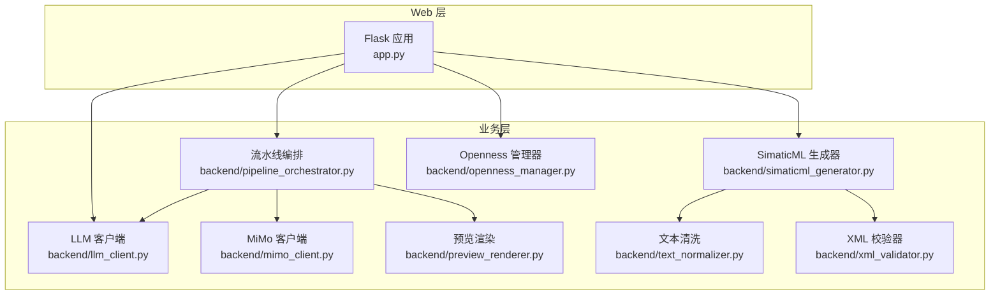
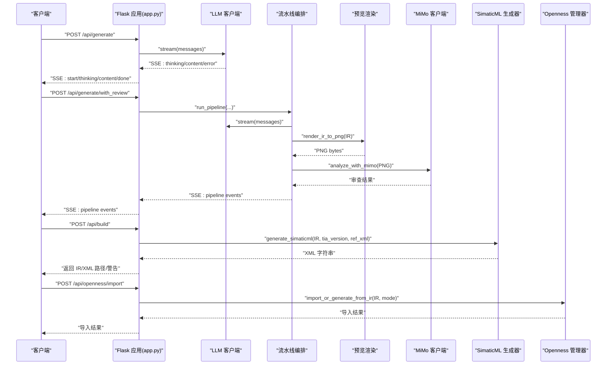
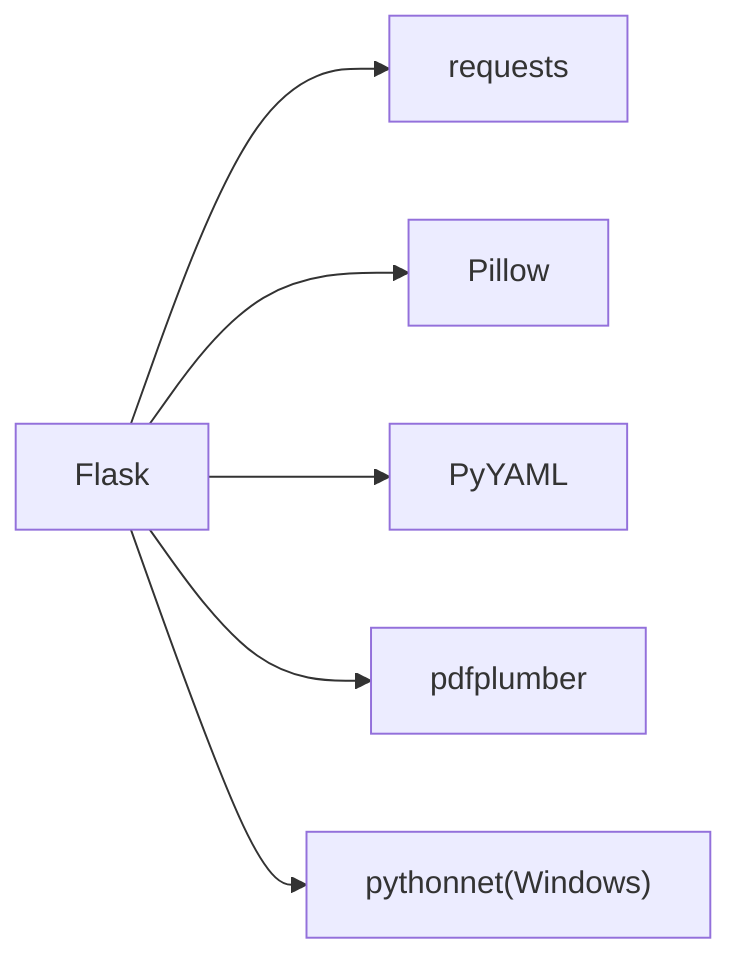

# 性能优化

<cite>
**本文引用的文件**
- [app.py](file://app.py)
- [config.yaml](file://config.yaml)
- [requirements.txt](file://requirements.txt)
- [backend/llm_client.py](file://backend/llm_client.py)
- [backend/pipeline_orchestrator.py](file://backend/pipeline_orchestrator.py)
- [backend/mimo_client.py](file://backend/mimo_client.py)
- [backend/preview_renderer.py](file://backend/preview_renderer.py)
- [backend/simaticml_generator.py](file://backend/simaticml_generator.py)
- [backend/text_normalizer.py](file://backend/text_normalizer.py)
- [backend/xml_validator.py](file://backend/xml_validator.py)
- [backend/openness_manager.py](file://backend/openness_manager.py)
- [tests/test_flask_api.py](file://tests/test_flask_api.py)
</cite>

## 目录
1. [简介](#简介)
2. [项目结构](#项目结构)
3. [核心组件](#核心组件)
4. [架构总览](#架构总览)
5. [详细组件分析](#详细组件分析)
6. [依赖分析](#依赖分析)
7. [性能考虑](#性能考虑)
8. [故障排查指南](#故障排查指南)
9. [结论](#结论)
10. [附录](#附录)

## 简介
本指南面向 Siemens HMI Assistant 的性能优化实践，聚焦以下方面：
- 应用性能监控指标：响应时间、内存使用率、并发处理能力、错误率
- Flask 应用调优参数：线程池、连接池、缓存策略
- LLM API 调用优化：请求频率控制、批量处理、超时设置
- HMI 生成过程性能瓶颈与优化：XML 生成、Openness 导入
- 数据库与静态资源：当前项目未使用数据库，静态资源建议与 CDN
- 负载测试与基准测试：工具与方法

## 项目结构
项目采用“Flask Web + 后端业务模块”的分层设计，核心入口为 Flask 应用，业务逻辑集中在 backend 子包中，包含 LLM 客户端、流水线编排、MiMo 视觉审查、XML 生成、Openness 管理、文本清洗与校验等模块。

图表来源
- [app.py](file://app.py)
- [backend/llm_client.py](file://backend/llm_client.py)
- [backend/pipeline_orchestrator.py](file://backend/pipeline_orchestrator.py)
- [backend/mimo_client.py](file://backend/mimo_client.py)
- [backend/preview_renderer.py](file://backend/preview_renderer.py)
- [backend/simaticml_generator.py](file://backend/simaticml_generator.py)
- [backend/text_normalizer.py](file://backend/text_normalizer.py)
- [backend/xml_validator.py](file://backend/xml_validator.py)
- [backend/openness_manager.py](file://backend/openness_manager.py)

章节来源
- [app.py](file://app.py)
- [config.yaml](file://config.yaml)

## 核心组件
- Flask 应用：提供配置读取、HMI 生成、构建、Openness 诊断/连接/导入等 API，支持 SSE 流式输出
- LLM 客户端：封装 OpenAI 兼容接口，支持流式输出与思考深度控制
- 流水线编排：将“生成 → 预览渲染 → MiMo 审查 → 修正 → 再审查”串联为 SSE 事件流
- MiMo 客户端：图像理解 API 调用，支持图片尺寸限制与超时控制
- 预览渲染：将 IR 直接渲染为 PNG，供 MiMo 审查
- SimaticML 生成器：将 IR 转换为 TIA 兼容的 SimaticML XML
- 文本清洗与 XML 校验：保障 TIA 导入前的文本与结构合规
- Openness 管理器：连接 TIA、导出参考画面、预处理 XML、导入屏幕

章节来源
- [app.py](file://app.py)
- [backend/llm_client.py](file://backend/llm_client.py)
- [backend/pipeline_orchestrator.py](file://backend/pipeline_orchestrator.py)
- [backend/mimo_client.py](file://backend/mimo_client.py)
- [backend/preview_renderer.py](file://backend/preview_renderer.py)
- [backend/simaticml_generator.py](file://backend/simaticml_generator.py)
- [backend/text_normalizer.py](file://backend/text_normalizer.py)
- [backend/xml_validator.py](file://backend/xml_validator.py)
- [backend/openness_manager.py](file://backend/openness_manager.py)

## 架构总览
下图展示从请求到响应的关键路径，以及与外部系统的交互（LLM、MiMo、Openness）：

图表来源
- [app.py](file://app.py)
- [backend/llm_client.py](file://backend/llm_client.py)
- [backend/pipeline_orchestrator.py](file://backend/pipeline_orchestrator.py)
- [backend/preview_renderer.py](file://backend/preview_renderer.py)
- [backend/mimo_client.py](file://backend/mimo_client.py)
- [backend/simaticml_generator.py](file://backend/simaticml_generator.py)
- [backend/openness_manager.py](file://backend/openness_manager.py)

## 详细组件分析

### Flask 应用与性能监控
- SSE 流式输出：/api/generate 与 /api/generate/with_review 使用 text/event-stream，前端可实时接收事件，降低等待感
- 静态资源缓存：开发期禁用静态缓存，生产环境建议启用缓存与版本化
- Openness 全局连接：维持跨请求的 Openness 连接，避免频繁连接/断开带来的延迟

建议的监控指标
- 响应时间：端点级 P50/P90/P99，区分 SSE 与非 SSE
- 并发处理：活跃连接数、队列长度、阻塞时间
- 错误率：HTTP 5xx、SSE 错误事件占比
- 资源使用：CPU、内存、线程数、GC 次数

章节来源
- [app.py](file://app.py)

### LLM 客户端与调优
- 流式输出：逐块产出思考/正文，前端可逐步渲染
- 超时设置：默认 300 秒，避免长对话挂起
- 思考深度：支持低/中/高，映射到推理努力或提示词诱导
- API Key 校验：缺失时立即返回错误，避免无效请求

调优要点
- 请求频率控制：避免短时间内大量并发流式请求；可引入令牌桶限流
- 批量处理：对多个请求合并为单次流式对话（需评估上下文窗口）
- 超时设置：根据模型响应时间调整，结合 SSE 心跳保活
- 缓存策略：对相同提示词的结果进行短期缓存（需注意隐私）

章节来源
- [backend/llm_client.py](file://backend/llm_client.py)
- [config.yaml](file://config.yaml)

### 流水线编排与性能
- 多阶段流水线：图像分析 → 生成 → 预览渲染 → MiMo 审查 → 修正 → 再审查
- 最大迭代次数：由配置控制，避免无限循环
- 审查阈值：通过分数阈值决定是否继续修正
- 渲染与审查：预览渲染与 MiMo API 调用是主要耗时点

优化建议
- 图像分析：限制图片数量与尺寸，避免 token 爆炸
- 预览渲染：缓存字体与图像，复用渲染上下文
- 审查结果：对审查结果进行结构化缓存，减少重复调用

章节来源
- [backend/pipeline_orchestrator.py](file://backend/pipeline_orchestrator.py)
- [backend/mimo_client.py](file://backend/mimo_client.py)
- [backend/preview_renderer.py](file://backend/preview_renderer.py)
- [config.yaml](file://config.yaml)

### 预览渲染与图像处理
- Pillow 渲染：将 IR 对象绘制为 PNG，支持字体缓存与系统字体回退
- 字体缓存：按字号与粗细缓存 FreeTypeFont，减少字体加载开销
- 文本渲染：统一换行、制表符处理与空白压缩

优化建议
- 字体缓存：持久化字体缓存，减少启动时初始化成本
- 图像尺寸：根据目标分辨率动态缩放，避免过大图像
- 并发渲染：对多 IR 并行渲染时限制并发度，避免 CPU/内存峰值

章节来源
- [backend/preview_renderer.py](file://backend/preview_renderer.py)

### MiMo 客户端与图像理解
- 图像输入：支持路径、URL、base64，自动 MIME 推断与尺寸限制
- 超时控制：可配置审查超时，避免长时间阻塞
- 输出解析：对非 JSON 输出进行兜底处理，保证稳定性

优化建议
- 图像预处理：对大图等比缩放，控制最大边长
- 超时与重试：对网络错误进行指数退避重试
- 并发控制：限制同时发起的 MiMo 请求数量

章节来源
- [backend/mimo_client.py](file://backend/mimo_client.py)
- [config.yaml](file://config.yaml)

### SimaticML 生成器与 XML 生成
- 多对象生成：Text、IOField、SymbolicIOField、Button、Indicator 等
- 命名空间与结构：根据参考 XML 匹配 TIA 版本与 HMI 类型
- 导入前校验：文本清洗、MultilingualText 标准重建、删除 Number 节点、DOM 校验

性能瓶颈
- XML 生成：对象数量与复杂度直接影响生成时间
- DOM 操作：MultilingualText 重建与结构修复为 CPU 密集

优化建议
- 生成策略：按对象类型分批生成，减少中间字符串拼接
- DOM 优化：批量重建节点，避免重复解析
- 缓存参考模板：复用参考 XML 的结构信息，减少正则匹配

章节来源
- [backend/simaticml_generator.py](file://backend/simaticml_generator.py)
- [backend/text_normalizer.py](file://backend/text_normalizer.py)
- [backend/xml_validator.py](file://backend/xml_validator.py)

### 文本清洗与 XML 校验
- 文本清洗：移除 HTML/Markdown 标签、控制字符，保留 TIA 允许的富文本结构
- XML 校验：检查 MultilingualText 结构、非法 ID 子节点、Number 节点、根元素等

优化建议
- 正则优化：对已知标签集合进行精确匹配，避免通配误伤
- DOM 校验：优先使用 ElementTree 进行结构化检查，提高准确性

章节来源
- [backend/text_normalizer.py](file://backend/text_normalizer.py)
- [backend/xml_validator.py](file://backend/xml_validator.py)

### Openness 管理器与导入性能
- 连接管理：全局唯一 Openness 连接，减少连接开销
- XML 预处理：文本清洗、MultilingualText 重建、删除 Number 节点、屏幕尺寸对齐
- 导入策略：统一使用 Screens.Import，避免反射与 hack，Fail Fast

性能瓶颈
- TIA 进程交互：导入过程受 TIA 性能影响
- 屏幕尺寸对齐：大规模对象缩放计算

优化建议
- 屏幕尺寸：提前对齐至目标 HMI 尺寸，减少导入后调整
- 冲突检测：预先检测 screen number 冲突，避免导入失败重试
- 日志与诊断：记录导入尝试与失败原因，便于定位性能问题

章节来源
- [backend/openness_manager.py](file://backend/openness_manager.py)
- [app.py](file://app.py)

## 依赖分析
- Flask：Web 框架，SSE 与静态资源处理
- requests：LLM 与 MiMo API 调用
- pdfplumber：PDF 文本提取
- Pillow：图像处理与渲染
- pythonnet：Windows 专用，加载 Siemens.Engineering.dll

图表来源
- [requirements.txt](file://requirements.txt)

章节来源
- [requirements.txt](file://requirements.txt)

## 性能考虑

### Flask 应用调优参数
- 线程池与并发
  - 生产环境建议使用 WSGI 服务器（如 Gunicorn、Waitress）管理进程与线程
  - SSE 场景下，每个连接占用一个线程/协程，需限制并发数并设置超时
- 连接池
  - requests 默认连接池适用于短连接场景；如需长连接可自定义 Session
- 缓存策略
  - 对 LLM 与 MiMo 的结果进行短期缓存（需注意隐私与一致性）
  - 预览渲染的字体与图像可缓存，减少重复计算
- 静态资源
  - 启用浏览器缓存与版本化，CDN 加速
  - 压缩 CSS/JS（如 gzip/br），减少首屏加载时间

### LLM API 调优
- 请求频率控制：使用令牌桶或漏桶算法限制并发与速率
- 超时设置：结合模型响应时间设置合理超时，避免长时间阻塞
- 批量处理：对相似请求进行合并，减少上下文切换
- 缓存：对相同提示词的输出进行缓存（需考虑隐私）

### HMI 生成过程优化
- XML 生成
  - 减少字符串拼接，采用列表收集后再 join
  - 对 MultilingualText 与 DOM 操作进行批量处理
- Openness 导入
  - 提前对齐屏幕尺寸，避免导入后缩放
  - 预检测 screen number 冲突，减少失败重试
  - 使用统一导入接口，避免反射与 hack

### 数据库与静态资源
- 数据库：当前项目未使用数据库，无需连接池与查询优化
- 静态资源：启用缓存与 CDN，压缩传输体积

### 负载测试与基准测试
- 工具
  - Locust：模拟并发用户，观测响应时间与错误率
  - JMeter：录制与回放，支持复杂场景
  - ab/wrk2：简单快速的 HTTP 压测
- 方法
  - 基准场景：单用户生成、SSE 流式、MiMo 审查、Openness 导入
  - 压力场景：多用户并发、长对话、大图审查、大批量导入
  - 指标采集：响应时间分布、吞吐量、错误率、资源使用

章节来源
- [app.py](file://app.py)
- [backend/llm_client.py](file://backend/llm_client.py)
- [backend/pipeline_orchestrator.py](file://backend/pipeline_orchestrator.py)
- [backend/mimo_client.py](file://backend/mimo_client.py)
- [backend/preview_renderer.py](file://backend/preview_renderer.py)
- [backend/simaticml_generator.py](file://backend/simaticml_generator.py)
- [backend/openness_manager.py](file://backend/openness_manager.py)

## 故障排查指南
- LLM 与 MiMo
  - API Key 未配置：立即返回错误，检查配置
  - 超时与网络错误：检查超时设置与网络连通性
  - 非 JSON 输出：进行兜底处理，记录原始文本
- 预览渲染
  - 字体缺失：回退到默认字体，检查字体缓存
  - 空对象：确保 IR 包含 objects
- Openness 导入
  - DLL 路径与权限：检查 Windows、pythonnet、用户组
  - XML 结构错误：使用校验器与修复器，关注 MultilingualText 与 Number 节点
  - 屏幕尺寸不匹配：提前对齐至目标 HMI 尺寸

章节来源
- [backend/llm_client.py](file://backend/llm_client.py)
- [backend/mimo_client.py](file://backend/mimo_client.py)
- [backend/preview_renderer.py](file://backend/preview_renderer.py)
- [backend/openness_manager.py](file://backend/openness_manager.py)
- [backend/xml_validator.py](file://backend/xml_validator.py)

## 结论
本指南从应用监控、Flask 调优、LLM 与 MiMo 优化、HMI 生成与 Openness 导入等方面提供了系统性的性能优化建议。通过合理的并发控制、缓存策略、预处理与校验、以及完善的负载测试方法，可显著提升用户体验与系统稳定性。

## 附录
- 测试端点覆盖：配置、Openness、生成与导入等端点的测试用例，可用于回归与性能验证
- 配置参考：llm、mimo、server、openness 等关键配置项

章节来源
- [tests/test_flask_api.py](file://tests/test_flask_api.py)
- [config.yaml](file://config.yaml)