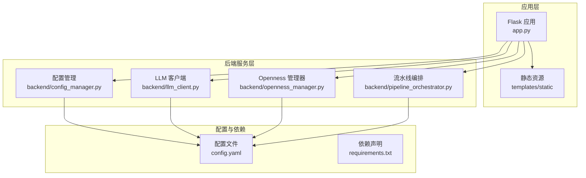
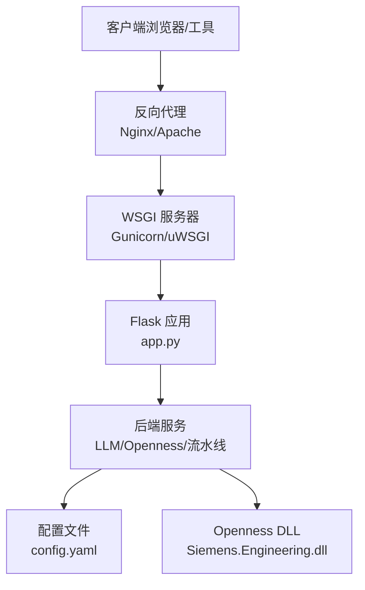
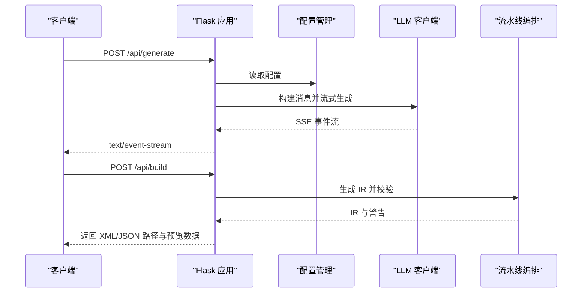
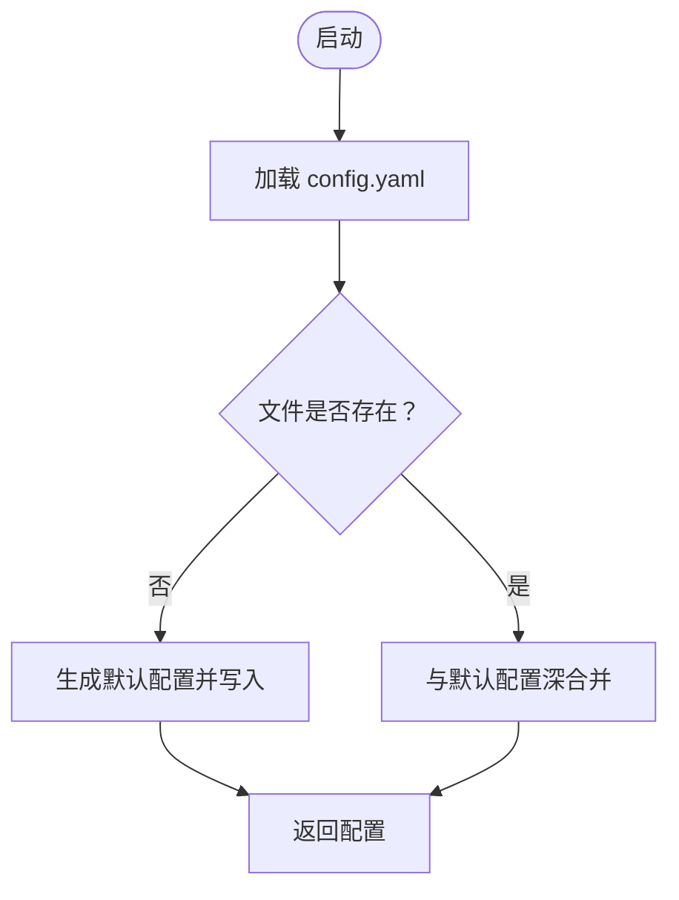
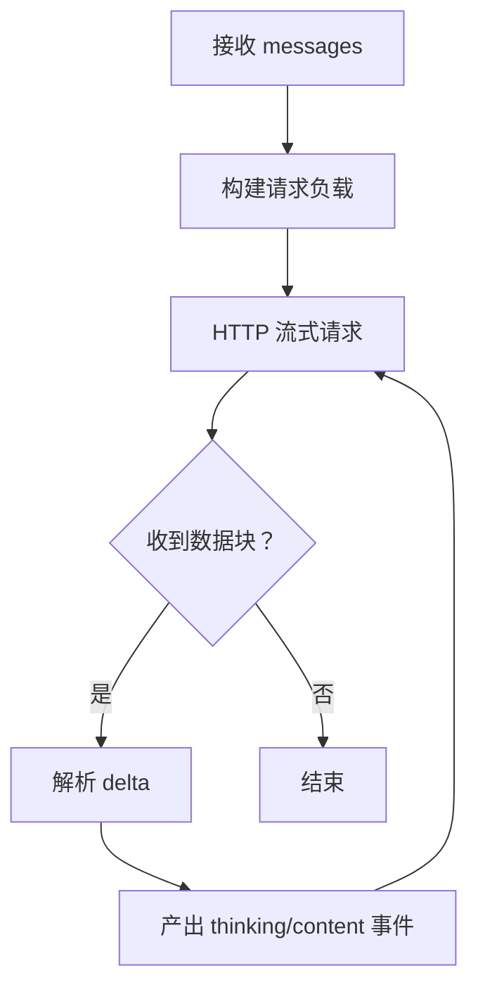
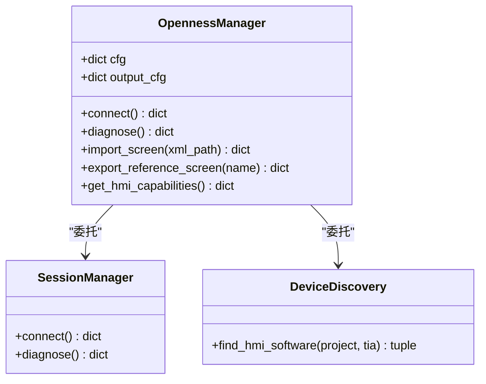
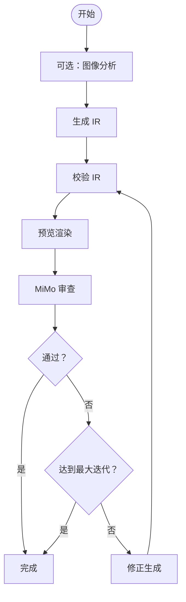
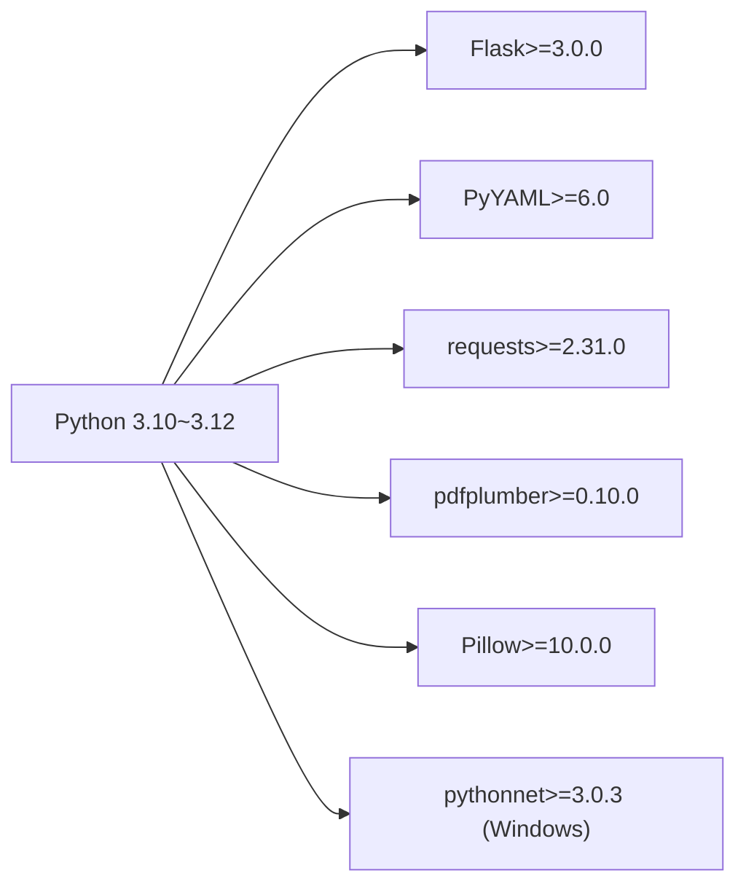

# 生产环境部署

<cite>
**本文档引用的文件**
- [app.py](file://app.py)
- [config.yaml](file://config.yaml)
- [requirements.txt](file://requirements.txt)
- [backend/config_manager.py](file://backend/config_manager.py)
- [backend/llm_client.py](file://backend/llm_client.py)
- [backend/openness_manager.py](file://backend/openness_manager.py)
- [backend/pipeline_orchestrator.py](file://backend/pipeline_orchestrator.py)
- [Documents/README_Basic_HMI_Support.md](file://Documents/README_Basic_HMI_Support.md)
</cite>

## 目录
1. [简介](#简介)
2. [项目结构](#项目结构)
3. [核心组件](#核心组件)
4. [架构概览](#架构概览)
5. [详细组件分析](#详细组件分析)
6. [依赖分析](#依赖分析)
7. [性能考虑](#性能考虑)
8. [故障排除指南](#故障排除指南)
9. [结论](#结论)
10. [附录](#附录)

## 简介
本指南面向 Siemens HMI Assistant 生产环境部署，涵盖服务器硬件要求、操作系统兼容性、网络配置与安全设置、依赖安装步骤（Python 环境、Flask 服务器、LLM API 密钥、Openness DLL 路径）、反向代理配置示例、数据库连接配置、SSL 证书配置、性能调优参数、并发处理与内存管理、容器化部署（Docker）与 Kubernetes 部署清单示例。文档内容严格基于仓库源码与配置文件分析整理，确保可操作性与准确性。

## 项目结构
项目采用后端服务 + 前端静态资源的典型 Flask 应用结构，核心业务逻辑集中在 backend 目录，配置通过 config.yaml 管理，依赖通过 requirements.txt 管理。

**图表来源**
- [app.py:1-966](file://app.py#L1-L966)
- [backend/config_manager.py:1-142](file://backend/config_manager.py#L1-L142)
- [backend/llm_client.py:1-229](file://backend/llm_client.py#L1-L229)
- [backend/openness_manager.py:1-800](file://backend/openness_manager.py#L1-L800)
- [backend/pipeline_orchestrator.py:1-354](file://backend/pipeline_orchestrator.py#L1-L354)
- [config.yaml:1-343](file://config.yaml#L1-L343)
- [requirements.txt:1-25](file://requirements.txt#L1-L25)

**章节来源**
- [app.py:1-966](file://app.py#L1-L966)
- [config.yaml:1-343](file://config.yaml#L1-L343)
- [requirements.txt:1-25](file://requirements.txt#L1-L25)

## 核心组件
- Flask 应用与路由：提供主界面、配置读写、生成与构建、Openness 诊断与导入、V3.0 部署计划与能力查询等 API。
- 配置管理：统一加载/保存 config.yaml，提供默认配置与深合并机制，支持原始 YAML 编辑模式。
- LLM 客户端：支持 OpenAI 兼容接口，流式输出，思考深度控制，错误处理与超时控制。
- Openness 管理器：Windows 专用，加载 Siemens.Engineering.dll，连接 TIA Portal，设备发现，导入 XML，编译与诊断。
- 流水线编排：多阶段生成-审查-修正流水线，支持 MiMo 视觉审查与自动迭代。

**章节来源**
- [app.py:80-630](file://app.py#L80-L630)
- [backend/config_manager.py:108-142](file://backend/config_manager.py#L108-L142)
- [backend/llm_client.py:35-229](file://backend/llm_client.py#L35-L229)
- [backend/openness_manager.py:31-190](file://backend/openness_manager.py#L31-L190)
- [backend/pipeline_orchestrator.py:131-354](file://backend/pipeline_orchestrator.py#L131-L354)

## 架构概览
生产环境建议采用反向代理（Nginx/Apache）前置，后端使用 WSGI 服务器（如 Gunicorn/uWSGI）承载 Flask 应用，数据库可选（本项目未内置数据库），Openness 功能仅在 Windows 环境启用。

**图表来源**
- [app.py:1-966](file://app.py#L1-L966)
- [backend/llm_client.py:78-170](file://backend/llm_client.py#L78-L170)
- [backend/openness_manager.py:142-190](file://backend/openness_manager.py#L142-L190)
- [config.yaml:1-343](file://config.yaml#L1-L343)

## 详细组件分析

### Flask 应用与路由
- 主页路由：渲染 index.html。
- 配置路由：/api/config 提供配置读取与保存（结构化与原始 YAML）。
- 生成与构建：/api/generate（SSE 流式生成）、/api/build（生成 SimaticML XML 并落盘）。
- Openness：/api/openness/* 系列路由，包含诊断、连接、导入、导出参考画面、能力查询等。
- V3.0：/api/hmi/* 系列路由，提供 validate、plan、deploy、verify、capabilities、runtime-metadata 等。

**图表来源**
- [app.py:166-310](file://app.py#L166-L310)
- [backend/llm_client.py:78-170](file://backend/llm_client.py#L78-L170)
- [backend/pipeline_orchestrator.py:131-237](file://backend/pipeline_orchestrator.py#L131-L237)

**章节来源**
- [app.py:76-630](file://app.py#L76-L630)

### 配置管理
- 默认配置：包含 llm、openness、hmi_defaults、output、mimo、server 等键，首次运行自动生成。
- 深合并：将用户配置与默认配置合并，保证新增字段不缺失。
- 原始 YAML：支持直接保存原始 YAML 文本，进行强校验。

**图表来源**
- [backend/config_manager.py:108-118](file://backend/config_manager.py#L108-L118)

**章节来源**
- [backend/config_manager.py:12-94](file://backend/config_manager.py#L12-L94)
- [backend/config_manager.py:108-142](file://backend/config_manager.py#L108-L142)

### LLM 客户端
- 思考深度映射：关闭/低/中/高，分别映射到原生推理 effort 或提示词诱导。
- 流式输出：逐块产出 thinking/content/error 三类事件，前端通过 SSE 接收。
- 超时与错误：统一捕获网络/请求异常与超时，返回错误事件。

**图表来源**
- [backend/llm_client.py:45-170](file://backend/llm_client.py#L45-L170)

**章节来源**
- [backend/llm_client.py:35-229](file://backend/llm_client.py#L35-L229)

### Openness 管理器
- 诊断：检查操作系统、pythonnet、DLL 路径、TIA 进程等。
- 连接：附加到运行中的 TIA Portal 实例，打开项目。
- 导入：预处理 XML（文本清洗、MultilingualText 重建、screen number 处理、尺寸对齐），统一通过 Screens.Import 导入。
- 设备发现：根据配置与设备名匹配 HMI 软件类型（Basic/Comfort/Unified）。

**图表来源**
- [backend/openness_manager.py:31-101](file://backend/openness_manager.py#L31-L101)
- [backend/openness_manager.py:142-190](file://backend/openness_manager.py#L142-L190)

**章节来源**
- [backend/openness_manager.py:1-800](file://backend/openness_manager.py#L1-L800)

### 流水线编排
- 多阶段：图像分析（可选）→ 生成 → 预览渲染 → MiMo 审查 → 修正 → 再审查。
- 迭代控制：受 mimo.max_iterations 与通过阈值控制。
- 事件输出：与 SSE 兼容的事件流，前端实时展示进度。

**图表来源**
- [backend/pipeline_orchestrator.py:131-354](file://backend/pipeline_orchestrator.py#L131-L354)

**章节来源**
- [backend/pipeline_orchestrator.py:1-354](file://backend/pipeline_orchestrator.py#L1-L354)

## 依赖分析
- Python 版本：建议 3.10 ~ 3.12。
- Web 框架：Flask>=3.0.0。
- 配置：PyYAML>=6.0。
- LLM：requests>=2.31.0。
- PDF：pdfplumber>=0.10.0。
- 图像：Pillow>=10.0.0。
- Openness（Windows 专用）：pythonnet>=3.0.3。

**图表来源**
- [requirements.txt:1-25](file://requirements.txt#L1-L25)

**章节来源**
- [requirements.txt:1-25](file://requirements.txt#L1-L25)

## 性能考虑
- 服务器配置
  - 主机与端口：config.yaml server.host/port，默认 127.0.0.1:5000。生产建议绑定内网或公网 IP，并配合反向代理。
  - 调试模式：server.debug 默认开启，生产应关闭。
- 并发与线程
  - Flask 默认单进程单线程，生产建议使用 Gunicorn/uWSGI 等 WSGI 服务器，合理设置 worker 数量与并发。
  - Openness 仅 Windows 支持，且为附加到 TIA 实例，需注意 TIA Portal 的资源占用与稳定性。
- 内存管理
  - LLM 流式响应与图像分析（MiMo）可能产生较大中间数据，建议限制并发与请求体大小，必要时启用上游限流。
  - PDF 文本提取与图像处理建议控制文件大小与数量，避免内存峰值过高。
- 超时与重试
  - LLM 请求超时默认 300 秒；MiMo 审查超时可通过 mimo.review_timeout_seconds 配置。
  - 反向代理层建议设置合理的超时与缓冲策略，避免长连接阻塞。

**章节来源**
- [config.yaml:339-343](file://config.yaml#L339-L343)
- [backend/llm_client.py:99-104](file://backend/llm_client.py#L99-L104)
- [backend/llm_client.py:166-169](file://backend/llm_client.py#L166-L169)
- [backend/pipeline_orchestrator.py:240-288](file://backend/pipeline_orchestrator.py#L240-L288)

## 故障排除指南
- Openness 诊断
  - 非 Windows 系统：Openness 仅支持 Windows，会提示环境不支持。
  - 未安装 pythonnet：提示安装 pythonnet。
  - DLL 路径不存在：检查 config.yaml openness.dll_path。
  - 无运行中的 TIA 实例：提示先打开 TIA Portal 并加载项目。
- LLM 配置
  - 未配置 API Key：LLM 客户端会返回错误事件，提示填写。
  - 网络/超时：检查网络连通性与超时设置。
- 流水线
  - 审查失败：检查 MiMo API Key 与网络；查看审查结果摘要与建议。
  - IR 校验失败：检查生成的 IR 结构与字段，确保符合规范。

**章节来源**
- [backend/openness_manager.py:103-139](file://backend/openness_manager.py#L103-L139)
- [backend/llm_client.py:82-85](file://backend/llm_client.py#L82-L85)
- [backend/llm_client.py:166-169](file://backend/llm_client.py#L166-L169)
- [backend/pipeline_orchestrator.py:250-258](file://backend/pipeline_orchestrator.py#L250-L258)

## 结论
本指南提供了 Siemens HMI Assistant 生产环境部署的完整路径：从硬件与系统要求、依赖安装、配置要点（LLM API 密钥、Openness DLL 路径、输出目录等），到网络与安全（反向代理、SSL 证书）、性能调优（并发、超时、内存）、容器化与编排（Docker/Kubernetes）等。建议在生产环境中严格分离配置文件与密钥，启用 HTTPS 与访问控制，并结合监控与日志体系持续优化。

## 附录

### 服务器硬件要求（建议）
- CPU：多核 2 核以上，建议 4 核以上以支持并发与图像处理。
- 内存：至少 4GB，建议 8GB 以上，Openness 导入与 TIA 编译会占用较多内存。
- 存储：SSD 至少 20GB 可用空间，用于导出 XML/JSON 与日志。
- 网络：稳定的互联网连接，用于 LLM API 与可选的 MiMo 审查。

### 操作系统兼容性
- Windows：必需（Openness 仅支持 Windows，pythonnet 为 Windows 专用）。
- Linux/macOS：可运行前端与 LLM 流程，但 Openness 功能受限。

**章节来源**
- [backend/openness_manager.py:8-16](file://backend/openness_manager.py#L8-L16)

### 网络配置与安全设置
- 反向代理
  - Nginx/Apache 作为反向代理，将 /api/* 路由转发至 Flask 应用。
  - 启用 HTTPS，配置 SSL 证书与私钥。
  - 设置合理的超时（proxy_read_timeout、proxy_send_timeout）与缓冲（proxy_buffering）。
- 访问控制
  - 限制 /api/config 的写权限，仅允许受信 IP 访问。
  - 使用防火墙规则仅开放反向代理端口。

### 依赖安装步骤
- Python 环境
  - 使用 Python 3.10 ~ 3.12。
  - 创建虚拟环境并激活。
- 安装依赖
  - pip install -r requirements.txt。
- 配置文件
  - 首次运行自动生成 config.yaml，按需修改 llm、openness、server、mimo 等配置。
- Openness DLL 路径
  - 在 config.yaml 中设置 openness.dll_path 指向 Siemens.Engineering.dll。
  - 确保当前用户属于 "Siemens TIA Openness" 用户组。

**章节来源**
- [requirements.txt:3](file://requirements.txt#L3)
- [config.yaml:19-31](file://config.yaml#L19-L31)
- [backend/config_manager.py:12-94](file://backend/config_manager.py#L12-L94)

### Flask 服务器设置
- 开发 vs 生产
  - 开发：server.debug=true，便于调试。
  - 生产：server.debug=false，绑定内网或公网 IP。
- WSGI 服务器
  - 建议使用 Gunicorn：gunicorn --workers N --bind 0.0.0.0:PORT app:app。
  - 注意：app.py 中未设置 threaded=True，生产建议通过 WSGI 服务器管理并发。

**章节来源**
- [config.yaml:339-343](file://config.yaml#L339-L343)
- [app.py:964](file://app.py#L964)

### LLM API 密钥配置
- 在 config.yaml llm.providers 中填写 base_url、api_key、chat_model、reasoner_model。
- 若使用 DeepSeek，base_url 为 https://api.deepseek.com；若使用 OpenAI 兼容，base_url 为 https://api.openai.com/v1。
- thinking_depth 控制推理深度，show_thinking 控制是否输出思考过程。

**章节来源**
- [config.yaml:1-18](file://config.yaml#L1-L18)
- [backend/llm_client.py:20-32](file://backend/llm_client.py#L20-L32)

### Openness DLL 路径设置
- 在 config.yaml openness.dll_path 指向 Siemens.Engineering.dll。
- Windows 环境下，pythonnet 必须安装，否则进入诊断模式。
- 目标 TIA 版本与项目路径可在 openness 中配置。

**章节来源**
- [config.yaml:19-31](file://config.yaml#L19-L31)
- [backend/openness_manager.py:142-190](file://backend/openness_manager.py#L142-L190)

### 反向代理配置示例（Nginx/Apache）
- Nginx
  - upstream 指向 Flask WSGI 服务器。
  - location /api/* 代理到 upstream。
  - 启用 HTTPS，配置 ssl_certificate 与 ssl_certificate_key。
  - 设置 proxy_read_timeout、proxy_send_timeout、proxy_buffering。
- Apache
  - 使用 mod_proxy_http 或 mod_proxy_uwsgi。
  - ProxyPass /api/ http://127.0.0.1:PORT/api/
  - 启用 SSL，配置 SSLEngine、SSLCertificateFile、SSLCertificateKeyFile。

[本节为通用配置说明，不直接分析具体源文件，故无“章节来源”]

### 数据库连接配置
- 本项目未内置数据库，无需数据库连接配置。
- 若需持久化日志或导出记录，可自行扩展存储方案（如文件系统、对象存储）。

[本节为通用说明，不直接分析具体源文件，故无“章节来源”]

### SSL 证书配置
- 使用反向代理配置 SSL 证书与私钥。
- 建议使用 Let's Encrypt 自动续期。
- 强制 HTTPS，禁用 HTTP 明文访问。

[本节为通用说明，不直接分析具体源文件，故无“章节来源”]

### 性能调优参数
- 并发与线程
  - Gunicorn：--workers N（CPU 核心数 × 2 + 1 为常见起始值）。
  - 每 worker 的并发：根据请求特性调整。
- 超时
  - LLM：默认 300 秒；可根据网络状况调整。
  - MiMo：mimo.review_timeout_seconds。
- 缓冲
  - 反向代理设置合理的 proxy_buffering 与缓冲大小，避免长连接阻塞。

**章节来源**
- [backend/llm_client.py:99-104](file://backend/llm_client.py#L99-L104)
- [backend/pipeline_orchestrator.py:240-288](file://backend/pipeline_orchestrator.py#L240-L288)

### 并发处理与内存管理
- 并发：通过 WSGI 服务器管理，避免在 Flask 层设置 threaded。
- 内存：限制上传文件大小与数量，控制 PDF 与图像处理规模。
- Openness：避免频繁连接/断开，复用全局 OpennessManager 实例。

**章节来源**
- [app.py:62-70](file://app.py#L62-L70)
- [backend/openness_manager.py:142-190](file://backend/openness_manager.py#L142-L190)

### Docker 容器化部署方案
- 基础镜像：python:3.10-slim 或 python:3.12-slim。
- 安装依赖：COPY requirements.txt && RUN pip install -r requirements.txt。
- 复制代码：COPY . /app，WORKDIR /app。
- 端口暴露：EXPOSE 5000。
- 启动命令：gunicorn --workers N --bind 0.0.0.0:5000 app:app。
- 挂载卷：挂载 exports 目录与 config.yaml，确保重启后配置与导出文件持久化。
- Windows Openness：不建议在容器中运行，建议在宿主机安装 TIA Portal 并通过网络共享导出目录。

[本节为通用容器化说明，不直接分析具体源文件，故无“章节来源”]

### Kubernetes 部署清单示例
- Deployment
  - replicas：1（生产可扩展，但需注意 Openness 的单实例特性）。
  - resources：设置 requests/limits。
  - env：注入 config.yaml 内容或通过 ConfigMap/Secret 管理。
- Service
  - ClusterIP/NodePort/LoadBalancer，按需选择。
- ConfigMap/Secret
  - 存放 config.yaml 与敏感信息（如 LLM API Key）。
- PersistentVolumeClaim
  - 挂载 exports 目录，确保导出文件持久化。
- Ingress
  - 配置 TLS 证书与域名，启用 HTTPS。

[本节为通用 K8s 部署说明，不直接分析具体源文件，故无“章节来源”]

### Basic HMI 支持补充
- Basic/KTP Basic 触摸屏作为“经典 HMI”处理，需配置模板 XML 与目标分辨率。
- generation_mode 建议设为 auto，确保 Basic 自动路由到 classic_template_xml。

**章节来源**
- [Documents/README_Basic_HMI_Support.md:1-34](file://Documents/README_Basic_HMI_Support.md#L1-L34)
- [config.yaml:31-55](file://config.yaml#L31-L55)