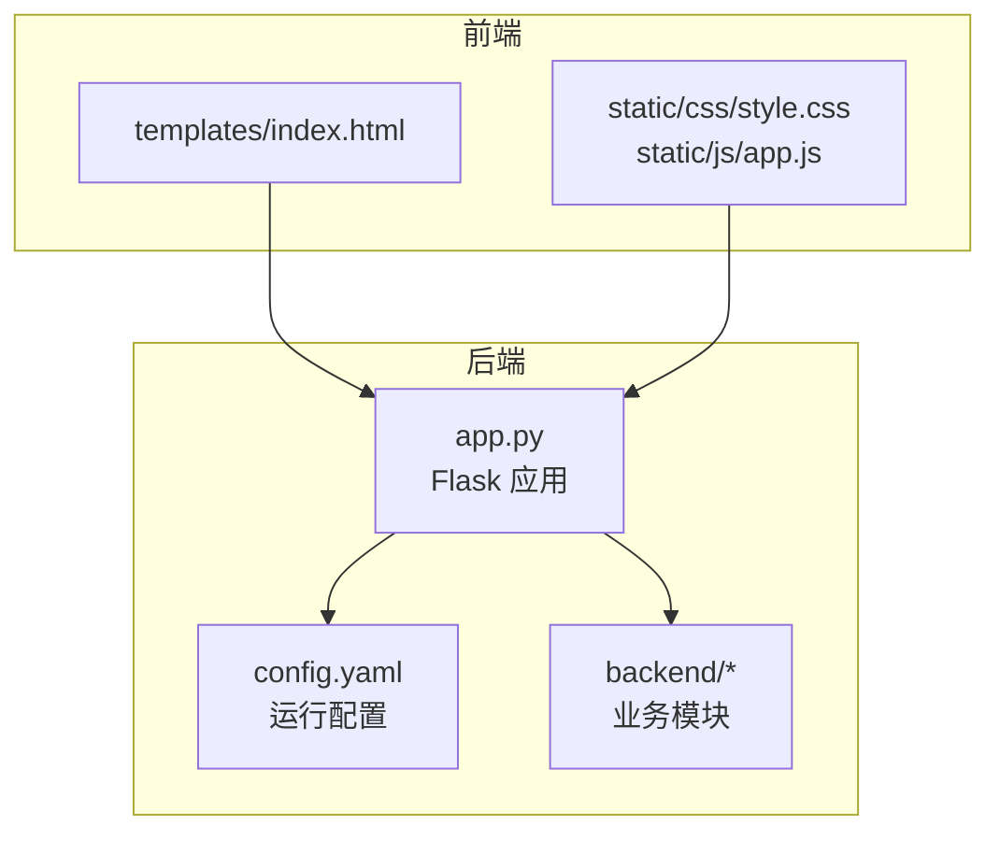
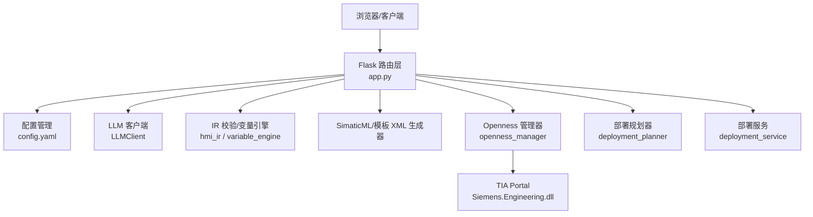
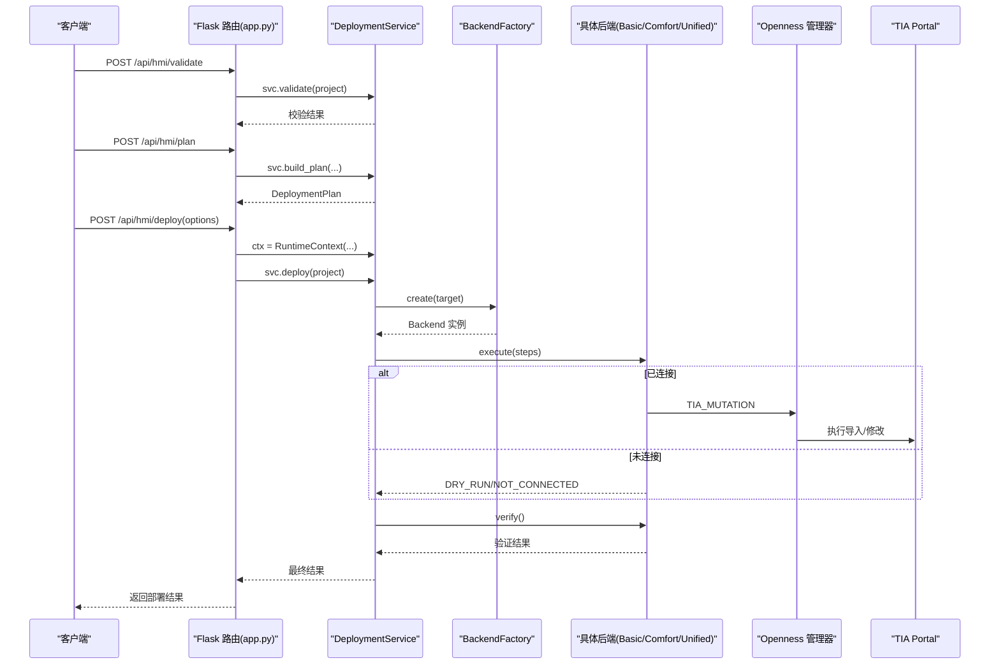
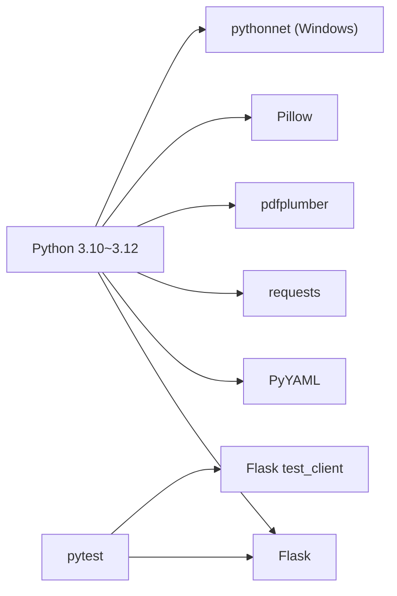

# 部署指南

<cite>
**本文档引用的文件**
- [app.py](file://app.py)
- [config.yaml](file://config.yaml)
- [requirements.txt](file://requirements.txt)
- [templates/index.html](file://templates/index.html)
- [Documents/README_Basic_HMI_Support.md](file://Documents/README_Basic_HMI_Support.md)
- [Documents/backend_FIX.md](file://Documents/backend_FIX.md)
- [tests/test_flask_api.py](file://tests/test_flask_api.py)
- [backend/planners/deployment_planner.py](file://backend/planners/deployment_planner.py)
- [backend/services/__init__.py](file://backend/services/__init__.py)
- [Siemens_HMI_Assistant_V3.2_实施报告.md](file://Siemens_HMI_Assistant_V3.2_实施报告.md)
- [Siemens_HMI_Assistant_V3_Complete_Implementation_Plan.md](file://Siemens_HMI_Assistant_V3_Complete_Implementation_Plan.md)
</cite>

## 目录
1. [简介](#简介)
2. [项目结构](#项目结构)
3. [核心组件](#核心组件)
4. [架构总览](#架构总览)
5. [详细组件分析](#详细组件分析)
6. [依赖分析](#依赖分析)
7. [性能考虑](#性能考虑)
8. [故障排除指南](#故障排除指南)
9. [结论](#结论)
10. [附录](#附录)

## 简介
本指南面向生产与开发环境，提供 Siemens HMI Assistant 的完整部署说明，包括服务器配置、依赖安装、环境变量与安全配置、性能优化、监控与日志管理、常见问题诊断与解决方案，以及 Docker 与云平台部署的最佳实践。文档同时覆盖 V3.0+ 的真实部署流水线与多场景生成模式（Classic 模板、Unified 直接绘制、SimaticML 导入）。

## 项目结构
应用采用前后端同源的单体服务：前端 HTML/CSS/JS 位于 templates/static 目录；后端以 Flask 提供 REST API 与 SSE 流式输出；业务逻辑集中在 backend 子模块，包含 Openness 集成、IR 校验、SimaticML 生成、模板 XML 生成、部署规划与执行等。

图表来源
- [app.py:1-120](file://app.py#L1-L120)
- [templates/index.html:1-60](file://templates/index.html#L1-L60)

章节来源
- [app.py:1-120](file://app.py#L1-L120)
- [config.yaml:1-60](file://config.yaml#L1-L60)
- [requirements.txt:1-25](file://requirements.txt#L1-L25)

## 核心组件
- Web 服务与路由
  - 前端页面与静态资源托管
  - 配置读取/保存、流式生成（SSE）、模板 XML 生成、Openness 连接与导入、V3.0+ 部署 API
- 配置系统
  - YAML 配置文件集中管理 LLM、Openness、HMI 默认参数、输出路径与编码、MiMo 视觉审查等
- 业务模块
  - IR 校验与变量引擎、SimaticML 生成器、模板 XML 生成器、Openness 管理器与执行器、部署规划与服务

章节来源
- [app.py:76-120](file://app.py#L76-L120)
- [app.py:84-109](file://app.py#L84-L109)
- [app.py:166-267](file://app.py#L166-L267)
- [app.py:272-311](file://app.py#L272-L311)
- [app.py:316-411](file://app.py#L316-L411)
- [app.py:517-630](file://app.py#L517-L630)
- [app.py:636-761](file://app.py#L636-L761)
- [config.yaml:1-343](file://config.yaml#L1-L343)

## 架构总览
后端以 Flask 为核心，通过 SSE 提供流式 AI 输出，结合 IR 校验、变量引擎与 XML 生成器完成从自然语言到 HMI XML 的转换；Openness 集成负责与 TIA Portal 的连接、能力探测、模板导出与画面导入；V3.0+ 引入部署规划与服务，形成 validate → plan → deploy → verify → compile 的闭环。

图表来源
- [app.py:23-44](file://app.py#L23-L44)
- [app.py:166-267](file://app.py#L166-L267)
- [app.py:272-311](file://app.py#L272-L311)
- [app.py:316-411](file://app.py#L316-L411)
- [app.py:517-630](file://app.py#L517-L630)
- [app.py:636-761](file://app.py#L636-L761)
- [config.yaml:1-343](file://config.yaml#L1-L343)

## 详细组件分析

### 配置系统与环境变量
- 配置文件位置与加载
  - 后端通过配置管理模块读取与保存 config.yaml，前端提供表单与原始 YAML 编辑模式
- 关键配置项
  - LLM 提供商与模型、流式输出、思考深度、视觉支持
  - Openness：TIA 版本、DLL 路径、附加运行实例、HMI 设备名、生成模式、模板路径、是否编译/保存
  - HMI 默认参数：分辨率、类型、背景色
  - 输出：导出目录、编码
  - MiMo 视觉审查：开关、URL、模型、最大迭代、阈值
  - 服务器：主机、端口、调试模式
- 环境变量建议
  - 通过环境变量注入敏感字段（如 LLM/MiMo API Key）并在启动前注入到 config.yaml
  - 生产环境建议固定 server.host 与 server.port，禁用 debug

章节来源
- [app.py:84-109](file://app.py#L84-L109)
- [templates/index.html:183-311](file://templates/index.html#L183-L311)
- [config.yaml:1-343](file://config.yaml#L1-L343)

### Openness 集成与诊断
- 连接与诊断
  - 提供诊断、连接、断开、能力查询、导出参考画面/模板 XML、导入画面等接口
  - 诊断接口返回 OS、Ready 状态与连接状态，兼容旧端点
- 生成模式
  - auto：根据设备能力自动选择 Unified 直接绘制或 Classic 模板 XML
  - unified_direct：Unified 直接绘制（可配置更新/清空策略）
  - classic_template_xml：基于模板 XML 改写
  - simaticml：原生 SimaticML 导入
- Basic HMI 支持
  - 需导出 Basic 模板 XML 并在配置中启用，否则返回明确错误

章节来源
- [app.py:316-411](file://app.py#L316-L411)
- [app.py:461-511](file://app.py#L461-L511)
- [Documents/README_Basic_HMI_Support.md:12-34](file://Documents/README_Basic_HMI_Support.md#L12-L34)

### V3.0+ 部署流水线
- API 端点
  - validate：校验 HmiProjectSpec（交叉引用 + 能力检查）
  - plan：构建部署计划（dry-run 预览）
  - deploy：执行部署（validate → plan → deploy → verify → compile）
  - verify：部署后验证（查询 TIA 对象 + 编译结果）
  - capabilities/runtime-metadata：能力矩阵与运行时信息
- 执行策略
  - 根据 TargetSpec.family 选择 Basic/Comfort/Unified 后端
  - 未连接时默认 dry_run，连接后按选项执行真实部署
  - 编译只在部署阶段执行一次，避免重复编译

图表来源
- [app.py:636-761](file://app.py#L636-L761)
- [backend/services/__init__.py:1-11](file://backend/services/__init__.py#L1-L11)
- [backend/planners/deployment_planner.py:130-198](file://backend/planners/deployment_planner.py#L130-L198)
- [Siemens_HMI_Assistant_V3.2_实施报告.md:25-38](file://Siemens_HMI_Assistant_V3.2_实施报告.md#L25-L38)

章节来源
- [app.py:517-630](file://app.py#L517-L630)
- [app.py:636-761](file://app.py#L636-L761)
- [backend/planners/deployment_planner.py:130-198](file://backend/planners/deployment_planner.py#L130-L198)
- [backend/services/__init__.py:1-11](file://backend/services/__init__.py#L1-L11)
- [Siemens_HMI_Assistant_V3.2_实施报告.md:25-38](file://Siemens_HMI_Assistant_V3.2_实施报告.md#L25-L38)

### 流式生成与视觉审查
- SSE 接口
  - /api/generate：流式输出 AI 思考与内容片段
  - /api/generate/with_review：带 MiMo 视觉审查的多阶段流水线
- 前端交互
  - 支持拖拽上传 PDF/图片/文本，抽取文本与图片 base64 用于视觉模型
  - 可切换思考深度、展示思考过程、流式输出与视觉审查

章节来源
- [app.py:166-267](file://app.py#L166-L267)
- [templates/index.html:68-105](file://templates/index.html#L68-L105)

### 模板 XML 生成与导入
- 模板 XML 生成
  - 校验 IR → 变量引擎 → 生成模板 XML（改写后）→ 落盘
- 导入到 TIA
  - 支持 IR + mode 自动路由（unified_direct/classic_template_xml/simaticml/auto）
  - 旧 IR 模式：先生成 XML 再导入

章节来源
- [app.py:411-459](file://app.py#L411-L459)
- [app.py:461-496](file://app.py#L461-L496)

### 基础补丁与兼容性
- TIA Openness XML 导入修复
  - 修复 MultilingualText ID 结构、模板文本写入、导入预处理与校验
- Basic HMI 支持
  - 明确 Basic 与 Comfort 差异、模板路径与生成策略

章节来源
- [Documents/backend_FIX.md:1-13](file://Documents/backend_FIX.md#L1-L13)
- [Documents/README_Basic_HMI_Support.md:1-34](file://Documents/README_Basic_HMI_Support.md#L1-L34)

## 依赖分析
- 运行时依赖
  - Flask、PyYAML、requests、pdfplumber、Pillow
  - pythonnet（Windows 专用，用于加载 Siemens.Engineering.dll）
- 开发与测试
  - pytest、Flask 测试客户端
- 依赖安装
  - 建议使用 Python 3.10~3.12，按 requirements.txt 安装

图表来源
- [requirements.txt:1-25](file://requirements.txt#L1-L25)
- [tests/test_flask_api.py:1-20](file://tests/test_flask_api.py#L1-L20)

章节来源
- [requirements.txt:1-25](file://requirements.txt#L1-L25)
- [tests/test_flask_api.py:1-20](file://tests/test_flask_api.py#L1-L20)

## 性能考虑
- 服务器配置
  - 生产环境固定 host/port，禁用 debug；启用反向代理（Nginx/Apache）与 HTTPS
  - 前端静态资源禁用缓存（开发期）或合理缓存（生产期），避免旧版 JS/CSS 导致接口 404
- 大模型与流式输出
  - 合理设置思考深度与展示思考过程，避免过长的推理链导致延迟
  - 控制并发流式生成数量，必要时引入队列与限流
- Openness 与 TIA
  - 仅在需要时连接 TIA，避免长时间占用 DLL；编译只在部署阶段执行一次
  - 模板 XML 与参考 XML 预热，减少导入前的解析时间
- 日志与监控
  - 记录关键 API 调用耗时、SSE 事件耗时、Openness 操作耗时
  - 监控 TIA 连接状态与导入成功率

章节来源
- [app.py:46-56](file://app.py#L46-L56)
- [app.py:724-760](file://app.py#L724-L760)
- [Siemens_HMI_Assistant_V3.2_实施报告.md:300-306](file://Siemens_HMI_Assistant_V3.2_实施报告.md#L300-L306)

## 故障排除指南
- 常见问题与诊断
  - Openness 未连接：使用 /api/openness/diagnose 获取诊断信息；确认 TIA 版本、DLL 路径、附加运行实例
  - 生成模式错误：确保 Basic/Comfort/Unified 的模板路径正确；auto 模式下设备能力与推荐模式需匹配
  - IR 校验失败：检查 IR 结构与变量绑定；必要时启用变量引擎自动处理
  - 导入失败：检查 XML 路径有效性、TIA 项目状态、编译/保存策略
- API 行为验证
  - 使用测试用例验证 /api/config、/api/openness/capabilities、/api/build 等端点行为
- 基础补丁与兼容性
  - 若出现 TIA XML 导入异常，应用基础补丁修复 MultilingualText 结构与导入预处理

章节来源
- [app.py:316-411](file://app.py#L316-L411)
- [app.py:272-311](file://app.py#L272-L311)
- [tests/test_flask_api.py:21-94](file://tests/test_flask_api.py#L21-L94)
- [Documents/backend_FIX.md:1-13](file://Documents/backend_FIX.md#L1-L13)

## 结论
本指南提供了从开发到生产的全栈部署路径：明确服务器与依赖、配置与安全、性能与监控、故障排除与现代化部署方式。结合 V3.0+ 的部署流水线与多生成模式，可在不同 HMI 设备与 TIA 版本下稳定落地。

## 附录

### A. 生产环境部署清单
- 服务器与网络
  - 固定 host/port，启用反向代理与 HTTPS
  - 防火墙开放端口，限制来源 IP
- 依赖与运行时
  - 安装 Python 3.10~3.12 与依赖
  - Windows 环境准备 TIA Portal 与 Siemens.Engineering.dll
- 配置与安全
  - 通过环境变量注入敏感字段
  - 限制 /api/config 的访问权限，仅允许授权用户
- 监控与日志
  - 记录关键 API 调用与 SSE 事件
  - 监控 TIA 连接状态与导入成功率

章节来源
- [config.yaml:339-343](file://config.yaml#L339-L343)
- [requirements.txt:1-25](file://requirements.txt#L1-L25)

### B. Docker 容器化部署（建议）
- 基础镜像
  - 使用官方 Python 镜像（3.10/3.11/3.12）
- 安装步骤
  - 复制项目至镜像，安装依赖
  - 配置 config.yaml（或通过环境变量注入）
  - 暴露端口并映射到宿主
- 注意事项
  - Windows 专用依赖（pythonnet）在容器中不可用，需在 Linux 上禁用 Openness 或使用 Windows 容器
  - 挂载 exports 目录持久化生成物

章节来源
- [requirements.txt:20-25](file://requirements.txt#L20-L25)
- [config.yaml:61-63](file://config.yaml#L61-L63)

### C. 云平台部署（建议）
- 云主机
  - 选择具备足够 CPU/内存的实例，满足并发与编译需求
- 容器编排
  - Kubernetes：部署副本、健康检查、滚动更新
  - 云托管容器服务：ECS/GKE/AKS，配置负载均衡与自动扩缩容
- 存储与备份
  - 挂载持久卷存储 exports 与 config.yaml
  - 定期备份配置与生成物
- 安全
  - 使用密钥管理服务注入敏感字段
  - 网络 ACL 限制访问来源

章节来源
- [config.yaml:1-343](file://config.yaml#L1-L343)
- [Siemens_HMI_Assistant_V3_Complete_Implementation_Plan.md:1524-1574](file://Siemens_HMI_Assistant_V3_Complete_Implementation_Plan.md#L1524-L1574)