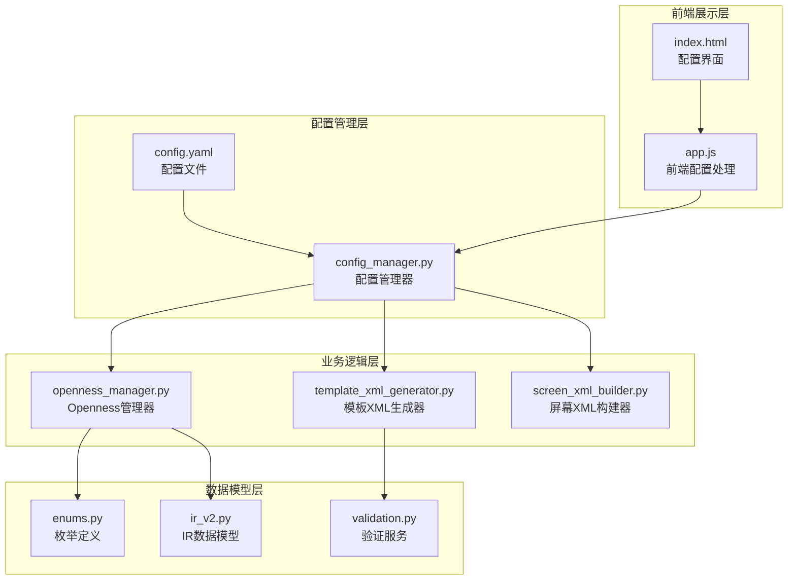
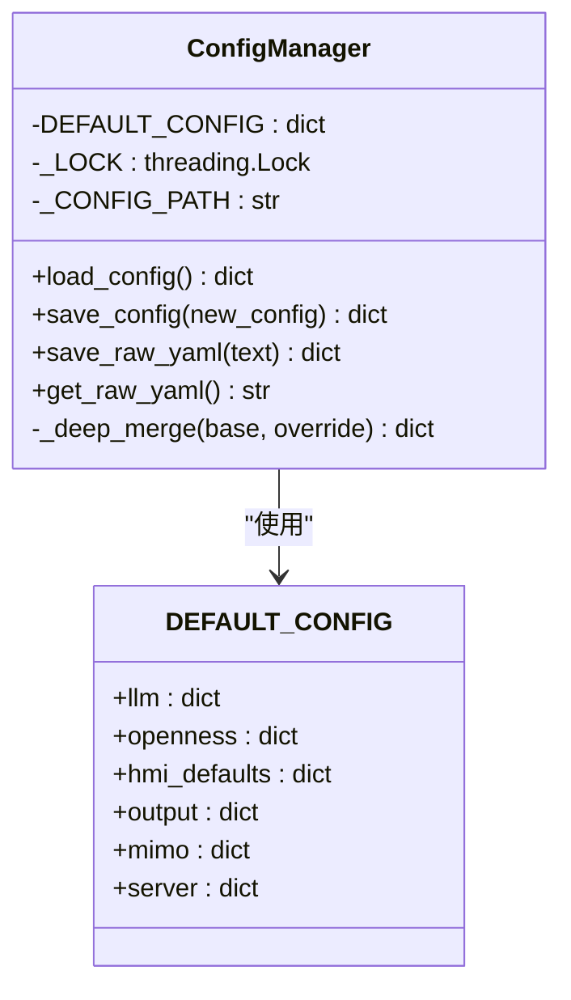
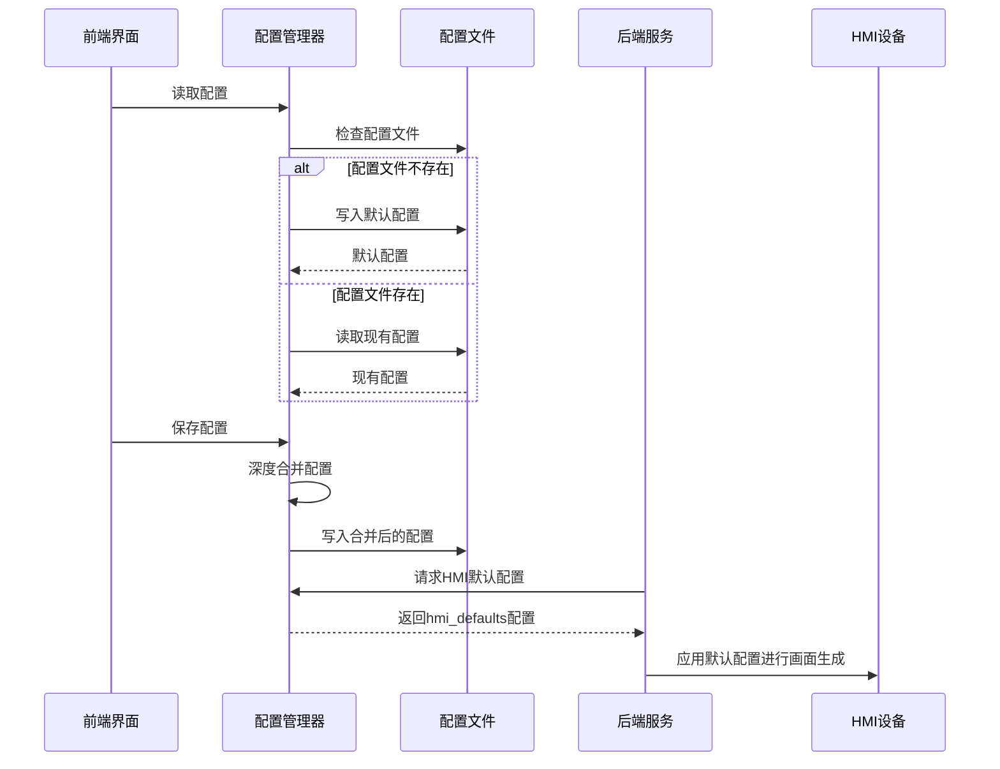
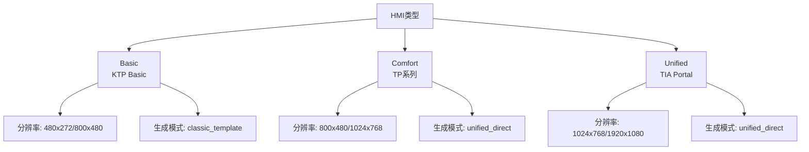
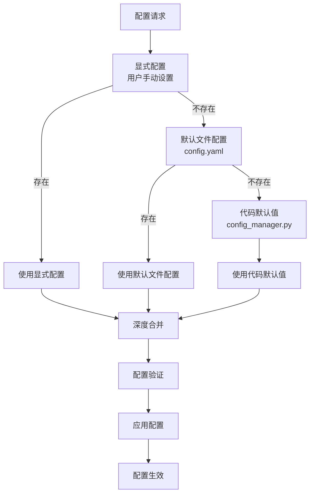
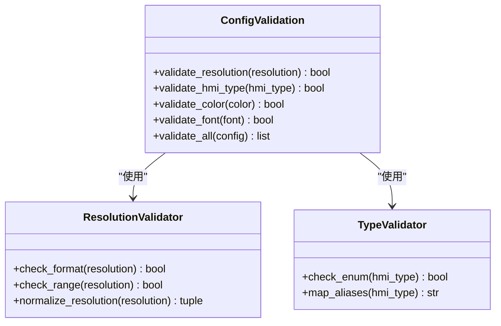
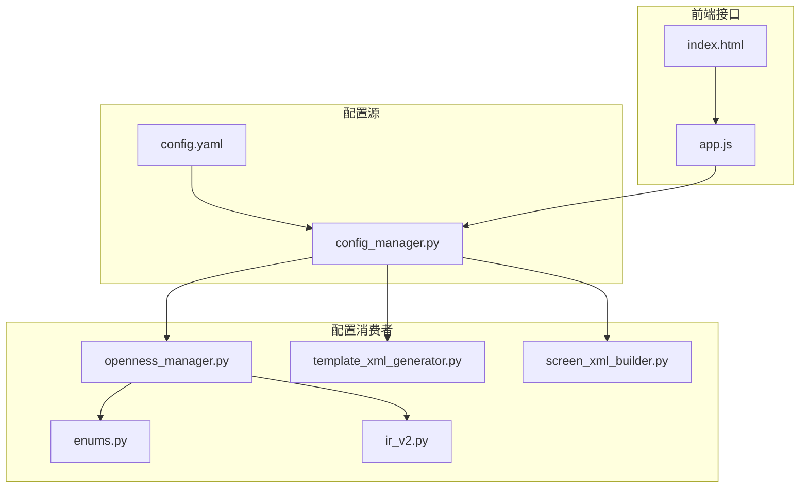

# HMI默认配置

<cite>
**本文档引用的文件**
- [config.yaml](file://config.yaml)
- [config_manager.py](file://backend/config_manager.py)
- [openness_manager.py](file://backend/openness_manager.py)
- [screen_xml_builder.py](file://backend/backends/classic/screen_xml_builder.py)
- [template_xml_generator.py](file://backend/template_xml_generator.py)
- [README_Basic_HMI_Support.md](file://Documents/README_Basic_HMI_Support.md)
- [index.html](file://templates/index.html)
- [app.js](file://static/js/app.js)
- [enums.py](file://backend/domain/enums.py)
- [ir_v2.py](file://backend/domain/ir_v2.py)
- [validation.py](file://backend/domain/validation.py)
</cite>

## 目录
1. [简介](#简介)
2. [项目结构](#项目结构)
3. [核心组件](#核心组件)
4. [架构概览](#架构概览)
5. [详细组件分析](#详细组件分析)
6. [依赖关系分析](#依赖关系分析)
7. [性能考虑](#性能考虑)
8. [故障排除指南](#故障排除指南)
9. [结论](#结论)

## 简介

HMI默认配置系统是Siemens HMI Assistant项目的核心配置管理模块，负责管理HMI画面生成过程中的基础参数设置。该系统确保在没有用户提供特定配置的情况下，能够提供合理的默认值，从而保证HMI画面的正确生成和布局。

系统主要管理以下关键配置参数：
- **分辨率设置**：控制HMI画面的宽高尺寸
- **HMI类型**：Basic、Comfort或Unified三种面板类型
- **背景颜色**：画面的默认背景色彩
- **字体家族**：界面文本的默认字体设置

这些默认配置直接影响HMI画面的初始生成、布局计算和视觉呈现效果。

## 项目结构

HMI默认配置系统分布在项目的多个层次中，形成了完整的配置管理体系：



**图表来源**
- [config.yaml:56-61](file://config.yaml#L56-L61)
- [config_manager.py:68-73](file://backend/config_manager.py#L68-L73)
- [openness_manager.py:44-47](file://backend/openness_manager.py#L44-L47)

**章节来源**
- [config.yaml:1-343](file://config.yaml#L1-L343)
- [config_manager.py:1-142](file://backend/config_manager.py#L1-L142)

## 核心组件

### 配置文件结构

系统采用YAML格式的配置文件，包含三个主要配置块：

#### LLM配置块
管理大语言模型的提供商设置，包括DeepSeek和OpenAI兼容提供商的API密钥、模型选择等参数。

#### Openness配置块
控制TIA Portal Openness集成的相关设置，包括DLL路径、项目路径、HMI设备配置等。

#### HMI默认配置块
这是本次文档关注的重点，包含分辨率、HMI类型、背景颜色和字体家族等核心参数。

**章节来源**
- [config.yaml:1-343](file://config.yaml#L1-L343)

### 配置管理器

配置管理器提供了完整的配置读写和验证功能：



**图表来源**
- [config_manager.py:12-94](file://backend/config_manager.py#L12-L94)

**章节来源**
- [config_manager.py:108-142](file://backend/config_manager.py#L108-L142)

## 架构概览

HMI默认配置系统的工作流程如下：



**图表来源**
- [config_manager.py:108-127](file://backend/config_manager.py#L108-L127)
- [openness_manager.py:44-47](file://backend/openness_manager.py#L44-L47)

## 详细组件分析

### HMI默认配置参数详解

#### 分辨率配置
系统支持多种常见的HMI分辨率设置：

| HMI类型 | 推荐分辨率 | 用途 |
|---------|------------|------|
| Basic | 480x272, 800x480, 1280x800 | KTP Basic触摸屏 |
| Comfort | 800x480, 1024x768, 1280x800 | TP系列Comfort面板 |
| Unified | 1024x768, 1280x1024, 1920x1080 | TIA Portal Unified |

分辨率配置直接影响画面元素的坐标计算和缩放比例。

#### HMI类型配置
系统支持三种不同的HMI面板类型：



**图表来源**
- [README_Basic_HMI_Support.md:5-8](file://Documents/README_Basic_HMI_Support.md#L5-L8)
- [enums.py:11-16](file://backend/domain/enums.py#L11-L16)

#### 背景色配置
默认背景色为深灰色调（#1F2630），这种颜色选择考虑了以下因素：

- **对比度**：确保前景元素清晰可见
- **视觉疲劳**：避免过于鲜艳的颜色造成视觉不适
- **专业外观**：符合工业控制界面的设计规范

#### 字体家族配置
默认使用Arial字体，这是跨平台兼容性最佳的选择，具有以下优势：

- **跨平台支持**：Windows、Linux、macOS均内置
- **可读性强**：简洁的几何字体适合工业界面
- **渲染稳定**：在不同设备上显示效果一致

**章节来源**
- [config.yaml:56-61](file://config.yaml#L56-L61)
- [config_manager.py:68-73](file://backend/config_manager.py#L68-L73)

### 配置优先级和覆盖规则

系统实现了多层次的配置优先级机制：



**图表来源**
- [config_manager.py:97-118](file://backend/config_manager.py#L97-L118)

#### 配置覆盖规则

1. **显式配置优先**：用户在界面上的设置具有最高优先级
2. **文件配置次之**：config.yaml中的配置覆盖代码默认值
3. **代码默认值最后**：当以上配置都不存在时使用硬编码的默认值

**章节来源**
- [config_manager.py:97-118](file://backend/config_manager.py#L97-L118)

### 不同HMI类型的默认配置示例

#### Basic HMI类型配置
针对Basic触摸屏的优化配置：

```yaml
hmi_defaults:
  resolution: "800x480"
  hmi_type: "Basic"
  background_color: "#D9DEE5"
  font_family: "Arial"
```

#### Comfort HMI类型配置
Comfort面板的标准配置：

```yaml
hmi_defaults:
  resolution: "1024x768"
  hmi_type: "Comfort"
  background_color: "#1F2630"
  font_family: "Arial"
```

#### Unified HMI类型配置
Unified界面的现代化配置：

```yaml
hmi_defaults:
  resolution: "1280x1024"
  hmi_type: "Unified"
  background_color: "#FFFFFF"
  font_family: "Segoe UI"
```

**章节来源**
- [README_Basic_HMI_Support.md:28-31](file://Documents/README_Basic_HMI_Support.md#L28-L31)

### 配置验证机制

系统实现了多层次的配置验证机制：



**图表来源**
- [validation.py:192-205](file://backend/domain/validation.py#L192-L205)

**章节来源**
- [validation.py:173-205](file://backend/domain/validation.py#L173-L205)

## 依赖关系分析

### 配置系统依赖图



**图表来源**
- [openness_manager.py:44-47](file://backend/openness_manager.py#L44-L47)
- [template_xml_generator.py:102-127](file://backend/template_xml_generator.py#L102-L127)

### 配置传播路径

配置信息在系统中的传播遵循以下路径：

1. **配置读取**：前端通过API请求配置信息
2. **配置合并**：配置管理器执行深度合并操作
3. **配置验证**：验证服务检查配置的有效性
4. **配置应用**：各业务模块根据配置执行相应的操作

**章节来源**
- [openness_manager.py:521-544](file://backend/openness_manager.py#L521-L544)

## 性能考虑

### 配置缓存策略

系统采用了多级缓存机制来提升性能：

- **内存缓存**：配置管理器维护最近使用的配置副本
- **文件缓存**：配置文件的读取结果缓存到内存
- **锁机制**：使用线程锁确保并发访问的安全性

### 配置更新策略

为了减少磁盘I/O操作，系统实现了智能的配置更新策略：

- **批量更新**：多个配置项的修改一次性写入文件
- **增量更新**：只更新发生变化的配置项
- **异步写入**：配置写入操作在后台线程执行

## 故障排除指南

### 常见配置问题及解决方案

#### 配置文件损坏
**问题症状**：系统无法启动或配置界面异常
**解决方案**：
1. 备份当前配置文件
2. 删除损坏的配置文件
3. 系统会自动生成新的默认配置文件

#### 分辨率不匹配
**问题症状**：HMI画面显示异常或元素超出边界
**解决方案**：
1. 检查目标HMI设备的实际分辨率
2. 在配置中设置正确的分辨率值
3. 重新生成HMI画面

#### HMI类型识别错误
**问题症状**：生成的XML与目标设备不兼容
**解决方案**：
1. 确认目标HMI设备的准确型号
2. 在配置中设置正确的HMI类型
3. 验证设备的Openness能力

**章节来源**
- [README_Basic_HMI_Support.md:1-34](file://Documents/README_Basic_HMI_Support.md#L1-L34)

### 配置验证错误

系统提供了详细的配置验证功能，能够检测以下常见错误：

- **格式错误**：配置项格式不符合预期
- **范围错误**：数值超出了允许的范围
- **类型错误**：配置项的数据类型不正确
- **依赖错误**：缺少必要的依赖配置

**章节来源**
- [validation.py:192-205](file://backend/domain/validation.py#L192-L205)

## 结论

HMI默认配置系统通过精心设计的配置管理机制，为Siemens HMI Assistant提供了灵活而可靠的配置支持。系统的主要特点包括：

1. **多层次配置管理**：支持用户配置、文件配置和代码默认值的分层管理
2. **智能优先级机制**：确保配置的正确应用和覆盖
3. **完善的验证机制**：提供全面的配置验证和错误处理
4. **良好的扩展性**：易于添加新的配置选项和验证规则

该系统为HMI画面的生成提供了坚实的基础，确保了不同HMI设备和类型的兼容性和一致性。通过合理的配置管理和验证机制，系统能够在保证功能完整性的同时，提供良好的用户体验。