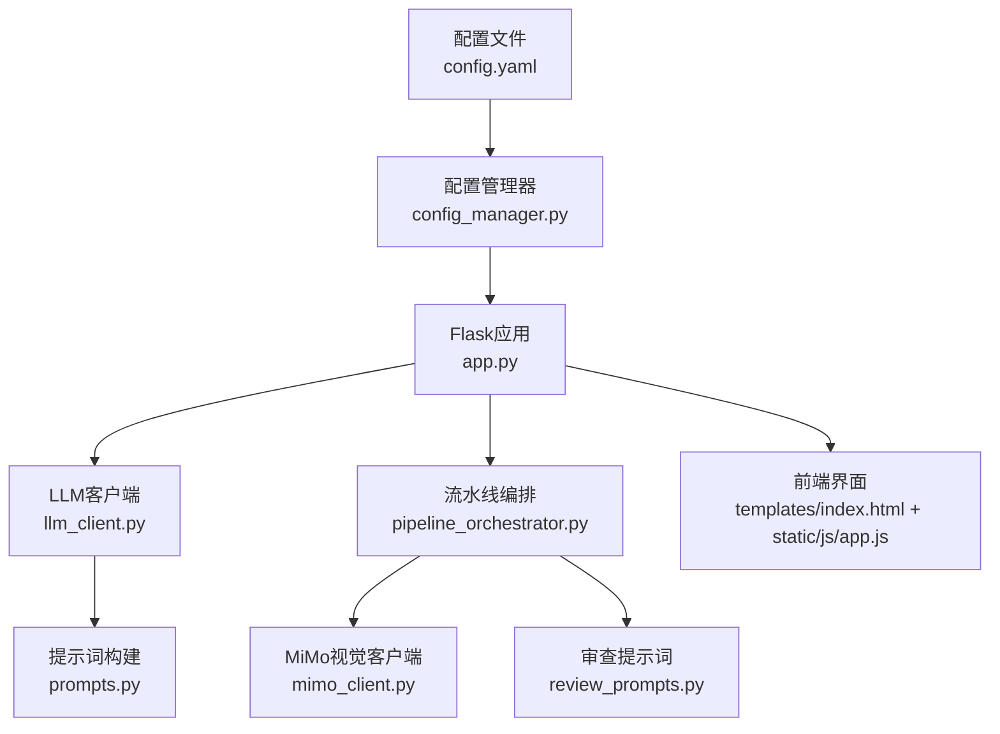
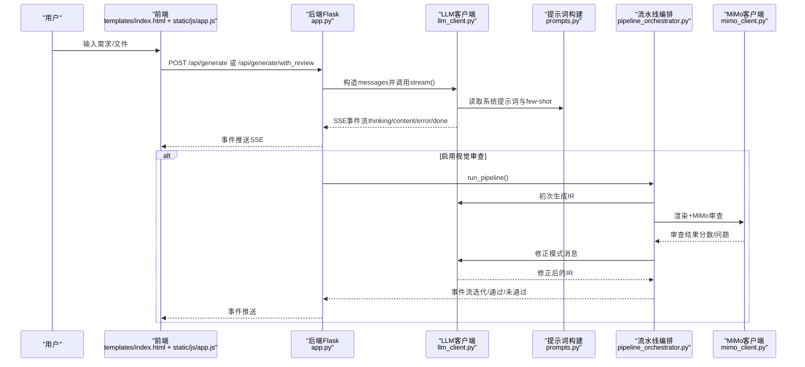
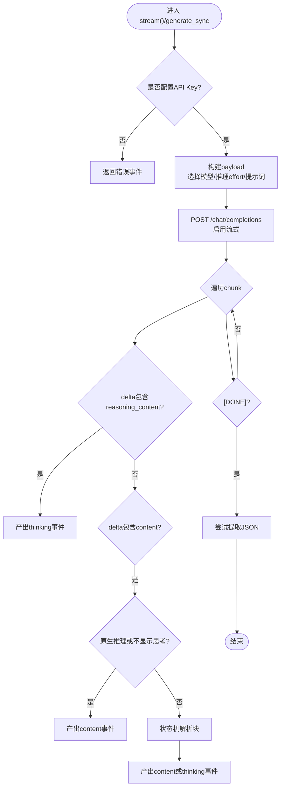
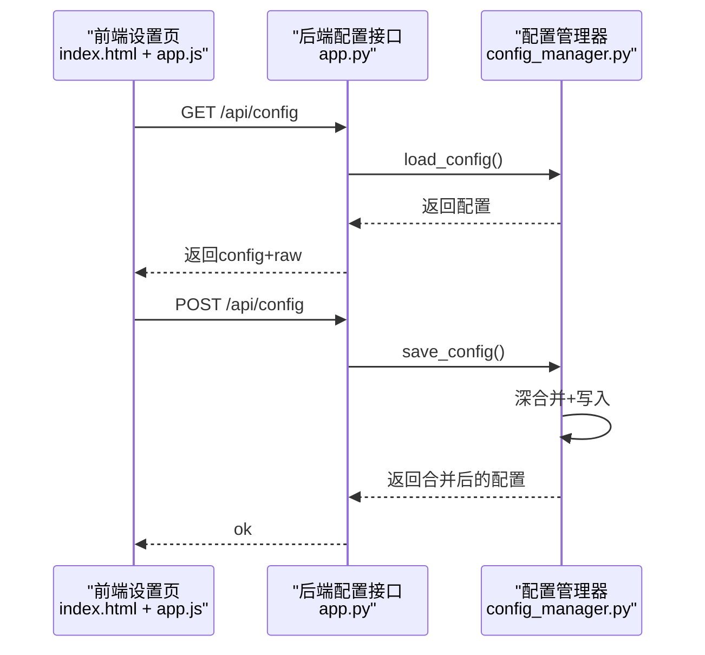
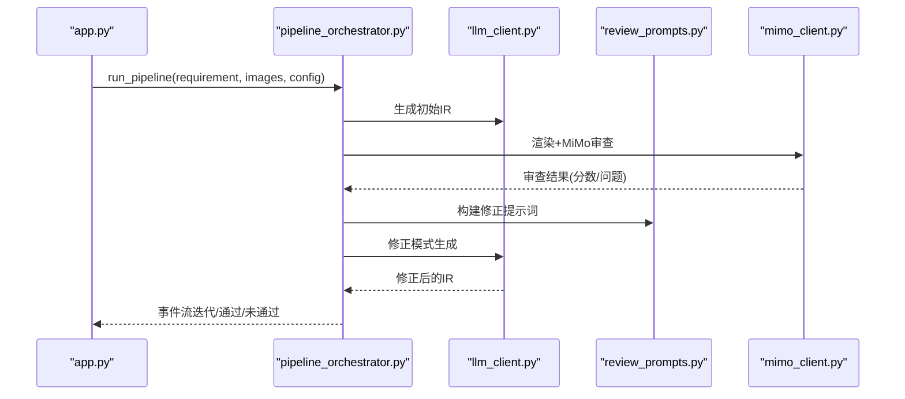
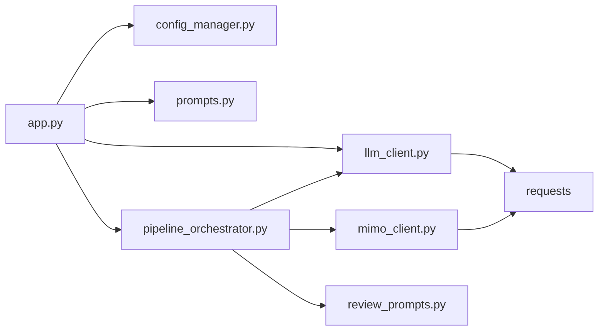

# LLM配置

<cite>
**本文档引用的文件**
- [config.yaml](file://config.yaml)
- [config_manager.py](file://backend/config_manager.py)
- [llm_client.py](file://backend/llm_client.py)
- [prompts.py](file://backend/prompts.py)
- [app.py](file://app.py)
- [pipeline_orchestrator.py](file://backend/pipeline_orchestrator.py)
- [mimo_client.py](file://backend/mimo_client.py)
- [review_prompts.py](file://backend/review_prompts.py)
- [index.html](file://templates/index.html)
- [app.js](file://static/js/app.js)
</cite>

## 目录
1. [简介](#简介)
2. [项目结构](#项目结构)
3. [核心组件](#核心组件)
4. [架构总览](#架构总览)
5. [详细组件分析](#详细组件分析)
6. [依赖分析](#依赖分析)
7. [性能考量](#性能考量)
8. [故障排查指南](#故障排查指南)
9. [结论](#结论)
10. [附录](#附录)

## 简介
本文件系统化阐述本项目的LLM配置体系，涵盖活跃提供者、思维深度、流式输出、思考显示等核心配置项，详述支持的LLM提供者（DeepSeek、OpenAI兼容）及其参数（基础URL、API密钥、对话模型、推理模型、视觉支持），解释配置对AI生成质量与性能的影响，并提供配置示例、最佳实践与常见问题解决方案。同时，深入解析思维过程展示与流式生成的技术细节。

## 项目结构
围绕LLM配置与生成的核心文件与职责如下：
- 配置文件与读写：config.yaml、backend/config_manager.py
- LLM客户端与流式生成：backend/llm_client.py
- 提示词与消息构建：backend/prompts.py
- Web接口与SSE流：app.py
- 多阶段流水线（含MiMo视觉审查）：backend/pipeline_orchestrator.py、backend/mimo_client.py、backend/review_prompts.py
- 前端配置UI与交互：templates/index.html、static/js/app.js



图表来源
- [config.yaml](file://config.yaml)
- [config_manager.py](file://backend/config_manager.py)
- [llm_client.py](file://backend/llm_client.py)
- [prompts.py](file://backend/prompts.py)
- [app.py](file://app.py)
- [pipeline_orchestrator.py](file://backend/pipeline_orchestrator.py)
- [mimo_client.py](file://backend/mimo_client.py)
- [review_prompts.py](file://backend/review_prompts.py)
- [index.html](file://templates/index.html)
- [app.js](file://static/js/app.js)

章节来源
- [config.yaml](file://config.yaml)
- [config_manager.py](file://backend/config_manager.py)
- [llm_client.py](file://backend/llm_client.py)
- [prompts.py](file://backend/prompts.py)
- [app.py](file://app.py)
- [pipeline_orchestrator.py](file://backend/pipeline_orchestrator.py)
- [mimo_client.py](file://backend/mimo_client.py)
- [review_prompts.py](file://backend/review_prompts.py)
- [index.html](file://templates/index.html)
- [app.js](file://static/js/app.js)

## 核心组件
- LLM配置项
  - 活跃提供者：active_provider（如 deepseek、openai_compatible）
  - 思维深度：thinking_depth（关闭/低/中/高）
  - 流式输出：stream（布尔）
  - 显示思考：show_thinking（布尔）
- 提供者参数
  - base_url：模型服务基础URL
  - api_key：访问令牌
  - chat_model：对话模型
  - reasoner_model：推理模型（用于思维深度>关闭）
  - supports_vision：是否支持视觉输入
- 默认配置与合并策略
  - 首次运行若无配置文件则按默认模板生成
  - 读取时与默认配置进行深合并，保证新增字段不缺失
  - 保存时同样进行深合并后持久化

章节来源
- [config.yaml](file://config.yaml)
- [config_manager.py](file://backend/config_manager.py)

## 架构总览
下图展示了从用户输入到生成与审查的端到端流程，包括SSE流式输出与可选的MiMo视觉审查循环。



图表来源
- [app.py](file://app.py)
- [llm_client.py](file://backend/llm_client.py)
- [prompts.py](file://backend/prompts.py)
- [pipeline_orchestrator.py](file://backend/pipeline_orchestrator.py)
- [mimo_client.py](file://backend/mimo_client.py)

## 详细组件分析

### LLM客户端与流式生成
- 思维深度映射
  - 关闭：使用chat_model，不产出思考
  - 低/中/高：优先使用reasoner_model（如deepseek-reasoner），并映射reasoning_effort；若provider无原生推理字段，则通过system提示诱导模型在<thinking>...</thinking>中先输出思考，再输出最终JSON
- 流式输出
  - 使用OpenAI兼容的/chat/completions接口，以流式方式返回增量
  - 事件类型：thinking（原生推理模型的reasoning_content或诱导式<thinking>块）、content（正文增量）、error（错误）
  - 末尾尝试解析完整输出中的JSON对象，向前端提示“已解析出画面IR”
- 非流式生成
  - 用于辅助调用（如图片分析），一次性返回完整响应文本
  - 移除reasoning_effort与诱导式system消息，max_tokens按需调整



图表来源
- [llm_client.py](file://backend/llm_client.py)

章节来源
- [llm_client.py](file://backend/llm_client.py)
- [prompts.py](file://backend/prompts.py)

### 配置管理与前端交互
- 配置读写
  - 首次运行自动生成默认配置（包含llm/providers默认值）
  - 读取时与默认配置深合并，保证字段完整性
  - 保存时同样深合并后写回config.yaml
- 前端配置UI
  - 模态框展示与编辑：当前服务商、Base URL、API Key、对话模型、推理模型、视觉支持勾选
  - 实时同步：选择服务商后联动填充对应字段
  - 保存设置：写回CONFIG并调用后端保存接口



图表来源
- [index.html](file://templates/index.html)
- [app.js](file://static/js/app.js)
- [app.py](file://app.py)
- [config_manager.py](file://backend/config_manager.py)

章节来源
- [config_manager.py](file://backend/config_manager.py)
- [index.html](file://templates/index.html)
- [app.js](file://static/js/app.js)
- [app.py](file://app.py)

### 多阶段流水线与MiMo视觉审查
- 流水线阶段
  - pipeline_start → 可选图片分析 → generate_start → review_start → review_result →
  - 通过：pipeline_done；未通过但未达最大迭代：regenerate_start → 重新生成
- 审查与修正
  - 渲染IR为图片，调用MiMo进行视觉审查，输出结构化评分与问题清单
  - 修正模式：将审查反馈转为系统提示词，引导模型修正IR
- 配置项
  - mimo.enabled、base_url、api_key、model、max_iterations、review_timeout_seconds、review_pass_threshold、image_analysis_enabled、image_analysis_max_size



图表来源
- [app.py](file://app.py)
- [pipeline_orchestrator.py](file://backend/pipeline_orchestrator.py)
- [llm_client.py](file://backend/llm_client.py)
- [review_prompts.py](file://backend/review_prompts.py)
- [mimo_client.py](file://backend/mimo_client.py)

章节来源
- [pipeline_orchestrator.py](file://backend/pipeline_orchestrator.py)
- [mimo_client.py](file://backend/mimo_client.py)
- [review_prompts.py](file://backend/review_prompts.py)
- [app.py](file://app.py)

## 依赖分析
- 组件耦合
  - app.py依赖config_manager、llm_client、prompts、pipeline_orchestrator、mimo_client、review_prompts等
  - llm_client依赖requests与config中的llm/providers配置
  - pipeline_orchestrator依赖llm_client、prompts、mimo_client、review_prompts
- 外部依赖
  - OpenAI兼容接口（/chat/completions）
  - MiMo视觉API（/chat/completions）



图表来源
- [app.py](file://app.py)
- [config_manager.py](file://backend/config_manager.py)
- [llm_client.py](file://backend/llm_client.py)
- [prompts.py](file://backend/prompts.py)
- [pipeline_orchestrator.py](file://backend/pipeline_orchestrator.py)
- [mimo_client.py](file://backend/mimo_client.py)
- [review_prompts.py](file://backend/review_prompts.py)

章节来源
- [app.py](file://app.py)
- [llm_client.py](file://backend/llm_client.py)
- [pipeline_orchestrator.py](file://backend/pipeline_orchestrator.py)
- [mimo_client.py](file://backend/mimo_client.py)

## 性能考量
- 流式输出
  - 启用stream可显著降低首字节延迟，提升交互体验
  - SSE事件按增量推送，前端可即时渲染
- 思维深度与推理模型
  - 高思维深度会增加推理消耗，适当提高reasoning_effort可能提升质量但增加耗时
  - 无原生推理的provider将通过提示词诱导，带来额外token与解析成本
- 超时与重试
  - LLM与MiMo请求均设置超时，网络异常时返回可重试/不可重试标记
- 图像分析
  - 可配置最大边长与缩放，避免过大图片导致内存与带宽压力
  - 审查阈值与最大迭代次数影响总体耗时与质量

## 故障排查指南
- 常见错误与定位
  - API Key未配置：LLM客户端检测到空api_key，直接返回错误事件
  - 接口返回非200：记录状态码与前500字符详情
  - 请求超时：捕获Timeout异常并返回超时提示
  - JSON解析失败：尝试抽取```json块或首个{}匹配，否则抛出值错误
  - MiMo鉴权/网络：检查mimo.api_key、base_url、超时与可重试标记
- 建议排查步骤
  - 确认config.yaml中active_provider与对应providers.*字段完整
  - 在前端设置页核对Base URL、API Key、模型名称
  - 临时关闭思维深度或降低max_tokens观察行为变化
  - 检查网络连通性与代理设置
  - 查看SSE事件流中的error事件与parse_warn提示

章节来源
- [llm_client.py](file://backend/llm_client.py)
- [mimo_client.py](file://backend/mimo_client.py)
- [app.py](file://app.py)

## 结论
本项目的LLM配置体系以config.yaml为中心，结合config_manager的深合并策略与前端设置页，实现了灵活、可扩展的模型接入与参数管理。通过LLM客户端的流式生成与思维深度机制，配合可选的MiMo视觉审查流水线，既能保障生成质量，又兼顾性能与时效。建议在生产环境优先启用流式输出与适当的思维深度，并根据设备与网络条件调优超时与迭代次数。

## 附录

### 配置项详解与影响
- 活跃提供者（active_provider）
  - 影响：决定实际调用的base_url、chat_model、reasoner_model与supports_vision
  - 建议：优先选择API稳定、延迟较低的服务商
- 思维深度（thinking_depth）
  - 关闭：快速响应，适合简单需求
  - 低/中/高：提升复杂场景的结构化输出质量，但可能增加耗时
  - 建议：复杂IR生成建议中高思维深度，简单任务可关闭
- 流式输出（stream）
  - 影响：显著改善交互体验，便于前端实时渲染
  - 建议：默认开启，除非调试需要一次性响应
- 显示思考（show_thinking）
  - 影响：前端是否展示<thinking>过程；关闭可减少冗余信息
  - 建议：开发调试时开启，上线可关闭
- 提供者参数
  - base_url：确保末尾无多余斜杠
  - api_key：仅保存在本地，不上传
  - chat_model/reasoner_model：确保与服务商支持的模型名称一致
  - supports_vision：影响前端是否启用图片上传与MiMo分析

章节来源
- [config.yaml](file://config.yaml)
- [config_manager.py](file://backend/config_manager.py)
- [llm_client.py](file://backend/llm_client.py)

### 支持的LLM提供者与参数
- DeepSeek
  - base_url：https://api.deepseek.com
  - chat_model：deepseek-v4-pro
  - reasoner_model：deepseek-reasoner
  - supports_vision：false
- OpenAI兼容
  - base_url：https://api.openai.com/v1
  - chat_model：gpt-4o-mini
  - reasoner_model：o1-mini
  - supports_vision：true

章节来源
- [config.yaml](file://config.yaml)
- [config_manager.py](file://backend/config_manager.py)

### 配置示例与最佳实践
- 示例
  - 将active_provider设为openai_compatible，开启show_thinking与流式输出，思维深度设为中
  - 为DeepSeek配置base_url与chat/reasoner模型，确保api_key有效
- 最佳实践
  - 首次使用时通过前端设置页完成配置，避免手改config.yaml
  - 复杂需求启用思维深度与MiMo审查，简单需求可关闭以提速
  - 控制max_iterations与review_pass_threshold平衡质量与耗时
  - 对小屏设备在生成前明确目标分辨率，确保坐标与尺寸合规

章节来源
- [config.yaml](file://config.yaml)
- [config_manager.py](file://backend/config_manager.py)
- [pipeline_orchestrator.py](file://backend/pipeline_orchestrator.py)