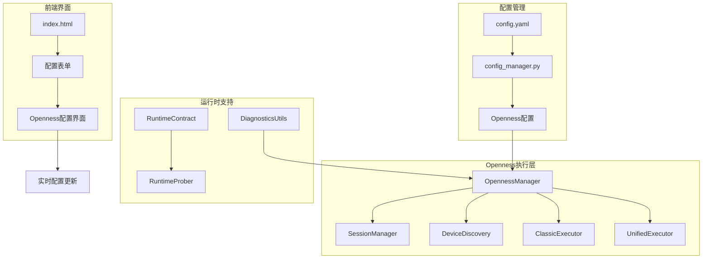
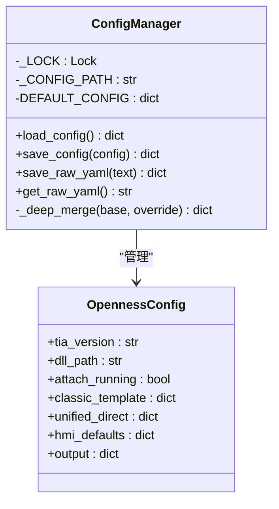
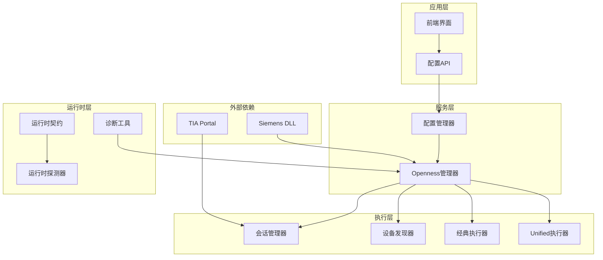
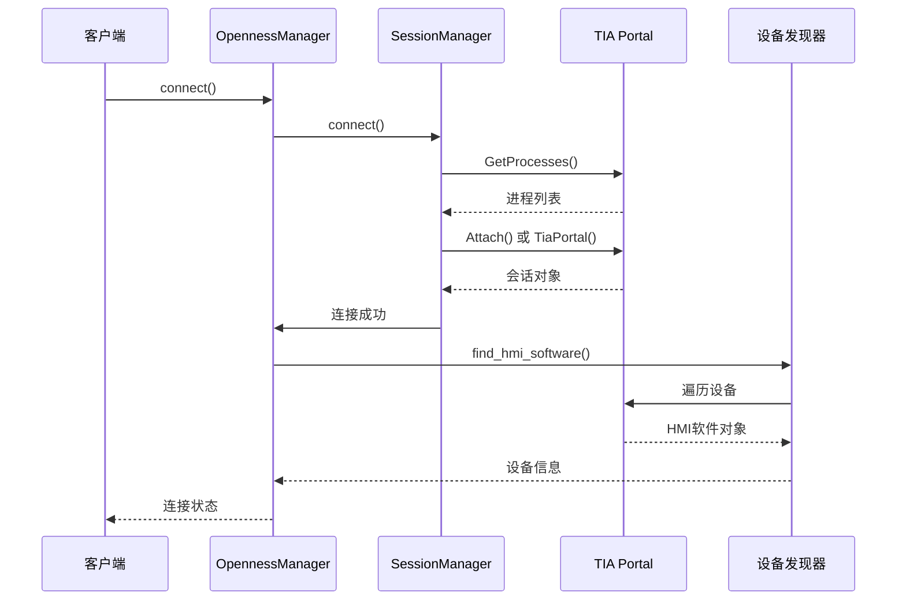
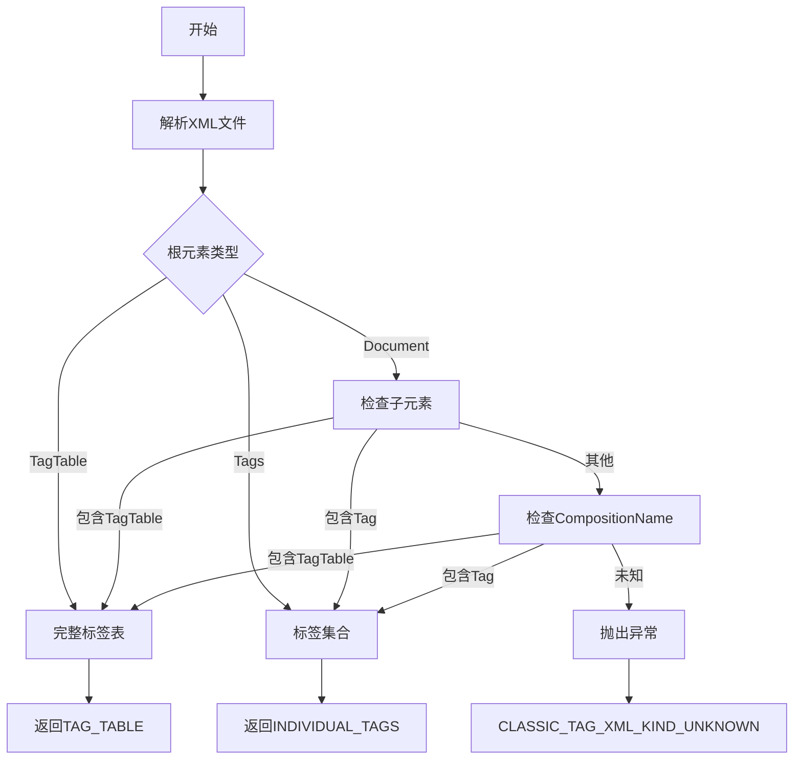
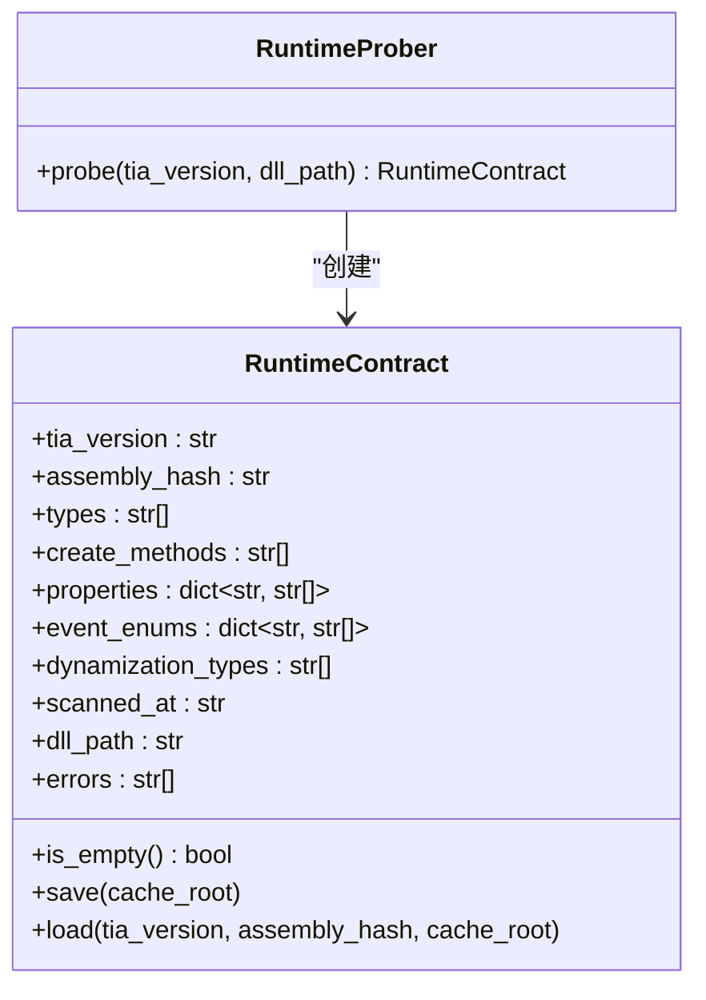
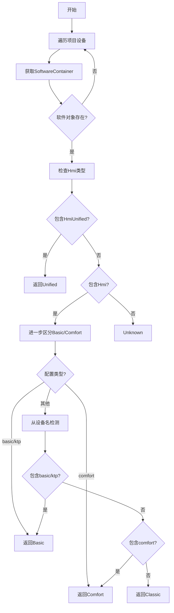
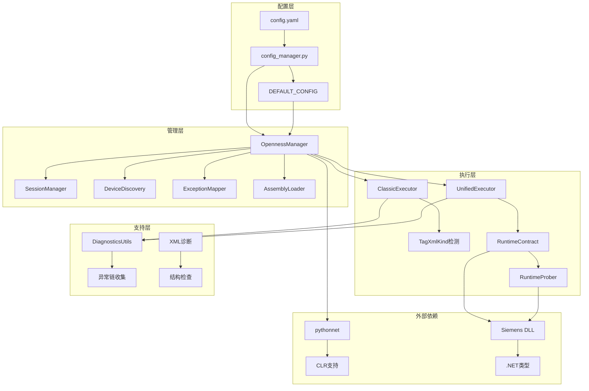

# Openness配置

<cite>
**本文档引用的文件**
- [config.yaml](file://config.yaml)
- [config_manager.py](file://backend/config_manager.py)
- [openness_manager.py](file://backend/openness_manager.py)
- [session_manager.py](file://backend/openness/session_manager.py)
- [device_discovery.py](file://backend/openness/device_discovery.py)
- [classic_executor.py](file://backend/openness/classic_executor.py)
- [unified_executor.py](file://backend/openness/unified_executor.py)
- [runtime_contract.py](file://backend/openness/runtime_contract.py)
- [diagnostics_utils.py](file://backend/openness/diagnostics_utils.py)
- [index.html](file://templates/index.html)
- [Login_Screen_20260617_134754.json](file://exports/Login_Screen_20260617_134754.json)
- [Motor_Control_20260617_173124.json](file://exports/Motor_Control_20260617_173124.json)
</cite>

## 目录
1. [简介](#简介)
2. [项目结构](#项目结构)
3. [核心组件](#核心组件)
4. [架构概览](#架构概览)
5. [详细组件分析](#详细组件分析)
6. [依赖关系分析](#依赖关系分析)
7. [性能考虑](#性能考虑)
8. [故障排除指南](#故障排除指南)
9. [结论](#结论)

## 简介

Openness配置系统是Siemens HMI Assistant项目的核心配置管理模块，负责TIA Portal集成配置的各项参数设置。该系统支持两种主要的HMI集成模式：经典模板XML模式和Unified直接绘制模式，为用户提供灵活的HMI画面生成和导入解决方案。

系统通过config.yaml文件集中管理所有配置参数，包括TIA版本、DLL路径、附加运行实例、项目路径、HMI设备等核心配置。同时提供了经典的模板配置和统一的直接配置两种模式，满足不同用户的需求。

## 项目结构

Openness配置系统在项目中的组织结构如下：

**图表来源**
- [config_manager.py:1-142](file://backend/config_manager.py#L1-L142)
- [openness_manager.py:1-800](file://backend/openness_manager.py#L1-L800)
- [index.html:180-311](file://templates/index.html#L180-L311)

**章节来源**
- [config.yaml:1-343](file://config.yaml#L1-L343)
- [config_manager.py:1-142](file://backend/config_manager.py#L1-L142)
- [index.html:180-311](file://templates/index.html#L180-L311)

## 核心组件

### 配置文件结构

Openness配置系统的核心配置文件位于`config.yaml`中，包含以下主要配置区域：

#### TIA Portal集成配置
- **tia_version**: TIA Portal版本（如V16、V18）
- **dll_path**: Siemens.Engineering.dll的完整路径
- **attach_running**: 是否附加到已运行的博途实例
- **project_path**: 指定项目路径，留空使用当前打开项目
- **hmi_device**: 目标HMI设备名称
- **screen_folder**: 导入到指定画面文件夹
- **target_resolution**: 目标HMI分辨率设置
- **auto_scale_screen_items**: 自动缩放屏幕项目
- **compile_after_import**: 导入后自动编译
- **save_after_import**: 导入后自动保存

#### 经典模板配置
- **enabled**: 启用经典模板模式
- **template_screen_name**: 模板画面名称
- **template_xml_path**: 模板XML文件路径
- **template_export_dir**: 模板导出目录
- **generated_xml_dir**: 生成XML目录
- **import_option**: 导入选项（Override等）

#### Unified直接配置
- **enabled**: 启用Unified直接绘制模式
- **update_existing_screen**: 更新现有画面
- **clear_existing_items**: 清空现有项目
- **unsupported_object_policy**: 不支持对象策略（warn/error/skip）

**章节来源**
- [config.yaml:19-56](file://config.yaml#L19-L56)
- [config_manager.py:35-67](file://backend/config_manager.py#L35-L67)

### 配置管理器

配置管理器负责配置文件的读取、验证和保存功能：

**图表来源**
- [config_manager.py:108-142](file://backend/config_manager.py#L108-L142)

**章节来源**
- [config_manager.py:108-142](file://backend/config_manager.py#L108-L142)

## 架构概览

Openness配置系统采用分层架构设计，确保配置管理的灵活性和可维护性：

**图表来源**
- [openness_manager.py:31-101](file://backend/openness_manager.py#L31-L101)
- [session_manager.py:14-52](file://backend/openness/session_manager.py#L14-L52)
- [device_discovery.py:15-28](file://backend/openness/device_discovery.py#L15-L28)

## 详细组件分析

### Openness管理器

Openness管理器是整个配置系统的核心协调者，负责管理所有Openness相关的操作：

#### 主要职责
- **会话管理**: 连接、断开TIA Portal会话
- **设备发现**: 查找和识别HMI设备类型
- **编译控制**: 触发HMI项目编译
- **异常映射**: 将.NET异常转换为诊断信息
- **程序集加载**: 管理Siemens DLL的加载和版本元数据

#### 连接流程

**图表来源**
- [openness_manager.py:142-186](file://backend/openness_manager.py#L142-L186)
- [session_manager.py:92-141](file://backend/openness/session_manager.py#L92-L141)

**章节来源**
- [openness_manager.py:31-101](file://backend/openness_manager.py#L31-L101)
- [session_manager.py:14-52](file://backend/openness/session_manager.py#L14-L52)

### 经典执行器

经典执行器专门处理Classic HMI（Basic/Comfort）的Openness操作：

#### 支持的操作流程
1. **连接导入**: 导入集成连接
2. **标签导入**: 导入标签表XML到DefaultTagTable
3. **文本列表导入**: 导入文本列表
4. **脚本和资源导入**: 导入脚本和资源
5. **画面导入**: 导入屏幕XML
6. **编译**: 触发HMI编译
7. **验证**: 验证导入结果

#### 标签XML类型检测

**图表来源**
- [classic_executor.py:90-169](file://backend/openness/classic_executor.py#L90-L169)

**章节来源**
- [classic_executor.py:285-613](file://backend/openness/classic_executor.py#L285-L613)

### Unified执行器

Unified执行器处理Unified HMI的Openness操作：

#### 主要特性
- **直接集合访问**: 使用hmiSoftware.Tags和hmiSoftware.Screens直接集合
- **运行时契约**: 基于DLL反射的运行时类型检查
- **属性设置**: 支持屏幕项目的属性直接设置
- **动态化创建**: 支持Dynamizations.Create操作
- **事件处理器**: 支持EventHandlers.Create操作

#### 运行时契约管理

**图表来源**
- [runtime_contract.py:21-110](file://backend/openness/runtime_contract.py#L21-L110)

**章节来源**
- [unified_executor.py:56-200](file://backend/openness/unified_executor.py#L56-L200)
- [runtime_contract.py:112-203](file://backend/openness/runtime_contract.py#L112-L203)

### 设备发现器

设备发现器负责在TIA项目中查找和识别HMI设备：

#### 设备类型识别流程

**图表来源**
- [device_discovery.py:80-139](file://backend/openness/device_discovery.py#L80-L139)

**章节来源**
- [device_discovery.py:28-78](file://backend/openness/device_discovery.py#L28-L78)

## 依赖关系分析

Openness配置系统具有清晰的依赖层次结构：

**图表来源**
- [config_manager.py:12-94](file://backend/config_manager.py#L12-L94)
- [openness_manager.py:44-100](file://backend/openness_manager.py#L44-L100)
- [runtime_contract.py:112-203](file://backend/openness/runtime_contract.py#L112-L203)

**章节来源**
- [config_manager.py:12-94](file://backend/config_manager.py#L12-L94)
- [openness_manager.py:44-100](file://backend/openness_manager.py#L44-L100)

## 性能考虑

### 配置加载优化
- 使用线程锁确保配置文件的并发安全
- 深度合并机制避免配置丢失
- 缓存机制减少重复解析

### Openness操作优化
- 延迟导入pythonnet，避免非Windows环境崩溃
- 会话复用减少连接开销
- 运行时契约缓存避免重复反射

### 内存管理
- 临时文件及时清理
- 大对象及时释放
- 循环引用避免

## 故障排除指南

### 常见问题及解决方案

#### 环境诊断
系统提供完整的环境诊断功能，检查以下关键要素：

1. **操作系统检查**: 确保运行在Windows系统上
2. **pythonnet安装**: 检查pythonnet库是否正确安装
3. **DLL路径验证**: 验证Siemens.Engineering.dll路径有效性
4. **TIA进程检测**: 检查是否有运行中的博途实例

#### 连接问题
- **DLL不存在**: 检查config.yaml中的dll_path配置
- **权限不足**: 确认用户在"Siemens TIA Openness"用户组中
- **版本不匹配**: 确认TIA Portal版本与配置一致

#### 导入问题
- **XML格式错误**: 使用XML验证器检查导入的XML格式
- **屏幕尺寸不匹配**: 确认目标HMI的分辨率设置
- **对象冲突**: 检查画面名称和屏幕编号的唯一性

#### 运行时问题
- **Unified类型缺失**: 检查HmiUnified.dll的完整性
- **属性访问失败**: 验证运行时契约的正确性
- **编译错误**: 检查变量定义和脚本语法

**章节来源**
- [openness_manager.py:103-139](file://backend/openness_manager.py#L103-L139)
- [session_manager.py:53-90](file://backend/openness/session_manager.py#L53-L90)
- [diagnostics_utils.py:35-63](file://backend/openness/diagnostics_utils.py#L35-L63)

## 结论

Openness配置系统通过模块化的设计和清晰的分层架构，为Siemens HMI Assistant提供了强大而灵活的配置管理能力。系统支持多种HMI集成模式，能够适应不同的应用场景和技术需求。

关键优势包括：
- **配置集中管理**: 通过单一配置文件管理所有Openness相关设置
- **双模式支持**: 同时支持经典模板XML和Unified直接绘制两种模式
- **运行时安全**: 通过运行时契约确保API调用的安全性和兼容性
- **完整诊断**: 提供全面的环境诊断和错误追踪功能
- **性能优化**: 通过缓存和延迟加载机制提升系统性能

该配置系统为用户提供了从基础的TIA Portal连接配置到高级的HMI画面生成和导入的完整解决方案，是Siemens HMI Assistant项目的重要基础设施。