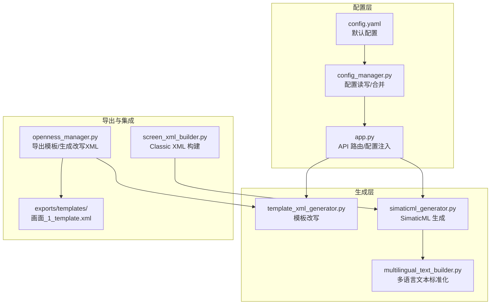
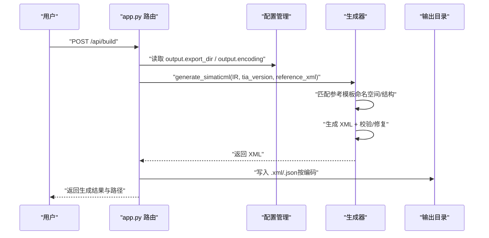
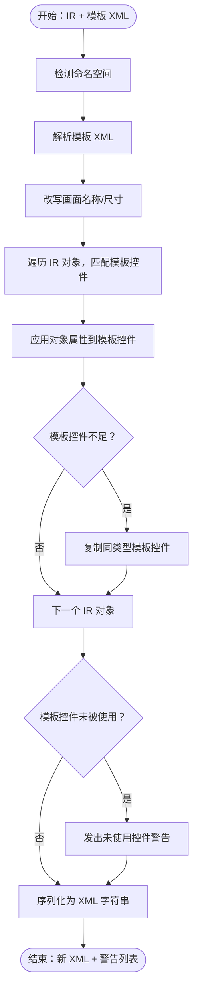
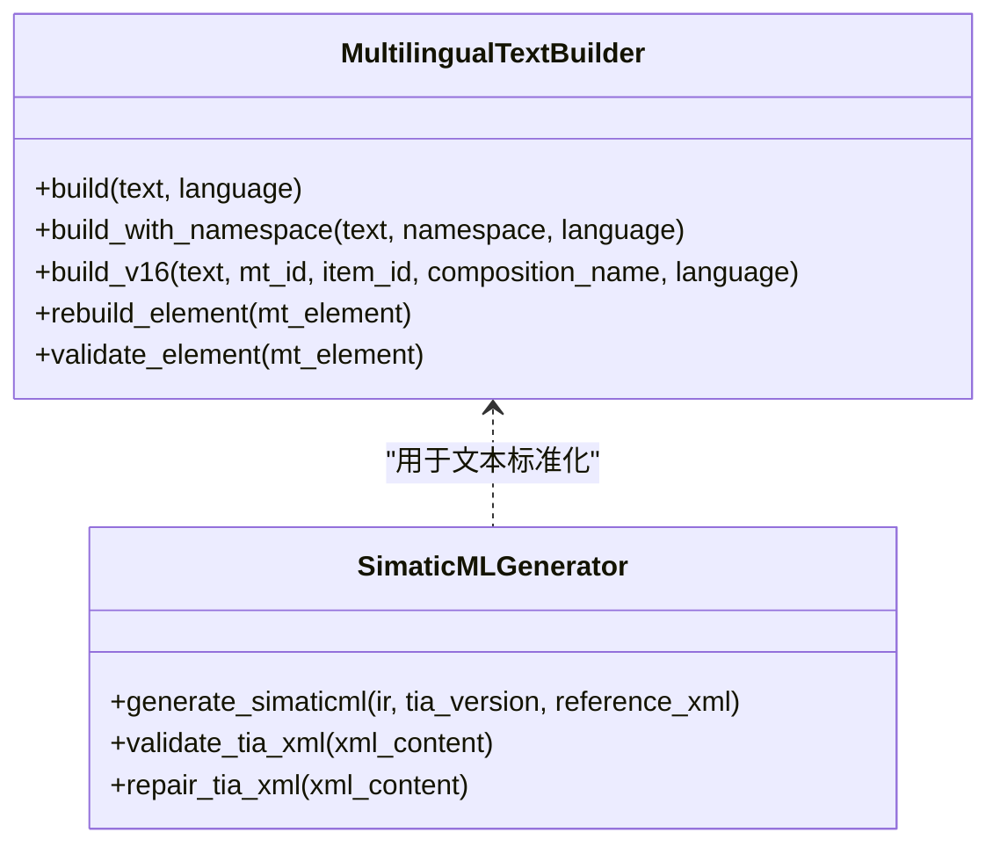
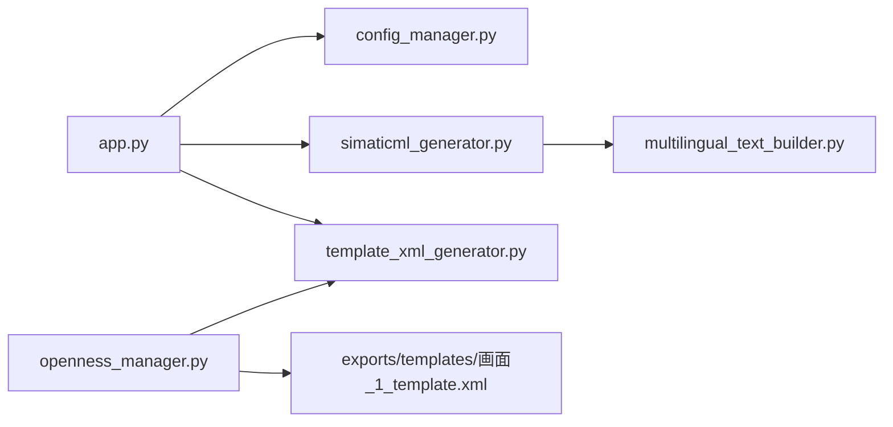

# 输出配置

<cite>
**本文档引用的文件**
- [app.py](file://app.py)
- [config.yaml](file://config.yaml)
- [config_manager.py](file://backend/config_manager.py)
- [template_xml_generator.py](file://backend/template_xml_generator.py)
- [simaticml_generator.py](file://backend/simaticml_generator.py)
- [multilingual_text_builder.py](file://backend/multilingual_text_builder.py)
- [openness_manager.py](file://backend/openness_manager.py)
- [screen_xml_builder.py](file://backend/backends/classic/screen_xml_builder.py)
- [画面_1_template.xml](file://exports/templates/画面_1_template.xml)
</cite>

## 目录
1. [简介](#简介)
2. [项目结构](#项目结构)
3. [核心组件](#核心组件)
4. [架构概览](#架构概览)
5. [详细组件分析](#详细组件分析)
6. [依赖分析](#依赖分析)
7. [性能考虑](#性能考虑)
8. [故障排查指南](#故障排查指南)
9. [结论](#结论)
10. [附录](#附录)

## 简介
本文件面向输出配置系统，聚焦 HMI 文件输出的各项参数与行为，包括导出目录、编码格式、参考 XML 模板等。文档解释参考 XML 模板的作用与自定义方法，阐述模板中的工程信息、文档信息、HMI 屏幕结构等关键部分，并说明输出配置对生成文件格式与质量的影响。同时提供输出目录设置、编码选择与模板定制的详细指南，以及文件命名规则与批量导出配置说明。

## 项目结构
输出配置系统涉及以下关键模块与文件：
- 配置管理：app.py 中的配置读取与保存、config.yaml 默认配置、config_manager.py 的配置持久化与合并策略
- 生成器：simaticml_generator.py（SimaticML 生成）、template_xml_generator.py（经典 HMI 模板改写）
- 文本与多语言：multilingual_text_builder.py（MultilingualText 标准化）
- 导出与集成：openness_manager.py（导出模板 XML、生成改写 XML）、screen_xml_builder.py（Classic HMI XML 构建）

图表来源
- [config.yaml](file://config.yaml)
- [config_manager.py](file://backend/config_manager.py)
- [app.py](file://app.py)
- [simaticml_generator.py](file://backend/simaticml_generator.py)
- [template_xml_generator.py](file://backend/template_xml_generator.py)
- [multilingual_text_builder.py](file://backend/multilingual_text_builder.py)
- [openness_manager.py](file://backend/openness_manager.py)
- [screen_xml_builder.py](file://backend/backends/classic/screen_xml_builder.py)
- [画面_1_template.xml](file://exports/templates/画面_1_template.xml)

章节来源
- [config.yaml](file://config.yaml)
- [config_manager.py](file://backend/config_manager.py)
- [app.py](file://app.py)

## 核心组件
- 输出配置项
  - 导出目录：用于存放生成的 XML 与 JSON 文件
  - 编码格式：控制生成文件的编码与 BOM
  - 参考 XML 模板：用于 SimaticML 生成时匹配命名空间与结构
- 模板改写器
  - 基于 IR 与模板 XML 的安全改写，保留结构、命名空间、ID、LinkList 等
  - 支持按模板控件名称、前缀、类型等多种匹配策略
- 生成器
  - SimaticML 生成器：按 TIA 版本与 HMI 类型生成标准 XML，并进行导入前校验与修复
  - 多语言文本构建器：确保 MultilingualText 符合 TIA 标准结构
- 导出与集成
  - 从博途导出模板 XML 并写入配置
  - 生成改写后的模板 XML 并落盘

章节来源
- [config.yaml](file://config.yaml)
- [template_xml_generator.py](file://backend/template_xml_generator.py)
- [simaticml_generator.py](file://backend/simaticml_generator.py)
- [multilingual_text_builder.py](file://backend/multilingual_text_builder.py)
- [openness_manager.py](file://backend/openness_manager.py)

## 架构概览
输出配置影响两条主要路径：
- SimaticML 生成路径：IR → 生成 SimaticML XML → 导入到博途
- 模板改写路径：IR + 模板 XML → 生成改写 XML → 导入到博途

图表来源
- [app.py](file://app.py)
- [config.yaml](file://config.yaml)
- [simaticml_generator.py](file://backend/simaticml_generator.py)

## 详细组件分析

### 输出配置参数详解
- 导出目录（output.export_dir）
  - 作用：决定生成的 XML 与 JSON 文件存放位置
  - 默认值：exports
  - 设置方式：通过 /api/config 接口保存配置
  - 影响：生成文件的物理路径与组织结构
- 编码格式（output.encoding）
  - 作用：控制生成 XML 的编码与 BOM
  - 默认值：utf-8-sig（带 BOM）
  - 设置方式：通过 /api/config 接口保存配置
  - 影响：与 TIA Portal 的兼容性与导入稳定性
- 参考 XML 模板（output.reference_xml）
  - 作用：用于 SimaticML 生成时匹配命名空间与结构，确保与目标 TIA 版本一致
  - 默认值：内置参考模板（包含 DocumentInfo、Hmi.Screen.Screen 等）
  - 设置方式：通过 /api/openness/export-reference 导出参考画面并写入配置
  - 影响：生成 XML 的命名空间、结构与导入成功率

章节来源
- [config.yaml](file://config.yaml)
- [config_manager.py](file://backend/config_manager.py)
- [app.py](file://app.py)

### 参考 XML 模板的作用与结构
- 作用
  - 匹配 TIA 版本与 HMI 类型的命名空间与结构
  - 作为 SimaticML 生成的骨架，确保生成的 XML 符合 TIA 导入规范
- 关键部分
  - 工程信息（DocumentInfo）：包含产品安装信息、导出设置等
  - 文档信息（DocumentInfo）：包含创建时间、导出设置、安装产品列表
  - HMI 屏幕结构（Hmi.Screen.Screen）：包含 AttributeList（Name、DisplayName、Width、Height 等）与 ObjectList（控件集合）
- 自定义方法
  - 从博途项目导出参考画面 XML，写入 output.reference_xml
  - 通过 /api/openness/export-reference 接口自动更新配置

章节来源
- [config.yaml](file://config.yaml)
- [app.py](file://app.py)
- [画面_1_template.xml](file://exports/templates/画面_1_template.xml)

### 模板 XML 改写流程
- 匹配策略（优先级）
  - template_ref（IR 对象的模板引用）
  - id（IR 对象 id 与模板控件名称完全匹配）
  - 名称前缀（TXT_/BTN_/IO_/SIO_/LMP_）
  - 类型映射（IR 类型 → XML 标签）
- 改写过程
  - 改写画面名称与尺寸（尊重模板尺寸，避免与目标 HMI 分辨率不匹配）
  - 遍历 IR 对象，匹配并应用属性（位置、尺寸、文本、变量连接、颜色、事件等）
  - 未匹配到模板控件时发出警告，必要时复制同类型模板控件
  - 序列化回 XML 字符串，尽量保留原始声明与命名空间

图表来源
- [template_xml_generator.py](file://backend/template_xml_generator.py)

章节来源
- [template_xml_generator.py](file://backend/template_xml_generator.py)

### SimaticML 生成与质量保障
- 命名空间与结构匹配
  - 从参考模板提取 Document 命名空间、Screen 父级结构、对象容器等
  - 生成 XML 时严格遵循 TIA 导入规范
- 多语言文本标准化
  - 使用 MultilingualTextBuilder 确保 Text/Language 结构正确
  - Rich Text（如按钮/文本控件可见文本）采用 <body>
...
</body> 结构
- 导入前校验与修复
  - 校验 HTML 标签、MultilingualText 结构、非法控制字符、Number 节点等
  - DOM 级重建 MultilingualText，避免字符串修补带来的风险

图表来源
- [multilingual_text_builder.py](file://backend/multilingual_text_builder.py)
- [simaticml_generator.py](file://backend/simaticml_generator.py)

章节来源
- [simaticml_generator.py](file://backend/simaticml_generator.py)
- [multilingual_text_builder.py](file://backend/multilingual_text_builder.py)

### 导出与集成（Openness）
- 导出模板 XML
  - 通过 /api/openness/export-template 导出指定画面为模板 XML
  - 自动更新配置中的模板路径与生成目录
- 生成改写 XML
  - 通过 /api/build/template-xml 使用模板 XML 改写 IR
  - 落盘生成的 XML 至 exports/generated_from_template 目录
- 导入到博途
  - 通过 /api/openness/import 导入 XML 或 IR
  - 支持多种模式（unified_direct、classic_template_xml、simaticml、auto）

章节来源
- [openness_manager.py](file://backend/openness_manager.py)
- [app.py](file://app.py)

## 依赖分析
- 配置依赖
  - app.py 依赖 config_manager 加载/保存配置
  - 生成器依赖 output.export_dir、output.encoding、output.reference_xml
- 生成器依赖
  - template_xml_generator 依赖 TIA 文本清洗与命名空间处理
  - simaticml_generator 依赖 multilingual_text_builder 与 XML 校验器
- 导出与集成依赖
  - openness_manager 依赖模板改写器与导出模板 XML

图表来源
- [app.py](file://app.py)
- [config_manager.py](file://backend/config_manager.py)
- [simaticml_generator.py](file://backend/simaticml_generator.py)
- [template_xml_generator.py](file://backend/template_xml_generator.py)
- [multilingual_text_builder.py](file://backend/multilingual_text_builder.py)
- [openness_manager.py](file://backend/openness_manager.py)
- [画面_1_template.xml](file://exports/templates/画面_1_template.xml)

章节来源
- [app.py](file://app.py)
- [config_manager.py](file://backend/config_manager.py)
- [simaticml_generator.py](file://backend/simaticml_generator.py)
- [template_xml_generator.py](file://backend/template_xml_generator.py)
- [multilingual_text_builder.py](file://backend/multilingual_text_builder.py)
- [openness_manager.py](file://backend/openness_manager.py)

## 性能考虑
- 模板改写
  - 匹配策略按优先级执行，避免重复扫描
  - 未匹配到模板控件时可复制同类型控件，减少二次生成成本
- SimaticML 生成
  - 仅在必要时进行 DOM 重建与修复，降低处理开销
  - 通过参考模板匹配命名空间与结构，减少字符串拼接与正则修补
- 导出与落盘
  - 生成完成后一次性写入 XML 与 JSON，避免频繁 I/O

## 故障排查指南
- 导入失败（命名空间/结构不匹配）
  - 检查 output.reference_xml 是否与目标 TIA 版本一致
  - 重新导出参考模板并更新配置
- 文本显示异常（按钮/文本控件）
  - 确认 MultilingualText 结构是否为 <Text Language="..."> 或 V16 标准结构
  - 使用 MultilingualTextBuilder.rebuild_element 修复
- 模板控件未被使用
  - 检查 IR 对象的 template_ref/id/前缀是否与模板控件名称一致
  - 若模板控件不足，模板改写器会复制同类型控件，注意 ID 唯一性
- 编码问题
  - 确认 output.encoding 为 utf-8-sig（带 BOM），提升与 TIA 的兼容性

章节来源
- [simaticml_generator.py](file://backend/simaticml_generator.py)
- [template_xml_generator.py](file://backend/template_xml_generator.py)
- [multilingual_text_builder.py](file://backend/multilingual_text_builder.py)

## 结论
输出配置系统通过导出目录、编码格式与参考 XML 模板三个关键参数，确保生成文件的格式与质量满足 TIA Portal 导入要求。模板改写器与 SimaticML 生成器协同工作，在保留模板结构的同时安全地应用 IR 数据。通过合理的配置与模板定制，可显著提升批量导出的一致性与成功率。

## 附录

### 输出目录设置与文件命名规则
- 导出目录
  - 通过 /api/config 设置 output.export_dir
  - 默认 exports；可设置为绝对或相对路径
- 文件命名规则
  - XML/JSON 文件名：IR 元数据中的 screen_name + 当前时间戳（YYYYMMDD_HHMMSS）
  - 示例：Motor_Control_20260618_114724.xml
- 批量导出
  - 通过 /api/build 生成 XML 与 JSON
  - 通过 /api/build/template-xml 生成模板改写 XML

章节来源
- [app.py](file://app.py)
- [config.yaml](file://config.yaml)

### 编码选择与兼容性
- 推荐使用 utf-8-sig（带 BOM），提升与 TIA Portal 的兼容性
- 通过 /api/config 设置 output.encoding
- 导出模板 XML 时使用 utf-8-sig 读取，确保中文内容正确

章节来源
- [config.yaml](file://config.yaml)
- [openness_manager.py](file://backend/openness_manager.py)

### 模板定制指南
- 获取模板
  - 通过 /api/openness/export-template 导出指定画面为模板 XML
  - 通过 /api/openness/export-reference 导出参考画面并写入 output.reference_xml
- 自定义模板
  - 修改 exports/templates/画面_1_template.xml 或导入新的模板 XML
  - 更新配置中的 template_xml_path 与 generated_xml_dir
- 验证与测试
  - 使用 /api/build/template-xml 生成改写 XML 并检查警告
  - 导入到博途验证结构与显示效果

章节来源
- [openness_manager.py](file://backend/openness_manager.py)
- [app.py](file://app.py)
- [画面_1_template.xml](file://exports/templates/画面_1_template.xml)