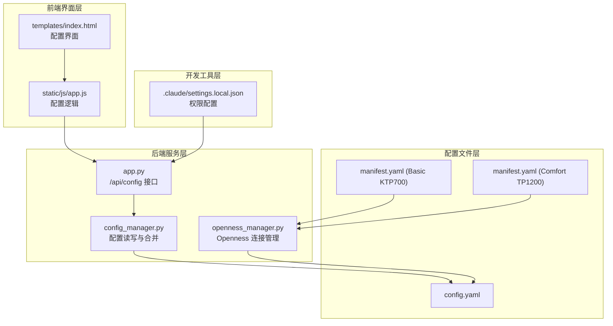
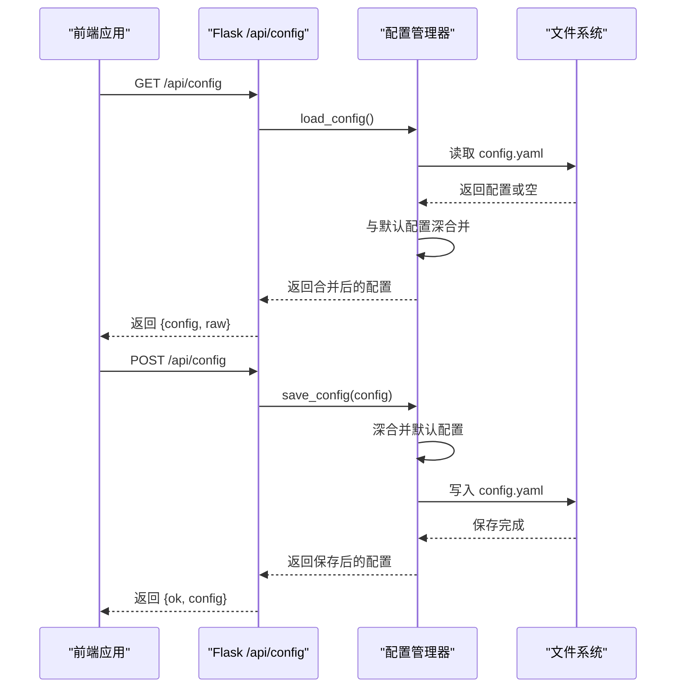
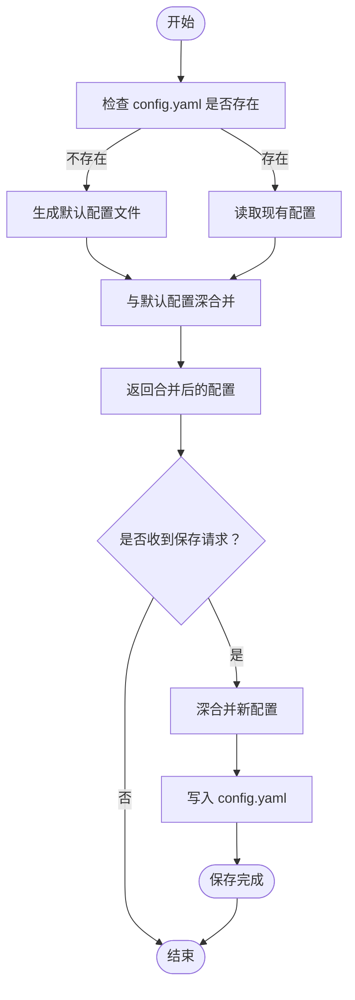
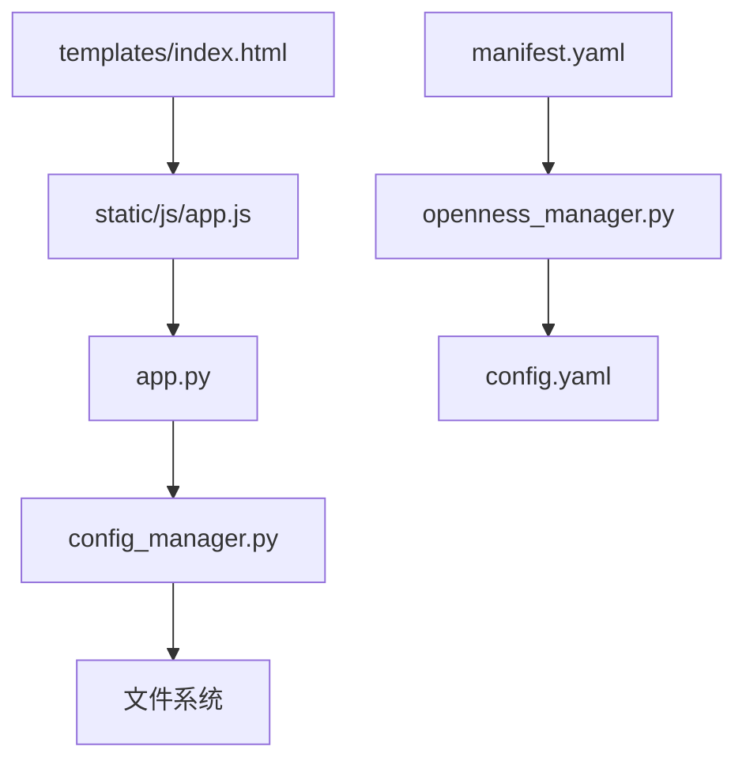

# 配置管理

<cite>
**本文档引用的文件**
- [config.yaml](file://config.yaml)
- [config_manager.py](file://backend/config_manager.py)
- [app.py](file://app.py)
- [openness_manager.py](file://backend/openness_manager.py)
- [index.html](file://templates/index.html)
- [app.js](file://static/js/app.js)
- [manifest.yaml（Basic KTP700）](file://reference_catalog/V20/Basic/KTP700/manifest.yaml)
- [manifest.yaml（Comfort TP1200）](file://reference_catalog/V20/Comfort/TP1200/manifest.yaml)
- [settings.local.json](file://.claude/settings.local.json)
- [test_flask_api.py](file://tests/test_flask_api.py)
</cite>

## 目录
1. [简介](#简介)
2. [项目结构](#项目结构)
3. [核心组件](#核心组件)
4. [架构概览](#架构概览)
5. [详细组件分析](#详细组件分析)
6. [依赖关系分析](#依赖关系分析)
7. [性能考虑](#性能考虑)
8. [故障排除指南](#故障排除指南)
9. [结论](#结论)
10. [附录](#附录)

## 简介
本文件面向 Siemens HMI Assistant 配置管理系统，提供全面的配置管理文档。内容涵盖配置文件结构、LLM 配置、Openness 配置、输出配置、默认模板等关键配置项的详细说明，以及配置文件的加载、验证和保存机制。文档还包含配置项的默认值、可选值范围、配置示例、对系统行为的影响、最佳实践、故障排除指南和常见配置错误的解决方案。

## 项目结构
Siemens HMI Assistant 的配置管理围绕以下核心文件展开：
- config.yaml：系统主配置文件，定义 LLM、Openness、输出、MIMO、服务器等配置项。
- backend/config_manager.py：负责配置文件的读取、合并默认配置、保存和原始 YAML 编辑功能。
- app.py：Flask 应用入口，提供 /api/config 接口，实现配置的读取与保存。
- backend/openness_manager.py：Openness 连接管理器，读取配置并驱动与 TIA Portal 的交互。
- templates/index.html 与 static/js/app.js：前端配置界面，支持结构化配置与原始 YAML 编辑。
- reference_catalog/V20/*/manifest.yaml：参考目录清单，描述设备族、分辨率等元数据。
- .claude/settings.local.json：开发工具权限配置，间接影响配置管理流程。
- tests/test_flask_api.py：测试用例，验证配置 API 的行为。

**图表来源**
- [config.yaml](file://config.yaml)
- [config_manager.py](file://backend/config_manager.py)
- [app.py](file://app.py)
- [openness_manager.py](file://backend/openness_manager.py)
- [index.html](file://templates/index.html)
- [app.js](file://static/js/app.js)
- [manifest.yaml（Basic KTP700）](file://reference_catalog/V20/Basic/KTP700/manifest.yaml)
- [manifest.yaml（Comfort TP1200）](file://reference_catalog/V20/Comfort/TP1200/manifest.yaml)
- [.claude/settings.local.json](file://.claude/settings.local.json)

**章节来源**
- [config.yaml](file://config.yaml)
- [config_manager.py](file://backend/config_manager.py)
- [app.py](file://app.py)
- [openness_manager.py](file://backend/openness_manager.py)
- [index.html](file://templates/index.html)
- [app.js](file://static/js/app.js)
- [manifest.yaml（Basic KTP700）](file://reference_catalog/V20/Basic/KTP700/manifest.yaml)
- [manifest.yaml（Comfort TP1200）](file://reference_catalog/V20/Comfort/TP1200/manifest.yaml)
- [.claude/settings.local.json](file://.claude/settings.local.json)

## 核心组件
本节概述配置管理的核心组件及其职责：
- 配置文件（config.yaml）：集中存储系统配置，包括 LLM 提供商、Openness 连接参数、输出设置、MIMO 审查参数、服务器设置等。
- 配置管理器（config_manager.py）：提供配置的加载、深合并默认配置、保存、原始 YAML 编辑等功能，并通过锁保证并发安全。
- Flask API（app.py）：提供 /api/config 接口，支持结构化配置读取与保存、原始 YAML 保存。
- Openness 管理器（openness_manager.py）：根据配置连接 TIA Portal，执行诊断、导出参考画面、导入 XML 等操作。
- 前端界面（templates/index.html + static/js/app.js）：提供配置表单、默认模板设置、原始 YAML 编辑模式等。

**章节来源**
- [config_manager.py](file://backend/config_manager.py)
- [app.py](file://app.py)
- [openness_manager.py](file://backend/openness_manager.py)
- [index.html](file://templates/index.html)
- [app.js](file://static/js/app.js)

## 架构概览
配置管理的总体架构如下：
- 配置文件位于项目根目录，首次运行时若不存在则自动生成默认配置。
- 前端通过 /api/config 读取配置，支持结构化表单与原始 YAML 两种编辑模式。
- 后端在保存配置时进行深合并，确保新增字段不会缺失。
- Openness 管理器根据配置连接 TIA Portal，执行后续业务流程。

**图表来源**
- [app.py](file://app.py)
- [config_manager.py](file://backend/config_manager.py)

**章节来源**
- [app.py](file://app.py)
- [config_manager.py](file://backend/config_manager.py)

## 详细组件分析

### 配置文件结构与关键配置项
config.yaml 包含以下主要配置块：

- LLM 配置（llm）
  - active_provider：当前激活的 LLM 提供商（如 deepseek）。
  - thinking_depth：推理深度（关闭/低/中/高）。
  - stream：是否启用流式输出。
  - show_thinking：是否展示思考过程。
  - providers：提供商配置，包含 deepseek 与 openai_compatible 的 base_url、api_key、chat_model、reasoner_model、supports_vision 等。

- Openness 配置（openness）
  - tia_version：TIA Portal 版本（如 V16）。
  - dll_path：Siemens.Engineering.dll 路径。
  - attach_running：是否附加到已打开的博途实例。
  - project_path：项目路径（留空则使用当前已打开项目）。
  - hmi_device：目标 HMI 设备名（默认 HMI_1）。
  - screen_folder：屏幕文件夹路径（留空导入到根画面文件夹）。
  - target_resolution：目标 HMI 分辨率（如 800x480），留空则自动从已有画面读取。
  - auto_scale_screen_items：尺寸自动对齐时同步缩放控件坐标/大小。
  - compile_after_import/save_after_import：导入后编译/保存项目。
  - generation_mode：生成模式（auto/unified_direct/classic_template_xml/simaticml）。
  - classic_template：经典模板配置，包含 enabled、template_screen_name、template_xml_path、template_export_dir、generated_xml_dir、import_option。
  - unified_direct：Unified 直接绘制配置，包含 enabled、update_existing_screen、clear_existing_items、unsupported_object_policy（warn/error/skip）。
  - default_templates：HMI 默认模板集合（basic/comfort/unified），每个模板包含 enabled、template_screen_name、template_xml_path。

- HMI 默认配置（hmi_defaults）
  - resolution：默认分辨率（如 800x480）。
  - hmi_type：HMI 类型（Basic/Comfort/Unified）。
  - background_color：背景色（如 #D9DEE5）。
  - font_family：字体族（如 Arial）。

- 输出配置（output）
  - export_dir：导出目录（默认 exports）。
  - encoding：编码（默认 utf-8-sig）。
  - reference_xml：参考 XML 模板（用于生成 SimaticML XML 的基础模板）。

- MIMO 配置（mimo）
  - enabled：视觉审查总开关。
  - api_key：MiMo API Key。
  - base_url：MiMo 基础 URL。
  - model：模型名称（如 mimo-v2.5）。
  - max_iterations：最多审查-修正循环次数。
  - review_timeout_seconds：MiMo API 超时时间。
  - review_pass_threshold：审查通过最低分（0-100）。
  - image_analysis_enabled：是否用 MiMo 分析上传的参考图片。
  - image_analysis_max_size：图片超过此尺寸则缩放。

- 服务器配置（server）
  - host：主机地址（默认 127.0.0.1）。
  - port：端口（默认 5000）。
  - debug：调试模式（默认 true）。

**章节来源**
- [config.yaml](file://config.yaml)

### 配置加载、验证与保存机制
- 首次运行：若 config.yaml 不存在，后端会根据默认配置生成文件并返回。
- 加载流程：读取配置文件，若为空则返回空字典；随后与默认配置进行深合并，保证新增字段不会缺失。
- 保存流程：接收前端提交的配置，进行深合并后写回文件；支持原始 YAML 直接保存，会校验可解析性。
- 并发安全：使用线程锁确保同一时刻只有一个写操作。

**图表来源**
- [config_manager.py](file://backend/config_manager.py)

**章节来源**
- [config_manager.py](file://backend/config_manager.py)

### Openness 配置对系统行为的影响
Openness 配置直接影响与 TIA Portal 的交互行为：
- tia_version：决定生成 XML 的 TIA 版本兼容性。
- dll_path：决定 Openness DLL 的加载路径，影响连接能力。
- attach_running：控制是否附加到已打开的博途实例，影响项目选择策略。
- project_path：指定项目路径，若为空则使用当前已打开项目。
- hmi_device：指定目标 HMI 设备名，影响设备发现与软件类型识别。
- screen_folder：指定屏幕文件夹路径，影响导入位置。
- target_resolution/auto_scale_screen_items：控制画面尺寸对齐与控件缩放，避免导入后越界。
- compile_after_import/save_after_import：控制导入后的编译与保存行为。
- generation_mode：控制生成模式（auto/unified_direct/classic_template_xml/simaticml），影响导入路径与策略。
- classic_template/unified_direct/default_templates：控制模板生成与默认模板选择，影响导入前的预处理与生成策略。

**章节来源**
- [openness_manager.py](file://backend/openness_manager.py)
- [config.yaml](file://config.yaml)

### 输出配置与默认模板
- 输出配置（output）
  - export_dir：导出目录，默认 exports。
  - encoding：编码，默认 utf-8-sig。
  - reference_xml：参考 XML 模板，用于生成 SimaticML XML 的基础模板。

- 默认模板（default_templates）
  - basic/comfort/unified：三种 HMI 类型的默认模板配置，包含 enabled、template_screen_name、template_xml_path。
  - 在未手动导出模板时，后端可按 HMI 类型读取对应模板。

- 经典模板 XML 设置（classic_template）
  - enabled：启用模板 XML。
  - template_screen_name：模板画面名称。
  - template_xml_path：模板 XML 路径。
  - template_export_dir：模板导出目录。
  - generated_xml_dir：生成 XML 目录。
  - import_option：导入选项（Override）。

**章节来源**
- [config.yaml](file://config.yaml)
- [index.html](file://templates/index.html)
- [app.js](file://static/js/app.js)

### 前端配置界面与交互
前端配置界面提供以下功能：
- Openness 连接配置：TIA 版本、DLL 路径、HMI 设备名、附加运行实例、导入后编译、完成后保存项目、生成模式等。
- 经典模板 XML 设置：启用模板 XML、模板画面名称、模板 XML 路径、模板导出目录、生成 XML 目录。
- HMI 默认模板设置（Basic/Comfort/Unified）：启用、模板画面名称、模板 XML 路径。
- 原始 YAML 编辑：支持直接编辑 YAML 文本并进行校验保存。
- 与后端 API 的交互：通过 /api/config 读取与保存配置，支持结构化表单与原始 YAML 两种模式。

**章节来源**
- [index.html](file://templates/index.html)
- [app.js](file://static/js/app.js)
- [app.py](file://app.py)

## 依赖关系分析
配置管理涉及以下关键依赖关系：
- config_manager.py 依赖文件系统进行配置读写，并与默认配置进行深合并。
- app.py 依赖 config_manager.py 提供的配置接口，并暴露 /api/config 供前端调用。
- openness_manager.py 依赖 config.yaml 中的 openness 配置，用于连接 TIA Portal、设备发现、编译与异常映射。
- 前端 index.html 与 app.js 依赖 /api/config 接口，实现配置的可视化编辑与保存。
- reference_catalog 中的 manifest.yaml 描述设备族与分辨率等元数据，影响 Openness 的设备识别与生成策略。

**图表来源**
- [config_manager.py](file://backend/config_manager.py)
- [app.py](file://app.py)
- [openness_manager.py](file://backend/openness_manager.py)
- [index.html](file://templates/index.html)
- [app.js](file://static/js/app.js)
- [manifest.yaml（Basic KTP700）](file://reference_catalog/V20/Basic/KTP700/manifest.yaml)
- [manifest.yaml（Comfort TP1200）](file://reference_catalog/V20/Comfort/TP1200/manifest.yaml)

**章节来源**
- [config_manager.py](file://backend/config_manager.py)
- [app.py](file://app.py)
- [openness_manager.py](file://backend/openness_manager.py)
- [index.html](file://templates/index.html)
- [app.js](file://static/js/app.js)
- [manifest.yaml（Basic KTP700）](file://reference_catalog/V20/Basic/KTP700/manifest.yaml)
- [manifest.yaml（Comfort TP1200）](file://reference_catalog/V20/Comfort/TP1200/manifest.yaml)

## 性能考虑
- 配置文件读写：使用线程锁保证并发安全，避免竞态条件。
- 深合并算法：递归合并字典，确保新增字段不会缺失，但注意配置层级过深时的性能开销。
- 前端配置保存：支持结构化表单与原始 YAML 两种模式，原始 YAML 保存会进行可解析性校验，避免无效配置写入。
- Openness 连接：连接 TIA Portal 需要加载 DLL，初次连接可能较慢，建议在生产环境中缓存连接状态。

## 故障排除指南
常见配置错误与解决方案：
- 配置文件损坏或格式错误
  - 现象：保存配置时报错或配置未生效。
  - 排查：检查 config.yaml 的 YAML 格式，确保缩进与键名正确。
  - 解决：使用原始 YAML 编辑模式，粘贴正确的 YAML 内容后保存。
  - 参考：[config_manager.py](file://backend/config_manager.py)

- Openness 连接失败
  - 现象：连接 TIA Portal 失败或诊断显示错误。
  - 排查：检查 dll_path 是否存在，确认已安装对应版本的 TIA Portal 与 Openness，确认当前用户在 "Siemens TIA Openness" 用户组中。
  - 解决：修正 dll_path，安装正确的 TIA Portal 版本，添加用户到相应用户组。
  - 参考：[openness_manager.py](file://backend/openness_manager.py)

- 画面导入后越界或尺寸不匹配
  - 现象：导入 XML 后控件越界或尺寸不匹配。
  - 排查：检查 target_resolution 是否正确设置，确认 auto_scale_screen_items 是否启用。
  - 解决：设置正确的 target_resolution，启用 auto_scale_screen_items 以自动缩放控件。
  - 参考：[openness_manager.py](file://backend/openness_manager.py)

- 生成模式选择不当
  - 现象：生成的 XML 与目标设备不兼容。
  - 排查：检查 generation_mode 是否与目标设备类型匹配。
  - 解决：根据设备类型选择合适的生成模式（auto/unified_direct/classic_template_xml/simaticml）。
  - 参考：[config.yaml](file://config.yaml)

- 前端配置未保存
  - 现象：前端修改配置后刷新页面发现未生效。
  - 排查：确认 /api/config 的 POST 请求是否成功返回 {ok: true}。
  - 解决：检查网络请求与后端日志，确保保存接口调用成功。
  - 参考：[app.py](file://app.py), [test_flask_api.py](file://tests/test_flask_api.py)

**章节来源**
- [config_manager.py](file://backend/config_manager.py)
- [openness_manager.py](file://backend/openness_manager.py)
- [app.py](file://app.py)
- [test_flask_api.py](file://tests/test_flask_api.py)

## 结论
Siemens HMI Assistant 的配置管理系统通过 config.yaml 集中管理 LLM、Openness、输出、MIMO、服务器等关键配置，结合 config_manager.py 的深合并机制与 app.py 的 API 接口，实现了灵活、可靠的配置管理。前端通过直观的表单与原始 YAML 编辑模式，提升了配置的易用性。合理的配置策略能够显著提升与 TIA Portal 的交互效率与生成质量，同时通过故障排除指南可以快速定位并解决常见问题。

## 附录

### 配置项详细说明与默认值
- LLM 配置（llm）
  - active_provider：默认 deepseek
  - thinking_depth：默认 中
  - stream：默认 true
  - show_thinking：默认 true
  - providers.deepseek：base_url 默认 https://api.deepseek.com，api_key 默认 空，chat_model 默认 deepseek-chat，reasoner_model 默认 deepseek-reasoner，supports_vision 默认 false
  - providers.openai_compatible：base_url 默认 https://api.openai.com/v1，api_key 默认 空，chat_model 默认 gpt-4o-mini，reasoner_model 默认 o1-mini，supports_vision 默认 true

- Openness 配置（openness）
  - tia_version：默认 V18
  - dll_path：默认 C:\Program Files\Siemens\Automation\Portal V18\PublicAPI\V18\Siemens.Engineering.dll
  - attach_running：默认 true
  - project_path：默认 空
  - hmi_device：默认 HMI_1
  - screen_folder：默认 空
  - target_resolution：默认 空
  - auto_scale_screen_items：默认 true
  - compile_after_import：默认 true
  - save_after_import：默认 false
  - generation_mode：默认 auto
  - classic_template.enabled：默认 true
  - classic_template.import_option：默认 Override
  - unified_direct.unsupported_object_policy：默认 warn

- HMI 默认配置（hmi_defaults）
  - resolution：默认 1280x800
  - hmi_type：默认 Comfort
  - background_color：默认 #1F2630
  - font_family：默认 Arial

- 输出配置（output）
  - export_dir：默认 exports
  - encoding：默认 utf-8-sig

- MIMO 配置（mimo）
  - enabled：默认 false
  - api_key：默认 空
  - base_url：默认 https://api.xiaomimimo.com/v1
  - model：默认 mimo-v2.5
  - max_iterations：默认 3
  - review_timeout_seconds：默认 90
  - review_pass_threshold：默认 70
  - image_analysis_enabled：默认 true
  - image_analysis_max_size：默认 2048

- 服务器配置（server）
  - host：默认 127.0.0.1
  - port：默认 5000
  - debug：默认 true

**章节来源**
- [config_manager.py](file://backend/config_manager.py)
- [config.yaml](file://config.yaml)