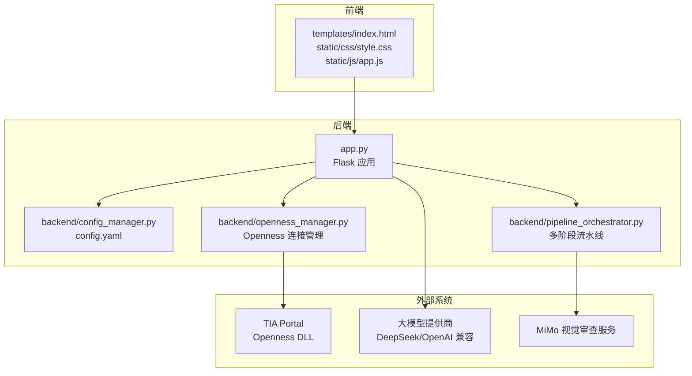
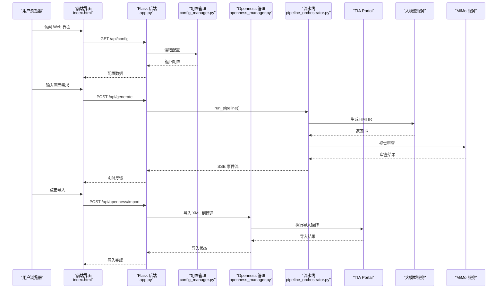
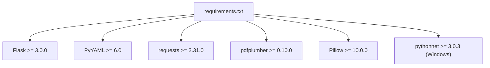

# 快速开始指南

<cite>
**本文档引用的文件**
- [app.py](file://app.py)
- [config.yaml](file://config.yaml)
- [requirements.txt](file://requirements.txt)
- [backend/config_manager.py](file://backend/config_manager.py)
- [templates/index.html](file://templates/index.html)
- [backend/openness_manager.py](file://backend/openness_manager.py)
- [backend/pipeline_orchestrator.py](file://backend/pipeline_orchestrator.py)
- [Documents/README_Basic_HMI_Support.md](file://Documents/README_Basic_HMI_Support.md)
</cite>

## 目录
1. [简介](#简介)
2. [项目结构](#项目结构)
3. [核心组件](#核心组件)
4. [架构概览](#架构概览)
5. [详细组件分析](#详细组件分析)
6. [依赖分析](#依赖分析)
7. [性能考虑](#性能考虑)
8. [故障排除指南](#故障排除指南)
9. [结论](#结论)
10. [附录](#附录)

## 简介
Siemens HMI Assistant 是一个基于 Flask 的 HMI 画面生成与导入工具，支持通过自然语言生成 HMI 画面、Openness 连接博途、XML 导入等功能。本指南面向新用户，提供从零开始的完整安装与配置流程，帮助您在30分钟内完成基本部署并体验核心功能。

## 项目结构
该项目采用前后端分离的架构设计，前端使用 HTML/CSS/JavaScript，后端使用 Python Flask 提供 REST API。主要目录与文件如下：
- app.py：Flask 应用入口，定义所有 API 路由与业务逻辑
- config.yaml：应用配置文件，包含 LLM、Openness、输出等配置
- requirements.txt：Python 依赖包清单
- backend/：后端核心模块，包含配置管理、Openness 管理、流水线编排等
- templates/index.html：前端主页面模板
- static/css/style.css、static/js/app.js：前端样式与脚本
- exports/：生成的 XML 和 JSON 文件导出目录
- deepseek_mimo_vision_skill/：视觉审查技能模块（可选）



**图表来源**
- [app.py:1-966](file://app.py#L1-L966)
- [backend/config_manager.py:1-142](file://backend/config_manager.py#L1-L142)
- [backend/openness_manager.py:1-200](file://backend/openness_manager.py#L1-L200)
- [backend/pipeline_orchestrator.py:1-200](file://backend/pipeline_orchestrator.py#L1-L200)

**章节来源**
- [app.py:1-966](file://app.py#L1-L966)
- [config.yaml:1-343](file://config.yaml#L1-L343)
- [requirements.txt:1-25](file://requirements.txt#L1-L25)

## 核心组件
本节介绍项目的核心组件及其职责。

### Flask 应用 (app.py)
- 路由定义：提供 Web 界面访问、配置管理、HMI 生成、Openness 连接、XML 导入等 API
- SSE 流式响应：支持自然语言生成的实时反馈
- Openness 连接：全局唯一的 OpennessManager 实例管理博途连接
- 多阶段流水线：集成 MiMo 视觉审查的生成流程

### 配置管理 (backend/config_manager.py)
- 配置读写：支持结构化表单和原始 YAML 两种配置方式
- 默认配置：首次运行自动生成默认配置
- 深合并：确保新增配置字段不会缺失

### Openness 管理 (backend/openness_manager.py)
- 环境诊断：检查 Windows 系统、pythonnet、DLL 路径等
- 连接管理：附加到正在运行的博途实例
- XML 处理：预处理 XML、解决导入冲突
- 设备发现：识别 HMI 设备类型和能力

### 多阶段流水线 (backend/pipeline_orchestrator.py)
- 图像分析：使用 MiMo 分析上传的参考图片
- 生成阶段：调用 LLM 生成 HMI IR
- 预览渲染：将 IR 渲染为 PNG 预览
- 视觉审查：MiMo 多阶段审查与修正
- 结果汇总：生成最终的审查结果摘要

**章节来源**
- [app.py:1-966](file://app.py#L1-L966)
- [backend/config_manager.py:1-142](file://backend/config_manager.py#L1-L142)
- [backend/openness_manager.py:1-200](file://backend/openness_manager.py#L1-L200)
- [backend/pipeline_orchestrator.py:1-200](file://backend/pipeline_orchestrator.py#L1-L200)

## 架构概览
系统采用分层架构，清晰分离前端、后端和外部系统交互：



**图表来源**
- [app.py:166-511](file://app.py#L166-L511)
- [backend/pipeline_orchestrator.py:131-200](file://backend/pipeline_orchestrator.py#L131-L200)
- [backend/openness_manager.py:142-185](file://backend/openness_manager.py#L142-L185)

## 详细组件分析

### 安装与环境准备
#### 系统要求
- Python 版本：3.10 - 3.12
- 操作系统：Windows（Openness 仅支持 Windows）
- 硬件：至少 8GB 内存，推荐 16GB+

#### 依赖安装步骤
1. 创建虚拟环境
   ```bash
   python -m venv hmi_env
   hmi_env\Scripts\activate
   ```

2. 安装依赖
   ```bash
   pip install -r requirements.txt
   ```

3. 验证安装
   - 检查 Python 版本：`python --version`
   - 检查依赖安装：`pip list`

**章节来源**
- [requirements.txt:1-25](file://requirements.txt#L1-L25)

### 配置文件设置
#### 首次运行配置
1. 启动应用后，系统会自动生成默认配置文件
2. 配置文件位置：`config.yaml`
3. 主要配置项：
   - LLM 设置：选择提供商、API Key、模型等
   - Openness 设置：TIA 版本、DLL 路径、设备名等
   - 输出设置：导出目录、编码格式等

#### 常见配置示例
```yaml
# LLM 配置示例
llm:
  active_provider: deepseek
  providers:
    deepseek:
      base_url: https://api.deepseek.com
      api_key: sk-xxxxxxxxxxxxxxx
      chat_model: deepseek-v4-pro
      reasoner_model: deepseek-reasoner

# Openness 配置示例
openness:
  tia_version: V18
  dll_path: "C:\\Program Files\\Siemens\\Automation\\Portal V18\\PublicAPI\\V18\\Siemens.Engineering.dll"
  hmi_device: "HMI_1"
  generation_mode: "auto"
```

**章节来源**
- [config.yaml:1-343](file://config.yaml#L1-L343)
- [backend/config_manager.py:12-94](file://backend/config_manager.py#L12-L94)

### 启动应用
#### 启动命令
```bash
python app.py
```

#### 访问 Web 界面
- 默认地址：http://127.0.0.1:5000
- 默认端口：5000（可在配置中修改）

#### 首次连接 Openness
1. 确保已安装对应版本的 TIA Portal
2. 在配置中设置正确的 DLL 路径
3. 点击"诊断"按钮检查环境
4. 点击"连接"按钮连接到博途

**章节来源**
- [app.py:76-78](file://app.py#L76-L78)
- [config.yaml:339-343](file://config.yaml#L339-L343)

### 基本功能演示

#### 自然语言生成 HMI 画面
1. 在左侧输入框中描述画面需求
2. 可选：上传图片/PDF 作为参考
3. 点击"生成画面"按钮
4. 查看实时生成进度和思考过程
5. 点击"生成 XML / 预览"查看结果

#### Openness 连接
1. 点击"诊断"检查环境
2. 确认诊断结果中"ready"为 True
3. 点击"连接"建立连接
4. 验证连接状态显示为"已连接"

#### XML 导入到博途
1. 生成 XML 后点击"导入到博途"
2. 选择导入模式（自动/Unified/模板/XML）
3. 等待导入完成
4. 在博途中查看生成的 HMI 画面

**章节来源**
- [app.py:166-220](file://app.py#L166-L220)
- [app.py:316-377](file://app.py#L316-L377)
- [app.py:461-496](file://app.py#L461-L496)

### 配置最佳实践

#### LLM 配置建议
- 选择合适的提供商：DeepSeek 或 OpenAI 兼容接口
- 设置合理的思考深度：根据需求复杂度调整
- 启用流式输出：提升用户体验

#### Openness 配置建议
- 确保 DLL 路径正确指向已安装的 TIA Portal 版本
- 设置正确的 HMI 设备名
- 根据目标设备类型选择合适的生成模式

#### 输出配置建议
- 导出目录：使用相对路径便于移植
- 编码格式：推荐使用 UTF-8 含 BOM
- 自动编译：导入后自动编译确保 XML 有效

**章节来源**
- [config.yaml:1-343](file://config.yaml#L1-L343)

## 依赖分析

### Python 依赖关系


**图表来源**
- [requirements.txt:1-25](file://requirements.txt#L1-L25)

### 外部系统依赖
- Windows 操作系统（Openness 仅支持 Windows）
- 对应版本的 TIA Portal（V16/V18/V20）
- Siemens.Engineering.dll（Openness PublicAPI）
- 大模型提供商 API（DeepSeek/OpenAI 兼容）
- MiMo 视觉审查服务（可选）

**章节来源**
- [requirements.txt:20-25](file://requirements.txt#L20-L25)
- [backend/openness_manager.py:8-16](file://backend/openness_manager.py#L8-L16)

## 性能考虑
- SSE 流式响应：减少前端等待时间
- 图像分析优化：限制同时分析的图片数量
- 预览渲染缓存：避免重复计算
- 连接池管理：复用 Openness 连接
- 错误处理：及时释放资源，避免内存泄漏

## 故障排除指南

### 常见问题及解决方案

#### 1. Openness 连接失败
**症状**：诊断结果显示"未检测到 pythonnet"
**解决方案**：
- 确保在 Windows 系统上运行
- 安装 pythonnet：`pip install pythonnet`
- 检查 DLL 路径是否正确

#### 2. LLM API 调用失败
**症状**：生成过程中出现网络错误
**解决方案**：
- 检查 API Key 是否正确
- 验证网络连接
- 尝试更换提供商或 Base URL

#### 3. XML 导入失败
**症状**：导入后博途中出现错误
**解决方案**：
- 检查生成的 XML 是否有效
- 确认目标 HMI 设备类型匹配
- 尝试不同的导入模式

#### 4. 前端页面加载缓慢
**症状**：页面响应慢或资源加载失败
**解决方案**：
- 清除浏览器缓存
- 检查静态文件路径
- 确认服务器端口未被占用

### 诊断工具
- 环境诊断：检查系统要求和依赖
- 连接状态：实时显示 Openness 连接状态
- 日志查看：查看详细的错误信息和调试信息

**章节来源**
- [backend/openness_manager.py:103-139](file://backend/openness_manager.py#L103-L139)
- [app.py:316-333](file://app.py#L316-L333)

## 结论
Siemens HMI Assistant 提供了一个完整的 HMI 画面生成与导入解决方案。通过本快速开始指南，您应该能够：
- 成功安装和配置应用
- 理解核心功能和工作流程
- 解决常见的配置和连接问题
- 在30分钟内完成基本部署并体验核心功能

建议在实际项目中结合团队的具体需求，进一步优化配置参数和工作流程。

## 附录

### 快速检查清单
- [ ] Python 3.10-3.12 已安装
- [ ] Windows 系统（Openness 依赖）
- [ ] TIA Portal 已安装
- [ ] requirements.txt 已安装
- [ ] config.yaml 已配置
- [ ] 应用已启动
- [ ] Openness 已连接
- [ ] 基本功能已测试

### 常用命令参考
- 启动应用：`python app.py`
- 安装依赖：`pip install -r requirements.txt`
- 重新加载配置：在 Web 界面点击"重新加载"
- 导出模板：使用"导出模板"功能