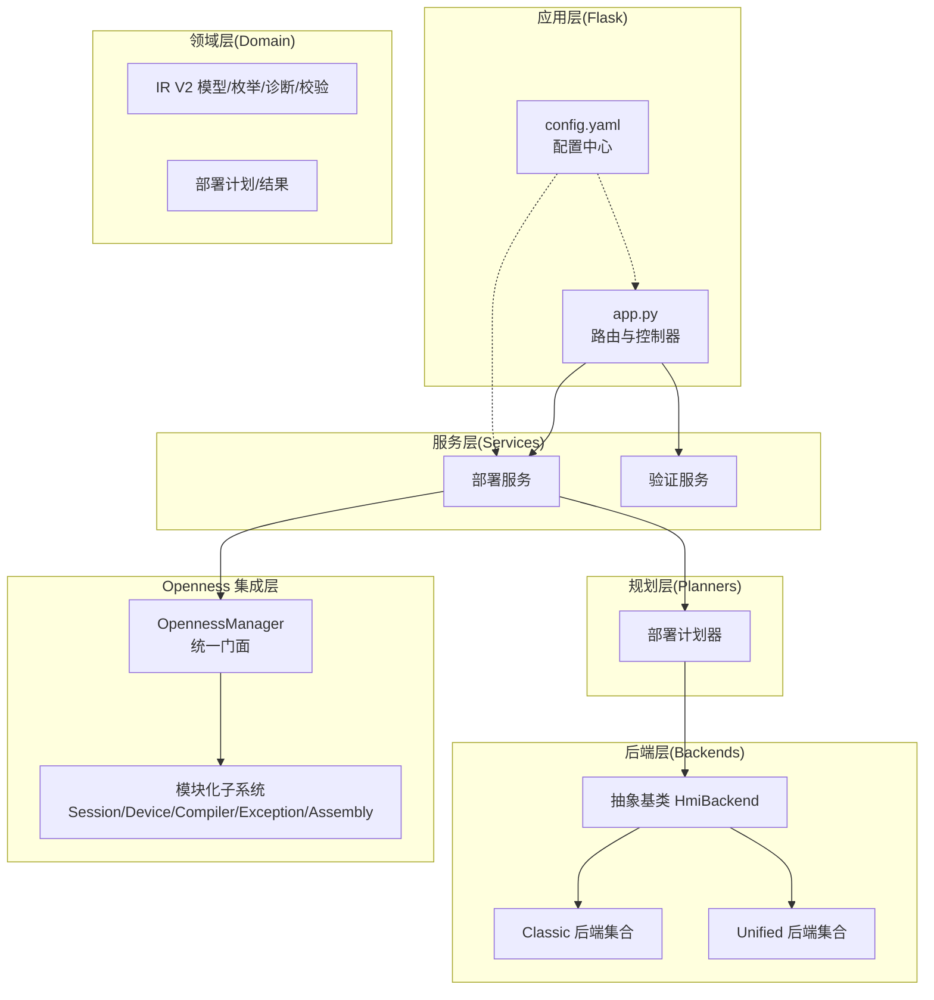
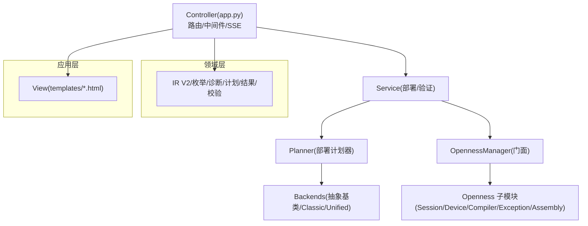
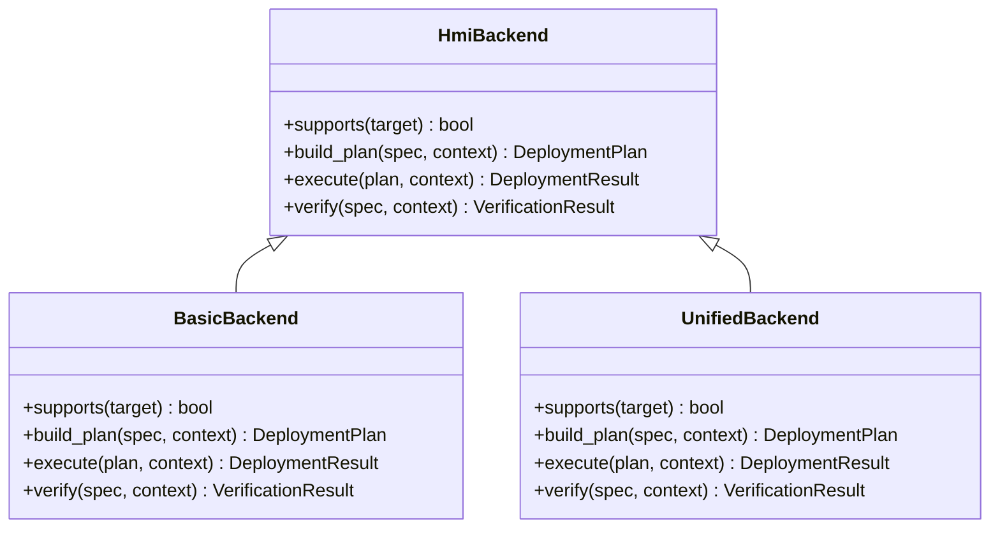
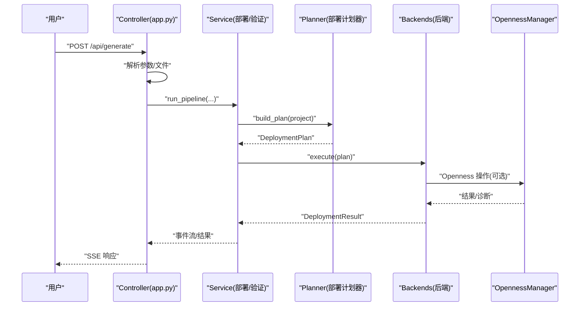
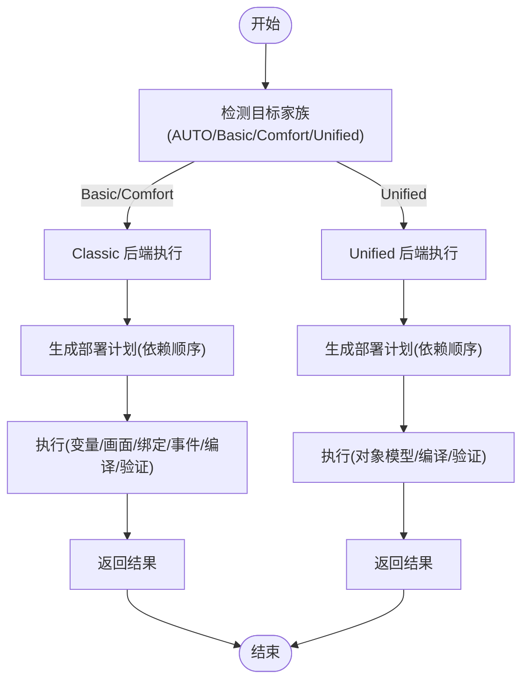
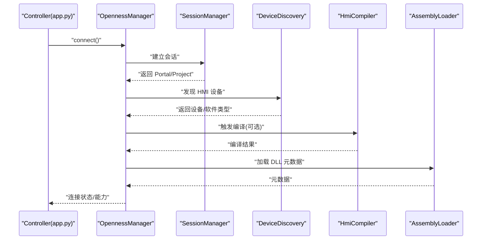
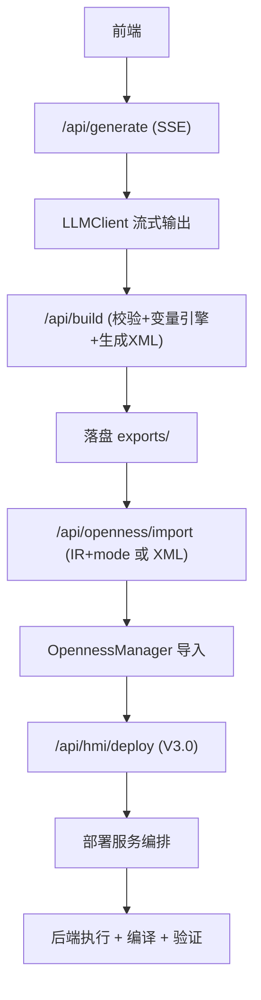
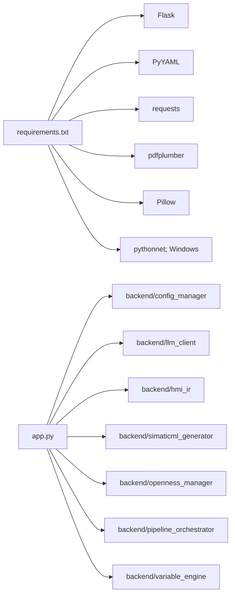

# 技术架构概览

<cite>
**本文档引用的文件**
- [app.py](file://app.py)
- [config.yaml](file://config.yaml)
- [requirements.txt](file://requirements.txt)
- [backend/domain/__init__.py](file://backend/domain/__init__.py)
- [backend/services/__init__.py](file://backend/services/__init__.py)
- [backend/backends/base.py](file://backend/backends/base.py)
- [backend/backends/classic/__init__.py](file://backend/backends/classic/__init__.py)
- [backend/backends/unified/__init__.py](file://backend/backends/unified/__init__.py)
- [backend/planners/deployment_planner.py](file://backend/planners/deployment_planner.py)
- [backend/services/deployment_service.py](file://backend/services/deployment_service.py)
- [backend/openness_manager.py](file://backend/openness_manager.py)
</cite>

## 目录
1. [引言](#引言)
2. [项目结构](#项目结构)
3. [核心组件](#核心组件)
4. [架构总览](#架构总览)
5. [详细组件分析](#详细组件分析)
6. [依赖分析](#依赖分析)
7. [性能考量](#性能考量)
8. [故障排查指南](#故障排查指南)
9. [结论](#结论)
10. [附录](#附录)

## 引言
本文件面向 Siemens HMI Assistant 项目的架构与实现，系统化梳理“领域层 → 服务层 → 后端层 → Openness 集成层”的分层设计理念与技术边界；阐释 MVC 在 Flask 应用中的落地（Model/Domain、View/templates、Controller/app.py 路由）；详解三后端系统（Classic/Basice/Comfort、Unified、Base）的职责与协作；说明 Openness 集成层如何实现与 TIA Portal 的深度集成；并覆盖数据流、组件交互、跨层关注点（安全性、监控、故障恢复）、基础设施与可扩展性、部署拓扑等内容。

## 项目结构
项目采用“Flask 应用 + 后端业务包”组织方式，核心入口为 Flask 应用，业务逻辑集中在 backend 包内，按层次与功能域进一步细分：
- 应用入口与路由：app.py
- 配置中心：config.yaml
- 依赖声明：requirements.txt
- 领域层（domain）：IR V2 数据模型、枚举、诊断、部署计划/结果、校验与适配器
- 服务层（services）：部署/验证服务、工厂与运行时上下文
- 规划层（planners）：部署计划器
- 后端层（backends）：抽象基类与三后端实现（Classic、Unified、Base）
- Openness 集成层（openness、openness_manager）：.NET/DLL 交互、会话、设备发现、编译、异常映射等

图表来源
- [app.py:1-966](file://app.py#L1-L966)
- [config.yaml:1-343](file://config.yaml#L1-L343)
- [backend/domain/__init__.py:1-116](file://backend/domain/__init__.py#L1-L116)
- [backend/services/__init__.py:1-12](file://backend/services/__init__.py#L1-L12)
- [backend/backends/base.py:1-32](file://backend/backends/base.py#L1-L32)
- [backend/backends/classic/__init__.py:1-35](file://backend/backends/classic/__init__.py#L1-L35)
- [backend/backends/unified/__init__.py:1-22](file://backend/backends/unified/__init__.py#L1-L22)
- [backend/planners/deployment_planner.py:1-300](file://backend/planners/deployment_planner.py#L1-L300)
- [backend/services/deployment_service.py:1-200](file://backend/services/deployment_service.py#L1-L200)
- [backend/openness_manager.py:1-200](file://backend/openness_manager.py#L1-L200)

章节来源
- [app.py:1-966](file://app.py#L1-L966)
- [config.yaml:1-343](file://config.yaml#L1-L343)
- [requirements.txt:1-25](file://requirements.txt#L1-L25)

## 核心组件
- Flask 应用与路由（Controller）
  - 提供配置读写、流式生成（SSE）、构建 SimaticML、Openness 诊断/连接/导入/同步/断开、V3.0 部署能力查询与部署流水线等 API。
  - 全局唯一的 Openness 连接管理，确保多次请求间状态一致。
- 领域层（Domain）
  - IR V2 数据模型、枚举、诊断、部署计划/结果、校验与 Legacy 适配器，完全不依赖 Flask/pythonnet/Siemens DLL。
- 服务层（Services）
  - 部署服务（编排 validate → plan → execute → verify → compile）、验证服务、工厂与运行时上下文。
- 规划层（Planners）
  - 从 HmiProjectSpec 生成 DeploymentPlan，按依赖顺序自动生成步骤并汇聚诊断。
- 后端层（Backends）
  - 抽象基类 HmiBackend 定义统一接口；Classic（Basic/Comfort）与 Unified 两套后端实现，Base 作为通用基础。
- Openness 集成层
  - OpennessManager 作为门面，委托 Session/Device/Compiler/Exception/Assembly 等模块，负责与 TIA Portal 的交互。

章节来源
- [app.py:1-966](file://app.py#L1-L966)
- [backend/domain/__init__.py:1-116](file://backend/domain/__init__.py#L1-L116)
- [backend/services/__init__.py:1-12](file://backend/services/__init__.py#L1-L12)
- [backend/backends/base.py:1-32](file://backend/backends/base.py#L1-L32)
- [backend/planners/deployment_planner.py:1-300](file://backend/planners/deployment_planner.py#L1-L300)
- [backend/services/deployment_service.py:1-200](file://backend/services/deployment_service.py#L1-L200)
- [backend/openness_manager.py:1-200](file://backend/openness_manager.py#L1-L200)

## 架构总览
系统采用“分层架构 + MVC 控制器 + 三后端 + Openness 集成”的混合模式：
- 分层架构（Domain → Service → Backends → Openness）
  - 领域层隔离业务语义与规则，服务层编排流程，后端层对接不同 HMI 平台，Openness 层桥接 .NET/TIA Portal。
- MVC 在 Flask 中的实现
  - Model/Domain：IR V2、枚举、诊断、计划/结果、校验
  - View：templates 目录下的 HTML 模板
  - Controller：app.py 路由函数，封装业务调用与响应
- 三后端系统
  - Classic（Basic/Comfort）：基于 XML 与 FunctionList 的传统路径
  - Unified：基于 Unified 对象模型的直连路径
  - Base：抽象基类与通用能力
- Openness 集成
  - 通过 OpennessManager 统一接入，模块化封装会话、设备发现、编译、异常映射与 DLL 元数据

图表来源
- [app.py:1-966](file://app.py#L1-L966)
- [backend/services/deployment_service.py:1-200](file://backend/services/deployment_service.py#L1-L200)
- [backend/planners/deployment_planner.py:1-300](file://backend/planners/deployment_planner.py#L1-L300)
- [backend/backends/base.py:1-32](file://backend/backends/base.py#L1-L32)
- [backend/backends/classic/__init__.py:1-35](file://backend/backends/classic/__init__.py#L1-L35)
- [backend/backends/unified/__init__.py:1-22](file://backend/backends/unified/__init__.py#L1-L22)
- [backend/openness_manager.py:1-200](file://backend/openness_manager.py#L1-L200)

## 详细组件分析

### 分层架构与职责边界
- 领域层（Domain）
  - 职责：定义 HMI 工程的语义 IR V2、枚举、诊断、部署计划/结果、校验与 Legacy 适配器
  - 特性：不依赖 Flask、pythonnet、Siemens DLL，保证纯业务与可测试性
- 服务层（Services）
  - 职责：编排部署流水线（validate → plan → execute → verify → compile），提供运行时上下文与工厂
- 规划层（Planners）
  - 职责：从 HmiProjectSpec 生成 DeploymentPlan，按依赖顺序自动生成步骤并汇聚诊断
- 后端层（Backends）
  - 职责：对接不同 HMI 平台（Classic/Unified），实现 supports/build_plan/execute/verify
- Openness 集成层
  - 职责：封装 .NET/DLL 交互，提供统一门面，屏蔽平台差异

图表来源
- [backend/backends/base.py:1-32](file://backend/backends/base.py#L1-L32)
- [backend/backends/classic/basic_backend.py:1-200](file://backend/backends/classic/basic_backend.py#L1-L200)
- [backend/backends/unified/unified_backend.py:1-200](file://backend/backends/unified/unified_backend.py#L1-L200)

章节来源
- [backend/domain/__init__.py:1-116](file://backend/domain/__init__.py#L1-L116)
- [backend/services/__init__.py:1-12](file://backend/services/__init__.py#L1-L12)
- [backend/backends/base.py:1-32](file://backend/backends/base.py#L1-L32)
- [backend/backends/classic/basic_backend.py:1-200](file://backend/backends/classic/basic_backend.py#L1-L200)
- [backend/backends/unified/unified_backend.py:1-200](file://backend/backends/unified/unified_backend.py#L1-L200)

### MVC 在 Flask 中的实现
- Model/Domain：IR V2、枚举、诊断、计划/结果、校验
- View：templates/index.html
- Controller：app.py 路由函数，封装业务调用与响应，支持 SSE 流式输出

图表来源
- [app.py:166-267](file://app.py#L166-L267)
- [backend/services/deployment_service.py:1-200](file://backend/services/deployment_service.py#L1-L200)
- [backend/planners/deployment_planner.py:1-300](file://backend/planners/deployment_planner.py#L1-L300)
- [backend/backends/base.py:1-32](file://backend/backends/base.py#L1-L32)
- [backend/openness_manager.py:1-200](file://backend/openness_manager.py#L1-L200)

章节来源
- [app.py:1-966](file://app.py#L1-L966)

### 三后端系统（Classic、Unified、Base）
- Classic（Basic/Comfort）
  - 基于 XML 与 FunctionList 的传统路径，支持变量表导入、引用重写、文本列表生成等
  - 禁止 VBS 脚本（Basic 不支持）
- Unified
  - 基于 Unified 对象模型的直连路径，需要 RuntimeContract 缓存与 TIA 连接
  - 无连接时永远不返回 DEPLOYED
- Base
  - 抽象基类，定义统一接口，供 Classic/Unified 实现

图表来源
- [backend/services/deployment_service.py:114-181](file://backend/services/deployment_service.py#L114-L181)
- [backend/backends/classic/basic_backend.py:1-200](file://backend/backends/classic/basic_backend.py#L1-L200)
- [backend/backends/unified/unified_backend.py:1-200](file://backend/backends/unified/unified_backend.py#L1-L200)
- [backend/planners/deployment_planner.py:1-300](file://backend/planners/deployment_planner.py#L1-L300)

章节来源
- [backend/backends/base.py:1-32](file://backend/backends/base.py#L1-L32)
- [backend/backends/classic/__init__.py:1-35](file://backend/backends/classic/__init__.py#L1-L35)
- [backend/backends/unified/__init__.py:1-22](file://backend/backends/unified/__init__.py#L1-L22)
- [backend/services/deployment_service.py:114-181](file://backend/services/deployment_service.py#L114-L181)

### Openness 集成层与 TIA Portal 深度集成
- OpennessManager 作为门面，延迟初始化各子模块（Session/Device/Compiler/Exception/Assembly）
- 诊断模式：在非 Windows 或无 pythonnet 环境下自动进入“诊断模式”，不崩溃
- 连接策略：支持附加到正在运行的博途实例或新建会话，定位 HMI 设备并导入 XML
- 预处理：在导入前进行文本清洗、DOM 重建、编号分配等预处理

图表来源
- [backend/openness_manager.py:31-101](file://backend/openness_manager.py#L31-L101)
- [backend/openness_manager.py:142-186](file://backend/openness_manager.py#L142-L186)
- [backend/openness_manager.py:194-200](file://backend/openness_manager.py#L194-L200)

章节来源
- [backend/openness_manager.py:1-200](file://backend/openness_manager.py#L1-L200)

### 数据流与组件交互
- 流式生成：前端发起 /api/generate，后端通过 LLMClient 与提示工程构建消息，SSE 输出“thinking/content/done/error”
- 构建与落盘：校验 IR → 变量引擎生成 → 生成 SimaticML → 落盘 → 返回预览数据
- Openness 导入：支持 IR + mode 自动路由或旧 XML 路径模式，先生成 XML 再导入
- V3.0 部署：validate → plan → execute → verify → compile，全程受运行时上下文控制

图表来源
- [app.py:166-311](file://app.py#L166-L311)
- [app.py:461-496](file://app.py#L461-L496)
- [app.py:672-761](file://app.py#L672-L761)
- [backend/services/deployment_service.py:1-200](file://backend/services/deployment_service.py#L1-L200)

章节来源
- [app.py:1-966](file://app.py#L1-L966)

### 集成模式与跨层关注点
- 安全性
  - 配置读取与保存：后端对敏感字段（如 API Key）进行掩码展示，编辑时允许整体覆盖
  - Openness 连接：严格检查 Windows/Pythonnet/DLL 路径，避免在不支持环境下崩溃
- 监控
  - SSE 事件流：start/thinking/content/done/error，便于前端实时反馈
  - 诊断接口：/api/openness/diagnose 与 /api/openness/status，统一返回诊断与连接状态
- 故障恢复
  - Openness 诊断模式：非 Windows/无 pythonnet 时进入诊断模式，不影响前端与大模型调试
  - 逐步回退：V3.2 后端工厂对 AUTO 家族解析失败时回退至 Comfort，并返回诊断

章节来源
- [app.py:84-109](file://app.py#L84-L109)
- [app.py:316-334](file://app.py#L316-L334)
- [backend/openness_manager.py:103-139](file://backend/openness_manager.py#L103-L139)
- [backend/services/deployment_service.py:114-181](file://backend/services/deployment_service.py#L114-L181)

## 依赖分析
- 外部依赖
  - Flask、PyYAML、requests、pdfplumber、Pillow
  - Windows 环境下可选 pythonnet，用于加载 Siemens.Engineering.dll
- 内部依赖
  - app.py 依赖 backend.* 模块（config_manager、prompts、LLMClient、hmi_ir、simaticml_generator、openness_manager、pipeline_orchestrator、variable_engine）
  - 服务层依赖领域层与规划层，后端层依赖领域层与规划层
  - OpennessManager 委派 Session/Device/Compiler/Exception/Assembly 子模块

图表来源
- [requirements.txt:1-25](file://requirements.txt#L1-L25)
- [app.py:26-40](file://app.py#L26-L40)

章节来源
- [requirements.txt:1-25](file://requirements.txt#L1-L25)
- [app.py:1-966](file://app.py#L1-L966)

## 性能考量
- 流式生成与 SSE
  - 使用流式输出减少前端等待时间，提升交互体验
- 部署计划器
  - 一次性生成完整步骤序列，避免重复扫描与计算
- Openness 操作
  - 仅在连接状态下执行真实修改，Dry Run 模式下快速反馈
- I/O 与落盘
  - 生成 XML/JSON 后落盘，避免内存压力

## 故障排查指南
- Openness 诊断
  - 使用 /api/openness/diagnose 与 /api/openness/status 快速定位环境问题（Windows、pythonnet、DLL 路径）
- 连接失败
  - 确认已安装对应版本 TIA Portal 与 Openness，当前用户在“Siemens TIA Openness”用户组
  - 检查 config.yaml 中 openness.dll_path 与项目路径
- 导入失败
  - 确认 XML 路径有效或先通过 /api/build 生成 XML
  - 检查 IR 校验与变量引擎生成结果
- V3.0 部署
  - 先 /api/hmi/validate，再 /api/hmi/deploy；若失败查看部署日志与诊断

章节来源
- [app.py:316-334](file://app.py#L316-L334)
- [app.py:461-496](file://app.py#L461-L496)
- [app.py:636-670](file://app.py#L636-L670)
- [backend/openness_manager.py:103-139](file://backend/openness_manager.py#L103-L139)

## 结论
本项目通过清晰的分层架构与模块化设计，实现了从 AI 驱动的 HMI 画面生成到 TIA Portal 的自动化部署闭环。领域层隔离业务语义，服务层统一编排，后端层适配多平台，Openness 层桥接 .NET 生态。MVC 在 Flask 中得到稳健实现，配合 SSE 与诊断模式，兼顾了可用性与可维护性。建议在生产环境中强化日志与可观测性，并持续优化 Openness 的稳定性与回退策略。

## 附录
- 基础设施要求
  - 操作系统：Windows（Openness 仅支持）
  - Python：3.10 ~ 3.12
  - TIA Portal 与 Openness（PublicAPI）版本与 DLL 路径需与 config.yaml 一致
- 可扩展性考虑
  - 后端层可通过新增 HmiBackend 实现对接新平台
  - Openness 子模块可按需扩展（如新增设备类型、编译策略）
- 部署拓扑
  - 建议将 Flask 应用与 TIA Portal 部署在同一台 Windows 主机，确保 pythonnet 与 DLL 可用