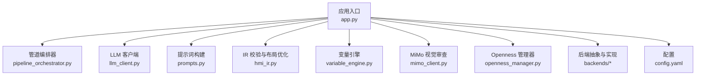
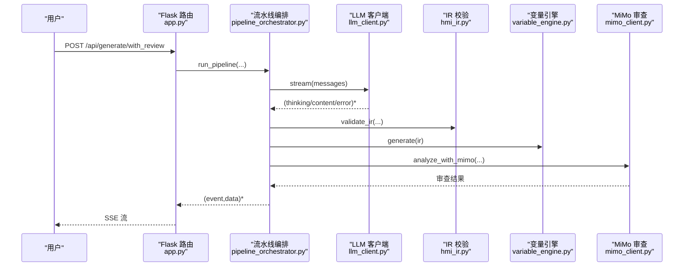
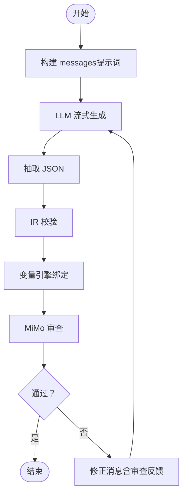
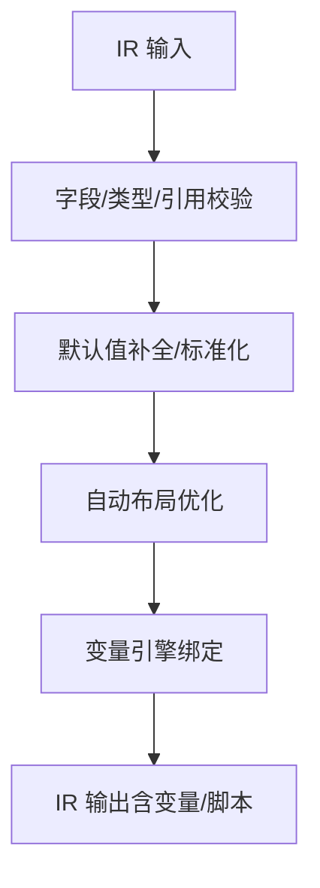
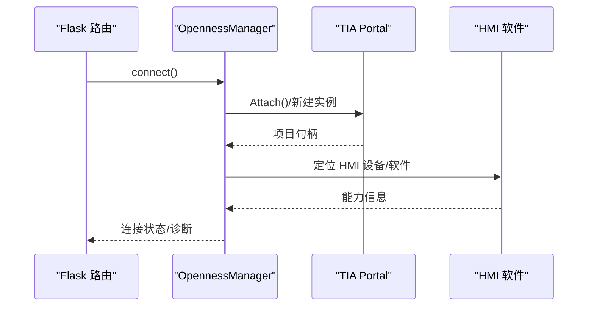
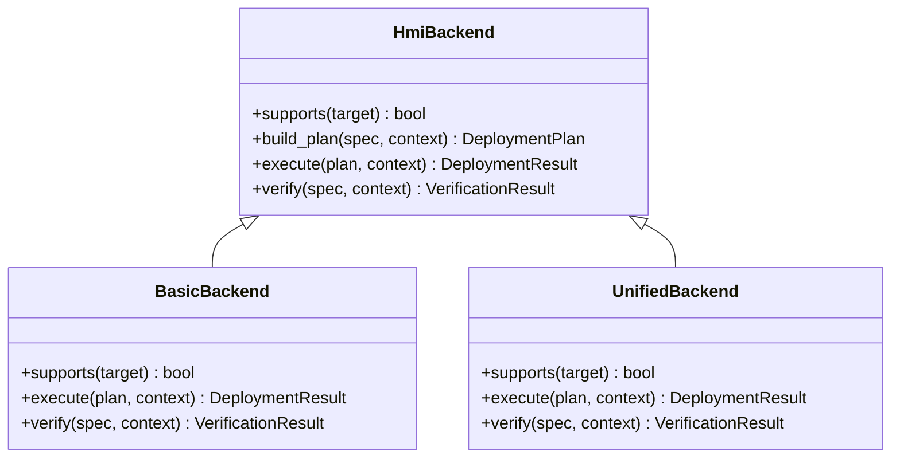
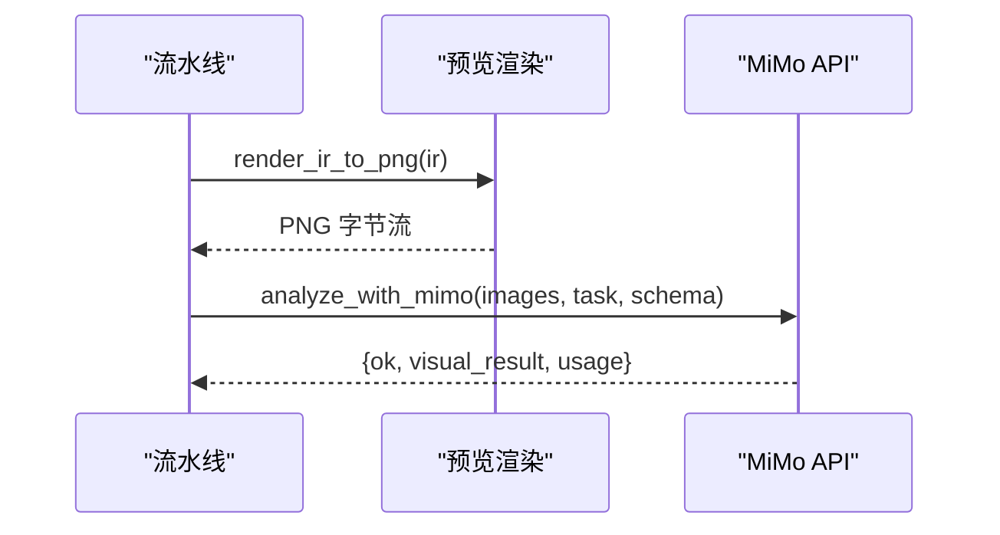
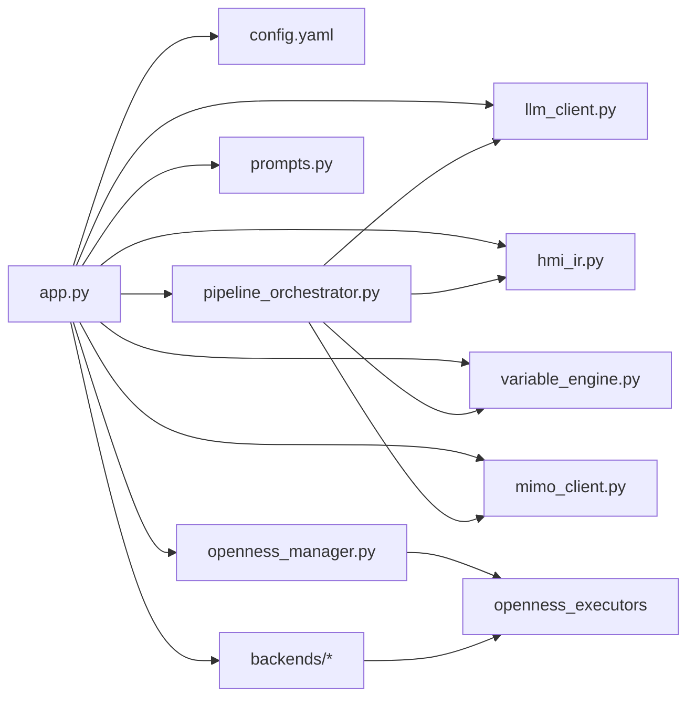

# 核心功能特性

<cite>
**本文档引用的文件**
- [app.py](file://app.py)
- [pipeline_orchestrator.py](file://backend/pipeline_orchestrator.py)
- [llm_client.py](file://backend/llm_client.py)
- [prompts.py](file://backend/prompts.py)
- [hmi_ir.py](file://backend/hmi_ir.py)
- [variable_engine.py](file://backend/variable_engine.py)
- [mimo_client.py](file://backend/mimo_client.py)
- [openness_manager.py](file://backend/openness_manager.py)
- [base.py](file://backend/backends/base.py)
- [basic_backend.py](file://backend/backends/classic/basic_backend.py)
- [unified_backend.py](file://backend/backends/unified/unified_backend.py)
- [config.yaml](file://config.yaml)
</cite>

## 目录
1. [简介](#简介)
2. [项目结构](#项目结构)
3. [核心组件](#核心组件)
4. [架构总览](#架构总览)
5. [详细组件分析](#详细组件分析)
6. [依赖分析](#依赖分析)
7. [性能考虑](#性能考虑)
8. [故障排查指南](#故障排查指南)
9. [结论](#结论)
10. [附录](#附录)

## 简介
本文件系统性阐述 Siemens HMI Assistant 的核心功能特性，围绕四大主线展开：
- AI 生成系统：LLM 客户端集成、提示词构建、流式生成与思维过程展示
- HMI IR 处理：IR 校验器、变量引擎、布局优化与兼容性处理
- Openness 集成：设备发现、项目连接、XML 导入与编译验证
- 三后端系统：Classic（Basic/Comfort）、Unified、Base 的差异与适用场景
- 视觉审查系统：MiMo 视觉 API 集成，用于设计审查与错误检测

## 项目结构
项目采用分层模块化设计，核心目录与职责概览：
- backend：核心业务逻辑（LLM、IR、变量引擎、Openness、后端、管道等）
- exports：生成的 XML/JSON 输出与模板
- reference_catalog：设备参考清单
- static/js、static/css：前端资源
- templates：前端模板
- tests：单元测试
- config.yaml：全局配置

图表来源
- [app.py:1-120](file://app.py#L1-L120)
- [pipeline_orchestrator.py:1-60](file://backend/pipeline_orchestrator.py#L1-L60)
- [llm_client.py:1-60](file://backend/llm_client.py#L1-L60)
- [prompts.py:1-60](file://backend/prompts.py#L1-L60)
- [hmi_ir.py:1-60](file://backend/hmi_ir.py#L1-L60)
- [variable_engine.py:1-60](file://backend/variable_engine.py#L1-L60)
- [mimo_client.py:1-60](file://backend/mimo_client.py#L1-L60)
- [openness_manager.py:1-60](file://backend/openness_manager.py#L1-L60)
- [base.py:1-32](file://backend/backends/base.py#L1-L32)

章节来源
- [app.py:1-120](file://app.py#L1-L120)
- [config.yaml:1-60](file://config.yaml#L1-L60)

## 核心组件
- LLM 客户端：统一 OpenAI 兼容接口，支持流式输出与“思考过程”展示，具备推理深度映射与超时/异常处理
- 提示词系统：严格 IR Schema、工程规范与 Few-Shot 示例，保障输出质量与一致性
- IR 校验器：结构校验、默认值补全、交叉引用检查、自动布局优化
- 变量引擎：自动变量命名、行为模式检测、绑定规则、Tag 表生成
- Openness 管理器：设备发现、项目连接、XML 预处理、导入与编译验证
- 三后端系统：Classic（Basic/Comfort）、Unified、Base 的统一接口与差异化实现
- 视觉审查：MiMo 图像理解 API，提供 UI/布局/OCR/图表/表格等多模态审查

章节来源
- [llm_client.py:35-229](file://backend/llm_client.py#L35-L229)
- [prompts.py:14-248](file://backend/prompts.py#L14-L248)
- [hmi_ir.py:261-526](file://backend/hmi_ir.py#L261-L526)
- [variable_engine.py:106-800](file://backend/variable_engine.py#L106-L800)
- [openness_manager.py:31-200](file://backend/openness_manager.py#L31-L200)
- [base.py:10-32](file://backend/backends/base.py#L10-L32)
- [basic_backend.py:31-120](file://backend/backends/classic/basic_backend.py#L31-L120)
- [unified_backend.py:23-120](file://backend/backends/unified/unified_backend.py#L23-L120)
- [mimo_client.py:203-324](file://backend/mimo_client.py#L203-L324)

## 架构总览
系统通过 Flask 路由对外提供 API，内部以“生成-预览-审查-修正-再审查”的流水线为核心，贯穿 LLM、IR 校验、变量绑定、Openness 导入与编译验证。

图表来源
- [app.py:225-267](file://app.py#L225-L267)
- [pipeline_orchestrator.py:131-354](file://backend/pipeline_orchestrator.py#L131-L354)
- [llm_client.py:78-170](file://backend/llm_client.py#L78-L170)
- [hmi_ir.py:261-268](file://backend/hmi_ir.py#L261-L268)
- [variable_engine.py:198-294](file://backend/variable_engine.py#L198-L294)
- [mimo_client.py:203-324](file://backend/mimo_client.py#L203-L324)

## 详细组件分析

### AI 生成系统
- LLM 客户端
  - 支持多提供商（DeepSeek、OpenAI 兼容），统一 /chat/completions 接口
  - 流式输出：(kind, text)，kind ∈ {thinking, content, error}
  - 思考深度映射：关闭/低/中/高 → reasoner 模型或提示词诱导
  - 错误处理：API Key 缺失、HTTP 错误、超时、网络异常
  - JSON 抽取：容错解析，支持围栏与大括号匹配
- 提示词构建
  - 严格 IR Schema 文档与工程规范（文字/变量/布局/自检）
  - Few-Shot 示例提升一致性
  - 修订模式：基于审查反馈修正 IR，保留未指出问题
- 流水线编排
  - 生成 → 预览渲染 → MiMo 审查 → 修正 → 再审查
  - SSE 事件流：pipeline_start → generate_start → review_start → review_result → pipeline_done

图表来源
- [pipeline_orchestrator.py:131-354](file://backend/pipeline_orchestrator.py#L131-L354)
- [llm_client.py:78-170](file://backend/llm_client.py#L78-L170)
- [prompts.py:322-381](file://backend/prompts.py#L322-L381)

章节来源
- [llm_client.py:35-229](file://backend/llm_client.py#L35-L229)
- [prompts.py:14-248](file://backend/prompts.py#L14-L248)
- [pipeline_orchestrator.py:131-354](file://backend/pipeline_orchestrator.py#L131-L354)

### HMI IR 处理流程
- IR 校验与归一化
  - 必填字段检查、默认值补全、分辨率与 HMI 类型标准化
  - 对象类型与属性校验、坐标范围检查、引用完整性
  - 自动布局优化：标题规范化、行列聚类、最小间距、重叠修复、边界裁剪
- 变量引擎
  - 自动变量命名（BTN_/MEM_/STS_/LMP_/IO_/SIO_ 前缀）
  - 行为模式检测（momentary/toggle）、指示灯闪烁/颜色绑定
  - IOField 数据类型推断、SymbolicIOField 文本列表生成
  - 生成 HMI Tags 与 VBS 脚本（兼容旧格式）

图表来源
- [hmi_ir.py:261-468](file://backend/hmi_ir.py#L261-L468)
- [variable_engine.py:130-294](file://backend/variable_engine.py#L130-L294)

章节来源
- [hmi_ir.py:261-526](file://backend/hmi_ir.py#L261-L526)
- [variable_engine.py:106-800](file://backend/variable_engine.py#L106-L800)

### Openness 集成系统
- 环境诊断与连接
  - Windows + pythonnet + Siemens.Engineering.dll 路径检查
  - 附加到运行中的 TIA Portal，打开指定项目
- XML 预处理与导入
  - 文本清洗、MultilingualText 重建、删除 <Number> 节点
  - 画面尺寸对齐、屏幕名冲突检测、XML Lint
  - 统一导入接口（Screens.Import），失败不回退
- 设备发现与能力
  - 自动识别 Basic/Comfort/Unified HMI 类型
  - 能力矩阵查询与运行时信息附加

图表来源
- [openness_manager.py:142-186](file://backend/openness_manager.py#L142-L186)
- [openness_manager.py:31-140](file://backend/openness_manager.py#L31-L140)

章节来源
- [openness_manager.py:31-800](file://backend/openness_manager.py#L31-L800)

### 三后端系统
- 后端抽象
  - 统一接口：supports/build_plan/execute/verify
- Classic（Basic/Comfort）
  - 禁止 VBS（Basic），每控件独立变量映射
  - 变量导入 DefaultTagTable、文本列表导入、引用重写与泄漏检查
  - 真实验收（6 项检查）
- Unified
  - 直接对象模型（UnifiedOpennessExecutor）
  - RuntimeContract 校验，缺失时自动探测
  - 执行顺序：变量/画面/脚本导入 → 编译 → 验证
- Base
  - 作为后端基类，具体实现位于 classic 子模块

图表来源
- [base.py:10-32](file://backend/backends/base.py#L10-L32)
- [basic_backend.py:31-120](file://backend/backends/classic/basic_backend.py#L31-L120)
- [unified_backend.py:23-120](file://backend/backends/unified/unified_backend.py#L23-L120)

章节来源
- [base.py:10-32](file://backend/backends/base.py#L10-L32)
- [basic_backend.py:31-450](file://backend/backends/classic/basic_backend.py#L31-L450)
- [unified_backend.py:23-306](file://backend/backends/unified/unified_backend.py#L23-L306)

### 视觉审查系统（MiMo）
- 能力与配置
  - 支持 brief/detailed/ocr/chart/table/ui/drawing/compare/custom 输出模式
  - 图片 MIME 类型校验、尺寸限制、自动缩放
  - Token 用量统计、错误分类（鉴权/网络/API/参数）
- 工作流
  - 将 IR 渲染为 PNG，调用 MiMo API 进行 UI/布局/OCR 等审查
  - 审查结果精简为前端友好结构（通过/分数/类别/建议/问题）

图表来源
- [pipeline_orchestrator.py:98-117](file://backend/pipeline_orchestrator.py#L98-L117)
- [mimo_client.py:203-324](file://backend/mimo_client.py#L203-L324)

章节来源
- [mimo_client.py:203-324](file://backend/mimo_client.py#L203-L324)
- [pipeline_orchestrator.py:98-129](file://backend/pipeline_orchestrator.py#L98-L129)

## 依赖分析
- 组件耦合
  - app.py 作为入口，依赖配置管理、LLM、IR、变量引擎、Openness、后端与管道
  - pipeline_orchestrator.py 串联 LLM、IR、变量引擎、MiMo
  - 后端模块依赖 Openness 执行器与能力服务
- 外部依赖
  - requests（网络请求）
  - pythonnet（Windows/TIA Openness）
  - Pillow（图片缩放）
- 循环依赖
  - 通过延迟导入与模块拆分避免循环

图表来源
- [app.py:26-40](file://app.py#L26-L40)
- [pipeline_orchestrator.py:23-31](file://backend/pipeline_orchestrator.py#L23-L31)
- [openness_manager.py:61-101](file://backend/openness_manager.py#L61-L101)

章节来源
- [app.py:26-40](file://app.py#L26-L40)
- [pipeline_orchestrator.py:23-31](file://backend/pipeline_orchestrator.py#L23-L31)
- [openness_manager.py:61-101](file://backend/openness_manager.py#L61-L101)

## 性能考虑
- 流式生成：降低首字节延迟，实时展示“思考过程”
- 图像审查：限制并发与图片尺寸，避免 token 爆炸
- IR 校验：在生成早期完成，减少后续错误成本
- Openness 导入：预处理 XML，避免 TIA 内部崩溃
- 变量引擎：批量生成与去重，减少重复计算

## 故障排查指南
- LLM 相关
  - 未配置 API Key：检查 config.yaml 中 llm.providers.*.api_key
  - 超时/网络异常：检查网络连通性与代理设置
- IR 校验
  - 缺少必填字段/坐标越界：查看 _warnings 与 IRValidationError
- Openness
  - 未安装 pythonnet 或 DLL 路径错误：使用 /api/openness/diagnose 核对
  - 未发现运行中 TIA：确保 TIA Portal 已打开项目
- MiMo
  - API Key 为空或错误：检查 config.yaml 中 mimo.api_key
  - 审查失败：查看审查结果中的 error_type 与 retryable

章节来源
- [llm_client.py:82-170](file://backend/llm_client.py#L82-L170)
- [hmi_ir.py:40-47](file://backend/hmi_ir.py#L40-L47)
- [openness_manager.py:102-140](file://backend/openness_manager.py#L102-L140)
- [mimo_client.py:224-324](file://backend/mimo_client.py#L224-L324)

## 结论
Siemens HMI Assistant 通过“AI 生成 + IR 校验 + 变量绑定 + Openness 导入 + 视觉审查”的闭环，实现了从自然语言到可部署 HMI 画面的自动化。三后端系统覆盖 Classic/Unified/Base 场景，配合严格的工程规范与可视化审查，显著提升了交付效率与质量稳定性。

## 附录
- 配置要点
  - llm：active_provider、thinking_depth、providers.*.base_url/api_key/chat_model/reasoner_model
  - openness：dll_path、attach_running、project_path、hmi_device、target_resolution、classic_template、unified_direct
  - mimo：enabled、api_key、base_url、model、max_iterations、review_pass_threshold、image_analysis_enabled
  - server：host、port、debug
- 常用 API
  - /api/generate（SSE 流式生成）
  - /api/generate/with_review（带 MiMo 审查的流水线）
  - /api/build（生成 SimaticML 并落盘）
  - /api/openness/connect/diagnose/import/disconnect
  - /api/hmi/plan/capabilities/validate/deploy/verify

章节来源
- [config.yaml:1-343](file://config.yaml#L1-L343)
- [app.py:84-630](file://app.py#L84-L630)