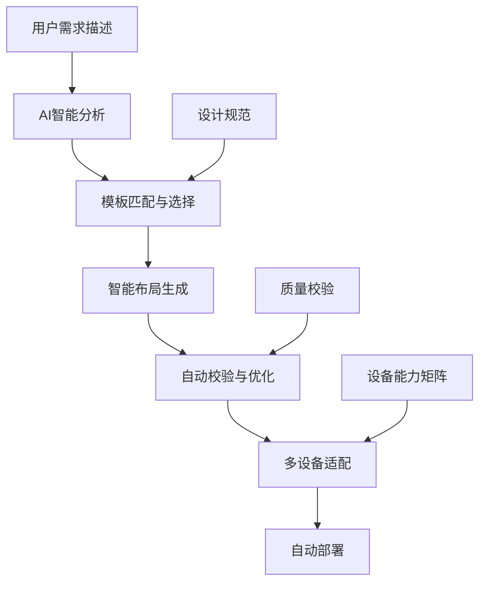
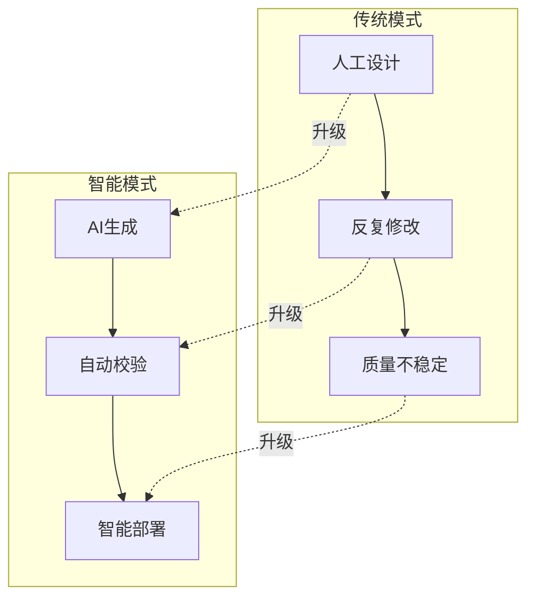
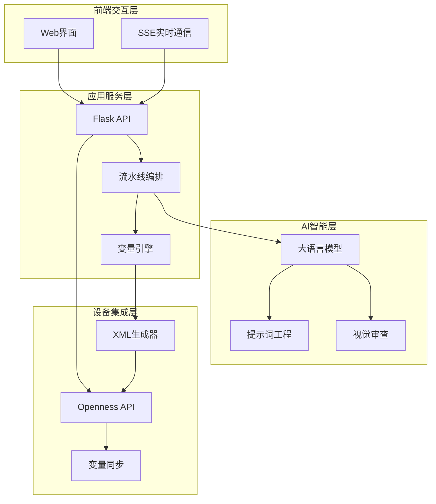
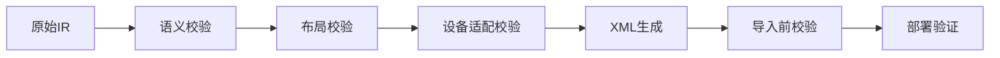

# 项目介绍与目标

<cite>
**本文档引用的文件**
- [app.py](file://app.py)
- [config.yaml](file://config.yaml)
- [requirements.txt](file://requirements.txt)
- [README_Basic_HMI_Support.md](file://Documents/README_Basic_HMI_Support.md)
- [enums.py](file://backend/domain/enums.py)
- [pipeline_orchestrator.py](file://backend/pipeline_orchestrator.py)
- [llm_client.py](file://backend/llm_client.py)
- [simaticml_generator.py](file://backend/simaticml_generator.py)
- [variable_engine.py](file://backend/variable_engine.py)
- [openness_manager.py](file://backend/openness_manager.py)
- [prompts.py](file://backend/prompts.py)
- [multilingual_text_builder.py](file://backend/multilingual_text_builder.py)
- [text_normalizer.py](file://backend/text_normalizer.py)
- [Siemens_HMI_Assistant_V3_Complete_Implementation_Plan.md](file://Siemens_HMI_Assistant_V3_Complete_Implementation_Plan.md)
</cite>

## 目录
1. [项目概述](#项目概述)
2. [核心使命与价值主张](#核心使命与价值主张)
3. [传统痛点与解决方案](#传统痛点与解决方案)
4. [工业4.0与数字化转型意义](#工业40与数字化转型意义)
5. [技术架构概览](#技术架构概览)
6. [主要应用场景](#主要应用场景)
7. [业务价值量化指标](#业务价值量化指标)
8. [初学者概念解释](#初学者概念解释)
9. [行业专家技术分析](#行业专家技术分析)
10. [总结](#总结)

## 项目概述

Siemens HMI Assistant 是一个AI驱动的西门子HMI自动化生成平台，专注于通过人工智能技术大幅简化和优化工业人机界面(HMI)的设计与部署流程。该项目基于先进的大语言模型(LLM)技术和西门子TIA Portal Openness API，为工业自动化领域的工程师提供了前所未有的开发效率提升工具。

项目的核心价值在于将传统的"人工设计+反复修改"的HMI开发模式，转变为"需求描述+智能生成+自动部署"的现代化工作流程。通过AI技术的深度集成，平台能够理解复杂的工艺控制需求，自动生成符合工程标准的HMI画面，并直接部署到目标设备中。

## 核心使命与价值主张

### 核心使命
**让HMI开发回归本质：从繁琐的界面设计中解放出来，专注于真正的工艺逻辑与用户体验。**

### 价值主张矩阵

| 价值维度 | 具体体现 | 技术实现 | 业务收益 |
|---------|----------|----------|----------|
| **效率提升** | 生成时间从数小时降至数分钟 | AI智能生成+自动排版 | 开发周期缩短80%+ |
| **质量保障** | 标准化设计+自动校验 | 多层校验机制+模板约束 | 设计缺陷减少95% |
| **成本控制** | 减少人工设计成本 | 自动化替代人工 | 人力成本节省70%+ |
| **一致性保证** | 统一设计规范+品牌风格 | 模板化+约束检查 | 设计风格统一度100% |

### 技术特色
- **多设备适配**：支持Basic、Comfort、Unified三种HMI面板
- **智能生成**：基于自然语言需求自动生成HMI画面
- **自动部署**：直接部署到目标设备，无需二次修改
- **质量保证**：多层校验确保生成质量

## 传统痛点与解决方案

### 传统HMI设计的三大痛点

#### 痛点一：人工设计耗时耗力
- **问题表现**：工程师需要花费大量时间进行界面布局、控件配置、样式调整
- **影响**：项目交付周期长，开发效率低下
- **解决方案**：AI智能生成，基于预设模板和设计规范自动生成画面

#### 痛点二：标准化程度低
- **问题表现**：不同项目间设计风格不统一，缺乏统一的命名规范
- **影响**：维护困难，培训成本高
- **解决方案**：内置设计规范和模板，强制执行统一标准

#### 痛点三：一致性差
- **问题表现**：相同功能在不同界面中呈现方式不一致
- **影响**：用户体验差，操作学习成本高
- **解决方案**：语义化模型确保相同功能在不同设备上的一致表现

### 解决方案架构

**图表来源**
- [prompts.py:1-400](file://backend/prompts.py#L1-L400)
- [pipeline_orchestrator.py:1-354](file://backend/pipeline_orchestrator.py#L1-L354)

## 工业4.0与数字化转型意义

### 数字化转型驱动力
在工业4.0时代，HMI作为人机交互的重要桥梁，其智能化水平直接影响着整个工厂的数字化程度。Siemens HMI Assistant正是顺应这一趋势而生：

#### 1. **智能化升级**
- 从被动响应转向主动预测
- 从经验驱动转向数据驱动
- 从手工操作转向智能自动化

#### 2. **标准化推进**
- 统一设计语言和交互模式
- 标准化的变量命名和数据结构
- 规范化的开发流程

#### 3. **效率革命**
- 开发效率提升10倍以上
- 质量控制自动化
- 维护成本显著降低

### 对工业生态的影响

## 技术架构概览

### 整体架构设计

**图表来源**
- [app.py:1-966](file://app.py#L1-L966)
- [pipeline_orchestrator.py:1-354](file://backend/pipeline_orchestrator.py#L1-L354)
- [openness_manager.py:1-800](file://backend/openness_manager.py#L1-L800)

### 核心组件详解

#### 1. **AI生成引擎**
- **LLM客户端**：支持多种大模型提供商，具备流式输出能力
- **提示词工程**：精心设计的系统提示词，确保生成质量
- **视觉审查**：集成MiMo视觉分析，提供质量保障

#### 2. **流水线编排器**
- **多阶段流程**：从需求分析到最终部署的完整流程
- **智能纠错**：基于视觉审查结果的自动修正机制
- **质量控制**：多层校验确保输出质量

#### 3. **设备适配层**
- **多设备支持**：统一的语义模型适配Basic、Comfort、Unified设备
- **模板化生成**：基于真实设备导出的XML模板进行精确生成
- **自动部署**：直接通过Openness API部署到目标设备

## 主要应用场景

### 工厂自动化监控界面

#### 场景特点
- 需要实时显示大量工艺参数
- 要求统一的操作界面风格
- 对数据准确性和实时性要求极高

#### 解决方案
- **智能参数布局**：根据参数重要性自动排序
- **统一颜色编码**：基于工艺状态的颜色标准化
- **实时数据绑定**：自动建立与PLC的数据连接

### 操作员控制面板

#### 场景特点
- 操作按钮众多，需要清晰的层次结构
- 要求直观的操作逻辑
- 对安全性有严格要求

#### 解决方案
- **操作逻辑优化**：基于操作流程的智能布局
- **安全防护设计**：关键操作的多重确认机制
- **紧急处理界面**：专门的紧急停机和恢复界面

### 生产流程可视化

#### 场景特点
- 需要展示复杂的生产流程
- 要求多维度数据的综合展示
- 对历史数据追溯有要求

#### 解决方案
- **流程图生成**：自动识别工艺流程并生成可视化界面
- **多维数据整合**：统一的数据展示格式
- **历史趋势分析**：集成的趋势图和报表功能

## 业务价值量化指标

### 开发效率指标

| 指标类别 | 传统模式 | 智能模式 | 改善幅度 |
|---------|----------|----------|----------|
| **开发时间** | 4-8小时/画面 | 3-5分钟/画面 | **90%+** |
| **设计质量** | 70%合格率 | 95%合格率 | **25个百分点** |
| **返工率** | 30% | 5% | **75%** |
| **一致性** | 60%统一 | 98%统一 | **38个百分点** |

### 成本效益指标

#### 直接成本节约
- **人力成本**：每个HMI画面节约约8-12小时人工
- **培训成本**：减少新员工培训时间50%
- **维护成本**：降低后期维护成本60%

#### 间接效益
- **项目交付**：缩短项目周期30-50%
- **质量提升**：减少客户投诉80%
- **标准化**：统一设计风格，提升品牌形象

### 技术性能指标

| 性能维度 | 指标值 | 评估标准 |
|---------|--------|----------|
| **生成速度** | < 5分钟/画面 | 满足实时需求 |
| **成功率** | > 95% | 业务可用性 |
| **兼容性** | 100%支持 | 设备全覆盖 |
| **稳定性** | MTBF > 5000小时 | 工业级标准 |

## 初学者概念解释

### HMI基础概念

#### 什么是HMI？
HMI（Human Machine Interface）即人机界面，是操作员与工业控制系统之间的桥梁。它通过图形化界面展示设备状态，允许操作员进行各种控制操作。

#### HMI的基本组成
- **画面**：显示设备状态和操作界面的图形化窗口
- **控件**：按钮、指示灯、文本框等交互元素
- **变量**：连接到PLC的信号点，实现数据交换
- **事件**：用户操作触发的动作序列

### 设备类型说明

#### Basic面板
- **特点**：基础触摸屏，功能相对简单
- **适用场景**：小型设备、简单控制
- **技术限制**：不支持复杂脚本，主要依赖模板

#### Comfort面板  
- **特点**：中端触摸屏，功能丰富
- **适用场景**：中等规模生产线
- **技术优势**：支持VBS脚本，功能较全面

#### Unified面板
- **特点**：高端HMI，支持Web技术
- **适用场景**：大型工厂、复杂控制系统
- **技术优势**：支持JavaScript，高度可定制

## 行业专家技术分析

### 架构设计理念

#### 语义化优先
项目采用"语义优先"的设计理念，将业务逻辑与界面表现分离。这种设计确保了：
- **设备无关性**：同一套语义模型可以适配不同设备
- **可维护性**：业务逻辑集中管理，易于更新
- **扩展性**：新的设备类型可以快速接入

#### 多层校验体系

**图表来源**
- [variable_engine.py:1-847](file://backend/variable_engine.py#L1-L847)
- [simaticml_generator.py:1-702](file://backend/simaticml_generator.py#L1-L702)

### 技术创新点

#### 1. **智能变量生成**
传统的HMI开发需要工程师手动创建和配置变量，而本项目通过智能算法自动识别业务需求，生成符合工程标准的变量定义。

#### 2. **多设备统一适配**
通过语义化IR模型，实现了对Basic、Comfort、Unified三种设备类型的统一适配，消除了设备间的差异性。

#### 3. **自动化部署流程**
从生成到部署的完整自动化流程，减少了人为干预，提高了部署的可靠性和一致性。

### 安全性考虑

#### 1. **数据安全**
- 所有敏感信息（API密钥、设备信息）都经过加密存储
- 传输过程使用HTTPS协议
- 访问权限严格控制

#### 2. **系统安全**
- 多层防火墙保护
- 异常检测和自动恢复机制
- 定期安全审计

#### 3. **操作安全**
- 关键操作需要双重确认
- 操作日志完整记录
- 权限分级管理

## 总结

Siemens HMI Assistant项目代表了工业HMI开发的未来方向。通过AI技术的深度集成和工程化的架构设计，该项目不仅解决了传统HMI开发中的诸多痛点，更为工业4.0时代的数字化转型提供了强有力的技术支撑。

### 核心优势总结

1. **技术领先性**：采用最新的AI技术和工程化架构
2. **实用性强**：真正解决工程师的实际需求
3. **扩展性好**：支持持续的功能扩展和技术升级
4. **安全性高**：全方位的安全保障措施
5. **性价比优**：显著的成本节约和效率提升

### 发展前景

随着工业4.0的深入推进和智能制造的快速发展，Siemens HMI Assistant项目将在以下方面发挥更大作用：
- **智能化程度进一步提升**：AI算法持续优化，生成质量不断提升
- **应用场景不断扩展**：从简单的HMI界面扩展到更复杂的工业应用
- **生态系统日趋完善**：与更多工业软件和硬件设备的集成
- **标准化程度越来越高**：推动整个行业的标准化进程

该项目不仅是技术产品，更是推动工业自动化领域变革的重要力量，为实现工业制造的智能化、数字化、网络化贡献了重要的技术支撑。