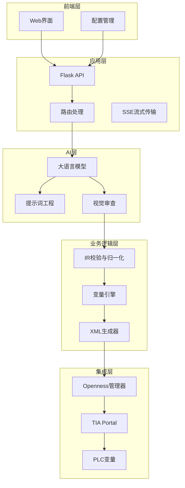
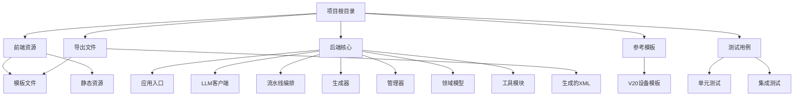
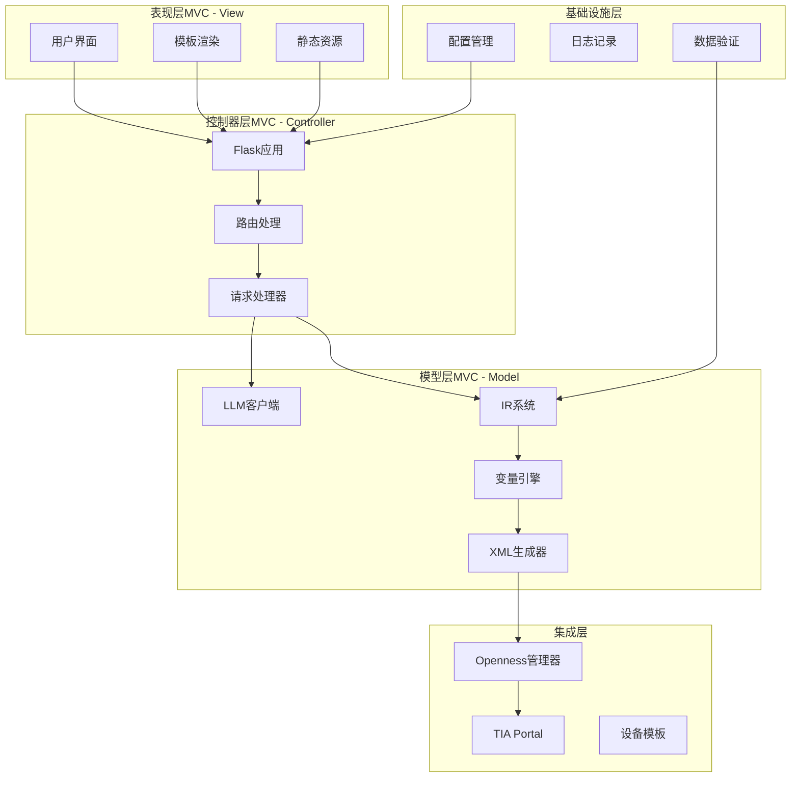
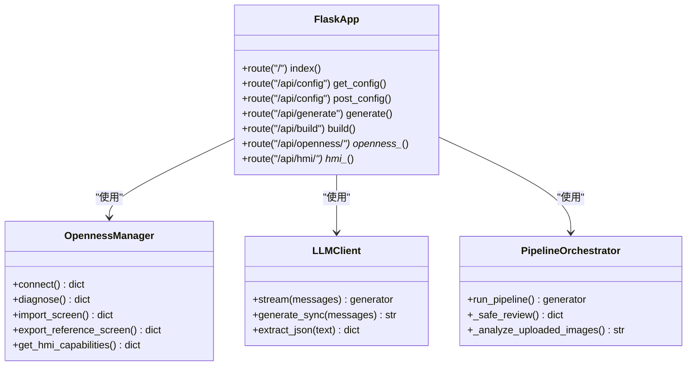
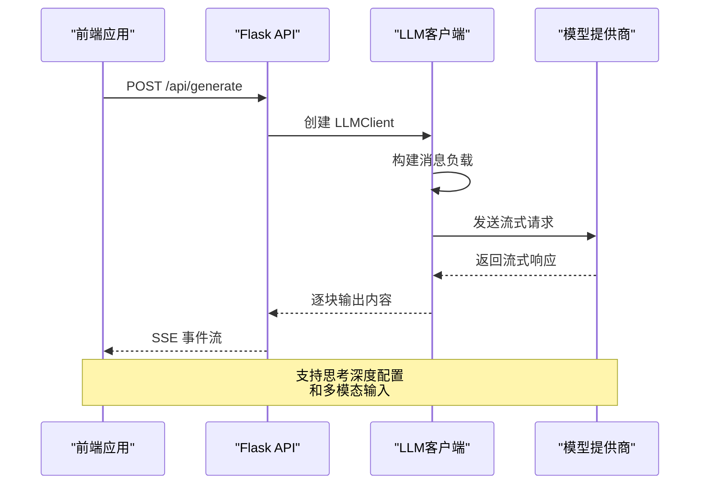
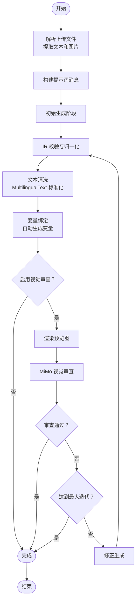
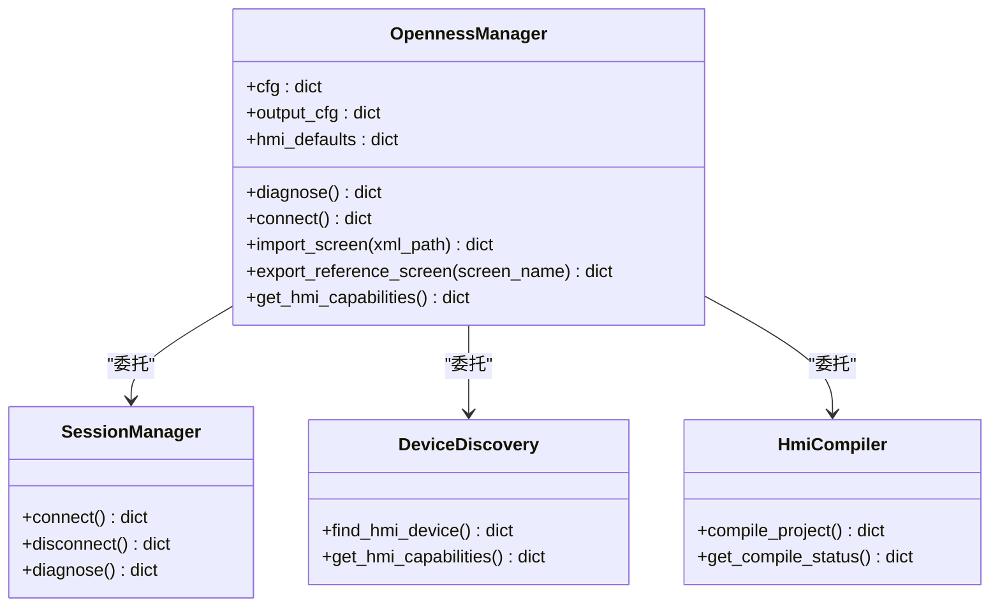
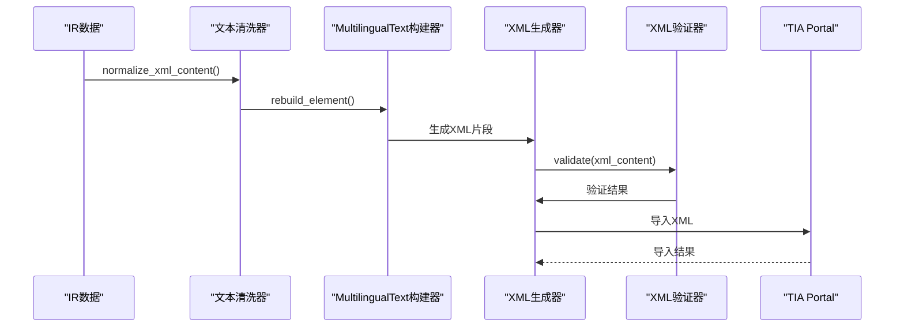
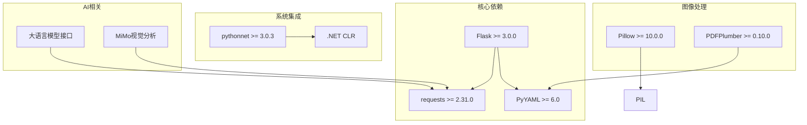

# 项目概述

<cite>
**本文档引用的文件**
- [app.py](file://app.py)
- [config.yaml](file://config.yaml)
- [requirements.txt](file://requirements.txt)
- [index.html](file://templates/index.html)
- [llm_client.py](file://backend/llm_client.py)
- [pipeline_orchestrator.py](file://backend/pipeline_orchestrator.py)
- [simaticml_generator.py](file://backend/simaticml_generator.py)
- [openness_manager.py](file://backend/openness_manager.py)
- [hmi_ir.py](file://backend/hmi_ir.py)
- [variable_engine.py](file://backend/variable_engine.py)
- [multilingual_text_builder.py](file://backend/multilingual_text_builder.py)
- [text_normalizer.py](file://backend/text_normalizer.py)
- [xml_validator.py](file://backend/xml_validator.py)
- [prompts.py](file://backend/prompts.py)
</cite>

## 目录
1. [项目简介](#项目简介)
2. [项目结构](#项目结构)
3. [核心组件](#核心组件)
4. [架构总览](#架构总览)
5. [详细组件分析](#详细组件分析)
6. [依赖关系分析](#依赖关系分析)
7. [性能考虑](#性能考虑)
8. [故障排除指南](#故障排除指南)
9. [结论](#结论)
10. [附录](#附录)

## 项目简介

Siemens HMI Assistant 是一个 AI 驱动的西门子 HMI 自动化生成平台，旨在通过自然语言描述自动生成 HMI 画面。该项目将大语言模型（LLM）与西门子 TIA Portal Openness 技术相结合，实现了从中文需求到可直接导入博途的 HMI XML 的完整自动化流程。

### 核心目标
- **零代码 HMI 生成**：用户只需提供中文自然语言描述，即可自动生成标准化的 HMI 画面
- **工业自动化集成**：无缝对接西门子 TIA Portal 和博途项目，支持多种 HMI 类型（Basic、Comfort、Unified）
- **智能变量绑定**：自动推断变量类型、生成工程化变量表和 VBS 脚本
- **视觉审查增强**：集成 MiMo 视觉审查系统，提供多阶段质量保障

### 技术架构概览
项目采用分层架构设计，结合 MVC 模式，将前端界面、后端 API、AI 模型集成和工业自动化集成有机结合：



**图表来源**
- [app.py:1-966](file://app.py#L1-L966)
- [llm_client.py:1-229](file://backend/llm_client.py#L1-L229)
- [pipeline_orchestrator.py:1-354](file://backend/pipeline_orchestrator.py#L1-L354)

### 主要功能特性
1. **自然语言到 HMI 画面的端到端生成**
2. **多阶段视觉审查与质量保障**
3. **智能变量生成与绑定**
4. **多 HMI 类型支持（Basic/Comfort/Unified）**
5. **实时流式输出与进度反馈**
6. **配置化与可扩展的系统架构**

## 项目结构

项目采用模块化设计，按照功能层次进行组织：



**图表来源**
- [app.py:1-966](file://app.py#L1-L966)
- [config.yaml:1-343](file://config.yaml#L1-L343)

### 核心目录结构说明

- **`backend/`**：后端核心逻辑，包含所有业务逻辑和集成模块
- **`templates/`**：Flask 模板文件，包含前端 HTML 结构
- **`static/`**：静态资源文件（CSS、JavaScript）
- **`exports/`**：生成的 HMI XML 文件导出目录
- **`reference_catalog/`**：设备参考模板目录
- **`tests/`**：单元测试和集成测试文件

**章节来源**
- [app.py:1-966](file://app.py#L1-L966)
- [config.yaml:1-343](file://config.yaml#L1-L343)

## 核心组件

### Flask 应用入口
应用采用 Flask 框架作为 Web 服务器，提供 RESTful API 接口和静态文件服务。

**主要路由功能**：
- `/`：主界面渲染
- `/api/config`：配置读取与保存
- `/api/generate`：流式生成 HMI 画面
- `/api/build`：生成 SimaticML XML
- `/api/openness/*`：博途 Openness 集成接口
- `/api/hmi/*`：HMI 项目部署相关接口

### 大语言模型集成
LLM 客户端支持多种 OpenAI 兼容的模型提供商，包括 DeepSeek、OpenAI 等。

**核心特性**：
- 流式输出支持（SSE）
- 思考深度可配置（关闭/低/中/高）
- 多模态输入支持（文本+图片）
- 错误处理与重试机制

### 多阶段流水线编排
项目实现了复杂的多阶段流水线，包含生成、预览渲染、视觉审查、修正等环节。

**流水线状态机**：
```
pipeline_start → [image_analysis] → generate_start →
review_start → review_result →
  ├─ review_pass → pipeline_done
  ├─ 达到最大迭代 → pipeline_done
  └─ regenerate_start → (回到 generate_start 的下一轮)
```

### HMI IR 校验与归一化
IR（中间表示）系统负责将 LLM 生成的 JSON 转换为标准化的 HMI 描述格式。

**校验规则**：
- 对象类型验证（IOField、Button、Indicator、Text）
- 变量绑定完整性检查
- 布局合理性验证
- 分辨率适配与坐标转换

### 变量引擎
自动变量生成与绑定系统，实现从 HMI 对象到工程变量表的映射。

**变量命名规则**：
- 按钮：BTN_/MEM_ 前缀
- 指示灯：STS_/LMP_ 前缀  
- IO 域：IO_/SIO_ 前缀
- 数据类型自动推断

### SimaticML 生成器
将标准化的 IR 转换为可导入博途的 SimaticML XML 格式。

**XML 生成特性**：
- 支持多种 TIA 版本（V16/V17/V18/V19）
- MultilingualText 标准化处理
- 命名空间自动适配
- 导入前 XML 校验与修复

**章节来源**
- [app.py:1-966](file://app.py#L1-L966)
- [llm_client.py:1-229](file://backend/llm_client.py#L1-L229)
- [pipeline_orchestrator.py:1-354](file://backend/pipeline_orchestrator.py#L1-L354)
- [hmi_ir.py:1-526](file://backend/hmi_ir.py#L1-L526)
- [variable_engine.py:1-847](file://backend/variable_engine.py#L1-L847)
- [simaticml_generator.py:1-702](file://backend/simaticml_generator.py#L1-L702)

## 架构总览

项目采用分层架构设计，结合 MVC 模式，实现了清晰的关注点分离：



**图表来源**
- [app.py:1-966](file://app.py#L1-L966)
- [openness_manager.py:1-2344](file://backend/openness_manager.py#L1-L2344)

### 系统边界
- **内部边界**：项目内的模块化组件和数据流
- **外部边界**：与 TIA Portal、大语言模型服务、文件系统的交互
- **配置边界**：通过 config.yaml 进行系统行为控制

### 数据流模式
1. **需求输入**：用户通过前端界面提供自然语言描述
2. **AI 生成**：LLM 将需求转换为标准化的 IR JSON
3. **数据验证**：IR 校验确保数据完整性与一致性
4. **变量绑定**：变量引擎生成工程化变量表
5. **XML 生成**：SimaticML 生成器创建可导入的 XML 文件
6. **系统集成**：Openness 管理器将 XML 导入到博途项目

**章节来源**
- [index.html:1-466](file://templates/index.html#L1-L466)
- [config.yaml:1-343](file://config.yaml#L1-L343)

## 详细组件分析

### Flask 应用架构

Flask 应用采用模块化设计，将不同功能的路由分离到独立的处理函数中：



**图表来源**
- [app.py:1-966](file://app.py#L1-L966)
- [openness_manager.py:1-2344](file://backend/openness_manager.py#L1-L2344)
- [llm_client.py:1-229](file://backend/llm_client.py#L1-L229)
- [pipeline_orchestrator.py:1-354](file://backend/pipeline_orchestrator.py#L1-L354)

### LLM 客户端实现

LLM 客户端提供了灵活的大语言模型集成接口，支持多种模型提供商：



**图表来源**
- [llm_client.py:1-229](file://backend/llm_client.py#L1-L229)
- [app.py:166-220](file://app.py#L166-L220)

### 多阶段流水线编排

流水线编排器实现了复杂的多阶段处理流程：



**图表来源**
- [pipeline_orchestrator.py:1-354](file://backend/pipeline_orchestrator.py#L1-L354)

### Openness 集成架构

Openness 管理器提供了与 TIA Portal 的深度集成：



**图表来源**
- [openness_manager.py:1-2344](file://backend/openness_manager.py#L1-L2344)

### XML 生成与验证流程

XML 生成器实现了从 IR 到 SimaticML 的完整转换：



**图表来源**
- [simaticml_generator.py:1-702](file://backend/simaticml_generator.py#L1-L702)
- [text_normalizer.py:1-274](file://backend/text_normalizer.py#L1-L274)
- [multilingual_text_builder.py:1-382](file://backend/multilingual_text_builder.py#L1-L382)
- [xml_validator.py:1-330](file://backend/xml_validator.py#L1-L330)

**章节来源**
- [app.py:1-966](file://app.py#L1-L966)
- [openness_manager.py:1-2344](file://backend/openness_manager.py#L1-L2344)
- [simaticml_generator.py:1-702](file://backend/simaticml_generator.py#L1-L702)

## 依赖关系分析

项目采用模块化依赖管理，各组件之间的耦合度较低：



**图表来源**
- [requirements.txt:1-25](file://requirements.txt#L1-L25)

### 外部系统集成

项目与多个外部系统进行集成：

1. **大语言模型服务**：支持 DeepSeek、OpenAI 等多家提供商
2. **MiMo 视觉分析**：提供多阶段视觉审查能力
3. **TIA Portal**：通过 Openness API 进行深度集成
4. **文件系统**：XML 文件的读写与管理

### 循环依赖检测

经过分析，项目中未发现循环依赖关系，各模块职责清晰：

- **前端**：仅依赖 Flask 模板渲染
- **后端**：模块间通过清晰的接口进行通信
- **集成层**：Openness 管理器提供统一的外部系统访问接口

**章节来源**
- [requirements.txt:1-25](file://requirements.txt#L1-L25)

## 性能考虑

### 流式处理优化
- **SSE 流式输出**：前端可以实时接收生成进度
- **分阶段处理**：避免一次性处理大量数据
- **内存管理**：及时释放中间结果和临时对象

### 缓存策略
- **配置缓存**：避免频繁读取配置文件
- **模板缓存**：复用设备模板和样式
- **结果缓存**：对重复请求进行缓存

### 并发处理
- **异步请求**：LLM 调用采用异步方式
- **多线程处理**：图片分析和 XML 生成并行处理
- **连接池管理**：数据库和外部 API 连接池

## 故障排除指南

### 常见问题与解决方案

**1. Openness 连接失败**
- 检查 Windows 系统和 pythonnet 安装
- 验证 Siemens.Engineering.dll 路径正确性
- 确认用户属于 Siemens TIA Openness 用户组

**2. LLM API 调用超时**
- 检查网络连接和代理设置
- 验证 API Key 配置正确
- 调整超时参数和重试机制

**3. XML 导入失败**
- 检查 MultilingualText 结构是否符合 TIA 标准
- 验证 XML 中是否包含非法 HTML 标签
- 确认屏幕尺寸与目标设备匹配

**4. 变量绑定错误**
- 检查 IR 中的 cross-reference 是否完整
- 验证变量类型与数据格式匹配
- 确认变量命名规则符合工程规范

### 调试工具与技巧

**日志记录**：
- 详细的错误日志和堆栈跟踪
- 请求响应的完整记录
- 性能指标的监控和统计

**诊断模式**：
- 非 Windows 环境下的诊断模式
- 配置文件的语法验证
- 依赖项的可用性检查

**章节来源**
- [openness_manager.py:102-139](file://backend/openness_manager.py#L102-L139)
- [xml_validator.py:67-78](file://backend/xml_validator.py#L67-L78)

## 结论

Siemens HMI Assistant 项目成功地将 AI 技术与工业自动化实践相结合，提供了一个完整的 HMI 自动化生成解决方案。项目的主要优势包括：

### 技术创新
- **端到端自动化**：从自然语言到可导入 XML 的完整流程
- **多阶段质量保障**：通过视觉审查确保生成质量
- **智能变量管理**：自动推断变量类型和生成工程化变量表

### 工业实用性
- **广泛兼容性**：支持多种 HMI 类型和 TIA 版本
- **深度集成**：与 TIA Portal 和博途项目无缝集成
- **工程化标准**：遵循西门子工程实践和标准

### 可扩展性
- **模块化设计**：清晰的组件分离和接口定义
- **配置化管理**：通过配置文件控制系统行为
- **插件架构**：支持新的模型提供商和设备类型

该项目为工业自动化领域的数字化转型提供了强有力的技术支撑，显著提高了 HMI 开发效率和质量一致性。

## 附录

### 快速开始指南

1. **安装依赖**
   ```bash
   pip install -r requirements.txt
   ```

2. **配置系统**
   - 设置 LLM API Key
   - 配置 TIA Portal 路径
   - 指定设备模板路径

3. **启动应用**
   ```bash
   python app.py
   ```

4. **访问界面**
   打开浏览器访问 `http://localhost:5000`

### API 参考

**生成接口**
- `POST /api/generate`：流式生成 HMI 画面
- `POST /api/generate/with_review`：带视觉审查的生成
- `POST /api/build`：生成 SimaticML XML

**Openness 集成**
- `GET /api/openness/diagnose`：诊断 Openness 环境
- `POST /api/openness/connect`：连接博途项目
- `POST /api/openness/import`：导入 XML 到博途

**配置管理**
- `GET /api/config`：获取配置
- `POST /api/config`：保存配置
- `POST /api/config/raw`：保存原始 YAML

### 最佳实践

1. **需求描述规范**
   - 使用清晰、具体的自然语言描述
   - 指定必要的技术参数和约束条件
   - 提供相关的工艺背景信息

2. **变量命名约定**
   - 遵循统一的变量命名前缀规则
   - 使用英文标识符和中文注释
   - 保持变量命名的一致性和可读性

3. **布局设计原则**
   - 采用分区式布局结构
   - 确保足够的留白和对比度
   - 考虑不同分辨率的适配性

4. **质量保证流程**
   - 启用视觉审查确保设计质量
   - 进行多轮迭代优化
   - 验证与实际设备的兼容性